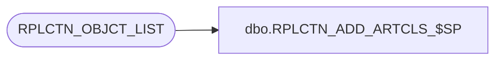

# dbo.RPLCTN_ADD_ARTCLS_$SP

**Database:** auditworks  
**Server:** bedrockdb01  

## Architecture Diagram



## Table Dependencies

| Referenced Table |
|---|
| RPLCTN_OBJCT_LIST |

## Stored Procedure Code

```sql
CREATE proc [dbo].[RPLCTN_ADD_ARTCLS_$SP]
(
  @application_name varchar(100),
  @database_name    varchar(100)
)
AS

DECLARE

  @rpl_user_pwd         sysname,  
  @publication_name     varchar(100),
  @article_name         varchar(100),
  @object_type          varchar(10),
  @error_msg            varchar(1000),
  @exists               int,
  @article_type         varchar(30),
  @SQLString            nvarchar(500),
  @ParmDefinition       nvarchar(500),
  @cursor_open          int,
  @change_required      int
  
BEGIN

  DECLARE create_articles CURSOR FAST_FORWARD FOR
   SELECT OBJCT_NAME, OBJCT_TYPE
     FROM RPLCTN_OBJCT_LIST
    WHERE APLCTN_NAME = @application_name;
    
  /*
    Procedure : RPLCTN_ADD_ARTCLS_$SP
    Purpose   : Add objects required for replication to the publication
    
				Uses table RPLCTN_OBJCT_LIST to get the list of objects for the application

    HISTORY:
    Date     Name         Def# Desc
 
    Dec04,14 Ian K        TBD  Make test for article publication more granular - test for publishing database
    Jul14,14 Ian k             Initial Creation

  */
  
  /* Set up variables */
  
  SELECT @publication_name = @application_name + '_Publication';
  
  /* Flag to determine if anything has actually changed - If nothing no snapshot will be done */
  
  SELECT @change_required = 0;

  /* Get list of Subscribers */

  BEGIN TRY
       
    OPEN create_articles;
  
  END TRY
  BEGIN CATCH
    SELECT @error_msg = 'Failed to open articles cursor - ' + ERROR_MESSAGE();
    GOTO error_handler;
  END CATCH

  BEGIN TRY
        
    FETCH NEXT FROM create_articles
     INTO @article_name, @object_type;
    
  END TRY
  BEGIN CATCH
    SELECT @error_msg = 'Failed to fetch next article record - ' + ERROR_MESSAGE();
    GOTO error_handler;
  END CATCH
                            
  WHILE @@FETCH_STATUS = 0
  BEGIN  

    BEGIN TRY  
    
      /* Add each article */
      
      /* Check to see if the object actually exists */

      SELECT @exists = 0

      BEGIN TRY

        SELECT @exists = 1
          FROM sysobjects
         WHERE name = @article_name;
         
      END TRY
      BEGIN CATCH
        SELECT @error_msg = 'Failed to test for object existance - ' + ERROR_MESSAGE();
        GOTO error_handler;
      END CATCH 
      
      IF @exists <> 1
       BEGIN

        PRINT '                                   Article ' + @article_name + ' does not exist ... Skipping'   
              
       END
      ELSE
       BEGIN

         SELECT @exists = 0
              
         BEGIN TRY
    
			-- Replication configs are apparently stored in the oldest distribution database
			-- regardless of which distributor the publication uses... 
			SELECT TOP 1 @SQLString = name
			FROM sys.databases
			WHERE is_distributor <> 0
			ORDER BY create_date
			;
				
           SET @SQLString = N'SELECT @result = 1 FROM [' + @SQLString + '].dbo.MSarticles
                               WHERE publisher_db = ' + '''' + @database_name + '''' + '
                                 AND article = ' + '''' + @article_name + '''';
              
           SET @ParmDefinition = N'@result int OUTPUT';
      
           EXECUTE sp_executesql @SQLString, @ParmDefinition, @result=@exists OUTPUT; 
      
         END TRY

         BEGIN CATCH
            SELECT @error_msg = 'Failed to execute test for article status - ' + ERROR_MESSAGE();
            GOTO error_handler;
         END CATCH   
      
         SELECT @article_type = 'logbased'
          
         IF @object_type = 'SP'
           SELECT @article_type = 'proc schema only';
         ELSE IF @object_type = 'TB'
           SELECT @article_type = 'logbased';

         IF @exists = 0 OR @exists IS NULL
           BEGIN
        
            SELECT @change_required = 1; 
            
            PRINT '                                   Adding Article ' + @article_name;     
            
              EXEC sp_addarticle @publication = @publication_name, 
                                 @article = @article_name, 
                                 @source_owner = N'dbo', 
                                 @source_object = @article_name, 
                                 @type = @article_type, 
                                 @description = null, 
                                 @creation_script = null, 
                                 @pre_creation_cmd = N'drop', 
                                 @destination_table = @article_name, 
                                 @destination_owner = N'dbo', 
                                 @vertical_partition = N'false',
                                 @force_invalidate_snapshot = 1;
           END
          ELSE
      
              PRINT '                                   Article ' + @article_name + ' already exists - skipping';
      END      
    END TRY
    BEGIN CATCH
      SELECT @error_msg = 'Failed to add article ' + @article_name + ' to publication - ' + ERROR_MESSAGE();
      GOTO error_handler;
    END CATCH
 
    BEGIN TRY
        
      FETCH NEXT FROM create_articles
       INTO @article_name, @object_type;
    
    END TRY
    BEGIN CATCH
      SELECT @error_msg = 'Failed to fetch next article record - ' + ERROR_MESSAGE();
      GOTO error_handler;
    END CATCH
    
  END
  
  CLOSE create_articles;
  DEALLOCATE create_articles;
    
  RETURN @change_required;
	
error_handler:

    IF @cursor_open = 1
    BEGIN
      CLOSE create_articles;
      DEALLOCATE create_articles;      
    END

    IF @@TRANCOUNT > 0 
      ROLLBACK;    
    
    RAISERROR (@error_msg, 16, 1); /* System Errors will be reported with SQL error code = 50000 */

END
```

