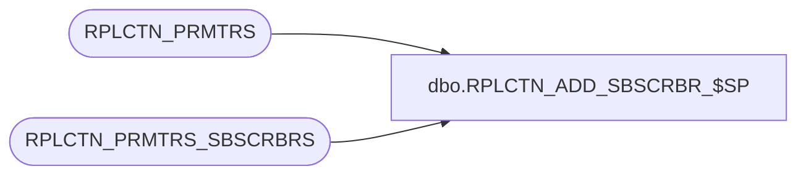

# dbo.RPLCTN_ADD_SBSCRBR_$SP

**Database:** auditworks  
**Server:** bedrockdb01  

## Architecture Diagram



## Table Dependencies

| Referenced Table |
|---|
| RPLCTN_PRMTRS |
| RPLCTN_PRMTRS_SBSCRBRS |

## Stored Procedure Code

```sql
CREATE proc [dbo].[RPLCTN_ADD_SBSCRBR_$SP]
(
  @application_name varchar(100),
  @security_mode    integer,
  @replication_user_pwd sysname,
  @database_name    varchar(100)
)
AS

DECLARE

  @publication_name     varchar(100),
  @subscriber_db_name   varchar(100),
  @subscriber_srvr_name varchar(100),
  @replication_user     varchar(100),
  @error_msg            varchar(1000),
  @exists               int,
  @cursor_open          int,
  @did_something        int  
  
BEGIN

  DECLARE create_subscribers CURSOR FAST_FORWARD FOR
   SELECT SBSCRBR_DB_SRVR_NAME, SBSCRBR_DB_NAME
     FROM RPLCTN_PRMTRS_SBSCRBRS
    WHERE APLCTN_NAME = @application_name;
    
  /*
    Procedure : RPLCTN_ADD_SBSCRBR_$SP
    Purpose   : Add subscribers defined in configuration for the supplied application
    
				Uses table RPLCTN_PRMTRS_SBSCRBRS to get the server, database and replication
				user.
				
				Note that the SAME replication user must exist in all subscriber servers
				mentioned and have the SAME password. This includes the publisher that
				this procedure is running on.
				
				This user must have at the minimum database owner rights at the destination
				database.

    HISTORY:
    Date     Name         Def# Desc
    Jul14,14 Ian k             Initial Creation

  */
  
  /* Set up variables */
  
  SELECT @publication_name = @application_name + '_Publication';
    
  /* Get list of Subscribers */

  BEGIN TRY
        
    SELECT @replication_user = RPLCTN_USER
      FROM RPLCTN_PRMTRS
     WHERE APLCTN_NAME = @application_name;
    
  END TRY
  BEGIN CATCH
    SELECT @error_msg = 'Failed to fetch replication user - ' + ERROR_MESSAGE();
    GOTO error_handler;
  END CATCH
                
  BEGIN TRY
       
    OPEN create_subscribers;
  
  END TRY
  BEGIN CATCH
    SELECT @error_msg = 'Failed to open subscriber cursor - ' + ERROR_MESSAGE();
    GOTO error_handler;
  END CATCH

  SELECT @cursor_open = 1;
  
  BEGIN TRY
        
    FETCH NEXT FROM create_subscribers
     INTO @subscriber_srvr_name,
          @subscriber_db_name;
    
  END TRY
  BEGIN CATCH
    SELECT @error_msg = 'Failed to fetch next subscriber record - ' + ERROR_MESSAGE();
    GOTO error_handler;
  END CATCH
                            
  WHILE @@FETCH_STATUS = 0
  BEGIN  
                  
    BEGIN

        PRINT '                                   Adding Subscriber ' + @subscriber_srvr_name + ' ' + @subscriber_db_name;

    
        BEGIN TRY  
     
          /* Add each subscription */
      
          EXEC sp_addsubscription @publication       = @publication_name,
                                  @article           = N'all', 
                                  @subscriber        = @subscriber_srvr_name, 
                                  @destination_db    = @subscriber_db_name, 
                                  @sync_type         = N'automatic',
                                  @update_mode       = N'read only',
                                  @subscription_type = N'push';

        END TRY
        BEGIN CATCH
          SELECT @error_msg = 'Failed to add subscriber to publication - ' + ERROR_MESSAGE();
          GOTO error_handler;
        END CATCH

    END;

    BEGIN
    
      /* Give the snapshot agent a time to do its job - Temporary fix until job status can be obtained */
          
      WAITFOR DELAY '00:00:30'
        
      PRINT '                                   Adding Subscriber Agent ' + @subscriber_srvr_name + ' ' +  @subscriber_db_name

      BEGIN TRY
      
        IF @security_mode = 0  
       
          EXEC sp_addpushsubscription_agent @publication              = @publication_name, 
                                            @subscriber               = @subscriber_srvr_name, 
                                            @subscriber_db            = @subscriber_db_name,
                                            @job_login                = null, 
                                            @job_password             = null,
                                            @subscriber_security_mode = 0,
                                            @subscriber_login         = @replication_user,
                                            @subscriber_password      = @replication_user_pwd;
        ELSE

          EXEC sp_addpushsubscription_agent @publication              = @publication_name, 
                                            @subscriber               = @subscriber_srvr_name, 
                                            @subscriber_db            = @subscriber_db_name,
                                            @job_login                = null, 
                                            @job_password             = null,
                                            @subscriber_security_mode = 1;
                                                   
      END TRY
      BEGIN CATCH
        SELECT @error_msg = 'Failed to create subscriber agent - ' + ERROR_MESSAGE();
        GOTO error_handler;
      END CATCH
      
    END
     
    BEGIN TRY
        
      FETCH NEXT FROM create_subscribers
       INTO @subscriber_srvr_name,
            @subscriber_db_name;
    
    END TRY
    BEGIN CATCH
      SELECT @error_msg = 'Failed to fetch next subscriber record - ' + ERROR_MESSAGE();
      GOTO error_handler;
    END CATCH
    
  END                                    
  
  CLOSE create_subscribers;
  DEALLOCATE create_subscribers;

  SELECT @cursor_open = 0;
  
  RETURN;
	
error_handler:

    IF @cursor_open = 1
    BEGIN
      CLOSE create_subscribers;
      DEALLOCATE create_subscribers;    
    END

    IF @@TRANCOUNT > 0 
      ROLLBACK;
      
    RAISERROR (@error_msg, 16, 1); /* System Errors will be reported with SQL error code = 50000 */

END
```

