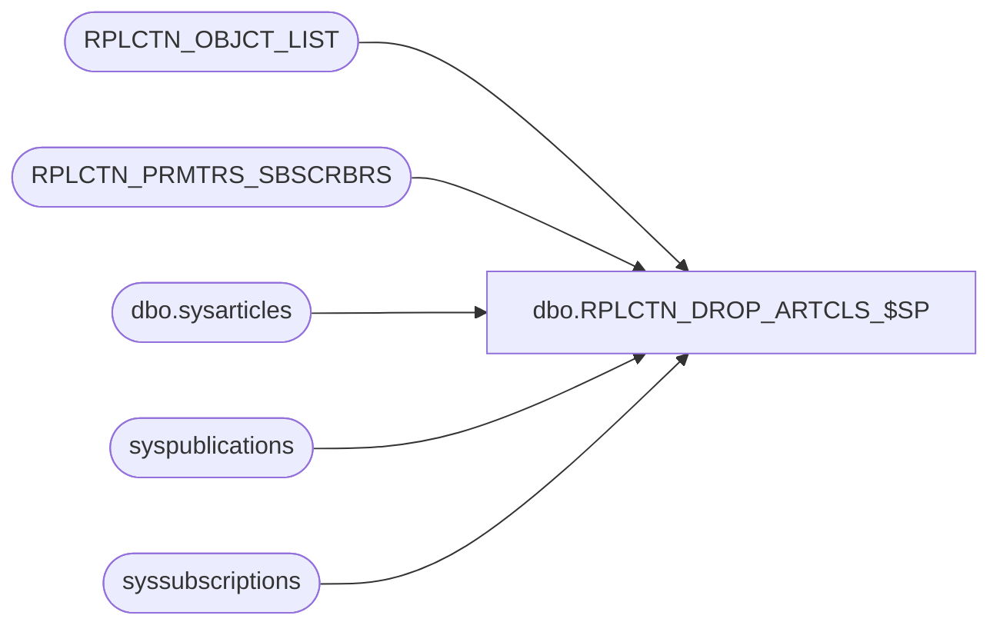

# dbo.RPLCTN_DROP_ARTCLS_$SP

**Database:** auditworks  
**Server:** bedrockdb01  

## Architecture Diagram



## Table Dependencies

| Referenced Table |
|---|
| RPLCTN_OBJCT_LIST |
| RPLCTN_PRMTRS_SBSCRBRS |
| dbo.sysarticles |
| syspublications |
| syssubscriptions |

## Stored Procedure Code

```sql
CREATE proc [dbo].[RPLCTN_DROP_ARTCLS_$SP]
(
  @application_name varchar(100),
  @database_name    varchar(100)
)
AS

DECLARE

  @rpl_user_pwd         sysname,  
  @publication_name     varchar(100),
  @publication_id       int,  
  @article_name         varchar(100),
  @article_id           int,
  @object_type          varchar(10),
  @error_msg            varchar(1000),
  @exists               int,
  @article_type         varchar(30),
  @SQLString            nvarchar(500),
  @ParmDefinition       nvarchar(500),
  @cursor_open          int,
  @change_required      int,
  @subscriber_db_name   varchar(100),
  @subscriber_srvr_name varchar(100)  
  
BEGIN
    
  /*
    Procedure : RPLCTN_DROP_ARTCLS_$SP
    Purpose   : Remove subscriptions to articles removed from the replication object list
    
				Uses table RPLCTN_OBJCT_LIST to get the list of objects for the application

    HISTORY:
    Date     Name         Def# Desc
    Oct09,14 Ian k             Initial Creation

  */
  
  /* Set up variables */

  BEGIN TRY
    
    SELECT @publication_name = @application_name + '_Publication';
  
    SELECT @publication_id = pubid
      FROM syspublications
     WHERE name = @publication_name;

  END TRY
  BEGIN CATCH
    SELECT @error_msg = 'Failed to set up publication details - ' + ERROR_MESSAGE();
    GOTO error_handler;
  END CATCH

  DECLARE check_articles CURSOR FAST_FORWARD FOR
   SELECT name, artid
     FROM dbo.sysarticles
    WHERE pubid = @publication_id;
      
  /* Flag to determine if anything has actually changed - If nothing no snapshot will be done */
  
  SELECT @change_required = 0;

  /* Get list of currently subscribed articles */
  
  BEGIN TRY
       
    OPEN check_articles;
  
  END TRY
  BEGIN CATCH
    SELECT @error_msg = 'Failed to open articles cursor - ' + ERROR_MESSAGE();
    GOTO error_handler;
  END CATCH

  BEGIN TRY
        
    FETCH NEXT FROM check_articles
     INTO @article_name, @article_id;
    
  END TRY
  BEGIN CATCH
    SELECT @error_msg = 'Failed to fetch next article record - ' + ERROR_MESSAGE();
    GOTO error_handler;
  END CATCH
                            
  WHILE @@FETCH_STATUS = 0
  BEGIN  
    
    /* Check to see if the article is still in the replication object list */

    SELECT @exists = 0;

    BEGIN TRY

      SELECT @exists = 1
        FROM RPLCTN_OBJCT_LIST
       WHERE OBJCT_NAME = @article_name
         AND APLCTN_NAME = @application_name;
         
    END TRY
    BEGIN CATCH
      SELECT @error_msg = 'Failed to test for object existance - ' + ERROR_MESSAGE();
      GOTO error_handler;
    END CATCH
          
    IF @exists <> 1
    BEGIN

      SELECT @change_required = 1; 
            
      PRINT '                                   Removing Article ' + @article_name;     

      /* Remove subscriptions first */
      
      DECLARE remove_subscribers CURSOR FAST_FORWARD FOR
       SELECT SBSCRBR_DB_SRVR_NAME, SBSCRBR_DB_NAME
         FROM RPLCTN_PRMTRS_SBSCRBRS
        WHERE APLCTN_NAME = @application_name;        
      
      BEGIN TRY
       
        OPEN remove_subscribers;
  
      END TRY
      BEGIN CATCH
        SELECT @error_msg = 'Failed to open remove_subscribers cursor - ' + ERROR_MESSAGE();
        GOTO error_handler;
      END CATCH      

      BEGIN TRY
        
        FETCH NEXT FROM remove_subscribers
         INTO   @subscriber_srvr_name ,
                @subscriber_db_name;
    
      END TRY
      BEGIN CATCH
        SELECT @error_msg = 'Failed to fetch next subscriber record - ' + ERROR_MESSAGE();
        GOTO error_handler;
      END CATCH
                            
      WHILE @@FETCH_STATUS = 0
      BEGIN 
      
        IF EXISTS (SELECT 1
                     FROM syssubscriptions
                    WHERE artid = @article_id
                      AND dest_db = @subscriber_db_name
                      AND srvname = @subscriber_srvr_name)
        BEGIN
      
          BEGIN TRY
        
            EXEC sp_dropsubscription @publication    = @publication_name,
                                     @article        = @article_name,
                                     @subscriber     = @subscriber_srvr_name,
                                     @destination_db = @subscriber_db_name       
          END TRY
      
          BEGIN CATCH
            SELECT @error_msg = 'Failed to remove subscription to article ' + @article_name + ' - ' + ERROR_MESSAGE();
            GOTO error_handler;
          END CATCH
        END              
 
        BEGIN TRY
        
          FETCH NEXT FROM remove_subscribers
           INTO   @subscriber_srvr_name ,
                  @subscriber_db_name;
    
        END TRY
        BEGIN CATCH
          SELECT @error_msg = 'Failed to fetch next article record - ' + ERROR_MESSAGE();
          GOTO error_handler;
        END CATCH
                   
      END

      CLOSE remove_subscribers;
      DEALLOCATE remove_subscribers; 
              
      BEGIN TRY
            
        EXEC sp_droparticle @publication = @publication_name, 
                            @article = @article_name,
                            @force_invalidate_snapshot = 1;

      END TRY
      BEGIN CATCH
        SELECT @error_msg = 'Failed to drop article ' + @article_name + ' from publication - ' + ERROR_MESSAGE();
        GOTO error_handler;
      END CATCH
 
    END
    
    BEGIN TRY
        
      FETCH NEXT FROM check_articles
       INTO @article_name, @article_id;
    
    END TRY
    BEGIN CATCH
      SELECT @error_msg = 'Failed to fetch next article record - ' + ERROR_MESSAGE();
      GOTO error_handler;
    END CATCH
    
  END
  
  CLOSE check_articles;
  DEALLOCATE check_articles;

  IF @change_required = 0
      PRINT '                                  No Articles need removing ..... Skipping';
    
  RETURN @change_required;
	
error_handler:

    IF @cursor_open = 1
    BEGIN
      CLOSE check_articles;
      DEALLOCATE check_articles;      
    END

    IF @@TRANCOUNT > 0 
      ROLLBACK;    
    
    RAISERROR (@error_msg, 16, 1); /* System Errors will be reported with SQL error code = 50000 */

END
```

