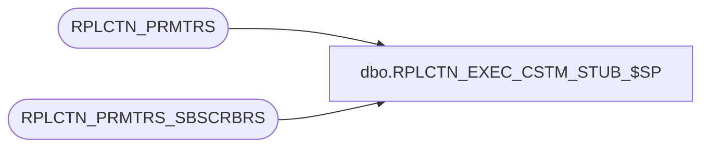

# dbo.RPLCTN_EXEC_CSTM_STUB_$SP

**Database:** auditworks  
**Server:** bedrockdb01  

## Architecture Diagram



## Table Dependencies

| Referenced Table |
|---|
| RPLCTN_PRMTRS |
| RPLCTN_PRMTRS_SBSCRBRS |

## Stored Procedure Code

```sql
CREATE PROC [dbo].[RPLCTN_EXEC_CSTM_STUB_$SP]
       @application_name  nvarchar(100),
       @start_time        datetime = NULL
AS
DECLARE

  /* Proc Name: RPLCTN_EXEC_CSTM_STUB_$SP
     Desc: A stub proc that is executed on the publisher after replication (re)initialization.

           Typically this will be to retore custom triggers on the subscriber if a
           snapshot has overwritten the data on re-initialize

     HISTORY:

     Date       Name    Def#      Desc
     Aug21,14   Ian K             Initial Creation
     2014 1010  JHardin           Make wait-for-sync smarter
     2014 1027  JHardin           Skip custom SP call on obsolete replicants


 */

  @subscriber_srvr_name nvarchar(100),
  @subscriber_db_name   nvarchar(100),
  @error_msg            nvarchar(1000),
  @tries                integer,
  @time_out             integer,
  @publisher_srvr_name  nvarchar(100),
  @publisher_db_name    nvarchar(100),
  @distributor_db_name  nvarchar(100),
  @distributor_db_id    integer,
  @distributor_found    integer,
  @has_custom_sp        integer,
  @subscriber_id        integer,
  @max_subscriber_id    integer,
  @agent_name           nvarchar(256),
  @sync_completed       integer,
  @sql                  nvarchar(2048)
;

DECLARE
  @t_subscribers        TABLE(
                          subscriber_id   integer NOT NULL IDENTITY PRIMARY KEY,
                          sub_server_name nvarchar(100) NOT NULL,
                          sub_db_name     nvarchar(100) NOT NULL,
                          agent_name      nvarchar(512) NOT NULL,
                          dist_db_name    nvarchar(100) NULL
                        );

BEGIN

  /* Loop through each application and execute the RPLCTN_CSTM_ALLAPPS_$SP remotely */

  IF @start_time IS NULL
  BEGIN
     -- Caller didn't say when replication install started, guess
     -- Assume an INSTALL has not been run within the last N minutes
     -- If one was, we may see the "sync completed" message from that pass :(
     SET @start_time = DATEADD(minute, -3, GETDATE())
  END;

  SET NOCOUNT ON;

  SELECT
    @time_out = COALESCE(TIME_OUT, 90), -- default patience for sync: 90 minutes
    @publisher_srvr_name = APLCTN_SRVR_NAME,
    @publisher_db_name = APLCTN_DB_NAME
  FROM
    RPLCTN_PRMTRS
  WHERE
    APLCTN_NAME = @application_name
  ;

  BEGIN TRY
    INSERT INTO
      @t_subscribers(
        sub_server_name,
        sub_db_name,
        agent_name
      )
    SELECT
      SBSCRBR_DB_SRVR_NAME,
      SBSCRBR_DB_NAME,
      REPLACE(@publisher_srvr_name + '-' + @publisher_db_name + '-' + SBSCRBR_DB_SRVR_NAME + '-[0-9]%', '_', '!_')
    FROM
      RPLCTN_PRMTRS_SBSCRBRS
    WHERE
      APLCTN_NAME = @application_name
    ;
  END TRY
  BEGIN CATCH
    SET @error_msg = 'Failed to build subscriber worklist ' + ERROR_MESSAGE();
    GOTO error_handler;
  END CATCH;

  SET @tries = 0;

  WHILE EXISTS(SELECT 1 FROM @t_subscribers)
  BEGIN
    IF @time_out > 0 AND @tries > @time_out
    BEGIN
      SET @error_msg = 'Waiting too long for synchronization - custom procs not executed - ' + ERROR_MESSAGE();
      GOTO error_handler;
    END;

    SELECT
      @subscriber_id = MIN(subscriber_id),
      @max_subscriber_id = MAX(subscriber_id)
    FROM
      @t_subscribers
    ;

    IF @subscriber_id IS NULL
    BEGIN
      -- Got them all, done.
      BREAK;
    END;

    PRINT '              Checking sync status at ' + CAST(GETDATE() AS varchar(32));

    WHILE @subscriber_id <= @max_subscriber_id
    BEGIN
      SET @distributor_db_name = NULL;

      SELECT
        @subscriber_srvr_name = sub_server_name,
        @subscriber_db_name = sub_db_name,
        @agent_name = agent_name,
        @distributor_db_name = dist_db_name
      FROM
        @t_subscribers
      WHERE
        subscriber_id = @subscriber_id
      ;

      IF @agent_name IS NOT NULL
      BEGIN
        -- Found a replication to check

        -- Verify whether remote SP is present
        -- We don't need to wait for initial sync if it is not.
        BEGIN TRY
          SET @has_custom_sp = NULL;
          SET @sql = N'
            SELECT DISTINCT
              @has_custom_sp = 1
            FROM
              [' + @subscriber_srvr_name + N'].[' + @subscriber_db_name + N'].sys.procedures
            WHERE
              name = ''RPLCTN_CSTM_ALLAPPS_$SP''
            ';
          EXEC sp_executesql @sql,
            N'
              @subscriber_srvr_name nvarchar(100),
              @subscriber_db_name   nvarchar(100),
              @has_custom_sp        integer OUTPUT
            ',
            @subscriber_srvr_name,
            @subscriber_db_name,
            @has_custom_sp OUTPUT
          ;

          IF COALESCE(@has_custom_sp, 0) <> 1
          BEGIN
            -- subscriber does not have the replication customization SP
            -- CRDM DBI probably should be applied there!
            PRINT 'Subscriber ' + @subscriber_db_name + '@' + @subscriber_srvr_name + ' does not have replication SPs. Does CRDM DBI need to be installed there?';
            PRINT 'Skipping custom SP execution at ' + @subscriber_db_name + '@' + @subscriber_srvr_name;
            DELETE FROM
              @t_subscribers
            WHERE
              subscriber_id = @subscriber_id
            ;
            SET @subscriber_id = @subscriber_id + 1;
            CONTINUE;
          END;
        END TRY
        BEGIN CATCH
          SET @error_msg = 'Failed to query remote server ' + @subscriber_db_name + '@' + @subscriber_srvr_name + ' - ' + ERROR_MESSAGE();
          GOTO error_handler;
        END CATCH;

        IF @distributor_db_name IS NULL
        BEGIN
          -- The distributor log for this application is NOT necessarily in the distributor database
          -- created for this application. The log for all applications appears to be in
          -- the distributor database that was created first, but DO NOT assume that the logs
          -- are all in the same distributor database.
          -- Go looking for the distributor database that has the agent we want.
          SET @distributor_db_id = -1;
          WHILE @distributor_db_id IS NOT NULL
          BEGIN
            SET @distributor_found = 0;

            SELECT TOP 1
              @distributor_db_id = database_id,
              @distributor_db_name = name
            FROM
              sys.databases
            WHERE
              database_id > @distributor_db_id
            AND
              is_distributor <> 0
            ORDER BY
              database_id
            ;

            IF @distributor_db_id IS NULL
            BEGIN
              SET @error_msg = 'Failed to locate distributor database containing replication logs ' + ERROR_MESSAGE();
              GOTO error_handler;
            END
            ELSE
            BEGIN
              BEGIN TRY
                SET @sql = N'
                  SELECT DISTINCT
                    @distributor_found = 1
                  FROM
                    [' + @distributor_db_name + N'].dbo.MSdistribution_agents a
                  WHERE
                    a.name LIKE @agent_name ESCAPE ''!''
                  AND
                    a.publisher_db = @publisher_db_name
                  AND
                    a.subscriber_db = @subscriber_db_name
                  ';
                EXEC sp_executesql @sql,
                  N'
                    @start_time           datetime,
                    @agent_name           nvarchar(256),
                    @distributor_db_name  nvarchar(100),
                    @publisher_db_name    nvarchar(100),
                    @subscriber_db_name   nvarchar(100),
                    @distributor_found    integer OUTPUT
                  ',
                  @start_time,
                  @agent_name,
                  @distributor_db_name,
                  @publisher_db_name,
                  @subscriber_db_name,
                  @distributor_found OUTPUT
                ;
              END TRY
              BEGIN CATCH
                SET @error_msg = 'Failed to query replication status for ' + @subscriber_db_name + '@' + @subscriber_srvr_name + ' - ' + ERROR_MESSAGE();
                GOTO error_handler;
              END CATCH;

              IF @distributor_found <> 0
              BEGIN
                -- Remember it
                UPDATE
                  @t_subscribers
                SET
                  dist_db_name = @distributor_db_name
                WHERE
                  subscriber_id = @subscriber_id
                ;
                BREAK;
              END;
            END;
          END;
        END;

        SET @sync_completed = NULL;
        BEGIN TRY
          SET @sql = N'
            SELECT DISTINCT
              @sync_completed = 1
            FROM
              [' + @distributor_db_name + N'].dbo.MSdistribution_agents a
              INNER JOIN [' + @distributor_db_name + N'].dbo.MSdistribution_history h ON
                h.agent_id = a.id
                AND
                h.time > @start_time
                AND
                h.comments LIKE ''Delivered snapshot %''
            WHERE
              a.name LIKE @agent_name ESCAPE ''!''
            AND
              a.publisher_db = @publisher_db_name
            AND
              a.subscriber_db = @subscriber_db_name
            ';
          EXEC sp_executesql @sql,
            N'
              @start_time           datetime,
              @agent_name           nvarchar(256),
              @distributor_db_name  nvarchar(100),
              @publisher_db_name    nvarchar(100),
              @subscriber_db_name   nvarchar(100),
              @sync_completed       integer OUTPUT
            ',
            @start_time,
            @agent_name,
            @distributor_db_name,
            @publisher_db_name,
            @subscriber_db_name,
            @sync_completed OUTPUT
          ;
        END TRY
        BEGIN CATCH
          SET @error_msg = 'Failed to query replication status for ' + @subscriber_db_name + '@' + @subscriber_srvr_name + ' - ' + ERROR_MESSAGE();
          GOTO error_handler;
        END CATCH;

        IF @sync_completed IS NULL
        BEGIN
          PRINT '              Sync to ' + @subscriber_db_name + '@' + @subscriber_srvr_name + ' still underway...';
        END
        ELSE
        BEGIN
          PRINT '              Executing custom procedures on ' + @subscriber_db_name + '@' + @subscriber_srvr_name + ' at ' + CAST(GETDATE() AS varchar(32));

          BEGIN TRY
            SET @sql = N'EXEC [' + @subscriber_srvr_name + N'].' +
                       N'[' + @subscriber_db_name + N'].' +
                       N'dbo.RPLCTN_CSTM_ALLAPPS_$SP';

            EXEC sp_executesql @sql;
            PRINT '              Completed custom procedures on ' + @subscriber_db_name + '@' + @subscriber_srvr_name + ' at ' + CAST(GETDATE() AS varchar(32));
          END TRY
          BEGIN CATCH
            SET @error_msg = 'Failed to execute custom stored procedures on ' + @subscriber_db_name + '@' + @subscriber_srvr_name + ' - ' + ERROR_MESSAGE();
            GOTO error_handler;
          END CATCH;

          DELETE FROM
            @t_subscribers
          WHERE
            subscriber_id = @subscriber_id
          ;
        END;
      END;

      SET @subscriber_id = @subscriber_id + 1;
    END;

    SET @tries = @tries + 1;
    WAITFOR DELAY '00:01:00';
  END;

  RETURN;

error_handler:

  IF @@TRANCOUNT > 0
  BEGIN
    ROLLBACK;
  END;

  RAISERROR (@error_msg, 16, 1); /* System Errors will be reported with SQL error code = 50000 */

END;
```

