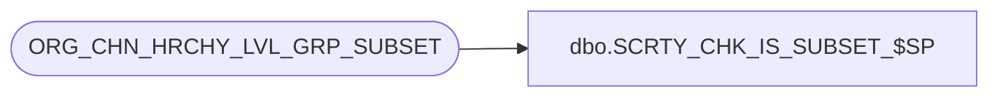

# dbo.SCRTY_CHK_IS_SUBSET_$SP

**Database:** auditworks  
**Server:** bedrockdb01  

## Architecture Diagram



## Table Dependencies

| Referenced Table |
|---|
| ORG_CHN_HRCHY_LVL_GRP_SUBSET |

## Stored Procedure Code

```sql
CREATE PROC dbo.SCRTY_CHK_IS_SUBSET_$SP
/**********************************************************************************************
				Is set 2 a subset (full or partial) of set 1?

Return Value:	1 (True) -	if 2nd parameter represents a subset (possibly equal set)
							of set passed in 1st parameter;
				0 (False) -	otherwise.

Created By:		JHardin
Create Date:	2011 0107

Remarks:		Result always 'True' for 1st parameter = -1 (Global set).

***********************************************************************************************
UPDATES:
2012 0613 JHardin	CRDM merge final renaming, cosmetic cleanup

***********************************************************************************************/
	@OCG_SET_ID		int,
	@OCG_SUBSET_ID	int
AS
BEGIN
	SET NOCOUNT ON;

	IF @OCG_SET_ID = -1
	BEGIN
		-- 1st set is Global, all are subsets
		-- Don't need to hit the database for that
		SELECT 1;
		RETURN 1;
	END;

	IF @OCG_SET_ID = @OCG_SUBSET_ID
	BEGIN
		-- Sets are same
		-- Don't need to hit the database for that
		SELECT 1;
		RETURN 1;
	END;

	IF EXISTS(
		SELECT 1
		FROM ORG_CHN_HRCHY_LVL_GRP_SUBSET
		WHERE HRCHY_LVL_GRP_SET_ID = @OCG_SET_ID
		AND HRCHY_LVL_GRP_SUBSET_ID = @OCG_SUBSET_ID
	)
	BEGIN
		SELECT 1;
		RETURN 1;
	END;

	SELECT 0;
	RETURN 0;

END;
```

