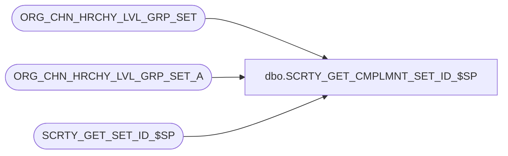

# dbo.SCRTY_GET_CMPLMNT_SET_ID_$SP

**Database:** auditworks  
**Server:** bedrockdb01  

## Architecture Diagram



## Table Dependencies

| Referenced Table |
|---|
| ORG_CHN_HRCHY_LVL_GRP_SET |
| ORG_CHN_HRCHY_LVL_GRP_SET_A |
| SCRTY_GET_SET_ID_$SP |

## Stored Procedure Code

```sql
CREATE PROC dbo.SCRTY_GET_CMPLMNT_SET_ID_$SP
/**********************************************************************************************
				Returns members of A that are not in B (the relative complement of B in A)
				(http://upload.wikimedia.org/wikipedia/commons/thumb/e/e6/Venn0100.svg/220px-Venn0100.svg.png)
Return Value:	set id of A - B
				Returns 0 if A = B, A < B or other error

Created By:		JHardin

***********************************************************************************************
UPDATES:
2012 0613 JHardin	CRDM merge final renaming, cleanup

***********************************************************************************************/
(
	@OCG_SET_ID_a	integer,
	@OCG_SET_ID_b	integer,
	@appID			smallint
)
AS
BEGIN

DECLARE
	@complementId		integer,
	@tempComma			varchar(1),
	@tempDivisionId		varchar(10),
	@tempDivisionList	varchar(max);

DECLARE		@set_a		TABLE(division_id smallint);

SET NOCOUNT ON;

-- sanity check the values
IF
	@OCG_SET_ID_a IS NULL
	OR
	@OCG_SET_ID_b IS NULL
	OR
	@OCG_SET_ID_b = -1		-- can't not be in the global set (A is always <= B)
	OR
	(@OCG_SET_ID_a <> -1 AND NOT EXISTS(SELECT 1 FROM ORG_CHN_HRCHY_LVL_GRP_SET WHERE HRCHY_LVL_GRP_SET_ID = @OCG_SET_ID_a))
	OR
	(@OCG_SET_ID_b <> -1 AND NOT EXISTS(SELECT 1 FROM ORG_CHN_HRCHY_LVL_GRP_SET WHERE HRCHY_LVL_GRP_SET_ID = @OCG_SET_ID_b))
	OR
	@OCG_SET_ID_a = @OCG_SET_ID_b		-- shortcut this
BEGIN
	RETURN 0;
END;

INSERT INTO
	@set_a(division_id)
SELECT
	HRCHY_LVL_GRP_IDNTY
FROM
	ORG_CHN_HRCHY_LVL_GRP_SET_A dsda
WHERE
	HRCHY_LVL_GRP_SET_ID = @OCG_SET_ID_a
AND
	NOT EXISTS(
		SELECT 1
		FROM ORG_CHN_HRCHY_LVL_GRP_SET_A dsdb
		WHERE dsdb.HRCHY_LVL_GRP_SET_ID = @OCG_SET_ID_b
		AND dsdb.HRCHY_LVL_GRP_IDNTY = dsda.HRCHY_LVL_GRP_IDNTY
	)
;

IF @@rowcount < 1
BEGIN
	-- Empty relative complement (A = B or A < B)
	RETURN 0;
END;

-- Slick! Make a comma delimited string in a single simple query!
SET CONCAT_NULL_YIELDS_NULL ON;
SET @tempDivisionList = NULL;
SELECT @tempDivisionList = COALESCE(@tempDivisionList + ',', '') + CAST(division_id AS varchar(10))
FROM @set_a
ORDER BY division_id ASC
;

EXEC @complementId = SCRTY_GET_SET_ID_$SP @tempDivisionList, NULL, -1, @appID;

RETURN @complementId;

END;
```

