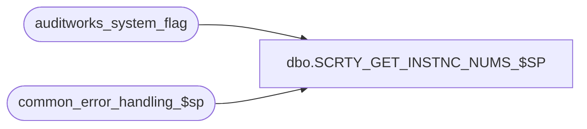

# dbo.SCRTY_GET_INSTNC_NUMS_$SP

**Database:** auditworks  
**Server:** bedrockdb01  

## Architecture Diagram



## Table Dependencies

| Referenced Table |
|---|
| auditworks_system_flag |
| common_error_handling_$sp |

## Stored Procedure Code

```sql
create proc dbo.SCRTY_GET_INSTNC_NUMS_$SP 
(@tableName nvarchar(100), @instances nvarchar(3000) OUTPUT)

AS

/* 
 Procedure : SCRTY_GET_INSTNC_NUMS_$SP
 Descr: This procedure will provide the front-end a list of instances followed by commas based on their audit group.
	The table being passed in contains a list of stores belonging to the audit group.
	Called by n-tier.

HISTORY:  
Date     Name           Def# Desc
Dec19,10 Paul         105313 Use unicode datatypes
Feb12,09 Paul         107623 handle null in @instances being passed in
Jul18,05 Sab	     DV-1295 Added return values when table is empty or scaleout is turned off
May30,05 Sab	     DV-1254 Author

*/

DECLARE
  @errmsg				nvarchar(255),
  @errno				int,
  @message_id				int,
  @object_name				nvarchar(255),
  @operation_name			nvarchar(100),
  @process_name				nvarchar(100),
  @rows					int,
  @scaleout_flag			int,
  @string				nvarchar(2000)

SELECT  @process_name = 'SCRTY_GET_INSTNC_NUMS_$SP',
	@message_id = 201068

SELECT @scaleout_flag = CONVERT(int,flag_numeric_value)
  FROM auditworks_system_flag
 WHERE flag_name = 'scaleout_flag'

SELECT @rows = @@rowcount, @errno = @@error
IF @errno != 0
  BEGIN
    SELECT @errmsg = 'Failed to select scaleout_flag from auditworks_system_flag',
           @object_name = 'auditworks_system_flag',
          @operation_name = 'SELECT'
    GOTO error
  END

IF @scaleout_flag = 0 OR @rows = 0
 BEGIN
  SELECT @instances= '-1'
  RETURN
 END

-- Create a temp table to hold all the instances
CREATE TABLE #instances (instance_id integer not null)

-- Get a list of unique instances from the work table and dw_store_status
SET @string = N'insert into #instances select DISTINCT instance_id from ' + @tableName
 + ', dw_store_status where ORG_CHN_NUM = store_no'
EXEC sp_executesql @string

IF @instances IS NULL
  SELECT @instances = ' '

-- convert all the instances to a column using recursive function.
SELECT @instances = @instances + CONVERT(nvarchar(10),instance_id) + ',' FROM #instances

DROP TABLE #instances

IF @instances IS NULL OR @instances = ' '
  BEGIN
   SELECT @instances = '-2'
   RETURN
  END

-- remove leading blank if present
SELECT @instances = LTRIM(@instances)

-- Remove the last character which is a comma
SELECT @instances = SUBSTRING(@instances, 1, LEN(@instances)-1)

RETURN

error:
	EXEC common_error_handling_$sp 4, @errno, @errmsg, 0, @message_id, @process_name,
	     @object_name, @operation_name, 1, 0, 0, null, 0, null, null,
	     null, null, null, null, 0

	RETURN
```

