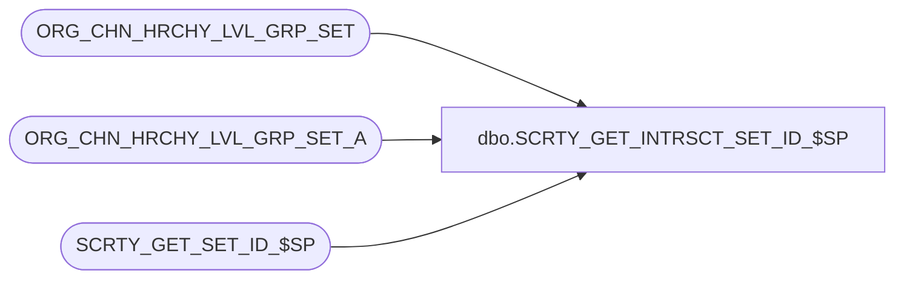

# dbo.SCRTY_GET_INTRSCT_SET_ID_$SP

**Database:** auditworks  
**Server:** bedrockdb01  

## Architecture Diagram



## Table Dependencies

| Referenced Table |
|---|
| ORG_CHN_HRCHY_LVL_GRP_SET |
| ORG_CHN_HRCHY_LVL_GRP_SET_A |
| SCRTY_GET_SET_ID_$SP |

## Stored Procedure Code

```sql
CREATE PROC dbo.SCRTY_GET_INTRSCT_SET_ID_$SP
/**********************************************************************************************
				Returns a intersection of two sets
Return Value:	set_id of intersection
				Returns 0 if none found

Created By:		ABida

Returned value represents an exact and unique intersection of two given sets

***********************************************************************************************
UPDATES:
2012 0613 JHardin	CRDM merge final renaming, cleanup

***********************************************************************************************/
(
	@OCG_SET_ID_1	int,
	@OCG_SET_ID_2 	int,
	@appID			smallint
)
AS
BEGIN

DECLARE
	@intersectId		int,
	@tempComma			varchar(1),
	@tempDivision		varchar(10),
	@tempDivisionId		smallint,
	@tempDivisionList	varchar(max)
;

SET NOCOUNT ON;

-- sanity check the values
IF @OCG_SET_ID_1 IS NULL
	OR
	@OCG_SET_ID_2 IS NULL
	OR
	NOT EXISTS (
		SELECT 1 FROM ORG_CHN_HRCHY_LVL_GRP_SET WHERE HRCHY_LVL_GRP_SET_ID = @OCG_SET_ID_1
	)
	OR
	NOT EXISTS (
		SELECT 1 FROM ORG_CHN_HRCHY_LVL_GRP_SET WHERE HRCHY_LVL_GRP_SET_ID = @OCG_SET_ID_2
	)
BEGIN
	RETURN 0;
END
-- global division set always contains another one
ELSE IF @OCG_SET_ID_1 = -1
BEGIN
	RETURN @OCG_SET_ID_2;
END
ELSE IF @OCG_SET_ID_2 = -1
BEGIN
	RETURN @OCG_SET_ID_1;
END;

SET @tempDivisionList = '';
SET @tempComma = '';

DECLARE ds_cur CURSOR FAST_FORWARD FOR
	SELECT DISTINCT
		HRCHY_LVL_GRP_IDNTY
	FROM
		ORG_CHN_HRCHY_LVL_GRP_SET_A
	WHERE
		HRCHY_LVL_GRP_SET_ID = @OCG_SET_ID_1
	ORDER BY
		HRCHY_LVL_GRP_IDNTY
	;

OPEN ds_cur;

FETCH NEXT FROM ds_cur
INTO @tempDivisionId;

WHILE @@FETCH_STATUS = 0
BEGIN

	IF EXISTS(
		SELECT 1
		FROM ORG_CHN_HRCHY_LVL_GRP_SET_A
		WHERE
			HRCHY_LVL_GRP_SET_ID = @OCG_SET_ID_2
		AND
			HRCHY_LVL_GRP_IDNTY = @tempDivisionId
	)
	BEGIN
		SET @tempDivisionList = LTRIM(@tempDivisionList + @tempComma) + CAST(@tempDivisionId AS varchar(10));
		SET @tempComma = ',';
	END;

	FETCH NEXT FROM ds_cur
	INTO @tempDivisionId;

END;

CLOSE ds_cur;
DEALLOCATE ds_cur;

-- empty intersection
IF LTRIM(@tempDivisionList) = ''
BEGIN
	RETURN 0;
END;

EXEC @intersectId = SCRTY_GET_SET_ID_$SP @tempDivisionList, NULL, -1, @appID;

RETURN @intersectId;

END;


dbo,sp3rdPartyGiftCardRedems,
-------------This is it!-----------------------------------------------------------
CREATE
--CREATE 
PROCEDURE [dbo].[sp3rdPartyGiftCardRedems] 

@GiftCardBeginRange numeric(28,0) = null, 
@GiftCardEndRange numeric(28,0) = null, 
@RedemptionStartDate datetime,
@RedemptionEndDate datetime,
@GiftCardType varchar(50)

AS
-- =====================================================================================================
-- Name: 
--
-- Description:	
--
-- Input:	
--			Date range for liabilities
--
-- Output: Resultset with the following columns:
--			N/A
--
-- Dependencies: None
--
-- Revision History
--		Name:			Date:			Comments:
--		Funmia			03/29/2009		Initial version source control
-- exec sp3rdPartyGiftCardRedemsNEW 6058294485888200, 6058294485888300,'2010-08-01', '2010-08-22', 'fake' --this procedure does not seem to be working
-- =====================================================================================================

SET NOCOUNT ON
/*--********************************************--********************************************--********************************************
										NON-AV TRANSACTIONS
--********************************************--********************************************--********************************************/

IF (Object_ID('tempdb..##non_av_redems') IS NOT NULL) DROP TABLE ##non_av_redems


SELECT  CardType = 
case when @GiftCardBeginRange is not null and isnumeric(tl.reference_no) = 1 and 
     cast(tl.reference_no as numeric(28,0)) between @GiftCardBeginRange and @GiftCardEndRange then @GiftCardType
 --    when @GiftCardActivationValue is not null then @GiftCardType 
else 'Unclassified' end
, th.store_no, th.register_no, th.transaction_no, th.transaction_date, d.date_key, d.fiscal_year,
d.fiscal_quarter,d.fiscal_period, d.fiscal_week, th.transaction_void_flag,th.tender_total, tl.line_void_flag,
tl.gross_line_amount, tl.line_object, tl.line_action,th.transaction_id, tl.reference_no  
  INTO ##non_av_redems  
 FROM auditworks..transaction_header th with (nolock)  join  auditworks..transaction_line tl with (nolock) on 
th.transaction_id = tl.transaction_id join
 dbo.date_dim d with (nolock) on 
th.transaction_date = d.actual_date
where 
   th.transaction_void_flag = 0
  and tl.line_void_flag <> 1 
  and th.transaction_date between @RedemptionStartDate and @RedemptionEndDate 
  and 
   (
( tl.line_object = 404  and tl.line_action = 2  ) -- Gift Card returns
            or  
	 (tl.line_object = 633  and tl.line_action = 25 )-- Gift Card redemptions
     )


create index ix_g##non_av_redems_CardType on ##non_av_redems (CardType)

/*--********************************************--********************************************--********************************************
										AV TRANSACTIONS
--********************************************--********************************************--********************************************/

IF (Object_ID('tempdb..##av_redems') IS NOT NULL) DROP TABLE ##av_redems

SELECT  CardType = 
case when @GiftCardBeginRange is not null and isnumeric(tl.reference_no) = 1 and 
     cast(tl.reference_no as numeric(28,0)) between @GiftCardBeginRange and @GiftCardEndRange then @GiftCardType
 --    when @GiftCardActivationValue is not null then @GiftCardType 
else 'Unclassified' end
, th.store_no, th.register_no, th.transaction_no, th.transaction_date, d.date_key, d.fiscal_year,
d.fiscal_quarter,d.fiscal_period, d.fiscal_week, th.transaction_void_flag,th.tender_total,tl.line_void_flag,
 tl.gross_line_amount, tl.line_object,tl.line_action,th.av_transaction_id transaction_id,tl.reference_no
  INTO ##av_redems  
 FROM  auditworks..av_transaction_header th with (nolock) join auditworks..av_transaction_line tl with (nolock) on 
 th.av_transaction_id = tl.av_transaction_id join
 dbo.date_dim d with (nolock) on 
th.transaction_date = d.actual_date 
where 
   th.transaction_void_flag = 0
  and tl.line_void_flag <> 1 
  and th.transaction_date between @RedemptionStartDate and @RedemptionEndDate 
  and 
   (
( tl.line_object = 404  and tl.line_action = 2  ) -- Gift Card Activations
            or  
	 (tl.line_object = 633  and tl.line_action = 25 )-- Gift Card redemptions
     )

create index ix_g##av_redems_CardType on ##av_redems (CardType)


IF (Object_ID('tempdb..##3rdPartyRedems') IS NOT NULL) DROP TABLE ##3rdPartyRedems

select * into ##3rdPartyRedems
from ##non_av_redems  with (nolock) where CardType = @GiftCardType
union
select * from ##av_redems with (nolock)  where CardType = @GiftCardType

/*
DROP TABLE  ##non_3rdPartyTransRedems

select r.* into ##non_3rdPartyTransRedems
from ##3rdPartyRedems p with (nolock) join ##non_av_redems r with (nolock) on
p.transaction_id = r.transaction_id and 
p.date_key = r.date_key and 
p.date_key = r.date_key 
where r.CardType <> @GiftCardType
union
select r.* from ##3rdPartyRedems p with (nolock) join ##av_redems r with (nolock) on
p.transaction_id = r.transaction_id and 
p.date_key = r.date_key and 
p.date_key = r.date_key 
where r.CardType <> @GiftCardType

*/
/*
drop table ##3rdPartyGiftCardRedems

select * into ##3rdPartyGiftCardRedems
from ##3rdPartyRedems 
union 
select * from ##non_3rdPartyTransRedems 
*/
--select * from ##3rdPartyGiftCardRedems 

----------------------------------------------Output--------------------------------------------------------------------------------------------

--Q3a) Multiple Redemptions on same transaction - Store Totals/Summary

--DECLARE @GiftCardType varchar(50)
--set @GiftCardType = 'Costco'
/*
select 'Store Totals for 3rd Party Redems Only' Report,
r.store_no, count(distinct r.transaction_id) ThrdPartyTransCount, count(distinct r.reference_no) ThrdPartyGiftCardCount
from ##3rdPartyRedems r
--##3rdPartyGiftCardRedems r 
--where CardType = @GiftCardType
--r.store_no = 2003 and
group by store_no
order by store_no

select 'Trans with 3rd Party Redems Store Totals' Report,
r.store_no, count(distinct r.transaction_id) TransWithThrdPartyRedems, count(distinct r.reference_no) TotalNoOfGiftCards
from ##3rdPartyRedems r
--##3rdPartyGiftCardRedems r 
--where CardType = @GiftCardType
--r.store_no = 2003 and
group by store_no
order by store_no


select 'Summary for Trans with 3rd Party Redems' Report,
r.store_no, r.transaction_date, r.register_no, r.transaction_no,r.transaction_id, 
count(distinct r.reference_no) GiftCardCount,
sum(r.gross_line_amount) total_gross_line_amount, r.tender_total
from ##3rdPartyRedems r
--##3rdPartyGiftCardRedems r 
--where CardType = @GiftCardType
--r.store_no = 2003 and
group by r.store_no, r.transaction_no,r.transaction_id,r.tender_total,r.transaction_date, r.register_no 
order by r.store_no,r.transaction_id
*/


select -- 'Details of Trans with 3rd Party Redems' Report,
cast(r.store_no as varchar(50)) store_no
, r.transaction_date
,cast(r.register_no as varchar(50)) register_no
,cast(r.transaction_no as varchar(50)) transaction_no
,cast(r.transaction_id as varchar(50)) transaction_id
,r.CardType
,r.reference_no
,r.gross_line_amount
,r.tender_total
,cast(r.fiscal_year as varchar(4)) fiscal_year
,cast(r.fiscal_quarter as varchar(2)) fiscal_quarter
,cast(r.fiscal_period as varchar(2)) fiscal_period
,cast(r.fiscal_week as varchar(2)) fiscal_week
,cast(r.line_object as varchar(8)) line_object
,cast(r.line_action as varchar(8)) line_action
from ##3rdPartyRedems r
--##3rdPartyGiftCardRedems r 
--where CardType = @GiftCardType
group by r.CardType, r.store_no, r.register_no, r.transaction_no, r.transaction_date, r.fiscal_year,
r.fiscal_quarter, r.fiscal_period, r.fiscal_week, r.transaction_void_flag, r.tender_total, r.line_void_flag,
r.gross_line_amount, r.line_object, r.line_action,r.transaction_id, r.reference_no 
--order by r.store_no,r.transaction_id


SET ANSI_NULLS OFF
--go
SET --QUOTED_IDENTIFIER OFF
--go
```

