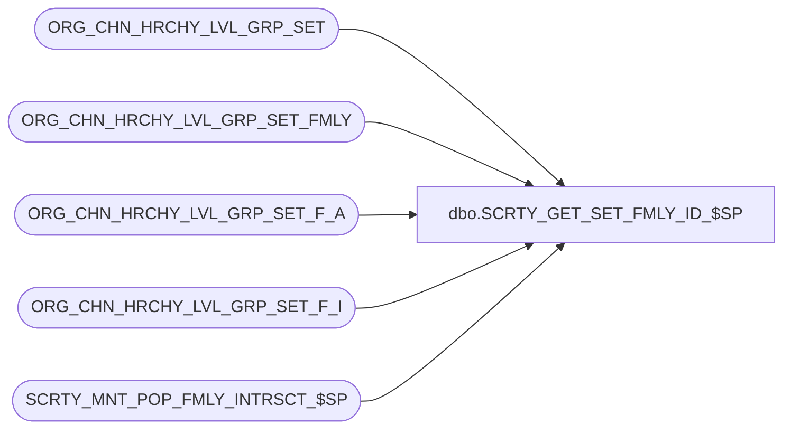

# dbo.SCRTY_GET_SET_FMLY_ID_$SP

**Database:** auditworks  
**Server:** bedrockdb01  

## Architecture Diagram



## Table Dependencies

| Referenced Table |
|---|
| ORG_CHN_HRCHY_LVL_GRP_SET |
| ORG_CHN_HRCHY_LVL_GRP_SET_FMLY |
| ORG_CHN_HRCHY_LVL_GRP_SET_F_A |
| ORG_CHN_HRCHY_LVL_GRP_SET_F_I |
| SCRTY_MNT_POP_FMLY_INTRSCT_$SP |

## Stored Procedure Code

```sql
CREATE PROC dbo.SCRTY_GET_SET_FMLY_ID_$SP
/**********************************************************************************************
				Gets the division set family ID for the given list of division sets
Return Value:	HRCHY_LVL_GRP_SET_FMLY_ID (a.k.a. division set family ID)

Created By:		JHardin, based on MSharma

UPDATES:
2012 0320 JHardin	Maintain family_id = 0 (self-healing)
2012 0613 JHardin	CRDM merge final renaming, cleanup
***********************************************************************************************/
(
	@division_set_list varchar(max)
)
AS
BEGIN
	DECLARE @erc					integer;
	DECLARE @division_set_fmly_id	integer;
	DECLARE @tempdivisionsetid		integer;
	DECLARE @divisionSetCount		smallint;
	DECLARE @max_div_set_id			integer;
	DECLARE @is_complete			bit;
	DECLARE @prefix_size			smallint;
	DECLARE @TempDivisionSet		TABLE (temp_division_set_id integer PRIMARY KEY);
	DECLARE @divisionSet			integer;
	DECLARE @offset					smallint;
	DECLARE @scratchDivisionSet		varchar(10);
	DECLARE @scratchDivisionSetList	varchar(max);
	DECLARE @scratchChar			char(1);
	DECLARE @comma					char(1);

	SET NOCOUNT ON;
	SET CONCAT_NULL_YIELDS_NULL ON;

	SET @division_set_fmly_id = NULL;

	IF @division_set_list IS NULL
	BEGIN
		-- GIGO
		RETURN 0;
	END;

	-- Look up HRCHY_LVL_GRP_SET_FMLY_ID (division set family ID) by list of division sets string
	-- Optimization: assume the caller isn't giving us garbage parameters
	SELECT
		@division_set_fmly_id = HRCHY_LVL_GRP_SET_FMLY_ID
	FROM
		ORG_CHN_HRCHY_LVL_GRP_SET_FMLY
	WHERE
		SET_LIST_PREFIX = @division_set_list
	AND
		IS_SET_LIST_PREFIX_CMPLT <> 0
	;

	IF @division_set_fmly_id IS NOT NULL
	BEGIN
		-- Maintain the 0 family (no division sets) if needed (paranoia)
		IF NOT EXISTS(
			SELECT 1
			FROM ORG_CHN_HRCHY_LVL_GRP_SET_FMLY
			WHERE HRCHY_LVL_GRP_SET_FMLY_ID = 0
		)
		BEGIN
			-- 0 family is missing, fix
			SET IDENTITY_INSERT ORG_CHN_HRCHY_LVL_GRP_SET_FMLY ON;

			INSERT INTO
				ORG_CHN_HRCHY_LVL_GRP_SET_FMLY(
					HRCHY_LVL_GRP_SET_FMLY_ID,
					SET_LIST_PREFIX,
					IS_SET_LIST_PREFIX_CMPLT,
					MBR_COUNT
				)
			VALUES (
				0,
				'*NONE*',
				-1,
				0
			);

			SET IDENTITY_INSERT ORG_CHN_HRCHY_LVL_GRP_SET_FMLY OFF;
		END;
		-- ensure 0 family has no members or intersections
		DELETE FROM
			ORG_CHN_HRCHY_LVL_GRP_SET_F_A
		WHERE
			HRCHY_LVL_GRP_SET_FMLY_ID = 0
		;
		DELETE FROM
			ORG_CHN_HRCHY_LVL_GRP_SET_F_I
		WHERE
			HRCHY_LVL_GRP_SET_FMLY_ID = 0
		;
		-- ensure 0 set is not present
		DELETE FROM
			ORG_CHN_HRCHY_LVL_GRP_SET_F_A
		WHERE
			HRCHY_LVL_GRP_SET_ID = 0
		;
		DELETE FROM
			ORG_CHN_HRCHY_LVL_GRP_SET_F_I
		WHERE
			HRCHY_LVL_GRP_SET_ID = 0
		;

		-- Found it, return it.
		RETURN @division_set_fmly_id;
	END;

	-- Nope, this is a new family, or the caller gave us dirty parameters
	-- Clean up the parameters, try again
	SET @division_set_fmly_id = NULL;

	IF @division_set_list LIKE '%-%'
	BEGIN
		-- No negative numbers
		RETURN 0;
	END;

	-- Don't hardcode the prefix string column size
	-- (The size of dbo.ORG_CHN_HRCHY_LVL_GRP_SET_FMLY.SET_LIST_PREFIX can
	--  be changed at implementation, but DON'T change it afterwards
	--  if any rows have IS_GRP_LIST_PREFIX_CMPLT = 0 or if changing
	--  it would truncate any GRP_LIST_PREFIX value!)
	SET @prefix_size = COL_LENGTH('dbo.ORG_CHN_HRCHY_LVL_GRP_SET_FMLY','SET_LIST_PREFIX');

	-- Make sure the input is clean - only digits and commas
	SET @scratchDivisionSetList = '';
	SET @offset = 1;
	WHILE @offset <= LEN(@division_set_list)
	BEGIN
		SET @scratchChar = SUBSTRING(@division_set_list, @offset, 1);
		IF @scratchChar BETWEEN '0' AND '9' OR @scratchChar = ','
		BEGIN
			SET @scratchDivisionSetList = @scratchDivisionSetList + @scratchChar;
		END;
		SET @offset = @offset + 1;
	END;
	SET @division_set_list = @scratchDivisionSetList;

	IF LEN(@division_set_list) < 1
	BEGIN
		-- GIGO
		RETURN 0;
	END;

	-- Parse the comma-delimited list and clean it up
	-- Division Set IDs don't have leading zeros,
	-- list is sorted in ascending order,
	-- no duplicates,
	-- division_set_id must exist
	-- Side effect: This table will be used to
	-- choose from multiple IS_SET_LIST_PREFIX_CMPLT = 0 candidate sets
	-- and to build the new set if needed
	SET @divisionSetCount = 0;
	WHILE (CHARINDEX(',', @division_set_list, 1) > 0)
	BEGIN
		SET @divisionSet = CAST(SUBSTRING(@division_set_list, 1, CHARINDEX(',', @division_set_list, 1) - 1) AS integer);
		SET @division_set_list = SUBSTRING(@division_set_list, CHARINDEX(',', @division_set_list, 1) + 1, LEN(@division_set_list));
		IF @divisionSet > 0	-- ignore blanks
		BEGIN
			IF NOT EXISTS(SELECT 1 FROM ORG_CHN_HRCHY_LVL_GRP_SET WHERE HRCHY_LVL_GRP_SET_ID = @divisionSet)
			BEGIN
				RETURN 0;
			END;
			IF NOT EXISTS(SELECT 1 FROM @TempDivisionSet WHERE temp_division_set_id = @divisionSet)
			BEGIN
				INSERT INTO @TempDivisionSet VALUES(@divisionSet);
			END;
			SET @divisionSetCount = @divisionSetCount + 1;
		END;
	END;
	-- Insert the last/only division
	SET @divisionSet = CAST(@division_set_list AS integer);
	IF @divisionSet > 0	-- ignore blanks
	BEGIN
		IF NOT EXISTS(SELECT 1 FROM ORG_CHN_HRCHY_LVL_GRP_SET WHERE HRCHY_LVL_GRP_SET_ID = @divisionSet)
		BEGIN
			RETURN 0;
		END;
		IF NOT EXISTS(SELECT 1 FROM @TempDivisionSet WHERE temp_division_set_id = @divisionSet)
		BEGIN
			INSERT INTO @TempDivisionSet VALUES(@divisionSet);
		END;
		SET @divisionSetCount = @divisionSetCount + 1;
	END;

	IF @divisionSetCount < 1
	BEGIN
		-- GIGO
		RETURN 0;
	END;

	-- Rebuild division_set_list, containing only complete division set IDs (no truncation) in sorted order
	SET @is_complete = 1;	-- @division_set_list is small enough to fit until determined otherwise
	SET @division_set_list = NULL;

	SELECT @division_set_list = COALESCE(@division_set_list + ',', '') + CAST(temp_division_set_id AS varchar(10))
	FROM @TempDivisionSet
	ORDER BY temp_division_set_id
	;

	IF LEN(@division_set_list) > @prefix_size
	BEGIN
		-- Too long, do it the slow way.
		-- This should be _rare_.
		SET @division_set_list = '';
		SET @comma = '';

		DECLARE division_set_id_cursor CURSOR FAST_FORWARD
		FOR
			SELECT temp_division_set_id
			FROM @TempDivisionSet
			ORDER BY temp_division_set_id
		;

		OPEN division_set_id_cursor;
		FETCH NEXT FROM division_set_id_cursor INTO @tempdivisionsetid;

		WHILE @@FETCH_STATUS = 0
		BEGIN
			SET @scratchDivisionSet = CAST(@tempdivisionsetid AS varchar(10));
			-- Do we have space left for the division ID and a comma?
			IF LEN(@division_set_list) <= (@prefix_size - (LEN(@scratchDivisionSet) + 1))
			BEGIN
				-- Yes, add it
				SET @division_set_list = LTRIM(@division_set_list + @comma) + @scratchDivisionSet;
				SET @comma = ',';
			END;
			ELSE
			BEGIN
				-- can't fit any more in the prefix string, stop trying
				SET @is_complete = 0;	-- @division_list is too big to fit
				BREAK;
			END;

			FETCH NEXT FROM division_set_id_cursor INTO @tempdivisionsetid;
		END
		CLOSE division_set_id_cursor;
		DEALLOCATE division_set_id_cursor;
	END;

	IF @is_complete <> 0
	BEGIN
		-- Look up HRCHY_LVL_GRP_SET_FMLY_ID (division set family ID) by list of division sets string
		SELECT
			@division_set_fmly_id = HRCHY_LVL_GRP_SET_FMLY_ID
		FROM
			ORG_CHN_HRCHY_LVL_GRP_SET_FMLY
		WHERE
			SET_LIST_PREFIX = @division_set_list
		AND
			IS_SET_LIST_PREFIX_CMPLT <> 0
		;

		IF @division_set_fmly_id IS NOT NULL
		BEGIN
			-- Found it, return it.
			RETURN @division_set_fmly_id;
		END;

		-- Nope, this is a new set.
	END
	ELSE
	BEGIN
		-- The division set list is larger than the SET_LIST_PREFIX column,
		-- look up via prefix string to narrow, then compare ORG_CHN_HRCHY_LVL_GRP_SET_F_A members.
		SELECT
			@division_set_fmly_id = HRCHY_LVL_GRP_SET_FMLY_ID
		FROM
			ORG_CHN_HRCHY_LVL_GRP_SET_FMLY dsf
		WHERE
			SET_LIST_PREFIX = @division_set_list
		AND
			MBR_COUNT = @divisionSetCount
		AND
			IS_SET_LIST_PREFIX_CMPLT = 0
		AND
			-- Candidate set does not have any members not in specified list
			NOT EXISTS(
				SELECT 1
				FROM ORG_CHN_HRCHY_LVL_GRP_SET_F_A dsfa
				WHERE dsfa.HRCHY_LVL_GRP_SET_FMLY_ID = dsf.HRCHY_LVL_GRP_SET_FMLY_ID
				AND dsfa.HRCHY_LVL_GRP_SET_ID NOT IN (
					SELECT temp_division_set_id FROM @TempDivisionSet
				)
			)
		;

		IF @division_set_fmly_id IS NOT NULL
		BEGIN
			-- Found it, return it.
			RETURN @division_set_fmly_id;
		END;

		-- Nope, this is a new set.
	END;

	-- No matching division set family was found,
	-- insert new records into ORG_CHN_HRCHY_LVL_GRP_SET_FMLY
	-- and ORG_CHN_HRCHY_LVL_GRP_SET_F_A
	BEGIN TRANSACTION create_division_set_family;		-- keep it small

		-- Create the family header
		INSERT INTO
			ORG_CHN_HRCHY_LVL_GRP_SET_FMLY(
				SET_LIST_PREFIX,
				IS_SET_LIST_PREFIX_CMPLT,
				MBR_COUNT
			)
		VALUES (
			@division_set_list,
			@is_complete,
			@divisionSetCount
		);

		SET @erc = @@error;
		IF @erc <> 0
		BEGIN
			GOTO error;
		END;

		SET @division_set_fmly_id = SCOPE_IDENTITY();

		-- Create the family members
		INSERT INTO
			ORG_CHN_HRCHY_LVL_GRP_SET_F_A(
				HRCHY_LVL_GRP_SET_FMLY_ID,
				HRCHY_LVL_GRP_SET_ID
			)
		SELECT
			@division_set_fmly_id,
			temp_division_set_id
		FROM
			@TempDivisionSet
		;

		SET @erc = @@error;
		IF @erc <> 0
		BEGIN
			GOTO error
		END;

		-- Calculate intersections for the new family
		EXEC @erc = SCRTY_MNT_POP_FMLY_INTRSCT_$SP @division_set_fmly_id, NULL;

		IF @erc <> 0
		BEGIN
			GOTO error
		END;

commit_tran:
	COMMIT TRANSACTION create_division_set;

	RETURN @division_set_fmly_id;

error:
	ROLLBACK TRANSACTION create_division_set_family;
	-- Should we be doing something with @erc here? Can't return it...
	RETURN 0;
END;
```

