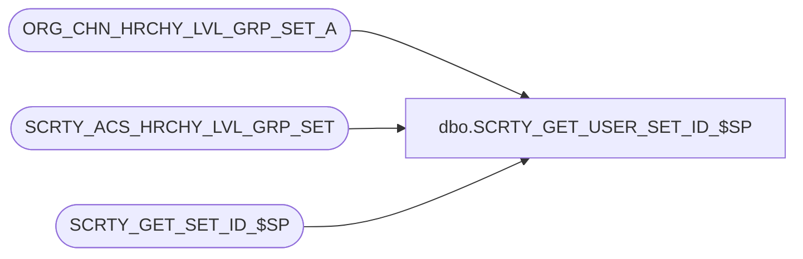

# dbo.SCRTY_GET_USER_SET_ID_$SP

**Database:** auditworks  
**Server:** bedrockdb01  

## Architecture Diagram



## Table Dependencies

| Referenced Table |
|---|
| ORG_CHN_HRCHY_LVL_GRP_SET_A |
| SCRTY_ACS_HRCHY_LVL_GRP_SET |
| SCRTY_GET_SET_ID_$SP |

## Stored Procedure Code

```sql
CREATE PROC dbo.SCRTY_GET_USER_SET_ID_$SP
/**********************************************************************************************
				Gets the division set ID for the divisions the
				specified user ID and/or list of group IDs is permitted to access
				Returns ZERO on any error, or for "no access granted"
				User and group IDs are not validated in any way
Return Value:	HRCHY_LVL_GRP_SET_ID (a.k.a. division set ID)

Created By:		JHardin

***********************************************************************************************
UPDATES:
2012 0613 JHardin	CRDM merge final renaming, cleanup

***********************************************************************************************/
(
	@FNDTN_USER_ID		numeric(10,0),
	@FNDTN_GRP_ID_List	varchar(max),	-- comma-delimited list of foundation group IDs
	@appID				smallint
)
AS
BEGIN
	DECLARE @division_set_id 		integer;
	DECLARE @TempDivision			TABLE (division_id smallint);
	DECLARE @offset					smallint;
	DECLARE @scratchChar			char(1);
	DECLARE @scratchString			varchar(20);
	DECLARE @scratchGroupID     	numeric(10,0);
	DECLARE @tempdivisionid 		smallint;
	DECLARE @scratchDivisionList	varchar(max);

	SET NOCOUNT ON;

	IF @FNDTN_USER_ID IS NULL AND @FNDTN_GRP_ID_List IS NULL
	BEGIN
		-- GIGO
		RETURN 0;
	END;

	-- Get user's division list(s), if any
	IF @FNDTN_USER_ID IS NOT NULL
	BEGIN
		IF EXISTS(
			SELECT 1
			FROM
				SCRTY_ACS_HRCHY_LVL_GRP_SET
			WHERE
				ACS_ID = @FNDTN_USER_ID
			AND
				ACS_ID_TYPE = 1
			AND
				HRCHY_LVL_GRP_SET_ID = -1
			AND
				ACTV <> 0
		)
		BEGIN
			-- User has global access, don't need to do anything else
			RETURN -1;
		END;
		ELSE
		BEGIN
			-- Grab all divisions the user is granted access to
			INSERT INTO
				@TempDivision(division_id)
			SELECT
				HRCHY_LVL_GRP_IDNTY
			FROM
				ORG_CHN_HRCHY_LVL_GRP_SET_A
			WHERE
				HRCHY_LVL_GRP_SET_ID IN (
					SELECT
						HRCHY_LVL_GRP_SET_ID
					FROM
						SCRTY_ACS_HRCHY_LVL_GRP_SET
					WHERE
						ACS_ID = @FNDTN_USER_ID
					AND
						ACS_ID_TYPE = 1
					AND
						HRCHY_LVL_GRP_SET_ID > 0
					AND
						ACTV <> 0
				)
			;
		END;
	END;

	-- Get group division list(s), if any
	IF @FNDTN_GRP_ID_List IS NOT NULL AND LEN(@FNDTN_GRP_ID_List) > 0
	BEGIN
		SET @FNDTN_GRP_ID_List = @FNDTN_GRP_ID_List + ',';	-- simplify loop-end logic
		SET @scratchString = '';
		SET @offset = 1;
		WHILE @offset <= LEN(@FNDTN_GRP_ID_List)
		BEGIN
			SET @scratchChar = SUBSTRING(@FNDTN_GRP_ID_List, @offset, 1);
			IF @scratchChar BETWEEN '0' AND '9'
			BEGIN
				SET @scratchString = @scratchString + @scratchChar;
			END;
			IF @scratchChar = ','
			BEGIN
				SET @scratchGroupID = CAST(@scratchString AS numeric(10,0));
				SET @scratchString = '';
				IF @scratchGroupID > 0
				BEGIN
					IF EXISTS(
						SELECT 1
						FROM
							SCRTY_ACS_HRCHY_LVL_GRP_SET
						WHERE
							ACS_ID = @scratchGroupID
						AND
							ACS_ID_TYPE = 2
						AND
							HRCHY_LVL_GRP_SET_ID = -1
						AND
							ACTV <> 0
					)
					BEGIN
						-- Group has global access, don't need to do anything else
						RETURN -1;
					END;
					ELSE
					BEGIN
						-- Grab all divisions the group is granted access to
						INSERT INTO
							@TempDivision(division_id)
						SELECT
							HRCHY_LVL_GRP_IDNTY
						FROM
							ORG_CHN_HRCHY_LVL_GRP_SET_A
						WHERE
							HRCHY_LVL_GRP_SET_ID IN (
								SELECT
									HRCHY_LVL_GRP_SET_ID
								FROM
									SCRTY_ACS_HRCHY_LVL_GRP_SET
								WHERE
									ACS_ID = @scratchGroupID
								AND
									ACS_ID_TYPE = 2
								AND
									HRCHY_LVL_GRP_SET_ID > 0
								AND
									ACTV <> 0
							)
						;
					END;
				END;
			END;
			SET @offset = @offset + 1;
		END;
	END;

	IF NOT EXISTS(SELECT 1 FROM @TempDivision)
	BEGIN
		-- Neither user nor group(s) have permission to see any divisions
		RETURN 0;
	END;

	-- Build list of divisions string for get_division_set_id SP
	SET CONCAT_NULL_YIELDS_NULL ON;
	SET @scratchDivisionList = NULL;
	SELECT @scratchDivisionList = COALESCE(@scratchDivisionList + ',', '') + CAST(division_id AS varchar(10))
	FROM @TempDivision
	ORDER BY division_id ASC
	;

--	PRINT 'generated division list: "' + @scratchDivisionList + '"';

	-- Determine the division set ID that covers that set of divisions
	-- Create new set if needed
	EXECUTE @division_set_id = SCRTY_GET_SET_ID_$SP @scratchDivisionList, NULL, -1, @appID;

	RETURN @division_set_id;

END;
```

