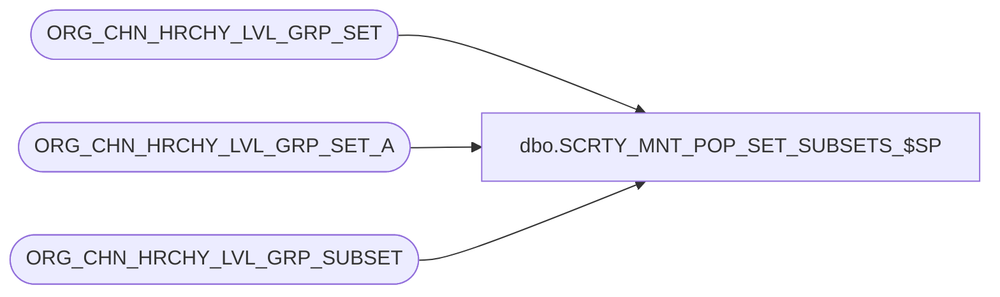

# dbo.SCRTY_MNT_POP_SET_SUBSETS_$SP

**Database:** auditworks  
**Server:** bedrockdb01  

## Architecture Diagram



## Table Dependencies

| Referenced Table |
|---|
| ORG_CHN_HRCHY_LVL_GRP_SET |
| ORG_CHN_HRCHY_LVL_GRP_SET_A |
| ORG_CHN_HRCHY_LVL_GRP_SUBSET |

## Stored Procedure Code

```sql
CREATE PROC dbo.SCRTY_MNT_POP_SET_SUBSETS_$SP
/**********************************************************************************************
				Maintains division_subset membership for specified division_set
Return Value:	none

Created By:		JHardin

Loop through all defined division_set_id values and call this SP to bring everything up-to-date.

UPDATES:

2012 0613 JHardin	CRDM merge final renaming, cleanup
2013 0221 JHardin	If the division set is the set of all divisions, the -1 division set is an improper subset
					(treat all-divisions set as equivalent to global)
***********************************************************************************************/
(
	@division_set_id integer
)
AS
BEGIN
	DECLARE
		@max_div_set_id integer,
		@countDivAll	integer,
		@countDivSet	integer
	;

	IF @division_set_id IS NOT NULL AND EXISTS(SELECT 1 FROM ORG_CHN_HRCHY_LVL_GRP_SET WHERE HRCHY_LVL_GRP_SET_ID = @division_set_id)
	BEGIN

		BEGIN TRANSACTION trx_div_subset;

		SELECT
			@max_div_set_id = MAX(HRCHY_LVL_GRP_SET_ID)
		FROM
			ORG_CHN_HRCHY_LVL_GRP_SET
		;

		INSERT INTO
			ORG_CHN_HRCHY_LVL_GRP_SUBSET(
				HRCHY_LVL_GRP_SET_ID,
				HRCHY_LVL_GRP_SUBSET_ID
			)
		SELECT DISTINCT
			@division_set_id,
			HRCHY_LVL_GRP_SET_ID
		FROM
			ORG_CHN_HRCHY_LVL_GRP_SET_A dsd
		WHERE
			HRCHY_LVL_GRP_SET_ID > 0	-- paranoia
		AND
			-- Is not already a subset of target division set
			NOT EXISTS(
				SELECT 1
				FROM
					ORG_CHN_HRCHY_LVL_GRP_SUBSET ss
				WHERE
					ss.HRCHY_LVL_GRP_SET_ID = @division_set_id
				AND
					ss.HRCHY_LVL_GRP_SUBSET_ID = dsd.HRCHY_LVL_GRP_SET_ID
			)
		AND
			-- Has a member division in common with target division set
			EXISTS(
				SELECT 1
				FROM
					ORG_CHN_HRCHY_LVL_GRP_SET_A dsd1
				WHERE
					dsd1.HRCHY_LVL_GRP_SET_ID = @division_set_id
				AND
					dsd1.HRCHY_LVL_GRP_IDNTY = dsd.HRCHY_LVL_GRP_IDNTY
			)
		AND
			-- Does not have a member division not in common with target division_set
			NOT EXISTS(
				SELECT 1
				FROM
					ORG_CHN_HRCHY_LVL_GRP_SET_A dsd2
				WHERE
					dsd2.HRCHY_LVL_GRP_SET_ID = dsd.HRCHY_LVL_GRP_SET_ID
				AND
					dsd2.HRCHY_LVL_GRP_IDNTY NOT IN (
						-- Divisions in target division_set
						SELECT
							HRCHY_LVL_GRP_IDNTY
						FROM
							ORG_CHN_HRCHY_LVL_GRP_SET_A
						WHERE
							HRCHY_LVL_GRP_SET_ID = @division_set_id
					)
			)
		;

		UPDATE
			ORG_CHN_HRCHY_LVL_GRP_SET
		SET
			LARGEST_GRP_SET_ID = @max_div_set_id
		WHERE
			HRCHY_LVL_GRP_SET_ID = @division_set_id
		;

		COMMIT TRANSACTION trx_div_subset;
	END;

	-- Maintain the -1 set as a subset of the all-divisions set
	SELECT @countDivAll = COUNT(*) FROM ORG_CHN_HRCHY_LVL_GRP_SET_A
	WHERE HRCHY_LVL_GRP_SET_ID = -1;

	SELECT @countDivSet = COUNT(*) FROM ORG_CHN_HRCHY_LVL_GRP_SET_A
	WHERE HRCHY_LVL_GRP_SET_ID = @division_set_id;

	IF @countDivSet < @countDivAll
	BEGIN
		-- Cannot have -1 as a subset
		DELETE FROM
			ORG_CHN_HRCHY_LVL_GRP_SUBSET
		WHERE
			HRCHY_LVL_GRP_SET_ID = @division_set_id
		AND
			HRCHY_LVL_GRP_SUBSET_ID = -1
		;
	END
	ELSE
	BEGIN
		-- Is (presently) the all-divisions set
		-- Ensure -1 is a subset
		IF NOT EXISTS(
			SELECT 1
			FROM
				ORG_CHN_HRCHY_LVL_GRP_SUBSET
			WHERE
				HRCHY_LVL_GRP_SET_ID = @division_set_id
			AND
				HRCHY_LVL_GRP_SUBSET_ID = -1
		)
		BEGIN
			INSERT INTO
				ORG_CHN_HRCHY_LVL_GRP_SUBSET(
					HRCHY_LVL_GRP_SET_ID,
					HRCHY_LVL_GRP_SUBSET_ID
				)
			VALUES (
				@division_set_id,
				-1
			)
			;
		END;

		-- Ensure no other set has -1 is a subset
		DELETE FROM
			ORG_CHN_HRCHY_LVL_GRP_SUBSET
		WHERE
			HRCHY_LVL_GRP_SET_ID > 0
		AND
			HRCHY_LVL_GRP_SET_ID <> @division_set_id
		AND
			HRCHY_LVL_GRP_SUBSET_ID = -1
		;
	END;

END;
```

