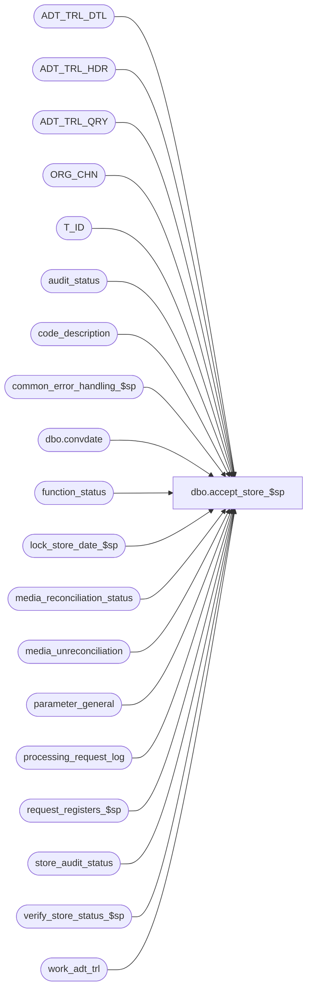

# dbo.accept_store_$sp

**Database:** auditworks  
**Server:** bedrockdb01  

## Architecture Diagram



## Table Dependencies

| Referenced Table |
|---|
| ADT_TRL_DTL |
| ADT_TRL_HDR |
| ADT_TRL_QRY |
| ORG_CHN |
| T_ID |
| audit_status |
| code_description |
| common_error_handling_$sp |
| dbo.convdate |
| function_status |
| lock_store_date_$sp |
| media_reconciliation_status |
| media_unreconciliation |
| parameter_general |
| processing_request_log |
| request_registers_$sp |
| store_audit_status |
| verify_store_status_$sp |
| work_adt_trl |

## Stored Procedure Code

```sql
create proc [dbo].[accept_store_$sp] 
( @process_id                   binary(16),
  @user_id                      int,
  @datetime_of_request          datetime,
  @deny_force_overshorts        tinyint = 0,
  @deny_force_missings          tinyint = 0,
  @deny_force_exceptions        tinyint = 0,
  @deny_force_duplicates        tinyint = 0,
  @deny_force_import_error      tinyint = 0,
  @deny_force_media_tolerance   tinyint = 0,
  @deny_flag_unused             tinyint = 0  )

AS

/* 
Proc name : accept_store_$sp
Desc: Accepts one register or all registers (if register_no = 0) 
      Changes status of store/reg/sales_date(s) in audit_status to
 	to accepted (300) from verified (200).
 	Possibly sets status of store/sales_date in store_audit_status
 	to accepted as well if all registers of that particular
 	store/sales_date were all set to accepted.
    Note: Certain ranges from code_description (under code_type of 42) will give the user
              the option to force accept and other ranges (in the 30s) will not allow the
              user to force accept. Check with Front-end for these ranges.

 	Called by front end.

HISTORY:  
Date     Name           Def# Desc
Dec09,13 Phu          146632 Do not blank out the field status_set_by_user_id.
Aug22,12 Vicci        137795 Remove SET NOCOUNT OFF from after the call to the common error handling to avoid @@error being reset before the calling proc can see it.
Jan18,12 Vicci        132439 Remove references to CRDM user-defined string datatypes from S/A since CRDM is not changing them to support unicode.
May13,10 Vicci        117837 Recognized unreconciled media even if it originated from a post-midnight count
Mar15,10 Vicci        115428 Correct bad join to audit trail header upon insert to detail and query key of register-level acceptance.
                             Also correct unreconciled media present warning (17/117) to display even if contribution to unreconciled 
                             media only occurred on the sales-date in question (as opposed to earlier).  
                             Make @datetime_of_request and @request_datetime datetimes to match UI.
Mar12,10 Vicci        116526 Require force-accept if sales date is current date.
Jan22,08 Paul          94350 improve performance when updating the audit trail
Nov28,06 Phu           80328 5.0 only. Take user's permissions into account when generating the reason codes 10-17,20.
Jul19,06 Phu     75035/75036 Set auto_accepted = 1 when store-dates are auto-accepted by edit/manual functions.
Jun15,06 Tim         DV-1339 Apply 73262,1-193R4P to SA5
Feb10,06 Paul        DV-1328 set status_set_by_user_id to null (system)
Nov17,05 Paul          63565 apply 63135 to SA5, drop temp table, minimized begin tran
Sep02,05 Paul        DV-1312 apply 52920 to SA5
Jun08,05 Paul        DV-1273 corrected audit trail
Jan10,05 Paul        DV-1191 added nocount and locking hints
Nov24,04 Maryam      DV-1181 Properly insert into FNCTN_NUM and ADT_CMNT.
Oct13,04 Maryam      DV-1146 set status_set_by_user_id = null
Aug30,04 Maryam      DV-1120 Use convdate function for dates when logging the audit trail.
Jul27,04 Maryam      DV-1071 avoid conversion eror. new audit trail. use ORG_CHN_WRKSTN instead of register,
                             receive @process_id and @user_id and pass it to the sub procs.
			     modify the call to lock_store_date_$sp as it no longer outputs the user_id
         David       DV-1071 Use ORG_CHN table as the new Store table.
Apr20,04 Sab	     DV-1068 Remove @balancing_method variable
Jul19,06 Phu     75034/75035 Set auto_accepted = 1 when store-dates are auto-accepted by edit/manual functions.
Jun08,06 Vicci         73262 when an unrec amount beyond tolerance is present for D5 and the
                             user is trying to accept D1 with an unreconciled amount below 
                             tolerance, the "force accept unrec amount beyond tolerance" message
                             appear.  This should only be required if D1 participated in the
                             beyond tolerance amount.
Jan10,06 Paul       1-193R4P add entry_date to audit trail where clause to improve performance
Nov16,05 Daphna        63135 Require force-accept only when unrec media beyond tolerance (date, amount)
Jan26,05 Vicci	       52920 Require force-accept in case where unreconciled media is present
Oct29,02 Winnie	     1-FGESD Add logic for Moved Invalid Register.
Sep18,02 HenryW	     1-EWT2T If translate errors remaining, allow force accept to continue.
Mar07,02 Daphna      AW-8467 Update function status set entry_date =  datetime_of_request
Jan21,02 Paul        1-ADCGO Move all audit trail logic inside If @rows ..., move some validation out of cursor
Dec11,01 Daphna      1-9I4IJ Remove deletion of function status, now done by Front End (03.00)
                             Add R3 Error Handling
Aug10,01 Daphna         8466 Ignore requests for invalid store,reg or date
          Process status 200 renamed 47
                             Insert/Update/Delete function status for recovery
Jun14,01 Winnie		8085 correct audit trail logic
Feb02,01 Paul		7324 select min(audit_status) to avoid error 1422
Dec21,00 Winnie		6791 Audit Trail Enhancements. 
Dec06,00 Paul		7019 change 6818 to log only register 0 (all reg) for accepted/completed stores because PB needs the row.
Oct06,00 Paul		6818 Ignore requests for stores which are already accepted/completed
Sep13,00 Shapoor/Paul	6719 Avoid duplicates in insert to processing_request_log when cashier or store balancing.
May25,00 John G		5864 Change '= NULL' to 'IS NULL' where applicable to mirror Oracle.
May04,00 Paul		6293 Allow force accepting deposit short
Mar01,00 Phu		5900 Change @@fetch_status > 0 to @@fetch_status <> 0 for MS SQL compatibility
Sep14,99 Daphna F	5285 check short_by_tender_over_limit instead of media_short for deposit over short		
Aug03,99 Shapoor    	4918 Not allow the auto-accept to accept all registers only when deposit_balancing is used.
Jun14,99 Louise M   	4526 Added code to disallow accept when one of the registers is trickling in.
Apr19,99 Shapoor    	3622 To ensure that the auto-accept does not accept all the registers when a deposit over/short exists.
         Phu        	N/A  Author
*/


DECLARE
  @after_description          nvarchar(255),
  @all_register               tinyint,
  @before_description         nvarchar(255),
  @current_date               smalldatetime,
  @cursor_open                tinyint,
  @date_reject_id             tinyint,
  @errmsg                     nvarchar(255),
  @errno                      int,
  @errnum                     int,
  @media_rec_verified         tinyint,
  @min_audit_status           smallint,
  @other_rejects_exist        tinyint,
  @process_no                 smallint,
  @processing_status          smallint,
  @reg_name                   nvarchar(255),
  @register_no                smallint,
  @register_zero_exists       smallint,
  @request_datetime           datetime,
  @rows                       int,
  @rows_accepted              int,
  @sales_date                 smalldatetime,
  @sep                        nchar(1),
  @short_by_tender_over_limit tinyint,
  @store_audit_status         smallint,
  @store_name                 nvarchar(255),
  @store_no                   int,
  @trickle_in_progress_flag   tinyint,
  @update_in_progress         smallint,
  @translate_errors_exist     tinyint,
  -- error handling
  @process_name               nvarchar(100),
  @operation_name             nvarchar(100),
  @object_name                nvarchar(255),
  @message_id                 int,
  @log_error_flag             tinyint,
  -- new audit trail tables
  @ENTRY_ID			T_ID,
  @TBL_NAME			nvarchar(255),
  @TBL_KEY			nvarchar(255),
  @TBL_KEY_RSRC_NAME		nvarchar(255),
  @TBL_KEY_RSRC_PRMS		nvarchar(255),
  @completion_date_time		datetime,
  @current_day_autoaccept_time    smallint,
  @latest_date_to_accept          smalldatetime

SET NOCOUNT ON

SELECT  @cursor_open        	= 0,
        @errmsg             	= NULL,
        @process_no         	= 75,
        @update_in_progress 	= 75,
        @rows               	= 0,
        @process_name		= 'accept_store_$sp',
        @message_id 		= 201068,
        @log_error_flag		= 0,  -- not called by smartload
	@after_description	= 'Accepted',
	@sep 			= nchar(12), -- audit trail seperator
	@store_name 		= ' ',
	@current_date 		= getdate(),
	@latest_date_to_accept 	= CONVERT(smalldatetime, CONVERT(nchar(6),getdate(),12))

SELECT @current_day_autoaccept_time = ISNULL(current_day_autoaccept_time, 2100)
  FROM parameter_general
  -- If current time < @current_day_autoaccept_time then don't allow autoaccepting sales
  -- with the same sales_date as the current system date. Prevents manual polls from
  -- autoaccepting sales for the current date.
IF DATEPART(hh, @current_date) * 100
   + DATEPART(mi, @current_date) < @current_day_autoaccept_time
  SELECT @latest_date_to_accept = DATEADD(dd, -1, @latest_date_to_accept)

CREATE TABLE #audit_processing_status (
  store_no                      int             not null,
  register_no                   smallint        not null,
  sales_date                    smalldatetime   not null,
  date_reject_id                tinyint         not null,
  audit_status                  smallint        not null,
  short_by_tender_over_limit    tinyint         not null,
  opening_drawer_discrepancy    tinyint         not null,
  media_rec_verified            tinyint         not null,
  exceptions_verified           tinyint         not null,
  duplicate_verified            tinyint   not null,
  missing_verified              tinyint         not null,
  sa_reject_qty                 smallint        not null,
  if_reject_qty smallint        not null,
  missing_qty                   numeric(12,0)   not null,
  exception_qty                 smallint        not null,
  duplicate_qty                 smallint        not null,
  processing_status             smallint        not null,
  translate_error_verified	tinyint		not null, -- Def 1-EWT2T
  translate_error_qty		smallint	not null,
  unreconciled_media_present	tinyint		null)  --Def 46031

SELECT @errno = @@error
IF @errno <> 0
BEGIN
   SELECT @errmsg = 'Failed to create temp table #audit_processing_status',
          @object_name = '#audit_processing_status',
          @operation_name = 'CREATE TEMP TABLE'
   GOTO error
END

SELECT @cursor_open = 1 -- ensure temp table gets dropped

/* if accepting a store, insert registers into processing_request_log */

EXEC request_registers_$sp @process_id, @user_id, @datetime_of_request,
                             @process_no, @errmsg OUTPUT
SELECT @errno = @@error
IF @errno <> 0
BEGIN
  SELECT @errmsg = 'Failed to execute stored procedure request_registers_$sp',
         @object_name = 'request_registers_$sp',
   @operation_name = 'EXECUTE'
  GOTO error
END

-- compensate for lack of frontend validation

UPDATE processing_request_log
   SET processing_status = 46   -- invalid date
 WHERE date_reject_id != 0
   AND user_id = @user_id
   AND request_datetime = @datetime_of_request

SELECT @errno = @@error
IF @errno <> 0
  BEGIN
 	 SELECT @errmsg = 'processing_status = 46',
             @object_name = '#audit_processing_status',
             @operation_name = 'UPDATE'
	 GOTO error
END

UPDATE processing_request_log
   SET processing_status = 44 -- invalid store
  FROM processing_request_log rl, audit_status st
 WHERE processing_status = 0
   AND rl.user_id = @user_id
   AND request_datetime = @datetime_of_request
   AND rl.sales_date = st.sales_date
   AND rl.store_no = st.store_no
   AND rl.date_reject_id = st.date_reject_id
   AND st.audit_status = 7
 
SELECT @errno = @@error
IF @errno <> 0
  BEGIN
   SELECT @errmsg = 'processing_status = 44',
             @object_name = 'processing_request_log',
             @operation_name = 'UPDATE'
   GOTO error
  END

UPDATE processing_request_log
   SET processing_status = 45 -- invalid reg
  FROM processing_request_log rl, audit_status st
 WHERE processing_status = 0
   AND rl.user_id = @user_id
   AND request_datetime = @datetime_of_request
   AND rl.sales_date = st.sales_date
   AND rl.store_no = st.store_no
   AND rl.date_reject_id = st.date_reject_id
   AND st.audit_status = 8
 
SELECT @errno = @@error
IF @errno <> 0
  BEGIN
   SELECT @errmsg = 'processing_status = 45',
             @object_name = 'processing_request_log',
             @operation_name = 'UPDATE'
   GOTO error
  END

DECLARE process_accept_store_crsr CURSOR FAST_FORWARD
FOR
SELECT DISTINCT request_datetime,
                store_no,
                sales_date,
                date_reject_id
  FROM processing_request_log WITH (NOLOCK)
 WHERE user_id         = @user_id
   AND request_datetime  = @datetime_of_request
   AND processing_status = 0

SELECT @errno = @@error
IF @errno <> 0
BEGIN
   SELECT @errmsg = 'From processing_request_log',
          @object_name = 'process_accept_store_crsr',
          @operation_name = 'DECLARE CURSOR'
   GOTO error
END

OPEN process_accept_store_crsr
SELECT  @cursor_open = 2

WHILE 1 = 1
BEGIN
  FETCH process_accept_store_crsr 
   INTO @request_datetime,
        @store_no,
        @sales_date,
        @date_reject_id

  IF @@fetch_status <> 0
    BREAK

  SELECT @current_date = getdate() -- ATH DV-1071 move this statement inside the block

  UPDATE function_status
     SET store_no = @store_no,
         transaction_date = @sales_date,
         date_reject_id = @date_reject_id,
         status = 1,
         entry_date = @request_datetime  -- def 8467
   WHERE user_id = @user_id
     AND function_no = @process_no
     AND process_id = @process_id
     
  SELECT @errno = @@error,
         @rows = @@rowcount
  IF @errno <> 0
  BEGIN
    SELECT @errmsg = 'set store_no, transaction_date, status = 1', 
           @object_name = 'function_status',
           @operation_name = 'UPDATE'
    GOTO error
  END
  
  IF @rows = 0 -- no status row
  BEGIN
    INSERT function_status
           (user_id, process_id, function_no, status, entry_date, store_no,
            register_no, transaction_date, date_reject_id)
    VALUES (@user_id, @process_id, @process_no, 1,@request_datetime, @store_no,
            @register_no, @sales_date, @date_reject_id)
  
    SELECT @errno = @@error
    IF @errno <> 0
    BEGIN
      SELECT @errmsg = '@store_no, @sales_date, status = 1', 
             @object_name = 'function_status',
             @operation_name = 'INSERT'
      GOTO error
    END          
  END -- @rows = 0:  no status row
       
  SELECT @all_register = 0
  EXEC lock_store_date_$sp @process_id,
  			   @user_id,
                           @store_no, 
        @sales_date, 
          @date_reject_id,
         @update_in_progress, 
                          @message_id OUTPUT
          
  SELECT @errno = @@error
 IF @errno <> 0 AND @errno <> 201550
  BEGIN
     SELECT @errmsg = 'Failed to execute lock_store_date_$sp', 
            @object_name = 'lock_store_date_$sp',
            @operation_name = 'EXECUTE'
     GOTO error
  END
                            
  IF @message_id = 201550 /* store_date currently in use. bypass it. */
  BEGIN
    UPDATE processing_request_log
       SET processing_status = 47
     WHERE user_id        = @user_id
       AND request_datetime = @request_datetime
       AND store_no         = @store_no
       AND sales_date       = @sales_date
       AND date_reject_id   = @date_reject_id

    SELECT @errno = @@error
    IF @errno <> 0
    BEGIN
      SELECT @message_id = 201068,  -- database error
             @errmsg = 'processing_status = 47', 
             @object_name = 'processing_request_log',
             @operation_name = 'UPDATE'
      GOTO error
    END

    SELECT @message_id = 201068
    
    CONTINUE    
  END

  SELECT   @short_by_tender_over_limit = short_by_tender_over_limit,
           @media_rec_verified = media_rec_verified,
           @trickle_in_progress_flag = ISNULL(trickle_in_progress_flag,0),
           @store_audit_status = store_audit_status
    FROM store_audit_status
   WHERE store_no       = @store_no
     AND sales_date     = @sales_date
     AND date_reject_id = @date_reject_id

  TRUNCATE TABLE #audit_processing_status

  SELECT @errno = @@error
  IF @errno <> 0
  BEGIN
     SELECT @errmsg = 'Failed to truncate table #audit_processing_status',
            @object_name = '#audit_processing_status',
            @operation_name = 'TRUNCATE TABLE'
     GOTO error
  END

  INSERT #audit_processing_status (
        store_no,
      register_no,
        sales_date,
        date_reject_id,
        audit_status,
        short_by_tender_over_limit,
        opening_drawer_discrepancy,
        media_rec_verified,
        exceptions_verified,
        duplicate_verified,
        missing_verified,
        sa_reject_qty,
        if_reject_qty,
        missing_qty,
        exception_qty,
        duplicate_qty,
        processing_status,
	translate_error_verified, -- Def 1-EWT2T
        translate_error_qty,
        unreconciled_media_present) --Def 46037
    SELECT
        @store_no,
        rl.register_no,
        @sales_date,
        @date_reject_id,
        audit_status,
        short_by_tender_over_limit,
        opening_drawer_discrepancy,
        media_rec_verified,
        exceptions_verified,
        duplicate_verified,
        missing_verified,
        sa_reject_qty,
        if_reject_qty,
        missing_qty,
        exception_qty,
        duplicate_qty,
        0,
        translate_error_verified,
        translate_error_qty,
        st.unreconciled_media_present --Def 46037
    FROM processing_request_log rl WITH (NOLOCK), 
         audit_status st
    WHERE user_id         = @user_id
      AND request_datetime  = @request_datetime
      AND rl.store_no       = @store_no
      AND rl.sales_date     = @sales_date
      AND rl.date_reject_id = @date_reject_id -- will always be zero
      AND rl.processing_status = 0
      AND rl.store_no       = st.store_no
      AND rl.register_no    = st.register_no
      AND rl.sales_date     = st.sales_date
      AND rl.date_reject_id = st.date_reject_id

  SELECT @errno = @@error
  IF @errno <> 0
  BEGIN
 	 SELECT @errmsg = 'from processing_request_log and audit_status',
             @object_name = '#audit_processing_status',
             @operation_name = 'INSERT'
	 GOTO error
  END

  UPDATE #audit_processing_status
     SET processing_status = 40  -- already accepted, dayended, periodended 
   WHERE audit_status >= 201   -- or dayend in progress
     AND audit_status <= 899
    
  SELECT @errno = @@error
  IF @errno <> 0
  BEGIN
 	 SELECT @errmsg = 'processing_status = 40',
             @object_name = '#audit_processing_status',
        @operation_name = 'UPDATE'
	 GOTO error
  END

  UPDATE #audit_processing_status
     SET processing_status = 41   -- closed or unused
   WHERE audit_status IN (900,901)

  SELECT @errno = @@error
  IF @errno <> 0
  BEGIN
	 SELECT @errmsg = 'processing_status = 41',
	      @object_name = '#audit_processing_status',
	      @operation_name = 'UPDATE'
	 GOTO error
  END

  UPDATE #audit_processing_status
     SET processing_status = 42  -- transactions deleted
   WHERE audit_status IN (902,904)

  SELECT @errno = @@error
  IF @errno <> 0
  BEGIN
 	 SELECT @errmsg = 'processing_status = 42',
          @object_name = '#audit_processing_status',
             @operation_name = 'UPDATE'
	 GOTO error
  END

  UPDATE #audit_processing_status
     SET processing_status = 43   -- transactions moved
   WHERE audit_status IN (903, 905, 906)

  SELECT @errno = @@error
  IF @errno <> 0
  BEGIN
 	 SELECT @errmsg = 'processing_status = 43',
		@object_name = '#audit_processing_status',
		@operation_name = 'UPDATE'
	 GOTO error
  END

  IF (@store_audit_status >= 300 AND @store_audit_status < 900)
  BEGIN -- don't accept store-dates that are already accepted/completed
    SELECT @register_zero_exists = 0

    SELECT @register_zero_exists = 1
      FROM processing_request_log WITH (NOLOCK)
     WHERE user_id      = @user_id
       AND request_datetime  = @request_datetime
       AND store_no          = @store_no
       AND sales_date        = @sales_date
       AND date_reject_id    = @date_reject_id
       AND register_no       = 0

    IF @register_zero_exists = 1
    BEGIN  -- all registers selected, don't display a message for each accepted register
      DELETE processing_request_log
       WHERE user_id = @user_id
         AND request_datetime = @request_datetime
         AND store_no       = @store_no
         AND sales_date     = @sales_date
         AND date_reject_id = @date_reject_id
         AND register_no    > 0

      SELECT @errno = @@error
      IF @errno <> 0
      BEGIN
        SELECT @errmsg = '@register_zero_exists = 1',
               @object_name = 'processing_request_log',
               @operation_name = 'DELETE'
        GOTO error
      END

      UPDATE processing_request_log
         SET processing_status = 40 -- display only a store level message for accepted/completed store
       WHERE user_id         = @user_id
         AND request_datetime  = @request_datetime
         AND store_no       = @store_no
         AND register_no    = 0
         AND sales_date     = @sales_date
         AND date_reject_id = @date_reject_id

      SELECT @errno = @@error
      IF @errno <> 0
      BEGIN
        SELECT @errmsg = '@register_zero_exists = 1',
               @object_name = 'processing_request_log',
               @operation_name = 'UPDATE'
        GOTO error
      END
    END   -- @register_zero_exists = 1
    ELSE  
    BEGIN -- some registers selected
      DELETE processing_request_log
       WHERE user_id = @user_id
         AND request_datetime = @request_datetime
         AND register_no   <= 0
         AND store_no    = @store_no
         AND sales_date     = @sales_date
         AND date_reject_id = @date_reject_id

      SELECT @errno = @@error
      IF @errno <> 0
      BEGIN
        SELECT @errmsg = '@register_zero_exists = 0',
               @object_name = 'processing_request_log',
               @operation_name = 'DELETE'
        GOTO error
      END

      UPDATE processing_request_log
         SET processing_status = ps.processing_status
        FROM #audit_processing_status ps WITH (NOLOCK), processing_request_log rl
       WHERE ps.processing_status != 0
         AND user_id         = @user_id
         AND request_datetime  = @request_datetime
         AND rl.store_no    = ps.store_no
         AND rl.register_no    = ps.register_no
         AND rl.sales_date     = ps.sales_date
         AND rl.date_reject_id = ps.date_reject_id

      SELECT @errno = @@error
    IF @errno <> 0
      BEGIN
        SELECT @errmsg = 'from #audit_processing_status',
               @object_name = 'processing_request_log',
               @operation_name = 'UPDATE'
        GOTO error
      END

    END -- else of If @register_zero_exists = 1 (some registers selected)

  UPDATE store_audit_status
       SET update_in_progress = 0  /* Unlock store_date */
   WHERE store_no       = @store_no
     AND sales_date    = @sales_date
     AND date_reject_id = @date_reject_id

    SELECT @errno = @@error
    IF @errno <> 0
    BEGIN
      SELECT @errmsg = 'update_in_progress = 0',
	     @object_name = 'store_audit_status',
	     @operation_name = 'UPDATE'
      GOTO error
    END

    CONTINUE
  END -- If (@store_audit_status >= 300 AND @store_audit_status < 900)

  UPDATE #audit_processing_status
     SET processing_status = (@deny_flag_unused * 100) + 20
   WHERE audit_status = 5
   
  SELECT @errno = @@error
  IF @errno <> 0
  BEGIN
    SELECT @errmsg = 'processing_status = 20',
           @object_name = '#audit_processing_status',
           @operation_name = 'UPDATE'
    GOTO error
  END
     
  IF @trickle_in_progress_flag > 0
  BEGIN
    UPDATE #audit_processing_status
       SET processing_status = 33
     WHERE store_no          = @store_no
       AND sales_date        = @sales_date
       AND date_reject_id    = @date_reject_id   
       AND processing_status = 0

    SELECT @errno = @@error
    IF @errno <> 0
    BEGIN
      SELECT @errmsg = 'processing_status = 33',
             @object_name = '#audit_processing_status',
             @operation_name = 'UPDATE'
      GOTO error
    END
  END
     
  UPDATE #audit_processing_status
     SET processing_status = 30
   WHERE sa_reject_qty     >= 1
     AND processing_status  = 0

  SELECT @errno = @@error
  IF @errno <> 0
  BEGIN
	SELECT @errmsg = 'processing_status = 30',
	       @object_name = '#audit_processing_status',
	       @operation_name = 'UPDATE'
	GOTO error
  END

  UPDATE #audit_processing_status
     SET processing_status = 31
   WHERE if_reject_qty    >= 1
     AND processing_status = 0

  SELECT @errno = @@error
  IF @errno <> 0
  BEGIN
	SELECT @errmsg = 'processing_status = 31',
	       @object_name = '#audit_processing_status',
	       @operation_name = 'UPDATE'
	GOTO error
  END

  UPDATE #audit_processing_status
     SET processing_status = (@deny_force_missings * 100) + 10
   WHERE missing_qty      >= 1
     AND missing_verified  = 0
     AND processing_status = 0

  SELECT @errno = @@error
  IF @errno <> 0
  BEGIN
	SELECT @errmsg = 'processing_status = 10',
	       @object_name = '#audit_processing_status',
	       @operation_name = 'UPDATE'
	GOTO error
  END

  UPDATE #audit_processing_status
     SET processing_status = (@deny_force_exceptions * 100) + 11
   WHERE exception_qty       >= 1
     AND exceptions_verified  = 0
     AND processing_status    = 0

  SELECT @errno = @@error
  IF @errno <> 0
  BEGIN
	SELECT @errmsg = 'processing_status = 11',
	       @object_name = '#audit_processing_status',
	       @operation_name = 'UPDATE'
	GOTO error
  END

  UPDATE #audit_processing_status
     SET processing_status = (@deny_force_duplicates * 100) + 12
   WHERE duplicate_qty    >= 1
     AND duplicate_verified  = 0
     AND processing_status   = 0

  SELECT @errno = @@error
  IF @errno <> 0
  BEGIN
	SELECT @errmsg = 'processing_status = 12',
	       @object_name = '#audit_processing_status',
	       @operation_name = 'UPDATE'
	GOTO error
  END

  UPDATE #audit_processing_status
     SET processing_status = (@deny_force_overshorts * 100) + 13
   WHERE short_by_tender_over_limit = 1
     AND media_rec_verified         = 0
     AND processing_status          = 0
     AND register_no >= 1

  SELECT @errno = @@error
  IF @errno <> 0
  BEGIN
	SELECT @errmsg = 'processing_status = 13',
	       @object_name = '#audit_processing_status',
	       @operation_name = 'UPDATE'
	GOTO error
  END

  UPDATE #audit_processing_status
     SET processing_status = (@deny_force_overshorts * 100) + 14
   WHERE opening_drawer_discrepancy = 1
     AND media_rec_verified         = 0
     AND processing_status          = 0

  SELECT @errno = @@error
  IF @errno <> 0
  BEGIN
	SELECT @errmsg = 'processing_status = 14',
	       @object_name = '#audit_processing_status',
	       @operation_name = 'UPDATE'
	GOTO error
  END

  UPDATE #audit_processing_status
     SET processing_status = (@deny_force_media_tolerance * 100) + 17
   FROM  #audit_processing_status a, media_reconciliation_status m, media_unreconciliation u
   WHERE IsNull(unreconciled_media_present,0) > 0
     AND processing_status        = 0
     AND first_unreconciled_date_time < dateadd(hh, 6, dateadd(dd, 1, a.sales_date))  --include contribution to expected of counts entered between midnight and 6AM
     AND m.unreconciled_activity_amount <> 0  
     AND m.store_no = a.store_no
     AND (m.register_no = a.register_no OR m.register_no = 0)
     AND a.store_no = u.store_no 
     AND a.register_no = u.register_no 
     AND a.sales_date = u.transaction_date
     AND (ABS(m.unreconciled_activity_amount) > m.unrec_tolerance_amount 
          OR datediff(dd, m.first_unreconciled_date_time, @current_date) > m.unrec_tolerance_days) 

  SELECT @errno = @@error
  IF @errno <> 0
  BEGIN
	SELECT @errmsg = 'processing_status = 17',
	       @object_name = '#audit_processing_status',
	       @operation_name = 'UPDATE'
	GOTO error
  END

  -- Def 1-EWT2T.
  UPDATE #audit_processing_status
     SET processing_status = (@deny_force_import_error * 100) + 16
   WHERE translate_error_qty     >= 1
     AND translate_error_verified = 0
     AND processing_status    = 0

  SELECT @errno = @@error
  IF @errno <> 0
  BEGIN
	SELECT @errmsg = 'processing_status = 16',
	       @object_name = '#audit_processing_status',
	       @operation_name = 'UPDATE'
	GOTO error
  END

  UPDATE #audit_processing_status
     SET processing_status = 18
   WHERE sales_date > @latest_date_to_accept
     AND processing_status    = 0
  SELECT @errno = @@error
  IF @errno <> 0
  BEGIN
    SELECT @errmsg = 'processing_status = 18',
	   @object_name = '#audit_processing_status',
	   @operation_name = 'UPDATE'
    GOTO error
  END

  UPDATE processing_request_log
     SET processing_status = ps.processing_status
    FROM #audit_processing_status ps WITH (NOLOCK), 
         processing_request_log rl
   WHERE ps.processing_status != 0
     AND user_id   = @user_id
     AND request_datetime  = @request_datetime
     AND rl.store_no       = ps.store_no
     AND rl.register_no    = ps.register_no
     AND rl.sales_date     = ps.sales_date
     AND rl.date_reject_id = ps.date_reject_id

  SELECT @errno = @@error
  IF @errno <> 0
  BEGIN
	SELECT @errmsg = 'from #audit_processing_status',
	       @object_name = 'processing_request_log',
	       @operation_name = 'UPDATE'
	GOTO error
  END

  SELECT @processing_status = 0

  IF @short_by_tender_over_limit != 0 AND @media_rec_verified = 0
     SELECT @processing_status = (@deny_force_overshorts * 100) + 13

  IF @processing_status > 0
   BEGIN
     SELECT @other_rejects_exist = 0

     IF EXISTS(SELECT 1
                 FROM #audit_processing_status WITH (NOLOCK)
                WHERE processing_status > 17
                  AND processing_status < 40)
       SELECT @other_rejects_exist = 1
    
     IF @other_rejects_exist = 0
     BEGIN -- allow force accepting only if no other rejects exist
        UPDATE processing_request_log
           SET processing_status = @processing_status
         WHERE user_id = @user_id
           AND request_datetime = @request_datetime
           AND store_no = @store_no
           AND register_no <= 0
           AND sales_date = @sales_date
           AND date_reject_id = @date_reject_id

        SELECT @errno = @@error,
               @rows = @@rowcount
        IF @errno <> 0
        BEGIN
          SELECT @errmsg = 'processing_status = 13 or 14',
                 @object_name = 'processing_request_log',
                 @operation_name = 'UPDATE'
          GOTO error
        END

        IF @rows = 0
        BEGIN
          INSERT processing_request_log (
		       user_id,
		       request_datetime,
		       store_no,
		       register_no,
		       sales_date,
		   date_reject_id,
		       processing_status )
          VALUES (
		       @user_id,
		       @request_datetime,
		       @store_no,
		       0,
		       @sales_date,
		       @date_reject_id,
		       @processing_status )
                                                
          SELECT @errno = @@error
          IF @errno <> 0
          BEGIN
	 SELECT @errmsg = 'processing_status = 13 or 14',
	              @object_name = 'processing_request_log',
	        @operation_name = 'INSERT'
	       GOTO error
         END
	END -- If @rows = 0
     END -- If @other_rejects_exist = 0
  END -- If @processing_status > 0

  UPDATE processing_request_log
     SET processing_status = 50
    FROM #audit_processing_status ps WITH (NOLOCK), 
           processing_request_log rl
   WHERE ps.processing_status = 0
     AND ps.audit_status   IN (100, 200)
     AND user_id         = @user_id
     AND request_datetime  = @request_datetime
     AND rl.store_no       = ps.store_no
     AND rl.register_no    = ps.register_no
     AND rl.sales_date     = ps.sales_date
     AND rl.date_reject_id = ps.date_reject_id
     AND rl.processing_status NOT IN (13,14)

  SELECT @errno = @@error,
         @rows_accepted = @@rowcount
  IF @errno <> 0
  BEGIN
    SELECT @errmsg = 'processing_status = 50',
           @object_name = 'processing_request_log',
           @operation_name = 'UPDATE'
  GOTO error
  END
  
  IF @rows_accepted > 0
  BEGIN
  /* log information into Audit trail header and audit trail detail if the audit status change */

    SELECT @min_audit_status = MIN(ps.audit_status)
      FROM #audit_processing_status ps WITH (NOLOCK), 
           audit_status a
     WHERE ps.audit_status IN (100, 200)
       AND a.store_no        = ps.store_no
       AND a.register_no     = ps.register_no
       AND a.sales_date      = ps.sales_date
       AND a.date_reject_id  = ps.date_reject_id

    SELECT @errno = @@error
    IF @errno <> 0
      BEGIN
        SELECT @errmsg = 'Failed to select the min of audit_status',
               @object_name = '#audit_processing_status',
               @operation_name = 'SELECT'
        GOTO error
      END

    SELECT @before_description = code_display_descr
      FROM code_description
     WHERE code_type = 13 -- audit_status
       AND code = @min_audit_status    

  SELECT @errno = @@error
    IF @errno <> 0
      BEGIN
        SELECT @errmsg = 'Failed to select the description for audit_status',
               @object_name = 'code_description',
		  @operation_name = 'SELECT'
        GOTO error
      END
 
    SELECT @store_name = ORG_CHN_NAME
      FROM ORG_CHN 
     WHERE @store_no = ORG_CHN_NUM
 
    SELECT @errno = @@error
    IF @errno <> 0
      BEGIN
        SELECT @errmsg = 'Failed to select the store name',
               @object_name = 'ORG_CHN',
               @operation_name = 'SELECT'
        GOTO error
      END

    SELECT @all_register = SIGN(COUNT(store_no)) 
      FROM processing_request_log WITH (NOLOCK)
     WHERE user_id = @user_id
       AND request_datetime = @request_datetime
       AND store_no = @store_no
       AND sales_date = @sales_date
       AND date_reject_id = @date_reject_id
       AND processing_status = 50
       AND register_no < =0

    SELECT @errno = @@error
    IF @errno <> 0
    BEGIN
        SELECT @errmsg = 'Unable to set the @all_register flag.',
               @object_name = 'processing_request_log',
               @operation_name = 'SELECT'
        GOTO error
    END

    IF @all_register = 1 -- register zero exists in request log and store will be accepted
    BEGIN   
	SELECT @ENTRY_ID = NEWID()
	SELECT @TBL_NAME = 'STORE_AUDIT_STATUS'
	SELECT @TBL_KEY = convert(nvarchar, @store_no) 
	                   + @sep + dbo.convdate(@sales_date) 
	                   + @sep + convert(nvarchar, @date_reject_id)
	SELECT @TBL_KEY_RSRC_NAME = 'TK_STOR_TRAN_DATE_DATE_REJE_ID' 
	SELECT @TBL_KEY_RSRC_PRMS = convert(nvarchar, @store_no) + ' - ' + @store_name 
	                             + @sep + dbo.convdate(@sales_date) 
	                             + @sep + convert(nvarchar,@date_reject_id)

	INSERT ADT_TRL_HDR (
		ENTRY_ID,
		ENTRY_DATE_TIME,
		USER_ID,
		APP_ID,
		ROOT_TBL_NAME,
		ROOT_TBL_KEY,
		ROOT_TBL_KEY_RSRC_NAME,
		ROOT_TBL_KEY_RSRC_PRMS,
		FNCTN_NUM)
	VALUES(
		@ENTRY_ID,
		@current_date,
		@user_id,
		300,
		@TBL_NAME,
		@TBL_KEY,
		@TBL_KEY_RSRC_NAME,
		@TBL_KEY_RSRC_PRMS,
		75)

      SELECT @errno = @@error 
      IF @errno !=0
      BEGIN
        SELECT @errmsg = 're: audit_status, @all_register = 1',
               @operation_name ='INSERT',
               @object_name = 'ADT_TRL_HDR' 
        GOTO error
      END   

INSERT ADT_TRL_DTL (
		ENTRY_ID,
		TBL_NAME,
		TBL_KEY,
		TBL_KEY_RSRC_NAME,	
		TBL_KEY_RSRC_PRMS,
		ACTN_CODE,
		CLMN_NAME,
		OLD_VAL,
		NEW_VAL)
      SELECT	@ENTRY_ID,
		@TBL_NAME,
		@TBL_KEY,
		@TBL_KEY_RSRC_NAME,
		@TBL_KEY_RSRC_PRMS,
		'M',
		'STORE_AUDIT_STATUS',
		@before_description,
		@after_description

      SELECT @errno = @@error
      IF @errno !=0
     BEGIN
        SELECT @errmsg = 're:audit_status @all_register = 1',
		@operation_name = 'INSERT',
		@object_name = 'ADT_TRL_DTL'
        GOTO error
      END

      INSERT ADT_TRL_QRY (
	     ENTRY_ID,
	     QRY_KEY_NUM,
	     KEY_PART_VAL_1,
	     KEY_PART_VAL_3)
      VALUES(@ENTRY_ID,
	     301,
	     @store_no,
	     dbo.convdate(@sales_date))

      SELECT @errno = @@error
      IF @errno !=0
      BEGIN
        SELECT @errmsg = 're:audit_status @all_register = 1, type = 1',
               @operation_name = 'INSERT',
               @object_name = 'ADT_TRL_QRY'

        GOTO error
      END

    END -- @all_register = 1
    ELSE -- @all_register = 0 -- some register were possibly accepted but not entire store
    BEGIN   
      /* Use a work table to avoid multiple joins to get entry_id */
      DELETE work_adt_trl
       WHERE process_id = @process_id
      SELECT @errno = @@error
      IF @errno !=0
      BEGIN
        SELECT @errmsg = 'Failed to clean up work_adt_trl',
	       @operation_name = 'DELETE',
	       @object_name = 'work_adt_trl'
        GOTO error
      END       

      INSERT INTO work_adt_trl (
		  process_id,
		  entry_id,
		  entry_date,
		  register_no)
      SELECT @process_id,
	     newid(),
	     getdate(),
	     register_no
	FROM processing_request_log
       WHERE user_id = @user_id
         AND request_datetime = @request_datetime
         AND store_no = @store_no
         AND sales_date = @sales_date
         AND date_reject_id = @date_reject_id
         AND processing_status = 50
      SELECT @errno = @@error
      IF @errno !=0
      BEGIN
        SELECT @errmsg = 'Failed to populate work_adt_trl',
		@operation_name = 'INSERT',
		@object_name = 'work_adt_trl'
        GOTO error
      END       

      INSERT ADT_TRL_HDR (
  	     ENTRY_ID,
	     ENTRY_DATE_TIME,
	     USER_ID,
	     APP_ID,
	     ROOT_TBL_NAME,
	     ROOT_TBL_KEY,
	     ROOT_TBL_KEY_RSRC_NAME,
	     ROOT_TBL_KEY_RSRC_PRMS,
	     FNCTN_NUM,
	     ADT_CMNT) -- used to join register_no when inserting to the audit trail detail tables
      SELECT w.entry_id,
	     @current_date,
	     @user_id,
	     300,
	     'AUDIT_STATUS',
	      convert(nvarchar, @store_no) 
	      + @sep + dbo.convdate(@sales_date)
	      + @sep + convert(nvarchar,w.register_no)
	      + @sep + convert(nvarchar,@date_reject_id),
	      'TK_STOR_TRAN_DATE_REGI_DATE_REJE_ID',
	      convert(nvarchar, @store_no) + ' - ' + @store_name 
	      + @sep + dbo.convdate(@sales_date)
	      + @sep + convert(nvarchar,w.register_no)
	      + @sep + convert(nvarchar,@date_reject_id),
	      75,
	      CONVERT(nvarchar(30), w.register_no)
	 FROM work_adt_trl w WITH (NOLOCK)
        WHERE process_id = @process_id
      SELECT @errno = @@error
      IF @errno !=0
      BEGIN
        SELECT @errmsg = 're: audit_status, @all_register = 0',
		@operation_name = 'INSERT',
		@object_name = 'ADT_TRL_HDR'
        GOTO error
      END       

      INSERT ADT_TRL_DTL (
	     ENTRY_ID,
	     TBL_NAME,
	     TBL_KEY,
	     TBL_KEY_RSRC_NAME,	
	     TBL_KEY_RSRC_PRMS,
	    ACTN_CODE,
	     CLMN_NAME,
	     OLD_VAL,
	     NEW_VAL)
      SELECT w.entry_id,
	     'AUDIT_STATUS',
	     convert(nvarchar, @store_no) 
		 + @sep + dbo.convdate(@sales_date)
		 + @sep + convert(nvarchar,w.register_no)
		 + @sep + convert(nvarchar,@date_reject_id),
		'TK_STOR_TRAN_DATE_REGI_DATE_REJE_ID',
	     convert(nvarchar, @store_no) + ' - ' + @store_name 
		 + @sep + dbo.convdate(@sales_date)
		 + @sep + convert(nvarchar,w.register_no) 
		 + @sep + convert(nvarchar,@date_reject_id),
	     'M',
	     'AUDIT_STATUS',
	     cd.code_display_descr,
	     'Accepted'
	FROM work_adt_trl w WITH (NOLOCK), audit_status ast, code_description cd
       WHERE w.process_id = @process_id
	 AND w.register_no = ast.register_no
	 AND @store_no = ast.store_no
	 AND @sales_date = ast.sales_date
	 AND @date_reject_id = ast.date_reject_id
	 AND cd.code_type = 13
	 AND cd.code = ast.audit_status
      SELECT @errno = @@error
      IF @errno !=0
      BEGIN
        SELECT @errmsg = 're: audit_status, @all_register = 0',
		@operation_name = 'INSERT',
		@object_name = 'ADT_TRL_DTL'
        GOTO error
      END

      INSERT ADT_TRL_QRY (
	     ENTRY_ID,
	     QRY_KEY_NUM,
	     KEY_PART_VAL_1,
	     KEY_PART_VAL_2,
	     KEY_PART_VAL_3)
      SELECT w.entry_id,
	     301,
	     @store_no,
	     w.register_no,
	     dbo.convdate(@sales_date)
	FROM work_adt_trl w WITH (NOLOCK)
       WHERE w.process_id = @process_id
      SELECT @errno = @@error
      IF @errno !=0
      BEGIN
        SELECT @errmsg = 're: audit_status, @all_register = 0',
	       @operation_name = 'INSERT',
	       @object_name = 'ADT_TRL_QRY'
        GOTO error
      END

      DELETE work_adt_trl
       WHERE process_id = @process_id
      SELECT @errno = @@error
      IF @errno !=0
      BEGIN
        SELECT @errmsg = 'Failed to clean up work_adt_trl when done',
	       @operation_name = 'DELETE',
	       @object_name = 'work_adt_trl'
        GOTO error
      END       
    END -- ELSE of @all_register = 1

  END -- if @rows_accepted > 0

  BEGIN TRAN

  IF @rows_accepted > 0
  BEGIN
    UPDATE audit_status
       SET audit_status = 300,
           status_date  = @current_date
      FROM #audit_processing_status ps WITH (NOLOCK), 
           audit_status a
     WHERE ps.audit_status IN (100 , 200)
       AND a.sa_reject_qty = 0 -- safety check
       AND processing_status = 0
       AND a.store_no        = ps.store_no
       AND a.register_no     = ps.register_no
       AND a.sales_date      = ps.sales_date
       AND a.date_reject_id  = ps.date_reject_id

    SELECT @errno = @@error
    IF @errno <> 0
    BEGIN
       SELECT @errmsg = 'audit_status = 300',
              @object_name = 'audit_status',
      @operation_name = 'UPDATE'
       GOTO error
    END
 END -- If @rows_accepted > 0

  EXEC verify_store_status_$sp @process_id, NULL, @store_no, @sales_date, @date_reject_id,
				@errmsg OUTPUT, 1, 2
  SELECT @errno = @@error
  IF @errno != 0
  BEGIN
    SELECT @errmsg = 'Failed to exec verify_store_status_$sp',
           @object_name = 'verify_store_status_$sp',
           @operation_name = 'EXECUTE'
    GOTO error
  END	

  UPDATE store_audit_status
    SET store_status_date  = @current_date,
        update_in_progress = 0  /* Unlock store_date */
   WHERE store_no       = @store_no
     AND sales_date     = @sales_date
     AND date_reject_id = @date_reject_id

  SELECT @errno = @@error
  IF @errno <> 0
 BEGIN
    SELECT @errmsg = 'unlock',
           @object_name = 'store_audit_status',
	   @operation_name = 'UPDATE'
    GOTO error
  END

  COMMIT TRAN

END /* While 1 = 1 */

CLOSE process_accept_store_crsr
DEALLOCATE process_accept_store_crsr

SELECT @cursor_open = 1 -- ensure temp table gets dropped

DELETE processing_request_log
 WHERE user_id = @user_id
   AND request_datetime = @request_datetime
   AND register_no <= 0
   AND processing_status = 0

SELECT @errno = @@error
IF @errno <> 0
BEGIN
   SELECT @errmsg = 'user_id = @user_id',
          @object_name = 'processing_request_log',
          @operation_name = 'DELETE'
   GOTO error
END

DROP TABLE #audit_processing_status
   
SET NOCOUNT OFF
RETURN


error:   /* Common error handler */

     IF @@trancount > 0
		ROLLBACK TRANSACTION

     IF @cursor_open = 2
	BEGIN
		CLOSE process_accept_store_crsr
		DEALLOCATE process_accept_store_crsr
	END

     IF @cursor_open >= 1
	BEGIN
		DROP TABLE #audit_processing_status
	END

     SET NOCOUNT OFF

     EXEC common_error_handling_$sp @process_no, @errno, @errmsg, 0, @message_id,
                @process_name, @object_name, @operation_name, @log_error_flag, 1,
          0, null, 0, null, null, null, null, null, null, 0, @process_id, @user_id

     RETURN
```

