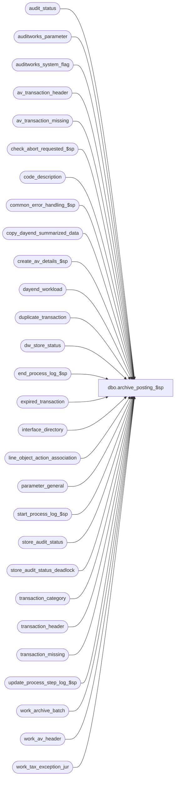

# dbo.archive_posting_$sp

**Database:** auditworks  
**Server:** bedrockdb01  

## Architecture Diagram



## Table Dependencies

| Referenced Table |
|---|
| audit_status |
| auditworks_parameter |
| auditworks_system_flag |
| av_transaction_header |
| av_transaction_missing |
| check_abort_requested_$sp |
| code_description |
| common_error_handling_$sp |
| copy_dayend_summarized_data |
| create_av_details_$sp |
| dayend_workload |
| duplicate_transaction |
| dw_store_status |
| end_process_log_$sp |
| expired_transaction |
| interface_directory |
| line_object_action_association |
| parameter_general |
| start_process_log_$sp |
| store_audit_status |
| store_audit_status_deadlock |
| transaction_category |
| transaction_header |
| transaction_missing |
| update_process_step_log_$sp |
| work_archive_batch |
| work_av_header |
| work_tax_exception_jur |

## Stored Procedure Code

```sql
CREATE proc [dbo].[archive_posting_$sp] 
( @process_id				binary(16),
  @truncate_flag 			tinyint = 0, -- always 1
  @dayend_process_id 			tinyint = NULL,
  @errmsg 				nvarchar(255) OUTPUT,
  @excluded_dayend_from_time            int = 0,
  @excluded_dayend_to_time              int = 0
)

AS

/* Proc name: archive_posting_$sp
   Desc: Copy accepted transactions to the archive tables from the
     active transaction detail tables and flag the entries for
     later deletion from the active tables.
   Called from day_end_posting_$sp

*** must script with ANSI_NULLS ON, ANSI_WARNINGS ON due to scaleout

HISTORY
Date     Name        Def# Desc
Jan29,14 Paul      147019 update stream number in expired_transaction, use try catch
Nov08,12 Vicci     139583 verification of archive update-timing for scaleout should check that it is 1 (as opposed to any non-zero value).
Mar20,12 Paul    1-48FEQB scaleout: populate exception_flag in work_av_header
Jun10,10 Paul    1-3ZL8RD Increase the maximum possible @batch_no to 9 digits.
Jan21,09 Paul      107623 handle scaleout scenarios, trap invalid scaleout config
Sep02,08 Phu        95126 Call partition maintenance if partitioning is active. Superceded by 107623.
Dec05,06 Paul     DV-1347 improve performance by passing in @log_tax_detail, @scaleout_flag to create_av_details_$sp
Apr10,06 Paul     DV-1334 Populate verified_date column
Jul11,05 Sab	  DV-1295 Move update of dw_store_status out of BEGIN TRAN since will cause problems with scaleout
May02,05 Sab	  DV-1234 Pass the @update_timing variable when executing the procedure create_av_details_$sp
Apr13,05 Sab	  DV-1218 Look at update_timing for interface_id=44 when copying the data to archive from current
Jan27,05 Sab	  DV-1203 Added logic to avoid inserting rows to the archive tables in a scaleout environment.
Jan21,05 David    DV-1191 Improve performance by adding hints. Added logic for scaleout (copy_dayend_summarized_data).
Oct07,04 David    DV-1146 Remove user name.
May10,04 Maryam   DV-1071 Receive @process_id and pass it to check_abort_requested_$sp.
Dec19,03 Winnie	    20856 Clean up work_tax_exception_jur table.
Sep18,03 Maryam     13686 Pass two new parameters for excluded dayend time and call check_abort_requested_$sp
                          to check whether abort has been requested either by the system or user.            
Nov19,02 Paul     1-GFK7X avoid large batch size by correctly initializing @batch_count,
                           correctly assign batch_no for multistream dayend
Aug30,02 Winnie   1-EXXLC Pass the right number of arguements to common_error_handling
May08,02 Winnie	  1-C2Q5L Add abort logic to dayend.
MAR11,02 Daphna   1-BM1OX correct information message 
Mar05,02 Paul     1-AWYZP remove obsolete loss prevention logic
FEB08,02 Daphna   1-AWBZX Renumber message id from 203142 to 201654
                          RETROFIT TO: 02.50.08
                          RETROFIT TO: 02.46.25.11	
JAN28,02 Daphna   1-AJQWT Change datatype of @stores_archived from TINYINT to INT to prevent
                          arithmetic overflow error when @stores_archived = -1*@stores_archived                         
JAN15,02 Daphna   1-A91VP For empty store/date, determine correct status 'dayended' or 'unused' 
					 and update store_audit_status, audit_status and store_posting_status 
                          accordingly. Log Warning message re empty store/date
                          Increment completed workload for empty store/date
                          Cumulate # of stores per archive batch and pass as NEGATIVE in call
                          to update_process_step_log_$sp (see mod to that proc)   
                          Match Oracle: insert to av_transaction_header moved into create_av_details_$sp 
                          Match Oracle: insert to av_interface_control moved into create_av_details_$sp
                          Match Oracle: batching logic
                       RETROFIT TO 02.50.06
                          RETROFIT TO 02.46.25
Nov30,01 Phu         8931 Progress monitor and error handling
Jun07,01 Winnie      7589 Missing transactions by transaction series Version 1.0 	
Jan26,01 Winnie      7221 don't change edit_timestamp when inserting to av_tran header
Oct05,00 Phu         6737 Delete duplicate transaction
Sep12,00 Shapoor     6663 Facilitate Multi Stream Dayend.
May25,00 John G      5864 Change '= NULL' to 'IS NULL' where applicable to mirror Oracle.
Mar21,00 ShuZ        6120 Provide Selective transaction archiving
Mar01,00 Phu         5900 Change @@fetch_status > 0 to @@fetch_status <> 0 for MS SQL compatibility
Jun08,99 Paul        4809 add default for @dayend_lp_flag
May07,99 Paul        4532 remove identity column
Mar30,99 Paul        4353 Add lp module
         Phu              Author
*/

DECLARE
    	@batch_count			int,
	@batch_no 			int,
	@commit_flag			tinyint,
	@concurrent_dayend_processes 	tinyint,
	@current_date 			smalldatetime,
	@cursor_open 			tinyint,
	@date_reject_id	 		tinyint,
	@errmsg2				nvarchar(2000),
	@errmsg3				nvarchar(2000),
	@errline				int,
	@errno 				int,
	@log_error_flag			tinyint,
	@log_tax_detail	 		tinyint,
	@memo1				nvarchar(100),
	@memo2				nvarchar(100),
	@datememo			smalldatetime,  -- DEF 1-BM1OX info message
	@message_id			int,
	@object_name			nvarchar(255),
	@operation_name			nvarchar(100),
	@process_name			nvarchar(100),
	@process_log_entry 		tinyint,
	@process_no 			smallint,
	@process_timestamp 		float,
	@rows				int,
	@sales_date 			smalldatetime,
	@scaleout_flag			int,
	@scaleout_interface_id		smallint,
	@store_audit_status 		smallint,
	@store_dates_count 		int,
	@store_no 			int,
	@stores_archived	 		int,   -- def:  1-AJQWT
	@transaction_count 		int,
	@transactions_per_batch	  	int,
	@update_timing			smallint,
	@abort_flag			tinyint;

IF @dayend_process_id IS NULL /* then */
  RETURN;

SET ANSI_NULLS ON;
SET ANSI_WARNINGS ON;

SELECT
	@commit_flag = 1,  -- do not rollback in error handler
	@current_date = getdate(),
	@cursor_open = 0,
	@errmsg = NULL,
	@log_error_flag = 1,  -- log error in smartload.log
	@process_log_entry = 0,
	@process_no = 28,
	@process_timestamp = 0,
	@message_id = 201068,
	@process_name = 'archive_posting_$sp',
	@stores_archived = 0,
	@transaction_count = 0,
	@abort_flag = 0,
	@batch_count = 0,
	@log_tax_detail = 0,
	@update_timing = 0,
	@scaleout_interface_id = 0;

BEGIN TRY

    SELECT @errmsg = 'Failed to select scaleout_flag',
           @object_name = 'auditworks_system_flag',
          @operation_name = 'SELECT';
SELECT @scaleout_flag = CONVERT(int,flag_numeric_value)
  FROM auditworks_system_flag
 WHERE flag_name = 'scaleout_flag';

SELECT @rows = @@rowcount;
IF @rows = 0
    GOTO business_error;

IF @scaleout_flag = 2 -- when on consolidated server
  RETURN;

	SELECT @errmsg = 'Unable to select concurrent_dayend_processes from parameter_general',
	       @object_name = 'parameter_general',
	       @operation_name = 'SELECT';
SELECT @concurrent_dayend_processes = concurrent_dayend_processes
  FROM parameter_general;

SELECT @rows = @@rowcount;
IF @rows = 0
    GOTO business_error;

  SELECT @errmsg = '@transactions_per_batch',
         @object_name = 'auditworks_parameter',
         @operation_name = 'SELECT';
SELECT @transactions_per_batch = ISNULL(CONVERT(INT, par_value),2000)
  FROM auditworks_parameter
 WHERE par_name = 'transactions_per_batch';
 
IF @transactions_per_batch IS NULL /* then */
  SELECT @transactions_per_batch = 2000;

-- determine whether pre-audit archive is turned on

  SELECT @errmsg = 'Failed to retrieve scaleout_interface_id',
         @object_name = 'auditworks_parameter',
         @operation_name = 'SELECT';
SELECT @scaleout_interface_id = CONVERT(smallint,par_value)
  FROM auditworks_parameter
 WHERE par_name = 'scaleout_interface_id';

  SELECT @errmsg = 'Failed to retrieve update_timing',
        @object_name = 'interface_directory';
SELECT @update_timing = update_timing
  FROM interface_directory
 WHERE interface_id = @scaleout_interface_id;

SELECT @rows = @@rowcount;
IF @rows = 0
  SELECT @update_timing = 0; -- handle non-scaleout scenario where interface 38 may have been removed by tpl

IF @update_timing <> 1 AND @scaleout_flag = 1
BEGIN
  SELECT @errmsg = 'Invalid Config: Scaleout Interface ' + CONVERT(varchar,@scaleout_interface_id) + ' is not turned on',
         @object_name = 'interface_directory',
         @operation_name = 'SELECT';
  GOTO business_error; 
END;

  SELECT @errmsg = 'Unable to select log_tax_detail from auditworks_parameter.',
         @object_name = 'auditworks_parameter';
SELECT @log_tax_detail = CONVERT(tinyint, ISNULL(par_value, '0'))
  FROM auditworks_parameter
 WHERE par_name = 'log_tax_detail';

-- Tax detail will be archived regardless of parameter setting if Tax stripping or G/L accounts by taxability are used

IF @log_tax_detail = 0
BEGIN
  SELECT @errmsg = 'Unable to select from line_object_action_association.',
	   @object_name = 'line_object_action_association',
	   @operation_name = 'SELECT';
  IF EXISTS (SELECT 1
             FROM line_object_action_association
            WHERE lookup_segment1 = 12
               OR lookup_segment2 = 12
               OR lookup_segment3 = 12
               OR lookup_segment4 = 12
               OR lookup_segment5 = 12
               OR lookup_segment6 = 12
               OR lookup_segment7 = 12
               OR lookup_segment8 = 12)
        SELECT @log_tax_detail = 1;
END; -- If @log_tax_detail = 0

/* build temp table to reduce rows joined when updating audit_status */
    SELECT @errmsg = 'Unable to create temp table #store_date_list',
           @object_name = '#store_date_list',
           @operation_name = 'CREATE';
CREATE TABLE #store_date_list (
	store_no    int,
	sales_date  smalldatetime);

/* build temp table to minimize locking */
  SELECT @errmsg = 'Failed to create temp table.',
         @object_name = '#store_status_temp';
CREATE TABLE #store_status_temp (
	store_no 			int 		not null,
	sales_date 			smalldatetime 	not null,
	date_reject_id 			tinyint 	not null,
	store_audit_status 		smallint 	not null);

   SELECT @errmsg = 'Unable to build temp table #store_status_temp',
	       @object_name = '#store_status_temp',
	       @operation_name = 'INSERT';
INSERT INTO #store_status_temp
SELECT	store_no,
	sales_date,
	date_reject_id,
	store_audit_status
  FROM dayend_workload WITH (NOLOCK)
 WHERE dayend_process_id = @dayend_process_id
   AND store_audit_status = 355;

SELECT @store_dates_count = @@rowcount;

IF @store_dates_count = 0
	RETURN;

   SELECT @errmsg = 'Unable to execute start_process_log_$sp',
        @object_name = 'start_process_log_$sp',
        @operation_name = 'EXECUTE';
EXEC start_process_log_$sp @process_no, @process_timestamp OUTPUT,
	@errmsg3 OUTPUT, @dayend_process_id;

SELECT @process_log_entry = 1,
         @errmsg = 'Unable to select batch_no from expired_transaction',
         @object_name = 'expired_transaction',
         @operation_name = 'SELECT';

SELECT @batch_no = MAX(batch_no)
  FROM expired_transaction WITH (NOLOCK);

IF @batch_no IS NULL /* then */
  SELECT @batch_no = 0;

    SELECT @errmsg = 'Before first insert',
           @object_name = 'work_av_header',
           @operation_name = 'TRUNCATE';
TRUNCATE TABLE work_av_header; -- not shared with other streams

   SELECT @errmsg = 'Unable to open cursor store_date_crsr',
         @object_name = 'store_date_crsr',
         @operation_name = 'OPEN';
DECLARE store_date_crsr CURSOR FAST_FORWARD
    FOR
 SELECT	store_no,
	sales_date,
	date_reject_id
   FROM #store_status_temp WITH (NOLOCK);

OPEN store_date_crsr;
SELECT @cursor_open = 1;

WHILE 1=1 --  @store_to_process = 1
BEGIN
  FETCH store_date_crsr 
  INTO @store_no,
       @sales_date,
       @date_reject_id;

  IF @@fetch_status <> 0
    BREAK;

        SELECT @errmsg = 'Failed to execute stored procedure check_abort_requested_$sp',
             @object_name = 'check_abort_requested_$sp',
             @operation_name = 'EXECUTE';
  EXEC check_abort_requested_$sp @dayend_process_id, @process_id, @process_no,
                        @excluded_dayend_from_time, @excluded_dayend_to_time, @errmsg3 OUTPUT;
        
  -- keep track of how many stores per archive batch for process step log
    SELECT @errmsg = 'Unable to insert #store_date_list',
           @object_name = '#store_date_list',
           @operation_name = 'INSERT';
  INSERT #store_date_list (
	store_no, sales_date )
  VALUES ( @store_no, @sales_date );

  SELECT @stores_archived = @stores_archived + 1,
           @errmsg = 'Unable to duplicate_transaction',
           @object_name = 'duplicate_transaction',
           @operation_name = 'DELETE';    
  DELETE duplicate_transaction
   WHERE store_no = @store_no
     AND register_no >= 0
     AND transaction_date = @sales_date
     AND date_reject_id = @date_reject_id;

  /* Create entry in av_transaction_missing and delete from transaction_missing */
    SELECT @errmsg = 'Unable to delete av_transaction_missing',
           @object_name = 'av_transaction_missing',
           @operation_name = 'DELETE';
  DELETE FROM av_transaction_missing
   WHERE store_no = @store_no
     AND sales_date = @sales_date;

    SELECT @errmsg = 'Unable to insert av_transaction_missing',
           @object_name = 'av_transaction_missing',
           @operation_name = 'INSERT';
  INSERT av_transaction_missing (
		store_no,
		register_no,
		sales_date,
		from_transaction_no,
		to_transaction_no,
		verified,
		transaction_series,
		verified_date,
		verification_remark,
		verified_by_user_id,
		override_flag)
  SELECT	store_no,
		register_no,
		sales_date,
		from_transaction_no,
		to_transaction_no,
		verified,
		transaction_series,
		verified_date,
		verification_remark,
		verified_by_user_id,
		override_flag
	 FROM transaction_missing WITH (NOLOCK)
	WHERE store_no = @store_no
	  AND sales_date = @sales_date;

  SELECT @rows = @@rowcount;

  IF @rows > 0
    BEGIN
	SELECT @errmsg = 'Unable to delete transaction_missing',
	       @object_name = 'transaction_missing',
	       @operation_name = 'DELETE';
     DELETE transaction_missing
      WHERE store_no = @store_no
        AND sales_date = @sales_date;
    END;

      SELECT @errmsg = 'Unable to insert work_av_header',
             @object_name = 'work_av_header',
	    @operation_name = 'INSERT';
  INSERT work_av_header (
		process_id,
		transaction_id,
		av_transaction_id,
		store_no,
		register_no,
		transaction_date,
		date_reject_id,
		transaction_series,
		transaction_no,
		entry_date_time,
		archive_handling_method,
		exception_flag)
  SELECT 	@dayend_process_id,
		transaction_id,
		transaction_id,
		store_no,
		register_no,
		transaction_date,
		date_reject_id,
		transaction_series,
		transaction_no,
		entry_date_time,
		tc.archive_handling_method,
		th.exception_flag
	 FROM transaction_header th WITH (NOLOCK), transaction_category tc WITH (NOLOCK)
	WHERE store_no = @store_no
	  AND transaction_date = @sales_date
	  AND date_reject_id = @date_reject_id
	  AND th.transaction_category = tc.transaction_category;

  SELECT @rows = @@rowcount;
  
  SELECT @transaction_count = @transaction_count + @rows,  -- total txns archived
         @batch_count = @batch_count + @rows,  -- total txns in archive batch
         @store_dates_count = @store_dates_count - 1;  -- store/dates left to archive
  
  IF @rows = 0  -- no txns to archive
  BEGIN  
    
    -- update status to Unused or Dayended, Delete from dayend_workload    
    IF EXISTS (SELECT 1 FROM av_transaction_header WITH (NOLOCK)
       WHERE store_no = @store_no
          AND transaction_date = @sales_date
          AND date_reject_id = @date_reject_id)
      SELECT @store_audit_status = 400;
    ELSE
      SELECT @store_audit_status = 900; -- unused because no trans exist
    
    BEGIN TRAN
       SELECT @errmsg = 'Unable to update store_audit_status_deadlock',
             @object_name = 'store_audit_status_deadlock',
             @operation_name = 'UPDATE';   
    UPDATE store_audit_status_deadlock
 	  SET function_no = 18,
	      status_date = getdate();

      SELECT @errmsg = 'set audit_status to @store_audit_status',
	        @object_name = 'audit_status';
    UPDATE audit_status
       SET status_date = @current_date,
           audit_status = @store_audit_status,
           archived_flag = 1 * SIGN(900 - @store_audit_status)
	WHERE store_no = @store_no
	  AND sales_date = @sales_date
	  AND date_reject_id = @date_reject_id;
	    
       SELECT @errmsg = 'set store_audit_status to @store_audit_status',
	        @object_name = 'store_audit_status';
    UPDATE store_audit_status
       SET store_status_date = @current_date,
      	 store_audit_status = @store_audit_status,
  	      archived_flag = 1 * SIGN(900 - @store_audit_status)
     WHERE store_no = @store_no
       AND sales_date = @sales_date
       AND date_reject_id = @date_reject_id;

       SELECT @errmsg = 'where no txns to archive',
	        @object_name = 'dayend_workload',
	        @operation_name = 'DELETE';
    DELETE dayend_workload
     WHERE store_no = @store_no
       AND sales_date = @sales_date
       AND date_reject_id = @date_reject_id
       AND dayend_process_id = @dayend_process_id;
      
    COMMIT;
  
    -- Increment completed_workload by 1
       SELECT @errmsg = 'where no txns to archive',
	     @object_name = 'update_process_step_log_$sp',
	     @operation_name = 'EXECUTE';
    EXEC update_process_step_log_$sp 18, @dayend_process_id, 43, NULL, NULL, NULL;

    -- reduce number of stores per batch for store with no txns to archive        
    SELECT @stores_archived = @stores_archived - 1,
           @errmsg = 'Unable to select @memo2',
           @errno = 201654,
           @object_name = 'code_description',
           @operation_name = 'SELECT';
    
    -- log information message    
    SELECT @memo2 = code_display_descr   -- def 1-BM1OX
      FROM code_description
    WHERE code_type = 13
       AND code = @store_audit_status;

    SELECT @message_id = 201654,         
           @errmsg = 'Dayending Store/Date with no transactions',
           @errno = 201654,
           @object_name = 'store_audit_status',
           @operation_name = 'UPDATE',
	  @memo1 = CONVERT(VARCHAR, @store_no),
           @datememo = @sales_date;

    EXEC common_error_handling_$sp @process_no, @errno, @errmsg, 3, @message_id, @process_name,
         @object_name, @operation_name, @log_error_flag, @dayend_process_id,
         NULL,NULL,NULL,@memo1, @memo2, NULL, @datememo, NULL, NULL, @commit_flag; 

    SELECT @message_id = 201068;  -- reset for next fetch
  END;
  ELSE  -- trans exist to archive
  BEGIN       
    /* DEF 1-A91VP: batching */ 
    -- archive when number of inserted txns exceeds minimum batch size or last store
    IF (@batch_count > @transactions_per_batch OR @store_dates_count = 0) 
    BEGIN 

      /* DEF 1-A91VP: INSERT to av_transaction_header moved into create_av_details_$sp*/
      BEGIN
	    SELECT @errmsg = 'Unable to execute create_av_details_$sp',
	          @object_name = 'create_av_details_$sp',
		 @operation_name = 'EXECUTE';
	EXEC create_av_details_$sp @dayend_process_id, 1, @errmsg3 OUTPUT, @update_timing, @log_tax_detail, @scaleout_flag;
      END;

      /* DEF 1-A91VP: INSERT to av_interface_control moved into create_av_details_$sp*/
      SELECT @batch_count = 0; -- all txns in batch have been archived

      IF @concurrent_dayend_processes > 1
      BEGIN -- simulate Oracle sequence to share batch_no across streams
	    SELECT @errmsg = 'Unable to insert work_archive_batch',
	          @object_name = 'work_archive_batch',
	          @operation_name = 'INSERT';
         INSERT work_archive_batch (dayend_process_id)
         VALUES (@dayend_process_id);

         SELECT @batch_no = @@identity;
        END;
      ELSE
        SELECT @batch_no = @batch_no + 1; -- for expired transaction

      IF @dayend_process_id > 1
        BEGIN
  	     SELECT @errmsg = 'Unable to delete work_tax_exception_jur',
	           @object_name = 'work_tax_exception_jur',
	           @operation_name = 'DELETE';
          DELETE work_tax_exception_jur
            FROM work_av_header h WITH (NOLOCK), work_tax_exception_jur t
           WHERE h.process_id = @dayend_process_id
             AND h.transaction_id = t.transaction_id;
        END; -- IF @dayend_process_id > 1

	   SELECT @errmsg = 'Unable to update dw_store_status',
	       @object_name = 'dw_store_status',
	          @operation_name = 'UPDATE';
      UPDATE dw_store_status
         SET store_status = 2
        FROM #store_date_list sd WITH (NOLOCK), dw_store_status d
       WHERE sd.store_no = d.store_no
         AND sd.sales_date = d.sales_date;

      SELECT @errmsg = 'Unable to insert expired_transaction',
	          @object_name = 'expired_transaction',
	          @operation_name = 'INSERT';
      BEGIN TRAN 

      INSERT expired_transaction (
   		   batch_no,
		   transaction_id,
		   dayend_process_id )
      SELECT @batch_no,
		   transaction_id,
		   @dayend_process_id
	   FROM work_av_header WITH (NOLOCK)
	  WHERE process_id = @dayend_process_id;

	   SELECT @errmsg = 'Unable to update store_audit_status_deadlock',
	          @object_name = 'store_audit_status_deadlock',
	          @operation_name = 'UPDATE';     
      UPDATE store_audit_status_deadlock
        SET function_no = 18,
	     status_date = getdate();

	   SELECT @errmsg = 'set audit_status to 400 from 355',
	          @object_name = 'audit_status';
      UPDATE audit_status
        SET status_date = @current_date,
	    audit_status = 400,
	        archived_flag = 1
        FROM #store_date_list sd WITH (NOLOCK), audit_status a
     WHERE sd.store_no = a.store_no
         AND sd.sales_date = a.sales_date
         AND a.date_reject_id = 0;
	    
	   SELECT @errmsg = 'set store_audit_status to 400 from 355',
	          @object_name = 'store_audit_status';
      UPDATE store_audit_status
        SET store_status_date = @current_date,
	    store_audit_status = 400,
	    archived_flag = 1
        FROM #store_date_list sd WITH (NOLOCK), store_audit_status s
       WHERE sd.store_no = s.store_no
         AND sd.sales_date = s.sales_date
         AND s.date_reject_id = 0;

      /* Insert the data to copy_dayend_summarized_data before we delete from dayend_workload */
      IF @scaleout_flag = 1
      BEGIN
	    SELECT @errmsg = 'Unable to insert copy_dayend_summarized_data',
	          @object_name = 'copy_dayend_summarized_data',
	          @operation_name = 'INSERT';
	INSERT INTO copy_dayend_summarized_data (
	       store_no,
	       transaction_date)
	SELECT store_no,
	       sales_date
	  FROM #store_date_list;
      END;

	   SELECT @errmsg = 'Unable to delete dayend_workload with status 355',
	          @object_name = 'dayend_workload',
	          @operation_name = 'DELETE';
      DELETE dayend_workload
        FROM #store_date_list sd WITH (NOLOCK), dayend_workload d
       WHERE sd.store_no = d.store_no
         AND sd.sales_date = d.sales_date
         AND d.date_reject_id = 0
         AND d.dayend_process_id = @dayend_process_id;

      COMMIT TRAN;

      -- increment process_step_log by # of stores archived by passing (-1 * @stores_archived)
      SELECT @stores_archived = @stores_archived * -1,
 	    @errmsg = 'Increment completed_workload by @stores_archived for step 43',
	    @object_name = 'update_process_step_log_$sp',
	    @operation_name = 'EXECUTE';    
      EXEC update_process_step_log_$sp 18, @dayend_process_id, 43, NULL, @stores_archived, NULL;

	 /* clean up work table */
          SELECT @errmsg = 'cleanup after batch',
                 @object_name = 'work_av_header',
                 @operation_name = 'TRUNCATE';
      TRUNCATE TABLE work_av_header;

         SELECT @errmsg = 'Unable to truncate #store_date_list',
           @object_name = '#store_date_list';
      TRUNCATE TABLE #store_date_list;

      SELECT @stores_archived = 0; -- reset for next batch
    END; --  exceed minimum batch size or last store 
  END;  -- TRANSACTIONS TO ARCHIVE

END; /* while @store_to_process = 1 */

CLOSE store_date_crsr;
DEALLOCATE store_date_crsr;
SELECT @cursor_open = 0;

IF @process_log_entry = 1
BEGIN
      SELECT @object_name = 'end_process_log_$sp',
             @operation_name = 'EXECUTE',
             @errmsg = 'Unable to execute end_process_log_$sp';
  EXEC end_process_log_$sp @process_no, @process_timestamp, @transaction_count;
END;

RETURN;


business_error:   /* Business Rule handler. */

	SELECT @errmsg2 = @errmsg;

	/* Could include similar cleanup code to system error trap when needed (example is from move_store_$sp).
	   However, could also exclude the cleanup code here since the outer system error catch should fire again after the exec below. */

	EXEC common_error_handling_$sp @process_no, @errno, @errmsg, @abort_flag, @message_id, 
	  @process_name, @object_name, @operation_name, 1, @dayend_process_id, 
	  @process_log_entry, @process_timestamp, @transaction_count;
	  /* Note: when the exec above raises an error, that action also fires the system error trap (below) */
	RETURN;
END TRY

BEGIN CATCH; -- trap system errors
    /* common error handling. Appending proc name here because a rollback could occur if called within a transaction. */

        SELECT @errno = ERROR_NUMBER(),
		@errline = ERROR_LINE();

        SELECT @errmsg = CONVERT(nvarchar, @errno) + ':' + @process_name + ':' + CONVERT(nvarchar, @errline) + ':'
               + COALESCE(@errmsg, ' ') + ':' + ERROR_MESSAGE();

	 /* this condition will only be true when raise error in traps above fire this general catch */
	IF @errmsg2 IS NOT NULL
	  SELECT @errmsg = @errmsg2;

	IF @cursor_open = 1
	  BEGIN
		CLOSE store_date_crsr;
		DEALLOCATE store_date_crsr;
		SELECT @cursor_open = 0;
	  END;
	  
	EXEC common_error_handling_$sp @process_no, @errno, @errmsg, @abort_flag, @message_id, 
	  @process_name, @object_name, @operation_name, 1, @dayend_process_id, 
	  @process_log_entry, @process_timestamp, @transaction_count;

	RETURN;
END CATCH;
```

