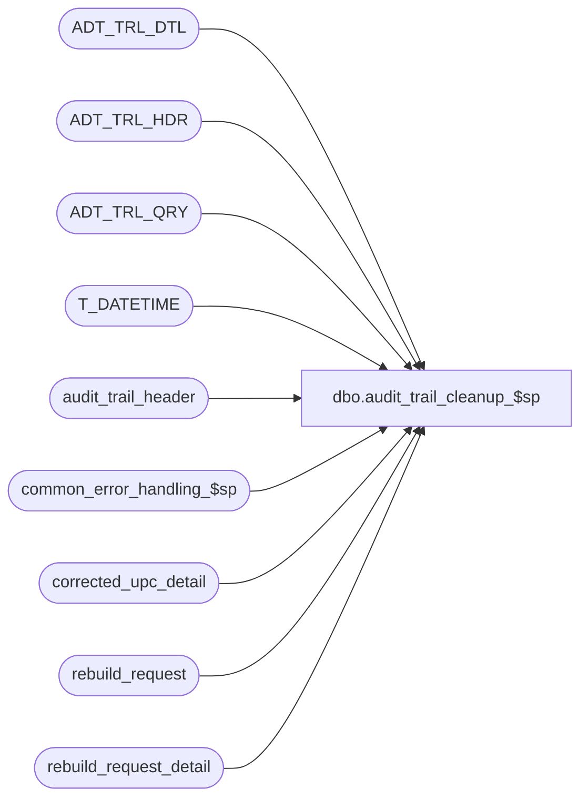

# dbo.audit_trail_cleanup_$sp

**Database:** auditworks  
**Server:** bedrockdb01  

## Architecture Diagram



## Table Dependencies

| Referenced Table |
|---|
| ADT_TRL_DTL |
| ADT_TRL_HDR |
| ADT_TRL_QRY |
| T_DATETIME |
| audit_trail_header |
| common_error_handling_$sp |
| corrected_upc_detail |
| rebuild_request |
| rebuild_request_detail |

## Stored Procedure Code

```sql
create proc dbo.audit_trail_cleanup_$sp 
  
@audit_trail_days smallint = -1

AS


/* Proc Name: audit_trail_cleanup_$sp
   Desc: Purge old data from audit trail where data is at least @audit_trail_days old.
         In SA5, the audit trail uses the ADT_TRL* tables but the old audit_trail tables
	 are also still populated by tm triggers.
	 Called from day_end_purge_$sp.
    Note : Deletes date inclusive 

HISTORY:
Date     Name		Def# Desc
Jan04,11 Paul         105313 Use unicode datatypes
Nov13,08 Paul       1-3Z0EDQ Avoid error due to foreign key constraint
Jan22,08 Paul          94350 purge the new ADT_TRL tables in the SA db, default to 400 day retention.
Mar03,03 Maryam         6478 Handle function no 250.
May03,02 Ian         1-CD0IX Add R3 Error Handling
NOV08,01 Daphna		8415 Exclude R3 C/L and Service Desk txns from audit_trail cleanup
                             (these are deleted in cust_liability_cleanup_$sp) 
Sep17,01 Paul		8741 add set rowcount logic and error routine
May31,01 Maryam         8028 Batch the deletes and since rebuild_request table doesn't have 
                              the request_status column any more first delete from rebuild_request_detail
                              and if there is no more detail for a specific request_id 
                              delete that id from the rebuild_request table.
May14,01 Maryam		7444 Delete any rows from rebuild_request with a status >= 20
                              and a requeset_datetime earlier than the 
                              parameter_general.audit_trail_days ago.
Feb11,98 Paul
Apr25,97 Deepa		author

*** must script with ANSI_NULLS ON, ANSI_WARNINGS ON due to scaleout

*/

DECLARE @errno		int,
        @errmsg		nvarchar(255),
        @chkdate	smalldatetime,
        @max_request_id numeric(12,0),
        @row_count	int,
        @batch_rows	int,
        @log_flag               tinyint,
        @message_id             int,
        @object_name            nvarchar(255),
        @operation_name         nvarchar(100),
        @process_name           nvarchar(100),
        @process_no             smallint,
        @purge_date		T_DATETIME

SET ANSI_NULLS ON
SET ANSI_WARNINGS ON

SELECT  @process_name = 'audit_trail_cleanup_$sp',
        @message_id   = 201068,
        @log_flag     = 0,
        @process_no   = 36

  -- if audit trail retention is turned off, then need to keep audit trail long enough for PCI compliance.
  -- customer would normally save the output of the audit trail report output somewhere else as an archive

  IF @audit_trail_days = -1
    SELECT @audit_trail_days = 400

  SELECT @chkdate = DATEADD(dd,(-1 * @audit_trail_days) + 1,getdate())
  
  SELECT @chkdate = CONVERT(smalldatetime,CONVERT(nchar(6),@chkdate,12)), -- set time to midnight
         @row_count = 5000,
         @batch_rows = 5000

  SELECT @purge_date = @chkdate

  CREATE TABLE #work_purge_list (
	ENTRY_ID	binary(16) not null) -- T_ID

  SELECT @errno = @@error
  IF @errno !=0
  BEGIN
    SELECT @errmsg         = 'Failed to create temp table #work_purge_list',
           @object_name    = '#work_purge_list',
           @operation_name = 'CREATE'
    GOTO error
  END	


  /* Purge old audit trail. trigger will delete rows in audit trail detail table. */
  
  WHILE @row_count = @batch_rows 
  BEGIN

    SET ROWCOUNT @batch_rows

    -- def 8415 exclude R3 C/L and Service Desk txns (function_no between 241 and 250)
  
    DELETE audit_trail_header
     WHERE entry_date <= @chkdate
       AND function_no NOT BETWEEN 241 AND 250

    SELECT @errno = @@error, @row_count = @@rowcount
    IF @errno !=0
    BEGIN
      SELECT @errmsg         = 'Failed to delete audit_trail_header',
             @object_name    = 'audit_trail_header',
             @operation_name = 'DELETE'
      GOTO error
    END

    SET ROWCOUNT 0

  END 

  SELECT @row_count = @batch_rows

  /* purge upc reassign audit trail */

  WHILE @row_count = @batch_rows 
  BEGIN

    SET ROWCOUNT @batch_rows

    DELETE corrected_upc_detail
     WHERE transaction_date <= @chkdate
   
 SELECT @errno = @@error, @row_count = @@rowcount
    IF @errno !=0
  BEGIN
      SELECT @errmsg         = 'Failed to delete corrected_upc_detail',
             @object_name    = 'corrected_upc_detail',
             @operation_name = 'DELETE'
      GOTO error
    END

    SET ROWCOUNT 0
     
  END

  SELECT @row_count = @batch_rows

  /* purge rebuild_request and rebuild_request_detail */

  SELECT @max_request_id = MAX(request_id)
    FROM rebuild_request
   WHERE request_datetime <= @chkdate

  SELECT @errno = @@error
  IF @errno !=0
  BEGIN
    SELECT @errmsg         = 'Failed to select max(request_id)',
           @object_name    = 'rebuild_request',
           @operation_name = 'SELECT'
    GOTO error
  END
  
  WHILE @row_count = @batch_rows -- loop1
  BEGIN
    
    SET ROWCOUNT @batch_rows

    DELETE rebuild_request_detail
     WHERE request_status >= 20
       AND request_id <= @max_request_id

    SELECT @errno = @@error, @row_count = @@rowcount
    IF @errno !=0
    BEGIN
      SELECT @errmsg         = 'Failed to delete rebuild_request_detail',
             @object_name    = 'rebuild_request_detail',
             @operation_name = 'DELETE'
      GOTO error
    END

    SET ROWCOUNT 0

  END -- While @row_count = @batch_rows (loop1)

  SELECT @row_count = @batch_rows

  WHILE @row_count = @batch_rows -- loop2
  BEGIN
  
    SET ROWCOUNT @batch_rows

    DELETE rebuild_request
     WHERE request_id <= @max_request_id
       AND request_id NOT IN (SELECT DISTINCT request_id
                                FROM rebuild_request_detail
                               WHERE request_id <= @max_request_id) 
 
    SELECT @errno = @@error, @row_count = @@rowcount
    IF @errno !=0
    BEGIN
      SELECT @errmsg         = 'Failed to delete rebuild_request',
             @object_name    = 'rebuild_request',
             @operation_name = 'DELETE'
      GOTO error
    END
 
    SET ROWCOUNT 0

  END -- While @row_count = @batch_rows (loop2)


-- Purge the new SA5 audit trail tables


  SELECT @row_count = @batch_rows

  WHILE @row_count = @batch_rows -- loop3
  BEGIN
   SET ROWCOUNT @batch_rows

   INSERT #work_purge_list
   SELECT ENTRY_ID
     FROM ADT_TRL_HDR
    WHERE ENTRY_DATE_TIME <= @purge_date
      AND APP_ID IN (300,1000) -- safety check

   SELECT @errno = @@error, @row_count = @@rowcount
   IF @errno !=0
     BEGIN
      SELECT @errmsg         = 'Failed to insert #work_purge_list',
             @object_name    = '#work_purge_list',
             @operation_name = 'INSERT'
      GOTO error
     END

   SET ROWCOUNT 0

   DELETE ADT_TRL_QRY
     FROM #work_purge_list w, ADT_TRL_QRY aq
    WHERE w.ENTRY_ID = aq.ENTRY_ID

   SELECT @errno = @@error
   IF @errno !=0
     BEGIN
      SELECT @errmsg         = 'Failed to purge ADT_TRL_QRY',
             @object_name    = 'ADT_TRL_QRY',
             @operation_name = 'DELETE'
      GOTO error
     END

   DELETE ADT_TRL_DTL
     FROM #work_purge_list w, ADT_TRL_DTL ad
    WHERE w.ENTRY_ID = ad.ENTRY_ID

   SELECT @errno = @@error
   IF @errno !=0
     BEGIN
      SELECT @errmsg         = 'Failed to purge ADT_TRL_DTL',
             @object_name    = 'ADT_TRL_DTL',
             @operation_name = 'DELETE'
      GOTO error
     END

   -- use a date range since there is an index on ENTRY_DATE_TIME

   DELETE FROM ADT_TRL_HDR
    FROM ADT_TRL_HDR ah
    WHERE ENTRY_DATE_TIME <= @purge_date
      AND APP_ID IN (300,1000) -- safety check
      AND EXISTS (SELECT 1 FROM #work_purge_list w
		WHERE ah.ENTRY_ID = w.ENTRY_ID)

   SELECT @errno = @@error
   IF @errno !=0
     BEGIN
      SELECT @errmsg         = 'Failed to purge ADT_TRL_HDR',
             @object_name    = 'ADT_TRL_HDR',
             @operation_name = 'DELETE'
      GOTO error
     END

   TRUNCATE TABLE #work_purge_list

   SELECT @errno = @@error
   IF @errno !=0
     BEGIN
      SELECT @errmsg         = 'Failed to truncate #work_purge_list',
             @object_name    = '#work_purge_list',
             @operation_name = 'TRUNCATE'
      GOTO error
     END

  END -- While @row_count = @batch_rows (loop3)

  DROP TABLE #work_purge_list

RETURN

error:   /* Common error handler */

	SET ROWCOUNT 0

	EXEC common_error_handling_$sp @process_no, @errno, @errmsg, 0, @message_id,
		@process_name, @object_name, @operation_name, @log_flag
	RETURN
```

