# dbo.av_transaction_modify_$sp

**Database:** auditworks  
**Server:** bedrockdb01  

## Architecture Diagram

```mermaid
flowchart LR
    SP["dbo.av_transaction_modify_$sp"]
    ORG_CHN(["ORG_CHN"]) --> SP
    ORG_CHN_APLCTN_USG(["ORG_CHN_APLCTN_USG"]) --> SP
    archive_adjustment(["archive_adjustment"]) --> SP
    auditworks_system_flag(["auditworks_system_flag"]) --> SP
    authorization_detail(["authorization_detail"]) --> SP
    av_authorization_detail(["av_authorization_detail"]) --> SP
    av_customer(["av_customer"]) --> SP
    av_customer_detail(["av_customer_detail"]) --> SP
    av_discount_detail(["av_discount_detail"]) --> SP
    av_interface_control(["av_interface_control"]) --> SP
    av_line_note(["av_line_note"]) --> SP
    av_merchandise_detail(["av_merchandise_detail"]) --> SP
    av_payroll_detail(["av_payroll_detail"]) --> SP
    av_post_void_detail(["av_post_void_detail"]) --> SP
    av_return_detail(["av_return_detail"]) --> SP
    av_special_order_detail(["av_special_order_detail"]) --> SP
    av_stock_control_detail(["av_stock_control_detail"]) --> SP
    av_tax_override_detail(["av_tax_override_detail"]) --> SP
    av_transaction_header(["av_transaction_header"]) --> SP
    av_transaction_line(["av_transaction_line"]) --> SP
    av_transaction_line_link(["av_transaction_line_link"]) --> SP
    common_error_handling__sp(["common_error_handling_$sp"]) --> SP
    create_function_status__sp(["create_function_status_$sp"]) --> SP
    create_register_status__sp(["create_register_status_$sp"]) --> SP
    create_store_status__sp(["create_store_status_$sp"]) --> SP
    customer(["customer"]) --> SP
    customer_detail(["customer_detail"]) --> SP
    discount_detail(["discount_detail"]) --> SP
    dw_dblink_peripheral(["dw_dblink_peripheral"]) --> SP
    dw_store_status(["dw_store_status"]) --> SP
    function_status(["function_status"]) --> SP
    line_note(["line_note"]) --> SP
    line_object_action_association(["line_object_action_association"]) --> SP
    merchandise_detail(["merchandise_detail"]) --> SP
    payroll_detail(["payroll_detail"]) --> SP
    post_void_detail(["post_void_detail"]) --> SP
    return_detail(["return_detail"]) --> SP
    special_order_detail(["special_order_detail"]) --> SP
    stock_control_detail(["stock_control_detail"]) --> SP
    stock_control_display_def(["stock_control_display_def"]) --> SP
    tax_override_detail(["tax_override_detail"]) --> SP
    tran_id_datatype(["tran_id_datatype"]) --> SP
    transaction_header(["transaction_header"]) --> SP
    transaction_line(["transaction_line"]) --> SP
    transaction_line_link(["transaction_line_link"]) --> SP
    transaction_series(["transaction_series"]) --> SP
    verify_transaction__sp(["verify_transaction_$sp"]) --> SP
    work_interface_control(["work_interface_control"]) --> SP
```



## Table Dependencies

| Referenced Table |
|---|
| ORG_CHN |
| ORG_CHN_APLCTN_USG |
| archive_adjustment |
| auditworks_system_flag |
| authorization_detail |
| av_authorization_detail |
| av_customer |
| av_customer_detail |
| av_discount_detail |
| av_interface_control |
| av_line_note |
| av_merchandise_detail |
| av_payroll_detail |
| av_post_void_detail |
| av_return_detail |
| av_special_order_detail |
| av_stock_control_detail |
| av_tax_override_detail |
| av_transaction_header |
| av_transaction_line |
| av_transaction_line_link |
| common_error_handling_$sp |
| create_function_status_$sp |
| create_register_status_$sp |
| create_store_status_$sp |
| customer |
| customer_detail |
| discount_detail |
| dw_dblink_peripheral |
| dw_store_status |
| function_status |
| line_note |
| line_object_action_association |
| merchandise_detail |
| payroll_detail |
| post_void_detail |
| return_detail |
| special_order_detail |
| stock_control_detail |
| stock_control_display_def |
| tax_override_detail |
| tran_id_datatype |
| transaction_header |
| transaction_line |
| transaction_line_link |
| transaction_series |
| verify_transaction_$sp |
| work_interface_control |

## Stored Procedure Code

```sql
create proc dbo.av_transaction_modify_$sp (@process_id			binary(16),
 @user_id			int,
 @av_transaction_id		tran_id_datatype,
 @transaction_date		smalldatetime,
 @errmsg			nvarchar(255) OUTPUT,
 @adjustment_transaction_id	tran_id_datatype OUTPUT
)
AS

DECLARE 
  @av_transaction_date		smalldatetime, -- original date in archive
  @copy_from_transaction_id 	tran_id_datatype,
  @date_reject_id 		tinyint,
  @entry_date_time		datetime,
  @errno			int,
  @error_code			int,
  @existing_transaction_series  nchar(1),
  @function_no			tinyint,
  @last_adj_transaction_id 	tran_id_datatype,
  @line_id_adjustment		numeric(5,0),
  @message_id			int,
  @min_line_id			numeric(5,0),
  @orig_transaction_id  	tran_id_datatype,
  @object_name			nvarchar(255),
  @operation_name		nvarchar(100),
  @process_name			nvarchar(100),
  @process_no 			smallint,
  @store_no 			int,
  @register_no			smallint,
  @rows				int,
  @status			tinyint,
  @status_reject_reason		tinyint,
  @transaction_category 	tinyint,
  @transaction_no 		int,
  @transaction_series		nchar(1),
  @dblink_name			nvarchar(128),
  @db_name			nvarchar(30),
  @instance_id			int,
  @scaleout_flag		int,
  @sql_command			nvarchar(500),
  @dw_store_status_instance_id	int
  
/* 
PROC NAME: av_transaction_modify_$sp
     DESC: ( MODIFY ) Create a copy (in current tables) of all the detail tables
       related to the archive transaction to be modified twice, once as reversal lines and once as new lines.
       Any errors in this proc will cause function_cleanup to delete the newly inserted transaction from the current tables.

       Called from gui (archive transaction modify) which then calls transaction_add_$sp.

HISTORY:
Date     Name       Defect#  Desc
Jul28,14 Vicci    TFS-37538  Populate dw_store status.
Jul04,14 Vicci    TFS-74694  Log cost.
Jul08,13 Vicci       139695  Add unit_of_measure logging.
Apr14,09 Paul        108944  Receive transaction_date from gui since can be modified as of SA5, moved commit.
Nov13,07 Paul         93924  uplift 93518 to SA5
Jul11,07 Paul       DV-1363  uplift 89109 to SA5
Oct25,06 Phu        77931    Fix outer join for SQL 2005 Mode 90.
Apr28,05 Maryam     DV-1202  Populate transaction_line_link table. rename from_line_id to line_id,
         Paul                expand transaction_id to use tran_id_datatype
Sep24,04 Paul       DV-1146  use user_id, add columns to inserts 
Jun28,05 ShuZ       DV-1071  Add without_receipt_flag when populating return_detail tables.
Apr21,04 Maryam     DV-1071  receive @process_id and pass it to the subprocs.
Oct11,07 Vicci        93518  Added many missing attachment fields to lists of those to be copied.
Jul11,07 Vicci        89109  Log av transaction date as transaction maintenance effective date.
Mar12,04 Maryam       25485  When inserting into stock_control_detail use outer join to stock_control_display_def
                             to use units_reversal_factor for properly making reversals of units.
Nov17,03 Phu          15801  Populate sku_id, reason, imrd, style_reference_id, originating_store_no
Apr24,03 Paul       1-KO2HY  populate till_no
Nov07,02 David      1-FXRSE  Call verify_transaction_$sp.
Oct10,02 David      1-FUDQ1  Verify previous store_audit_status before allowing modification.
Oct07,02 David      1-FT5QL  Make sure transaction_series is not null.
Sep24,02 David      1-EXXLI  Set discountable_group in transaction_line
Jul22,02 Daphna     1-EBHY5  Allow user to designate series for archived tran mod
Jun07,02 Winnie     1-CD0IX  Standardize R3.5 error handling
Jun03,02 Vicci	    1-DESPL  Add display_def_id to stock_control_detail
Jun03,02 David C    1-BMK21  Set transaction_date to today
Jan30,02 Vicci      1-9DI2T  author.

*** must script with ANSI_NULLS ON, ANSI_WARNINGS ON due to scaleout

*/   

SELECT @process_no = 154,
       @process_name = 'av_transaction_modify_$sp',
       @message_id = 201068

SET ANSI_NULLS ON
SET ANSI_WARNINGS ON

SELECT @scaleout_flag = CONVERT(int,flag_numeric_value)
  FROM auditworks_system_flag
 WHERE flag_name = 'scaleout_flag';
SELECT @errno = @@error, @rows = @@rowcount;
IF @errno != 0 OR @rows = 0 
BEGIN
  SELECT @errmsg = 'Failed to select scaleout_flag from auditworks_system_flag. ',
         @object_name = 'auditworks_system_flag',
         @operation_name = 'SELECT'
  GOTO error
END

SELECT @instance_id = CONVERT(int,flag_numeric_value)
  FROM auditworks_system_flag
 WHERE flag_name = 'instance_id';
SELECT @errno = @@error, @rows = @@rowcount;
IF @errno != 0 OR @rows = 0 
BEGIN
  SELECT @errmsg = 'Failed to select instance_id from auditworks_system_flag. ',
         @object_name = 'auditworks_system_flag',
         @operation_name = 'SELECT'
  GOTO error
END

IF @scaleout_flag = 1
BEGIN
  /* Get consolidated server connection information */
  SELECT @dblink_name = dblink_name,
	 @db_name = database_name
    FROM dw_dblink_peripheral
   WHERE instance_id = 0; -- value 0 is for the consolidated server
  SELECT @errno = @@error, @rows = @@rowcount;
  IF @errno != 0 OR @rows = 0 
  BEGIN
    SELECT @errmsg = 'Failed to retrieve connection information for consolidated server. ',
           @object_name = 'dw_dblink_peripheral',
           @operation_name = 'SELECT'
    GOTO error
  END
END; -- If @scaleout_flag = 1

/* Determine if the transaction being passed in has already been adjusted,
   or is itself an adjustment of another transaction,
   and if so pick up the adjusted version */
SELECT @last_adj_transaction_id = MAX(adjustment_transaction_id)
  FROM archive_adjustment
 WHERE av_transaction_id = @av_transaction_id

  SELECT @errno = @@error
  IF @errno != 0
  BEGIN
    SELECT @errmsg = 'Failed to determine if the transaction had already been modified',
           @object_name = 'archive_adjustment',
           @operation_name = 'SELECT'
    GOTO error
  END
 
IF @last_adj_transaction_id IS NULL /* then */
 BEGIN

  SELECT @orig_transaction_id = av_transaction_id
    FROM archive_adjustment
   WHERE adjustment_transaction_id = @av_transaction_id

  SELECT @errno = @@error
  IF @errno != 0
  BEGIN
    SELECT @errmsg = 'Failed to determine if the transaction is an adjustment of another',
           @object_name = 'archive_adjustment',
           @operation_name = 'SELECT'
    GOTO error
  END

  IF @orig_transaction_id IS NOT NULL /* then */
  BEGIN
    SELECT @last_adj_transaction_id = MAX(adjustment_transaction_id)
      FROM archive_adjustment
     WHERE av_transaction_id = @orig_transaction_id
     
    SELECT @errno = @@error
    IF @errno != 0
    BEGIN
      SELECT @errmsg = 'Failed to determine latest adjustment_transaction_id',
             @object_name = 'archive_adjustment',
    @operation_name = 'SELECT'
      GOTO error
    END
  END --IF @orig_transaction_id IS NOT NULL.

END --IF @last_adj_transaction_id IS NULL.

IF @last_adj_transaction_id IS NULL /* then */
  SELECT @copy_from_transaction_id = @av_transaction_id
ELSE
  BEGIN
    SELECT @copy_from_transaction_id = @last_adj_transaction_id

    IF EXISTS ( SELECT 1 
                  FROM transaction_header 
                 WHERE transaction_id = @copy_from_transaction_id )
    BEGIN
      SELECT @adjustment_transaction_id = @copy_from_transaction_id
      -- if the adjustment is open no need to copy it, it can be modified directly
      RETURN
    END
  END  -- ELSE 

IF @orig_transaction_id IS NULL /* then */
  SELECT @orig_transaction_id = @av_transaction_id


SELECT 	@date_reject_id = date_reject_id,
	@entry_date_time = getdate(),
	@error_code = 0,
	@function_no = 154,
	@existing_transaction_series = transaction_series, -- DEF 1-FT5QL
	@transaction_category = transaction_category, -- DEF 1-EXXLI: needed to join to line_object_action_association
	@store_no = store_no,
	@register_no = register_no,
	@transaction_no = transaction_no,
	@av_transaction_date = transaction_date
  FROM	av_transaction_header
 WHERE 	av_transaction_id = @copy_from_transaction_id
	
  SELECT @errno = @@error, @rows = @@rowcount
  IF @errno != 0 
  BEGIN
    SELECT @errmsg = 'Failed to select from av_transaction_header',
           @object_name = 'av_transaction_header',
           @operation_name = 'SELECT'
    GOTO error
  END

  IF @rows != 1
  BEGIN
    SELECT @errmsg = 'Failed to locate av_transaction_id in av_transaction_header', 
           @errno = 201738,
           @message_id = 201738
    GOTO error
  END

SELECT @dw_store_status_instance_id = instance_id
  FROM dw_store_status
 WHERE store_no = @store_no
   AND sales_date = @transaction_date
SELECT @errno = @@error
IF @errno != 0 
BEGIN
  SELECT @errmsg = 'Failed to determine to which instance_id the store/date belongs. ', 
         @object_name = 'dw_store_status',
         @operation_name = 'SELECT'
  GOTO error
END
IF @dw_store_status_instance_id IS NULL
BEGIN
  SELECT @dw_store_status_instance_id = -1
END
ELSE
BEGIN
  IF @dw_store_status_instance_id <> @instance_id
  BEGIN
    SELECT @errno = 201684, 
           @message_id = 201684, 
           @errmsg = 'This store/date belongs to a difference peripheral.  Please execute av_transaction_modify on instance ' + CONVERT(nvarchar, @dw_store_status_instance_id) + '.  ', 
           @object_name = 'dw_store_status',
           @operation_name = 'SELECT'
    GOTO error
  END
END

SELECT @transaction_series = ISNULL(archived_series,'X')
  FROM transaction_series
 WHERE transaction_series = @existing_transaction_series
	
  SELECT @errno = @@error, @rows = @@rowcount
  IF @errno != 0 
  BEGIN
    SELECT @errmsg = 'Failed to select from av_transaction_header',
           @object_name = 'av_transaction_header',
           @operation_name = 'SELECT'
    GOTO error
  END

IF @rows = 0
  SELECT @transaction_series = 'X'

-- Verify if store/register/transaction_no/transaction_series already exists under destination date.
IF EXISTS (SELECT 1
             FROM transaction_header
            WHERE store_no = @store_no
              AND transaction_no = @transaction_no
              AND register_no = @register_no
              AND transaction_series = @transaction_series
              AND transaction_date = @transaction_date)
BEGIN  
  SELECT @errmsg = 'Cannot modify archived transaction to the selected date. Transaction number already exists.',
@errno = 202013,
         @message_id = 202013
  GOTO error
END

-- Create store_status if not already there. Raise error if invalid store/date
EXEC create_store_status_$sp @process_id, @user_id, @store_no, @transaction_date, @date_reject_id OUTPUT,
			@status_reject_reason OUTPUT, @errmsg OUTPUT, 0, @process_no

  SELECT @errno = @@error
  IF @errno != 0
  BEGIN
    IF @errmsg IS NULL /* then */
      SELECT @errmsg = 'Failed to execute stored procedure create_store_status.'
    SELECT @object_name = 'create_store_status_$sp',
           @operation_name = 'EXEC'
    GOTO error
  END

  IF (@status_reject_reason != 0 AND @status_reject_reason != 99)
  BEGIN
   SELECT @errmsg = 'Store/Date has invalid status.',
		@errno = 201519 -- default error message
      IF (@status_reject_reason = 2)
	SELECT @errmsg = 'Period closed.',
		@errno = 201507

      IF (@status_reject_reason = 3)
	SELECT @errmsg = 'Transaction date is a future date.',
		@errno = 201508

      IF (@status_reject_reason = 4)
	SELECT @errmsg = 'Store/Date has already been completed.',
		@errno = 201519

      IF (@status_reject_reason = 7)
	SELECT @errmsg = 'Store does not exist.',
		@errno = 201509

      IF (@status_reject_reason = 8)
	SELECT @errmsg = 'Invalid Workstation. Store/Workstation does not exist.',
		@errno = 201516

      IF (@status_reject_reason = 11)
	SELECT @errmsg = 'Transaction date has already been accepted.',
		@errno = 201522

      SELECT @message_id = @errno,
           @object_name = NULL,
           @operation_name = NULL        
      GOTO error
  END

EXEC create_register_status_$sp @process_id, @user_id, @store_no, @register_no, @transaction_date, @transaction_no, 
				@date_reject_id, 0, @errmsg OUTPUT

  SELECT @errno = @@error
  IF @errno != 0
  BEGIN
    SELECT @errmsg = 'Failed to execute create_register_status_$sp',
           @object_name = 'create_register_status_$sp',
           @operation_name = 'EXECUTE'
    GOTO error
  END
  
EXEC create_function_status_$sp @process_id, @user_id, @function_no, @adjustment_transaction_id, @errmsg,
			   @store_no, @transaction_date, @date_reject_id, @register_no, 0

  SELECT @errno = @@error
  IF @errno != 0
  BEGIN
    SELECT @errmsg = 'Failed to execute create_function_status_$sp',
           @object_name = 'create_function_status_$sp',
           @operation_name = 'EXECUTE'
    GOTO error
  END

IF @scaleout_flag = 1
BEGIN
  SET XACT_ABORT ON;   --required for cross-server execution
END;
IF @dw_store_status_instance_id = -1 
BEGIN
  --Populate dw_store_status for ALL stores at once when evaluating a new date
  IF NOT EXISTS (SELECT 1 FROM dw_store_status WHERE sales_date = @transaction_date)
  BEGIN
    IF @scaleout_flag = 0
    BEGIN
       INSERT INTO dw_store_status (
		store_no,
		sales_date,
		store_status,
		instance_id,
		source_media_rec_recovery_id)
	 SELECT c.ORG_CHN_NUM,
		@transaction_date,
		0,
		0,
		0
	   FROM ORG_CHN_APLCTN_USG u, ORG_CHN c
	  WHERE c.ACTV = 1
	    AND c.ORG_CHN_NUM = u.ORG_CHN_NUM
	    AND u.VLDTY = 1
	    AND u.APLCTN_ID = 300
	    AND NOT EXISTS(
	      SELECT 1 FROM dw_store_status dw
	       WHERE dw.sales_date = @transaction_date
	        AND dw.store_no = u.ORG_CHN_NUM);      
    END --IF @scaleout_flag = 0
    ELSE 
    BEGIN
    
    	/* In a scaleout environment, execute the scaleout_populate_dw_tb_$sp proc on the consolidated server
	   in order to efficiently populate the tables dw_store_status and dw_store_master. */
      BEGIN TRY
	SELECT @errmsg = 'Failed to EXECUTE scaleout_populate_dw_tb_$sp during archive transaction correction. ',
	       @object_name = 'scaleout_populate_dw_tb_$sp',
	       @operation_name = 'EXECUTE';
        SET @sql_command = N'EXEC ' + @dblink_name + '.' + @db_name + N'.dbo.scaleout_populate_dw_tb_$sp ' + 
		   CONVERT(nvarchar(14),@instance_id) + N',' + NCHAR(39) + CONVERT(nvarchar(30),@transaction_date) + NCHAR(39);
        EXEC sp_executesql @sql_command;
       END TRY
       BEGIN CATCH;
  	  SELECT @errno = ERROR_NUMBER();
  	  SELECT @errmsg = @process_name + ':  ' + COALESCE(@errmsg, '') + ERROR_MESSAGE() + ' Line: ' + CONVERT(nvarchar, ERROR_LINE());
	  GOTO error;
       END CATCH;
    END --ELSE of IF @scaleout_flag = 0

    UPDATE dw_store_status
       SET store_status = 1
     WHERE store_no = @store_no
       AND sales_date = @transaction_date
       AND store_status = 0;
    SELECT @errno = @@error
    IF @errno != 0
    BEGIN
      SELECT @errmsg = 'Failed to set status of store/date in dw_store_status to 1.  ', 
             @object_name = 'dw_store_status',
             @operation_name = 'UPDATE'
      GOTO error
    END
  END  --IF no dw_store_status entries exist for the date
  ELSE
  BEGIN
    --Other stores for my date exist but not the store whose transaction is being modified.
    INSERT INTO dw_store_status (
	   store_no,
	   sales_date,
	   store_status,
	   instance_id,
	   source_media_rec_recovery_id)
    SELECT @store_no,
	   @transaction_date,
	   1,
	   0,
	   0
     WHERE NOT EXISTS (SELECT 1 
	                 FROM dw_store_status dw
	         	WHERE dw.sales_date = @transaction_date
	         	  AND dw.store_no = @store_no);
    SELECT @errno = @@error
    IF @errno != 0
    BEGIN
      SELECT @errmsg = 'Failed to INSERT into dw_store_status (single store/date).  ',
             @object_name = 'dw_store_status',
             @operation_name = 'INSERT'
      GOTO error
    END
  END  --ELSE of IF no dw_store_status entries exist for the date
END  --IF @dw_store_status_instance_id = -1 
IF @scaleout_flag = 1
BEGIN
  SET XACT_ABORT OFF; --reactivate error trapping
END;

BEGIN TRANSACTION

INSERT transaction_header (
	store_no,
	register_no,
	transaction_date,
	date_reject_id,
	transaction_series,
	transaction_no,
	entry_date_time,
	cashier_no,
	transaction_category,
	tender_total,
	transaction_void_flag,
	customer_info_exists,
	exception_flag,
	deposit_declaration_flag,
	closeout_flag,
	media_count_flag,
	customer_modified_flag,
	tax_override_flag,
	pos_tax_jurisdiction,
	edit_progress_flag,
	edit_timestamp,
	employee_no,
	transaction_remark,
	last_modified_date_time,
	in_use_timestamp,
	updated_by_user_id,
	till_no)
 SELECT store_no,
	register_no,
	@transaction_date,
	date_reject_id,
	@transaction_series,
	transaction_no,
	entry_date_time,
	cashier_no,
	transaction_category,
	0,--tender_total
	transaction_void_flag,
	customer_info_exists,
	exception_flag,
	deposit_declaration_flag,
	closeout_flag,
	media_count_flag,
	customer_modified_flag,
	tax_override_flag,
	pos_tax_jurisdiction,
	154,
	0, --edit_timestamp
	employee_no,
	transaction_remark,
	getdate(),  --last_modified_date_time
	in_use_timestamp,
	updated_by_user_id,
	till_no
   FROM av_transaction_header
  WHERE av_transaction_id = @copy_from_transaction_id

  SELECT @errno = @@error, @adjustment_transaction_id = @@identity
  IF @errno != 0
  BEGIN
    SELECT @errmsg = 'Failed to INSERT on transaction_header for copy transaction',
           @object_name = 'transaction_header',
           @operation_name = 'INSERT'
    GOTO error
  END

  UPDATE function_status
   SET transaction_id = @adjustment_transaction_id, 
       status = 1
  WHERE user_id = @user_id
   AND function_no = @function_no
   AND process_id = @process_id
   
  SELECT @errno = @@error
  IF @errno != 0
  BEGIN
    SELECT @errmsg = 'Failed to UPDATE function_status to status = 1',
           @object_name = 'function_status',
      @operation_name = 'UPDATE'
    GOTO error
  END

COMMIT TRANSACTION

INSERT transaction_line (
	transaction_id,
	line_id,
	line_sequence,
        line_object_type,
	line_object,
	line_action,
	gross_line_amount,
	pos_discount_amount,
	db_cr_none,
	attachment_qty,
	exception_flag,
	interface_rejection_flag,
	line_void_flag,
	voiding_reversal_flag,
        edit_timestamp,
	reference_type,
	discountable_group,
	reference_no,
	unit_of_measure)
SELECT 	@adjustment_transaction_id,
	line_id,
	line_sequence * -1,
        a.line_object_type,
	a.line_object,
	a.line_action,
	(gross_line_amount * -1),
	(pos_discount_amount * -1),
	a.db_cr_none,
	attachment_qty,
	exception_flag,
	interface_rejection_flag,
	line_void_flag,
	voiding_reversal_flag,
	edit_timestamp,
	a.reference_type,
	discountable_group, -- 1-EXXLI
	reference_no,
	a.unit_of_measure
   FROM av_transaction_line a, line_object_action_association l
  WHERE av_transaction_id = @copy_from_transaction_id
    AND line_sequence >= 0
    AND l.transaction_category = @transaction_category
    AND l.line_object = a.line_object
    AND l.line_action = a.line_action
    

SELECT @errno = @@error
IF @errno != 0
BEGIN
  SELECT @errmsg = 'Failed to INSERT on transaction_line',
         @object_name = 'transaction_line',
         @operation_name = 'INSERT'
  GOTO error
END

/* On transaction lines with a positive line_sequence i.e. the non-reversal portion
   of a transaction were copied in above.  Determine where this positive section begins
   and only copy in corresponding attachments. */
   
SELECT @min_line_id = MIN(line_id)
  FROM transaction_line
 WHERE transaction_id = @adjustment_transaction_id

SELECT @errno = @@error
IF @errno != 0
BEGIN
  SELECT @errmsg = 'Failed to determine first line of transaction',
         @object_name = 'transaction_line',
         @operation_name = 'SELECT'
  GOTO error
END

INSERT return_detail (
	transaction_id,
	line_id,
	return_reason_message,
	return_reason_code,
	mdse_disposition_code,
	via_warehouse_flag,
	original_salesperson,
	original_salesperson2,
	return_from_store,
	return_from_reg,
	return_from_date,
	return_from_transno,
	without_receipt_flag )                                     
SELECT @adjustment_transaction_id,
	line_id,
	return_reason_message,
	return_reason_code,
	mdse_disposition_code,
	via_warehouse_flag,
	original_salesperson,
	original_salesperson2,
	return_from_store,
	return_from_reg,
	return_from_date,
	return_from_transno,
	without_receipt_flag
   FROM av_return_detail
  WHERE av_transaction_id = @copy_from_transaction_id 
    AND line_id >= @min_line_id

SELECT @errno = @@error
IF @errno != 0
BEGIN
  SELECT @errmsg = 'Failed to INSERT on return_detail',
         @object_name = 'return_detail',
         @operation_name = 'INSERT'
  GOTO error
END

INSERT post_void_detail (
	transaction_id,
	line_id,
	post_voided_register,
	post_voided_trans_no,
	post_void_successful,
	post_void_reason_code,
	entry_date_time )
SELECT @adjustment_transaction_id,
	line_id,
	post_voided_register,
	post_voided_trans_no,
	post_void_successful,
	post_void_reason_code,
	entry_date_time
   FROM av_post_void_detail 
  WHERE av_transaction_id = @copy_from_transaction_id 
    AND line_id >= @min_line_id

SELECT @errno = @@error
IF @errno != 0
BEGIN
  SELECT @errmsg = 'Failed to INSERT on post_void_detail',
         @object_name = 'post_void_detail',
         @operation_name = 'INSERT'
  GOTO error
END

INSERT discount_detail (
	transaction_id,
	line_id,
	applied_by_line_id,
	pos_discount_level,
	pos_discount_type,
	pos_discount_amount,
        applied_flag,
	pos_discount_serial_no )
SELECT @adjustment_transaction_id,
	line_id,
	applied_by_line_id,
	pos_discount_level,
	pos_discount_type,
        (pos_discount_amount * -1),
        applied_flag,
	pos_discount_serial_no
   FROM av_discount_detail
  WHERE av_transaction_id = @copy_from_transaction_id
    AND line_id >= @min_line_id

SELECT @errno = @@error
IF @errno != 0
BEGIN
  SELECT @errmsg = 'Failed to INSERT on discount_detail',
         @object_name = 'discount_detail',
         @operation_name = 'INSERT'
  GOTO error
END

INSERT merchandise_detail (
	transaction_id,
	line_id,
	merchandise_category,
	upc_lookup_division,
	upc_no,
	units,
	salesperson,
	salesperson2,
	sku_id,
	style_reference_id,
	class_code,
	subclass_code,
	price_override,
	pos_iplu_missing,
	upc_on_file_flag,
	pos_deptclass,
	ticket_price,
	sold_at_price,
	plu_price,
	scanned,
	pos_identifier,
	pos_identifier_type,
	originating_store_no,
	source_store_no,
	fulfillment_store_no,
	cost )
SELECT @adjustment_transaction_id,
	line_id,
	merchandise_category,
	upc_lookup_division,
	upc_no,
	(units * -1),
	salesperson,
	salesperson2,
	sku_id,
	style_reference_id,
	class_code,
	subclass_code,
	price_override,
	pos_iplu_missing,
	upc_on_file_flag,
	pos_deptclass,
	ticket_price,
	sold_at_price,
	plu_price,
	scanned,
	pos_identifier,
	pos_identifier_type,
	originating_store_no,
	source_store_no,
	fulfillment_store_no,
	cost
   FROM av_merchandise_detail
  WHERE av_transaction_id = @copy_from_transaction_id 
    AND line_id >= @min_line_id

SELECT @errno = @@error
IF @errno != 0
BEGIN
  SELECT @errmsg = 'Failed to INSERT on merchandise_detail',
         @object_name = 'merchandise_detail',
         @operation_name = 'INSERT'
  GOTO error
END

INSERT tax_override_detail (
	transaction_id,
	line_id,
	tax_level,
	tax_category,
	taxable,
	exception_tax_jurisdiction,
	tax_exempt_no)
SELECT @adjustment_transaction_id,
	line_id,
	tax_level,
	tax_category,
	taxable,
	exception_tax_jurisdiction,
	tax_exempt_no
  FROM av_tax_override_detail
 WHERE av_transaction_id = @copy_from_transaction_id

SELECT @errno = @@error
IF @errno != 0
BEGIN
  SELECT @errmsg = 'Failed to INSERT on tax_override_detail',
         @object_name = 'tax_override_detail',
         @operation_name = 'INSERT'
  GOTO error
END

INSERT customer (
	transaction_id,
	line_id,
	customer_role,
	title,
	first_name,
	last_name,
	address_1,
	address_2,
	city,
	county,
	state,
	country,
	post_code,
	telephone_no1,
	telephone_no2,
	customer_no,
	pos_tax_jurisdiction_code, 
	fax,
	email_address)
SELECT @adjustment_transaction_id,
	line_id,
	customer_role,
	title,
	first_name,
	last_name,
	address_1,
	address_2,
	city,
	county,
	state,
	country,
	post_code,
	telephone_no1,
	telephone_no2,
	customer_no,
	pos_tax_jurisdiction_code, 
	fax,
	email_address
   FROM av_customer
  WHERE av_transaction_id = @copy_from_transaction_id 
    AND line_id >= @min_line_id

SELECT @errno = @@error
IF @errno != 0
BEGIN
  SELECT @errmsg = 'Failed to INSERT on customer',
         @object_name = 'customer',
         @operation_name = 'INSERT'
  GOTO error
END

INSERT customer_detail (
	transaction_id,
	line_id,
	customer_role,
	customer_info_type,
	customer_info )
SELECT @adjustment_transaction_id,
	line_id,
	customer_role,
	customer_info_type,
	customer_info 
   FROM av_customer_detail
  WHERE av_transaction_id = @copy_from_transaction_id  
    AND line_id >= @min_line_id

SELECT @errno = @@error
IF @errno != 0
BEGIN
  SELECT @errmsg = 'Failed to INSERT on customer_detail',
         @object_name = 'customer_detail',
         @operation_name = 'INSERT'
  GOTO error
END

INSERT special_order_detail (
	transaction_id,
	line_id,
	units,
	salesperson,
	merchandise_description,
	expecting_delivery_on,
	color_description,
	size_description,
	width_description,
	vendor_name,
	vendor_style_description,
	spo_class_description,
	vendor_no )
SELECT @adjustment_transaction_id,
	line_id,
	(units * -1),
	salesperson,
	merchandise_description,
	expecting_delivery_on,
	color_description,
	size_description,
	width_description,
	vendor_name,
	vendor_style_description,
	spo_class_description,
	vendor_no
   FROM av_special_order_detail
  WHERE av_transaction_id = @copy_from_transaction_id 
    AND line_id >= @min_line_id

SELECT @errno = @@error
IF @errno != 0
BEGIN
  SELECT @errmsg = 'Failed to INSERT on special_order_detail',
         @object_name = 'special_order_detail',
         @operation_name = 'INSERT'
 GOTO error
END

INSERT stock_control_detail (
	transaction_id,
	line_id,
	upc_no,
	merchandise_key,
	initiated_by_host,
	units,
	other_store_no,
	location_no,
	vendor_no,
	count_date,
	pos_identifier,
	pos_identifier_type,
	pos_deptclass,
	upc_lookup_division,
	originating_store_no,
	display_def_id,
	sku_id,
	reason,
	imrd,
	style_reference_id)
SELECT
	@adjustment_transaction_id,
	line_id,
	upc_no,
	merchandise_key,
	initiated_by_host,
	units * ISNULL(units_reversal_factor,-1) ,
	other_store_no,
	location_no,
	vendor_no,
	count_date,
	pos_identifier,
	pos_identifier_type,
	pos_deptclass,
	upc_lookup_division,
	originating_store_no,
	av.display_def_id,
	sku_id,
	reason,
	imrd,
	style_reference_id
   FROM av_stock_control_detail av
        LEFT JOIN stock_control_display_def s ON (av.display_def_id = s.display_def_id)
  WHERE av_transaction_id = @copy_from_transaction_id 
    AND line_id >= @min_line_id

SELECT @errno = @@error
IF @errno != 0
BEGIN
  SELECT @errmsg = 'Failed to INSERT on stock_control_detail',
         @object_name = 'stock_control_detail',
         @operation_name = 'INSERT'
  GOTO error
END

INSERT authorization_detail (
	transaction_id,
	line_id,
	card_type,
	authorization_no,
	expiry_date,
	swipe_indicator,
	approval_message,
	license_no,
	pos_state_code,
	other_id_type,
	other_id,
	deferred_billing_date,
	deferred_billing_plan,
	signature,
	customer_signature_obtained,
	offline_flag )
SELECT @adjustment_transaction_id,
	line_id,
	card_type,
	authorization_no,
	expiry_date,
	swipe_indicator,
	approval_message,
	license_no,
	pos_state_code,
	other_id_type,
	other_id,
	deferred_billing_date,
	deferred_billing_plan,
	signature,
	customer_signature_obtained,
	offline_flag
   FROM av_authorization_detail
  WHERE av_transaction_id = @copy_from_transaction_id 
    AND line_id >= @min_line_id

SELECT @errno = @@error
IF @errno != 0
BEGIN
  SELECT @errmsg = 'Failed to INSERT on authorization_detail',
    @object_name = 'authorization_detail',
         @operation_name = 'INSERT'
  GOTO error
END

INSERT INTO payroll_detail(
       transaction_id,
       line_id,
       employee_no,
       payroll_date,
       employee_payroll_id,
       employee_type,
       payroll_entry_type)
SELECT @adjustment_transaction_id,
       line_id,
       employee_no,
       payroll_date,
       employee_payroll_id,
       employee_type,
       payroll_entry_type
   FROM av_payroll_detail
  WHERE av_transaction_id = @copy_from_transaction_id 
    AND line_id >= @min_line_id

SELECT @errno = @@error
IF @errno != 0
BEGIN
  SELECT @errmsg = 'Failed to INSERT on payroll_detail',
         @object_name = 'payroll_detail',
         @operation_name = 'INSERT'
  GOTO error
END

INSERT line_note (
	transaction_id,
	line_id,
	note_type,
	line_note)
SELECT	@adjustment_transaction_id,
	line_id,
	note_type,
	line_note	
  FROM	av_line_note	
 WHERE  av_transaction_id = @copy_from_transaction_id 
   AND line_id >= @min_line_id

SELECT @errno = @@error
IF @errno != 0
BEGIN
  SELECT @errmsg = 'Failed to INSERT on line_note',
         @object_name = 'line_note',
         @operation_name = 'INSERT'
  GOTO error
END

INSERT transaction_line_link (
	transaction_id,
	line_id,
	linked_line_id)
SELECT @adjustment_transaction_id,
	line_id,
	linked_line_id	
   FROM av_transaction_line_link
  WHERE av_transaction_id = @copy_from_transaction_id 
    AND line_id >= @min_line_id

SELECT @errno = @@error
IF @errno != 0
BEGIN
  SELECT @errmsg = 'Failed to INSERT on transaction_line_link',
         @object_name = 'transaction_line_link',
         @operation_name = 'INSERT'
  GOTO error
END

INSERT work_interface_control (
	process_id,
	if_entry_no,
	interface_id,
	interface_status_flag,
	original_transaction_id )
SELECT  @process_id,
	@adjustment_transaction_id,
	interface_id,
	interface_status_flag,
	av_transaction_id
   FROM av_interface_control
  WHERE av_transaction_id = @copy_from_transaction_id

 SELECT @errno = @@error
 IF @errno != 0
 BEGIN
   SELECT @errmsg = 'Failed to INSERT on work_interface_control',
          @object_name = 'work_interface_control',
          @operation_name = 'INSERT'
   GOTO error
 END


/* 1-FXRSE: Validate the reversal of the transaction before proceeding. 
   Since the user cannot change the reversal lines (i.e. negative line_sequence), do not allow 
   the archived transaction to be modified at all if those lines will be I/F rejected.
   If validation fails, the following error message will be displayed: 
   'Archived transaction cannot be modified because it does not pass current validation criteria.'    
*/
EXEC verify_transaction_$sp @process_id,
			    @user_id,
                            @transaction_id = @adjustment_transaction_id, 
                            @function_no = @process_no, 
                            @errmsg = @errmsg OUTPUT

  SELECT @errno = @@error
  IF @errno != 0
  BEGIN
    SELECT @errmsg = 'Failed to execute verify_transaction_$sp',
           @object_name = 'verify_transaction_$sp',
           @operation_name = 'EXECUTE'
    GOTO error
  END


SELECT @line_id_adjustment = MAX(line_id)
 FROM transaction_line
 WHERE transaction_id = @adjustment_transaction_id

 SELECT @errno = @@error
 IF @errno != 0
 BEGIN
   SELECT @errmsg = 'Failed to determine at what line_id to begin non-reversal section',
          @object_name = 'transaction_line',
          @operation_name = 'SELECT'
   GOTO error
 END

-- Insert the reversal lines to the same transaction

INSERT transaction_line (
	transaction_id,
	line_id,
	line_sequence,
        line_object_type,
	line_object,
	line_action,
	gross_line_amount,
	pos_discount_amount,
	db_cr_none,
	attachment_qty,
	exception_flag,
	interface_rejection_flag,
	line_void_flag,
	voiding_reversal_flag,
        edit_timestamp,
	reference_type,
	discountable_group,
	reference_no,
	unit_of_measure )
SELECT 	transaction_id,
	line_id + @line_id_adjustment,
	line_sequence * -1,
        line_object_type,
	line_object,
	line_action,
	(gross_line_amount * -1),
	(pos_discount_amount * -1),
	db_cr_none,
	attachment_qty,
	exception_flag,
	interface_rejection_flag,
	line_void_flag,
	voiding_reversal_flag,
        edit_timestamp,
	reference_type,
	discountable_group, -- 1-EXXLI
	reference_no,
	unit_of_measure
   FROM transaction_line
  WHERE transaction_id = @adjustment_transaction_id

SELECT @errno = @@error
IF @errno != 0
BEGIN
  SELECT @errmsg = 'Failed to INSERT copy in transaction_line',
         @object_name = 'transaction_line',
         @operation_name = 'INSERT'
  GOTO error
END

INSERT return_detail (
	transaction_id,
	line_id,
	return_reason_message,
	return_reason_code,
	mdse_disposition_code,
	via_warehouse_flag,
	original_salesperson,
	original_salesperson2,
	return_from_store,
	return_from_reg,
	return_from_date,
	return_from_transno,
	without_receipt_flag )                                     
SELECT 	transaction_id,
	line_id + @line_id_adjustment,
	return_reason_message,
	return_reason_code,
	mdse_disposition_code,
	via_warehouse_flag,
	original_salesperson,
	original_salesperson2,
	return_from_store,
	return_from_reg,
	return_from_date,
	return_from_transno,
	without_receipt_flag
   FROM return_detail
  WHERE transaction_id = @adjustment_transaction_id

SELECT @errno = @@error
IF @errno != 0
BEGIN
  SELECT @errmsg = 'Failed to INSERT copy in return_detail',
         @object_name = 'return_detail',
         @operation_name = 'INSERT'
  GOTO error
END

INSERT post_void_detail (
	transaction_id,
	line_id,
	post_voided_register,
	post_voided_trans_no,
	post_void_successful,
	post_void_reason_code,
	entry_date_time )
SELECT 	transaction_id,
	line_id + @line_id_adjustment,
	post_voided_register,
	post_voided_trans_no,
	post_void_successful,
	post_void_reason_code,
	entry_date_time
   FROM post_void_detail 
  WHERE transaction_id = @adjustment_transaction_id

SELECT @errno = @@error
IF @errno != 0
BEGIN
  SELECT @errmsg = 'Failed to INSERT copy in post_void_detail',
         @object_name = 'post_void_detail',
         @operation_name = 'INSERT'
  GOTO error
END

INSERT discount_detail (
	transaction_id,
	line_id,
	applied_by_line_id,
	pos_discount_level,
	pos_discount_type,
	pos_discount_amount,
        applied_flag,
	pos_discount_serial_no )
SELECT  transaction_id,
	line_id + @line_id_adjustment,
	applied_by_line_id + @line_id_adjustment,
	pos_discount_level,
	pos_discount_type,
        (pos_discount_amount * -1),
        applied_flag,
	pos_discount_serial_no
   FROM discount_detail
  WHERE transaction_id = @adjustment_transaction_id

SELECT @errno = @@error
IF @errno != 0
BEGIN
  SELECT @errmsg = 'Failed to INSERT copy in discount_detail',
         @object_name = 'discount_detail',
         @operation_name = 'INSERT'
 GOTO error
END

INSERT merchandise_detail (
	transaction_id,
	line_id,
	merchandise_category,
	upc_lookup_division,
	upc_no,
	units,
	salesperson,
	salesperson2,
	sku_id,
	style_reference_id,
	class_code,
	subclass_code,
	price_override,
	pos_iplu_missing,
	upc_on_file_flag,
	pos_deptclass,
	ticket_price,
	sold_at_price,
	plu_price,
	scanned,
	pos_identifier,
	pos_identifier_type,
	originating_store_no,
	source_store_no,
	fulfillment_store_no,
	cost )
SELECT transaction_id,
	line_id + @line_id_adjustment,
	merchandise_category,
	upc_lookup_division,
	upc_no,
	(units * -1),
	salesperson,
	salesperson2,
	sku_id,
	style_reference_id,
	class_code,
	subclass_code,
	price_override,
	pos_iplu_missing,
	upc_on_file_flag,
	pos_deptclass,
	ticket_price,
	sold_at_price,
	plu_price,
	scanned,
	pos_identifier,
	pos_identifier_type,
	originating_store_no,
	source_store_no,
	fulfillment_store_no,
	cost
   FROM merchandise_detail
  WHERE transaction_id = @adjustment_transaction_id
SELECT @errno = @@error
IF @errno != 0
BEGIN
  SELECT @errmsg = 'Failed to INSERT copy in merchandise_detail',
         @object_name = 'merchandise_detail',
         @operation_name = 'INSERT'
  GOTO error
END

INSERT tax_override_detail (
	transaction_id,
	line_id,
	tax_level,
	tax_category,
	taxable,
	exception_tax_jurisdiction,
	tax_exempt_no)
SELECT  transaction_id,
	line_id + @line_id_adjustment,
	tax_level,
	tax_category,
	taxable,
	exception_tax_jurisdiction,
	tax_exempt_no
  FROM tax_override_detail
 WHERE transaction_id = @adjustment_transaction_id

SELECT @errno = @@error
IF @errno != 0
BEGIN
  SELECT @errmsg = 'Failed to INSERT copy in tax_override_detail',
         @object_name = 'tax_override_detail',
         @operation_name = 'INSERT'
  GOTO error
END

INSERT customer (
	transaction_id,
	line_id,
	customer_role,
	title,
	first_name,
	last_name,
	address_1,
	address_2,
	city,
	county,
	state,
	country,
	post_code,
	telephone_no1,
	telephone_no2,
	customer_no,
	pos_tax_jurisdiction_code, 
	fax,
	email_address)
SELECT  transaction_id,
	line_id + @line_id_adjustment,
	customer_role,
	title,
	first_name,
	last_name,
	address_1,
	address_2,
	city,
	county,
	state,
	country,
	post_code,
	telephone_no1,
	telephone_no2,
	customer_no,
	pos_tax_jurisdiction_code, 
	fax,
	email_address
   FROM customer
  WHERE transaction_id = @adjustment_transaction_id

SELECT @errno = @@error
IF @errno != 0
BEGIN
  SELECT @errmsg = 'Failed to INSERT copy in customer',
         @object_name = 'customer',
         @operation_name = 'INSERT'
  GOTO error
END

INSERT customer_detail (
	transaction_id,
	line_id,
	customer_role,
	customer_info_type,
	customer_info )
SELECT transaction_id,
	line_id + @line_id_adjustment,
	customer_role,
	customer_info_type,
	customer_info 
   FROM customer_detail
  WHERE transaction_id = @adjustment_transaction_id

SELECT @errno = @@error
IF @errno != 0
BEGIN
  SELECT @errmsg = 'Failed to INSERT copy in customer_detail',
         @object_name = 'customer_detail',
         @operation_name = 'INSERT'
  GOTO error
END

INSERT special_order_detail (
	transaction_id,
	line_id,
	units,
	salesperson,
	merchandise_description,
	expecting_delivery_on,
	color_description,
	size_description,
	width_description,
	vendor_name,
	vendor_style_description,
	spo_class_description,
	vendor_no  )
SELECT  transaction_id,
	line_id + @line_id_adjustment,
	(units * -1),
	salesperson,
	merchandise_description,
	expecting_delivery_on,
	color_description,
	size_description,
	width_description,
	vendor_name,
	vendor_style_description,
	spo_class_description,
	vendor_no 
   FROM special_order_detail
  WHERE transaction_id = @adjustment_transaction_id

SELECT @errno = @@error
IF @errno != 0
BEGIN
  SELECT @errmsg = 'Failed to INSERT copy in special_order_detail',
         @object_name = 'special_order_detail',
         @operation_name = 'INSERT'
  GOTO error
END

INSERT stock_control_detail (
	transaction_id,
	line_id,
	upc_no,
	merchandise_key,
	initiated_by_host,
	units,
	other_store_no,
	location_no,
	vendor_no,
	count_date,
	pos_identifier,
	pos_identifier_type,
	pos_deptclass,
	upc_lookup_division,
	originating_store_no,
	display_def_id,
	sku_id,
	reason,
	imrd,
	style_reference_id)
SELECT
	transaction_id,
	line_id + @line_id_adjustment,
	upc_no,
	merchandise_key,
	initiated_by_host,
	units * ISNULL(units_reversal_factor, -1),
	other_store_no,
	location_no,
	vendor_no,
	count_date,
	pos_identifier,
	pos_identifier_type,
	pos_deptclass,
	upc_lookup_division,
	originating_store_no,
	s.display_def_id,
	sku_id,
	reason,
	imrd,
	style_reference_id
  FROM stock_control_detail s
       LEFT JOIN stock_control_display_def f ON (s.display_def_id = f.display_def_id)
  WHERE transaction_id = @adjustment_transaction_id
    
SELECT @errno = @@error
IF @errno != 0
BEGIN
  SELECT @errmsg = 'Failed to INSERT copy in stock_control_detail',
         @object_name = 'stock_control_detail',
         @operation_name = 'INSERT'
  GOTO error
END

IF NOT EXISTS (SELECT 1 FROM stock_control_detail WITH (NOLOCK)
                WHERE transaction_id = @adjustment_transaction_id
                  AND display_def_id = 61)
BEGIN
  INSERT stock_control_detail (
  	 transaction_id,
  	 line_id,
	 count_date,
	 display_def_id)
  VALUES(@adjustment_transaction_id, 0, @av_transaction_date,61)
  SELECT @errno = @@error
  IF @errno != 0
  BEGIN
    SELECT @errmsg = 'Failed to INSERT effective date in stock_control_detail',
           @object_name = 'stock_control_detail',
           @operation_name = 'INSERT'
    GOTO error
  END
END

INSERT authorization_detail (
	transaction_id,
	line_id,
	card_type,
	authorization_no,
	expiry_date,
	swipe_indicator,
	approval_message,
	license_no,
	other_id_type,
	other_id,
	deferred_billing_date,
	deferred_billing_plan,
	customer_signature_obtained,
	offline_flag )
SELECT  transaction_id,
	line_id + @line_id_adjustment,
	card_type,
	authorization_no,
	expiry_date,
	swipe_indicator,
	approval_message,
	license_no,
	other_id_type,
	other_id,
	deferred_billing_date,
	deferred_billing_plan,
	customer_signature_obtained,
	offline_flag
   FROM authorization_detail
  WHERE transaction_id = @adjustment_transaction_id

SELECT @errno = @@error
IF @errno != 0
BEGIN
  SELECT @errmsg = 'Failed to INSERT copy in authorization_detail',
         @object_name = 'authorization_detail',
         @operation_name = 'INSERT'
  GOTO error
END

INSERT payroll_detail (
	transaction_id,
	line_id,
	employee_no,
        payroll_date,
	employee_payroll_id,
	employee_type,
	payroll_entry_type )
SELECT  transaction_id,
	line_id + @line_id_adjustment,
	employee_no,
        payroll_date,
	employee_payroll_id,
	employee_type,
	payroll_entry_type
   FROM payroll_detail
  WHERE transaction_id = @adjustment_transaction_id

SELECT @errno = @@error
IF @errno != 0
BEGIN
  SELECT @errmsg = 'Failed to INSERT copy in payroll_detail',
         @object_name = 'payroll_detail',
         @operation_name = 'INSERT'
  GOTO error
END

INSERT line_note (
	transaction_id,
	line_id,
	note_type,
	line_note)
SELECT	transaction_id,
	line_id + @line_id_adjustment,
	note_type,
	line_note	
  FROM	line_note	
 WHERE  transaction_id = @adjustment_transaction_id

 SELECT @errno = @@error
 IF @errno != 0
 BEGIN
   SELECT @errmsg = 'Failed to INSERT copy in line_note',
          @object_name = 'line_note',
          @operation_name = 'INSERT'
   GOTO error
 END


INSERT archive_adjustment (av_transaction_id, av_transaction_date, adjustment_transaction_id)
VALUES (@orig_transaction_id, @av_transaction_date, @adjustment_transaction_id)

 SELECT @errno = @@error
 IF @errno != 0
 BEGIN
   SELECT @errmsg = 'Failed to INSERT archive_adjustment',
          @object_name = 'archive_adjustment',
          @operation_name = 'INSERT'
   GOTO error
 END

RETURN

error:   /* Common error handler. */

	EXEC common_error_handling_$sp @process_no, @errno, @errmsg, 0, @message_id, 
	@process_name, @object_name, @operation_name, 0, 1, 0, null, 0,	null, 
	null, null, null, null, null, 0, @process_id, @user_id
	
	RETURN
```

