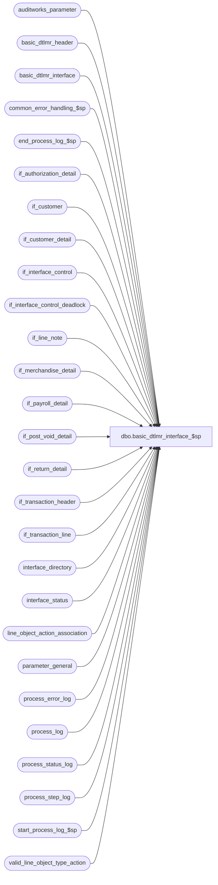

# dbo.basic_dtlmr_interface_$sp

**Database:** auditworks  
**Server:** bedrockdb01  

## Architecture Diagram



## Table Dependencies

| Referenced Table |
|---|
| auditworks_parameter |
| basic_dtlmr_header |
| basic_dtlmr_interface |
| common_error_handling_$sp |
| end_process_log_$sp |
| if_authorization_detail |
| if_customer |
| if_customer_detail |
| if_interface_control |
| if_interface_control_deadlock |
| if_line_note |
| if_merchandise_detail |
| if_payroll_detail |
| if_post_void_detail |
| if_return_detail |
| if_transaction_header |
| if_transaction_line |
| interface_directory |
| interface_status |
| line_object_action_association |
| parameter_general |
| process_error_log |
| process_log |
| process_status_log |
| process_step_log |
| start_process_log_$sp |
| valid_line_object_type_action |

## Stored Procedure Code

```sql
create proc dbo.basic_dtlmr_interface_$sp 
               
  AS
/*
** NAME: basic_dtlmr_interface_$sp
** DESC: Builds dtlmr interface table named basic_dtlmr_interface
** 	 to be used by smartload script bscintface.ict to generate an
** 	 ASCII file which will then be used by BASIX program to create
** 	 interface *DTLMR
**	 Table is built from if_customer, if_customer_detail,
** 	 if_interface_control, if_merchandise_detail, if_transaction_header,
** 	 if_transaction_line, line_object_action_association

IMPORTANT: Any defect found for this proc must be applied to util_basic_dtlmr_int_av_$sp

HISTORY:
Date     Name         Def# Desc
Jan04,11 Paul       105313 Use unicode datatypes
Oct25,06 Phu         77931 Fix outer join, index hint for SQL 2005 Mode 90.
Sep06,06 Tim         76719 Null Concatenation Fix.
May13,05 Maryam    DV-1202 Change from_line_id to line_id.
Sep30,04 David     DV-1146 Use column verified_by_user_id.
Sep02,04 Maryam    DV-1120 Remove logic to set the completed_flag in process_status_log, it is done in reset_basic_dtlmr_$sp
                     38985 
May29,04 Maryam    DV-1071 Hard code customer_sub_code_range_flag to 1.
Dec10,03 David       17221 Limit cashier_no to 7 digits.
                     20260 
                     20262
JAN14,02 Daphna    1-96JC6 Ensure assignment of transaction_code ignores voided lines
                           Retrofit to 02.46.25, 02.50.06
Nov13,01 Winnie       8846 R3 Error handling, add logic to log process_log.
Jul23/01 Paul         8342 removed update to deadlock table 
Apr23/01 DavidM       7589 Missing transactions by transaction Series version 1.0. Added 
                              transaction_series to work table #dtlmr_interface and use in 
                              join criteria in update to voided_if_entry_no.
Apr30/01 Winnie       7596 Avoid store and register being swapped again if ftp fails.
Jan26/01 Paul         7267 Add index hints (salesperson routine), clean up code
Nov15/00 Winnie       7004 Mod for client with store number exceeds 3 digits
Nov07/00 Sab          6842 Needs to check update_timing >= 0 for DTLMR to post
Oct10/00 Phu          6737 Prevent null values insert for subcode 962, 967
May04/00 Louise       6291 Fixed join for transaction_code 2 (added = sign to < )
May03/00 Paul         6270 Round partial units to higher integer (ceiling function)
			               and calculate unit price using the rounded units.
May03/00 Louise       6253 Duplicate error occuring when inserting into header table. 
                              Used MAX aggregate on insert and grouped the fields together.
Apr26/00 Paul         6268 Use subcode 970 for telephone2, use index hints
Apr03/00 Louise       6161 To properly set the transaction codes using interface_control_flag
Mar09/00 Henry        6074 To take only rightmost 4 digits of transaction_no.
Feb25/00 Vicci        6045 Removed erroneous 550-599 handling.
Jul30/99 Mat          5033 Added RTRIM in select from reference_no
Jul07/99 Mat          4888 Add criteria for setting basic_dtlmr_header.transaction_code
                               = '2'
Jun14/99 Henry        4904 Correctly assign basic subcode ranges 930-934 or 960-968 for
		                    customer info, depending on customer_subcode_range_flag in 
		                    reference_type table.
Mar15,99 Phu                  Create details for subcode ranged 550 - 599
		                    Handle sign of discount when return amount > purchase amount.
*/

DECLARE
	@base 				numeric(15,0),
	@count				numeric(12,0),
        @completed_workload		numeric(12,0),
	@current_date			smalldatetime,
	@customer_seq_no 		tinyint,
	@employee_no_length_adj 	tinyint,
	@errmsg 			nvarchar(255),
	@errno 				int,
	@first_batch			int,
	@from_date			datetime,
	@last_retrieval_datetime 	datetime,
	@last_posting_datetime 		datetime,
	@loop_flag			smallint,
	@max_if_entry 			numeric(12,0),
	@message_id			int,
	@min_if_entry 			numeric(12,0),
	@object_name			nvarchar(255),
	@operation_name			nvarchar(100),
	@position 			smallint,
	@posting_in_progress 		tinyint,
	@process_log_entry 		bit,
	@process_no 			smallint,
	@process_name			nvarchar(100),
	@process_timestamp 		float,
	@row_count			int,
	@rows 				int,
	@seq 				tinyint,
	@space_filler			nchar(20),
	@space_filler_12		nchar(12),
	@terminate_interface 		bit,
	@to_date			datetime,
	@transaction_count 		numeric(12,0),
	@voided_trans_count 		int,
	@zero_filler			nchar(20),
	@zero_filler_2			nchar(2),
	@zero_filler_4			nchar(4),
	@zero_filler_9			nchar(9),
	@zero_filler_15			nchar(15),
	@swap_flag			int

SET CONCAT_NULL_YIELDS_NULL OFF
	
SELECT	@base = 10,
	@count = 0,
	@customer_seq_no = 200,
	@errmsg = NULL,
	@process_log_entry = 0,
	@process_no = 203,
	@process_timestamp = 0,
	@space_filler = SPACE(20),
	@space_filler_12 = SPACE(12),
	@terminate_interface = 0,
	@transaction_count = 0,
	@zero_filler = REPLICATE ('0', 20),
	@zero_filler_2 = '00',
	@zero_filler_4 = '0000',
	@zero_filler_9 = '000000000',
	@zero_filler_15 = '000000000000000',
	@process_name = 'basic_dtlmr_interface_$sp',
	@message_id = 201068,
	@loop_flag = 0


IF EXISTS ( SELECT ascii_export
	      FROM interface_directory
	     WHERE basic_dtlmr_subsystem IS NOT NULL 
	       AND ascii_export = 1
	       AND update_timing >= 0 )
  SELECT @rows = 1
ELSE
  RETURN

IF EXISTS (SELECT i.if_entry_no
	     FROM  interface_directory d, if_interface_control i
	    WHERE basic_dtlmr_subsystem IS NOT NULL 
	      AND ascii_export = 1
	      AND interface_control_flag <= 49
	      AND d.interface_id = i.interface_id )
BEGIN
  SELECT @employee_no_length_adj = employee_no_length_adj
    FROM parameter_general

  SELECT @errno = @@error
  IF @errno <> 0
    BEGIN
 	SELECT @errmsg = 'Unable to select from parameter_general',
	       @object_name = 'parameter_general',
               @operation_name = 'SELECT'
	GOTO error
    END
END 
    
ELSE
  RETURN

CREATE TABLE #dtlmr_interface (
	transaction_date 		nchar(8) 	not null,
	store_no 			int 		not null,
	register_no 			smallint 	not null,
	if_entry_no 			numeric(12,0) 	not null,
	line_id 			numeric(5,0) 	not null,
	seq 				tinyint 	not null,
	transaction_no 			int 		not null,
	cashier_no 			int 		not null,
	entry_time 			nchar(4) 	not null,
	transaction_code 		nchar(1) 	not null,
	subcode 			nchar(3) 	not null,
	identifier 			nchar(20) 	not null,
	quantity 			int 		not null,
	extended_amount 		int 		not null,
	subsystem 			nchar(15) 	not null,
	voided_if_entry_no 		numeric(12,0) 	not null,
	transaction_series		nchar(1)		not null)

SELECT @errno = @@error
IF @errno <> 0
  BEGIN
	SELECT @errmsg = 'Unable to create table #dtlmr_interface',
	       @object_name = '#dtlmr_interface',
               @operation_name = 'CREATE'
	GOTO error
  END

CREATE TABLE #count_date (
        transaction_date smalldatetime,
        transaction_count int)

SELECT @errno = @@error
IF @errno != 0
  BEGIN
   SELECT @errmsg = 'Unable to create temp table #count_date',
          @object_name = '#count_date',
          @operation_name = 'CREATE'
   GOTO error
  END

  /* check if swap_flag is turned on then update basic_dtlmr_interface table
   swap store no to register no and register no to store no    */
   
SELECT @swap_flag = ISNULL(CONVERT(INT,par_value),0)
  FROM auditworks_parameter
 WHERE par_name = 'swap_dtlmr_interface_store_no'   

SELECT @errno = @@error
    IF @errno <> 0
      BEGIN
	SELECT @errmsg = 'Unable to select from auditworks_parameter (swap_dtlmr_interface_store_no)',
	        @object_name = 'auditworks_parameter',
                @operation_name = 'SELECT'
	GOTO error
      END   

WHILE @terminate_interface = 0
  BEGIN
    IF @transaction_count >= 100000
	BREAK

    SELECT @last_retrieval_datetime = MAX(last_retrieval_datetime),
	   @last_posting_datetime = MAX(last_posting_datetime),
	   @posting_in_progress = MAX(posting_in_progress)
     FROM  interface_status s, interface_directory d
     WHERE s.interface_id = d.interface_id
AND basic_dtlmr_subsystem IS NOT NULL 
       AND ascii_export = 1

    SELECT @errno = @@error
    IF @errno <> 0
      BEGIN
	SELECT @errmsg = 'Unable select last_retrieval_datetime from interface_status',
	      @object_name = 'interface_status',
               @operation_name = 'SELECT'
	GOTO error
      END

    IF @last_retrieval_datetime >= @last_posting_datetime OR @posting_in_progress <> 1
     SELECT @terminate_interface = 1

    TRUNCATE TABLE basic_dtlmr_header

    SELECT @errno = @@error
    IF @errno <> 0
      BEGIN
	SELECT @errmsg = 'Unable to truncate table basic_dtlmr_header',
	       @object_name = 'basic_dtlmr_header',
               @operation_name = 'TRUNCATE'
	GOTO error
      END

/* Create basic_dtlmr_header from 3 tables: if_interface_control,
** if_transaction_header, interface_directory
*/

    SELECT @min_if_entry = MIN (i.if_entry_no)
      FROM interface_directory d, if_interface_control i
     WHERE basic_dtlmr_subsystem IS NOT NULL 
       AND ascii_export = 1
       AND interface_control_flag <= 49
       AND d.interface_id = i.interface_id

    SELECT @errno = @@error
    IF @errno <> 0
      BEGIN
	SELECT @errmsg = 'Unable to select min(if_entry_no) from if_interface_control',
	       @object_name = 'if_interface_control',
               @operation_name = 'SELECT'
	GOTO error
      END

    IF @min_if_entry IS NULL   
       BREAK

    SELECT @max_if_entry = @min_if_entry + 1000

    SELECT
	i.if_entry_no,
	i.interface_id,
	i.interface_control_flag
     INTO #int_directory_control
     FROM  interface_directory d, if_interface_control i
    WHERE d.basic_dtlmr_subsystem IS NOT NULL 
      AND d.ascii_export = 1
      AND i.if_entry_no >= @min_if_entry
      AND i.if_entry_no <= @max_if_entry
      AND i.interface_control_flag <= 49
      AND d.interface_id = i.interface_id

    SELECT @errno = @@error,
	   @rows = @@rowcount
    IF @errno <> 0
      BEGIN
	SELECT @errmsg = 'Unable to insert into #int_directory_control',
	       @object_name = '#int_directory_control',
               @operation_name = 'INSERT'
	GOTO error
      END

    IF @rows <= 0
      BEGIN
	DROP TABLE #int_directory_control

	SELECT @errno = @@error
	IF @errno <> 0
	  BEGIN
		SELECT @errmsg = 'Unable to drop table #int_directory_control',
		       @object_name = '#int_directory_control',
		       @operation_name = 'DROP'
		GOTO error
	  END

	CONTINUE
      END

    SELECT @terminate_interface = 0 /* Don't exit if there is data */

    IF @process_log_entry = 0
      BEGIN
	EXEC start_process_log_$sp @process_no, @process_timestamp OUTPUT, @errmsg OUTPUT

	SELECT @errno = @@error
	IF @errno <> 0
	  BEGIN
		IF @errmsg IS NULL 
                SELECT @errmsg = 'Unable to execute start_process_log_$sp'
		SELECT @object_name = 'start_process_log_$sp',
		       @operation_name = 'EXECUTE'
		GOTO error
	  END

	SELECT @process_log_entry = 1
      END

      IF @loop_flag = 0 
	BEGIN
	  SELECT @first_batch = completed_flag,
	         @completed_workload = completed_workload
	    FROM process_status_log
	   WHERE process_no = @process_no

	  SELECT @errno = @@error
	  IF @errno <> 0
	    BEGIN
	      SELECT @errmsg = 'Unable to select completed_flag from process_status_log ',
		     @object_name = 'process_status_log',
		     @operation_name = 'SELECT'
		GOTO error
	    END

          IF @first_batch IS NULL 
          BEGIN
              INSERT process_status_log
 	             (process_no,
                      process_start_time,
                      expected_workload,
                      completed_workload,
                      completed_flag,
                      abort_requested,
                      transaction_qty)
	      VALUES (@process_no,
                      getdate(),
                      1,
                      0,
                      0,
                      0,
          0)   
    
              SELECT @errno = @@error
	      IF @errno <> 0
	        BEGIN
	          SELECT @errmsg = 'Unable to insert process_status_log (initial)',
	                 @object_name = 'process_status_log',
		         @operation_name = 'INSERT'
		   GOTO error
		END

                INSERT process_step_log
      		       (process_no,
		        stream_no,
		        process_step_no,
		        process_step_start_time,
		   expected_workload,
			completed_workload)
		 VALUES (@process_no,
			 1,
			 64,
			 getdate(),
			 1,
			 0)	    	

		 SELECT @errno = @@error
		 IF @errno <> 0
		   BEGIN
		     SELECT @errmsg = 'Unable to insert process_step_log ',
		            @object_name = 'process_step_log',      
			    @operation_name = 'INSERT'
		      GOTO error
		    END          
          END -- IF @first_batch IS NULL

	  ELSE IF @first_batch = 1
	    BEGIN 
	      UPDATE process_status_log
		 SET completed_flag = 0,
		     expected_workload = 1,
		     completed_workload = 0,
		     transaction_qty = 0,
		     process_start_time = getdate()
	       WHERE process_no = @process_no
		 AND completed_flag = 1

	      SELECT @errno = @@error
	      IF @errno <> 0
		BEGIN
		  SELECT @errmsg = 'Unable to update process_status_log (initial)',
			 @object_name = 'process_status_log',
			 @operation_name = 'UPDATE'
		  GOTO error
		END

		UPDATE process_step_log
	           SET process_step_start_time = getdate(),
		       expected_workload = 1,
		       completed_workload = 0,
		       process_step_no = 64
		 WHERE process_no = @process_no
	           AND stream_no = 1
           
		SELECT @errno = @@error
		IF @errno <> 0
		BEGIN
		  SELECT @errmsg = 'Unable to update process_step_log (initial)',  
			 @object_name = 'process_step_log',
			 @operation_name = 'UPDATE'
		  GOTO error
		END          
            END -- ELSE IF @first_batch = 1

            IF @first_batch = 1 OR @first_batch IS NULL 
            BEGIN
                SELECT @completed_workload = 0

                SELECT @current_date = CONVERT(smalldatetime, convert(nchar,getdate(),112)) 
                IF (SELECT trickle_polling_flag FROM parameter_general) = 0
                  BEGIN
                    IF (SELECT datepart(hh,getdate())) > = 12
                      SELECT @from_date = dateadd(hh,12,dateadd(dd, -7, @current_date)),             
                                 @to_date = dateadd(hh,12,dateadd(dd, -6, @current_date))
                    ELSE 
		      SELECT @from_date = dateadd(hh,12,dateadd(dd, -8, @current_date)),             
                               @to_date = dateadd(hh,12,dateadd(dd, -7, @current_date))
                  END                                             
                ELSE
                  SELECT @from_date = dateadd(dd,-7, @current_date),
                           @to_date = dateadd(dd,-6, @current_date) 

                SELECT @row_count = SUM(transaction_count)
                  FROM process_log
                 WHERE process_start_time >= @from_date
                   AND process_start_time < @to_date
                   AND process_no = @process_no

		SELECT @errno = @@error
		IF @errno <> 0
		  BEGIN
		    SELECT @errmsg = 'Unable to select from process_log ',
			   @object_name = 'process_log',
			   @operation_name = 'SELECT'
		    GOTO error
		  END          

                IF @row_count IS NULL OR @row_count = 0
                  SELECT @row_count = 1

                UPDATE process_status_log
		   SET expected_workload = @row_count
   	         WHERE process_no = @process_no

		  SELECT @errno = @@error
		  IF @errno <> 0
		    BEGIN
		      SELECT @errmsg = 'Unable to update process_status_log for expected_workload',
		             @object_name = 'process_status_log',
 		             @operation_name = 'UPDATE'
		      GOTO error
		    END          

      UPDATE process_step_log
	           SET expected_workload = @row_count
	         WHERE process_no = @process_no
	           AND stream_no = 1

		SELECT @errno = @@error
	        IF @errno <> 0
	 BEGIN
	            SELECT @errmsg = 'Unable to update process_step_log for expected_workload',
	                   @object_name = 'process_step_log',
 	                   @operation_name = 'UPDATE'
	            GOTO error
   	          END          
          END -- IF @first_batch = 1 OR @first_batch IS NULL
	END  -- IF @loop_flag = 0 

    SELECT @loop_flag = 1

    UPDATE process_step_log
       SET process_step_no = 1
     WHERE process_no = @process_no
       AND stream_no = 1

    SELECT @errno = @@error
    IF @errno <> 0
      BEGIN
        SELECT @errmsg = 'Unable to update process_step_log to step_no 1',
               @object_name = 'process_step_log',
               @operation_name = 'UPDATE'
         GOTO error
      END          

    INSERT basic_dtlmr_header (
	if_entry_no,
	transaction_category,
	store_no,
	register_no,
	transaction_date,
	transaction_no,
	entry_time,
	cashier_no,
	transaction_void_flag,
	media_count_flag,
	tender_total,
	employee_no,
	transaction_code,
	subsystem,
	interface_control_flag,
	transaction_series)
    SELECT 
	h.if_entry_no,
	transaction_category,
	store_no,
	register_no,
	CONVERT (nchar (8), transaction_date, 1),
	transaction_no,
	RIGHT (@zero_filler_4 + LTRIM(STR(DATEPART(hh,entry_date_time) * 100
				  + DATEPART(mi,entry_date_time), 4)), 4),
	CONVERT(INT, RIGHT(@zero_filler_9 + CONVERT(nvarchar, cashier_no),7) ), -- limit cashier_no to 7 digits
	transaction_void_flag * ABS(SIGN(transaction_void_flag - 8)),
	media_count_flag,
	CONVERT (INT, tender_total * 100),
	ISNULL (employee_no, 0),
	'0',
	@zero_filler_15,
	MAX(dc.interface_control_flag),
	transaction_series
     FROM  #int_directory_control dc, if_transaction_header h
    WHERE dc.if_entry_no = h.if_entry_no
      AND date_reject_id = 0
      AND (transaction_void_flag) * (transaction_void_flag - 3) * ABS(transaction_void_flag - 8) <= 0
 GROUP BY h.if_entry_no,
	transaction_category,
	store_no,
	register_no,
	CONVERT (nchar (8), transaction_date, 1),
	transaction_no,
	RIGHT (@zero_filler_4 + LTRIM (STR (DATEPART (hh, entry_date_time) * 100
				  + DATEPART (mi, entry_date_time), 4
				   )
			      ), 4
	      ),
	CONVERT(INT, RIGHT(@zero_filler_9 + CONVERT(nvarchar, cashier_no),7) ),
	transaction_void_flag * ABS(SIGN(transaction_void_flag - 8)), --  void_flag = 0, 1, 2, 3, 8
	media_count_flag,
	CONVERT (INT, tender_total * 100),
	ISNULL (employee_no, 0),
	transaction_series

    SELECT @errno = @@error
    IF @errno <> 0
      BEGIN
	SELECT @errmsg = 'Unable to insert basic_dtlmr_header',
	       @object_name = 'basic_dtlmr_header',
               @operation_name = 'INSERT'
	GOTO error
      END

/* Find basic subsystem code */

    UPDATE basic_dtlmr_header
    SET subsystem = REVERSE (RIGHT (@zero_filler_15 +
		    LTRIM (STR ((SELECT SUM(POWER (@base, CONVERT(numeric(15,0), basic_dtlmr_subsystem) - 1))
	 			 FROM 	interface_directory d,
					if_interface_control i
				 WHERE basic_dtlmr_subsystem IS NOT NULL 
				   AND ascii_export = 1
				   AND interface_control_flag <= 49
				   AND dh.if_entry_no = i.if_entry_no
				   AND i.interface_id = d.interface_id
						), 15, 0
					       )
					  ), 15 ))
      FROM basic_dtlmr_header dh

    SELECT @errno = @@error
    IF @errno <> 0
      BEGIN
	SELECT @errmsg = 'Unable to update basic_dtlmr_header (subsystem)',
	       @object_name = 'basic_dtlmr_header',
               @operation_name = 'UPDATE'
	GOTO error
      END

/* Determine transaction code */

    UPDATE basic_dtlmr_header
      SET transaction_code = '1'
      FROM basic_dtlmr_header dh, if_transaction_line l
     WHERE l.if_entry_no = dh.if_entry_no
AND l.line_void_flag = 0  -- def 1-96JC6
       AND ( (dh.tender_total >= 0 AND dh.interface_control_flag IN (10,30))
            OR (dh.tender_total <= 0 AND dh.interface_control_flag = 20) )
       AND (line_action IN (1, 101)
       OR (line_object_type = 1 AND line_action = 201 AND db_cr_none <> 0)
OR (line_object_type = 2 AND line_action IN (11,111)) )

    SELECT @errno = @@error
    IF @errno <> 0
      BEGIN
	SELECT @errmsg = 'Unable to update basic_dtlmr_header (transaction_code = 1)',
	       @object_name = 'basic_dtlmr_header',
   @operation_name = 'UPDATE'
	GOTO error
      END

    UPDATE basic_dtlmr_header
      SET transaction_code = '2'
      FROM basic_dtlmr_header dh, if_transaction_line l
     WHERE l.if_entry_no = dh.if_entry_no
       AND l.line_void_flag = 0  -- def 1-96JC6
       AND ((  ((dh.tender_total < 0 AND dh.interface_control_flag IN (10,30)) 
              OR (dh.tender_total > 0 AND dh.interface_control_flag = 20))
           AND (line_action = 2 OR (line_object_type = 2 AND line_action IN (12,112))) )
         OR (line_action = 102 
              AND ((dh.tender_total <= 0 AND dh.interface_control_flag IN (10,30))
                   OR (dh.tender_total >= 0 AND dh.interface_control_flag = 20) ) ) )
                         
    SELECT @errno = @@error
    IF @errno <> 0
      BEGIN
	SELECT @errmsg = 'Unable to update basic_dtlmr_header (transaction_code = 2)',
	       @object_name = 'basic_dtlmr_header',
               @operation_name = 'UPDATE'
	GOTO error
      END

    UPDATE basic_dtlmr_header
      SET transaction_code = '4'
     WHERE transaction_code = '0' 
       AND (( tender_total < 0 AND interface_control_flag IN (10,30))
            OR tender_total > 0 AND interface_control_flag = 20 )

    SELECT @errno = @@error
    IF @errno <> 0
      BEGIN
	SELECT @errmsg = 'Unable to update basic_dtlmr_header (transaction_code = 4)',
	       @object_name = 'basic_dtlmr_header',
               @operation_name = 'UPDATE'
	GOTO error
      END

    UPDATE basic_dtlmr_header
      SET transaction_code = '3'
     WHERE transaction_code = '0' 
       AND (( tender_total > 0 AND  interface_control_flag IN (10,30) )
            OR tender_total < 0 AND interface_control_flag = 20 )

    SELECT @errno = @@error
    IF @errno <> 0
      BEGIN
	SELECT @errmsg = 'Unable to update basic_dtlmr_header (transaction_code = 3)',
	       @object_name = 'basic_dtlmr_header',
               @operation_name = 'UPDATE'
	GOTO error
      END

    UPDATE basic_dtlmr_header
      SET transaction_code = '7'
      FROM basic_dtlmr_header dh, if_transaction_line l
     WHERE transaction_code = '0'
       AND dh.if_entry_no = l.if_entry_no
       AND l.line_void_flag = 0  -- def 1-96JC6       
       AND (l.line_object_type = 13
            OR l.line_action = 52)

    SELECT @errno = @@error
    IF @errno <> 0
      BEGIN
	SELECT @errmsg = 'Unable to update basic_dtlmr_header (transaction_code = 7)',
	       @object_name = 'basic_dtlmr_header',
               @operation_name = 'UPDATE'
	GOTO error
      END

    UPDATE basic_dtlmr_header
      SET transaction_code = '6'
      FROM basic_dtlmr_header dh, if_transaction_line l
     WHERE l.if_entry_no = dh.if_entry_no
       AND l.line_void_flag = 0  -- def 1-96JC6
       AND ( dh.media_count_flag = 1 OR line_action IN (246,247) )
     
    SELECT @errno = @@error
    IF @errno <> 0
      BEGIN
	SELECT @errmsg = 'Unable to update basic_dtlmr_header (transaction_code = 6)',
	       @object_name = 'basic_dtlmr_header',
               @operation_name = 'UPDATE'
	GOTO error
      END

    UPDATE basic_dtlmr_header
      SET transaction_code = '5'
     WHERE tender_total = 0
       AND transaction_code = '0'

 SELECT @errno = @@error
    IF @errno <> 0
      BEGIN
	SELECT @errmsg = 'Unable to update basic_dtlmr_header (transaction_code = 5)',
	       @object_name = 'basic_dtlmr_header',
     @operation_name = 'UPDATE'
	GOTO error
      END

/* get list of customers where customer_role = 1 */

    UPDATE process_step_log
       SET process_step_no = 5
     WHERE process_no = @process_no
       AND stream_no = 1

    SELECT @errno = @@error
 IF @errno <> 0
      BEGIN
        SELECT @errmsg = 'Unable to update process_step_log to step_no 5',
               @object_name = 'process_step_log',
               @operation_name = 'UPDATE'
         GOTO error
      END          

    SELECT
	transaction_date,
	dh.store_no,
	dh.register_no,
	dh.if_entry_no,
	c.line_id,
	transaction_no,
	cashier_no,
	entry_time,
	transaction_code,
	customer_no,
	customer_role,
	last_name,
	first_name,
	title,
	address_1,
	address_2,
	city,
	state,
	county,
	country,
	post_code,
	telephone_no1,
	telephone_no2,
	dh.tender_total,
	subsystem,
	1 as customer_subcode_range_flag
     INTO #temp_customer
     FROM  basic_dtlmr_header dh, if_customer c
    WHERE dh.if_entry_no = c.if_entry_no
      AND c.customer_role = 1
      
    SELECT @errno = @@error
    IF @errno <> 0
      BEGIN
	SELECT @errmsg = 'Unable to build temp table #temp_customer',
	       @object_name = '#temp_customer',
               @operation_name = 'INSERT'
	GOTO error
      END

/* get list of customers where customer_role = 3 */

    SELECT
	transaction_date,
	dh.store_no,
	dh.register_no,
	dh.if_entry_no,
	c.line_id,
	transaction_no,
	cashier_no,
	entry_time,
	transaction_code,
	customer_no,
	customer_role,
	last_name,
	first_name,
	title,
	address_1,
	address_2,
	city,
	state,
	county,
	country,
	post_code,
	telephone_no1,
	telephone_no2,
	dh.tender_total,
	subsystem,
        1 as customer_subcode_range_flag
   INTO #temp_cust3
   FROM basic_dtlmr_header dh, if_customer c
  WHERE dh.if_entry_no = c.if_entry_no
    AND c.customer_role = 3

    SELECT @errno = @@error
    IF @errno <> 0
      BEGIN
	SELECT @errmsg = 'Unable to build temp table #temp_cust3',
	       @object_name = '#temp_cust3',
               @operation_name = 'INSERT'
	GOTO error
      END

    DELETE #temp_customer
      FROM #temp_customer c1, #temp_cust3 c3
     WHERE c1.if_entry_no = c3.if_entry_no

    SELECT @errno = @@error
    IF @errno <> 0
      BEGIN
	SELECT @errmsg = 'Unable to delete table #temp_customer',
	       @object_name = '#temp_customer',
               @operation_name = 'DELETE'
	GOTO error
      END

    INSERT #temp_customer
    SELECT #temp_cust3.transaction_date, #temp_cust3.store_no, #temp_cust3.register_no, #temp_cust3.if_entry_no, #temp_cust3.line_id, #temp_cust3.transaction_no, #temp_cust3.cashier_no, #temp_cust3.entry_time, #temp_cust3.transaction_code, #temp_cust3.customer_no, #temp_cust3.customer_role, #temp_cust3.last_name, #temp_cust3.first_name, #temp_cust3.title, #temp_cust3.address_1, #temp_cust3.address_2, #temp_cust3.city, #temp_cust3.state, #temp_cust3.county, #temp_cust3.country, #temp_cust3.post_code, #temp_cust3.telephone_no1, #temp_cust3.telephone_no2, #temp_cust3.tender_total, #temp_cust3.subsystem, #temp_cust3.customer_subcode_range_flag
      FROM #temp_cust3

    SELECT @errno = @@error
    IF @errno <> 0
      BEGIN
	SELECT @errmsg = 'Unable to insert table #temp_customer from #temp_cust3',
	       @object_name = '#temp_customer',
	       @operation_name = 'INSERT'
	GOTO error
      END

/* Create interface with subcode 906 */

    UPDATE process_step_log
       SET process_step_no = 2
     WHERE process_no = @process_no
       AND stream_no = 1

    SELECT @errno = @@error
    IF @errno <> 0
      BEGIN
        SELECT @errmsg = 'Unable to update process_step_log to step_no 2',
               @object_name = 'process_step_log',
         @operation_name = 'UPDATE'
         GOTO error
      END          

    INSERT #dtlmr_interface (
	transaction_date,
	store_no,
	register_no,
	if_entry_no,
	line_id,
	seq,
	transaction_no,
	cashier_no,
	entry_time,
	transaction_code,
	subcode,
	identifier,
	quantity,
	extended_amount,
	subsystem,
	voided_if_entry_no,
	transaction_series )
  SELECT
	transaction_date,
	store_no,
	register_no,
	if_entry_no,
	1,
	0,
	transaction_no,
	cashier_no,
	entry_time,
	transaction_code,
	'906',
	'                    ',
	0,
	tender_total,
	subsystem,
	0,
	transaction_series
    FROM basic_dtlmr_header
    WHERE transaction_void_flag = 1

    SELECT @errno = @@error,
	@voided_trans_count = @@rowcount
    IF @errno <> 0
      BEGIN
	SELECT @errmsg = 'Unable to insert #dtlmr_interface for subcode 906',
	       @object_name = '#dtlmr_interface',
               @operation_name = 'INSERT'
	GOTO error
      END

    IF @voided_trans_count > 0
      BEGIN
	UPDATE #dtlmr_interface
	SET voided_if_entry_no = ip.if_entry_no,
	    identifier = RIGHT (SPACE (8) + LTRIM (STR (ih.register_no, 8)), 8) + ' ' +
			 RIGHT (SPACE (4) + LTRIM (STR (ih.transaction_no, 4)), 4) + ' ' +
			 RIGHT (SPACE (6) + LTRIM (STR (ih.cashier_no, 6)), 6),
	    quantity = CONVERT (INT, RIGHT (@zero_filler_4
	                   + LTRIM (STR (DATEPART (hh, ih.entry_date_time) * 100
			   + DATEPART (mi, ih.entry_date_time), 4)), 4))
	FROM #dtlmr_interface dh,
	     if_transaction_header ih,
	     if_post_void_detail ip
	WHERE dh.store_no = ih.store_no
	AND dh.transaction_date = ih.transaction_date
	AND dh.transaction_no = ip.post_voided_trans_no
	AND dh.register_no = ip.post_voided_register
	AND ip.if_entry_no = ih.if_entry_no
        AND ih.transaction_series = dh.transaction_series
	AND ip.post_void_successful = 1
	AND ih.transaction_series = dh.transaction_series

	SELECT @errno = @@error
	IF @errno <> 0
	  BEGIN
	    SELECT @errmsg = 'Unable to update #dtlmr_interface for voided_if_entry_no',
	           @object_name = '#dtlmr_interface',
                   @operation_name = 'UPDATE'
  	    GOTO error
          END
      END

/* Create interface with subcode = basic_subcode from line_object_action_association.
** If employee_type = 'S' and subcode = 970 then subcode = 970 + payroll_entry_type

   If abs(units) < 1, treat as 1 unit for division purposes
*/

    BEGIN TRAN

    UPDATE process_step_log
       SET process_step_no = 11
     WHERE process_no = @process_no
       AND stream_no = 1

    SELECT @errno = @@error
    IF @errno <> 0
      BEGIN
        SELECT @errmsg = 'Unable to update process_step_log to step_no 11',
               @object_name = 'process_step_log',
               @operation_name = 'UPDATE'
         GOTO error
      END          

    INSERT basic_dtlmr_interface (
	transaction_date,
	store_no,
	register_no,
	if_entry_no,
	line_id,
	seq,
	transaction_no,
	cashier_no,
	entry_time,
	transaction_code,
	subcode,
	identifier,
	quantity,
	extended_amount,
	tender_total,
	subsystem )
    SELECT
	transaction_date,
	dh.store_no,
	dh.register_no,
	dh.if_entry_no,
	l.line_id,
	3,
	CONVERT(INT,( RIGHT(@zero_filler_4 + LTRIM((CONVERT(nvarchar(10),transaction_no))),4) )),  -- can only be 4 digits max
	cashier_no,
	entry_time,
	transaction_code,
	basic_subcode,
	RIGHT (@zero_filler + LTRIM(RTRIM(ISNULL (STR (upc_no, 20), ISNULL (reference_no, ' ')))), 20),
	ISNULL (CEILING(ABS(units)), 1),
	CONVERT (INT, (gross_line_amount * l.db_cr_none * 100 * (1 - SIGN (ABS (basic_db_cr_type - 1)))
			+ gross_line_amount * 100 * (1 - SIGN (ABS (basic_db_cr_type - 2)))
			+ gross_line_amount * -100 * (1 - SIGN (ABS (basic_db_cr_type - 3)))
		      ) * voiding_reversal_flag
	   / ISNULL (CEILING(ABS(units)), 1)),
	dh.tender_total,
	subsystem
    FROM basic_dtlmr_header dh
	INNER JOIN if_transaction_line l ON (dh.if_entry_no = l.if_entry_no)
	INNER JOIN line_object_action_association o ON (dh.transaction_category = o.transaction_category AND l.line_object = o.line_object AND l.line_action = o.line_action AND o.basic_subcode IS NOT NULL AND o.basic_subcode != '   ')
	INNER JOIN valid_line_object_type_action v ON (l.line_object_type = v.line_object_type AND l.line_action = v.line_action)
	LEFT JOIN if_merchandise_detail m ON (l.if_entry_no = m.if_entry_no AND l.line_id = m.line_id)
    WHERE l.line_void_flag = 0

    SELECT @transaction_count = @transaction_count + @@rowcount,
	   @errno = @@error
    IF @errno <> 0
      BEGIN
	SELECT @errmsg = 'Unable to insert basic_dtlmr_interface for subcode 970 or basic subcode',
	       @object_name = 'basic_dtlmr_interface',
               @operation_name = 'INSERT'
	GOTO error
      END

    UPDATE basic_dtlmr_interface
      SET identifier = @zero_filler
      FROM basic_dtlmr_interface WITH (INDEX = basic_dtlmr_interface_x1)
     WHERE subcode = '922'

    SELECT @errno = @@error, @rows = @@rowcount
    IF @errno <> 0
	  BEGIN
		SELECT @errmsg = 'Unable to update basic_dtlmr_interface for subcode 922',
		       @object_name = 'basic_dtlmr_interface',
	               @operation_name = 'UPDATE'
		GOTO error
	  END

    IF @rows >= 1
      BEGIN
	UPDATE basic_dtlmr_interface
	  SET identifier =  RIGHT (@zero_filler + SUBSTRING (l.line_note, 1, 20), 20)
	  FROM basic_dtlmr_interface d WITH (INDEX = basic_dtlmr_interface_x1),
	       if_line_note l WITH (INDEX = if_line_note_x1)
	 WHERE d.subcode = '922'
	   AND d.if_entry_no = l.if_entry_no
	   AND d.line_id = l.line_id
	   AND l.note_type = 9161

	SELECT @errno = @@error
	IF @errno <> 0
	  BEGIN
		SELECT @errmsg = 'Unable to update basic_dtlmr_interface for subcode 922',
		       @object_name = 'basic_dtlmr_interface',
	               @operation_name = 'UPDATE'
		GOTO error
	  END
      END

    UPDATE basic_dtlmr_interface
     SET identifier =
       RIGHT (REPLICATE ('0', 4 + @employee_no_length_adj)
	     + LTRIM(STR(p.employee_no,4 + @employee_no_length_adj)),
	          4 + @employee_no_length_adj)
             + ' '
             + RIGHT (@zero_filler_2 + LTRIM (STR(p.payroll_entry_type, 2)), 2)
             + REPLICATE (' ', 4 - @employee_no_length_adj)
             + RIGHT (@zero_filler_9 + p.employee_payroll_id, 9)
      FROM basic_dtlmr_interface d WITH (INDEX = basic_dtlmr_interface_x1),
           if_payroll_detail p WITH (INDEX = if_payroll_detail_x0)
     WHERE subcode >= '970'
       AND subcode <= '979'
       AND d.if_entry_no = p.if_entry_no
       AND d.line_id = p.line_id

    SELECT @errno = @@error
    IF @errno <> 0
      BEGIN
	SELECT @errmsg = 'Unable to update basic_dtlmr_interface for subcode ranged 970 - 979',
	       @object_name = 'basic_dtlmr_interface',
               @operation_name = 'UPDATE'
	GOTO error
      END

    UPDATE basic_dtlmr_interface
      SET subcode = STR (970 + p.payroll_entry_type, 3)
      FROM basic_dtlmr_interface d WITH (INDEX = basic_dtlmr_interface_x1),
           if_payroll_detail p WITH (INDEX = if_payroll_detail_x0)
     WHERE subcode = '970'
       AND d.if_entry_no = p.if_entry_no
       AND d.line_id = p.line_id
       AND p.employee_type = 'S'

    SELECT @errno = @@error
    IF @errno <> 0
      BEGIN
	SELECT @errmsg = 'Unable to update basic_dtlmr_interface for subcode 970',
	       @object_name = 'basic_dtlmr_interface',
               @operation_name = 'UPDATE'
	GOTO error
      END

/* Create interface with subcode = 900 */

    UPDATE process_step_log
       SET process_step_no = 14
     WHERE process_no = @process_no
       AND stream_no = 1

    SELECT @errno = @@error
    IF @errno <> 0
      BEGIN
        SELECT @errmsg = 'Unable to update process_step_log to step_no 14',
               @object_name = 'process_step_log',
               @operation_name = 'UPDATE'
         GOTO error
  END          

    INSERT basic_dtlmr_interface (
	transaction_date,
	store_no,
	register_no,
	if_entry_no,
	line_id,
	seq,
	transaction_no,
	cashier_no,
	entry_time,
	transaction_code,
	subcode,
	identifier,
	quantity,
	extended_amount,
	tender_total,
	subsystem )
    SELECT
	transaction_date,
	dh.store_no,
	dh.register_no,
	dh.if_entry_no,
	l.line_id,
	2,
	CONVERT(INT,( RIGHT(@zero_filler_4 + LTRIM((CONVERT(nvarchar(10),transaction_no))),4) )),  -- can only be 4 digits max
	cashier_no,
	entry_time,
	transaction_code,
	'900',
	RIGHT (@zero_filler + LTRIM (STR (salesperson, 20)), 20),
	1,
	0,
	dh.tender_total,
	subsystem
    FROM basic_dtlmr_header dh,	if_merchandise_detail m,
	if_transaction_line l WITH (INDEX = if_transaction_line_x0),
	line_object_action_association o WITH (INDEX = line_object_action_associat_x1)
    WHERE dh.if_entry_no = m.if_entry_no
      AND salesperson IS NOT NULL 
      AND m.if_entry_no = l.if_entry_no
      AND m.line_id = l.line_id
      AND line_void_flag = 0
      AND dh.transaction_category = o.transaction_category
      AND l.line_object = o.line_object
      AND l.line_action = o.line_action
      AND basic_subcode IS NOT NULL  
      AND basic_subcode != '   '

    SELECT @transaction_count = @transaction_count + @@rowcount,
	   @errno = @@error
    IF @errno <> 0
      BEGIN
	SELECT @errmsg = 'Unable to insert basic_dtlmr_interface for subcode 900',
	       @object_name = 'basic_dtlmr_interface',
               @operation_name = 'INSERT'
	GOTO error
      END

/* ELP begins - Create interface with subcode 905 */

    UPDATE process_step_log
       SET process_step_no = 2
     WHERE process_no = @process_no
       AND stream_no = 1

    SELECT @errno = @@error
    IF @errno <> 0
      BEGIN
        SELECT @errmsg = 'Unable to update process_step_log to step_no 2',
               @object_name = 'process_step_log',
               @operation_name = 'UPDATE'
         GOTO error
      END          

    INSERT basic_dtlmr_interface (
	transaction_date,
	store_no,
	register_no,
	if_entry_no,
	line_id,
	seq,
	transaction_no,
	cashier_no,
	entry_time,
	transaction_code,
	subcode,
	identifier,
	quantity,
	extended_amount,
	tender_total,
	subsystem )
    SELECT
	transaction_date,
	store_no,
	register_no,
	if_entry_no,
	1,
	0,
	CONVERT(INT,( RIGHT(@zero_filler_4 + LTRIM((CONVERT(nvarchar(10),transaction_no))),4) )),  -- can only be 4 digits max
	cashier_no,
	entry_time,
	transaction_code,
	'905',
	@space_filler,
	1,
	0,
	tender_total,
	subsystem
     FROM basic_dtlmr_header
    WHERE transaction_void_flag = 2

    SELECT @transaction_count = @transaction_count + @@rowcount,
	   @errno = @@error
    IF @errno <> 0
      BEGIN
	SELECT @errmsg = 'Unable to insert basic_dtlmr_interface for subcode 905',
	       @object_name = 'basic_dtlmr_interface',
               @operation_name = 'INSERT'
	GOTO error
      END

/* Create interface with subcode 906 */

    IF @voided_trans_count > 0
      BEGIN
	INSERT basic_dtlmr_interface (
		transaction_date,
		store_no,
		register_no,
		if_entry_no,
		line_id,
		seq,
		transaction_no,
		cashier_no,
		entry_time,
		transaction_code,
		subcode,
		identifier,
		quantity,
		extended_amount,
		tender_total,
		subsystem )
	SELECT
		transaction_date,
		store_no,
		register_no,
		if_entry_no,
		line_id,
		seq,
		CONVERT(INT,( RIGHT(@zero_filler_4 + LTRIM((CONVERT(nvarchar(10),transaction_no))),4) )),  -- can only be 4 digits max
		cashier_no,
		entry_time,
		transaction_code,
		subcode,
		identifier,
		quantity,
		extended_amount,
		extended_amount,
		subsystem
	FROM #dtlmr_interface

	SELECT @transaction_count = @transaction_count + @@rowcount,
		@errno = @@error
	IF @errno <> 0
	  BEGIN
		SELECT @errmsg = 'Unable to insert basic_dtlmr_interface for subcode 906',
		       @object_name = 'basic_dtlmr_interface',
	               @operation_name = 'INSERT'
		GOTO error
	  END
      END /* if @rows > 0 */

/* Create interface with subcode 918 */

    UPDATE process_step_log
       SET process_step_no = 4
WHERE process_no = @process_no
    AND stream_no = 1

    SELECT @errno = @@error
    IF @errno <> 0
      BEGIN
        SELECT @errmsg = 'Unable to update process_step_log to step_no 4',
  @object_name = 'process_step_log',
               @operation_name = 'UPDATE'
         GOTO error
      END          

    INSERT basic_dtlmr_interface (
	transaction_date,
	store_no,
	register_no,
	if_entry_no,
	line_id,
	seq,
	transaction_no,
	cashier_no,
	entry_time,
	transaction_code,
	subcode,
	identifier,
	quantity,
	extended_amount,
	tender_total,
	subsystem )
    SELECT
	transaction_date,
	store_no,
	register_no,
	r.if_entry_no,
	MIN (r.line_id),
	0,
	CONVERT(INT,( RIGHT(@zero_filler_4 + LTRIM((CONVERT(nvarchar(10),transaction_no))),4) )),  -- can only be 4 digits max
	cashier_no,
	entry_time,
	transaction_code,
	'918',
	RIGHT (@space_filler + LTRIM (STR (return_reason_code, 20)), 20),
	0,
	0,
	dh.tender_total,
	subsystem
     FROM  basic_dtlmr_header dh, if_return_detail r
    WHERE dh.if_entry_no = r.if_entry_no
      AND return_reason_code IS NOT NULL 
    GROUP BY
	transaction_date,
	store_no,
	register_no,
	r.if_entry_no,
	CONVERT(INT,( RIGHT(@zero_filler_4 + LTRIM((CONVERT(nvarchar(10),transaction_no))),4) )),  -- can only be 4 digits max
	cashier_no,
	entry_time,
	transaction_code,
	RIGHT (@space_filler + LTRIM (STR (return_reason_code, 20)), 20),
	dh.tender_total,
	subsystem

    SELECT @transaction_count = @transaction_count + @@rowcount,
	   @errno = @@error
    IF @errno <> 0
      BEGIN
	SELECT @errmsg = 'Unable to insert basic_dtlmr_interface for subcode 918',
	       @object_name = 'basic_dtlmr_interface',
               @operation_name = 'INSERT'
	GOTO error
      END

/* Create interface with subcode 970 */

    INSERT basic_dtlmr_interface (
	transaction_date,
	store_no,
	register_no,
	if_entry_no,
	line_id,
	seq,
	transaction_no,
	cashier_no,
	entry_time,
	transaction_code,
	subcode,
	identifier,
	quantity,
	extended_amount,
	tender_total,
	subsystem )
    SELECT
	transaction_date,
	store_no,
	register_no,
	r.if_entry_no,
	MIN(r.line_id),
	0,
	CONVERT(INT,( RIGHT(@zero_filler_4 + LTRIM((CONVERT(nvarchar(10),transaction_no))),4) )),  -- can only be 4 digits max
	cashier_no,
	entry_time,
	transaction_code,
	'970',
	RIGHT (@space_filler + LTRIM (STR (return_from_reg, 20)), 20),
	0,
	0,
	dh.tender_total,
	subsystem
     FROM  basic_dtlmr_header dh, if_return_detail r
    WHERE dh.if_entry_no = r.if_entry_no
      AND return_from_reg IS NOT NULL 
    GROUP BY
	transaction_date,
	store_no,
	register_no,
	r.if_entry_no,
	CONVERT(INT,( RIGHT(@zero_filler_4 + LTRIM((CONVERT(nvarchar(10),transaction_no))),4) )),  -- can only be 4 digits max
	cashier_no,
	entry_time,
	transaction_code,
	RIGHT (@space_filler + LTRIM (STR (return_from_reg, 20)), 20),
	dh.tender_total,
	subsystem

    SELECT @transaction_count = @transaction_count + @@rowcount,
	   @errno = @@error
    IF @errno <> 0
      BEGIN
	SELECT @errmsg = 'Unable to insert basic_dtlmr_interface for subcode 970',
	       @object_name = 'basic_dtlmr_interface',
               @operation_name = 'INSERT'
	GOTO error
      END

/* Create interface with subcode 971 */

    INSERT basic_dtlmr_interface (
	transaction_date,
	store_no,
	register_no,
	if_entry_no,
	line_id,
	seq,
	transaction_no,
	cashier_no,
	entry_time,
	transaction_code,
	subcode,
	identifier,
	quantity,
	extended_amount,
	tender_total,
	subsystem )
    SELECT
	transaction_date,
	store_no,
	register_no,
	r.if_entry_no,
	MIN(r.line_id),
	0,
	CONVERT(INT,( RIGHT(@zero_filler_4 + LTRIM((CONVERT(nvarchar(10),transaction_no))),4) )),  -- can only be 4 digits max
	cashier_no,
	entry_time,
	transaction_code,
	'971',
	RIGHT (@space_filler + LTRIM (STR (return_from_transno, 20)), 20),
	0,
	0,
	dh.tender_total,
	subsystem
     FROM  basic_dtlmr_header dh, if_return_detail r
    WHERE dh.if_entry_no = r.if_entry_no
      AND return_from_transno IS NOT NULL 
    GROUP BY
	transaction_date,
	store_no,
	register_no,
	r.if_entry_no,
	CONVERT(INT,( RIGHT(@zero_filler_4 + LTRIM((CONVERT(nvarchar(10),transaction_no))),4) )),  -- can only be 4 digits max
	cashier_no,
	entry_time,
	transaction_code,
	RIGHT (@space_filler + LTRIM (STR (return_from_transno, 20)), 20),
	dh.tender_total,
	subsystem

    SELECT @transaction_count = @transaction_count + @@rowcount,
	   @errno = @@error
    IF @errno <> 0
      BEGIN
	SELECT @errmsg = 'Unable to insert basic_dtlmr_interface for subcode 971',
	       @object_name = 'basic_dtlmr_interface',
               @operation_name = 'INSERT'
        GOTO error
      END

/* Create interface with subcode 972 */

    INSERT basic_dtlmr_interface (
	transaction_date,
	store_no,
	register_no,
	if_entry_no,
	line_id,
	seq,
	transaction_no,
	cashier_no,
	entry_time,
	transaction_code,
	subcode,
	identifier,
	quantity,
	extended_amount,
	tender_total,
	subsystem )
    SELECT
	transaction_date,
	store_no,
	register_no,
	r.if_entry_no,
	MIN(r.line_id),
	0,
	CONVERT(INT,( RIGHT(@zero_filler_4 + LTRIM((CONVERT(nvarchar(10),transaction_no))),4) )),  -- can only be 4 digits max
	cashier_no,
	entry_time,
	transaction_code,
	'972',
	RIGHT (@space_filler + SUBSTRING(CONVERT(nchar(6), return_from_date, 12), 3, 4)
	  + SUBSTRING(CONVERT(nchar(6), return_from_date, 12), 1, 2), 20),
	0,
	0,
	dh.tender_total,
	subsystem
     FROM  basic_dtlmr_header dh, if_return_detail r
    WHERE dh.if_entry_no = r.if_entry_no
      AND return_from_date IS NOT NULL 
    GROUP BY
	transaction_date,
	store_no,
	register_no,
	r.if_entry_no,
	CONVERT(INT,( RIGHT(@zero_filler_4 + LTRIM((CONVERT(nvarchar(10),transaction_no))),4) )),  -- can only be 4 digits max
	cashier_no,
	entry_time,
	transaction_code,
	RIGHT (@space_filler + SUBSTRING (CONVERT (nchar (6), return_from_date, 12), 3, 4) +
			    SUBSTRING (CONVERT (nchar (6), return_from_date, 12), 1, 2)
			  , 20),
	dh.tender_total,
	subsystem

    SELECT @transaction_count = @transaction_count + @@rowcount,
	   @errno = @@error
    IF @errno <> 0
      BEGIN
	SELECT @errmsg = 'Unable to insert basic_dtlmr_interface for subcode 972',
	       @object_name = 'basic_dtlmr_interface',
               @operation_name = 'INSERT'

	GOTO error
      END

/* Create interface with subcode 973 */

    INSERT basic_dtlmr_interface (
	transaction_date,
	store_no,
	register_no,
	if_entry_no,
	line_id,
	seq,
	transaction_no,
	cashier_no,
	entry_time,
	transaction_code,
	subcode,
	identifier,
	quantity,
	extended_amount,
	tender_total,
	subsystem )
    SELECT
	transaction_date,
	store_no,
	register_no,
	r.if_entry_no,
	MIN (r.line_id),
	0,
	CONVERT(INT,( RIGHT(@zero_filler_4 + LTRIM((CONVERT(nvarchar(10),transaction_no))),4) )),  -- can only be 4 digits max
	cashier_no,
	entry_time,
	transaction_code,
	'973',
	RIGHT (@space_filler + LTRIM (STR (return_from_store, 20)), 20),
	0,
	0,
	dh.tender_total,
	subsystem
    FROM basic_dtlmr_header dh,
	 if_return_detail r
    WHERE dh.if_entry_no = r.if_entry_no
      AND return_from_store IS NOT NULL 
    GROUP BY
	transaction_date,
	store_no,
	register_no,
	r.if_entry_no,
	CONVERT(INT,( RIGHT(@zero_filler_4 + LTRIM((CONVERT(nvarchar(10),transaction_no))),4) )),  -- can only be 4 digits max
	cashier_no,
	entry_time,
	transaction_code,
	RIGHT (@space_filler + LTRIM (STR (return_from_store, 20)), 20),
	dh.tender_total,
	subsystem

    SELECT @transaction_count = @transaction_count + @@rowcount,
	   @errno = @@error
    IF @errno <> 0
      BEGIN
	SELECT @errmsg = 'Unable to insert basic_dtlmr_interface for subcode 973',
	       @object_name = 'basic_dtlmr_interface',
               @operation_name = 'INSERT'
	GOTO error
      END

/* ELP ends */


/* Create interface with subcode 911 */

    UPDATE process_step_log
       SET process_step_no = 38
     WHERE process_no = @process_no
       AND stream_no = 1

    SELECT @errno = @@error
    IF @errno <> 0
BEGIN
      SELECT @errmsg = 'Unable to update process_step_log to step_no 38',
               @object_name = 'process_step_log',
               @operation_name = 'UPDATE'
         GOTO error
      END          

    INSERT basic_dtlmr_interface (
	transaction_date,
	store_no,
	register_no,
	if_entry_no,
	line_id,
	seq,
	transaction_no,
	cashier_no,
	entry_time,
	transaction_code,
	subcode,
	identifier,
	quantity,
	extended_amount,
	tender_total,
	subsystem )
    SELECT
	transaction_date,
	store_no,
	register_no,
	if_entry_no,
	1,
	0,
	CONVERT(INT,( RIGHT(@zero_filler_4 + LTRIM((CONVERT(nvarchar(10),transaction_no))),4) )),  -- can only be 4 digits max
	cashier_no,
	entry_time,
	transaction_code,
	'911',
	RIGHT (@zero_filler + LTRIM (STR (employee_no, 20)), 20),
	1,
	0,
	tender_total,
	subsystem
    FROM basic_dtlmr_header
   WHERE employee_no > 0

    SELECT @transaction_count = @transaction_count + @@rowcount,
	   @errno = @@error
    IF @errno <> 0
      BEGIN
	SELECT @errmsg = 'Unable to insert basic_dtlmr_interface for subcode 911',
	       @object_name = 'basic_dtlmr_interface',
               @operation_name = 'INSERT'

	GOTO error
      END

/* Create interface with subcode 969 */

    UPDATE process_step_log
       SET process_step_no = 9
     WHERE process_no = @process_no
       AND stream_no = 1

    SELECT @errno = @@error
    IF @errno <> 0
      BEGIN
        SELECT @errmsg = 'Unable to update process_step_log to step_no 9',
               @object_name = 'process_step_log',
               @operation_name = 'UPDATE'
         GOTO error
      END          

    INSERT basic_dtlmr_interface (
	transaction_date,
	store_no,
	register_no,
	if_entry_no,
	line_id,
	seq,
	transaction_no,
	cashier_no,
	entry_time,
	transaction_code,
	subcode,
	identifier,
	quantity,
	extended_amount,
	tender_total,
	subsystem )
    SELECT DISTINCT
	transaction_date,
	dh.store_no,
	dh.register_no,
	dh.if_entry_no,
	1,
	0,
	CONVERT(INT,( RIGHT(@zero_filler_4 + LTRIM((CONVERT(nvarchar(10),transaction_no))),4) )),  -- can only be 4 digits max
	cashier_no,
	entry_time,
	transaction_code,
	'969',
	RIGHT (@space_filler + ( SELECT SUBSTRING (CONVERT(nchar(8), MAX(payroll_date), 1), 1, 2) +
					SUBSTRING (CONVERT(nchar(8), MAX(payroll_date), 1), 4, 2) +
					SUBSTRING (CONVERT(nchar(8), MAX(payroll_date), 1), 7, 2)
				  FROM if_payroll_detail p
				 WHERE p.if_entry_no = dh.if_entry_no
			       ), 20
	      ),
	1,
	0,
	dh.tender_total,
	subsystem
     FROM  basic_dtlmr_header dh, if_payroll_detail pp
    WHERE dh.if_entry_no = pp.if_entry_no
      AND pp.employee_type <> 'S'

    SELECT @transaction_count = @transaction_count + @@rowcount,
	   @errno = @@error
    IF @errno <> 0
      BEGIN
	SELECT @errmsg = 'Unable to insert basic_dtlmr_interface for subcode 969',
	       @object_name = 'basic_dtlmr_interface',
               @operation_name = 'INSERT'

	GOTO error
      END

/* Create interface with subcode 944 */

    UPDATE process_step_log
       SET process_step_no = 6
     WHERE process_no = @process_no
       AND stream_no = 1

    SELECT @errno = @@error
    IF @errno <> 0
      BEGIN
        SELECT @errmsg = 'Unable to update process_step_log to step_no 6',
               @object_name = 'process_step_log',
               @operation_name = 'UPDATE'
         GOTO error
      END          

    INSERT basic_dtlmr_interface (
	transaction_date,
	store_no,
	register_no,
	if_entry_no,
	line_id,
	seq,
	transaction_no,
	cashier_no,
	entry_time,
	transaction_code,
	subcode,
	identifier,
	quantity,
	extended_amount,
	tender_total,
	subsystem )
    SELECT
	transaction_date,
	store_no,
	register_no,
	if_entry_no,
	line_id,
	@customer_seq_no,
	CONVERT(INT,( RIGHT(@zero_filler_4 + LTRIM((CONVERT(nvarchar(10),transaction_no))),4) )),  -- can only be 4 digits max
	cashier_no,
	entry_time,
	transaction_code,
	'944',
	RIGHT (@zero_filler + LTRIM (STR (customer_no, 20)), 20),
	1,
	0,
	tender_total,
	subsystem
     FROM #temp_customer
    WHERE customer_no IS NOT NULL 

    SELECT @transaction_count = @transaction_count + @@rowcount,
	   @errno = @@error
    IF @errno <> 0
      BEGIN
	SELECT @errmsg = 'Unable to insert basic_dtlmr_interface for subcode 944',
	       @object_name = 'basic_dtlmr_interface',
               @operation_name = 'INSERT'
	GOTO error
      END

/* Create interface with subcode 960 */

    INSERT basic_dtlmr_interface (
	transaction_date,
	store_no,
	register_no,
	if_entry_no,
	line_id,
	seq,
	transaction_no,
	cashier_no,
	entry_time,
	transaction_code,
	subcode,
	identifier,
	quantity,
	extended_amount,
	tender_total,
	subsystem )
    SELECT
	transaction_date,
	store_no,
	register_no,
	if_entry_no,
	line_id,
	@customer_seq_no,
	CONVERT(INT,( RIGHT(@zero_filler_4 + LTRIM((CONVERT(nvarchar(10),transaction_no))),4) )),  -- can only be 4 digits max
	cashier_no,
	entry_time,
	transaction_code,
	'960',
	SUBSTRING (LTRIM (last_name) + @space_filler, 1, 20),
	1,
	0,
	tender_total,
	subsystem
     FROM #temp_customer
    WHERE last_name IS NOT NULL 
      AND LEN (LTRIM (last_name)) > 0
      AND customer_subcode_range_flag = 1

    SELECT @transaction_count = @transaction_count + @@rowcount,
	   @errno = @@error
    IF @errno <> 0
      BEGIN
	SELECT @errmsg = 'Unable to insert basic_dtlmr_interface for subcode 960',
	       @object_name = 'basic_dtlmr_interface',
               @operation_name = 'INSERT'
	GOTO error
      END

/* Create interface with subcode 961 */

    INSERT basic_dtlmr_interface (
	transaction_date,
	store_no,
	register_no,
	if_entry_no,
	line_id,
	seq,
	transaction_no,
	cashier_no,
	entry_time,
	transaction_code,
	subcode,
	identifier,
	quantity,
	extended_amount,
	tender_total,
	subsystem )
    SELECT
	transaction_date,
	store_no,
	register_no,
	if_entry_no,
	line_id,
	@customer_seq_no,
	CONVERT(INT,( RIGHT(@zero_filler_4 + LTRIM((CONVERT(nvarchar(10),transaction_no))),4) )),  -- can only be 4 digits max
	cashier_no,
	entry_time,
	transaction_code,
	'961',
	SUBSTRING (LTRIM (first_name) + @space_filler, 1, 20),
	1,
	0,
	tender_total,
	subsystem
     FROM #temp_customer
    WHERE first_name IS NOT NULL 
      AND LEN (LTRIM (first_name)) > 0
      AND customer_subcode_range_flag = 1

    SELECT @transaction_count = @transaction_count + @@rowcount,
	   @errno = @@error
    IF @errno <> 0
      BEGIN
	SELECT @errmsg = 'Unable to insert basic_dtlmr_interface for subcode 961',
	       @object_name = 'basic_dtlmr_interface',
               @operation_name = 'INSERT'
	GOTO error
      END


/* Create interface with subcode 962 */

    INSERT basic_dtlmr_interface (
	transaction_date,
	store_no,
	register_no,
	if_entry_no,
	line_id,
	seq,
	transaction_no,
	cashier_no,
	entry_time,
	transaction_code,
	subcode,
	identifier,
	quantity,
	extended_amount,
	tender_total,
	subsystem )
    SELECT
	transaction_date,
	store_no,
	register_no,
	if_entry_no,
	line_id,
	@customer_seq_no,
	CONVERT(INT,( RIGHT(@zero_filler_4 + LTRIM((CONVERT(nvarchar(10),transaction_no))),4) )),  -- can only be 4 digits max
	cashier_no,
	entry_time,
	transaction_code,
	'962',
	SUBSTRING (LTRIM (title) + @space_filler, 1, 20),
	1,
	0,
	tender_total,
	subsystem
     FROM #temp_customer
    WHERE title IS NOT NULL 
      AND LEN (LTRIM (title)) > 0
      AND customer_subcode_range_flag = 1

    SELECT @transaction_count = @transaction_count + @@rowcount,
	   @errno = @@error
    IF @errno <> 0
      BEGIN
	SELECT @errmsg = 'Unable to insert basic_dtlmr_interface for subcode 962',
	     @object_name = 'basic_dtlmr_interface',
               @operation_name = 'INSERT'
	GOTO error
      END

/* Create interface with subcode 930 */

INSERT basic_dtlmr_interface (
	transaction_date,
	store_no,
	register_no,
	if_entry_no,
	line_id,
	seq,
	transaction_no,
	cashier_no,
	entry_time,
	transaction_code,
	subcode,
	identifier,
	quantity,
	extended_amount,
	tender_total,
	subsystem )
    SELECT
	transaction_date,
	store_no,
	register_no,
	if_entry_no,
	line_id,
	@customer_seq_no,
	CONVERT(INT,(RIGHT(@zero_filler_4 + LTRIM((CONVERT(nvarchar(10),transaction_no))),4))), -- can only be 4 digits max
	cashier_no,
	entry_time,
	transaction_code,
	'930',
	SUBSTRING (LTRIM (last_name) + @space_filler, 1, 20),
	1,
	0,
	tender_total,
	subsystem
     FROM #temp_customer
    WHERE last_name IS NOT NULL 
      AND LEN (LTRIM (last_name)) > 0
      AND customer_subcode_range_flag = 2

    SELECT @transaction_count = @transaction_count + @@rowcount,
	   @errno = @@error
    IF @errno <> 0
      BEGIN
	SELECT @errmsg = 'Unable to insert basic_dtlmr_interface for subcode 930',
	       @object_name = 'basic_dtlmr_interface',
               @operation_name = 'INSERT'
	GOTO error
      END

/* Create interface with subcode 963 */

    INSERT basic_dtlmr_interface (
	transaction_date,
	store_no,
	register_no,
	if_entry_no,
	line_id,
	seq,
	transaction_no,
	cashier_no,
	entry_time,
	transaction_code,
	subcode,
	identifier,
	quantity,
	extended_amount,
	tender_total,
	subsystem )
    SELECT
	transaction_date,
	store_no,
	register_no,
	if_entry_no,
	line_id,
	@customer_seq_no,
	CONVERT(INT,( RIGHT(@zero_filler_4 + LTRIM((CONVERT(nvarchar(10),transaction_no))),4) )),  -- can only be 4 digits max
	cashier_no,
	entry_time,
	transaction_code,
	'963',
	SUBSTRING (LTRIM (address_1) + @space_filler, 1, 20),
	1,
	0,
	tender_total,
	subsystem
     FROM #temp_customer
    WHERE address_1 IS NOT NULL 
      AND LEN (LTRIM (address_1)) > 0
      AND customer_subcode_range_flag = 1

    SELECT @transaction_count = @transaction_count + @@rowcount,
	   @errno = @@error
    IF @errno <> 0
      BEGIN
	SELECT @errmsg = 'Unable to insert basic_dtlmr_interface for subcode 963',
	       @object_name = 'basic_dtlmr_interface',
               @operation_name = 'INSERT'
	GOTO error
      END

/* Create interface with subcode 931 */

    INSERT basic_dtlmr_interface (
	transaction_date,
	store_no,
	register_no,
	if_entry_no,
	line_id,
	seq,
	transaction_no,
	cashier_no,
	entry_time,
	transaction_code,
	subcode,
	identifier,
	quantity,
	extended_amount,
	tender_total,
	subsystem )
    SELECT
	transaction_date,
	store_no,
	register_no,
	if_entry_no,
	line_id,
	@customer_seq_no,
	CONVERT(INT,( RIGHT(@zero_filler_4 + LTRIM((CONVERT(nvarchar(10),transaction_no))),4) )),  -- can only be 4 digits max
	cashier_no,
	entry_time,
	transaction_code,
	'931',
	SUBSTRING (LTRIM (address_1) + @space_filler, 1, 20),
	1,
	0,
	tender_total,
	subsystem
     FROM #temp_customer
    WHERE address_1 IS NOT NULL 
      AND LEN (LTRIM (address_1)) > 0
      AND customer_subcode_range_flag = 2

    SELECT @transaction_count = @transaction_count + @@rowcount,
	   @errno = @@error
    IF @errno <> 0
      BEGIN
	SELECT @errmsg = 'Unable to insert basic_dtlmr_interface for subcode 931',
	       @object_name = 'basic_dtlmr_interface',
               @operation_name = 'INSERT'
	GOTO error
      END

/* Create interface with subcode 964 */

    INSERT basic_dtlmr_interface (
	transaction_date,
	store_no,
	register_no,
	if_entry_no,
	line_id,
	seq,
	transaction_no,
	cashier_no,
	entry_time,
	transaction_code,
	subcode,
	identifier,
	quantity,
	extended_amount,
	tender_total,
	subsystem )
    SELECT
	transaction_date,
	store_no,
	register_no,
	if_entry_no,
	line_id,
	@customer_seq_no,
	CONVERT(INT,( RIGHT(@zero_filler_4 + LTRIM((CONVERT(nvarchar(10),transaction_no))),4) )),  -- can only be 4 digits max
	cashier_no,
	entry_time,
	transaction_code,
	'964',
	SUBSTRING (LTRIM (address_2) + @space_filler, 1, 20),
	1,
	0,
	tender_total,
	subsystem
     FROM #temp_customer
    WHERE address_2 IS NOT NULL 
      AND LEN (LTRIM (address_2)) > 0
      AND customer_subcode_range_flag = 1

    SELECT @transaction_count = @transaction_count + @@rowcount,
	   @errno = @@error
    IF @errno <> 0
      BEGIN
	SELECT @errmsg = 'Unable to insert basic_dtlmr_interface for subcode 964',
	       @object_name = 'basic_dtlmr_interface',
               @operation_name = 'INSERT'
	GOTO error
      END

/* Create interface with subcode 965 */

    INSERT basic_dtlmr_interface (
	transaction_date,
	store_no,
	register_no,
	if_entry_no,
	line_id,
	seq,
	transaction_no,
	cashier_no,
	entry_time,
	transaction_code,
	subcode,
	identifier,
	quantity,
	extended_amount,
	tender_total,
	subsystem )
    SELECT
	transaction_date,
	store_no,
	register_no,
	if_entry_no,
	line_id,
	@customer_seq_no,
	CONVERT(INT,( RIGHT(@zero_filler_4 + LTRIM((CONVERT(nvarchar(10),transaction_no))),4) )),  -- can only be 4 digits max
	cashier_no,
	entry_time,
	transaction_code,
	'965',
	SUBSTRING (LTRIM (city) + @space_filler, 1, 20),
	1,
	0,
	tender_total,
	subsystem
     FROM #temp_customer
    WHERE city IS NOT NULL 
      AND LEN (LTRIM (city)) > 0
      AND customer_subcode_range_flag = 1

    SELECT @transaction_count = @transaction_count + @@rowcount,
	   @errno = @@error
    IF @errno <> 0
      BEGIN
	SELECT @errmsg = 'Unable to insert basic_dtlmr_interface for subcode 965',
	       @object_name = 'basic_dtlmr_interface',
               @operation_name = 'INSERT'
	GOTO error
      END

/* Create interface with subcode 932 */

    INSERT basic_dtlmr_interface (
	transaction_date,
	store_no,
	register_no,
	if_entry_no,
	line_id,
	seq,
	transaction_no,
	cashier_no,
	entry_time,
	transaction_code,
	subcode,
	identifier,
	quantity,
	extended_amount,
	tender_total,
	subsystem )
    SELECT
	transaction_date,
	store_no,
	register_no,
	if_entry_no,
	line_id,
	@customer_seq_no,
	CONVERT(INT,( RIGHT(@zero_filler_4 + LTRIM((CONVERT(nvarchar(10),transaction_no))),4) )),  -- can only be 4 digits max
	cashier_no,
	entry_time,
	transaction_code,
	'932',
	SUBSTRING (LTRIM (city) + @space_filler,1,20),
	1,
	0,
	tender_total,
	subsystem
     FROM #temp_customer
    WHERE city IS NOT NULL 
      AND LEN (LTRIM (city)) > 0
      AND customer_subcode_range_flag = 2

    SELECT @transaction_count = @transaction_count + @@rowcount,
	   @errno = @@error
    IF @errno <> 0
      BEGIN
	SELECT @errmsg = 'Unable to insert basic_dtlmr_interface for subcode 932',
	       @object_name = 'basic_dtlmr_interface',
               @operation_name = 'INSERT'
	GOTO error
      END

/* Create interface with subcode 966 */

    INSERT basic_dtlmr_interface (
	transaction_date,
	store_no,
	register_no,
	if_entry_no,
	line_id,
	seq,
	transaction_no,
	cashier_no,
	entry_time,
	transaction_code,
	subcode,
	identifier,
	quantity,
	extended_amount,
	tender_total,
	subsystem )
    SELECT
	transaction_date,
	store_no,
	register_no,
	if_entry_no,
	line_id,
	@customer_seq_no,
	CONVERT(INT,( RIGHT(@zero_filler_4 + LTRIM((CONVERT(nvarchar(10),transaction_no))),4) )),  -- can only be 4 digits max
	cashier_no,
	entry_time,
	transaction_code,
	'966',
	SUBSTRING (LTRIM (state) + @space_filler, 1, 20),
	1,
	0,
	tender_total,
	subsystem
     FROM #temp_customer
    WHERE state IS NOT NULL 
      AND LEN (LTRIM (state)) > 0
      AND customer_subcode_range_flag = 1

    SELECT @transaction_count = @transaction_count + @@rowcount,
	   @errno = @@error
    IF @errno <> 0
      BEGIN
	SELECT @errmsg = 'Unable to insert basic_dtlmr_interface for subcode 966',
	       @object_name = 'basic_dtlmr_interface',
               @operation_name = 'INSERT'
	GOTO error
      END

/* Create interface with subcode 990 */

    INSERT basic_dtlmr_interface (
	transaction_date,
	store_no,
	register_no,
	if_entry_no,
	line_id,
	seq,
	transaction_no,
	cashier_no,
	entry_time,
	transaction_code,
	subcode,
	identifier,
	quantity,
	extended_amount,
	tender_total,
	subsystem )
    SELECT
	transaction_date,
	store_no,
	register_no,
	if_entry_no,
	line_id,
	@customer_seq_no,
	CONVERT(INT,( RIGHT(@zero_filler_4 + LTRIM((CONVERT(nvarchar(10),transaction_no))),4) )),  -- can only be 4 digits max
	cashier_no,
	entry_time,
	transaction_code,
	'990',
	SUBSTRING (LTRIM (county) + @space_filler, 1, 20),
	1,
	0,
	tender_total,
	subsystem
     FROM #temp_customer
    WHERE county IS NOT NULL 
      AND LEN (LTRIM (county)) > 0

    SELECT @transaction_count = @transaction_count + @@rowcount,
	   @errno = @@error
    IF @errno <> 0
      BEGIN
	SELECT @errmsg = 'Unable to insert basic_dtlmr_interface for subcode 990',
	       @object_name = 'basic_dtlmr_interface',
               @operation_name = 'INSERT'
	GOTO error
      END

/* Create interface with subcode 991 */

    INSERT basic_dtlmr_interface (
	transaction_date,
	store_no,
	register_no,
	if_entry_no,
	line_id,
	seq,
	transaction_no,
	cashier_no,
	entry_time,
	transaction_code,
	subcode,
	identifier,
	quantity,
	extended_amount,
	tender_total,
	subsystem )
    SELECT
	transaction_date,
	store_no,
	register_no,
	if_entry_no,
	line_id,
	@customer_seq_no,
	CONVERT(INT,( RIGHT(@zero_filler_4 + LTRIM((CONVERT(nvarchar(10),transaction_no))),4) )),  -- can only be 4 digits max
	cashier_no,
	entry_time,
	transaction_code,
	'991',
	SUBSTRING (LTRIM (country) + @space_filler, 1, 20),
	1,
	0,
	tender_total,
	subsystem
     FROM #temp_customer
    WHERE country IS NOT NULL 
      AND LEN (LTRIM (country)) > 0

    SELECT @transaction_count = @transaction_count + @@rowcount,
	   @errno = @@error
    IF @errno <> 0
      BEGIN
	SELECT @errmsg = 'Unable to insert basic_dtlmr_interface for subcode 991',
	       @object_name = 'basic_dtlmr_interface',
               @operation_name = 'INSERT'
	GOTO error
      END

/* Create interface with subcode 967 */

    INSERT basic_dtlmr_interface (
	transaction_date,
	store_no,
	register_no,
	if_entry_no,
	line_id,
	seq,
	transaction_no,
	cashier_no,
	entry_time,
	transaction_code,
	subcode,
	identifier,
	quantity,
	extended_amount,
	tender_total,
	subsystem )
    SELECT
	transaction_date,
	store_no,
	register_no,
	if_entry_no,
	line_id,
	@customer_seq_no,
	CONVERT(INT,( RIGHT(@zero_filler_4 + LTRIM((CONVERT(nvarchar(10),transaction_no))),4) )),  -- can only be 4 digits max
	cashier_no,
	entry_time,
	transaction_code,
	'967',
	SUBSTRING (LTRIM (post_code) + @space_filler, 1, 20),
	1,
	0,
	tender_total,
	subsystem
     FROM #temp_customer
    WHERE post_code IS NOT NULL 
      AND LEN (LTRIM (post_code)) > 0
      AND customer_subcode_range_flag = 1

    SELECT @transaction_count = @transaction_count + @@rowcount,
	   @errno = @@error
    IF @errno <> 0
      BEGIN
	SELECT @errmsg = 'Unable to insert basic_dtlmr_interface for subcode 967',
	       @object_name = 'basic_dtlmr_interface',
               @operation_name = 'INSERT'
	GOTO error
      END

/* Create interface with subcode 933 */

    INSERT basic_dtlmr_interface (
	transaction_date,
	store_no,
	register_no,
	if_entry_no,
	line_id,
	seq,
	transaction_no,
	cashier_no,
	entry_time,
	transaction_code,
	subcode,
	identifier,
	quantity,
	extended_amount,
	tender_total,
	subsystem )
    SELECT
	transaction_date,
	store_no,
	register_no,
	if_entry_no,
	line_id,
	@customer_seq_no,
	CONVERT(INT,( RIGHT(@zero_filler_4 + LTRIM((CONVERT(nvarchar(10),transaction_no))),4) )),  -- can only be 4 digits max
	cashier_no,
	entry_time,
	transaction_code,
	'933',
	SUBSTRING (LTRIM (post_code) + @space_filler, 1, 20),
	1,
	0,
	tender_total,
	subsystem
     FROM #temp_customer
    WHERE post_code IS NOT NULL 
      AND LEN (LTRIM (post_code)) > 0
      AND customer_subcode_range_flag = 2

    SELECT @transaction_count = @transaction_count + @@rowcount,
	   @errno = @@error
    IF @errno <> 0
      BEGIN
	SELECT @errmsg = 'Unable to insert basic_dtlmr_interface for subcode 933',
	       @object_name = 'basic_dtlmr_interface',
               @operation_name = 'INSERT'
	GOTO error
      END

/* Create interface with subcode 968 */

    INSERT basic_dtlmr_interface (
	transaction_date,
	store_no,
	register_no,
	if_entry_no,
	line_id,
	seq,
	transaction_no,
	cashier_no,
	entry_time,
	transaction_code,
	subcode,
	identifier,
	quantity,
	extended_amount,
	tender_total,
	subsystem )
    SELECT
	transaction_date,
	store_no,
	register_no,
	if_entry_no,
	line_id,
	@customer_seq_no,
	CONVERT(INT,( RIGHT(@zero_filler_4 + LTRIM((CONVERT(nvarchar(10),transaction_no))),4) )),  -- can only be 4 digits max
	cashier_no,
	entry_time,
	transaction_code,
	'968',
	RIGHT (@zero_filler + LTRIM (telephone_no1), 20),
	1,
	0,
	tender_total,
	subsystem
     FROM #temp_customer
    WHERE telephone_no1 IS NOT NULL 
      AND LEN (LTRIM (telephone_no1)) > 0
      AND customer_subcode_range_flag = 1

    SELECT @transaction_count = @transaction_count + @@rowcount,
	   @errno = @@error
    IF @errno <> 0
      BEGIN
	SELECT @errmsg = 'Unable to insert basic_dtlmr_interface for subcode 968',
	       @object_name = 'basic_dtlmr_interface',
               @operation_name = 'INSERT'
	GOTO error
      END

/* Create interface with subcode 934 */

    INSERT basic_dtlmr_interface (
	transaction_date,
	store_no,
	register_no,
	if_entry_no,
	line_id,
	seq,
	transaction_no,
	cashier_no,
	entry_time,
	transaction_code,
	subcode,
	identifier,
	quantity,
	extended_amount,
	tender_total,
	subsystem )
    SELECT
	transaction_date,
	store_no,
	register_no,
	if_entry_no,
	line_id,
	@customer_seq_no,
	CONVERT(INT,( RIGHT(@zero_filler_4 + LTRIM((CONVERT(nvarchar(10),transaction_no))),4) )),  -- can only be 4 digits max
	cashier_no,
	entry_time,
	transaction_code,
	'934',
	RIGHT (@zero_filler + LTRIM (telephone_no1), 20),
	1,
	0,
	tender_total,
	subsystem
     FROM #temp_customer
    WHERE telephone_no1 IS NOT NULL 
      AND LEN (LTRIM (telephone_no1)) > 0
      AND customer_subcode_range_flag = 2

    SELECT @transaction_count = @transaction_count + @@rowcount,
	   @errno = @@error
    IF @errno <> 0
      BEGIN
	SELECT @errmsg = 'Unable to insert basic_dtlmr_interface for subcode 934',
	       @object_name = 'basic_dtlmr_interface',
               @operation_name = 'INSERT'
	GOTO error
      END

/* Create interface with subcode 970 */

    INSERT basic_dtlmr_interface (
	transaction_date,
	store_no,
	register_no,
	if_entry_no,
	line_id,
	seq,
	transaction_no,
	cashier_no,
	entry_time,
	transaction_code,
	subcode,
	identifier,
	quantity,
	extended_amount,
	tender_total,
	subsystem )
    SELECT
	transaction_date,
	store_no,
	register_no,
	if_entry_no,
	line_id,
	@customer_seq_no,
	CONVERT(INT,( RIGHT(@zero_filler_4 + LTRIM((CONVERT(nvarchar(10),transaction_no))),4) )),  -- can only be 4 digits max
	cashier_no,
	entry_time,
	transaction_code,
	'970',
	RIGHT (@zero_filler + LTRIM (telephone_no2), 20),
	1,
	0,
	tender_total,
	subsystem
     FROM #temp_customer
    WHERE telephone_no2 IS NOT NULL 
      AND LEN (LTRIM (telephone_no2)) > 0
      AND customer_subcode_range_flag = 2

    SELECT @transaction_count = @transaction_count + @@rowcount,
	  @errno = @@error
    IF @errno <> 0
      BEGIN
	SELECT @errmsg = 'Unable to insert basic_dtlmr_interface for subcode 970',
	       @object_name = 'basic_dtlmr_interface',
               @operation_name = 'INSERT'
	GOTO error
      END

/* Create interface with subcode = customer_info_type */

    INSERT basic_dtlmr_interface (
	transaction_date,
	store_no,
	register_no,
	if_entry_no,
	line_id,
	seq,
	transaction_no,
	cashier_no,
	entry_time,
	transaction_code,
	subcode,
	identifier,
	quantity,
	extended_amount,
	tender_total,
	subsystem )
    SELECT
	transaction_date,
	dh.store_no,
	dh.register_no,
	dh.if_entry_no,
	cd.line_id,
	@customer_seq_no,
	CONVERT(INT,( RIGHT(@zero_filler_4 + LTRIM((CONVERT(nvarchar(10),transaction_no))),4) )),  -- can only be 4 digits max
	cashier_no,
	entry_time,
	transaction_code,
	RIGHT ('000' + LTRIM (STR (customer_info_type, 3)), 3),
	SUBSTRING (LTRIM (customer_info) + @space_filler, 1, 20),
	1,
	0,
	dh.tender_total,
	subsystem
     FROM  basic_dtlmr_header dh, if_customer_detail cd
    WHERE dh.if_entry_no = cd.if_entry_no
      AND customer_role = 1
      AND customer_info_type IS NOT NULL 
      AND customer_info IS NOT NULL 
      AND LEN (LTRIM (customer_info)) > 0

    SELECT @transaction_count = @transaction_count + @@rowcount,
	   @errno = @@error
    IF @errno <> 0
      BEGIN
	SELECT @errmsg = 'Unable to insert basic_dtlmr_interface for subcode customer_info_type',
	       @object_name = 'basic_dtlmr_interface',
               @operation_name = 'INSERT'
	GOTO error
      END

/* Create interface with subcode 901 */

    UPDATE process_step_log
       SET process_step_no = 12
     WHERE process_no = @process_no
       AND stream_no = 1

    SELECT @errno = @@error
    IF @errno <> 0
      BEGIN
        SELECT @errmsg = 'Unable to update process_step_log to step_no 12',
               @object_name = 'process_step_log',
               @operation_name = 'UPDATE'
         GOTO error
      END          

    INSERT basic_dtlmr_interface (
	transaction_date,
	store_no,
	register_no,
	if_entry_no,
	line_id,
	seq,
	transaction_no,
	cashier_no,
	entry_time,
	transaction_code,
	subcode,
	identifier,
	quantity,
	extended_amount,
	tender_total,
	subsystem )
    SELECT
	transaction_date,
	dh.store_no,
	dh.register_no,
	dh.if_entry_no,
	a.line_id,
	4,
	CONVERT(INT,( RIGHT(@zero_filler_4 + LTRIM((CONVERT(nvarchar(10),transaction_no))),4) )),  -- can only be 4 digits max
	cashier_no,
	entry_time,
	transaction_code,
	'901',
	RIGHT (@zero_filler_4 + ISNULL(LTRIM(STR(expiry_date,4)), @zero_filler_15), 4)
	  + ' ' +
	RIGHT (@zero_filler_2 + ISNULL(LTRIM(STR(swipe_indicator,2)), @zero_filler_2), 2)
	  + ' ' +
	RIGHT (@space_filler_12 + ISNULL(LTRIM (authorization_no), @space_filler_12), 12),
	1,
	0,
	dh.tender_total,
	subsystem
     FROM  basic_dtlmr_header dh, if_transaction_line l, if_authorization_detail a
    WHERE dh.if_entry_no = a.if_entry_no
      AND l.if_entry_no = a.if_entry_no
      AND l.line_id = a.line_id
      AND line_void_flag = 0
      AND NOT (authorization_no IS NULL 
	   AND swipe_indicator IS NULL 
	   AND expiry_date IS NULL)

    SELECT @transaction_count = @transaction_count + @@rowcount,
	   @errno = @@error
    IF @errno <> 0
      BEGIN
	SELECT @errmsg = 'Unable to insert basic_dtlmr_interface for subcode 901',
	       @object_name = 'basic_dtlmr_interface',
               @operation_name = 'INSERT'
	GOTO error
      END

/* Create interface with subcode 907 */

    INSERT basic_dtlmr_interface (
	transaction_date,
	store_no,
	register_no,
	if_entry_no,
	line_id,
	seq,
	transaction_no,
	cashier_no,
	entry_time,
	transaction_code,
	subcode,
	identifier,
	quantity,
	extended_amount,
	tender_total,
	subsystem )
    SELECT
	transaction_date,
	dh.store_no,
	dh.register_no,
	dh.if_entry_no,
	a.line_id,
	5,
	CONVERT(INT,( RIGHT(@zero_filler_4 + LTRIM((CONVERT(nvarchar(10),transaction_no))),4) )),  -- can only be 4 digits max
	cashier_no,
	entry_time,
	transaction_code,
	'907',
	RIGHT (@space_filler
	 + ISNULL( SUBSTRING(CONVERT(nvarchar(8), deferred_billing_date,1), 1, 2)
	 + SUBSTRING(CONVERT(nvarchar(8), deferred_billing_date, 1), 4, 2)
	 + SUBSTRING(CONVERT(nvarchar(8), deferred_billing_date, 1), 7, 2),
	    @space_filler), 20),
	1,
	0,
	dh.tender_total,
	subsystem
     FROM  basic_dtlmr_header dh, if_authorization_detail a, if_transaction_line l
    WHERE dh.if_entry_no = a.if_entry_no
      AND l.if_entry_no = a.if_entry_no
      AND l.line_id = a.line_id
      AND line_void_flag = 0
      AND NOT (deferred_billing_date IS NULL 
           AND deferred_billing_plan IS NULL)

    SELECT @transaction_count = @transaction_count + @@rowcount,
	   @errno = @@error
    IF @errno <> 0
      BEGIN
	SELECT @errmsg = 'Unable to insert basic_dtlmr_interface for subcode 907',
	       @object_name = 'basic_dtlmr_interface',
               @operation_name = 'INSERT'
	GOTO error
      END

/* Create interface with subcode 902 */

    SELECT @position = 1,
	   @seq = 6

    WHILE 1 = 1
      BEGIN
	IF @seq >= 19
		BREAK

	INSERT basic_dtlmr_interface (
		transaction_date,
		store_no,
		register_no,
		if_entry_no,
		line_id,
		seq,
		transaction_no,
		cashier_no,
		entry_time,
		transaction_code,
		subcode,
		identifier,
		quantity,
		extended_amount,
		tender_total,
		subsystem )
	SELECT
		transaction_date,
		dh.store_no,
		dh.register_no,
		dh.if_entry_no,
		a.line_id,
		@seq,
		CONVERT(INT,( RIGHT(@zero_filler_4 + LTRIM((CONVERT(nvarchar(10),transaction_no))),4) )),  -- can only be 4 digits max
		cashier_no,
		entry_time,
		transaction_code,
		'902',
		SUBSTRING ((SUBSTRING(approval_message, @position, 20)
		  + @space_filler), 1, 20),
		1,
		0,
		dh.tender_total,
		subsystem
	 FROM  basic_dtlmr_header dh, if_authorization_detail a, if_transaction_line l
	WHERE dh.if_entry_no = a.if_entry_no
	  AND l.if_entry_no = a.if_entry_no
	  AND l.line_id = a.line_id
	  AND line_void_flag = 0
	  AND approval_message IS NOT NULL 
	  AND SUBSTRING (approval_message, @position, 20) IS NOT NULL 
	  AND LEN (LTRIM (SUBSTRING (approval_message, @position, 20))) > 0

	SELECT @transaction_count = @transaction_count + @@rowcount,
		@errno = @@error
	IF @errno <> 0
	  BEGIN
		SELECT @errmsg = 'Unable to insert basic_dtlmr_interface for subcode 902',
		       @object_name = 'basic_dtlmr_interface',
        	       @operation_name = 'INSERT'
		GOTO error
	  END

	SELECT @position = @position + 20,
		@seq = @seq + 1

      END /* while 1 = 1 */

    UPDATE process_step_log
       SET process_step_no = 64
     WHERE process_no = @process_no
       AND stream_no = 1

    SELECT @errno = @@error
    IF @errno <> 0
      BEGIN
        SELECT @errmsg = 'Unable to update process_step_log to step_no 64',
               @object_name = 'process_step_log',
               @operation_name = 'UPDATE'
         GOTO error
      END          
    
/* simulate table lock on if_interface_control
   - reduces deadlocking with day_end_post_audit_$sp */

    UPDATE if_interface_control_deadlock
     SET function_no = 203,
         status_date = getdate()

    SELECT @errno = @@error
    IF @errno <> 0
      BEGIN
	SELECT @errmsg = 'Unable to set function_no to 203 in if_interface_control',
	       @object_name = 'if_interface_control',
               @operation_name = 'UPDATE'	     
	GOTO error
      END

    IF @voided_trans_count > 0
      BEGIN
	UPDATE if_interface_control
	  SET interface_control_flag = 50
	  FROM
		if_interface_control i,
		#dtlmr_interface di,
		#int_directory_control dc
	 WHERE di.if_entry_no = dc.if_entry_no
	   AND di.voided_if_entry_no = i.if_entry_no
	   AND dc.interface_id = i.interface_id
	   AND i.interface_control_flag <= 49

	SELECT @errno = @@error,
	       @count = @@rowcount
	IF @errno <> 0
	  BEGIN
		SELECT @errmsg = 'Unable to set interface_control_flag to 50 in if_interface_control',
		       @object_name = 'if_interface_control',
	               @operation_name = 'UPDATE'	           	
		GOTO error
	  END
 END

    UPDATE if_interface_control
      SET interface_control_flag = 50
      FROM  #int_directory_control dc, if_interface_control i
     WHERE i.if_entry_no = dc.if_entry_no
       AND i.interface_id = dc.interface_id
       AND i.interface_control_flag <= 49

    SELECT @errno = @@error,
           @count = @count + @@rowcount
    IF @errno <> 0
      BEGIN
	SELECT @errmsg = 'Unable to set interface_control_flag to 50 in if_interface_control',
	       @object_name = 'if_interface_control',
               @operation_name = 'UPDATE'	     
	GOTO error
      END

    UPDATE process_status_log
       SET completed_workload =  @completed_workload + @transaction_count,
           transaction_qty =  transaction_qty + @count
     WHERE process_no = @process_no
   
    SELECT @errno = @@error
    IF @errno <> 0
      BEGIN
        SELECT @errmsg = 'Unable to update process_status_log for completed_workload',
               @object_name = 'process_status_log',
               @operation_name = 'UPDATE'
         GOTO error
      END          

    UPDATE process_step_log
       SET completed_workload =  @completed_workload + @transaction_count,
           process_step_start_time = getdate()
     WHERE process_no = @process_no
       AND stream_no = 1
   
    SELECT @errno = @@error
    IF @errno <> 0
      BEGIN
        SELECT @errmsg = 'Unable to update process_step_log for completed_workload',
               @object_name = 'process_step_log',
               @operation_name = 'UPDATE'
        GOTO error
      END          

    COMMIT TRAN
         
    UPDATE interface_status
       SET last_retrieval_datetime = getdate()
      FROM interface_status s, interface_directory d
     WHERE s.interface_id = d.interface_id
       AND basic_dtlmr_subsystem IS NOT NULL 
       AND ascii_export = 1

    SELECT @errno = @@error
    IF @errno <> 0
      BEGIN
	SELECT @errmsg = 'Unable to set last_retrieval_datetime in interface_status',
	       @object_name = 'interface_status',
               @operation_name = 'UPDATE'
	GOTO error
      END

    DROP TABLE #int_directory_control,
	#temp_customer,
	#temp_cust3

    SELECT @errno = @@error
    IF @errno <> 0
      BEGIN
	SELECT @errmsg = 'Unable to drop table #int_directory_control or #temp_customer or #temp_cust3',
	       @object_name = '#int_directory_control',
               @operation_name = 'DROP'
	GOTO error
      END

    TRUNCATE TABLE #dtlmr_interface

    SELECT @errno = @@error
    IF @errno <> 0
      BEGIN
	SELECT @errmsg = 'Unable to truncate table #dtlmr_interface',
	       @object_name = '#dtlmr_interface',
               @operation_name = 'TRUNCATE'
	GOTO error
      END

    SELECT @count = 0

  END /* while @terminate_interface = 0 */
  
  /* check if swap flag is turn on then update basic_dtlmr_interface table
   swap store no to register no and register no to store no    */
    
  /* defect 7596 */
  IF @swap_flag = 1 
    BEGIN
      UPDATE basic_dtlmr_interface
         SET store_no = register_no,
             register_no = store_no,
             swap_flag = 1
       WHERE swap_flag <> 1
                      
      SELECT @errno = @@error
      IF @errno <> 0 
        BEGIN
          SELECT @errmsg = 'Unable to swap register no and store no',
                 @object_name = 'basic_dtlmr_interface',
                 @operation_name = 'UPDATE'
          GOTO error
        END 
    END      

      UPDATE process_step_log
         SET process_step_no = -1,
             process_step_start_time = getdate()
       WHERE process_no = @process_no
         AND stream_no = 1
      SELECT @errno = @@error    
      IF @errno <> 0
        BEGIN
          SELECT @errmsg = 'Unable to update process_step_log to step_no -1',
      @object_name = 'process_step_log',
 @operation_name = 'UPDATE'
          GOTO error
        END          

DROP TABLE #count_date
SELECT @errno = @@error
IF @errno <> 0
  BEGIN
    SELECT @errmsg = 'Unable to drop table #count_date',
           @object_name = '#count_date',
           @operation_name = 'DROP'		  
    GOTO error
  END

IF @process_log_entry = 1
  BEGIN
   EXEC end_process_log_$sp @process_no, @process_timestamp, @transaction_count
   SELECT @errno = @@error
   IF @errno <> 0
     BEGIN
	SELECT @errmsg = 'Unable to exec end_process_log_$sp',
	       @object_name = 'end_process_log_$sp',
               @operation_name = 'EXECUTE'
	GOTO error
    END
  END

TRUNCATE TABLE basic_dtlmr_header

SELECT @errno = @@error
IF @errno <> 0
  BEGIN
	SELECT @errmsg = 'Unable to truncate table basic_dtlmr_header',
	       @object_name = 'basic_dtlmr_header',
               @operation_name = 'TRUNCATE'
	GOTO error
  END

UPDATE process_error_log
  SET verified = 1,
      verified_by_user_id = NULL --
 WHERE process_no = @process_no
   AND verified = 0

SELECT @errno = @@error
IF @errno <> 0
  BEGIN
	SELECT @errmsg = 'Unable to update process_error_log',
	       @object_name = 'process_error_log',
               @operation_name = 'UPDATE'
	GOTO error
  END

UPDATE process_log
  SET process_status_flag = 3
 WHERE process_start_time = process_end_time
   AND process_no = @process_no
   AND process_status_flag = 1

SELECT @errno = @@error
IF @errno <> 0
  BEGIN
	SELECT @errmsg = 'Unable to update process_log',
	       @object_name = 'process_log',
               @operation_name = 'UPDATE'
	GOTO error
  END

RETURN

error:   /* Common error handler */

	EXEC common_error_handling_$sp @process_no, @errno, @errmsg, 0, @message_id, 
  	@process_name, @object_name, @operation_name, 1, 1, 
  	@process_log_entry, @process_timestamp, @transaction_count

	RETURN
```

