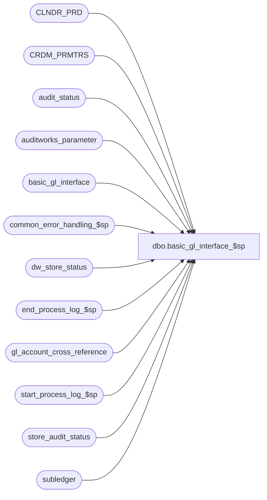

# dbo.basic_gl_interface_$sp

**Database:** auditworks  
**Server:** bedrockdb01  

## Architecture Diagram



## Table Dependencies

| Referenced Table |
|---|
| CLNDR_PRD |
| CRDM_PRMTRS |
| audit_status |
| auditworks_parameter |
| basic_gl_interface |
| common_error_handling_$sp |
| dw_store_status |
| end_process_log_$sp |
| gl_account_cross_reference |
| start_process_log_$sp |
| store_audit_status |
| subledger |

## Stored Procedure Code

```sql
create proc dbo.basic_gl_interface_$sp 
@period_ending_date		smalldatetime,
@journal_entry_description 	char(29),
@last_date_closed		smalldatetime,
@period_end			smalldatetime

AS

/* Proc name:   basic_gl_interface_$sp
** Description: Build basic_gl_interface table from subledger table given a
** 		range of transaction dates. basic_gl_interface table will
** 		contain the gl_account_no instead of gl_account_id.
** 		Called from period_end_$sp

HISTORY:

Date      Name          Def# Desc
Mar03,16  George  TFS-156141 Fix sign of 99999999.99 to match sign of amount.
Feb05,16  Vicci   TFS-156141 Revised DT logging to split detail amounts > 99999999.99 into as many rows as required to log full amount without exceeding 99999999.99 per row.
Feb04,16  Vicci   TFS-156141 Split detail amounts > 99999999.99 into 2 rows.  Log Batch Header and Trailer amounts as 9999999999 if they exceed 9999999999.
Nov06,06  Paul         74790 read CRDM_PRMTRS to get CLNDR_ID
Oct25,06  Phu          77931 Fix outer join for SQL 2005 Mode 90.
Sep06,06  Tim          76719 Null Concatenation Fix.
Oct03,05  Paul         60471 apply 60634 to SA5
May04,05  Sab	     DV-1254 Update dw_store_status set store_status = 3;join dw_store_status instead of store_audit_status
Dec15,04  David      DV-1191 Improve performance by adding hints.
May 11,04 David      DV-1071 Use new Calendar table.
Sep 19,05 Daphna       60634 update subledger.gl_posting_datetime when setting posting_status = 1
Apr 05,02 Winnie     1-A0AZM    Change amount column in basic_gl_interface table from INT to NUMERIC(14,0)
Nov 30,01 Phu		8931	Error handling
Jul 05,01 Winnie	8169	Remove the date format of status_date
May 01,01 Winnie	7598	Change TABLE #cal_date to allow null for pd_end_julian_date
Mar 23,01 Winnie	7450	Check gl_interface_timing for daily GL, move out all the recurring logic of all the GL interface and put it in period end. 
Jul 05,00 Maryam	5696 	Prevent duplicate error 2601 when inserting in batch header/trailer
May 25 00 John G	5864 	Change '= NULL' to 'IS NULL' where applicable to mirror Oracle.
Mar 01,00 Phu		5900	Change @@fetch_status > 0 to @@fetch_status <> 0 for MS SQL compatibility
Jan 14,00 Phu		5831	Fix batch debits <> detail debits
Jan 13,00 Vicci		5835	Use auditworks_parameter gl_interface_timing instead of smartload_var ascii_update_timin
Dec 07,99 Henry		5781	Support creation of ascii subledger export when preliminary period end
Sep 20/99 Vicci		5455	Support creation of ascii subledger export file without closing period
Dec.4/97  Kevin B.	n/a	
Sept.2/97 Phu		n/a	author

*/

DECLARE
	@calendar_date 				smalldatetime,
	@current_date 				smalldatetime,
	@cursor_open 				tinyint,
	@errmsg 				nvarchar(255),
	@errno 					int,
	@gl_account_id 				int,
	@gl_account_no 				nvarchar(160),
	@message_id				int,
	@object_name				nvarchar(255),
	@operation_name				nvarchar(100),
	@process_name				nvarchar(100),
	@pd_end_julian_date 			nchar(5),
	@period_end_date 			smalldatetime,
	@process_log_entry 			tinyint,
	@process_no 				smallint,
	@process_timestamp 			float,
	@rows					int,
	@transaction_count 			numeric(12,0),
	@transaction_date 			smalldatetime,
	@zero_filler_2				nchar(2),
	@zero_filler_3				nchar(3),
	@zero_filler_14				nchar(14),
	@gl_interface_timing 			smallint,
	@preliminary_period_end_date		smalldatetime,
	@clndr_id				binary(16),
	@lvl_month				binary(16),
	@month_end_date				smalldatetime,
	@max_amt_multiple 			money,
        @max_amt 				money
  
SET CONCAT_NULL_YIELDS_NULL OFF

SELECT
	@current_date = getdate(),
	@cursor_open = 0,
	@errmsg = NULL,
	@process_log_entry = 0,
	@process_no = 205,
	@process_timestamp = 0,
	@transaction_count = 0,
	@zero_filler_2 = '00',
	@zero_filler_3 = '000',
	@zero_filler_14 = '00000000000000',
	@gl_interface_timing = 0,
	@message_id = 201068,
	@process_name = 'basic_gl_interface_$sp',
	@max_amt_multiple = 1,
    @max_amt = 99999999.99

CREATE TABLE #cal_date (
	calendar_date 		smalldatetime 	not null,
	pd_end_date		smalldatetime 	null,
	pd_end_julian_date	nchar(5) null )

SELECT @errno = @@error
IF @errno <> 0
  BEGIN
	SELECT @errmsg = 'Unable to create table #cal_date',
	       @object_name = '#cal_date',
	       @operation_name = 'CREATE TABLE'
	GOTO error
  END

create table #gl_int_temp (
   gl_company_no  nchar(2) not null,
   gl_period_no   nchar(2) not null,
   period_ending_date  nchar(5) not null,
   gl_account_no  nchar(14) not null,
   amount  money not null )

SELECT @errno = @@error
IF @errno <> 0
  BEGIN
	SELECT @errmsg = 'Unable to create table #gl_int_temp',
	       @object_name = '#gl_int_temp',
	       @operation_name = 'CREATE TABLE'
	GOTO error
  END

EXEC start_process_log_$sp @process_no, @process_timestamp OUTPUT, @errmsg OUTPUT

SELECT @errno = @@error
IF @errno <> 0
  BEGIN
    SELECT @object_name = 'start_process_log_$sp',
	   @operation_name = 'EXECUTE'
    IF @errmsg IS NULL  
      SELECT @errmsg = 'Unable to execute start_process_log_$sp'
    GOTO error
  END

SELECT @process_log_entry = 1


SELECT @clndr_id = PRMTR_VAL_BIN
  FROM CRDM_PRMTRS
 WHERE PRMTR_NAME = 'GL_PSTNG_CLNDR_ID'

SELECT @errno = @@error, @rows = @@rowcount
IF @rows = 0 AND @errno = 0
  SELECT @errno = 201612
IF @errno <> 0
  BEGIN
	SELECT @errmsg = 'Unable to select calendar id',
	       @object_name = 'CRDM_PRMTRS',
	       @operation_name = 'SELECT'
	GOTO error
  END

SELECT @lvl_month = par_bin_value
  FROM auditworks_parameter
 WHERE par_name = 'clndr_lvl_month'

SELECT @errno = @@error
IF @errno <> 0
  BEGIN
	SELECT @errmsg = 'Unable to select month level id',
	       @object_name = 'auditworks_parameter',
	       @operation_name = 'SELECT'
	GOTO error
  END

DECLARE clndr_crsr CURSOR FAST_FORWARD
    FOR
 SELECT DATEADD( dd, -1, CONVERT(SMALLDATETIME, CONVERT(nvarchar, END_DATE_TIME, 101)) )
   FROM CLNDR_PRD
  WHERE CLNDR_ID          = @clndr_id
    AND CLNDR_LVL_TYPE_ID = @lvl_month
    AND END_DATE_TIME     > DATEADD(dd,1,@last_date_closed)
    AND STRT_DATE_TIME   <= @period_ending_date
  ORDER BY END_DATE_TIME   

OPEN clndr_crsr
SELECT @cursor_open = 2,
       @calendar_date = @last_date_closed

WHILE 1 = 1
BEGIN
  FETCH clndr_crsr 
   INTO @month_end_date 
   
  IF @@fetch_status <> 0
  BREAK

  SELECT @pd_end_julian_date = SUBSTRING( STR( datepart(yy, @month_end_date), 4), 3, 2 ) +
                               RIGHT (@zero_filler_3 + LTRIM( STR( DATEPART(dy,@month_end_date), 3) ), 3)

  WHILE @calendar_date < @month_end_date AND @calendar_date < @period_ending_date
  BEGIN
    SELECT @calendar_date = DATEADD(dd,1,@calendar_date)
  
    INSERT #cal_date (
	calendar_date,
	pd_end_date,
	pd_end_julian_date )
    VALUES (
	@calendar_date,
	@month_end_date,
	@pd_end_julian_date)

	SELECT @errno = @@error
	IF @errno <> 0
	BEGIN
	  SELECT @errmsg = 'Unable to insert #gl_int_temp',
	         @object_name = '#gl_int_temp',
	         @operation_name = 'INSERT'
	  GOTO error
	END	
  END -- WHILE @calendar_date <= @month_end_date AND @calendar_date <= @period_ending_date

END -- WHILE 1=1

CLOSE clndr_crsr
DEALLOCATE clndr_crsr
SELECT @cursor_open = 0


  INSERT #gl_int_temp (
	gl_company_no,
	gl_period_no,
	period_ending_date,
	gl_account_no,
	amount )
  SELECT 
	RIGHT (@zero_filler_2 + LTRIM (STR (s.gl_company, 2)), 2),
	RIGHT (@zero_filler_2 + LTRIM (STR (s.period, 2)), 2),
	c.pd_end_julian_date,
	RIGHT ((@zero_filler_14 + ISNULL (g.gl_account_no, '0')), 14),
	SUM(s.amount)
  FROM subledger s WITH (NOLOCK)
       INNER JOIN dw_store_status a ON (s.transaction_date = a.sales_date AND s.store_no = a.store_no AND a.store_status <> 3)
       INNER JOIN #cal_date c WITH (NOLOCK) ON (s.transaction_date = c.calendar_date)
       LEFT JOIN gl_account_cross_reference g ON (s.gl_account_id = g.gl_account_id)
  WHERE s.posting_status = 0
  GROUP BY
	RIGHT (@zero_filler_2 + LTRIM (STR (s.gl_company, 2)), 2),
	RIGHT (@zero_filler_2 + LTRIM (STR (s.period, 2)), 2),
	c.pd_end_julian_date,
	RIGHT ((@zero_filler_14 + ISNULL (g.gl_account_no, '0')), 14)

  SELECT @errno = @@error

  IF @errno <> 0
    BEGIN
	SELECT @errmsg = 'Unable to insert #gl_int_temp',
	       @object_name = '#gl_int_temp',
	       @operation_name = 'INSERT'
	GOTO error
    END

BEGIN TRAN

  /* Create batch header */

  INSERT basic_gl_interface (
	gl_company_no,
	gl_period_no,
	period_ending_date,
	record_type,
	amount )
  SELECT
	gl_company_no,
	gl_period_no,
	period_ending_date,
	'BH',
	CONVERT(NUMERIC(10,0), CASE WHEN ROUND(SUM(amount), 0) > 9999999999 THEN 9999999999 ELSE ROUND(SUM(amount), 0) END)
  FROM #gl_int_temp WITH (NOLOCK)
  WHERE amount > 0
  GROUP BY
	gl_company_no,
	gl_period_no,
	period_ending_date

  SELECT @errno = @@error,
	 @transaction_count = @@rowcount

  IF @errno <> 0
    BEGIN
	SELECT @errmsg = 'Unable to create basic_gl_interface for batch header',
	       @object_name = 'basic_gl_interface',
	       @operation_name = 'INSERT'
	GOTO error
    END

  /* Create batch trailer */

  INSERT basic_gl_interface (
	gl_company_no,
	gl_period_no,
	period_ending_date,
	record_type,
	amount )
  SELECT
	gl_company_no,
	gl_period_no,
	period_ending_date,
	'TH',
	CONVERT(NUMERIC(10,0), CASE WHEN ROUND(SUM(amount), 0) < -9999999999 THEN -9999999999 ELSE ROUND(SUM(amount), 0) END)
  FROM #gl_int_temp WITH (NOLOCK)
  WHERE amount < 0
  GROUP BY
	gl_company_no,
	gl_period_no,
	period_ending_date
  SELECT @errno = @@error,
	 @transaction_count = @transaction_count + @@rowcount
  IF @errno <> 0
  BEGIN
	SELECT @errmsg = 'Unable to create basic_gl_interface for trailer',
	       @object_name = 'basic_gl_interface',
	       @operation_name = 'INSERT'
	GOTO error
  END


  /* Create gl details */
 WHILE @max_amt_multiple > 0
 BEGIN
   IF EXISTS (SELECT 1 FROM #gl_int_temp WHERE ABS(amount) > (@max_amt_multiple - 1) * @max_amt)
   BEGIN
       INSERT basic_gl_interface (
              gl_company_no,
              gl_period_no,
              period_ending_date,
              record_type,
              gl_account_no,
              journal_entry_description,
              detail_type_indicator,
              amount )
       SELECT gl_company_no,
	      gl_period_no,
	      period_ending_date,
	      'DT',
	      gl_account_no,
	      @journal_entry_description,
	      ' ',
	      CONVERT (NUMERIC(10,0), ROUND (CASE WHEN abs(amount) > (@max_amt_multiple - 1) * @max_amt AND abs(amount) <= @max_amt_multiple * @max_amt
	                                          THEN sign(amount) * (abs(amount) - ((@max_amt_multiple - 1) * @max_amt))
	                                          ELSE sign(amount) * @max_amt
	                                     END * 100, 0))
         FROM #gl_int_temp WITH (NOLOCK)
        WHERE abs(amount) > (@max_amt_multiple - 1) * @max_amt
       SELECT @errno = @@error,
     	      @transaction_count = @transaction_count + @@rowcount
       IF @errno <> 0
       BEGIN
	  SELECT @errmsg = 'Unable to create basic_gl_interface for portion of details <= 99999999.99 for amounts > ' + convert(nvarchar, (@max_amt_multiple - 1) * @max_amt),
	         @object_name = 'basic_gl_interface',
	         @operation_name = 'INSERT'
	  GOTO error
       END

       SELECT @max_amt_multiple = @max_amt_multiple + 1
   END
   ELSE
   BEGIN
    SELECT @max_amt_multiple = 0
   END    
 END --WHILE @max_amt_multiple > 0

  UPDATE audit_status
  SET audit_status = 500,
	status_date = @current_date
  WHERE audit_status = 400
  AND sales_date > @last_date_closed
  AND sales_date <= @period_ending_date 

  SELECT @errno = @@error
  IF @errno <> 0
    BEGIN
	SELECT @errmsg = 'Unable to set audit_status to 500 from 400',
	       @object_name = 'audit_status',
	       @operation_name = 'UPDATE'
	GOTO error
    END

  UPDATE store_audit_status
 SET store_audit_status = 500,
	store_status_date = @current_date
  WHERE store_audit_status = 400
  AND sales_date > @last_date_closed 
  AND sales_date <= @period_ending_date 

  SELECT @errno = @@error
  IF @errno <> 0
    BEGIN
	SELECT @errmsg = 'Unable to set store_audit_status to 500 from 400',
	       @object_name = 'store_audit_status',
	       @operation_name = 'UPDATE'
	GOTO error
    END

  UPDATE dw_store_status
     SET store_status = 3
   WHERE store_status = 2
     AND sales_date > @last_date_closed 
     AND sales_date <= @period_ending_date 

  SELECT @errno = @@error
  IF @errno <> 0
    BEGIN
	SELECT @errmsg = 'Unable to set store_status to 3 from 2',
	       @object_name = 'dw_store_status',
	       @operation_name = 'UPDATE'
	GOTO error
    END

COMMIT TRAN

-- NOTE:
--	Moved the UPDATE of parameter_general, for the
--	RESET of the last_date_closed = period_end_date, and the
--	RESET of the preliminary_period_end_date = NULL,
--	to the proc reset_period_end_$sp

DECLARE cal_date_crsr CURSOR FAST_FORWARD
    FOR
 SELECT	calendar_date 
   FROM #cal_date WITH (NOLOCK)

SELECT @errno = @@error
IF @errno <> 0
  BEGIN
   SELECT @errmsg = 'Unable to declare cursor cal_date_crsr',
	  @object_name = 'cal_date_crsr',
	  @operation_name = 'DECLARE CURSOR'
   GOTO error
  END

OPEN cal_date_crsr
SELECT @cursor_open = 1

WHILE 2 = 2
  BEGIN
	FETCH cal_date_crsr INTO
		@calendar_date

	IF @@fetch_status <> 0
		BREAK

	-- Set subledger posting status to yes --

	UPDATE subledger
	SET posting_status = 1,
	    gl_posting_datetime = @current_date
	WHERE transaction_date = @calendar_date
	AND posting_status = 0

	SELECT @errno = @@error
	IF @errno <> 0
	  BEGIN
		SELECT @errmsg = 'Unable to update subledger with posting_status to 1',
		       @object_name = 'subledger',
		       @operation_name = 'UPDATE'
		GOTO error
	  END

  END -- While 2 = 2

CLOSE cal_date_crsr
DEALLOCATE cal_date_crsr
SELECT @cursor_open = 0

IF @process_log_entry = 1
	EXEC end_process_log_$sp @process_no, @process_timestamp, @transaction_count

RETURN


error:
	IF @cursor_open = 1
	  BEGIN
		CLOSE cal_date_crsr
		DEALLOCATE cal_date_crsr
		SELECT @cursor_open = 0
	  END

	IF @cursor_open = 2
	  BEGIN
		CLOSE clndr_crsr
	 	DEALLOCATE clndr_crsr
	  END

	EXEC common_error_handling_$sp @process_no, @errno, @errmsg, 0, @message_id, 
	@process_name, @object_name, @operation_name, 1
	RETURN
```

