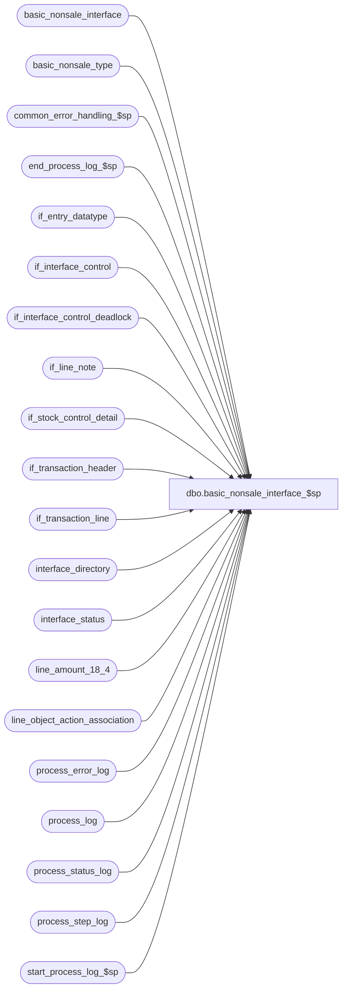

# dbo.basic_nonsale_interface_$sp

**Database:** auditworks  
**Server:** bedrockdb01  

## Architecture Diagram



## Table Dependencies

| Referenced Table |
|---|
| basic_nonsale_interface |
| basic_nonsale_type |
| common_error_handling_$sp |
| end_process_log_$sp |
| if_entry_datatype |
| if_interface_control |
| if_interface_control_deadlock |
| if_line_note |
| if_stock_control_detail |
| if_transaction_header |
| if_transaction_line |
| interface_directory |
| interface_status |
| line_amount_18_4 |
| line_object_action_association |
| process_error_log |
| process_log |
| process_status_log |
| process_step_log |
| start_process_log_$sp |

## Stored Procedure Code

```sql
CREATE proc [dbo].[basic_nonsale_interface_$sp]                                 
  AS
/*
PROC NAME: basic_nonsale_interface_$sp
     DESC: Builds nonsale interface table named basic_nonsale_interface
           to be used by smartload script bscintface.ict to generate an
           ASCII file which will then be used by BASIX program to create
 	   nonsale interface *IFNSS
           Table is built from if_interface_control, if_transaction_header,
    	   if_transaction_line, if_stock_control_detail, 
    	   line_object_action_association
  HISTORY:
Date	  Name		Defect	Desc
JUL22,15 Daphna		131151	cannot use user-defined datatype to create temp table
Jul21,15 Daphna		131151  Expand the length of the column for tender total and amounts
Sep06,06  Tim    76719  Null Concatenation Fix.
Sep20,05  Paul           60471  apply DV-1298 to SA5 - expand reference_no to nvarchar(80).
May27,05  Paul         DV-1254  apply 40830 to SA5
Apr28,05  Paul         DV-1234  expand transaction_id to use if_entry_datatype
Sep30,04  David        DV-1146  Use column verified_by_user_id.
Sep03,04  Daphna   39407/40830  Remove logic to set the completed_flag in process_status_log, 
                                it is done in reset_nonsale_interface_$sp
Dec18,01  Winnie       1-9Q1RX	Change process_step_log update statement for MSSQL compatibility.
Nov13,01  Winnie	8846	R3 Error handling, add logic to log process_log.
Mar09,01  Phu		7176    Split into several rows where units > 32767
May25,00  John G	5864 	Change '= NULL' to 'IS NULL' where applicable to mirror Oracle.
Mar21,00  Louise M  	6084	To pick up the right-most 4 digits of the transaction_no
Oct28,99  Phu		5535	Remove hard-coded carton distribution and transfer received line_object/line_action
JUL16,99  Louise M.	5029	Added the Return Reason code on RTV transactions in the identifier
				field of the header record (subcode 935, 'J')
Apr05,99  Daphna F	4422	Allow Layaways to interface to Basic Non-Sale
May29,98  Paul S	
Nov18,97  Phu T		n/a	Author  
*/

DECLARE
	@amt_per_unit			line_amount_18_4,
	@basic_nonsale_type		nchar(1),
	@cashier_no			nchar(5),
	@count				int,
	@count_date			smalldatetime,
        @completed_workload		int,
	@cursor_open			tinyint,
	@entry_time			nchar(4),
	@errmsg 			nvarchar(255),
	@errno 				int,
	@first_batch			int,
	@identifier			nchar(20),
	@gross_line_amount		line_amount_18_4,
	@if_entry_no			if_entry_datatype,
	@last_retrieval_datetime 	datetime,
	@last_posting_datetime 		datetime,
	@line_id			numeric(5,0),
	@location_no			int,
	@loop_flag			smallint,
	@max_line_id			numeric(5,0),
	@merchandise_key		numeric(14,0),
	@message_id			int,
	@object_name			nvarchar(255),
	@operation_name			nvarchar(100),
	@other_store_no			int,
	@pos_discount_amount		line_amount_18_4,
	@posting_in_progress 		tinyint,
	@prev_if_entry_no		if_entry_datatype,
	@process_log_entry 		tinyint,
	@process_no 			smallint,
	@process_name			nvarchar(100),
	@process_timestamp 		float,
	@quantity			nchar(10),
	@quantity_num			numeric(10,0),
	@reference_no			nvarchar(80),
	@reference_type			tinyint,
	@register_no			nchar(5),
	@rows 				int,
	@row_count			int,
	@row_split 			int,
	@seq_no				smallint,
	@split_counter			smallint,
	@store_no			nchar(3),
	@subcode			nchar(3),
	@terminate_interface 		tinyint,
	@transaction_count 		int,
	@transaction_date		nchar(8),
	@transaction_no			nchar(4),
	@units				numeric(15,4),
	@unit_remainded			numeric(10,0),
	@upc_no				numeric(14,0),
	@vendor_no			nvarchar(6),
	@zero_filler			nchar(14)

SET CONCAT_NULL_YIELDS_NULL OFF

SELECT 	@cursor_open = 0,
	@errmsg = NULL,
	@process_log_entry = 0,
	@process_no = 204,
	@process_timestamp = 0,
	@terminate_interface = 0,
	@transaction_count = 0,
	@zero_filler = '00000000000000',
	@process_name = 'basic_nonsale_interface_$sp',
	@message_id = 201068,
	@loop_flag = 0

IF EXISTS( SELECT interface_id
	FROM interface_directory
	WHERE interface_id = 4
	AND ascii_export = 1
	AND update_timing > 0 )
  SELECT @rows = 1
ELSE
  RETURN

IF EXISTS( SELECT if_entry_no
	FROM if_interface_control
	WHERE interface_id = 4
	AND interface_control_flag < 50 )
  SELECT @rows = 1
ELSE
  RETURN

CREATE TABLE #nonsale_base (
	transaction_date	nchar(8)		not null,
	store_no		nchar(3)		not null,
	register_no		nchar(5)		not null,
	transaction_no		nchar(4)		not null,
	cashier_no		nchar(5)		not null,
	entry_time		nchar(4)		not null,
	subcode			nchar(3)		not null,
	if_entry_no		numeric(14,0)	not null, -- if_entry_datatype
	line_id			numeric(5,0)	not null,
	basic_nonsale_type	nchar(1)		not null,
	gross_line_amount	NUMERIC(18,4)	null,
	pos_discount_amount	NUMERIC(18,4)	null,
	amt_per_unit		NUMERIC(18,4)	null,
	reference_type		tinyint		null,
	reference_no		nvarchar(80)	null,
	upc_no			numeric(14,0)	null,
	units			numeric(15,4)	null,
	merchandise_key		numeric(14,0)	null,
	count_date		smalldatetime	null,
	other_store_no		int		null,
	location_no		int		null,
	vendor_no		nvarchar(6)	null )

SELECT @errno = @@error
IF @errno <> 0
  BEGIN
	SELECT @errmsg = 'Unable to create table #nonsale_base',
	       @object_name = '#nonsale_base',
	       @operation_name = 'CREATE'
	GOTO error
  END

SELECT #nonsale_base.transaction_date, #nonsale_base.store_no, #nonsale_base.register_no, #nonsale_base.transaction_no, #nonsale_base.cashier_no, #nonsale_base.entry_time, #nonsale_base.subcode, #nonsale_base.if_entry_no, #nonsale_base.line_id, #nonsale_base.basic_nonsale_type, #nonsale_base.gross_line_amount, #nonsale_base.pos_discount_amount, #nonsale_base.amt_per_unit, #nonsale_base.reference_type, #nonsale_base.reference_no, #nonsale_base.upc_no, #nonsale_base.units, #nonsale_base.merchandise_key, #nonsale_base.count_date, #nonsale_base.other_store_no, #nonsale_base.location_no, #nonsale_base.vendor_no
INTO #nonsale_split
FROM #nonsale_base

SELECT @errno = @@error
IF @errno <> 0
  BEGIN
	SELECT @errmsg = 'Unable to select into #nonsale_split from #nonsale_base',
	       @object_name = '#nonsale_spilt',
	       @operation_name = 'SELECT'
	GOTO error
	
  END

CREATE TABLE #count_date (
        transaction_date smalldatetime,
        transaction_count int)

SELECT @errno = @@error
IF @errno != 0
  BEGIN
   SELECT @errmsg = 'Unable to create temp table #count_date',
          @object_name = '#count_date',
          @operation_name = 'CREATE'
   GOTO error
  END

WHILE @terminate_interface = 0
  BEGIN
    SELECT @last_retrieval_datetime = last_retrieval_datetime,
	   @last_posting_datetime = last_posting_datetime,
	   @posting_in_progress = posting_in_progress
    FROM interface_status
    WHERE interface_id = 4

    SELECT @errno = @@error
    IF @errno != 0
      BEGIN
        SELECT @errmsg = 'Failed to select last_retrieval_datetime from interface_status',
               @object_name = 'interface_status',
               @operation_name = 'SELECT'
        GOTO error
      END

    IF @last_retrieval_datetime >= @last_posting_datetime
    OR @posting_in_progress <> 1
	SELECT @terminate_interface = 1

    SELECT if_entry_no, interface_id
      INTO #if_int_control
      FROM if_interface_control
     WHERE interface_id = 4
       AND interface_control_flag < 50

    SELECT @errno = @@error, @rows = @@rowcount
    IF @errno <> 0
      BEGIN
	SELECT @errmsg = 'Unable to insert into #if_int_control',
               @object_name = '#if_int_control',
               @operation_name = 'SELECT'
	GOTO error
      END

    IF @rows <= 0
      BEGIN
	DROP TABLE #if_int_control

	SELECT @errno = @@error
	IF @errno <> 0
	  BEGIN
		SELECT @errmsg = 'Unable to drop table #if_int_control',
	               @object_name = '#if_int_control',
        	       @operation_name = 'DROP'
		GOTO error
	  END

	BREAK
      END

    IF @process_log_entry = 0
      BEGIN
	EXEC start_process_log_$sp @process_no, @process_timestamp OUTPUT, @errmsg OUTPUT

	SELECT @errno = @@error
	IF @errno <> 0
	  BEGIN
	    IF @errmsg IS NULL
	SELECT @errmsg = 'Unable to execute start_process_log_$sp'
	    SELECT @object_name = 'start_process_log_$sp',
        	   @operation_name = 'EXECUTE'
	 GOTO error
	  END

	SELECT @process_log_entry = 1
      END

      IF @loop_flag = 0 
	BEGIN
	  SELECT @first_batch = completed_flag,
	         @completed_workload = completed_workload
	    FROM process_status_log
	   WHERE process_no = @process_no

	  SELECT @errno = @@error
	  IF @errno <> 0
	    BEGIN
	      SELECT @errmsg = 'Unable to select completed_flag from process_status_log ',
		     @object_name = 'process_status_log',
		  @operation_name = 'SELECT'
		GOTO error
	    END

	  IF @first_batch IS NULL
           BEGIN
              INSERT process_status_log
	             (process_no,
                      process_start_time,
                      expected_workload,
                      completed_workload,
                      completed_flag,
                      abort_requested,
                      transaction_qty)
	      VALUES (@process_no,
                      getdate(),
                      1,
                      0,
                      0,
                      0,
                      0)   

              SELECT @errno = @@error
	      IF @errno <> 0
	        BEGIN
	          SELECT @errmsg = 'Unable to insert process_status_log (initial)',
	                 @object_name = 'process_status_log',
		         @operation_name = 'INSERT'
		  GOTO error
		END

              INSERT process_step_log
	             (process_no,
		      stream_no,
		      process_step_no,
		      process_step_start_time,
		      expected_workload,
		      completed_workload)
               VALUES (@process_no,
	               1,
		       0,
		       getdate(),
		       1,
		       0)	    	

              SELECT @errno = @@error
	      IF @errno <> 0
	        BEGIN
	          SELECT @errmsg = 'Unable to insert process_step_log (initial)',
	                 @object_name = 'process_step_log',      
		         @operation_name = 'INSERT'
		   GOTO error
		 END          
            END -- IF @first_batch IS NULL

	  ELSE IF @first_batch = 1
	    BEGIN 
	      UPDATE process_status_log
		 SET completed_flag = 0,
		     expected_workload = 1,
		     completed_workload = 0,
		     transaction_qty = 0,
		     process_start_time = getdate()
	       WHERE process_no = @process_no
		 AND completed_flag = 1

	      SELECT @errno = @@error
	      IF @errno <> 0
		BEGIN
		  SELECT @errmsg = 'Unable to update process_status_log (initial) ',
			 @object_name = 'process_status_log',
			 @operation_name = 'UPDATE'
		  GOTO error
		END

		UPDATE process_step_log
	           SET process_step_start_time = getdate(),
		       expected_workload = 1,
		       completed_workload = 0,
		       process_step_no = 0
		 WHERE process_no = @process_no
	           AND stream_no = 1
           
		SELECT @errno = @@error
		IF @errno <> 0
		BEGIN
		  SELECT @errmsg = 'Unable to update process_step_log (initial)',
			 @object_name = 'process_step_log',
			 @operation_name = 'UPDATE'
		  GOTO error
		END          
            END -- ELSE IF @first_batch = 1

            IF @first_batch = 1 OR @first_batch IS NULL
             BEGIN
                SELECT @completed_workload = 0

       		INSERT INTO #count_date
		SELECT CONVERT(SMALLDATETIME, convert(nchar,process_start_time,112)),
		       SUM(transaction_count)
		  FROM process_log
		 WHERE DATEDIFF(dd,process_start_time, getdate()) <= 7
		   AND DATEDIFF(dd,process_start_time, getdate()) >= 1
		   AND process_no = @process_no
		   AND transaction_count > 0
		GROUP BY CONVERT(SMALLDATETIME, convert(nchar,process_start_time,112))

		SELECT @errno = @@error,
		       @row_count = @@rowcount
		IF @errno <> 0
		  BEGIN
		    SELECT @errmsg = 'Unable to insert #count_date ',
			   @object_name = '#count_date',
			   @operation_name = 'INSERT'
		    GOTO error
		  END          

            IF @row_count > 0
		BEGIN
		  UPDATE process_status_log
 		     SET expected_workload = (SELECT CEILING(CONVERT(FLOAT,(SUM(transaction_count))) / CONVERT(FLOAT,@row_count))
                                     	        FROM #count_date)
		   WHERE process_no = @process_no

		  SELECT @errno = @@error
		  IF @errno <> 0
		    BEGIN
		      SELECT @errmsg = 'Unable to update process_status_log for expected_workload',
		             @object_name = 'process_status_log',
 		  @operation_name = 'UPDATE'
		      GOTO error
		    END          

		  UPDATE process_status_log
 		     SET expected_workload = 1
		   WHERE process_no = @process_no
		     AND expected_workload = 0

		  SELECT @errno = @@error
		  IF @errno <> 0
		    BEGIN
		      SELECT @errmsg = 'Unable to update process_status_log for expected_workload to 1',
		             @object_name = 'process_status_log',
 		             @operation_name = 'UPDATE'
		      GOTO error
		    END          
                END -- IF @row_count = 0

              UPDATE process_step_log
                 SET expected_workload = s.expected_workload,
                     process_step_no = 64,
                     process_step_start_time = getdate()
	        FROM process_step_log p, process_status_log s
	       WHERE p.process_no = @process_no
	         AND p.process_no = s.process_no
	         AND stream_no = 1

              SELECT @errno = @@error
	      IF @errno <> 0
	        BEGIN
	          SELECT @errmsg = 'Unable to update process_step_log for expected_workload',
	                 @object_name = 'process_step_log',
 	                 @operation_name = 'UPDATE'
	          GOTO error
	        END          

	  END -- IF @first_batch = 1 OR @first_batch IS NULL
	END  -- IF @loop_flag = 0 

	SELECT @loop_flag = 1,
	       @row_count = 0

    TRUNCATE TABLE #nonsale_base
    SELECT @errno = @@error
    IF @errno <> 0
      BEGIN
	SELECT @errmsg = 'Unable to truncate table #nonsale_base',
               @object_name = '#nonsale_base',
               @operation_name = 'TRUNCATE'
	GOTO error
      END

    TRUNCATE TABLE #nonsale_split
    SELECT @errno = @@error
    IF @errno <> 0
      BEGIN
	SELECT @errmsg = 'Unable to truncate table #nonsale_split',
               @object_name = '#nonsale_split',
               @operation_name = 'TRUNCATE'
	GOTO error
      END

    INSERT #nonsale_base (
	transaction_date,
	store_no,
	register_no,
	transaction_no,
	cashier_no,
	entry_time,
	subcode,
	if_entry_no,
	line_id,
	basic_nonsale_type,
	gross_line_amount,
	pos_discount_amount,
	amt_per_unit,
	reference_type,
	reference_no,
	upc_no,
	units,
	merchandise_key,
	count_date,
	other_store_no,
	location_no,
	vendor_no )
    SELECT
	CONVERT (nchar(8), h.transaction_date, 1),
	RIGHT (@zero_filler + LTRIM (STR (h.store_no, 3)), 3),
	RIGHT (@zero_filler + LTRIM (STR (h.register_no, 5)), 5),
	RIGHT (@zero_filler + LTRIM (STR (h.transaction_no, 10)), 4),
	RIGHT (@zero_filler + LTRIM (STR (h.cashier_no, 10)), 5),
	RIGHT ('0' + LTRIM (STR ( DATEPART (hh, h.entry_date_time) * 100
				+ DATEPART (mi, h.entry_date_time), 4
				)), 4),
	o.basic_subcode,
	l.if_entry_no,
	l.line_id,
	n.basic_nonsale_type,
	l.gross_line_amount,
	l.pos_discount_amount,
	NULL,
	l.reference_type,
	l.reference_no,
	s.upc_no,
	s.units,
	s.merchandise_key,
	s.count_date,
	s.other_store_no,
	s.location_no,
	s.vendor_no
    FROM
	#if_int_control c,
	if_transaction_header h,
	if_transaction_line l,
	if_stock_control_detail s,
	line_object_action_association o,
	basic_nonsale_type n
    WHERE
	c.if_entry_no = h.if_entry_no
    AND h.if_entry_no = s.if_entry_no
    AND l.if_entry_no = s.if_entry_no
    AND l.line_id = s.line_id
  AND h.transaction_category = o.transaction_category
    AND l.line_object = o.line_object
    AND l.line_action = o.line_action
    AND l.line_object_type = o.line_object_type
    AND l.reference_type = n.reference_type
    AND l.line_action = n.line_action
    AND s.initiated_by_host = n.initiated_by_host
    AND transaction_void_flag * (transaction_void_flag - 8) = 0
    AND line_void_flag = 0
    AND date_reject_id = 0

    SELECT @errno = @@error
    IF @errno <> 0
      BEGIN
	SELECT @errmsg = 'Unable to insert #nonsale_base (1)',
               @object_name = '#nonsale_base',
               @operation_name = 'INSERT'
	GOTO error
  END

   INSERT #nonsale_split (
	transaction_date,
	store_no,
	register_no,
	transaction_no,
	cashier_no,
	entry_time,
	subcode,
	if_entry_no,
	line_id,
	basic_nonsale_type,
	gross_line_amount,
	pos_discount_amount,
	amt_per_unit,
	reference_type,
	reference_no,
	upc_no,
	units,
	merchandise_key,
	count_date,
	other_store_no,
	location_no,
	vendor_no )
    SELECT
	transaction_date,
	store_no,
	register_no,
	transaction_no,
	cashier_no,
	entry_time,
	subcode,
	if_entry_no,
	line_id,
	basic_nonsale_type,
	gross_line_amount,
	pos_discount_amount,
	amt_per_unit,
	reference_type,
	reference_no,
	upc_no,
	units,
	merchandise_key,
	count_date,
	other_store_no,
	location_no,
	vendor_no
    FROM #nonsale_base
    WHERE units > 32767
    AND (subcode IN ('936', '937', '938')
	 OR (reference_type = 6 AND subcode = '498'))

    SELECT @errno = @@error, @row_split = @@rowcount
    IF @errno <> 0
      BEGIN
	SELECT @errmsg = 'Unable to insert #nonsale_split from #nonsale_base',
               @object_name = '#nonsale_spilt',
               @operation_name = 'INSERT'
	GOTO error
      END

    IF @row_split > 0
      BEGIN
	DELETE #nonsale_base
	WHERE units > 32767
	AND (subcode IN ('936', '937', '938')
	     OR (reference_type = 6 AND subcode = '498'))

	SELECT @errno = @@error
	IF @errno <> 0
	  BEGIN
	    SELECT @errmsg = 'Unable to delete #nonsale_base',
                   @object_name = '#nonsale_base',
                   @operation_name = 'DELETE'
	    GOTO error
	  END

	SELECT @cursor_open = 0

	DECLARE nsale_crsr CURSOR FOR
	SELECT
		transaction_date,
		store_no,
		register_no,
		transaction_no,
		cashier_no,
		entry_time,
		subcode,
		if_entry_no,
		line_id,
		basic_nonsale_type,
		gross_line_amount,
		pos_discount_amount,
		amt_per_unit,
		reference_type,
		reference_no,
		upc_no,
		units,
		merchandise_key,
		count_date,
		other_store_no,
		location_no,
		vendor_no
	FROM #nonsale_split

	SELECT @errno = @@error
	IF @errno <> 0
	  BEGIN
		SELECT @errmsg = 'Unable to declare cursor nsale_crsr',
	               @object_name = 'nsale_crsr',
        	       @operation_name = 'DECLARE'
		GOTO error
	  END

	OPEN nsale_crsr
	SELECT @cursor_open = 1, @prev_if_entry_no = -1

	WHILE 1 = 1
	  BEGIN
	    FETCH nsale_crsr INTO
		@transaction_date,
		@store_no,
		@register_no,
		@transaction_no,
		@cashier_no,
		@entry_time,
		@subcode,
		@if_entry_no,
		@line_id,
		@basic_nonsale_type,
		@gross_line_amount,
		@pos_discount_amount,
		@amt_per_unit,
		@reference_type,
		@reference_no,
		@upc_no,
		@units,
		@merchandise_key,
		@count_date,
		@other_store_no,
		@location_no,
		@vendor_no

	    IF @@fetch_status <> 0
		BREAK

	    IF @prev_if_entry_no <> @if_entry_no
	      BEGIN
		SELECT @prev_if_entry_no = @if_entry_no
		SELECT @max_line_id = MAX(line_id)
  		  FROM if_transaction_line
		 WHERE if_entry_no = @if_entry_no

		SELECT @errno = @@error
		IF @errno <> 0
		  BEGIN
		    SELECT @errmsg = 'Unable to select max(line_id) from if_transaction_line',
	                   @object_name = 'if_transaction_line',
        	           @operation_name = 'SELECT'
		    GOTO error
		  END
	      END  -- if @prev_if_entry_no <> @if_entry_no

	    SELECT @split_counter = CONVERT(smallint, CEILING(CONVERT(float, ABS(@units)) / 32000)),
		   @unit_remainded = ABS(@units),
		   @amt_per_unit = (@gross_line_amount - @pos_discount_amount) /
				    ABS((ISNULL (@units, 0) + (1 - ABS (SIGN (ISNULL (@units, 0))))))

	    WHILE @split_counter > 0
	      BEGIN
		SELECT @split_counter = @split_counter - 1, @max_line_id = @max_line_id + 1
		IF @unit_remainded >= ABS(@units)
		  SELECT @unit_remainded = @unit_remainded - 32000,
			 @units = SIGN(@units) * 32000
		ELSE
		  SELECT @units = @unit_remainded * SIGN(@units)

		INSERT #nonsale_base (
			transaction_date,
			store_no,
			register_no,
			transaction_no,
			cashier_no,
			entry_time,
			subcode,
			if_entry_no,
			line_id,
			basic_nonsale_type,
			gross_line_amount,
			pos_discount_amount,
			amt_per_unit,
			reference_type,
			reference_no,
			upc_no,
			units,
			merchandise_key,
			count_date,
			other_store_no,
			location_no,
			vendor_no )
		VALUES (
			@transaction_date,
			@store_no,
			@register_no,
			@transaction_no,
			@cashier_no,
			@entry_time,
			@subcode,
			@if_entry_no,
			@max_line_id,
			@basic_nonsale_type,
			@gross_line_amount,
			@pos_discount_amount,
			@amt_per_unit,
			@reference_type,
			@reference_no,
			@upc_no,
			@units,
			@merchandise_key,
			@count_date,
			@other_store_no,
			@location_no,
			@vendor_no )

		SELECT @errno = @@error
		IF @errno <> 0
		  BEGIN
		    SELECT @errmsg = 'Unable to insert #nonsale_base (2)',
	                   @object_name = '#nonsale_base',
        	           @operation_name = 'INSERT'
		    GOTO error
		  END
	      END  -- while @split_counter > 0
	  END  -- while 1 = 1

	CLOSE nsale_crsr
	DEALLOCATE nsale_crsr
	SELECT @cursor_open = 0

      END  -- if @row_split > 0

/* Create interface with subcode 935 */

    BEGIN TRAN

    INSERT basic_nonsale_interface (
	transaction_date,
	store_no,
	register_no,
	transaction_no,
	seq_no,
	subcode,
	if_entry_no,
	line_id,
	cashier_no,
	entry_time,
	identifier,
	amount,
	quantity )
    SELECT
	transaction_date,
	store_no,
	register_no,
	transaction_no,
	CONVERT(smallint, subcode),
	subcode,
	if_entry_no,
	line_id,
	cashier_no,
	entry_time,
	basic_nonsale_type + 'F' +
		RIGHT (@zero_filler +
		 ISNULL (reference_no, 
			SUBSTRING (CONVERT (nchar(8), count_date, 2), 4, 2) +
			SUBSTRING (CONVERT (nchar(8), count_date, 2), 7, 2) +
			SUBSTRING (CONVERT (nchar(8), count_date, 2), 1, 2)
			), 14) +
		' ' +
		RIGHT (@zero_filler + LTRIM (STR ( ISNULL (other_store_no, 0), 14)), 3),
	CONVERT (INT, (ISNULL (units, 0) * 100)),
	RIGHT (@zero_filler + ISNULL (vendor_no, LTRIM (STR (ISNULL (location_no, 0), 10))), 10)
    FROM #nonsale_base
    WHERE amt_per_unit IS NULL
   AND subcode = '935'
    AND reference_type <> 15

    SELECT @errno = @@error,
	   @transaction_count = @transaction_count + @@rowcount

    IF @errno <> 0
      BEGIN
	SELECT @errmsg = 'Unable to insert basic_nonsale_interface for subcode 935',
               @object_name = 'basic_nonsale_interface',
               @operation_name = 'INSERT'
	GOTO error
      END

    INSERT basic_nonsale_interface (
	transaction_date,
	store_no,
	register_no,
	transaction_no,
	seq_no,
	subcode,
	if_entry_no,
	line_id,
	cashier_no,
	entry_time,
	identifier,
	amount,
	quantity )
    SELECT
	transaction_date,
	store_no,
	register_no,
	transaction_no,
	935,
	'935',
	if_entry_no,
	line_id,
	cashier_no,
	entry_time,
	basic_nonsale_type + 'F' +
		RIGHT (@zero_filler +
		 ISNULL (reference_no, 
			SUBSTRING (CONVERT (nchar(8), count_date, 2), 4, 2) +
			SUBSTRING (CONVERT (nchar(8), count_date, 2), 7, 2) +
			SUBSTRING (CONVERT (nchar(8), count_date, 2), 1, 2)
			), 14) +
		' ' +
		RIGHT (@zero_filler + LTRIM (STR ( ISNULL (other_store_no, 0), 14)), 3),
	CONVERT (INT, (ISNULL (units, 0) * 100)),
	RIGHT (@zero_filler + ISNULL (vendor_no, LTRIM (STR (ISNULL (location_no, 0), 10))), 10)
    FROM #nonsale_base
    WHERE amt_per_unit IS NULL
   AND reference_type = 6
    AND (subcode >= '652' AND subcode <= '899')

    SELECT @errno = @@error,
	   @transaction_count = @transaction_count + @@rowcount

    IF @errno <> 0
      BEGIN
	SELECT @errmsg = 'Unable to insert basic_nonsale_interface subcode 935 for consignments',
           @object_name = 'basic_nonsale_interface',
               @operation_name = 'INSERT'
	GOTO error
      END

    INSERT basic_nonsale_interface (
	transaction_date,
	store_no,
	register_no,
	transaction_no,
	seq_no,
	subcode,
	if_entry_no,
	line_id,
	cashier_no,
	entry_time,
	identifier,
	amount,
	quantity )
    SELECT
	transaction_date,
	store_no,
	register_no,
	transaction_no,
	CONVERT(smallint, subcode),
	subcode,
	if_entry_no,
	line_id,
	cashier_no,
	entry_time,
	basic_nonsale_type + 'F' +
		RIGHT (@zero_filler +
		 ISNULL (SUBSTRING (reference_no, 1, 2) + SUBSTRING (reference_no, 4, 2) + SUBSTRING (reference_no, 9, 2),
			SUBSTRING (CONVERT (nchar(8), count_date, 2), 4, 2) +
			SUBSTRING (CONVERT (nchar(8), count_date, 2), 7, 2) +
			SUBSTRING (CONVERT (nchar(8), count_date, 2), 1, 2)
			), 14) +
		' ' +
		RIGHT (@zero_filler + LTRIM (STR ( ISNULL (other_store_no, 0), 14)), 3),
	CONVERT (INT, (ISNULL (units, 0) * 100)),
	RIGHT (@zero_filler + ISNULL (vendor_no, LTRIM (STR (ISNULL (location_no, 0), 10))), 10)
    FROM #nonsale_base
    WHERE amt_per_unit IS NULL
   AND subcode = '935'
    AND reference_type = 15

    SELECT @errno = @@error,
	   @transaction_count = @transaction_count + @@rowcount

    IF @errno <> 0
      BEGIN
	SELECT @errmsg = 'Unable to insert basic_nonsale_interface for subcode 935',
               @object_name = 'basic_nonsale_interface',
               @operation_name = 'INSERT'
	GOTO error
      END

/* Create interface with subcode 936 or 937 or 938
** seq_no = 937 for subcode 937
** seq_no = 938 for subcode 938
** seq_no = 939 for subcode 936
*/

    INSERT basic_nonsale_interface (
	transaction_date,
	store_no,
	register_no,
	transaction_no,
	seq_no,
	subcode,
	if_entry_no,
	line_id,
	cashier_no,
	entry_time,
	identifier,
	amount,
	quantity )
    SELECT
	transaction_date,
	store_no,
	register_no,
	transaction_no,
	CONVERT (SMALLINT, subcode) +
	 ( 3 * SIGN (ABS ((CONVERT (SMALLINT, subcode) - 937) *
			  (CONVERT (SMALLINT, subcode) - 938)
			 ))),
	subcode,
	if_entry_no,
	line_id,
	cashier_no,
	entry_time,
	basic_nonsale_type + 'F' +
		RIGHT (REPLICATE ('0', 18) + ISNULL (LTRIM (STR (ISNULL (upc_no, merchandise_key), 18
								)
							   ), '0'
						    ), 18
		      ),
	CONVERT (INT, ((gross_line_amount - pos_discount_amount) * 100) /
	 (ISNULL (units, 0) + (1 - ABS (SIGN (ISNULL (units, 0)))))),
	RIGHT (@zero_filler +  LTRIM (STR (CONVERT (numeric(10,0), ISNULL (units, 0)), 10)), 10)
    FROM #nonsale_base
    WHERE amt_per_unit IS NULL
   AND subcode IN ('936', '937', '938') 

    SELECT @errno = @@error,
	   @transaction_count = @transaction_count + @@rowcount

    IF @errno <> 0
      BEGIN
	SELECT @errmsg = 'Unable to insert basic_nonsale_interface for subcode 936, 937, 938 (1)',
               @object_name = 'basic_nonsale_interface',
               @operation_name = 'INSERT'
	GOTO error
      END

    INSERT basic_nonsale_interface (
	transaction_date,
	store_no,
	register_no,
	transaction_no,
	seq_no,
	subcode,
	if_entry_no,
	line_id,
	cashier_no,
	entry_time,
	identifier,
	amount,
	quantity )
    SELECT
	transaction_date,
	store_no,
	register_no,
	transaction_no,
	CONVERT (SMALLINT, '936') +
	 ( 3 * SIGN (ABS ((CONVERT (SMALLINT, subcode) - 937) *
			  (CONVERT (SMALLINT, subcode) - 938)
			 ))),
	'936',
	if_entry_no,
	line_id,
	cashier_no,
	entry_time,
	basic_nonsale_type + 'F' +
		RIGHT (REPLICATE ('0', 18) + ISNULL (LTRIM (STR (ISNULL (upc_no, merchandise_key), 18
								)
							   ), '0'
						    ), 18
		      ),
	CONVERT (INT, ((gross_line_amount - pos_discount_amount) * 100) /
	 (ISNULL (units, 0) + (1 - ABS (SIGN (ISNULL (units, 0)))))),
	RIGHT (@zero_filler +  LTRIM (STR (CONVERT (numeric(10,0), ISNULL (units, 0)), 10)), 10)
    FROM #nonsale_base
    WHERE amt_per_unit IS NULL
   AND (reference_type = 6 AND subcode = '498')

    SELECT @errno = @@error,
	   @transaction_count = @transaction_count + @@rowcount
    IF @errno <> 0
      BEGIN
	SELECT @errmsg = 'Unable to insert basic_nonsale_interface for subcode 936 consignments (1)',
           @object_name = 'basic_nonsale_interface',
    @operation_name = 'INSERT'
	GOTO error
      END

    IF @row_split > 0
    BEGIN
    INSERT basic_nonsale_interface (
	transaction_date,
	store_no,
	register_no,
	transaction_no,
	seq_no,
	subcode,
	if_entry_no,
	line_id,
	cashier_no,
	entry_time,
	identifier,
	amount,
	quantity )
    SELECT
	transaction_date,
	store_no,
	register_no,
	transaction_no,
	CONVERT (SMALLINT, subcode) +
	 ( 3 * SIGN (ABS ((CONVERT (SMALLINT, subcode) - 937) *
			  (CONVERT (SMALLINT, subcode) - 938)
			 ))),
	subcode,
	if_entry_no,
	line_id,
	cashier_no,
	entry_time,
	basic_nonsale_type + 'F' +
		RIGHT (REPLICATE ('0', 18) + ISNULL (LTRIM (STR (ISNULL (upc_no, merchandise_key), 18
								)
							   ), '0'
						    ), 18
		      ),
	CONVERT (INT, amt_per_unit * 100),
	RIGHT (@zero_filler +  LTRIM (STR (CONVERT (numeric(10,0), ISNULL (units, 0)), 10)), 10)
    FROM #nonsale_base
    WHERE amt_per_unit IS NOT NULL
   AND subcode IN ('936', '937', '938') 

    SELECT @errno = @@error,
	   @transaction_count = @transaction_count + @@rowcount
    IF @errno <> 0
      BEGIN
	SELECT @errmsg = 'Unable to insert basic_nonsale_interface for subcode 936, 937, 938 (2)',
               @object_name = 'basic_nonsale_interface',
               @operation_name = 'INSERT'
	GOTO error
      END

    INSERT basic_nonsale_interface (
	transaction_date,
	store_no,
	register_no,
	transaction_no,
	seq_no,
	subcode,
	if_entry_no,
	line_id,
	cashier_no,
	entry_time,
	identifier,
	amount,
	quantity )
    SELECT
	transaction_date,
	store_no,
	register_no,
	transaction_no,
	CONVERT (SMALLINT, '936') +
	 ( 3 * SIGN (ABS ((CONVERT (SMALLINT, subcode) - 937) *
			  (CONVERT (SMALLINT, subcode) - 938)
			 ))),
	'936',
	if_entry_no,
	line_id,
	cashier_no,
	entry_time,
	basic_nonsale_type + 'F' +
		RIGHT (REPLICATE ('0', 18) + ISNULL (LTRIM (STR (ISNULL (upc_no, merchandise_key), 18
								)
							   ), '0'
						    ), 18
		      ),
	CONVERT (INT, amt_per_unit * 100),
	RIGHT (@zero_filler +  LTRIM (STR (CONVERT (numeric(10,0), ISNULL (units, 0)), 10)), 10)
    FROM #nonsale_base
    WHERE amt_per_unit IS NOT NULL
   AND (reference_type = 6 AND subcode = '498')

    SELECT @errno = @@error,
	   @transaction_count = @transaction_count + @@rowcount
    IF @errno <> 0
      BEGIN
	SELECT @errmsg = 'Unable to insert basic_nonsale_interface for subcode 936 consignments (2)',
               @object_name = 'basic_nonsale_interface',
               @operation_name = 'INSERT'
	GOTO error
      END
    END  -- if @row_split > 0


/*** Start of MOS MOD code : reaturn reason code on RTV transactions is picked up
  from if_line_note table and put into byte 18 of header record ***********/
  
   UPDATE basic_nonsale_interface
    set identifier = SUBSTRING(identifier,1,17) + ISNULL(SUBSTRING(line_note,1,1),' ') + '00'
     FROM basic_nonsale_interface b, if_line_note l, #if_int_control c
    WHERE b.if_entry_no=l.if_entry_no
      AND l.if_entry_no=c.if_entry_no
      AND SUBSTRING(identifier,1,1) = 'J'   -- for RTV transactions only
      AND l.note_type=9010   
      AND l.line_id = 1
      AND subcode = '935'

    SELECT @errno = @@error

    IF @errno <> 0
     BEGIN
	SELECT @errmsg = 'Unable to update basic_nonsale_interface with RTV reason code.',
               @object_name = 'basic_nonsale_interface',
               @operation_name = 'UPDATE'
	GOTO error
 END

/********* End of MOS MOD code *******************/
      

/* simulate table lock on if_interface_control */

    UPDATE if_interface_control_deadlock
     SET function_no = 204,
         status_date = getdate()

    SELECT @errno = @@error
    IF @errno <> 0
      BEGIN
	SELECT @errmsg = 'Unable to update function_no in if_interface_control_deadlock',
    @object_name = 'if_interface_control_deadlock',
         @operation_name = 'UPDATE'
	GOTO error
  END

    UPDATE if_interface_control
    SET interface_control_flag = 50
    FROM if_interface_control i, #if_int_control c
    WHERE i.if_entry_no = c.if_entry_no
    AND i.interface_id = c.interface_id
    AND i.interface_control_flag < 50

    SELECT @errno = @@error,
           @count = @@rowcount
    IF @errno <> 0
      BEGIN
	SELECT @errmsg = 'Unable to set interface_control_flag to 50 in if_interface_control',
               @object_name = 'if_interface_control',
               @operation_name = 'UPDATE'
	GOTO error
      END

    UPDATE process_status_log
       SET completed_workload = @completed_workload + @transaction_count,
           transaction_qty =  transaction_qty + @count
     WHERE process_no = @process_no
    
    SELECT @errno = @@error
    IF @errno <> 0
      BEGIN
        SELECT @errmsg = 'Unable to update process_status_log for completed_workload',
   	       @object_name = 'process_status_log',
	       @operation_name = 'UPDATE'
	GOTO error
      END          

    UPDATE process_step_log
       SET completed_workload = @completed_workload + @transaction_count,
           process_step_start_time = getdate()
     WHERE process_no = @process_no
       AND stream_no = 1
   
    SELECT @errno = @@error
    IF @errno <> 0
      BEGIN
        SELECT @errmsg = 'Unable to update process_step_log for completed_workload',
               @object_name = 'process_step_log',
               @operation_name = 'UPDATE'
        GOTO error
      END          

    COMMIT TRAN

    UPDATE interface_status
    SET last_retrieval_datetime = getdate()
    WHERE interface_id = 4

    SELECT @errno = @@error
    IF @errno <> 0
      BEGIN
	SELECT @errmsg = 'Unable to set last_retrieval_datetime in interface_status',
               @object_name = 'interface_status',
               @operation_name = 'UPDATE'
	GOTO error
      END

    DROP TABLE #if_int_control

    SELECT @errno = @@error
    IF @errno <> 0
      BEGIN
	SELECT @errmsg = 'Unable to drop table #if_int_control',
               @object_name = 'if_int_control',
               @operation_name = 'DROP'
	GOTO error
      END

  END /*while @terminate_interface = 0 */

UPDATE process_step_log
  SET process_step_no = -1,
      process_step_start_time = getdate()
 WHERE process_no = @process_no
   AND stream_no = 1

SELECT @errno = @@error    
IF @errno <> 0
  BEGIN
   SELECT @errmsg = 'Unable to update process_step_log to step_no -1',
          @object_name = 'process_step_log',
          @operation_name = 'UPDATE'
   GOTO error
  END          

DROP TABLE #count_date
SELECT @errno = @@error
IF @errno <> 0
  BEGIN
    SELECT @errmsg = 'Unable to drop table #count_date',
           @object_name = '#count_date',
           @operation_name = 'DROP'		  
    GOTO error
  END

IF @process_log_entry = 1
  BEGIN
    EXEC end_process_log_$sp @process_no, @process_timestamp, @transaction_count

    SELECT @errno = @@error    
     IF @errno <> 0
      BEGIN
         SELECT @errmsg = 'Unable to exec end_process_log_$sp',
                @object_name = 'end_process_log_$sp',
                @operation_name = 'EXECUTE'
         GOTO error
      END          
  END -- IF @process_log_entry = 1

UPDATE process_error_log
   SET verified = 1,
       verified_by_user_id = NULL --
 WHERE process_no = @process_no
   AND verified = 0

SELECT @errno = @@error
IF @errno <> 0
  BEGIN
	SELECT @errmsg = 'Unable to update process_error_log',
               @object_name = 'process_error_log',
               @operation_name = 'UPDATE'
	GOTO error
  END

UPDATE process_log
   SET process_status_flag = 3
 WHERE process_start_time = process_end_time
   AND process_no = @process_no
   AND process_status_flag = 1

SELECT @errno = @@error
IF @errno <> 0
  BEGIN
	SELECT @errmsg = 'Unable to update process_log',
               @object_name = 'process_log',
               @operation_name = 'UPDATE'
	GOTO error
  END

RETURN

error:   /* Common error handler */

        EXEC common_error_handling_$sp @process_no, @errno, @errmsg, 0, @message_id, 
        @process_name, @object_name, @operation_name, 1, 1, 
        @process_log_entry, @process_timestamp, @transaction_count

	RETURN
```

