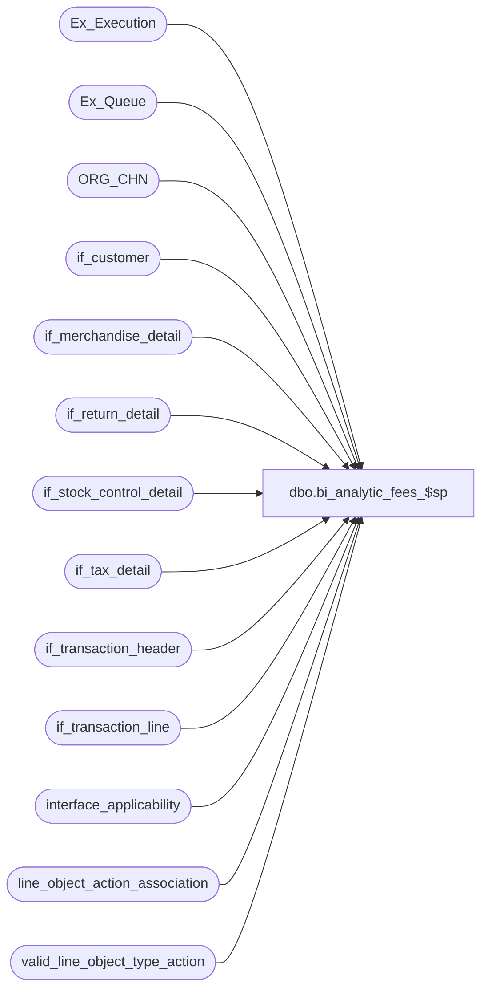

# dbo.bi_analytic_fees_$sp

**Database:** auditworks  
**Server:** bedrockdb01  

## Architecture Diagram



## Table Dependencies

| Referenced Table |
|---|
| Ex_Execution |
| Ex_Queue |
| ORG_CHN |
| if_customer |
| if_merchandise_detail |
| if_return_detail |
| if_stock_control_detail |
| if_tax_detail |
| if_transaction_header |
| if_transaction_line |
| interface_applicability |
| line_object_action_association |
| valid_line_object_type_action |

## Stored Procedure Code

```sql
CREATE proc  [dbo].[bi_analytic_fees_$sp] 
AS

/*   
PROC NAME: user_bi_analytics_fees_$sp
PROC DESC: This procedure is executed by a powershell script for Analytics. 
		   The procedure will return a result set and a file will be generated from the returning records.
           Interface 93 is used for this procedure
HISTORY:
Date	    Name   		Def#	Desc
18May2018	Stephen		DQS-4856	author
*/  
  
SET NOCOUNT ON
set ANSI_WARNINGS OFF

DECLARE 
 @default_currency	smallint,
 @errno				int,
 @max_serial_no		numeric(14,0),
 @min_serial_no		numeric(14,0),
 @object_id			int,
 @queue_id			tinyint,
 @errmsg			nvarchar(4000),
 @ErrorSeverity		smallint, -- represents the severity level of the error
 @errorline			int, -- represents the line # the error occured
 @ErrorState		int, -- represents the state of the error
 @message_id		int, -- represents the message_id from sys.messages
 @procedure_name	varchar(255), -- stored procedure name
 @object_name		varchar(64), -- object name such as table/function/SP
 @errmsg_parm 		nvarchar(4000)

SELECT @object_id = -93,  
   @queue_id = 93

BEGIN TRY
  SELECT @min_serial_no = MAX(to_serial_no) + 1  
	FROM Ex_Execution
   WHERE queue_id = @queue_id  
	 AND object_id = @object_id  
END TRY
BEGIN CATCH 
	SELECT @errno = ERROR_NUMBER(), 
		   @errmsg = ERROR_MESSAGE(),
           @ErrorSeverity = ERROR_SEVERITY(),
		   @errorline = ERROR_LINE(),
		   @ErrorState = ERROR_STATE(), 
		   @procedure_name = ERROR_PROCEDURE(),
   		   @object_name = 'Ex_Execution',
		   @message_id = 150001
	  	-- 	SELECT @errmsg = 'Failed to SELECT Ex_Execution'
	GOTO error
END CATCH

IF @min_serial_no IS NULL  
BEGIN 
  BEGIN TRY 
	SELECT @min_serial_no = MIN(serial_no)  
	  FROM Ex_Queue  
	  WHERE queue_id = @queue_id  
  END TRY
  BEGIN CATCH 
     SELECT @errno = ERROR_NUMBER(), 
		   @errmsg = ERROR_MESSAGE(),
           @ErrorSeverity = ERROR_SEVERITY(),
		   @errorline = ERROR_LINE(),
		   @ErrorState = ERROR_STATE(), 
		   @procedure_name = ERROR_PROCEDURE(),
   		   @object_name = 'Ex_Queue',
		   @message_id = 150001
	  	-- 	SELECT @errmsg = 'Failed to SELECT Ex_Queue'
	 GOTO error
  END CATCH
  
  IF @min_serial_no IS NULL  
	RETURN  
END -- @min_serial_no IS NULL  
  
BEGIN TRY 
  SELECT @max_serial_no = MAX(serial_no)  
	FROM Ex_Queue  
   WHERE queue_id = @queue_id
END TRY
BEGIN CATCH 
     SELECT @errno = ERROR_NUMBER(), 
		   @errmsg = ERROR_MESSAGE(),
           @ErrorSeverity = ERROR_SEVERITY(),
		   @errorline = ERROR_LINE(),
		   @ErrorState = ERROR_STATE(), 
		   @procedure_name = ERROR_PROCEDURE(),
   		   @object_name = 'Ex_Queue (1)',
		   @message_id = 150001
	  	-- 	SELECT @errmsg = 'Failed to SELECT Ex_Queue (1)'
      GOTO error
 END CATCH

BEGIN TRY
  SELECT
	transaction_category	AS transaction_category	/* FROM SLSADT_LN_OBJ_ACT_GL-Q */
 ,	line_object_type	AS line_object_type	/* FROM SLSADT_LN_OBJ_ACT_GL-Q */
 ,	line_object	AS line_object	/* FROM SLSADT_LN_OBJ_ACT_GL-Q */
 ,	line_action	AS line_action	/* FROM SLSADT_LN_OBJ_ACT_GL-Q */
 ,	CASE WHEN (lookup_segment1=25 or lookup_segment2=25 or lookup_segment3=25 or lookup_segment4=25 or lookup_segment5=25 or lookup_segment6=25 or lookup_segment7=25 or lookup_segment8=25) THEN 25  WHEN  (lookup_segment1=26 or lookup_segment2=26 or lookup_segment3=26 or lookup_segment4=26 or lookup_segment5=26 or lookup_segment6=26 or lookup_segment7=26 or lookup_segment8=26)  THEN 26 WHEN   (lookup_segment1=27 or lookup_segment2=27 or lookup_segment3=27 or lookup_segment4=27 or lookup_segment5=27 or lookup_segment6=27 or lookup_segment7=27 or lookup_segment8=27)   THEN 27 WHEN (lookup_segment1=14 or lookup_segment2=14 or lookup_segment3=14 or lookup_segment4=14 or lookup_segment5=14 or lookup_segment6=14 or lookup_segment7=14 or lookup_segment8=14) THEN 14 ELSE 0 END	AS gl_posting_method	/* FROM SLSADT_LN_OBJ_ACT_GL-Q */
 INTO #GL_POSTING_MTHD
 FROM line_object_action_association S
 WHERE line_action in (1,2,90,99,142) --AND transaction_category = 201		-- SLSADT_LN_OBJ_ACT_GL-Q_WHERE
END TRY
BEGIN CATCH
     SELECT @errno = ERROR_NUMBER(), 
		   @errmsg = ERROR_MESSAGE(),
           @ErrorSeverity = ERROR_SEVERITY(),
		   @errorline = ERROR_LINE(),
		   @ErrorState = ERROR_STATE(), 
		   @procedure_name = ERROR_PROCEDURE(),
   		   @object_name = 'Ex_Queue (1)',
		   @message_id = 150001
	  	-- 	SELECT @errmsg = 'Failed to CREATE #GL_POSTING_MTHD'
      GOTO error
END CATCH

BEGIN TRY
 SELECT CASE WHEN COALESCE(g.gl_posting_method,0) = 0 THEN h.store_no
			 WHEN (g.gl_posting_method IN( 14,26)
				OR (g.gl_posting_method = 25 AND COALESCE(s.store_on_file_flag, LF.SLNG_FLAG ) = 0)
				OR (g.gl_posting_method = 27 AND COALESCE(s.store_on_file_flag, LR.SLNG_FLAG ) = 0)
				OR(G.gl_posting_method = 25 and s.other_store_no  IS NULL) 
				OR (G.gl_posting_method = 27 and s.location_no IS NULL)) 
				THEN COALESCE(s.originating_store_no, m.originating_store_no, h.store_no)
			 WHEN g.gl_posting_method = 25 AND COALESCE(s.store_on_file_flag, LF.SLNG_FLAG ) = 1                    
				THEN COALESCE(s.other_store_no , s.originating_store_no, m.originating_store_no, h.store_no)
			 WHEN g.gl_posting_method = 27 AND COALESCE(s.store_on_file_flag, LR.SLNG_FLAG ) = 1          
				THEN COALESCE(s.location_no,s.originating_store_no, m.originating_store_no, h.store_no)	END as H_STORE_NO,
        h.register_no as H_REGISTER_NO,
		h.transaction_no as H_TRANSACTION_NO,
		h.entry_date_time as H_ENTRY_DATE_TIME,
		0 as L_STORE_NO,
		l.line_id as L_LINE_ID,
		h.transaction_date as H_TRANSACTION_DATE,
		l.line_object as L_LINE_OBJECT,
		h.cashier_no as H_CASHIER_NO,
		CASE WHEN l.line_action in (4,12,96,98,112,195,214) THEN 1 ELSE 0 END as L_RETURN_FLAG,
		CASE when v.default_db_cr_none = -1 Then l.gross_line_amount ELSE l.gross_line_amount * -1 END as L_GROSS_LINE_AMOUNT,
		CASE when v.default_db_cr_none = -1 Then l.pos_discount_amount ELSE l.pos_discount_amount * -1 END as L_POS_DISCOUNT_AMOUNT,
		CASE WHEN l.line_action in (4,12,96,98,112,195,214) THEN COALESCE(r.return_from_store, h.store_no) ELSE 0 END as ORIG_STORE,
        c.customer_no as C_CUSTOMER_NO,
		t.vat_amount as TD_VAT_AMOUNT,
		h.if_entry_no as H_IF_ENTRY_NO
  FROM Ex_Queue eq WITH (NOLOCK)
  JOIN if_transaction_header h WITH (NOLOCK) on eq.key_1 = h.if_entry_no AND transaction_void_flag IN (0,8) 
  JOIN if_transaction_line l WITH (NOLOCK) on l.if_entry_no = h.if_entry_no AND line_void_flag = 0 AND line_object_type = 2
  JOIN interface_applicability ia ON ia.interface_id = eq.queue_id AND ia.transaction_category = h.transaction_category
   AND ia.line_object = l.line_object AND ia.line_action = l.line_action
  JOIN valid_line_object_type_action v on l.line_object_type = v.line_object_type and ia.line_action = v.line_action  
  LEFT OUTER JOIN if_merchandise_detail m WITH (NOLOCK) on l.if_entry_no = m.if_entry_no AND l.line_id = m.line_id  
  LEFT OUTER JOIN #GL_POSTING_MTHD g ON g.line_object = ia.line_object and g.line_action = ia.line_action and g.transaction_category = ia.transaction_category
  LEFT OUTER JOIN if_return_detail r WITH (NOLOCK) on l.if_entry_no = r.if_entry_no AND l.line_id = r.line_id
  LEFT OUTER JOIN if_stock_control_detail s on s.if_entry_no = l.if_entry_no and s.line_id = l.line_id and s.display_def_id = 31
  LEFT OUTER JOIN (SELECT t.if_entry_no, t.line_id, SUM(t.tax_amount) vat_amount
						 FROM Ex_Queue q1 WITH (NOLOCK)
						INNER JOIN if_tax_detail t WITH (NOLOCK) on q1.key_1 = t.if_entry_no AND t.tax_strip_flag =1
						WHERE q1.serial_no between @min_serial_no AND @max_serial_no and q1.queue_id = @queue_id
						GROUP BY t.if_entry_no, t.line_id) t on l.if_entry_no = t.if_entry_no AND l.line_id = t.line_id
  LEFT OUTER JOIN if_customer c WITH (NOLOCK) on c.if_entry_no = l.if_entry_no and (c.line_id = l.line_id or (c.line_id = 0)) and customer_role = 1
  LEFT OUTER JOIN ORG_CHN LF on LF.ORG_CHN_NUM = s.other_store_no  -- fulfill
  LEFT OUTER JOIN ORG_CHN LR on LR.ORG_CHN_NUM = s.location_no   -- return
 WHERE eq.serial_no between @min_serial_no AND @max_serial_no and queue_id = @queue_id AND h.date_reject_id = 0

END TRY
BEGIN CATCH 
   SELECT @errno = ERROR_NUMBER(), 
		   @errmsg = ERROR_MESSAGE(),
           @ErrorSeverity = ERROR_SEVERITY(),
		   @errorline = ERROR_LINE(),
		   @ErrorState = ERROR_STATE(), 
		   @procedure_name = ERROR_PROCEDURE(),
   		   @object_name = 'Ex_Queue (2)',
		   @message_id = 150001
	  	-- 	SELECT @errmsg = 'Failed to SELECT Ex_Queue (2)'
    GOTO error
END CATCH

BEGIN TRY
  INSERT Ex_Execution (  
		queue_id,  
		object_id,  
		execution_id,  
		from_serial_no,  
		to_serial_no)  
  VALUES (@queue_id,  
		@object_id,  
		0,  
		@min_serial_no,  
		@max_serial_no)  
  END TRY
BEGIN CATCH 
			SELECT @errno = ERROR_NUMBER(), 
		   @errmsg = ERROR_MESSAGE(),
           @ErrorSeverity = ERROR_SEVERITY(),
		   @errorline = ERROR_LINE(),
		   @ErrorState = ERROR_STATE(), 
		   @procedure_name = ERROR_PROCEDURE(),
   		   @object_name = 'Ex_Execution (2)',
		   @message_id = 150002
	  	-- 	SELECT @errmsg = 'Failed to Insert Ex_Execution (2)'
		GOTO error
END CATCH   

RETURN

error:
	-- Append the parameters at the end of the @errmsg variable
	SET @errmsg_parm = @errmsg + N'{{{' + CAST(@errno as nvarchar(10)) + N'|||' + @procedure_name + N'|||' + CAST(@errorline as nvarchar(10)) + N'|||' + @object_name + N'|||' + @errmsg + N'}}}'

    RAISERROR (@message_id, @ErrorSeverity, @ErrorState, @errno, @procedure_name, @errorline, @object_name, @errmsg_parm)
RETURN
```

