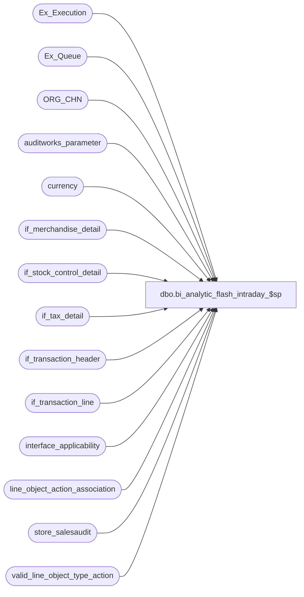

# dbo.bi_analytic_flash_intraday_$sp

**Database:** auditworks  
**Server:** bedrockdb01  

## Architecture Diagram



## Table Dependencies

| Referenced Table |
|---|
| Ex_Execution |
| Ex_Queue |
| ORG_CHN |
| auditworks_parameter |
| currency |
| if_merchandise_detail |
| if_stock_control_detail |
| if_tax_detail |
| if_transaction_header |
| if_transaction_line |
| interface_applicability |
| line_object_action_association |
| store_salesaudit |
| valid_line_object_type_action |

## Stored Procedure Code

```sql
CREATE proc  [dbo].[bi_analytic_flash_intraday_$sp] 
as  

/*   
PROC NAME: bi_analytic_flash_intraday_$sp
PROC DESC: This procedure is executed by a powershell script for Analytics. The procedure will return a result set and a file will be generated from the returning records.
           Interface 94 is used for this procedure
HISTORY:
Date	    Name   		Def#	Desc
01MAR2018	Sab		DQS-8258	Fix issue with GL posting logic not returning any records.
07FEB2018   Daphna  DQS-7368    ensure VAT abmount is negative for returns
02FEB2018   Daphna  DQS-7368    add VAT amount Q_IDAY_VAT_DLRS
29AUG2017	Daphna	DQS-5903	add new GL posting methods (25,26,27), while still supporting 14 
13Jun2017	Sab		DQS-5528	Added cashier_no
05Apr2017	Sab		DQS-4856	author
*/  
   
SET NOCOUNT ON
set ANSI_WARNINGS OFF

DECLARE 
 @default_currency	smallint,
 @errno				int,
 @max_serial_no		numeric(14,0),
 @min_serial_no		numeric(14,0),
 @object_id			int,
 @queue_id			tinyint,
 @errmsg			nvarchar(4000),
 @ErrorSeverity		smallint, -- represents the severity level of the error
 @errorline			int, -- represents the line # the error occured
 @ErrorState		int, -- represents the state of the error
 @message_id		int, -- represents the message_id from sys.messages
 @procedure_name	varchar(255), -- stored procedure name
 @object_name		varchar(64), -- object name such as table/function/SP
 @errmsg_parm 		nvarchar(4000)

SELECT @object_id = -94,  
   @queue_id = 94

BEGIN TRY
SELECT @default_currency = par_value
  FROM auditworks_parameter
 WHERE par_name = 'common_currency'
END TRY
BEGIN CATCH 
 SELECT @errno = ERROR_NUMBER(), 
		   @errmsg = ERROR_MESSAGE(),
           @ErrorSeverity = ERROR_SEVERITY(),
		   @errorline = ERROR_LINE(),
		   @ErrorState = ERROR_STATE(), 
		   @procedure_name = ERROR_PROCEDURE(),
   		   @object_name = 'auditworks_parameter',
		   @message_id = 150001
	  	-- 	SELECT @errmsg = 'Failed to SELECT auditworks_parameter'
  GOTO error
END CATCH

BEGIN TRY
  SELECT @min_serial_no = MAX(to_serial_no) + 1  
	FROM Ex_Execution
   WHERE queue_id = @queue_id  
	 AND object_id = @object_id  
END TRY
BEGIN CATCH 
	SELECT @errno = ERROR_NUMBER(), 
		   @errmsg = ERROR_MESSAGE(),
           @ErrorSeverity = ERROR_SEVERITY(),
		   @errorline = ERROR_LINE(),
		   @ErrorState = ERROR_STATE(), 
		   @procedure_name = ERROR_PROCEDURE(),
   		   @object_name = 'Ex_Execution',
		   @message_id = 150001
	  	-- 	SELECT @errmsg = 'Failed to SELECT Ex_Execution'
	GOTO error
END CATCH

IF @min_serial_no IS NULL  
BEGIN 
  BEGIN TRY 
	SELECT @min_serial_no = MIN(serial_no)  
	  FROM Ex_Queue  
	  WHERE queue_id = @queue_id  
  END TRY
  BEGIN CATCH 
     SELECT @errno = ERROR_NUMBER(), 
		   @errmsg = ERROR_MESSAGE(),
           @ErrorSeverity = ERROR_SEVERITY(),
		   @errorline = ERROR_LINE(),
		   @ErrorState = ERROR_STATE(), 
		   @procedure_name = ERROR_PROCEDURE(),
   		   @object_name = 'Ex_Queue',
		   @message_id = 150001
	  	-- 	SELECT @errmsg = 'Failed to SELECT Ex_Queue'
	 GOTO error
  END CATCH
  
  IF @min_serial_no IS NULL  
	RETURN  
END -- @min_serial_no IS NULL  
  
BEGIN TRY 
  SELECT @max_serial_no = MAX(serial_no)  
	FROM Ex_Queue  
   WHERE queue_id = @queue_id
END TRY
BEGIN CATCH 
     SELECT @errno = ERROR_NUMBER(), 
		   @errmsg = ERROR_MESSAGE(),
           @ErrorSeverity = ERROR_SEVERITY(),
		   @errorline = ERROR_LINE(),
		   @ErrorState = ERROR_STATE(), 
		   @procedure_name = ERROR_PROCEDURE(),
   		   @object_name = 'Ex_Queue (1)',
		   @message_id = 150001
	  	-- 	SELECT @errmsg = 'Failed to SELECT Ex_Queue (1)'
      GOTO error
 END CATCH

BEGIN TRY
  SELECT
	transaction_category	AS transaction_category	/* FROM SLSADT_LN_OBJ_ACT_GL-Q */
 ,	line_object_type	AS line_object_type	/* FROM SLSADT_LN_OBJ_ACT_GL-Q */
 ,	line_object	AS line_object	/* FROM SLSADT_LN_OBJ_ACT_GL-Q */
 ,	line_action	AS line_action	/* FROM SLSADT_LN_OBJ_ACT_GL-Q */
 ,	CASE WHEN (lookup_segment1=25 or lookup_segment2=25 or lookup_segment3=25 or lookup_segment4=25 or lookup_segment5=25 or lookup_segment6=25 or lookup_segment7=25 or lookup_segment8=25) THEN 25  WHEN  (lookup_segment1=26 or lookup_segment2=26 or lookup_segment3=26 or lookup_segment4=26 or lookup_segment5=26 or lookup_segment6=26 or lookup_segment7=26 or lookup_segment8=26)  THEN 26 WHEN   (lookup_segment1=27 or lookup_segment2=27 or lookup_segment3=27 or lookup_segment4=27 or lookup_segment5=27 or lookup_segment6=27 or lookup_segment7=27 or lookup_segment8=27)   THEN 27 WHEN (lookup_segment1=14 or lookup_segment2=14 or lookup_segment3=14 or lookup_segment4=14 or lookup_segment5=14 or lookup_segment6=14 or lookup_segment7=14 or lookup_segment8=14) THEN 14 ELSE 0 END	AS gl_posting_method	/* FROM SLSADT_LN_OBJ_ACT_GL-Q */
 INTO #GL_POSTING_MTHD
 FROM line_object_action_association S
 WHERE line_action in (1,2,90,99,142) --AND transaction_category = 201		-- SLSADT_LN_OBJ_ACT_GL-Q_WHERE
END TRY
BEGIN CATCH
     SELECT @errno = ERROR_NUMBER(), 
		   @errmsg = ERROR_MESSAGE(),
           @ErrorSeverity = ERROR_SEVERITY(),
		   @errorline = ERROR_LINE(),
		   @ErrorState = ERROR_STATE(), 
		   @procedure_name = ERROR_PROCEDURE(),
   		   @object_name = 'Ex_Queue (1)',
		   @message_id = 150001
	  	-- 	SELECT @errmsg = 'Failed to CREATE #GL_POSTING_MTHD'
      GOTO error
END CATCH

/* GL posting method
0 = for regular sales and returns, use header store
14 = for orders and returned orders (90,99,142) use originating store, if null use header store
25 = for orders (line_action 90, 142) use fulfillment store when it is a selling store, else use originating store 
		if originating store is null use header store
26 = for orders returend (line action 99) use return store when it is a selling store, else use originating store
		if originating store is null use header store
27 = for orders returend (line action 99) use originating store if null use header store
*/


BEGIN TRY
 SELECT h.entry_date_time, h.store_no, h.register_no, h.transaction_no, MAX(h.if_entry_no) max_if_entry_no
  INTO #if
  FROM Ex_Queue eq WITH (NOLOCK)
  JOIN if_transaction_header h WITH (NOLOCK) on eq.key_1 = h.if_entry_no AND transaction_void_flag IN (0,8)  
  JOIN if_transaction_line l WITH (NOLOCK) on l.if_entry_no = h.if_entry_no AND line_void_flag = 0   
  JOIN interface_applicability ia ON ia.interface_id = eq.queue_id AND ia.transaction_category = h.transaction_category  
   AND ia.line_object = l.line_object AND ia.line_action = l.line_action  
  JOIN valid_line_object_type_action v on l.line_object_type = v.line_object_type and ia.line_action = v.line_action  
  JOIN if_merchandise_detail m WITH (NOLOCK) on l.if_entry_no = m.if_entry_no AND l.line_id = m.line_id  
  JOIN store_salesaudit sst WITH (NOLOCK) on sst.store_no = h.store_no
 WHERE eq.serial_no between @min_serial_no AND @max_serial_no and queue_id = @queue_id
 GROUP BY h.entry_date_time, h.store_no, h.register_no, h.transaction_no
END TRY
BEGIN CATCH 
   SELECT @errno = ERROR_NUMBER(), 
		   @errmsg = ERROR_MESSAGE(),
           @ErrorSeverity = ERROR_SEVERITY(),
		   @errorline = ERROR_LINE(),
		   @ErrorState = ERROR_STATE(), 
		   @procedure_name = ERROR_PROCEDURE(),
   		   @object_name = '#if',
		   @message_id = 150001
	  	-- 	SELECT @errmsg = 'Failed to CREATE #if'
    GOTO error
END CATCH

BEGIN TRY
 SELECT cast(h.entry_date_time as varchar(20)) + '-' 
			+ 	CAST(CASE WHEN COALESCE(g.gl_posting_method,0) = 0 THEN h.store_no
						WHEN (g.gl_posting_method IN( 14,26)
							OR (g.gl_posting_method = 25 AND COALESCE(s.store_on_file_flag, LF.SLNG_FLAG ) = 0)
							OR (g.gl_posting_method = 27 AND COALESCE(s.store_on_file_flag, LR.SLNG_FLAG ) = 0)
							OR(G.gl_posting_method = 25 and s.other_store_no  IS NULL) 
							OR (G.gl_posting_method = 27 and s.location_no IS NULL)) 
							THEN COALESCE(s.originating_store_no, m.originating_store_no, h.store_no)
						WHEN g.gl_posting_method = 25 AND COALESCE(s.store_on_file_flag, LF.SLNG_FLAG ) = 1                    
							THEN COALESCE(s.other_store_no , s.originating_store_no, m.originating_store_no, h.store_no)
						WHEN g.gl_posting_method = 27 AND COALESCE(s.store_on_file_flag, LR.SLNG_FLAG ) = 1          
							THEN COALESCE(s.location_no,s.originating_store_no, m.originating_store_no, h.store_no)
			END AS VARCHAR(6)) 	    + '-'
		+ CAST(h.register_no as varchar(6)) + '-' + CAST(h.transaction_no as varchar(8)) Q_SLS_IDAY_TXN_HDR_SNUM,
		l.line_id Q_SLS_IDAY_TXN_DTL_SEQNUM,
		h.register_no	Q_WRKSTN_SNUM,
		h.transaction_no	Q_SLS_IDAY_TXN_NUM,
		h.transaction_date	Q_DT_ID,	

		-- stock_control.location_no = return location
		-- stock_control.other_store_no = fulfillment location
		-- stock_control.store_on_file_flag = selling location (for return or fulfill)		
		
		CASE WHEN COALESCE(g.gl_posting_method,0) = 0 THEN h.store_no
			WHEN (g.gl_posting_method IN( 14,26)
				OR (g.gl_posting_method = 25 AND COALESCE(s.store_on_file_flag, LF.SLNG_FLAG ) = 0)
				OR (g.gl_posting_method = 27 AND COALESCE(s.store_on_file_flag, LR.SLNG_FLAG ) = 0)
				OR(G.gl_posting_method = 25 and s.other_store_no  IS NULL) 
				OR (G.gl_posting_method = 27 and s.location_no IS NULL)) 
				THEN COALESCE(s.originating_store_no, m.originating_store_no, h.store_no)
			WHEN g.gl_posting_method = 25 AND COALESCE(s.store_on_file_flag, LF.SLNG_FLAG ) = 1                    
				THEN COALESCE(s.other_store_no , s.originating_store_no, m.originating_store_no, h.store_no)
			WHEN g.gl_posting_method = 27 AND COALESCE(s.store_on_file_flag, LR.SLNG_FLAG ) = 1          
				THEN COALESCE(s.location_no,s.originating_store_no, m.originating_store_no, h.store_no)
			END AS	Q_STR_SNUM,
		m.sku_id	Q_SKU_SNUM,
		CAST(REPLACE(SUBSTRING(CONVERT(varchar, h.entry_date_time, 108),1,5),':','') as INT) Q_TIME_ID,
		c.currency_code	Q_BK_CCY_SNUM,
		CASE WHEN (l.db_cr_none = 1 or (l.db_cr_none = 0 AND v.default_db_cr_none = 1)) AND l.line_action <> 8 Then 1 Else 0 END Q_SLS_RTRN_FLG,
		CASE when v.default_db_cr_none = -1 Then m.units ELSE m.units * -1 END Q_SLS_IDAY_UNTS,
		CASE when v.default_db_cr_none = -1 Then l.gross_line_amount - l.pos_discount_amount ELSE (l.gross_line_amount - l.pos_discount_amount)*-1 END	Q_SLS_IDAY_RDLRS,
		eq.key_2 Q_INTFC_CTRL_FLG,
		h.cashier_no Q_EMP_SNUM,
		CASE WHEN v.default_db_cr_none = -1 then ISNULL(tt.vat_amount,0) else ISNULL(tt.vat_amount,0)*-1 END Q_IDAY_VAT_DLRS 
  FROM Ex_Queue eq WITH (NOLOCK)
  JOIN #if ON eq.key_1 = #if.max_if_entry_no
  JOIN if_transaction_header h WITH (NOLOCK) on #if.max_if_entry_no = h.if_entry_no AND transaction_void_flag IN (0,8)  
  JOIN if_transaction_line l WITH (NOLOCK) on l.if_entry_no = h.if_entry_no AND line_void_flag = 0   
  JOIN interface_applicability ia ON ia.interface_id = eq.queue_id AND ia.transaction_category = h.transaction_category  
   AND ia.line_object = l.line_object AND ia.line_action = l.line_action  
  LEFT OUTER JOIN #GL_POSTING_MTHD g ON g.line_object = ia.line_object and g.line_action = ia.line_action and g.transaction_category = ia.transaction_category
  JOIN valid_line_object_type_action v on l.line_object_type = v.line_object_type and ia.line_action = v.line_action  
  JOIN if_merchandise_detail m WITH (NOLOCK) on l.if_entry_no = m.if_entry_no AND l.line_id = m.line_id  
  JOIN store_salesaudit sst WITH (NOLOCK) on sst.store_no = h.store_no
  LEFT OUTER JOIN currency c on c.currency_id = ISNULL(sst.currency_id,@default_currency) 
  LEFT OUTER JOIN if_stock_control_detail s on s.if_entry_no = l.if_entry_no and s.line_id = l.line_id and s.display_def_id = 31
  LEFT OUTER JOIN ORG_CHN LF on LF.ORG_CHN_NUM = s.other_store_no  -- fulfill
  LEFT OUTER JOIN ORG_CHN LR on LR.ORG_CHN_NUM = s.location_no   -- return
  LEFT OUTER JOIN (SELECT t.if_entry_no, t.line_id, SUM(t.tax_amount) vat_amount   
				  FROM #if q1 WITH (NOLOCK)  
				  INNER JOIN if_tax_detail t WITH (NOLOCK) on q1.max_if_entry_no = t.if_entry_no 
				        AND t.tax_strip_flag =1  AND t.applied_by_line_id IS NULL
				  GROUP BY t.if_entry_no, t.line_id) tt ON l.if_entry_no = tt.if_entry_no AND l.line_id = tt.line_id   
 WHERE eq.serial_no between @min_serial_no AND @max_serial_no and queue_id = @queue_id  
END TRY
BEGIN CATCH 
   SELECT @errno = ERROR_NUMBER(), 
		   @errmsg = ERROR_MESSAGE(),
           @ErrorSeverity = ERROR_SEVERITY(),
		   @errorline = ERROR_LINE(),
		   @ErrorState = ERROR_STATE(), 
		   @procedure_name = ERROR_PROCEDURE(),
   		   @object_name = 'Ex_Queue (2)',
		   @message_id = 150001
	  	-- 	SELECT @errmsg = 'Failed to SELECT Ex_Queue (2)'
    GOTO error
END CATCH

BEGIN TRY
  INSERT Ex_Execution (  
		queue_id,  
		object_id,  
		execution_id,  
		from_serial_no,  
		to_serial_no)  
  VALUES (@queue_id,  
		@object_id,  
		0,  
		@min_serial_no,  
		@max_serial_no)  
  END TRY
BEGIN CATCH 
			SELECT @errno = ERROR_NUMBER(), 
		   @errmsg = ERROR_MESSAGE(),
           @ErrorSeverity = ERROR_SEVERITY(),
		   @errorline = ERROR_LINE(),
		   @ErrorState = ERROR_STATE(), 
		   @procedure_name = ERROR_PROCEDURE(),
   		   @object_name = 'Ex_Execution (2)',
		   @message_id = 150002
	  	-- 	SELECT @errmsg = 'Failed to Insert Ex_Execution (2)'
		GOTO error
END CATCH   

RETURN

error:
	-- Append the parameters at the end of the @errmsg variable
	SET @errmsg_parm = @errmsg + N'{{{' + CAST(@errno as nvarchar(10)) + N'|||' + @procedure_name + N'|||' + CAST(@errorline as nvarchar(10)) + N'|||' + @object_name + N'|||' + @errmsg + N'}}}'

    RAISERROR (@message_id, @ErrorSeverity, @ErrorState, @errno, @procedure_name, @errorline, @object_name, @errmsg_parm)
RETURN
```

