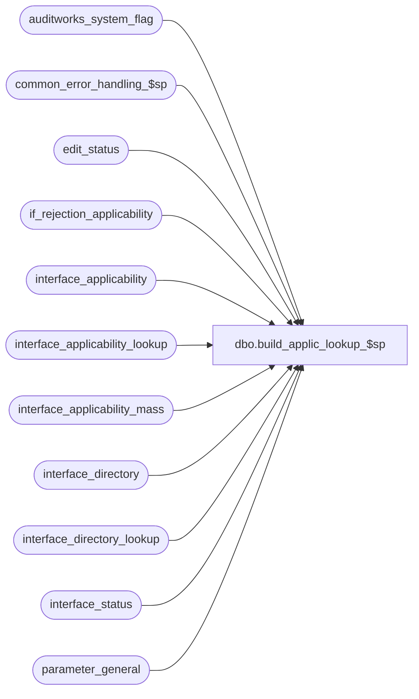

# dbo.build_applic_lookup_$sp

**Database:** auditworks  
**Server:** bedrockdb01  

## Architecture Diagram



## Table Dependencies

| Referenced Table |
|---|
| auditworks_system_flag |
| common_error_handling_$sp |
| edit_status |
| if_rejection_applicability |
| interface_applicability |
| interface_applicability_lookup |
| interface_applicability_mass |
| interface_directory |
| interface_directory_lookup |
| interface_status |
| parameter_general |

## Stored Procedure Code

```sql
create proc dbo.build_applic_lookup_$sp @errmsg nvarchar(255) OUTPUT,
@batch_process_no tinyint = 1

AS
/* Proc Name: build_applic_lookup_$sp
   Desc: Updates derived master tables after change of underlying master tables.
    Builds interface_applicability_lookup (contains entries for all active interfaces)
    and interface_applicability_mass (contains only interfaces that will be mass inserted by the edit)
    from interface_applicability and interface_directory. 
    Also builds interface_directory_lookup (contains active interfaces and is used by i/f reject logic).
    Tables are used by edit_interfaces_$sp, move_interfaces_$sp and modify_interface_$sp and includes
    all line_objects that were explicitly flagged as applicable to interfaces.
    Also ensures that a row exists in interface_status for each interface.
    This rebuild is initiated by triggers on interface directory and interface_applicability
    which set a rebuild flag in parameter_general.
    The next edit checks this flag; if it is on then the edit will call this procedure.
    Uses delete commands to prevent dirty reads while rebuilding is in progress.

HISTORY:
Date     Name		Def# Desc
Jan12,15 Vicci     TFS-99599 Handle I/F Rejection Rule 83 (invalid cashier) same as rule 80 (invalid/missing cashier) except that
                             absent cashier (i.e. cashier 0) is OK.
Jan25,13 Vicci      1-4A7WED Add entry for C/L revalidation to allow C/L Edit when called by Edit to determine if any new entries have been posted
                             since the last time the revalidation ran.
Nov19,10 Paul         120413 update rebuild date in auditworks_system_flag
Apr26,10 Paul         117332 allow mass processing of all interfaces, avoid updating interface_directory since it is now replicated.
Aug03.06 Daphna        75652 allow mass processing of interface when live-date earlier than last period-end date
Jul08,05 David       DV-1298 Treat I/F reject reason 113 same as reason 2.
Feb13,04 Maryam        23053 Do not set reference_no_check = 1 for if_reject_reason = 15 as
                             this if_reject_reason no longer exist in SA 4.00
Jan29,03 Maryam        22284 Make employee_no_check = 1 where if_reject_reason = 81
Nov07,03 ShuZ          17564 Drop _check columns in interface_directory and replace it
                             with interface_directory_lookup
Sep11,03 Paul        1-G7A5F build table interface_directory_lookup, don't rebuild if_rejection_applicability
				since it is now maintained exclusively by frontend (rel 4 and higher).
Jul10,03 Maryam      1-KL08H Insert entries in edit_status for media_rec.(function_no = 70) 
Aug16,02 HenryW	     1-AUHY5 Only allow delete/rebuild of system I/F rejects < 110.
Nov26,01 Winnie	     1-969YY Add logic for R3 error handling
Jan03,02 Winnie      1-A06FP Problem with Sybase 12.5, use if not exists instead to determine whether the
			     row exist in interface_status.
Aug29,01 Maryam 	8283 Insert into interface_applicability_lookup when inerface_applicability = 0
                     		Also insert into if_rejection_applicability for if_reject_reason 7 and 8
                     		when either exception_jurisdiction_check or tax_default_check is turned on.
May29,01 Paul   	8027 remove hold logic
Apr30,01 Phu    	7551 Populate if_rejection_applicability for if_reject_reason < 200
Jan04,01 Paul   	7158 Remove exists clause
Nov17,00 Paul   	7005 Insert entries in edit_status for edit phase2
Mar01,00 Phu    	5900 Change @@fetch_status > 0 to @@fetch_status <> 0 for MS SQL compatibility
Nov03,98 Paul
May22,96 Paul   	author
*/

DECLARE
	@concurrent_counter		tinyint,
	@concurrent_edit_processes	tinyint,
	@cursor_open			tinyint,
	@edit_process_no		tinyint,
	@errno				int,
	@interface_id			tinyint,
	@rows				int,
	@object_name			nvarchar(255),
	@process_name			nvarchar(100),
	@operation_name			nvarchar(100),
	@message_id			int
	
	
SELECT  @process_name = 'build_applic_lookup_$sp',
        @message_id = 201068

SELECT @concurrent_edit_processes = concurrent_edit_processes
  FROM parameter_general

SELECT @errno = @@error
IF @errno != 0
  BEGIN
    SELECT @errmsg = 'Failed to select concurrent_edit_processes from parameter_general.',
           @object_name = 'parameter_general',
           @operation_name = 'SELECT'
    GOTO error
END

BEGIN TRANSACTION

DELETE interface_applicability_lookup

SELECT @errno = @@error
IF @errno != 0
  BEGIN
   SELECT @errmsg = 'Failed to delete existing rows in interface_applicability_lookup',
          @object_name = 'interface_applicability_lookup',
          @operation_name = 'DELETE'   
   GOTO error
  END

DELETE interface_applicability_mass

SELECT @errno = @@error
IF @errno != 0
  BEGIN
   SELECT @errmsg = 'Failed to delete existing rows in interface_applicability_mass',
          @object_name = 'interface_applicability_mass',
          @operation_name = 'DELETE'      
   GOTO error
  END

DELETE interface_directory_lookup

SELECT @errno = @@error
IF @errno != 0
BEGIN
  SELECT @errmsg = 'Failed to delete interface_directory_lookup. ',
         @object_name = 'interface_directory_lookup',
         @operation_name = 'DELETE'
  GOTO error
END   

INSERT interface_directory_lookup(
	interface_id,
	update_timing,
	upc_check,
	credit_card_check,
	employee_no_check,
	customer_info_check,
	exception_jurisdiction_check,
	tax_default_check,
	live_date,
	interface_voided_transactions,
	store_check,
	applicability_method,
	edit_mass_update_flag,
	purchasing_employee_check,
	cashier_check,
	payroll_employee_check,
	reference_no_check,
	customer_liability_check,
	all_modifications_relevant)
 SELECT
        interface_id,
	update_timing,
	0,--upc_check,
	0,--credit_card_check,
	0,--employee_no_check,
	0,--customer_info_check,
	0,--exception_jurisdiction_check,
	0,--tax_default_check,
	live_date,
	interface_voided_transactions,
	0,--store_check,
	applicability_method,
	0, -- edit_mass_update_flag
	0,--purchasing_employee_check,
	0,--cashier_check,
	0,--payroll_employee_check,
	0,--reference_no_check
	0,--customer_liability_check
	all_modifications_relevant
  FROM interface_directory
  WHERE update_timing >= 1

SELECT @errno = @@error
IF @errno != 0
  BEGIN
   SELECT @errmsg = 'Failed to INSERT interface_directory_lookup. ',
          @object_name = '#interface_directory_lookup',
          @operation_name = 'INSERT'   
   GOTO error
  END

UPDATE interface_directory_lookup
  SET edit_mass_update_flag = 1
 WHERE applicability_method = 0

SELECT @errno = @@error
IF @errno != 0
     BEGIN
      SELECT @errmsg = 'Failed to update interface_directory_lookup',
             @object_name = 'interface_directory_lookup',
             @operation_name = 'UPDATE'            
      GOTO error
     END

INSERT interface_applicability_lookup (
	interface_id,
	transaction_category,
	line_object,
	line_action )
SELECT
	id.interface_id,
	ia.transaction_category,
	ia.line_object,
	ia.line_action
  FROM interface_directory_lookup id, interface_applicability ia
 WHERE id.interface_id = ia.interface_id
   AND id.applicability_method = 0

SELECT @errno = @@error
IF @errno != 0
     BEGIN
      SELECT @errmsg = 'Failed to insert interface_applicability_lookup',
             @object_name = 'interface_applicability_lookup',
             @operation_name = 'INSERT'               
      GOTO error
     END

INSERT interface_applicability_mass (
	interface_id,
	transaction_category,
	line_object,
	line_action,
	update_timing,
	interface_voided_transactions,
	live_date )
SELECT
	id.interface_id,
	ia.transaction_category,
	ia.line_object,
	ia.line_action,
	id.update_timing,
	id.interface_voided_transactions,
	id.live_date
  FROM interface_directory_lookup id, interface_applicability ia
 WHERE id.interface_id = ia.interface_id
   AND id.applicability_method = 0

SELECT @errno = @@error
IF @errno != 0
        BEGIN
         SELECT @errmsg = 'Failed to insert interface_applicability_mass',
                @object_name = 'interface_applicability_mass',
                @operation_name = 'INSERT'               
         GOTO error
        END


/* Ensure that a row exists in interface_ststus for each active interface */

DECLARE interface_directory_crsr CURSOR FAST_FORWARD
FOR
SELECT  interface_id
  FROM interface_directory_lookup

OPEN interface_directory_crsr

SELECT @errno = @@error
IF @errno != 0
  BEGIN
   SELECT @errmsg = 'Failed to open cursor interface_directory_crsr on interface_directory',
          @object_name = 'interface_directory_crsr',
          @operation_name = 'OPEN'               
   GOTO error
  END

SELECT @cursor_open = 1

WHILE 1=1
BEGIN

  FETCH interface_directory_crsr INTO
	@interface_id

  IF @@fetch_status <> 0
    BREAK

  IF NOT EXISTS (SELECT interface_id
                 FROM interface_status
                WHERE interface_id = @interface_id)
	 BEGIN
	   INSERT interface_status (
		interface_id,
		last_retrieval_datetime,
		last_posting_datetime )
	   VALUES (
		@interface_id,
		getdate(),
		getdate() )

	   SELECT @errno = @@error
	   IF @errno != 0
	     BEGIN
	      SELECT @errmsg = 'Failed to insert interface_status',
	             @object_name = 'interface_status',
	             @operation_name = 'INSERT'             	
	      GOTO error
	     END
	  END

END /* While 1=1 */


UPDATE interface_directory_lookup
  SET  upc_check = ISNULL((SELECT DISTINCT 1 FROM if_rejection_applicability i
                      WHERE w.interface_id = i.interface_id
                        AND i.if_reject_reason IN (1,87,88)),upc_check),
       employee_no_check = ISNULL((SELECT DISTINCT 1 FROM if_rejection_applicability i
                      WHERE w.interface_id = i.interface_id
                        AND i.if_reject_reason IN(3,81)),employee_no_check),
       purchasing_employee_check = ISNULL((SELECT DISTINCT 1 FROM if_rejection_applicability i
                      WHERE w.interface_id = i.interface_id
                        AND i.if_reject_reason = 4),purchasing_employee_check),
       cashier_check = ISNULL((SELECT MAX(CASE WHEN if_reject_reason = 80 THEN 2 ELSE 1 END) FROM if_rejection_applicability i
                                WHERE w.interface_id = i.interface_id
                                  AND i.if_reject_reason IN (80, 83)), cashier_check),
       payroll_employee_check = ISNULL((SELECT DISTINCT 1 FROM if_rejection_applicability i
                      WHERE w.interface_id = i.interface_id
                        AND i.if_reject_reason = 82),payroll_employee_check),
    store_check = ISNULL((SELECT DISTINCT 1 FROM if_rejection_applicability i
                      WHERE w.interface_id = i.interface_id
               AND i.if_reject_reason = 9),store_check),              
       exception_jurisdiction_check = ISNULL((SELECT DISTINCT 1 FROM if_rejection_applicability i
                      WHERE w.interface_id = i.interface_id
                        AND i.if_reject_reason = 7), exception_jurisdiction_check),                                                                      
       tax_default_check = ISNULL((SELECT DISTINCT 1 FROM if_rejection_applicability i
                      WHERE w.interface_id = i.interface_id
                        AND i.if_reject_reason = 8),tax_default_check),
       credit_card_check = ISNULL((SELECT DISTINCT 1 FROM if_rejection_applicability i
                      WHERE w.interface_id = i.interface_id
                        AND i.if_reject_reason IN (2,113)),credit_card_check),                                                                     
       customer_info_check = ISNULL((SELECT DISTINCT 1 FROM if_rejection_applicability i
                      WHERE w.interface_id = i.interface_id
                        AND i.if_reject_reason = 6),customer_info_check)
       FROM interface_directory_lookup w                        
                                                                               
SELECT @errno = @@error
IF @errno != 0
BEGIN
  SELECT @errmsg = 'Failed to UPDATE _check in interface_directory_lookup (1). ',
         @object_name = 'interface_directory_lookup',
         @operation_name = 'UPDATE'
  GOTO error
END

UPDATE interface_directory_lookup
  SET  upc_check = ISNULL((SELECT DISTINCT 2 FROM if_rejection_applicability i
                      WHERE w.interface_id = i.interface_id
                        AND i.if_reject_reason IN (5,89,90)),upc_check),
       store_check = ISNULL((SELECT DISTINCT 2 FROM if_rejection_applicability i
                      WHERE w.interface_id = i.interface_id
                        AND i.if_reject_reason = 10),store_check),
       reference_no_check = ISNULL((SELECT DISTINCT 2 FROM if_rejection_applicability i
                      WHERE w.interface_id = i.interface_id
                        AND i.if_reject_reason = 86),reference_no_check),
       customer_liability_check = ISNULL((SELECT DISTINCT 1 FROM if_rejection_applicability i
                      WHERE w.interface_id = i.interface_id
                        AND i.if_reject_reason = 100),customer_liability_check)
  FROM interface_directory_lookup w                        

SELECT @errno = @@error
IF @errno != 0
BEGIN
  SELECT @errmsg = 'Failed to UPDATE _check in interface_directory_lookup (2). ',
         @object_name = 'interface_directory_lookup',
         @operation_name = 'UPDATE'
  GOTO error
END 

UPDATE parameter_general
   SET if_lookup_rebuild_flag = 0

SELECT @errno = @@error
IF @errno != 0
  BEGIN
   SELECT @errmsg = 'Failed to update parameter_general',
          @object_name = 'parameter_general',
          @operation_name = 'UPDATE'            
   GOTO error
  END

COMMIT TRANSACTION

CLOSE interface_directory_crsr
DEALLOCATE interface_directory_crsr

UPDATE auditworks_system_flag
  SET flag_datetime_value = getdate()
 WHERE flag_name = 'if_lookup_rebuild_date'

SELECT @errno = @@error
IF @errno != 0
    BEGIN
      SELECT @errmsg = 'Failed to set if_lookup_rebuild_date',
	     @object_name = 'auditworks_system_flag',
	     @operation_name = 'UPDATE'        
      GOTO error
    END


/* Insert status records for edit ( used to trigger edit_cleanup_$sp ) */

SELECT 	@concurrent_counter = 0,
	@cursor_open = 0

WHILE @concurrent_counter < @concurrent_edit_processes
BEGIN
 SELECT @concurrent_counter = @concurrent_counter + 1

 SELECT @edit_process_no = edit_process_no
   FROM edit_status
   WHERE edit_process_no = @concurrent_counter
   AND edit_function_no = 1

  SELECT @errno = @@error,
         @rows = @@rowcount
  IF @errno != 0
    BEGIN
      SELECT @errmsg = 'Failed to select from edit_status (edit_function_no = 1)',
        @object_name = 'edit_status',
             @operation_name = 'SELECT'        
      GOTO error
    END

 IF @rows = 0
   BEGIN
     INSERT edit_status (
  	    edit_process_no,
  	    edit_function_no,
	    edit_status,
	    edit_timestamp,
	    post_void_prior_trans )
     VALUES (
 	    @concurrent_counter,
	    1,
	    0,
	    0,
	    0 )

    SELECT @errno = @@error
    IF @errno != 0
      BEGIN
       SELECT @errmsg = 'Failed to insert edit_status (edit_function_no = 1)',
              @object_name = 'edit_status',
              @operation_name = 'INSERT'            
       GOTO error
      END
  END

 SELECT @edit_process_no = edit_process_no
   FROM edit_status
   WHERE edit_process_no = @concurrent_counter
   AND edit_function_no = 2 /* interfaces */

  SELECT @errno = @@error,
         @rows = @@rowcount
  IF @errno != 0
    BEGIN
     SELECT @errmsg = 'Failed to select from edit_status (edit_function_no = 2)',
            @object_name = 'edit_status',
            @operation_name = 'SELECT'            
     GOTO error
    END

 IF @rows = 0
   BEGIN
     INSERT edit_status (
  	    edit_process_no,
	    edit_function_no,
	    edit_status,
	    edit_timestamp,
	    post_void_prior_trans )
     VALUES (
	     @concurrent_counter,
	     2,
 	     0,
  	     0,
	     0 )

      SELECT @errno = @@error
      IF @errno != 0
        BEGIN
          SELECT @errmsg = 'Failed to select from edit_status (edit_function_no = 2)',
                 @object_name = 'edit_status',
                 @operation_name = 'SELECT'            
          GOTO error
        END
    END

 SELECT @edit_process_no = edit_process_no
   FROM edit_status
   WHERE edit_process_no = @concurrent_counter
   AND edit_function_no = 5 -- phase2

  SELECT @errno = @@error,
         @rows = @@rowcount
  IF @errno != 0
    BEGIN
     SELECT @errmsg = 'Failed to select edit_process_no from edit_status (edit_function_no = 5)',
            @object_name = 'edit_status',
            @operation_name = 'SELECT'            
     GOTO error
    END

 IF @rows = 0
   BEGIN
     INSERT edit_status (
  	    edit_process_no,
	    edit_function_no,
	    edit_status,
	    edit_timestamp,
	    post_void_prior_trans )
     VALUES (
	     @concurrent_counter,
	     5,
	     0,
	     0,
	     0 )

  SELECT @errno = @@error
  IF @errno != 0
    BEGIN
     SELECT @errmsg = 'Failed to insert edit_status (edit_function_no = 5)',
            @object_name = 'edit_status',
            @operation_name = 'INSERT'            
     GOTO error
    END
  END

 SELECT @edit_process_no = edit_process_no
   FROM edit_status
  WHERE edit_process_no = @concurrent_counter
    AND edit_function_no = 70 /* media rec */

  SELECT @errno = @@error,
         @rows = @@rowcount
  IF @errno != 0
    BEGIN
     SELECT @errmsg = 'Failed to select from edit_status (edit_function_no = 70)',
            @object_name = 'edit_status',
            @operation_name = 'SELECT'            
     GOTO error
    END

 IF @rows = 0
   BEGIN
     INSERT edit_status (
  	    edit_process_no,
	    edit_function_no,
	    edit_status,
	    edit_timestamp,
	    post_void_prior_trans )
     VALUES (
	     @concurrent_counter,
	     70,
 	    0,
  	     0,
	     0 )

      SELECT @errno = @@error
      IF @errno != 0
        BEGIN
          SELECT @errmsg = 'Failed to select from edit_status (edit_function_no = 70)',
    @object_name = 'edit_status',
                 @operation_name = 'SELECT'            
          GOTO error
        END
    END

 SELECT @edit_process_no = edit_process_no
   FROM edit_status
  WHERE edit_process_no = @concurrent_counter
    AND edit_function_no = 78 /* customer liability revalidation */

  SELECT @errno = @@error,
         @rows = @@rowcount
  IF @errno != 0
    BEGIN
     SELECT @errmsg = 'Failed to select from edit_status (edit_function_no = 78)',
            @object_name = 'edit_status',
            @operation_name = 'SELECT'            
     GOTO error
    END

 IF @rows = 0
   BEGIN
     INSERT edit_status (
  	    edit_process_no,
	    edit_function_no,
	    edit_status,
	    edit_timestamp,
	    post_void_prior_trans )
     VALUES (
	     @concurrent_counter,	--note:  only stream one entry is actually used
	     78,
 	     0,				--0: nothing posted to C/L since last revalidation;  1:  something posted to C/L since last revalidation.
  	     0,
	     0 )

      SELECT @errno = @@error
      IF @errno != 0
        BEGIN
          SELECT @errmsg = 'Failed to select from edit_status (edit_function_no = 78)',
                 @object_name = 'edit_status',
                 @operation_name = 'SELECT'            
          GOTO error
        END
    END

END /* While */

RETURN

error:
	IF @cursor_open = 1
	  BEGIN
	   CLOSE interface_directory_crsr
	   DEALLOCATE interface_directory_crsr
	  END

	EXEC common_error_handling_$sp 4, @errno, @errmsg, 0, @message_id, 
	@process_name, @object_name, @operation_name, 1, @batch_process_no

	RETURN
```

