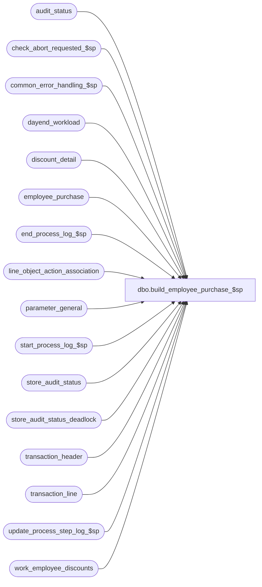

# dbo.build_employee_purchase_$sp

**Database:** auditworks  
**Server:** bedrockdb01  

## Architecture Diagram



## Table Dependencies

| Referenced Table |
|---|
| audit_status |
| check_abort_requested_$sp |
| common_error_handling_$sp |
| dayend_workload |
| discount_detail |
| employee_purchase |
| end_process_log_$sp |
| line_object_action_association |
| parameter_general |
| start_process_log_$sp |
| store_audit_status |
| store_audit_status_deadlock |
| transaction_header |
| transaction_line |
| update_process_step_log_$sp |
| work_employee_discounts |

## Stored Procedure Code

```sql
create proc dbo.build_employee_purchase_$sp 
  @process_id				 binary(16),
  @truncate_flag 			tinyint = 0,
  @dayend_process_id 			tinyint = NULL,
  @errmsg 				varchar(255) OUTPUT,
  @excluded_dayend_from_time            int = 0,
  @excluded_dayend_to_time              int = 0

AS


/* Proc name : build_employee_purchase_$sp
   Description : Accumulates total discounts on employee sales / returns by employee and transaction_date.
                 Only transactions with G/L effect are included.
                 In the case of transactions with 2-step completion such as layaways and orders, if both steps
                 (creation and fulfillment) have been given G/L effect, then the transaction will be recognized
                 in Employee Purchase tracking upon creation / cancellation.
  		 Called from day_end_posting_$sp.
  HISTORY:
  Date      Name     Def#  Desc
  Oct25,11  Vicci 1-45FI3M Port from Ora.  Avoid dup error due to multistream timing scenario when one employee purchased in 2 stores 
  Jun04,10  Vicci   118223 Avoid double booking layaways/orders:  for reference-type/line-objects where only creation 
 		           or completion have been given G/L effect, continue to use the timing with G/L effect;  
   		           for those where both creation and completion have G/L effect, use the creation recognition timing.
  Oct25,06  Phu      77931 Fix outer join for SQL 2005 Mode 90.
  Sep09,05  Paul   DV-1312 update history block
  Jul05,05  Paul   DV-1239 Use tran_id_datatype
  Nov15,04  Paul   DV-1167 enhancement - split out return totals, log store_no, improve performance with hints 
  Oct07,04  David  DV-1146 Remove user name.
  Sep02,04  David  DV-1129 apply 29561 to SA5
  May10,04  Maryam DV-1071 Receive @process_id and @user_name and pass it to check_abort_requested_$sp.
  Jul 15,04 Vicci    29561 Handling line_object_type 23 (PLU subtotal discounts)
  Sep 18,03 Maryam   13686 Pass two new parameters for excluded dayend time and call check_abort_requested_$sp
                          to check whether abort has been requested either by the system or user.
  May 08,02 Winnie 1-C2Q5L Add abort logic to dayend.
  May 03,02 Ian    1-CD0IX Add R3 Error Handling
  Nov 30,01 Phu       8931 Progress monitor and error handling
  Sep 18,00 Maryam    6725 Changed the dayend order.(subledger will be posted before employee purchase.)
  Sep 12,00 Shapoor   6663 Facilitate Multi Stream Dayend.
  Mar 30,00 Phu       6158 Remove alias name attached to column being updated for MS SQL compatibility
  Mar 01,00 Phu       5900 Change @@fetch_status > 0 to @@fetch_status <> 0 for MS SQL compatibility

*/

DECLARE	@cursor_open			tinyint,
        @employee_purchase_days 	smallint,
        @employee_transactions		int,
        @errno 				int,
        @message_id			int,
        @object_name			varchar(255),
        @operation_name			varchar(100),
        @process_log_entry 		tinyint,
        @process_name			varchar(100),
        @process_no 			smallint,
        @log_flag                       tinyint,
        @process_timestamp 		float,
        @rows				int,
        @store_no			int,
        @store_to_process		int,
        @transaction_count 		numeric(12,0),
        @transaction_date		smalldatetime,
        @abort_flag			tinyint,
        @retry				tinyint 


  IF @dayend_process_id IS NULL             
     RETURN

  IF (SELECT COUNT (store_no)
        FROM dayend_workload WITH (NOLOCK)
       WHERE dayend_process_id = @dayend_process_id
         AND store_audit_status = 305) = 0
    RETURN

  SELECT @process_log_entry = 0,
         @process_no        = 23,
         @process_timestamp = 0,
         @transaction_count = 0,
         @message_id        = 201068,
         @process_name      = 'build_employee_purchase_$sp',
         @abort_flag        = 0,
         @retry		    = 1 

  SELECT @employee_purchase_days = employee_purchase_days
    FROM parameter_general

  SELECT @errno = @@error
  IF @errno <> 0
  BEGIN
    SELECT @errmsg         = 'Failed to select from parameter_general',
           @object_name    = 'parameter_general',
           @operation_name = 'SELECT'
    GOTO error
  END

  IF @employee_purchase_days = 0
  BEGIN

    BEGIN TRAN

    UPDATE store_audit_status_deadlock
       SET function_no = 18,
           status_date = getdate()

    SELECT @errno = @@error
    IF @errno <> 0
    BEGIN
      SELECT @errmsg         = 'Unable to update store_audit_status_deadlock',
             @object_name    = 'store_audit_status_deadlock',
             @operation_name = 'UPDATE'
      GOTO error
    END

    UPDATE audit_status 
       SET audit_status = 330
      FROM audit_status a, dayend_workload d
     WHERE d.dayend_process_id = @dayend_process_id
       AND d.store_audit_status = 305
       AND d.store_audit_status = a.audit_status
       AND d.store_no           = a.store_no
       AND d.sales_date         = a.sales_date
       AND d.date_reject_id    = a.date_reject_id

  SELECT @errno = @@error
    IF @errno <> 0
    BEGIN
      SELECT @errmsg         = 'Failed to update audit_status to 330 from 305',
             @object_name    = 'audit_status',
             @operation_name = 'UPDATE'
      GOTO error
    END

    UPDATE store_audit_status 
       SET store_audit_status = 330
      FROM store_audit_status s, dayend_workload d
     WHERE d.dayend_process_id  = @dayend_process_id
       AND d.store_audit_status = 305
       AND d.store_audit_status = s.store_audit_status
       AND d.store_no           = s.store_no
       AND d.sales_date         = s.sales_date
       AND d.date_reject_id     = s.date_reject_id

    SELECT @errno = @@error
    IF @errno <> 0
    BEGIN
      SELECT @errmsg         = 'Failed to update store_audit_status to 330 from 305',
             @object_name    = 'store_audit_status',
             @operation_name = 'UPDATE'
      GOTO error
    END

    UPDATE dayend_workload
       SET store_audit_status = 330
      FROM dayend_workload
     WHERE dayend_process_id  = @dayend_process_id
       AND store_audit_status = 305

    SELECT @errno = @@error
    IF @errno <> 0
    BEGIN
      SELECT @errmsg         = 'Unable to set store_audit_status to 330 in dayend_workload',
             @object_name    = 'dayend_workload',
             @operation_name = 'UPDATE'
      GOTO error
    END

    COMMIT TRAN

    RETURN

  END			

  CREATE TABLE #all_stores (store_no   int not null,
                            sales_date smalldatetime not null)
  SELECT @errno = @@error
  IF @errno <> 0
  BEGIN
    SELECT @errmsg         = 'Failed to create temp table #all_stores',
           @object_name    = '#all_stores',
           @operation_name = 'CREATE'
    GOTO error
  END

  INSERT #all_stores (store_no, sales_date)
  SELECT store_no,
         sales_date
    FROM dayend_workload WITH (NOLOCK)
   WHERE dayend_process_id  = @dayend_process_id
     AND store_audit_status = 305

  SELECT @errno = @@error, @transaction_count = @@rowcount
  IF @errno <> 0
  BEGIN
    SELECT @errmsg         = 'Failed to build temp table #all_stores',
           @object_name    = '#all_stores',
           @operation_name = 'INSERT'
    GOTO error
  END

  IF @transaction_count = 0
    RETURN

  EXEC start_process_log_$sp @process_no, @process_timestamp OUTPUT,
	                     @errmsg OUTPUT, @dayend_process_id

  SELECT @errno = @@error
  IF @errno <> 0
  BEGIN
    IF @errmsg IS NULL  
      SELECT @errmsg       = 'Failed to execute start_process_log_$sp'
    SELECT @object_name    = 'start_process_log_$sp',
           @operation_name = 'EXECUTE'
    GOTO error
  END

  SELECT @process_log_entry     = 1,
         @transaction_count     = 0,
         @employee_transactions = 0,
         @store_to_process      = 1

  CREATE TABLE #work_purchase_list (employee_no         int not null,
                                    transaction_date    smalldatetime not null,
                                    store_no		int not null,
                            transaction_id      numeric(14,0) not null,  -- tran_id_datatype
                                    transaction_category tinyint not null)
  SELECT @errno = @@error
  IF @errno <> 0
  BEGIN
    SELECT @errmsg         = 'Failed to create temp table #work_purchase_list',
           @object_name    = '#work_purchase_list',
           @operation_name = 'CREATE'
    GOTO error
  END

  CREATE TABLE #employee_purchase (employee_no         int not null,
                                    transaction_date   smalldatetime not null,
                                    store_no           int not null,
                                    purchase_amount    money not null,
                                    return_amount      money not null,
                                    row_exists	       tinyint null)
  SELECT @errno = @@error
  IF @errno <> 0
  BEGIN
    SELECT @errmsg         = 'Failed to create temp table #employee_purchase',
           @object_name    = '#employee_purchase',
           @operation_name = 'CREATE'
  GOTO error
  END

  CREATE TABLE #store_status (store_no   int not null,
                              sales_date smalldatetime not null )

  SELECT @errno = @@error
  IF @errno <> 0
  BEGIN
    SELECT @errmsg         = 'Failed to create temp table #store_status',
           @object_name    = '#store_status',
           @operation_name = 'CREATE'
    GOTO error
  END

  CREATE TABLE #interface_applicability(
         transaction_category tinyint not null,
         line_object smallint not null,
         line_action tinyint not null)
  SELECT @errno = @@error
  IF @errno <> 0
  BEGIN
    SELECT @errmsg         = 'Failed to create temp table #interface_applicability',
           @object_name    = '#interface_applicability',
           @operation_name = 'CREATE'
    GOTO error
  END

  --For reference-type/line-objects where only creation or completion have been given G/L effect, 
  --use the timing with G/L effect.  For those where both have G/L effect, use the creation recognition timing.
  INSERT INTO #interface_applicability(transaction_category, line_object, line_action)
  SELECT loaa.transaction_category, loaa.line_object, loaa.line_action
    FROM line_object_action_association loaa
         INNER JOIN (SELECT DISTINCT reference_type, line_object, line_action 
                       FROM line_object_action_association x WITH (NOLOCK)
                      WHERE x.line_object_type IN (1, 2)
    	                AND (x.line_action NOT IN (201,211, 90, 142, 87, 6, 5, 222, 216, 229, 230, 197, 198, 5, 6, 132, 133, 138, 139, 145, 146, 147, 152, 153) --completion_time_recognition
         	         OR x.line_object * 1000 + x.reference_type NOT IN
		 	    (SELECT line_object * 1000 + reference_type
		  	       FROM line_object_action_association
		 	      WHERE line_object_type in (1, 2)
		   	        AND db_cr_none <> 0
		  	      GROUP BY line_object, reference_type
		 	     HAVING MAX(CASE WHEN line_action in (201,211, 90, 142, 87, 6, 5, 222, 216, 229, 230, 197, 198, 5, 6, 132, 133, 138, 139, 145, 146, 147, 152, 153) THEN 0 ELSE 1 END) = 1  --creation_time_recognition
		    	        AND MAX(CASE WHEN line_action in (201,211, 90, 142, 87, 6, 5, 222, 216, 229, 230, 197, 198, 5, 6, 132, 133, 138, 139, 145, 146, 147, 152, 153) THEN 1 ELSE 0 END) = 1)  --completion_time_recognition
		            )
		    ) ia
            ON loaa.line_object = ia.line_object
	   AND loaa.line_action = ia.line_action
	   AND loaa.reference_type = ia.reference_type
   WHERE loaa.line_object_type IN (1, 2)
     AND loaa.db_cr_none <> 0
  SELECT @errno = @@error
  IF @errno <> 0
  BEGIN
    SELECT @errmsg         = 'Failed to populate temp table #interface_applicability',
           @object_name    = '#interface_applicability',
           @operation_name = 'INSERT'
    GOTO error
  END

  DECLARE store_date_crsr CURSOR FAST_FORWARD
  FOR
    SELECT store_no,
           sales_date
      FROM #all_stores WITH (NOLOCK)

  OPEN store_date_crsr

  SELECT @errno = @@error
  IF @errno <> 0
  BEGIN
    SELECT @errmsg         = 'Failed to open cursor store_date_crsr',
           @object_name    = 'store_date_crsr',
           @operation_name = 'OPEN'
    GOTO error
  END

  SELECT @cursor_open = 1

  WHILE @store_to_process >= 1
  BEGIN

    FETCH store_date_crsr 
     INTO @store_no,
          @transaction_date

    IF @@fetch_status <> 0
      SELECT @store_to_process = 0
    ELSE
     BEGIN
       EXEC check_abort_requested_$sp @dayend_process_id, @process_id, @process_no,
                        @excluded_dayend_from_time, @excluded_dayend_to_time, @errmsg OUTPUT
        
       SELECT @errno = @@error
       IF @errno != 0 
         BEGIN
           IF @errmsg IS NULL
             SELECT @errmsg = 'Failed to execute stored procedure check_abort_requested_$sp'
           SELECT @object_name = 'check_abort_requested_$sp',
                  @operation_name = 'EXECUTE'
           GOTO error
         END

       INSERT #work_purchase_list (employee_no,
                                   transaction_date,
                                   store_no,
                                   transaction_id, 
                                   transaction_category)
       SELECT employee_no,
              transaction_date,
              @store_no,
              transaction_id,
              transaction_category 
         FROM transaction_header WITH (NOLOCK)
        WHERE store_no         = @store_no
          AND transaction_date = @transaction_date
          AND date_reject_id   = 0
          AND employee_no IS NOT NULL
          AND transaction_void_flag IN (0,8)
          AND sa_rejection_flag = 0

       SELECT @errno = @@error, @employee_transactions = @employee_transactions + @@rowcount
       IF @errno <> 0
       BEGIN
         SELECT @errmsg         = 'Failed to insert #work_purchase_list',
                @object_name    = '#work_purchase_list',
                @operation_name = 'INSERT'
         GOTO error
       END

       INSERT #store_status (store_no,
                             sales_date)
                     VALUES (@store_no,
                             @transaction_date)

       SELECT @errno = @@error
       IF @errno <> 0
       BEGIN        
         SELECT @errmsg         = 'Failed to insert #store_status',
                @object_name    = '#store_status',
                @operation_name = 'INSERT'
         GOTO error
       END
 
       IF @employee_transactions < 2000
         CONTINUE /* accumulate more store-dates */

       SELECT @store_to_process = @store_to_process + 1
    
    END

    TRUNCATE TABLE work_employee_discounts
   
    SELECT @errno = @@error
    IF @errno <> 0
    BEGIN
      SELECT @errmsg         = 'Failed to truncate table work_employee_discounts',
             @object_name    = 'work_employee_discounts',
             @operation_name = 'TRUNCATE'
      GOTO error
    END

    INSERT #employee_purchase (
           employee_no,
           transaction_date,
           store_no,
           purchase_amount,
           return_amount )
    SELECT wp.employee_no,
           wp.transaction_date,
           wp.store_no,
           SUM( l.gross_line_amount * l.db_cr_none * l.voiding_reversal_flag * SIGN(1 - l.db_cr_none)),
           SUM( l.gross_line_amount * l.db_cr_none * l.voiding_reversal_flag * SIGN(1 + l.db_cr_none))
      FROM #work_purchase_list wp
           INNER JOIN transaction_line l  WITH (NOLOCK)
              ON wp.transaction_id = l.transaction_id
       	     AND l.line_void_flag    = 0
       	     AND l.line_object_type IN (1, 2)
           INNER JOIN #interface_applicability ia
	      ON wp.transaction_category = ia.transaction_category
	     AND l.line_object = ia.line_object
	     AND l.line_action = ia.line_action
     GROUP BY wp.employee_no, wp.transaction_date, wp.store_no

    SELECT @errno = @@error, @transaction_count = @transaction_count + @@rowcount
    IF @errno <> 0
    BEGIN
      
      SELECT @errmsg         = 'Failed to insert #employee_purchase',
             @object_name    = '#employee_purchase',
             @operation_name = 'INSERT'
      GOTO error
    END

    /* calculate total discounts */

    INSERT work_employee_discounts (employee_no,
                                    transaction_date,
                                    store_no,
                                    employee_discount_amount,
                                    other_discount_amount,
                                    return_employee_disc_amount,
                                    return_discount_amount )
    SELECT wp.employee_no,
           wp.transaction_date,
           wp.store_no,
           ISNULL(SUM( d.pos_discount_amount * l.db_cr_none * l.voiding_reversal_flag
                       * (1 - (SIGN(ABS(d.pos_discount_level - 17)) * 
                               SIGN(ABS(d.pos_discount_level - 19)) )) * SIGN(1 - l.db_cr_none)
                 ), 0),
           ISNULL(SUM( d.pos_discount_amount * l.db_cr_none * l.voiding_reversal_flag
                       * (1 - (SIGN(ABS(d.pos_discount_level - 16)) * 
                               SIGN(ABS(d.pos_discount_level - 18)) *
                               SIGN(ABS(d.pos_discount_level - 22)) *
                               SIGN(ABS(d.pos_discount_level - 23)))) * SIGN(1 - l.db_cr_none)
                 ), 0),
           ISNULL(SUM( d.pos_discount_amount * l.db_cr_none * l.voiding_reversal_flag
                       * (1 - (SIGN(ABS(d.pos_discount_level - 17)) * 
                               SIGN(ABS(d.pos_discount_level - 19)) )) * SIGN(1 + l.db_cr_none)
                 ), 0),
           ISNULL(SUM( d.pos_discount_amount * l.db_cr_none * l.voiding_reversal_flag
                       * (1 - (SIGN(ABS(d.pos_discount_level - 16)) * 
                               SIGN(ABS(d.pos_discount_level - 18)) *
                               SIGN(ABS(d.pos_discount_level - 22)) *
                               SIGN(ABS(d.pos_discount_level - 23)))) * SIGN(1 + l.db_cr_none)
                 ), 0)
      FROM #work_purchase_list wp
           INNER JOIN discount_detail d  WITH (NOLOCK)
              ON wp.transaction_id = d.transaction_id
             AND d.pos_discount_level IN (16,17,18,19,22,23)
           INNER JOIN transaction_line l WITH (NOLOCK)
              ON d.transaction_id = l.transaction_id
             AND d.line_id = l.line_id
             AND l.line_void_flag = 0
             AND l.line_object_type <= 2
           INNER JOIN #interface_applicability ia
	      ON wp.transaction_category = ia.transaction_category
	     AND l.line_object = ia.line_object
	     AND l.line_action = ia.line_action
     GROUP BY wp.employee_no, wp.transaction_date, wp.store_no
    SELECT @errno = @@error
    IF @errno <> 0
    BEGIN
      SELECT @errmsg         = 'Failed to insert work_employee_discounts',
             @object_name    = 'work_employee_discounts',
             @operation_name = 'INSERT'
      GOTO error
    END

    BEGIN TRAN
    
    SELECT @retry = 1 
    
    WHILE @retry = 1 
    BEGIN 
      /* Check for rows already existing; should be impossible in SA5 */
      UPDATE #employee_purchase
         SET row_exists = 1
       FROM #employee_purchase te, employee_purchase e
       WHERE te.employee_no = e.employee_no
	AND te.transaction_date = e.transaction_date
	AND te.store_no = e.store_no
      SELECT @errno = @@error, @rows = @@rowcount
      IF @errno <> 0
      BEGIN
        SELECT @errmsg         = 'Failed to set row_exists.',
               @object_name    = '#employee_purchase',
               @operation_name = 'UPDATE'
        GOTO error
      END

      IF @rows > 0
      BEGIN
        /* Note: amounts are subtracted in order to reverse the signs */

        UPDATE employee_purchase
           SET purchase_amount          = e.purchase_amount        - te.purchase_amount,
               employee_discount_amount = e.employee_discount_amount - ISNULL(wd.employee_discount_amount, 0),
               other_discount_amount    = e.other_discount_amount    - ISNULL(wd.other_discount_amount, 0),
               return_amount            = e.return_amount - te.return_amount,
               return_employee_disc_amount = e.return_employee_disc_amount - ISNULL(wd.return_employee_disc_amount, 0),
               return_discount_amount   = e.return_discount_amount - ISNULL(wd.return_discount_amount, 0)
          FROM #employee_purchase te
               INNER JOIN employee_purchase e ON (e.employee_no = te.employee_no
                                              AND e.transaction_date  = te.transaction_date
                                              AND e.store_no = te.store_no)
               LEFT JOIN work_employee_discounts wd WITH (NOLOCK) ON (e.store_no = wd.store_no
                                                                  AND e.employee_no = wd.employee_no
                                                                  AND e.transaction_date = wd.transaction_date)
         WHERE te.row_exists = 1
        SELECT @errno = @@error
        IF @errno <> 0
        BEGIN
          SELECT @errmsg         = 'Failed to update employee_purchase',
                 @object_name    = 'employee_purchase',
                 @operation_name = 'UPDATE'
          GOTO error
        END
      END  --IF @rows > 0 THEN

      BEGIN TRY
      INSERT employee_purchase (
             employee_no,
             transaction_date,
             store_no,
             purchase_amount,
             employee_discount_amount,
             other_discount_amount,
             return_amount,
             return_employee_disc_amount,
             return_discount_amount)
      SELECT te.employee_no,
             te.transaction_date,
             te.store_no,
             purchase_amount * -1,
             ISNULL(employee_discount_amount, 0) * -1,
             ISNULL(other_discount_amount, 0) * -1,
             return_amount * -1,
             ISNULL(return_employee_disc_amount, 0) * -1,
             ISNULL(return_discount_amount, 0) * -1
        FROM #employee_purchase te
             LEFT JOIN work_employee_discounts wd WITH (NOLOCK) 
               ON te.employee_no = wd.employee_no
              AND te.transaction_date = wd.transaction_date
              AND te.store_no = wd.store_no
       WHERE te.row_exists IS NULL
      END TRY
      BEGIN CATCH
        SELECT @errno = ERROR_NUMBER()
      END CATCH
      IF @errno != 0
      BEGIN
        IF @errno = 2601 --If encounter duplicate due to multiple streams processing same date, then try again
        BEGIN
          ROLLBACK TRANSACTION
          WAITFOR DELAY '0:00:02' -- wait 2 sec for other streams to commit and then try again
        END
        ELSE
        BEGIN
          SELECT @errmsg = 'Failed to insert employee_purchase',
                 @object_name = 'employee_purchase',
                 @operation_name = 'INSERT'
          GOTO error
        END
      END -- IF @errno != 0
      ELSE
        SELECT @retry = 0
        
    END --WHILE @retry = 1

    UPDATE store_audit_status_deadlock
       SET function_no = 18,
           status_date = getdate()
    SELECT @errno = @@error
    IF @errno <> 0
    BEGIN
      SELECT @errmsg         = 'Unable to update store_audit_status_deadlock',
             @object_name    = 'store_audit_status_deadlock',
             @operation_name = 'UPDATE'
      GOTO error
    END

    UPDATE audit_status 
       SET audit_status = 330
      FROM audit_status a, 
           #store_status ts
     WHERE ts.store_no      = a.store_no
       AND ts.sales_date    = a.sales_date
       AND a.audit_status   = 305
       AND a.date_reject_id = 0
    SELECT @errno = @@error
    IF @errno <> 0
    BEGIN
      SELECT @errmsg         = 'Failed to update audit_status to 330 from 305',
             @object_name    = 'audit_status',
             @operation_name = 'UPDATE'
      GOTO error
    END

    UPDATE store_audit_status 
       SET store_audit_status = 330
      FROM store_audit_status s, #store_status ts
     WHERE ts.store_no          = s.store_no
       AND ts.sales_date        = s.sales_date
       AND s.store_audit_status = 305
       AND s.date_reject_id     = 0
    SELECT @errno = @@error
    IF @errno <> 0
    BEGIN
      SELECT @errmsg         = 'Failed to update store_audit_status to 330 from 305',
             @object_name    = 'store_audit_status',
             @operation_name = 'UPDATE'
      GOTO error
    END

    UPDATE dayend_workload
       SET store_audit_status = 330
      FROM dayend_workload d, #store_status ts
     WHERE dayend_process_id    = @dayend_process_id
       AND d.store_audit_status = 305
       AND d.store_no           = ts.store_no
       AND d.sales_date         = ts.sales_date
    SELECT @errno = @@error
    IF @errno <> 0
    BEGIN
      SELECT @errmsg         = 'Unable to set store_audit_status to 330 in dayend_workload',
             @object_name    = 'dayend_workload',
             @operation_name = 'UPDATE'
      GOTO error
    END

    COMMIT TRAN

    EXEC update_process_step_log_$sp 18, @dayend_process_id, 38, NULL, NULL, NULL  
    SELECT @errno = @@error
    IF @errno != 0
    BEGIN
      IF @errmsg IS NULL
        SELECT @errmsg         = 'Failed to execute stored proc update_process_step_log_$sp for step 38'
      SELECT   @object_name    = 'update_process_step_log_$sp',
	       @operation_name = 'EXECUTE'
      GOTO error
    END

    IF @store_to_process != 0
    BEGIN
   
      TRUNCATE TABLE #work_purchase_list
   
      SELECT @errno = @@error
      IF @errno <> 0
      BEGIN
        SELECT @errmsg         = 'Failed to truncate temp table #work_purchase_list',
               @object_name    = '#work_purchase_list',
               @operation_name = 'TRUNCATE'
        GOTO error
      END

      TRUNCATE TABLE #employee_purchase
   
      SELECT @errno = @@error
      IF @errno <> 0
      BEGIN
        SELECT @errmsg         = 'Failed to truncate temp table #employee_purchase',
               @object_name    = '#employee_purchase',
               @operation_name = 'TRUNCATE'
        GOTO error
      END

      TRUNCATE TABLE #store_status
   
      SELECT @errno = @@error
      IF @errno <> 0
      BEGIN
        SELECT @errmsg         = 'Failed to truncate temp table #store_status',
               @object_name    = '#store_status',
               @operation_name = 'TRUNCATE'
        GOTO error
      END

      SELECT @employee_transactions = 0

    END

  END /* while @store_to_process >= 1 */

  CLOSE store_date_crsr
  DEALLOCATE store_date_crsr

  SELECT @cursor_open = 0

  IF @process_log_entry = 1
    BEGIN
      EXEC end_process_log_$sp @process_no, @process_timestamp, @transaction_count
      SELECT @errno = @@error
      IF @errno != 0
        BEGIN
          SELECT @errmsg = 'Unable to execute stored procedure end_process_log_$sp',
	         @object_name = 'end_process_log_$sp',
	         @operation_name = 'EXECUTE'
          GOTO error
        END
    END

  RETURN

error:
	IF @cursor_open = 1
	  BEGIN
	   CLOSE store_date_crsr
	   DEALLOCATE store_date_crsr
	   SELECT @cursor_open = 0
	  END

	EXEC common_error_handling_$sp @process_no, @errno, @errmsg, @abort_flag, @message_id,
		@process_name, @object_name, @operation_name, @log_flag, @dayend_process_id, @process_log_entry,
		@process_timestamp, @transaction_count
	RETURN
```

