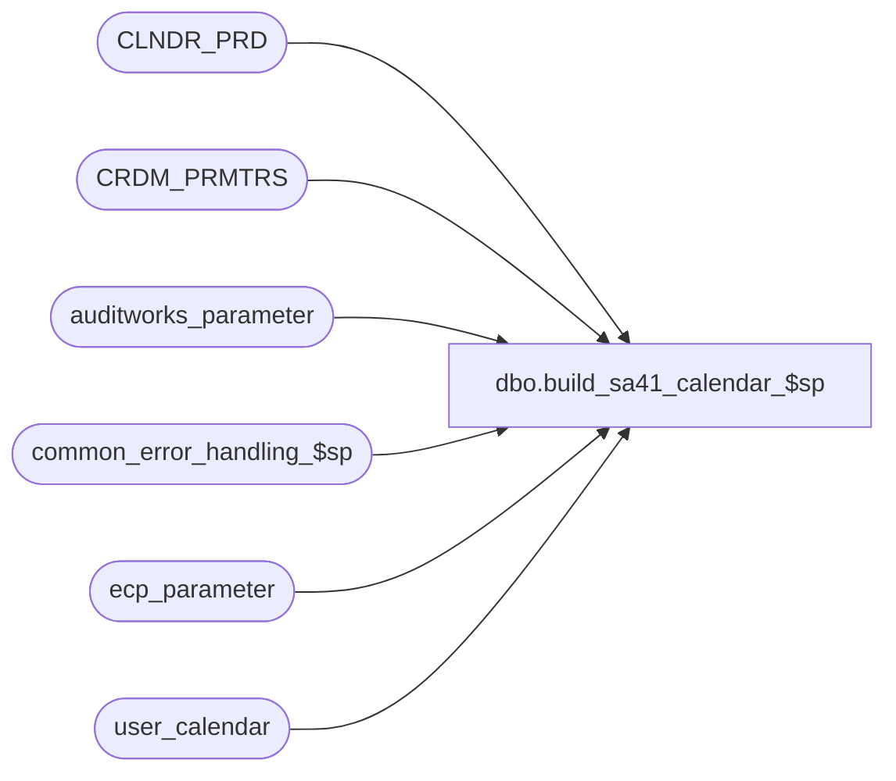

# dbo.build_sa41_calendar_$sp

**Database:** auditworks  
**Server:** bedrockdb01  

## Architecture Diagram



## Table Dependencies

| Referenced Table |
|---|
| CLNDR_PRD |
| CRDM_PRMTRS |
| auditworks_parameter |
| common_error_handling_$sp |
| ecp_parameter |
| user_calendar |

## Stored Procedure Code

```sql
create proc dbo.build_sa41_calendar_$sp AS
/* 
   Proc Name: build_sa41_calendar_$sp
   Desc     : For use by S/A 4.1 clients upgrading to S/A 5.0+ who will therefore lose their calendar table (given the switch to CRDM)
              but who have custom procs/reports/view still referencing the old calendar table that they wish to avoid having to update.
              This proc updates (recreates if absent) the old calendar table from the new CRDM CLNDR_PRD table.
              It requires that the relevant S/A and CRDM parameters related to calendars and caldendar levels be set prior to being run.
              If run in error prior to having set the CRMD calendar and/or parameter, the user_caldendar table may simply be truncated and this proc re-run again.
              The proc can be scheduled to run on an on-going basis.  It will add any missing dates to those already copied, or will simply exit if 
              no dates are missing.
              

HISTORY
Date     Name         Def# Desc
Aug03,15 Vicci  TFS-133395 Author.

*/

DECLARE @end_date   	smalldatetime,
 	@start_date 	smalldatetime,
	@first_date   	smalldatetime,
	@clndr_id	binary(16),
	@season_clndr_id binary(16),
	@lvl_month	binary(16),
	@lvl_season	binary(16),
	@lvl_week	binary(16),
	@lvl_year	binary(16),
 	@errno 		int,
 	@errmsg		nvarchar(2000),
 	@message_id	int,	
	@object_name	nvarchar(255),	
	@operation_name	nvarchar(100),
	@process_name	nvarchar(100),
	@errmsg2	nvarchar(2000);

SELECT @process_name = 'build_sa41_calendar_$sp',
       @message_id = 201068;

BEGIN TRY

SELECT @errmsg = ' Unable to select calendar id. ',
       @object_name = 'CRDM_PRMTRS',
       @operation_name = 'SELECT';
SELECT @clndr_id = PRMTR_VAL_BIN,
       @season_clndr_id = PRMTR_VAL_BIN
  FROM CRDM_PRMTRS
 WHERE PRMTR_NAME = 'GL_PSTNG_CLNDR_ID';

SELECT @errmsg = ' Unable to select month level type. ',
       @object_name = 'auditworks_parameter',
       @operation_name = 'SELECT';
SELECT @lvl_month = par_bin_value
  FROM auditworks_parameter
 WHERE par_name = 'clndr_lvl_month';

SELECT @errmsg = ' Unable to select season level type. ',
       @object_name = 'auditworks_parameter',
       @operation_name = 'SELECT';
SELECT @lvl_season = par_bin_value
  FROM auditworks_parameter
 WHERE par_name = 'clndr_lvl_season';

IF NOT EXISTS (SELECT 1 FROM CLNDR_PRD WHERE CLNDR_ID = @clndr_id AND CLNDR_LVL_TYPE_ID = @lvl_season)
BEGIN
  SELECT @errmsg = ' Unable to select season calendar id. ',
         @object_name = 'ecp_paraneter',
         @operation_name = 'SELECT';
  SELECT @season_clndr_id = par_bin_value
    FROM ecp_parameter
   WHERE par_name = 'ecp_dflt_clndr_id';
END;

SELECT @errmsg = ' Unable to select week level type. ',
       @object_name = 'auditworks_parameter',
       @operation_name = 'SELECT';
SELECT @lvl_week= par_bin_value
  FROM auditworks_parameter
 WHERE par_name = 'clndr_lvl_week';

SELECT @errmsg = ' Unable to select year level type. ',
       @object_name = 'auditworks_parameter',
       @operation_name = 'SELECT';
SELECT @lvl_year = par_bin_value
  FROM auditworks_parameter
 WHERE par_name = 'clndr_lvl_year';

SELECT @errmsg = ' Failed to create user_calendar table and index. ',
       @object_name = 'user_calendar',
       @operation_name = 'CREATE TABLE';
if not exists (select t.name
	       from sysobjects t
	       where t.type = 'U' and t.name = 'user_calendar')
BEGIN
  create table dbo.user_calendar (
  calendar_date smalldatetime not null,
  merchandise_week_no tinyint not null,
  merchandise_month_no tinyint not null,
  merchandise_year_no smallint not null,
  merchandise_season_no tinyint default 1 not null,
  week_end_flag char(1) null,
  month_end_flag char(1) null,
  year_end_flag char(1) null,
  timestamp timestamp null);
  
  exec sp_executesql N'create unique clustered index user_calendar_x0 on dbo.user_calendar(calendar_date)';
END

SELECT @errmsg = ' Failed to drop calendar view. ',
       @object_name = 'calendar',
       @operation_name = 'DROP VIEW';
if not exists (select name from dbo.sysobjects where name = 'calendar' and type = 'V')
BEGIN
  exec sp_executesql N'
create view dbo.calendar AS
SELECT  calendar_date,
	merchandise_week_no,
	merchandise_month_no,
	merchandise_year_no,
	merchandise_season_no,
	week_end_flag,
	month_end_flag,
	year_end_flag,
	timestamp
FROM user_calendar';
END;

SELECT @errmsg = ' Failed to determine dates to be added to user_calendar table. ',
       @object_name = 'user_calendar',
       @operation_name = 'SELECT';
SELECT @start_date = DATEADD(dd, 1, calendar_date)
  FROM user_calendar;
IF @start_date IS NOT NULL
BEGIN
  SELECT @end_date = MAX(DATEADD( dd, -1, CONVERT(SMALLDATETIME, CONVERT(nvarchar, END_DATE_TIME, 101)) ))
    FROM CLNDR_PRD
   WHERE CLNDR_ID = @clndr_id
     AND CLNDR_LVL_TYPE_ID = @lvl_month
     AND END_DATE_TIME > @start_date;
END;
ELSE   
BEGIN
  SELECT @start_date = MIN(STRT_DATE_TIME),
         @end_date = MAX(DATEADD( dd, -1, CONVERT(SMALLDATETIME, CONVERT(nvarchar, END_DATE_TIME, 101)) ))
    FROM CLNDR_PRD
   WHERE CLNDR_ID = @clndr_id
     AND CLNDR_LVL_TYPE_ID = @lvl_month;
END;

IF @end_date IS NULL
  RETURN;

BEGIN TRANSACTION 

SELECT @errmsg = ' Failed to populate user_calendar table with default values. ',
       @object_name = 'user_calendar',
       @operation_name = 'INSERT',
       @first_date = @start_date;
WHILE @start_date <= @end_date
BEGIN
  INSERT user_calendar (
        calendar_date,
         merchandise_week_no,
         merchandise_month_no, 
         merchandise_year_no,
         merchandise_season_no)
  VALUES (@start_date, datepart(dw, @start_date), datepart(mm, @start_date), datepart(yyyy, @start_date), 1);

  SELECT @start_date = DATEADD(dd,1,@start_date);
END; -- While

SELECT @errmsg = ' Failed to set user_calendar table month. ',
       @object_name = 'user_calendar',
       @operation_name = 'UPDATE';
UPDATE user_calendar
   SET merchandise_month_no = c.CLNDR_PRD_NUM,
       month_end_flag = CASE WHEN user_calendar.calendar_date = DATEADD( dd, -1, CONVERT(SMALLDATETIME, CONVERT(nvarchar, c.END_DATE_TIME, 101)) ) 
                        THEN 'M' ELSE NULL END
  FROM CLNDR_PRD c
 WHERE user_calendar.calendar_date >= @first_date
   AND c.CLNDR_ID = @clndr_id
   AND c.CLNDR_LVL_TYPE_ID = @lvl_month
   AND user_calendar.calendar_date >= c.STRT_DATE_TIME
   AND user_calendar.calendar_date < c.END_DATE_TIME;
   
SELECT @errmsg = ' Failed to set user_calendar table year. ',
       @object_name = 'user_calendar',
       @operation_name = 'UPDATE';
UPDATE user_calendar
   SET merchandise_year_no = c.CLNDR_PRD_NUM,
       year_end_flag = CASE WHEN user_calendar.calendar_date = DATEADD( dd, -1, CONVERT(SMALLDATETIME, CONVERT(nvarchar, c.END_DATE_TIME, 101)) ) 
                        THEN 'Y' ELSE NULL END
  FROM CLNDR_PRD c
 WHERE user_calendar.calendar_date >= @first_date
   AND c.CLNDR_ID = @clndr_id
   AND c.CLNDR_LVL_TYPE_ID = @lvl_year
   AND user_calendar.calendar_date >= c.STRT_DATE_TIME
   AND user_calendar.calendar_date < c.END_DATE_TIME;
  
SELECT @errmsg = ' Failed to set user_calendar table week. ',
       @object_name = 'user_calendar',
       @operation_name = 'UPDATE';
UPDATE user_calendar
   SET merchandise_week_no = c.CLNDR_PRD_NUM,
       week_end_flag = CASE WHEN user_calendar.calendar_date = DATEADD( dd, -1, CONVERT(SMALLDATETIME, CONVERT(nvarchar, c.END_DATE_TIME, 101)) ) 
                        THEN 'W' ELSE NULL END
  FROM CLNDR_PRD c
 WHERE user_calendar.calendar_date >= @first_date
   AND c.CLNDR_ID = @clndr_id
   AND c.CLNDR_LVL_TYPE_ID = @lvl_week
   AND user_calendar.calendar_date >= c.STRT_DATE_TIME
   AND user_calendar.calendar_date < c.END_DATE_TIME;
  
SELECT @errmsg = ' Failed to set user_calendar table season. ',
       @object_name = 'user_calendar',
       @operation_name = 'UPDATE';
UPDATE user_calendar
   SET merchandise_season_no = c.CLNDR_PRD_NUM
  FROM CLNDR_PRD c
 WHERE user_calendar.calendar_date >= @first_date
   AND c.CLNDR_ID = @season_clndr_id
   AND c.CLNDR_LVL_TYPE_ID = @lvl_season
   AND user_calendar.calendar_date >= c.STRT_DATE_TIME
   AND user_calendar.calendar_date < c.END_DATE_TIME;
  
COMMIT;

RETURN;
END TRY

BEGIN CATCH
  SELECT @errno = ERROR_NUMBER();
  IF @errmsg2 IS NULL
  BEGIN
    SELECT @errmsg2 = @process_name + ':  ' + COALESCE(@errmsg, '') + ' Line: ' + CONVERT(nvarchar, ERROR_LINE()) + ', ' + ERROR_MESSAGE();
  END;
  SELECT @errmsg = @errmsg2;  
  EXEC common_error_handling_$sp 4, @errno, @errmsg2, 0, @message_id, @process_name, @object_name, @operation_name, 1, 1
  
  RETURN;
END CATCH;
```

