# dbo.build_subledger_$sp

**Database:** auditworks  
**Server:** bedrockdb01  

## Architecture Diagram

```mermaid
flowchart LR
    SP["dbo.build_subledger_$sp"]
    CLNDR_PRD(["CLNDR_PRD"]) --> SP
    CRDM_PRMTRS(["CRDM_PRMTRS"]) --> SP
    ORG_CHN(["ORG_CHN"]) --> SP
    audit_status(["audit_status"]) --> SP
    auditworks_parameter(["auditworks_parameter"]) --> SP
    auditworks_system_flag(["auditworks_system_flag"]) --> SP
    authorization_detail(["authorization_detail"]) --> SP
    av_merchandise_detail(["av_merchandise_detail"]) --> SP
    av_return_detail(["av_return_detail"]) --> SP
    av_stock_control_detail(["av_stock_control_detail"]) --> SP
    av_tax_detail(["av_tax_detail"]) --> SP
    av_transaction_header(["av_transaction_header"]) --> SP
    av_transaction_line(["av_transaction_line"]) --> SP
    av_transaction_line_link(["av_transaction_line_link"]) --> SP
    check_abort_requested__sp(["check_abort_requested_$sp"]) --> SP
    code_description(["code_description"]) --> SP
    common_error_handling__sp(["common_error_handling_$sp"]) --> SP
    copy_dayend_summarized_data(["copy_dayend_summarized_data"]) --> SP
    create_gl_account_id__sp(["create_gl_account_id_$sp"]) --> SP
    dayend_workload(["dayend_workload"]) --> SP
    discount_detail(["discount_detail"]) --> SP
    dw_store_status(["dw_store_status"]) --> SP
    end_process_log__sp(["end_process_log_$sp"]) --> SP
    gl_account_cross_reference(["gl_account_cross_reference"]) --> SP
    interface_applicability(["interface_applicability"]) --> SP
    interface_directory(["interface_directory"]) --> SP
    issue_list(["issue_list"]) --> SP
    line_action(["line_action"]) --> SP
    line_object(["line_object"]) --> SP
    line_object_action_association(["line_object_action_association"]) --> SP
    media_parameter_rec_calc(["media_parameter_rec_calc"]) --> SP
    media_reconciliation_detail(["media_reconciliation_detail"]) --> SP
    media_reconciliation_status(["media_reconciliation_status"]) --> SP
    merchandise_detail(["merchandise_detail"]) --> SP
    process_error_log(["process_error_log"]) --> SP
    rebuild_request_detail(["rebuild_request_detail"]) --> SP
    return_detail(["return_detail"]) --> SP
    start_process_log__sp(["start_process_log_$sp"]) --> SP
    stock_control_detail(["stock_control_detail"]) --> SP
    store_audit_status(["store_audit_status"]) --> SP
    store_audit_status_deadlock(["store_audit_status_deadlock"]) --> SP
    subledger(["subledger"]) --> SP
    subledger_work_area(["subledger_work_area"]) --> SP
    tax_detail(["tax_detail"]) --> SP
    tax_level(["tax_level"]) --> SP
    transaction_category(["transaction_category"]) --> SP
    transaction_header(["transaction_header"]) --> SP
    transaction_line(["transaction_line"]) --> SP
    transaction_line_link(["transaction_line_link"]) --> SP
    update_process_step_log__sp(["update_process_step_log_$sp"]) --> SP
    update_subledger_work_area__sp(["update_subledger_work_area_$sp"]) --> SP
    w(["w"]) --> SP
    work_tax_exception_jur(["work_tax_exception_jur"]) --> SP
```



## Table Dependencies

| Referenced Table |
|---|
| CLNDR_PRD |
| CRDM_PRMTRS |
| ORG_CHN |
| audit_status |
| auditworks_parameter |
| auditworks_system_flag |
| authorization_detail |
| av_merchandise_detail |
| av_return_detail |
| av_stock_control_detail |
| av_tax_detail |
| av_transaction_header |
| av_transaction_line |
| av_transaction_line_link |
| check_abort_requested_$sp |
| code_description |
| common_error_handling_$sp |
| copy_dayend_summarized_data |
| create_gl_account_id_$sp |
| dayend_workload |
| discount_detail |
| dw_store_status |
| end_process_log_$sp |
| gl_account_cross_reference |
| interface_applicability |
| interface_directory |
| issue_list |
| line_action |
| line_object |
| line_object_action_association |
| media_parameter_rec_calc |
| media_reconciliation_detail |
| media_reconciliation_status |
| merchandise_detail |
| process_error_log |
| rebuild_request_detail |
| return_detail |
| start_process_log_$sp |
| stock_control_detail |
| store_audit_status |
| store_audit_status_deadlock |
| subledger |
| subledger_work_area |
| tax_detail |
| tax_level |
| transaction_category |
| transaction_header |
| transaction_line |
| transaction_line_link |
| update_process_step_log_$sp |
| update_subledger_work_area_$sp |
| w |
| work_tax_exception_jur |

## Stored Procedure Code

```sql
CREATE proc  [dbo].[build_subledger_$sp] (
  @process_id				binary(16),
  @truncate_flag 			tinyint = 0,
  @dayend_process_id 			tinyint = NULL,
  @errmsg 				nvarchar(2000) OUTPUT,
  @rebuild_flag 			tinyint = 0, /* 0= no rebuild, 2=Subledger Tax, 3=Subledger Media Rec */
  @excluded_dayend_from_time            int = 0,
  @excluded_dayend_to_time              int = 0
)

AS

/* Proc name:   build_subledger_$sp
** Description: Builds subledger table. If the GL account_no is not in the
** 		gl_account_cross_reference table, it calls
** 		create_gl_account_id_$sp to create gl_account_id for the G/L
** 		account no which in turn calls find_gl_account_segment_$sp
** 		to find each lookup segment type forming that GL account no.
** 		Called from day_end_posting_$sp.
**              In the case of rebuild it is Called from dayend_rebuild_$sp.
**              rebuild is just done for the tax stripping and not the taxability.

   Unicode version.
   
Please ensure that the proc script contains the following at the top in order to support scaleout:
SET ANSI_NULLS ON
SET ANSI_WARNINGS ON

HISTORY:
Date     Name          Def# Desc
Jun12,17 Kiri     DAOM-1428 Subledger Posting - Allow posting to Fulfillment Store. This is so that credit is given to the store that fulfilled the order as compensation for having staff fulfilling orders instead of selling.
Jun17,16 Vicci     DAOM-973 Recognize bank account number from Banking attachment and/or Media Reconciliation Status;
                            Recognize store number from Media Reconciliation Status (or max store of expected if not balancing by store) 
                            as originating_store_no.
                            Handle fund-tranfer properly when reconciling in foreign currency (don't double up expected transfer causing out of balance).
                            Simplify over/short logging in case of fund transfers to avoid imbalance between data-source categorization (just categorize whole db short, cr expected, db actual set as fund transfer).
                            Initialize @row_inserted, otherwise gl_account_id remains -1 in rebuild scenario.
Feb10,16 Vicci   TFS-156404 Log $0.00 tax lines if they have been used as the max_applied_by_line_id in tax_detail, otherwise the tax
                            amount associated with them in tax_detail doesn't get logged to subledger throwing it out of balance.
Jul21,15 Daphna	     131151 Expand the length of the column for tender total and amounts
Aug25,14 Paul     74509 use try .. catch to trap error 515, improve business rule abort message to also display in smartload log
Jun06,14 Phu      74509 Fix group by error.
Feb28,14 Vicci    61711 Support tax stripping from correct G/L account (split between merch and disc account instead of all under merch).
                        Relocate applied discount logging such that it is included in tax stripping handling.
                        Fixed column order in #reversal insert. Support markups on items with gross of $0.00.
Feb27,14 Vicci   150218 Post tax stripped to correct G/L account for tax-level when there is more than 1 tax level being stripped.
Jan17,14 Vicci   149346 Support new Transaction G/L Account return-from-store group lookup types 21, 22.
Jan17,14 Vicci   149341 Support new Transaction G/L Account Reference lookup type 17.
Jan02,14 Vicci   149121 Compensate for bug in new object/action TM by handling null G/L account segment lookup types as though they were set to 0.
Oct28,13 Vicci   147679 Resubmit 142002 handling of tax accounts by taxed object/action (bad version in 5.1).
Jul08,13 Vicci   139695 Add unit_of_measure logging.
Feb28,13 Vicci   142002 Handle tax G/L accounts by taxed line-object-action for transactions that are neither tax-exceptions nor tax-strips too.
Sep27,11 Vicci   129992 Handle G/L account segment lookups based on discounted/taxed line-object-action (type 6) having been configured
                        for the tax account to which stripped tax is posted.
Nov08,10 Vicci 1-4605IE Avoid subledger imbalance when configuration is incorrect (tax line object/action not set to 
                        feed Tax Tracking but G/L Account definition dependent on tax-jurisdiction lookup) for one but not 
                        all tax lines in a tax-exception transaction. 
Jun16,10 Vicci   102089 Log invalid account postings to dayend issue list.
May25,10 Vicci   117359 Recognize dw_store_status.store_status of 3 since some clients have daily G/L exports.
			Also, since work_dayend_workload is not shared by the streams (each has its own copy) just truncate it.
Mar16,10 Vicci   116604 Recognize originating store from stock_control_detail where display_def_id = 31 (i.e. C/L) to support orders fulfilled from elsewhere.
Mar08,10 Phu     116455 Remove @posting_date.
Feb05,10 Paul    115308 improve performance by avoiding update when m.originating_store_no is null.
Sep14,09 Vicci   112664 Don't populate copy list unless on peripheral in scaleout environment and mark subledger as being available on consolidated if in non-scaleout environment.
Jun10,08 Vicci   101970 Uplift 101944. Use appropriate line-action when stripping tax from such amounts as orders, rentals, etc.
Jun03,08 Vicci   101851 Uplift 101672. Support media reconciliation processing_option = 1 i.e. fund transfer with no reconciliation.
May06,08 Phu     101035 Fix tax amount nearly doubled when there are 2 tax lines associated with GL account lookup by tax jurisdiction.
Apr25,08 Phu      88641 Fix the integrity check for media rec out of balance even though subledger is in balance.
Oct08,07 Phu      93464 Apply 93250 to SA5. Correct subledger out of balance due to GL account lookup by tax jurisdiction. Redo 82116.
Apr18,07 Paul   DV-1356 uplift 82116 to SA5
Dec18,06 Paul   DV-1347 Log config issues to dayend issue list.
Nov22,06 Paul     74790 read CRDM_PRMTRS to get CLNDR_ID, removed old defect number comments, made group by match select
Oct25,06 Phu 77931 Fix outer join for SQL 2005 Mode 90.
Oct19,06 Tim    DV-1346 apply 73379 to SA5
Aug10,06 Tim 69753 refix DV-1339
Jun15,06 Tim    DV-1339 apply 72638 to SA5, corrected join to ORG_CHN
Mar16,06 Paul   DV-1331 apply 63388 to SA5
Sep26,05 Paul     60471 apply 60260 to SA5
Jul04,05 Paul   DV-1239 use tran_id_datatype
Apr27,05 Maryam DV-1202 Handle the indirect association via line links.
	 Sab		Scaleout changes for rebuild_request data. Added join to dw_store_status.
Oct25,04 David  DV-1159 Use clndr_prd_num instead of clndr_prd_name. 
Aug05,04 Sab	DV-1071 Changes required for bank tables.
         David          Use ORG_CHN table as the new Store table, Remove user_name, Use new Calendar table.
         Maryam         Receive @process_id and @user_name and pass it to the check_abort_requested_$sp
Apr16,04 Sab	DV-1068 Remove old media rec code
Feb15.07 Daphna   82116 when Tax Jurisdiction Lookup, ensure tax lines are broken out by jurisdiction (from tax_detail)
                        support 2 levels of tax on an item (one of which is 0) with tax stripping 
Jun12,06 Vicci    73379 Support G/L account segment lookup type 15 (by employee purchase flag)
May24,06 Vicci    72638 Fix subledger imbalance issue caused by 63388 whereby half the fund transfer
                        entry was being doubled counted for tender which had counts.
Dec07,05 Shapoor  63388 Subledger posting only posted lines where the gross_line_amount <> 0. 
			Modified the posting to include rows where db_cr_none != 0 AND (gross_line_amount != 0 OR units != 0)
Sep09,05 Vicci	  60260 Handle absent media-rec-not-convert and set different data source for fund transfers
Feb04,05 Shapoor  47775 rebuild_request_detail table was not getting cleaned out even though the rebuild
			posts the info. to subledger for @rebuild_flag = 3
Jan25,05 Vicci	  47390 Set process for Media Rec rebuild to 163 to distinguish it from Tax rebuild
Apr07,04 Phu      26939 Amounts are not reversed when rebuilding tax
Mar17,04 Daphna   22989 Set tax jurisdiction for discount details and media rec
Mar15,04 Daphna   25538 post discount detail on return to originating store
Feb12,04 Winnie   23457 correctly clean up temp table when rebuild_flag > 0, 
                        check if in rollout mode, if the S/R/D is using old media rec, then call the old logic.
                   add nolock and cursor hints (Paul)
Sep18,03 Maryam   13686 Pass two new parameters for excluded dayend time and call check_abort_requested_$sp
                        to check whether abort has been requested either by the system or user.
                        Add logic to log missing line_object_action to process_error_log.
May30,03 Winnie	   9250	Media Reconciliation enhancements.
Dec19,02 Phu       5327 Retrieve tax expected instead of tax collected from tax_detail
Dec06,02 Maryam 1-H56TW avoid raise error on business rule warning message, corrected error logic
Oct29,02 Winnie 1-G8VHB Remove register_detail_in_subledger from auditworks_parameter when it is not used.
Jun03,02 Winnie 1-CD0IX standardize R3.5 error handling.
May08,02 Winnie	1-C2Q5L Add abort logic to dayend.
Apr25,02 Phu    1-C9P5S	Pre audit tax: retrieve tax from tax_detail.
Apr24,02 Phu    1-CTDHQ Fix error: duplicate key/unique constraint in insert gl_account_lookup
Jan17,02 Vicci  1-A62UX	Correct conversion to domestic calculation for foreign over/shorts.
Nov30,01 Phu       8931  Progress monitor and error handling
Jun11,01 ShuZ      8032  Transaction attribution to originating store
May16,01 Maryam    7444 Add rebuild_flag indicating whether is called by the dayend_rebuild_$sp
                        or by the Dayend tax posting. In the case of rebuild poppulate the 
                        work tables from archive and insert reversal into subledger etc
Apr04,01 David M   7558 Improve performance.  Continue processing rest of the stores even if you 
			get a duplicate on insert error when trying to INSERT into subledger table.
Apr03,01 Maryam 7542 Drop temp tables inside the cursor.Change the ELSE TO ESLE IF @tax_level_count = 1.
Feb07,01 Maryam    7281 Modify to use taxability as a criteria for building the G/L account if 
                        required. Also modified to post an entry deducting av_tax_detail 
               tax_amount_expected from merchandise/fee/expense amounts when tax_stripping 
    is turned on and to post the offset for the amount deducted to the G/L account
                 associated in the line_object_action_association table with line_object for
         tax_level in question.
Jan30,00 Maryam    7255 Improved performance by defining new variables and as a result avoiding
                        unnecessary updates.
Sep18,00 Maryam    6725 Changed the dayend order.(Tax will be posted prior to subledger).
Sep12,00 Shapoor   6663 Facilitate Multi Stream Dayend.
Aug25,00 Phu       6644	Correct MS SQL bug where float negative times zero is not equal to zero
Jul04,00 Maryam  5696 If original store is undefined, then set it to current store no.
May25,00 John G    5864 Change '= NULL' to 'IS NULL' where applicable to mirror Oracle.
Mar01,00 Phu      5900 Change @@fetch_status > 0 to @@fetch_status <> 0 for MS SQL compatibility
Feb02,00 Phu       5896 Includes exchange rate in media counted/overshort calculation
Dec08,99 Phu       5658 Includes register_no in subledger
Nov17,97 Paul
         Phu      author

*/

DECLARE
	@card_type_determinator         tinyint,
	@class_code_determinator 	tinyint,
	@tax_class_code_determinator    tinyint,
	@cursor_open 			tinyint,
	@date_reject_id 		tinyint,
	@do_breakout			tinyint,
	@errmsg2			nvarchar(2000),
	@errline			int,
	@errno 				int,
	@errnum 			int,
	@gl_company 			int,
	@instance_id			int,
	@line_object			smallint,
	@line_action			tinyint,
	@merchandise_year_no 		smallint,
	@merchandise_month_no 		tinyint,
	@message_id			int,
	@object_name			nvarchar(255),
	@operation_name			nvarchar(100),
	@posting_datetime		datetime,
	@posting_status 		tinyint,
	@process_log_entry 		tinyint,
	@process_name			nvarchar(100),
	@process_no 			smallint,
	@process_timestamp 		float,
	@register_detail_in_subledger 	tinyint,
	@return_from_store 		int,
	@ret_from_store_determinator 	tinyint,
	@rows				int,
	@row_inserted 			int,
	@row_updated 			int,
	@store_balance_group		tinyint,
	@sales_date 			smalldatetime,
	@store_audit_status 		smallint,
	@store_deposit_destination 	smallint,
	@store_no 			int,
	@subledger_flag 		tinyint,
	@tax_jurisdiction 		nchar(5),
	@tax_jurisdiction_determinator  tinyint,
	@taxability_determinator        tinyint,
	@tax_strip_flag			tinyint,
	@tax_level_count		int,
	@transaction_category		tinyint,
	@transaction_count 		numeric(12,0),
	@update_in_progress 		smallint,
	@abort_flag			tinyint,
	@memo1				nvarchar(50),
         @memo2				nvarchar(50),
	@memo3				nvarchar(50),
	@memo_date			smalldatetime,        
        @media_rec_present		int,
        @trans_line_total		money,
       	@clndr_id			binary(16),
	@lvl_year			binary(16),
	@lvl_month			binary(16),
	@tax_based_on_if_applicability	tinyint,
	@taxed_objact_determinator	tinyint,
	@gl_account_ref_determinator    tinyint,
	@config_issue_found		tinyint;

SELECT 	@message_id = 201068,
	@process_name = 'build_subledger_$sp',
	@abort_flag = 0,
	@process_log_entry = 0,
	@process_no = 20,
	@process_timestamp = 0,
	@transaction_count = 0,
	@config_issue_found = 0,
	@row_inserted = 0;

BEGIN TRY

IF @dayend_process_id IS NULL --
 RETURN;

SET ANSI_NULLS ON;
SET ANSI_WARNINGS ON;

    SELECT @errmsg = 'Failed to select instance_id from auditworks_system_flag',
           @object_name = 'auditworks_system_flag',
           @operation_name = 'SELECT';

SELECT @instance_id = CONVERT(int,flag_numeric_value)
  FROM auditworks_system_flag
 WHERE flag_name = 'instance_id';

SELECT @rows = @@rowcount;
IF @rows = 0
    GOTO business_error;

IF @rebuild_flag = 0
BEGIN
  IF (SELECT COUNT (store_no)
        FROM dayend_workload WITH (NOLOCK)
       WHERE dayend_process_id = @dayend_process_id
         AND store_audit_status = 320) = 0
      RETURN;
  SELECT @process_no = 20;
END
ELSE 
 BEGIN
  IF @rebuild_flag = 2
    SELECT @process_no = 162;    
  ELSE
  BEGIN
    IF @rebuild_flag = 3
      SELECT @process_no = 163;    
    ELSE
     SELECT  @process_no = 160;    
  END;
 END;

SELECT
	@card_type_determinator = 0,
	@class_code_determinator = 0,
	@tax_class_code_determinator = 0, 
	@cursor_open = 0,
	@posting_status = 0,
	@ret_from_store_determinator = 0,
	@tax_jurisdiction_determinator = 0,
	@taxability_determinator = 0,
	@tax_level_count = 0,
	@update_in_progress = 20,
	@taxed_objact_determinator = 0,
	@do_breakout = 0,
	@gl_account_ref_determinator = 0;

    SELECT @errmsg = 'Unable to select register_detail_in_subledger from auditworks_parameter',
	   @object_name = 'auditworks_parameter';	
SELECT @register_detail_in_subledger = SIGN(ABS(CONVERT (tinyint, par_value)))
  FROM auditworks_parameter
 WHERE par_name = 'register_detail_in_subledger';

IF @register_detail_in_subledger IS NULL --
  SELECT @register_detail_in_subledger = 0;

  SELECT @errmsg = 'Unable to select interface_id = 19 from interface_directory',
	 @object_name = 'interface_directory';
SELECT @subledger_flag = update_timing
  FROM interface_directory
 WHERE interface_id = 19;

  SELECT @errmsg = 'Unable to determine whether tax tracking is set up to be based on interface applicability',
	 @object_name = 'interface_directory';
SELECT @tax_based_on_if_applicability = 1 - SIGN(applicability_method)
  FROM interface_directory
 WHERE interface_id = 12;

IF ISNULL(@subledger_flag,0) != 3 AND @rebuild_flag = 0
  BEGIN
    BEGIN TRAN
	   SELECT @errmsg = 'Unable to update store_audit_status_deadlock',
		  @object_name = 'store_audit_status_deadlock',
		       @operation_name = 'UPDATE';
	UPDATE store_audit_status_deadlock
	SET function_no = 18,
		status_date = getdate();

	  SELECT @errmsg = 'Unable to set audit_status to 305 from 320',
		       @object_name = 'audit_status',
		       @operation_name = 'UPDATE';
	UPDATE audit_status
	  SET audit_status = 305
	  FROM audit_status a, dayend_workload d WITH (NOLOCK)
	 WHERE d.dayend_process_id = @dayend_process_id
	   AND d.store_audit_status = 320
	   AND d.store_no = a.store_no
	   AND d.sales_date = a.sales_date
	   AND d.date_reject_id = a.date_reject_id
	   AND d.store_audit_status = a.audit_status;


	  SELECT @errmsg = 'Unable to set store_audit_status to 305 from 320',
		       @object_name = 'store_audit_status',
		       @operation_name = 'UPDATE';
	UPDATE store_audit_status
	  SET store_audit_status = 305,
	    update_in_progress = 0
	  FROM store_audit_status s, dayend_workload d WITH (NOLOCK)
	 WHERE d.dayend_process_id = @dayend_process_id
	   AND d.store_audit_status = 320
	   AND d.store_no = s.store_no
	   AND d.sales_date = s.sales_date
	   AND d.date_reject_id = s.date_reject_id
	   AND d.store_audit_status = s.store_audit_status;

	  SELECT @errmsg = 'Unable to set store_audit_status to 305 from 320 in dayend_workload',
		       @object_name = 'dayend_workload';
	UPDATE dayend_workload
	  SET store_audit_status = 305
	 WHERE dayend_process_id = @dayend_process_id
	   AND store_audit_status = 320;

    COMMIT TRAN;
    RETURN;
  END; -- If ISNULL(@subledger_flag,0) != 3


SELECT @errmsg = 'Unable to create temp table #sub_trans_line',
	   @object_name = '#sub_trans_line',
	   @operation_name = 'CREATE';

CREATE TABLE #sub_trans_line (
	transaction_id 			numeric(14,0) 	not null, -- tran_id_datatype
	line_id 			numeric(5,0) 	not null,
	store_no 			int 		not null,
	register_no 			smallint 	not null,
	transaction_category 		tinyint 	not null,
	line_object 			smallint 	not null,
	line_action 			tinyint 	not null,
	class_code 			int 		not null,
	tax_jurisdiction 		nchar(5) 	not null,
	store_deposit_destination 	smallint 	not null,
	discounted_line_object 		int 		not null,
	return_from_store 		int 		not null,
	card_type 			nchar(1) 	not null,
	transaction_date 		smalldatetime 	not null,
	store_balance_group 		tinyint 	not null,
	merchandise_year_no 		smallint 	not null,
	merchandise_month_no 		tinyint 	not null,
	gl_company 			int 		not null,
	units 				real 		not null,
	amount 				money 		not null,
	taxable_amount			money		not null,
	tax_amount			money		not null,
	db_cr_none			smallint	not null,
	tax_level			tinyint		not null,
	originating_store_no            int             null,
	balancing_entity_id		numeric(10,0) 	null,
	empl_purch_flag			tinyint		null,
	unit_of_measure			smallint	null,
	gl_account_reference		nvarchar(20)    null,
	applied_by_line_id		numeric(5,0)    null,   --61711  only set for applied discounts
	applied_to_db_cr_none		smallint	null);   --61711  only set for applied discounts

  SELECT @errmsg = 'Unable to create temp table #store_date',
	   @object_name = '#store_date';
CREATE TABLE #store_date (
	store_no 			int 		not null,
	sales_date 			smalldatetime 	not null,
	date_reject_id 			tinyint 	not null,
	store_audit_status 		smallint 	not null,
	merchandise_year_no 		smallint 	not null,
	merchandise_month_no 		tinyint 	not null,
	gl_company 			int 		not null,
	tax_jurisdiction 		nchar(5) 	not null,
	store_deposit_destination 	smallint 	not null,
	tax_strip_flag			smallint	not null);

  SELECT @errmsg = 'Unable to create temp table #tax_level',
	   @object_name = '#tax_level';
CREATE TABLE #tax_level (
	tax_level			tinyint		not null,
	line_object 			smallint 	not null);

  SELECT @errmsg = 'Unable to create temp table #tax_detail',
	   @object_name = '#tax_detail';
CREATE TABLE #tax_detail (
	transaction_id 			numeric(14,0) 	not null, -- tran_id_datatype
	line_id 			numeric(5,0) 	not null,
	max_taxable_amount		money		not null,
	sum_tax_amount			money		not null,
	tax_level			tinyint		not null,
	applied_by_line_id              numeric(5,0)    null)      --61711  only set for applied discounts

  SELECT @errmsg = 'Unable to select from line_object_action_association.',
	   @object_name = 'line_object_action_association',
	   @operation_name = 'SELECT';
SELECT @class_code_determinator =
                    1 - MIN( ABS( SIGN(COALESCE(lookup_segment1, 0) - 5) * SIGN(COALESCE(lookup_segment2, 0) - 5)*
                                  SIGN(COALESCE(lookup_segment3, 0) - 5) * SIGN(COALESCE(lookup_segment4, 0) - 5)*
                                  SIGN(COALESCE(lookup_segment5, 0) - 5) * SIGN(COALESCE(lookup_segment6, 0) - 5)*
                                  SIGN(COALESCE(lookup_segment7, 0) - 5) * SIGN(COALESCE(lookup_segment8, 0) - 5)*
                                  SIGN(COALESCE(lookup_segment1, 0) - 7) * SIGN(COALESCE(lookup_segment2, 0) - 7)*
                                  SIGN(COALESCE(lookup_segment3, 0) - 7) * SIGN(COALESCE(lookup_segment4, 0) - 7)*
                                  SIGN(COALESCE(lookup_segment5, 0) - 7) * SIGN(COALESCE(lookup_segment6, 0) - 7)*
                                  SIGN(COALESCE(lookup_segment7, 0) - 7) * SIGN(COALESCE(lookup_segment8, 0) - 7) ) ),                                  
       @ret_from_store_determinator = MAX(CASE WHEN lookup_segment1 IN (10, 21, 22) OR lookup_segment2 IN (10, 21, 22) OR lookup_segment3 IN (10, 21, 22) OR lookup_segment4 IN (10, 21, 22)
                                                 OR lookup_segment5 IN (10, 21, 22) OR lookup_segment6 IN (10, 21, 22) OR lookup_segment7 IN (10, 21, 22) OR lookup_segment8 IN (10, 21, 22)
                                               THEN 1
                                               ELSE 0 END), 
       @card_type_determinator = 
                    1 - MIN( ABS( SIGN(COALESCE(lookup_segment1, 0) - 11) * SIGN(COALESCE(lookup_segment2, 0) - 11)*
                                  SIGN(COALESCE(lookup_segment3, 0) - 11) * SIGN(COALESCE(lookup_segment4, 0) - 11)*
                                  SIGN(COALESCE(lookup_segment5, 0) - 11) * SIGN(COALESCE(lookup_segment6, 0) - 11)*
                                  SIGN(COALESCE(lookup_segment7, 0) - 11) * SIGN(COALESCE(lookup_segment8, 0) - 11) ) ),
                                   
       @tax_jurisdiction_determinator = 
                    1 - MIN( ABS( SIGN(COALESCE(lookup_segment1, 0) - 8) * SIGN(COALESCE(lookup_segment2, 0) - 8)*
                           SIGN(COALESCE(lookup_segment3, 0) - 8) * SIGN(COALESCE(lookup_segment4, 0) - 8)*
    SIGN(COALESCE(lookup_segment5, 0) - 8) * SIGN(COALESCE(lookup_segment6, 0) - 8)*
           SIGN(COALESCE(lookup_segment7, 0) - 8) * SIGN(COALESCE(lookup_segment8, 0) - 8) ) ),
       
       @taxability_determinator = 
                    1 - MIN( ABS( SIGN(COALESCE(lookup_segment1, 0) - 12) * SIGN(COALESCE(lookup_segment2, 0) - 12)*
                                  SIGN(COALESCE(lookup_segment3, 0) - 12) * SIGN(COALESCE(lookup_segment4, 0) - 12)*
                                  SIGN(COALESCE(lookup_segment5, 0) - 12) * SIGN(COALESCE(lookup_segment6, 0) - 12)*
                                  SIGN(COALESCE(lookup_segment7, 0) - 12) * SIGN(COALESCE(lookup_segment8, 0) - 12) ) ),
       @taxed_objact_determinator = 
                    1 - MIN( CASE WHEN line_object_type = 5 THEN
                             ABS( SIGN(COALESCE(lookup_segment1, 0) - 16) * SIGN(COALESCE(lookup_segment2, 0) - 16)*
                                  SIGN(COALESCE(lookup_segment3, 0) - 16) * SIGN(COALESCE(lookup_segment4, 0) - 16)*
                                  SIGN(COALESCE(lookup_segment5, 0) - 16) * SIGN(COALESCE(lookup_segment6, 0) - 16)*
                                  SIGN(COALESCE(lookup_segment7, 0) - 16) * SIGN(COALESCE(lookup_segment8, 0) - 16) ) 
                             ELSE 1 END),
       @gl_account_ref_determinator = MAX(CASE WHEN lookup_segment1 = 17 OR lookup_segment2 = 17 OR lookup_segment3 = 17 OR lookup_segment4 = 17
                                                 OR lookup_segment5 = 17 OR lookup_segment6 = 17 OR lookup_segment7 = 17 OR lookup_segment8 = 17
                                               THEN 1
                                               ELSE 0 END),
       @tax_class_code_determinator = MAX(CASE WHEN line_object_type = 5 AND 
                                                        (lookup_segment1 in (5, 7) OR lookup_segment2 in (5, 7) OR lookup_segment3 in (5, 7) 
                                                         OR lookup_segment4 in (5, 7) OR lookup_segment5 in (5, 7) OR lookup_segment6 in (5, 7) 
  OR lookup_segment7 in (5, 7) OR lookup_segment8 in (5, 7))
                                               THEN 1
                                               ELSE 0 END)
  FROM line_object_action_association WITH (NOLOCK);

IF @rebuild_flag = 0 
  BEGIN
   SELECT @errmsg = 'Failed to insert into table #store_date',
	       @object_name = '#store_date',
	       @operation_name = 'INSERT';
    INSERT #store_date (
  	   store_no,
	   sales_date,
	   date_reject_id,
	   store_audit_status,
	   merchandise_year_no,
	   merchandise_month_no,
	   gl_company,
	   tax_jurisdiction,
	   store_deposit_destination,
	   tax_strip_flag)
    SELECT
	   store_no,
	   sales_date,
	   date_reject_id,
	   store_audit_status,
	   merchandise_year_no,
	   merchandise_month_no,
	   gl_company,
	   tax_jurisdiction,
	   store_deposit_destination,
	   tax_strip_flag
      FROM 
           dayend_workload WITH (NOLOCK)
     WHERE dayend_process_id = @dayend_process_id
       AND store_audit_status = 320;
  END; 
ELSE
  BEGIN
      SELECT @errmsg = 'Unable to select calendar id',
             @object_name = 'CRDM_PRMTRS',
             @operation_name = 'SELECT';
    SELECT @clndr_id = PRMTR_VAL_BIN
      FROM CRDM_PRMTRS
     WHERE PRMTR_NAME = 'GL_PSTNG_CLNDR_ID';
    SELECT @rows = @@rowcount;
    IF @rows = 0
      BEGIN
       SELECT @errno = 201612;
       GOTO business_error;
      END;

      SELECT @errmsg = 'Unable to select year level id',
		       @object_name = 'auditworks_parameter';
    SELECT @lvl_year = par_bin_value
      FROM auditworks_parameter
     WHERE par_name = 'clndr_lvl_year';

      SELECT @errmsg = 'Unable to select month level id',
		       @object_name = 'auditworks_parameter';
    SELECT @lvl_month = par_bin_value
      FROM auditworks_parameter
     WHERE par_name = 'clndr_lvl_month';

      SELECT @errmsg = 'Unable to insert into table #request_store_date',
	       @object_name = '#request_store_date',
	       @operation_name = 'INSERT';
    SELECT request_id,
           r.store_no,
           r.transaction_date, 
           c1.CLNDR_PRD_NUM as merchandise_year_no,
           c2.CLNDR_PRD_NUM as merchandise_month_no
      INTO #request_store_date
      FROM rebuild_request_detail r WITH (NOLOCK), CLNDR_PRD c1, CLNDR_PRD c2, dw_store_status ds
     WHERE rebuild_type = @rebuild_flag
       AND request_status = 10
       AND c1.CLNDR_ID = @clndr_id
       AND c1.CLNDR_LVL_TYPE_ID = @lvl_year
       AND transaction_date BETWEEN c1.STRT_DATE_TIME AND DATEADD (ss,-1,c1.END_DATE_TIME)
       AND c2.CLNDR_ID = @clndr_id
       AND c2.CLNDR_LVL_TYPE_ID = @lvl_month
       AND transaction_date BETWEEN c2.STRT_DATE_TIME AND DATEADD (ss,-1,c2.END_DATE_TIME)
       AND r.store_no = ds.store_no
       AND r.transaction_date = ds.sales_date
       AND ds.store_status >= 2
       AND instance_id = @instance_id;
      
    SELECT @rows = @@rowcount; -- will be a small table
    
    IF @rows = 0
      RETURN;  

       SELECT @errmsg = 'Unable to insert #store_date (rebuild).',
	       @object_name = '#store_date',
	       @operation_name = 'INSERT';
    INSERT #store_date (
  	   store_no,
	   sales_date,
	   date_reject_id,
	   store_audit_status,
	   merchandise_year_no,
	   merchandise_month_no,
	   gl_company,
	   tax_jurisdiction,
	  store_deposit_destination,
	   tax_strip_flag)
    SELECT DISTINCT
	   rs.store_no,
	   rs.transaction_date,
	   s.date_reject_id,
	   s.store_audit_status,
	   rs.merchandise_year_no,
	   rs.merchandise_month_no,
	   sa.GL_CMPNY_NUM,
	   sa.TAX_JRSDCTN_CODE,
	   PRMRY_BANK_ACNT_ID,
	   1
     FROM #request_store_date rs WITH (NOLOCK), 
           ORG_CHN sa WITH (NOLOCK),
           store_audit_status s WITH (NOLOCK)
     WHERE rs.store_no = sa.ORG_CHN_NUM
       AND rs.store_no = s.store_no
       AND rs.transaction_date = s.sales_date
       AND s.date_reject_id = 0
       AND s.archived_flag = 1;

    SELECT @rows = @@rowcount;
    IF @rows = 0
      BEGIN
            SELECT @errmsg = 'Failed to set request_status to 30 in rebuild_request_detail.',
		   @object_name = 'rebuild_request_detail',
		   @operation_name = 'UPDATE';
	UPDATE rebuild_request_detail
           SET request_status = 30
          FROM #request_store_date r, rebuild_request_detail rd
         WHERE r.store_no = rd.store_no
           AND r.transaction_date = rd.transaction_date
	   AND rd.rebuild_type = @rebuild_flag;

	    SELECT @errmsg = 'Failed to drop table #request_store_date.',
		   @object_name = '#request_store_date',
		   @operation_name = 'DROP';
        DROP TABLE #request_store_date;

          SELECT @errmsg = 'Failed to drop table #store_date.',
		   @object_name = '#store_date';
        DROP TABLE #store_date;
 
        RETURN;
      END;         
  END; -- If @rebuild_flag > 0   

	SELECT @errmsg = 'Unable to declare cursor store_status_crsr',
	       @object_name = 'store_status_crsr',
	       @operation_name = 'OPEN';
DECLARE store_status_crsr CURSOR FAST_FORWARD
FOR
SELECT
	store_no,
	sales_date,
	date_reject_id,
	store_audit_status,
	merchandise_year_no,
	merchandise_month_no,
	gl_company,
	tax_jurisdiction,
	store_deposit_destination,
	tax_strip_flag
  FROM #store_date WITH (NOLOCK)
ORDER BY sales_date, store_no;

OPEN store_status_crsr;
SELECT @cursor_open = 1;

WHILE 1 = 1
BEGIN
  FETCH store_status_crsr INTO
        @store_no,
	@sales_date,
	@date_reject_id,
	@store_audit_status,
	@merchandise_year_no,
	@merchandise_month_no,
	@gl_company,
	@tax_jurisdiction,
	@store_deposit_destination,
	@tax_strip_flag;

  IF @@fetch_status <> 0
    BREAK;
    
  SELECT @tax_level_count = 0,
       @errmsg = ISNULL(@errmsg, 'Failed to execute stored procedure check_abort_requested_$sp'),
       @object_name = 'check_abort_requested_$sp',
       @operation_name = 'EXECUTE';    
  EXEC check_abort_requested_$sp @dayend_process_id, @process_id, @process_no,
                       @excluded_dayend_from_time, @excluded_dayend_to_time, @errmsg OUTPUT;
 
  IF @process_log_entry = 0
    BEGIN
	  SELECT @errmsg = ISNULL(@errmsg, ' Unable to execute start_process_log_$sp'),
		 @object_name = 'start_process_log_$sp',
		 @operation_name = 'EXECUTE';
      EXEC start_process_log_$sp @process_no, @process_timestamp OUTPUT, @errmsg OUTPUT,
                                 @dayend_process_id;
      SELECT @process_log_entry = 1;
    END;

  /* Build subledger for transaction_lines */
  IF @truncate_flag = 1
    BEGIN
     SELECT @errmsg = 'Unable to truncate table subledger_work_area',
		 @object_name = 'subledger_work_area',
		 @operation_name = 'TRUNCATE';
     TRUNCATE TABLE subledger_work_area;
    END;
  ELSE
    BEGIN
 	  SELECT @errmsg = 'Unable to delete (initialize) table subledger_work_area',
		 @object_name = 'subledger_work_area',
		 @operation_name = 'DELETE';
      DELETE subledger_work_area;
    END;

  IF @rebuild_flag = 0 
  BEGIN     	 
	  SELECT @errmsg = 'Unable to insert #sub_trans_line at trans_line phase',
		 @object_name = '#sub_trans_line',
		 @operation_name = 'INSERT';
      INSERT #sub_trans_line (
             transaction_id,
	     line_id,
	     store_no,
	     register_no,
	     transaction_category,
	     line_object,
	     line_action,
	     class_code,
	     tax_jurisdiction,
	     store_deposit_destination,
	     discounted_line_object,
	     return_from_store,
	     card_type,
	     transaction_date,
	     store_balance_group,
	     merchandise_year_no,
	     merchandise_month_no,
	     gl_company,
	     units,
	     amount,
	     taxable_amount,
	     tax_amount,
	     db_cr_none,
	     tax_level,
	     originating_store_no,
	     empl_purch_flag,
	     unit_of_measure,
	     gl_account_reference) 
       SELECT 
	     l.transaction_id,
	     l.line_id,
	     -- h.store_no,
	     -- store_no when EOM
	     CASE WHEN l.line_action = 99 THEN
			CASE WHEN ((1 - ( ABS( SIGN(COALESCE(lookup_segment1, 0) - 26) * SIGN(COALESCE(lookup_segment2, 0) - 26)*
                    SIGN(COALESCE(lookup_segment3, 0) - 26) * SIGN(COALESCE(lookup_segment4, 0) - 26)*
                    SIGN(COALESCE(lookup_segment5, 0) - 26) * SIGN(COALESCE(lookup_segment6, 0) - 26)*
                    SIGN(COALESCE(lookup_segment7, 0) - 26) * SIGN(COALESCE(lookup_segment8, 0) - 26) ))) = 1)
                    THEN   COALESCE(sd.originating_store_no, m.originating_store_no, m.source_store_no, h.store_no)
				WHEN ((1 - ( ABS( SIGN(COALESCE(lookup_segment1, 0) - 27) * SIGN(COALESCE(lookup_segment2, 0) - 27)*
                    SIGN(COALESCE(lookup_segment3, 0) - 27) * SIGN(COALESCE(lookup_segment4, 0) - 27)*
                    SIGN(COALESCE(lookup_segment5, 0) - 27) * SIGN(COALESCE(lookup_segment6, 0) - 27)*
                    SIGN(COALESCE(lookup_segment7, 0) - 27) * SIGN(COALESCE(lookup_segment8, 0) - 27) ))) = 1) AND
                    ISNULL(sd.store_on_file_flag, 0) = 1
                    THEN COALESCE(sd.location_no, sd.originating_store_no, m.originating_store_no, m.source_store_no, h.store_no)
				WHEN ((1 - ( ABS( SIGN(COALESCE(lookup_segment1, 0) - 27) * SIGN(COALESCE(lookup_segment2, 0) - 27)*
                    SIGN(COALESCE(lookup_segment3, 0) - 27) * SIGN(COALESCE(lookup_segment4, 0) - 27)*
                    SIGN(COALESCE(lookup_segment5, 0) - 27) * SIGN(COALESCE(lookup_segment6, 0) - 27)*
                    SIGN(COALESCE(lookup_segment7, 0) - 27) * SIGN(COALESCE(lookup_segment8, 0) - 27) ))) = 1) AND
                    ISNULL(sd.store_on_file_flag, 0) = 0
				THEN COALESCE(sd.originating_store_no, m.originating_store_no, m.source_store_no, h.store_no)
			  ELSE 
				h.store_no
			  END
            ELSE
              CASE WHEN ((1 - ( ABS( SIGN(COALESCE(lookup_segment1, 0) - 25) * SIGN(COALESCE(lookup_segment2, 0) - 25)*
                    SIGN(COALESCE(lookup_segment3, 0) - 25) * SIGN(COALESCE(lookup_segment4, 0) - 25)*
                    SIGN(COALESCE(lookup_segment5, 0) - 25) * SIGN(COALESCE(lookup_segment6, 0) - 25)*
                    SIGN(COALESCE(lookup_segment7, 0) - 25) * SIGN(COALESCE(lookup_segment8, 0) - 25) ))) = 1) AND
                    ISNULL(sd.store_on_file_flag, 0) = 1 AND sd.display_def_id = 31
                    THEN COALESCE(sd.other_store_no, m.originating_store_no, m.source_store_no, h.store_no)
                  WHEN ((1 - ( ABS( SIGN(COALESCE(lookup_segment1, 0) - 25) * SIGN(COALESCE(lookup_segment2, 0) - 25)*
                    SIGN(COALESCE(lookup_segment3, 0) - 25) * SIGN(COALESCE(lookup_segment4, 0) - 25)*
                    SIGN(COALESCE(lookup_segment5, 0) - 25) * SIGN(COALESCE(lookup_segment6, 0) - 25)*
                    SIGN(COALESCE(lookup_segment7, 0) - 25) * SIGN(COALESCE(lookup_segment8, 0) - 25) ))) = 1) AND
                    ISNULL(sd.store_on_file_flag, 0) = 0 AND sd.display_def_id = 31
                    THEN COALESCE(sd.originating_store_no, m.source_store_no, h.store_no)
                ELSE
                    h.store_no
             END
         END store_no,
	     h.register_no * @register_detail_in_subledger,
	     h.transaction_category,
	     l.line_object,
	     l.line_action,
	     ISNULL (m.class_code, 0) * @class_code_determinator class_code,
	     @tax_jurisdiction,
	     COALESCE(bnk.location_no, @store_deposit_destination),
	     0 discounted_line_object,
	     h.store_no return_from_store,
	     CASE WHEN lo.line_object_type = 5 AND @taxed_objact_determinator = 1 
	     	       AND (   lo.lookup_segment1 = 16 OR lo.lookup_segment2 = 16 OR lo.lookup_segment3 = 16 OR lo.lookup_segment4 = 16
	                 OR lo.lookup_segment5 = 16 OR lo.lookup_segment6 = 16 OR lo.lookup_segment7 = 16 OR lo.lookup_segment8 = 16) 
	          THEN '~' ELSE ' ' END,  --card_type
	     h.transaction_date,
	     lo.store_balance_group,
	     @merchandise_year_no,
	     @merchandise_month_no,
	     @gl_company,
	     ISNULL (m.units, 1),  --units
	     l.gross_line_amount * l.db_cr_none * voiding_reversal_flag,  --amount
	     0,  --taxable_amount
	     0,  --tax_amount
	     l.db_cr_none * voiding_reversal_flag,
	     COALESCE(txl.tax_level, 0),  --tax_level
	     -- orig_store_no when EOM
	     CASE WHEN l.line_action = 99 THEN
			CASE WHEN ((1 - ( ABS( SIGN(COALESCE(lookup_segment1, 0) - 26) * SIGN(COALESCE(lookup_segment2, 0) - 26)*
                    SIGN(COALESCE(lookup_segment3, 0) - 26) * SIGN(COALESCE(lookup_segment4, 0) - 26)*
                    SIGN(COALESCE(lookup_segment5, 0) - 26) * SIGN(COALESCE(lookup_segment6, 0) - 26)*
                    SIGN(COALESCE(lookup_segment7, 0) - 26) * SIGN(COALESCE(lookup_segment8, 0) - 26) ))) = 1)
                    THEN   COALESCE(sd.originating_store_no, m.originating_store_no, m.source_store_no, h.store_no)
				WHEN ((1 - ( ABS( SIGN(COALESCE(lookup_segment1, 0) - 27) * SIGN(COALESCE(lookup_segment2, 0) - 27)*
                    SIGN(COALESCE(lookup_segment3, 0) - 27) * SIGN(COALESCE(lookup_segment4, 0) - 27)*
                    SIGN(COALESCE(lookup_segment5, 0) - 27) * SIGN(COALESCE(lookup_segment6, 0) - 27)*
                    SIGN(COALESCE(lookup_segment7, 0) - 27) * SIGN(COALESCE(lookup_segment8, 0) - 27) ))) = 1) AND
                    ISNULL(sd.store_on_file_flag, 0) = 1
                    THEN COALESCE(sd.location_no, sd.originating_store_no, m.originating_store_no, m.source_store_no, h.store_no)
				WHEN ((1 - ( ABS( SIGN(COALESCE(lookup_segment1, 0) - 27) * SIGN(COALESCE(lookup_segment2, 0) - 27)*
                    SIGN(COALESCE(lookup_segment3, 0) - 27) * SIGN(COALESCE(lookup_segment4, 0) - 27)*
                    SIGN(COALESCE(lookup_segment5, 0) - 27) * SIGN(COALESCE(lookup_segment6, 0) - 27)*
                    SIGN(COALESCE(lookup_segment7, 0) - 27) * SIGN(COALESCE(lookup_segment8, 0) - 27) ))) = 1) AND
                    ISNULL(sd.store_on_file_flag, 0) = 0
				THEN COALESCE(sd.originating_store_no, m.originating_store_no, m.source_store_no, h.store_no)
			  ELSE 
				COALESCE(m.originating_store_no, cl.originating_store_no)
			  END
            ELSE
				CASE WHEN ((1 - ( ABS( SIGN(COALESCE(lookup_segment1, 0) - 25) * SIGN(COALESCE(lookup_segment2, 0) - 25)*
					SIGN(COALESCE(lookup_segment3, 0) - 25) * SIGN(COALESCE(lookup_segment4, 0) - 25)*
                    SIGN(COALESCE(lookup_segment5, 0) - 25) * SIGN(COALESCE(lookup_segment6, 0) - 25)*
                    SIGN(COALESCE(lookup_segment7, 0) - 25) * SIGN(COALESCE(lookup_segment8, 0) - 25) ))) = 1) AND
                    ISNULL(sd.store_on_file_flag, 0) = 1
                    THEN COALESCE(sd.other_store_no, m.originating_store_no, m.source_store_no, h.store_no)
				ELSE
                    COALESCE(m.originating_store_no, cl.originating_store_no)
            END
         END originating_store_no,
         IsNull(sign(h.employee_no + 1), 0),
         l.unit_of_measure,
         CASE WHEN @gl_account_ref_determinator = 1 
	          THEN SUBSTRING(ISNULL(CASE WHEN l.reference_type = 210 THEN l.reference_no ELSE NULL END, gl.pos_identifier), 1, 20) 
	          ELSE NULL END gl_account_reference
       FROM transaction_header h WITH (NOLOCK)
            INNER JOIN transaction_line l WITH (NOLOCK) ON (h.transaction_id = l.transaction_id)
            INNER JOIN line_object_action_association lo WITH (NOLOCK) ON (h.transaction_category = lo.transaction_category AND l.line_object = lo.line_object AND l.line_action = lo.line_action)
            LEFT JOIN merchandise_detail m WITH (NOLOCK) ON (l.transaction_id = m.transaction_id AND l.line_id = m.line_id)
            LEFT JOIN tax_level txl WITH (NOLOCK) ON (l.line_object = txl.line_object)
            LEFT JOIN stock_control_detail sd WITH (NOLOCK) ON (l.transaction_id = sd.transaction_id AND l.line_id = sd.line_id AND display_def_id = 31)
            LEFT JOIN stock_control_detail cl WITH (NOLOCK) ON (l.transaction_id = cl.transaction_id AND l.line_id = cl.line_id AND cl.display_def_id = 31 AND l.gross_line_amount <> 0)
            LEFT JOIN stock_control_detail gl WITH (NOLOCK) ON (l.transaction_id = gl.transaction_id AND l.line_id = gl.line_id AND gl.display_def_id = 53 AND gl.pos_identifier_type = 210)
            LEFT JOIN stock_control_detail bnk WITH (NOLOCK) ON (l.transaction_id = bnk.transaction_id AND l.line_id = bnk.line_id AND bnk.display_def_id = 57 AND bnk.location_no > 0 AND bnk.location_no <= 32767)  --Banking information (location_no holds CRDM bank account ID)
       WHERE h.store_no = @store_no
       AND h.transaction_date = @sales_date
       AND h.date_reject_id = @date_reject_id
       AND h.transaction_void_flag * (h.transaction_void_flag - 8) = 0
       AND h.sa_rejection_flag = 0
       AND l.db_cr_none <> 0
       AND l.line_void_flag = 0
       AND (l.gross_line_amount <> 0 OR COALESCE(m.units,0) <> 0 OR (l.gross_line_amount - l.pos_discount_amount <> 0)
            OR (    l.line_object_type = 5 AND l.gross_line_amount = 0
                AND EXISTS (SELECT 1 
                              FROM tax_detail td 
                             WHERE l.transaction_id = td.transaction_id 
                               AND l.line_id = td.max_applied_by_line_id)
               )
           );

      IF @card_type_determinator = 1
	BEGIN
	      SELECT @errmsg = 'Unable to update #sub_trans_line at trans_line phase (2)',
		     @object_name = '#sub_trans_line',
		     @operation_name = 'UPDATE';
	  UPDATE #sub_trans_line
	     SET card_type = a.card_type
	    FROM #sub_trans_line s, authorization_detail a WITH (NOLOCK)
	   WHERE s.transaction_id = a.transaction_id
	     AND s.line_id = a.line_id;
	END;
      
      IF @ret_from_store_determinator = 1
	BEGIN
		 SELECT @errmsg = 'Unable to update #sub_trans_line at trans_line phase (3)',
		     @object_name = '#sub_trans_line',
		     @operation_name = 'UPDATE';
	  UPDATE #sub_trans_line
	     SET return_from_store = r.return_from_store
	    FROM #sub_trans_line s, return_detail r WITH (NOLOCK)
	   WHERE s.transaction_id = r.transaction_id
	     AND (s.line_id = r.line_id OR r.line_id = 0)
	     AND r.return_from_store IS NOT NULL;
     
	      SELECT @errmsg = 'Unable to update #sub_trans_line at trans_line via transaction line link phase (3)',
		     @object_name = '#sub_trans_line',
		     @operation_name = 'UPDATE';
	  UPDATE #sub_trans_line
	     SET return_from_store = r.return_from_store
	    FROM #sub_trans_line s, return_detail r WITH (NOLOCK), transaction_line_link k WITH (NOLOCK)
	   WHERE s.transaction_id = k.transaction_id
	     AND s.line_id = k.line_id
	     AND k.transaction_id = r.transaction_id
	     AND k.linked_line_id = r.line_id 
	     AND r.return_from_store IS NOT NULL;
     	END;

        --Build subledger for applied discount details (non-rebuild) -start
	  SELECT @errmsg = 'Unable to insert applied discounts into #sub_trans_line',
		 @object_name = '#sub_trans_line',
		 @operation_name = 'INSERT';
	INSERT #sub_trans_line (
	       transaction_id,
	       line_id,
	       store_no,
	       register_no,
	       transaction_category,
	       line_object,
	       line_action,
	       class_code,
	       tax_jurisdiction,
	       store_deposit_destination,
	       discounted_line_object,
	       return_from_store,
	       card_type,
	       transaction_date,
	       store_balance_group,
	       merchandise_year_no,
	       merchandise_month_no,
	       gl_company,
	       units,
	       amount,
	       taxable_amount,
	       tax_amount,
	       db_cr_none,
	       tax_level,
	       originating_store_no,
	       empl_purch_flag,
	       unit_of_measure,
	       gl_account_reference,
	       applied_by_line_id,
	       applied_to_db_cr_none)
	SELECT h.transaction_id,
	       h.line_id,		--merch/fee line
	       h.store_no,
	       h.register_no,
	       h.transaction_category,
	       g.line_object,
	       g.line_action,
	       h.class_code,
	       h.tax_jurisdiction,
	       h.store_deposit_destination,
	       h.line_object * 1000 + h.line_action,
	       h.return_from_store,
	       h.card_type,
	       h.transaction_date,
	       h.store_balance_group,
	       h.merchandise_year_no,
	       h.merchandise_month_no,
	       h.gl_company,
	       h.units,
	       d.pos_discount_amount * h.db_cr_none * -1,  --amount
	       0,  --taxable_amount
	       0,  --tax_amount
	       0,  --db_cr_none
	       0,  --tax_level
	       h.originating_store_no,
	       h.empl_purch_flag,
	       h.unit_of_measure,
	       COALESCE(CASE WHEN @gl_account_ref_determinator = 1 
	    THEN SUBSTRING(ISNULL(CASE WHEN g.reference_type = 210 THEN g.reference_no ELSE NULL END, gl.pos_identifier), 1, 20) 
	                     ELSE NULL END, h.gl_account_reference) gl_account_reference,
	       d.applied_by_line_id,
	       h.db_cr_none
	  FROM #sub_trans_line h WITH (NOLOCK)
	       INNER JOIN discount_detail d WITH (NOLOCK)
	          ON h.transaction_id = d.transaction_id
	         AND h.line_id = d.line_id
	         AND CONVERT(NUMERIC(18,4), d.pos_discount_amount * d.applied_flag) <> 0
	       INNER JOIN transaction_line g WITH (NOLOCK)
	          ON d.transaction_id = g.transaction_id
	         AND d.applied_by_line_id = g.line_id
	         AND g.line_void_flag = 0
 	        LEFT OUTER JOIN stock_control_detail gl WITH (NOLOCK) 
 	          ON (g.transaction_id = gl.transaction_id AND g.line_id = gl.line_id AND gl.display_def_id = 53 AND gl.pos_identifier_type = 210);

        --Build subledger for applied discount details (non-rebuild) -end
        
    END; -- @rebuild_flag = 0
  ELSE IF @rebuild_flag = 2
    BEGIN
	  SELECT @errmsg = 'Unable to insert #sub_trans_line at trans_line phase tax stripping from merch/fee lines for archive',
		 @object_name = '#sub_trans_line',
		 @operation_name = 'INSERT';
      INSERT #sub_trans_line (
             transaction_id,
	     line_id,
	     store_no,
	     register_no,
	     transaction_category,
	     line_object,
	     line_action,
	     class_code,
	     tax_jurisdiction,
	     store_deposit_destination,
	     discounted_line_object,
	     return_from_store,
	     card_type,
	     transaction_date,
	     store_balance_group,
	     merchandise_year_no,
	     merchandise_month_no,
	     gl_company,
	     units,
	     amount,
	     taxable_amount,
	     tax_amount,
	     db_cr_none,
	     tax_level,
	     originating_store_no,
	     empl_purch_flag,
	     unit_of_measure,
	     gl_account_reference,
	     applied_by_line_id)
      SELECT l.av_transaction_id,
	     COALESCE(ml.line_id, l.line_id),
	     COALESCE(sd.location_no,h.store_no),
	     h.register_no * @register_detail_in_subledger,
	     h.transaction_category,
	     l.line_object,
	     l.line_action,
	   ISNULL (m.class_code, 0) * @class_code_determinator,
	     @tax_jurisdiction,
	     @store_deposit_destination,
	     COALESCE(ml.line_object * 1000 + ml.line_action, 0) discounted_line_object,
	     COALESCE(sd.location_no,h.store_no),           -- return from store
	     CASE WHEN lo.line_object_type = 5 AND @taxed_objact_determinator = 1 
	     	       AND (   lo.lookup_segment1 = 16 OR lo.lookup_segment2 = 16 OR lo.lookup_segment3 = 16 OR lo.lookup_segment4 = 16
	                    OR lo.lookup_segment5 = 16 OR lo.lookup_segment6 = 16 OR lo.lookup_segment7 = 16 OR lo.lookup_segment8 = 16) 
	          THEN '~' ELSE ' ' END,  --card_type
	     h.transaction_date,
	     lo.store_balance_group,
	  @merchandise_year_no,
	     @merchandise_month_no,
	     @gl_company,
	     ISNULL (m.units, 1) units,
	     l.gross_line_amount * COALESCE(ml.db_cr_none * -1, l.db_cr_none) * l.voiding_reversal_flag amount,
	     MAX((CASE WHEN td.applied_by_line_id IS NULL OR td.applied_by_line_id = l.line_id THEN td.taxable_amount ELSE 0 END) * COALESCE(ml.db_cr_none * -1, l.db_cr_none) * l.voiding_reversal_flag) taxable_amount, 
	     SUM(td.tax_amount_expected * COALESCE(ml.db_cr_none * -1, l.db_cr_none) * l.voiding_reversal_flag) tax_amount, 
	     l.db_cr_none * l.voiding_reversal_flag,
	     COALESCE(td.tax_level, txl.tax_level, 0),
	     COALESCE(m.originating_store_no, cl.originating_store_no), 
	     IsNull(sign(h.employee_no + 1), 0),
	     l.unit_of_measure,
	     CASE WHEN @gl_account_ref_determinator = 1 
	          THEN SUBSTRING(ISNULL(CASE WHEN l.reference_type = 210 THEN l.reference_no ELSE NULL END, gl.pos_identifier), 1, 20) 
	          ELSE NULL END gl_account_reference,
	     CASE WHEN td.applied_by_line_id = l.line_id AND l.db_cr_none = 0 THEN td.applied_by_line_id ELSE NULL END applied_by_line_id
        FROM av_transaction_header h WITH (NOLOCK)
             INNER JOIN av_transaction_line l WITH (NOLOCK) 
                ON h.av_transaction_id = l.av_transaction_id
               AND l.line_void_flag = 0
             INNER JOIN av_tax_detail td WITH (NOLOCK) 
                ON l.av_transaction_id = td.av_transaction_id 
               AND td.tax_strip_flag = 1
               AND (   l.line_id = td.line_id
                    OR (l.line_id = td.applied_by_line_id))
              LEFT OUTER JOIN av_transaction_line ml WITH (NOLOCK) 
                ON td.av_transaction_id = ml.av_transaction_id
               AND (l.db_cr_none = 0 AND l.line_id = td.applied_by_line_id) --applied discount
               AND td.line_id = ml.line_id
               AND ml.line_void_flag = 0
               AND ml.db_cr_none <> 0
             INNER JOIN line_object_action_association lo WITH (NOLOCK) 
                ON h.transaction_category = lo.transaction_category 
               AND COALESCE(ml.line_object, l.line_object) = lo.line_object  --use store balance group of line to which applied disc applied 
               AND COALESCE(ml.line_action, l.line_action) = lo.line_action
             LEFT JOIN av_merchandise_detail m WITH (NOLOCK) 
               ON td.av_transaction_id = m.av_transaction_id
              AND td.line_id = m.line_id			--so as to pick up class for both merch lines and applied discounts
              AND (td.applied_by_line_id IS NULL or l.db_cr_none = 0)	--so as to avoid picking up class for expensed discounts
             LEFT JOIN tax_level txl WITH (NOLOCK) 
               ON l.line_object = txl.line_object
             LEFT JOIN av_stock_control_detail sd WITH (NOLOCK)
               ON l.av_transaction_id = sd.av_transaction_id 
              AND l.line_id = sd.line_id 
             LEFT JOIN av_stock_control_detail cl WITH (NOLOCK)
               ON l.av_transaction_id = cl.av_transaction_id 
              AND l.line_id = cl.line_id 
              AND cl.display_def_id = 31
             LEFT JOIN av_stock_control_detail gl WITH (NOLOCK) 
               ON l.av_transaction_id = gl.av_transaction_id 
              AND l.line_id = gl.line_id 
              AND gl.display_def_id = 53 
              AND gl.pos_identifier_type = 210
       WHERE h.store_no = @store_no
         AND h.transaction_date = @sales_date
         AND h.date_reject_id = @date_reject_id
         AND h.transaction_void_flag * (h.transaction_void_flag - 8) = 0
         AND h.sa_rejection_flag = 0
         AND (l.db_cr_none <> 0 OR ml.db_cr_none <> 0)  --i.e. line has G/L effect or it is an applied discount associated with a line with G/L effect
         AND (l.gross_line_amount <> 0 OR COALESCE(m.units,0) <> 0 OR (l.gross_line_amount - l.pos_discount_amount <> 0)
              OR (   l.line_object_type = 5 AND l.gross_line_amount = 0
                   AND EXISTS (SELECT 1 
                                 FROM av_tax_detail td 
                                WHERE l.av_transaction_id = td.av_transaction_id 
                                  AND l.line_id = td.max_applied_by_line_id)
               )
           )
       GROUP BY 
     	     l.av_transaction_id,
	     COALESCE(ml.line_id, l.line_id), 
	     COALESCE(sd.location_no,h.store_no),	 -- h.store_no,
	     h.register_no * @register_detail_in_subledger,
	     h.transaction_category,
	     l.line_object,
	     l.line_action,
	     ISNULL (m.class_code, 0) * @class_code_determinator,
	     COALESCE(ml.line_object * 1000 + ml.line_action, 0),
	     CASE WHEN lo.line_object_type = 5 AND @taxed_objact_determinator = 1 
	     	       AND (   lo.lookup_segment1 = 16 OR lo.lookup_segment2 = 16 OR lo.lookup_segment3 = 16 OR lo.lookup_segment4 = 16
	                    OR lo.lookup_segment5 = 16 OR lo.lookup_segment6 = 16 OR lo.lookup_segment7 = 16 OR lo.lookup_segment8 = 16) 
	          THEN '~' ELSE ' ' END,  --card_type
	     h.transaction_date,
	     lo.store_balance_group,
	     ISNULL (m.units, 1),
	     l.gross_line_amount * COALESCE(ml.db_cr_none * -1, l.db_cr_none) * l.voiding_reversal_flag,
	     l.db_cr_none * l.voiding_reversal_flag,
	     COALESCE(td.tax_level, txl.tax_level, 0),
	     COALESCE(m.originating_store_no, cl.originating_store_no), 
	     IsNull(sign(h.employee_no + 1), 0),
	     l.unit_of_measure,
	     l.db_cr_none, 
	     ml.db_cr_none, 
	     l.voiding_reversal_flag,
	     CASE WHEN @gl_account_ref_determinator = 1 
	       THEN SUBSTRING(ISNULL(CASE WHEN l.reference_type = 210 THEN l.reference_no ELSE NULL END, gl.pos_identifier), 1, 20) 
	          ELSE NULL END,
             CASE WHEN td.applied_by_line_id = l.line_id AND l.db_cr_none = 0 THEN td.applied_by_line_id ELSE NULL END;

      IF @ret_from_store_determinator = 1
	BEGIN
	      SELECT @errmsg = 'Unable to update #sub_trans_line at trans_line phase (3)',
		     @object_name = '#sub_trans_line',
		 @operation_name = 'UPDATE';
	  UPDATE #sub_trans_line
	     SET return_from_store = r.return_from_store
	    FROM #sub_trans_line s, av_return_detail r WITH (NOLOCK)
	   WHERE s.transaction_id = r.av_transaction_id
	     AND (s.line_id = r.line_id OR r.line_id = 0)
	     AND r.return_from_store IS NOT NULL;

	      SELECT @errmsg = 'Unable to update #sub_trans_line via transaction line link phase (3)',
		     @object_name = '#sub_trans_line',
		     @operation_name = 'UPDATE';	  
	  UPDATE #sub_trans_line
	     SET return_from_store = r.return_from_store
	    FROM #sub_trans_line s, av_return_detail r WITH (NOLOCK), av_transaction_line_link k WITH (NOLOCK)
	   WHERE s.transaction_id = k.av_transaction_id
	     AND s.line_id = k.line_id 
	     AND k.av_transaction_id = r.av_transaction_id
	     AND k.linked_line_id = r.line_id
	     AND r.return_from_store IS NOT NULL;
	END;
    END; -- @rebuild_flag = 2

    IF @taxed_objact_determinator = 1 
      BEGIN
        IF EXISTS (SELECT 1 
                     FROM #sub_trans_line
                    WHERE card_type = '~')
          SELECT @do_breakout = 1;
      END;
      
    IF @tax_jurisdiction_determinator = 1
    BEGIN
        SELECT @errmsg = 'Unable to set tax_jurisdiction from work_tax_exception_jur(1)',
	       @object_name = '#sub_trans_line',
	       @operation_name = 'UPDATE';
      UPDATE #sub_trans_line
	 SET tax_jurisdiction = t.tax_jurisdiction
	FROM #sub_trans_line s, work_tax_exception_jur t WITH (NOLOCK)
       WHERE s.transaction_id = t.transaction_id
	 AND s.line_id = t.line_id
	 AND s.tax_jurisdiction != t.tax_jurisdiction;

        SELECT @errmsg = 'Unable to set card_type = ~ when tax rows require breakout';     
      UPDATE #sub_trans_line
           SET card_type = '~'
          FROM #sub_trans_line s, work_tax_exception_jur w, line_object l
         WHERE s.transaction_id = w.transaction_id
           AND s.line_object = l.line_object
           AND l.line_object_type = 5;
        SELECT @do_breakout = SIGN(@do_breakout + @@rowcount);
   END;  --IF @tax_jurisdiction_determinator = 1
      
   IF @do_breakout = 1  -- there are tax rows to breakout
        BEGIN
          IF @rebuild_flag = 0
            BEGIN
                 SELECT @errmsg = 'Unable to insert #sub_trans_line for tax breakout from current',
                        @object_name = '#sub_trans_line',
                        @operation_name = 'INSERT';
              INSERT #sub_trans_line (
                transaction_id,
                line_id,
                store_no,
                register_no,
                transaction_category,
                line_object,
                line_action,
                class_code,
                tax_jurisdiction,
                store_deposit_destination,
                discounted_line_object,
                return_from_store,
                card_type,
                transaction_date,
                store_balance_group,
                merchandise_year_no,
                merchandise_month_no,
                gl_company,
                units,
                amount,
                taxable_amount,
                tax_amount,
                db_cr_none,
                tax_level,
                originating_store_no,
                empl_purch_flag,
                unit_of_measure,
                gl_account_reference)
              SELECT 
                s.transaction_id,
                s.line_id,
                s.store_no,
                s.register_no,
                s.transaction_category,
                s.line_object,
                s.line_action,
                s.class_code,
                t.tax_jurisdiction,
                s.store_deposit_destination,
                CASE WHEN @taxed_objact_determinator = 1 THEN l.line_object * 1000 + l.line_action ELSE s.discounted_line_object END,
                s.return_from_store,
                ' ',
                s.transaction_date,
                s.store_balance_group,
                s.merchandise_year_no,
                s.merchandise_month_no,
                s.gl_company,
                s.units,
	          SUM(t.tax_amount * t.gl_effect * -1),
	          0, -- taxable_amount, there is none for tax line
	          0, -- tax_amount, this amount was allocated to amount column
	          s.db_cr_none,
	          t.tax_level,
	          s.originating_store_no,
	          s.empl_purch_flag,
	          s.unit_of_measure,
	          s.gl_account_reference
             FROM #sub_trans_line s
                  INNER JOIN tax_detail t
                     ON s.transaction_id = t.transaction_id
                    AND s.line_id = t.max_applied_by_line_id
                    AND t.applied_by_line_id IS NULL
                  LEFT OUTER JOIN transaction_line l
                    ON t.transaction_id = l.transaction_id
                   AND t.line_id = l.line_id
             WHERE s.card_type = '~'
             GROUP BY 
                  s.transaction_id,
                  s.line_id,
            s.store_no,
                  s.register_no,
                  s.transaction_category,
                  s.line_object,
                  s.line_action,
                  s.class_code,
                  t.tax_jurisdiction,
                  s.store_deposit_destination,
                  CASE WHEN @taxed_objact_determinator = 1 THEN l.line_object * 1000 + l.line_action ELSE s.discounted_line_object END,
                  s.return_from_store,
                  s.transaction_date,
                  s.store_balance_group,
                  s.merchandise_year_no,
                  s.merchandise_month_no,
                  s.gl_company,
                  s.units,
              s.db_cr_none,
                  t.tax_level,
                  s.originating_store_no,
                  s.empl_purch_flag,
                  s.unit_of_measure,
                  s.gl_account_reference;

                 SELECT @errmsg = 'Unable to delete #sub_trans_line for tax breakout from current',
                        @object_name = '#sub_trans_line',
                        @operation_name = 'DELETE';
             DELETE #sub_trans_line
               FROM #sub_trans_line s, tax_detail t
   	      WHERE s.transaction_id = t.transaction_id
                AND s.card_type = '~'
                AND t.applied_by_line_id IS NULL
                AND (s.line_id = t.max_applied_by_line_id 
                     OR (s.tax_level = t.tax_level
                         AND (@tax_based_on_if_applicability = 0
                              OR EXISTS(SELECT 1 FROM interface_applicability i
                      	      	         WHERE i.interface_id = 12 
                   		           AND s.transaction_category = i.transaction_category
                   		          AND s.line_object = i.line_object
                      		           AND s.line_action = i.line_action))));
            END; -- IF @rebuild_flag = 0
          ELSE
          IF @rebuild_flag = 2 -- populate from archive
            BEGIN
                 SELECT @errmsg = 'Unable to insert #sub_trans_line for tax breakout from archive',
                    @object_name = '#sub_trans_line',
                    @operation_name = 'INSERT';
              INSERT #sub_trans_line (
                transaction_id,
                line_id,
                store_no,
                register_no,
                transaction_category,
                line_object,
                line_action,
                class_code,
                tax_jurisdiction,
                store_deposit_destination,
                discounted_line_object,
                return_from_store,
                card_type,
                transaction_date,
                store_balance_group,
                merchandise_year_no,
                merchandise_month_no,
                gl_company,
                units,
                amount,
                taxable_amount,
                tax_amount,
                db_cr_none,
                tax_level,
                originating_store_no,
                empl_purch_flag,
                unit_of_measure,
                gl_account_reference)
              SELECT 
                s.transaction_id,
                s.line_id,
                s.store_no,
                s.register_no,
                s.transaction_category,
                s.line_object,
                s.line_action,
                s.class_code,
                t.tax_jurisdiction,
                s.store_deposit_destination,
                CASE WHEN @taxed_objact_determinator = 1 THEN l.line_object * 1000 + l.line_action ELSE s.discounted_line_object END,
                s.return_from_store,
                ' ',
                s.transaction_date,
                s.store_balance_group,
                s.merchandise_year_no,
                s.merchandise_month_no,
                s.gl_company,
                s.units,
	    SUM(t.tax_amount * t.gl_effect * -1),
	          0, -- taxable_amount, there is none for tax line
	          0, -- tax_amount, this amount was allocated to amount column
	          s.db_cr_none,
	          t.tax_level,
	          s.originating_store_no,
	          s.empl_purch_flag,
	          s.unit_of_measure,
	          s.gl_account_reference
	        FROM #sub_trans_line s
               INNER JOIN av_tax_detail t
                  ON s.transaction_id = t.av_transaction_id
                 AND s.line_id = t.max_applied_by_line_id
                 AND t.applied_by_line_id IS NULL
                LEFT OUTER JOIN av_transaction_line l
                  ON t.av_transaction_id = l.av_transaction_id
                 AND t.line_id = l.line_id    
             WHERE s.card_type = '~'
             GROUP BY 
                  s.transaction_id,
                  s.line_id,
                  s.store_no,
                  s.register_no,
                  s.transaction_category,
                  s.line_object,
                  s.line_action,
                  s.class_code,
                  t.tax_jurisdiction,
                  s.store_deposit_destination,
                  CASE WHEN @taxed_objact_determinator = 1 THEN l.line_object * 1000 + l.line_action ELSE s.discounted_line_object END,
                  s.return_from_store,
                  s.transaction_date,
                  s.store_balance_group,
                  s.merchandise_year_no,
                  s.merchandise_month_no,
                  s.gl_company,
                  s.units,
                  s.db_cr_none,
                  t.tax_level,
                  s.originating_store_no,
                  s.empl_purch_flag,
                  s.unit_of_measure,
                  s.gl_account_reference;

                 SELECT @errmsg = 'Unable to delete #sub_trans_line for tax breakout from archive',
                        @object_name = '#sub_trans_line',
                        @operation_name = 'DELETE';
             DELETE #sub_trans_line
               FROM #sub_trans_line s, av_tax_detail t
              WHERE s.transaction_id = t.av_transaction_id
                AND s.card_type = '~'
                AND t.applied_by_line_id IS NULL
                AND (s.line_id = t.max_applied_by_line_id 
                     OR (s.tax_level = t.tax_level
                         AND (@tax_based_on_if_applicability = 0
                              OR EXISTS(SELECT 1 FROM interface_applicability i
                      	      	         WHERE i.interface_id = 12 
                      		           AND s.transaction_category = i.transaction_category
                      		           AND s.line_object = i.line_object
                      		           AND s.line_action = i.line_action))));
            END; -- if @rebuild_flag = 2
        END; -- IF @do_breakout = 1                      

    IF @taxability_determinator = 1 OR @tax_strip_flag = 1
      BEGIN
       /* Since tax_level is not unique */
	  SELECT @errmsg = 'Failed to insert #tax_level',
		 @object_name = '#tax_level',
		 @operation_name = 'INSERT';
	INSERT #tax_level(
	       tax_level,
	       line_object) 
	SELECT tax_level, 
               MAX(line_object)
          FROM tax_level WITH (NOLOCK)
          GROUP BY tax_level;
	SELECT @tax_level_count = @@rowcount;
	
	IF @tax_level_count > 0 AND @rebuild_flag = 0  --Do it this way even if only 1 tax level count because of possibility of stripping from discounts
	BEGIN
	    SELECT @errmsg = 'Unable to insert #tax_detail detail entries by tax level',
		   @object_name = '#tax_detail',
		   @operation_name = 'INSERT';
	  INSERT #tax_detail(
	         transaction_id,
	         line_id,
	         max_taxable_amount,
	         sum_tax_amount,
	         tax_level)
	  SELECT s.transaction_id,
	         s.line_id,
	         MAX(CASE WHEN td.applied_by_line_id IS NULL THEN td.taxable_amount ELSE 0 END), --max because of multiple rows for threshold and/or disc attribution
	         SUM (td.tax_amount_expected * td.tax_strip_flag),  --including the entries for the amounts attributed to the discount lines in order to add them back to the merch/fee tax amount which was on net
	         td.tax_level * td.tax_strip_flag  --only need tax level for tax stripping not for taxability
	    FROM #sub_trans_line s WITH (NOLOCK), --note:  #sub_trans_line does not include applied discounts yet
	         tax_detail td WITH (NOLOCK)	  --note:   multiple rows possible for same line/level because of above/below threshold rates or tax stripping for discounts.
	   WHERE s.transaction_id = td.transaction_id
	     AND s.line_id = td.line_id 
	     AND s.applied_by_line_id IS NULL  --exclude applied discounts which bear the same lineID in #sub as the merch/fee to which they were applied
	   GROUP BY s.transaction_id,
	         s.line_id,
	         td.tax_level * td.tax_strip_flag;

	    SELECT @errmsg = 'Unable to insert #tax_detail with discount lines with tax stripping entries by tax_level',
		   @object_name = '#tax_detail',
		   @operation_name = 'INSERT';
	  INSERT #tax_detail(
	         transaction_id,
	         line_id,
	         max_taxable_amount,
	         sum_tax_amount,
	         tax_level,
	         applied_by_line_id)
	  SELECT s.transaction_id,
	         s.line_id,
	         SUM(td.taxable_amount),  --SUM because applied to multiple lines and no threshold split exists for discounts
	         SUM (td.tax_amount_expected),
	         td.tax_level,
	         s.applied_by_line_id	  --only set for applied discounts
	    FROM #sub_trans_line s WITH (NOLOCK), 
	         tax_detail td WITH (NOLOCK)
	   WHERE s.transaction_id = td.transaction_id
	     AND (   s.line_id = td.applied_by_line_id 	--expensed disc line
	          OR (s.line_id = td.line_id AND s.applied_by_line_id = td.applied_by_line_id))  --applied disc line 
	     AND td.tax_strip_flag = 1
	   GROUP BY s.transaction_id,
	         s.line_id, 
	         s.applied_by_line_id,
	         td.tax_level;

	    SELECT @errmsg = 'Failed to update taxable_amount and tax_amount for merch/fee/disc lines',
		   @object_name = '#sub_trans_line',
		   @operation_name = 'UPDATE';	              
	  UPDATE #sub_trans_line  
	     SET taxable_amount = t.max_taxable_amount * COALESCE(s.applied_to_db_cr_none * -1, s.db_cr_none),
	         tax_amount = t.sum_tax_amount * COALESCE(s.applied_to_db_cr_none * -1, s.db_cr_none),
	         tax_level = t.max_tax_level
	    FROM #sub_trans_line s WITH (NOLOCK)
	         INNER JOIN (SELECT MAX(td.max_taxable_amount) max_taxable_amount, --max because of multiple rows for threshold and/or disc attribution
		  	            SUM(td.sum_tax_amount) sum_tax_amount,  --including the entries for the amounts attributed to the discount lines in order to add them back to the merch/fee tax amount which was on net 
	         		    td.transaction_id,
	         		    td.line_id,
	         		    td.applied_by_line_id,
	         		    MAX(td.tax_level) max_tax_level
	         	       FROM #tax_detail td WITH (NOLOCK)
	         	      GROUP BY td.transaction_id, td.line_id,
	         	            td.applied_by_line_id  --note:  only set for applied discounts, expensed discounts are a single #sub entry under their own line-id
	         	     ) t
	            ON s.transaction_id = t.transaction_id
	           AND s.line_id = t.line_id	         
	           AND (  (s.applied_by_line_id IS NULL AND t.applied_by_line_id IS NULL)
	                OR s.applied_by_line_id = t.applied_by_line_id );

	END; -- IF @tax_level_count > 0 AND @rebuild_flag = 0
	  	  
	IF @tax_level_count = 0
	BEGIN
          SELECT @errmsg = 'Tax level table is empty. Please verify the tax_level table.',
		 @errno =  201733,
		 @message_id = 201733;
	  EXEC common_error_handling_$sp @process_no, @errno, @errmsg, 3, @message_id, 
	       @process_name, @object_name, @operation_name, 1, @dayend_process_id;
		-- no error trap needed here
        END;
      END; --IF @taxability_determinator = 1 OR @tax_strip_flag = 1

       /* Insert of any non taxable amounts and any taxable amount where taxability_determinator
          and strip_flag are both unused (eg.below_threshold_amount) */
      IF @rebuild_flag = 0
      BEGIN
	    SELECT @errmsg = 'Unable to insert subledger_work_area at trans_line phase',
		   @object_name = 'subledger_work_area',
		   @operation_name = 'INSERT';
        INSERT subledger_work_area (
	       store_no,
	       register_no,
	       transaction_category,
	       line_object,
	       line_action,
	       class_code,
	       tax_jurisdiction,
	       store_deposit_destination,
	       discounted_line_object,
	       return_from_store,
	       card_type,
	       transaction_date,
	       gl_account_id,
	       transaction_qty,
	       store_balance_group,
	       fiscal_year,
	       period,
	       gl_company,
	       units,
	       amount,
	       data_source,
	       taxable,
	       originating_store_no,
	       empl_purch_flag,
	       unit_of_measure,
	       gl_account_reference)
        SELECT store_no,
	       register_no,
	       transaction_category,
	       line_object,
	       line_action,
	       class_code,
	       tax_jurisdiction,
	       store_deposit_destination,
	       discounted_line_object,
	       return_from_store,
	       card_type,
	       transaction_date,
	       -1,  --gl_account_id
	       COUNT (DISTINCT CASE WHEN taxable_amount <> 0 THEN NULL ELSE transaction_id END),  --to avoid double-counting transactions as both taxable and non-taxable force to null which will be eliminated from aggregate
	       store_balance_group,
	       merchandise_year_no,
	       merchandise_month_no,
	       gl_company,
	       SUM (CASE WHEN taxable_amount <> 0 THEN 0 ELSE units END), --to avoid double-counting units as both taxable and non-taxable
	       SUM (amount - taxable_amount - tax_amount),  --amount
	       1,  --data_source
	       0,  --taxable
	       originating_store_no,
	       empl_purch_flag,
	       unit_of_measure,
	       gl_account_reference  
	  FROM #sub_trans_line WITH (NOLOCK) 
         WHERE taxable_amount <> (amount - tax_amount)			--Since taxable_amount is net but amount is gross this logs discount portion as non-taxable
	    OR (taxable_amount = 0 AND (amount - tax_amount) = 0)
         GROUP BY
	       store_no,
	       register_no,
	       transaction_category,
	       line_object,
	       line_action,
	       class_code,
	       tax_jurisdiction,
	       store_deposit_destination,
	       discounted_line_object,
	       return_from_store,
	       card_type,
	       transaction_date,
	       store_balance_group,
	       merchandise_year_no,
	       merchandise_month_no,
	       gl_company,
	       originating_store_no,
	       empl_purch_flag,
	       unit_of_measure,
	       gl_account_reference;
        SELECT @row_inserted = @@rowcount;
        
        IF @taxability_determinator = 1 OR @tax_strip_flag = 1
          BEGIN
	        SELECT @errmsg = 'Failed to insert subledger_work_area ',
		     @object_name = 'subledger_work_area',
		       @operation_name = 'INSERT';
	    INSERT subledger_work_area (
	           store_no,
	  	   register_no,
		   transaction_category,
		   line_object,
		   line_action,
		   class_code,
		   tax_jurisdiction,
		   store_deposit_destination,
		   discounted_line_object,
		   return_from_store,
		   card_type,
		   transaction_date,
		   gl_account_id,
		   transaction_qty,
		   store_balance_group,
		   fiscal_year,
		   period,
	 	   gl_company,
		   units,
		   amount,
		   data_source,
		   taxable,
		   originating_store_no,
	           empl_purch_flag,
	           unit_of_measure,
	           gl_account_reference)
	    SELECT
		   store_no,
		   register_no,
		   transaction_category,
		   line_object,
		   line_action,
		   class_code,
		   tax_jurisdiction,
		   store_deposit_destination,
		   discounted_line_object,
		   return_from_store,
		   card_type,
		   transaction_date,
		   -1,
		   COUNT (DISTINCT transaction_id),
		   store_balance_group,
		   merchandise_year_no,
		   merchandise_month_no,
		   gl_company,
		   SUM (units),
		   SUM (taxable_amount + tax_amount),  --net amount and its tax are logged, since vat will be stripped later separately.
		   1,
	 	   1,
	 	   originating_store_no, 
	           empl_purch_flag,
	           unit_of_measure,
	           gl_account_reference
	      FROM #sub_trans_line WITH (NOLOCK)
	  GROUP BY
		   store_no,
		   register_no,
		   transaction_category,
		   line_object,
		   line_action,
		   class_code,
		   tax_jurisdiction,
		   store_deposit_destination,
		   discounted_line_object,
		   return_from_store,
		   card_type,
		   transaction_date,
		   store_balance_group,
		   merchandise_year_no,
		   merchandise_month_no,
		   gl_company,
	           originating_store_no,		   
	           empl_purch_flag,
	           unit_of_measure,
	           gl_account_reference
	    HAVING SUM(taxable_amount + tax_amount) <> 0;	    
		   
	    SELECT @row_inserted = @row_inserted + @@rowcount;
   
          END; --IF @taxability_determinator = 1 OR @tax_strip_flag = 1         
      END; -- @rebuild_flag = 0

    IF @tax_strip_flag = 1
      BEGIN
	   SELECT @errmsg = 'Failed to insert subledger_work_area ',
		   @object_name = 'subledger_work_area',
		   @operation_name = 'INSERT';
        INSERT subledger_work_area (
	       store_no,
	       register_no,
	       transaction_category,
	       line_object,
	       line_action,
	       class_code,
	       tax_jurisdiction,
	       store_deposit_destination,
	       discounted_line_object,
	       return_from_store,
	       card_type,
	       transaction_date,
	       gl_account_id,
	       transaction_qty,
	       store_balance_group,
	       fiscal_year,
	       period,
	       gl_company,
	       units,
	       amount,
	       data_source,
	       taxable,
	       originating_store_no,
	       empl_purch_flag,
	       unit_of_measure,
	       gl_account_reference)
	 SELECT
	       store_no,
	       register_no,
	       transaction_category,
	       line_object,
	       line_action,
	       class_code,
	       tax_jurisdiction,
	       store_deposit_destination,
	       discounted_line_object,
	       return_from_store,
	       card_type,
	       transaction_date,
	       -1,
	       0 transaction_qty,  --to avoid double counting merch when tax is stripped
	       store_balance_group,
	       merchandise_year_no,
	       merchandise_month_no,
	       gl_company,
	       0 units,  --to avoid double counting merch when tax is stripped
	       SUM (tax_amount * -1),
	       2,
	       1,
	       originating_store_no,
	       empl_purch_flag,
	       unit_of_measure,
	       gl_account_reference
	  FROM #sub_trans_line WITH (NOLOCK)
	 WHERE tax_amount  <> 0
          GROUP BY
	       store_no,
	       register_no,
	       transaction_category,
	       line_object,
	       line_action,
	       class_code,
	       tax_jurisdiction,
	       store_deposit_destination,
	       discounted_line_object,
	       return_from_store,
	       card_type,
	       transaction_date,
	       store_balance_group,
	       merchandise_year_no,
	       merchandise_month_no,
	       gl_company,
	       originating_store_no,	       
	       empl_purch_flag,
	       unit_of_measure,
	       gl_account_reference;
	SELECT @row_inserted = @row_inserted + @@rowcount;

        IF @tax_level_count = 1 OR @rebuild_flag <> 0 --Note, in the case of a rebuild, only tax-stripping line are in #sub, by tax level (instead of under 0) and with no units/trans qty
        BEGIN 
	    SELECT @errmsg = 'Failed to insert subledger_work_area ',
		   @object_name = 'subledger_work_area',
		   @operation_name = 'INSERT';
          INSERT subledger_work_area (
	       store_no,
	       register_no,
	       transaction_category,
	       line_object,
	       line_action,
	       class_code,
	       tax_jurisdiction,
	       store_deposit_destination,
	       discounted_line_object,
	       return_from_store,
	       card_type,
	       transaction_date,
	       gl_account_id,
	       transaction_qty,
	       store_balance_group,
	       fiscal_year,
	       period,
	       gl_company,
	       units,
	       amount,
	       data_source,
	       taxable,
	       originating_store_no,
	       empl_purch_flag,
	       unit_of_measure,
	       gl_account_reference)
	  SELECT
	       s.store_no,
	       s.register_no,
	       s.transaction_category,
	       tl.line_object,
 	       CASE WHEN s.line_action IN (1, 2, 101, 102, 201, 202)
                    THEN s.line_action + 10
                    ELSE CASE WHEN s.line_action IN (20, 21, 120, 121, 220)  
                              THEN s.line_action - 9
                              ELSE CASE WHEN s.line_action IN ( 17, 193, 196, 199, 215, 217, 225, 228, 231 )
                                        THEN s.line_action - 1
                                        ELSE CASE WHEN s.line_action IN (91, 92, 93, 94)
                                                  THEN s.line_action + 4
                                                  ELSE CASE WHEN s.line_action IN (191, 194, 197, 223, 226, 229)
                                                            THEN s.line_action + 1
                                                            ELSE CASE s.line_action
                        	                                 WHEN   6 THEN 5
                        	                                 WHEN   7 THEN 95
                        	                                 WHEN   8 THEN 96
                        	                                 WHEN   9 THEN 3
                        	                                 WHEN  10 THEN 4
                        	                                 WHEN  90 THEN 97
                        	                                 WHEN  99 THEN 98
                        	                                 WHEN 137 THEN 144
                        	                                 WHEN 142 THEN 147
                        	                                 WHEN 200 THEN 214
                        	                                 WHEN 203 THEN 214
                        	                                 WHEN 204 THEN 210
                        	                                 WHEN 222 THEN 216
                        	                                 WHEN 213 THEN 210
                        	                                 WHEN 157 THEN 144
                        	                                 WHEN 160 THEN 147
                        	                                 WHEN  78 THEN 3
                        	                                 WHEN  79 THEN 4
                        	                                 WHEN  80 THEN 5
                        	                                 ELSE s.line_action
                        	                                 END
                        	                       END
                        	             END
                        	   END 
                   	 END
               END tax_strip_line_action,  --101944
	       CASE WHEN @tax_class_code_determinator = 1 THEN s.class_code ELSE 0 END,
	       s.tax_jurisdiction,
	       s.store_deposit_destination,
	       CASE WHEN @taxed_objact_determinator = 1 THEN s.line_object * 1000 + s.line_action ELSE s.discounted_line_object END,
	       s.return_from_store,
	       s.card_type,
	       s.transaction_date,
	       -1,
	       COUNT (DISTINCT CASE WHEN s.line_action in (20, 120, 220, 91, 93, 160, 78, 80, 213, 217, 157, 225, 231, 193, 199, 21, 121, 92, 94, 79, 215, 228, 196, 17) THEN NULL ELSE s.transaction_id END),--To eliminate vat on discounts from aggregate
	       COALESCE(lo.store_balance_group, s.store_balance_group),
	       s.merchandise_year_no,
	       s.merchandise_month_no,
	       s.gl_company,
	       COUNT(DISTINCT CASE WHEN s.line_action in (20, 120, 220, 91, 93, 160, 78, 80, 213, 217, 157, 225, 231, 193, 199, 21, 121, 92, 94, 79, 215, 228, 196, 17) THEN NULL ELSE s.transaction_id END),--To eliminate vat on discounts from aggregate and count 1 vat line per trans
	    SUM (s.tax_amount), 
	       2,
	       1,
	     s.originating_store_no,
	       s.empl_purch_flag,
	       s.unit_of_measure,
	       s.gl_account_reference
	    FROM #sub_trans_line s WITH (NOLOCK)
	         INNER JOIN #tax_level tl WITH (NOLOCK)
	            ON s.tax_level = tl.tax_level
	         LEFT OUTER JOIN line_object_action_association lo WITH (NOLOCK) 
                   ON s.transaction_category = lo.transaction_category 
                  AND tl.line_object = lo.line_object  
                  AND CASE WHEN s.line_action in (1, 2, 101, 102, 201, 202)
                           THEN s.line_action + 10
                           ELSE CASE WHEN s.line_action in (20, 21, 120, 121, 220)  
                                     THEN s.line_action - 9
                                     ELSE CASE WHEN s.line_action in ( 17, 193, 196, 199, 215, 217, 225, 228, 231 )
                                               THEN s.line_action - 1
                                               ELSE CASE WHEN s.line_action in (91, 92, 93, 94)
                                                         THEN s.line_action + 4
                                                         ELSE CASE WHEN s.line_action in (191, 194, 197, 223, 226, 229)
                                                                   THEN s.line_action + 1
                                                                   ELSE CASE s.line_action
                        	                                        WHEN   6 THEN 5
                        	                                        WHEN   7 THEN 95
                        	                                        WHEN   8 THEN 96
                        	                                        WHEN   9 THEN 3
                        	                                        WHEN  10 THEN 4
                        	                                        WHEN  90 THEN 97
                        	                                        WHEN  99 THEN 98
                        	                                        WHEN 137 THEN 144
                        	                                        WHEN 142 THEN 147
                        	                                        WHEN 200 THEN 214
                        	                                        WHEN 203 THEN 214
                        	                                        WHEN 204 THEN 210
                        	                                        WHEN 222 THEN 216
                        	                                        WHEN 213 THEN 210
                        	                                        WHEN 157 THEN 144
                        	                                        WHEN 160 THEN 147
                        	                                        WHEN  78 THEN 3
                        	                                        WHEN  79 THEN 4
                        	                                        WHEN  80 THEN 5
                    	                                        ELSE s.line_action
                        	                                        END
                        	                              END
                        	                    END
                        	          END 
                   	        END
                      END = lo.line_action
	   WHERE s.tax_amount <> 0	 
        GROUP BY
	       s.store_no,
	       s.register_no,
	       s.transaction_category,
	       tl.line_object,
 	       CASE WHEN s.line_action IN (1, 2, 101, 102, 201, 202)
                    THEN s.line_action + 10
                    ELSE CASE WHEN s.line_action IN (20, 21, 120, 121, 220)  
                              THEN s.line_action - 9
                    ELSE CASE WHEN s.line_action IN ( 17, 193, 196, 199, 215, 217, 225, 228, 231 )
                              THEN s.line_action - 1
                              ELSE CASE WHEN s.line_action IN (91, 92, 93, 94)
                                 THEN s.line_action + 4
                                                  ELSE CASE WHEN s.line_action IN (191, 194, 197, 223, 226, 229)
                                                            THEN s.line_action + 1
                                                            ELSE CASE s.line_action
                        	                                 WHEN   6 THEN 5
                        	                                 WHEN   7 THEN 95
                        	                                 WHEN   8 THEN 96
                        	                                 WHEN   9 THEN 3
                        	                                 WHEN  10 THEN 4
                        	                                 WHEN  90 THEN 97
                        	                                 WHEN  99 THEN 98
                        	                                 WHEN 137 THEN 144
                        	                                 WHEN 142 THEN 147
                        	                                 WHEN 200 THEN 214
                        	                                 WHEN 203 THEN 214
                        	                                 WHEN 204 THEN 210
                        	                                 WHEN 222 THEN 216
                        	                                 WHEN 213 THEN 210
                        	                                 WHEN 157 THEN 144
                        	                                 WHEN 160 THEN 147
                        	                                 WHEN  78 THEN 3
                        	                                 WHEN  79 THEN 4
                        	                                 WHEN  80 THEN 5
                        	                                 ELSE s.line_action
                        	                                 END
                        	                       END
                        	             END
                        	   END 
                   	 END
               END,
	       CASE WHEN @tax_class_code_determinator = 1 THEN s.class_code ELSE 0 END,
	       s.tax_jurisdiction,
	       s.store_deposit_destination,
	       CASE WHEN @taxed_objact_determinator = 1 THEN s.line_object * 1000 + s.line_action ELSE s.discounted_line_object END,
	       s.return_from_store,
	       s.card_type,
	       s.transaction_date,
	       COALESCE(lo.store_balance_group, s.store_balance_group),
	       s.merchandise_year_no,
	       s.merchandise_month_no,
	       s.gl_company,
	       s.originating_store_no,		   
	       s.empl_purch_flag,
	       s.unit_of_measure,
	       s.gl_account_reference;
          SELECT @row_inserted = @row_inserted + @@rowcount;

	END --IF @tax_level_count = 1
	ELSE
	BEGIN
	    SELECT @errmsg = 'Failed to insert subledger_work_area with stripped tax by level. ',
		   @object_name = 'subledger_work_area',
		   @operation_name = 'INSERT';
       INSERT subledger_work_area (
	       store_no,
	       register_no,
	       transaction_category,
	       line_object,
	       line_action,
	       class_code,
	       tax_jurisdiction,
	       store_deposit_destination,
	       discounted_line_object,
	       return_from_store,
	       card_type,
	       transaction_date,
	       gl_account_id,
	       transaction_qty,
	       store_balance_group,
	       fiscal_year,
	       period,
	       gl_company,
	       units,
	       amount,
	       data_source,
	       taxable,
	       originating_store_no,
	       empl_purch_flag,
	       unit_of_measure,
	       gl_account_reference)
	  SELECT
	       s.store_no,
	       s.register_no,
	       s.transaction_category,
	       tl.line_object,
 	       CASE WHEN s.line_action in (1, 2, 101, 102, 201, 202)
                    THEN s.line_action + 10
                    ELSE CASE WHEN s.line_action in (20, 21, 120, 121, 220)  
               THEN s.line_action - 9
                              ELSE CASE WHEN s.line_action in ( 17, 193, 196, 199, 215, 217, 225, 228, 231 )
                                        THEN s.line_action - 1
                                        ELSE CASE WHEN s.line_action in (91, 92, 93, 94)
                                                  THEN s.line_action + 4
                                                  ELSE CASE WHEN s.line_action in (191, 194, 197, 223, 226, 229)
                                                            THEN s.line_action + 1
                                                            ELSE CASE s.line_action
                        	                                 WHEN   6 THEN 5
                        	                                 WHEN   7 THEN 95
                        	                                 WHEN   8 THEN 96
                        	                                 WHEN   9 THEN 3
                        	                                 WHEN  10 THEN 4
                        	                                 WHEN  90 THEN 97
                        	                                 WHEN  99 THEN 98
                        	                                 WHEN 137 THEN 144
                        	                                 WHEN 142 THEN 147
                        	                                 WHEN 200 THEN 214
                        	                                 WHEN 203 THEN 214
                        	                                 WHEN 204 THEN 210
                        	                                 WHEN 222 THEN 216
                        	                                 
                        	                                 WHEN 213 THEN 210
                        	                                 WHEN 157 THEN 144
                        	                                 WHEN 160 THEN 147
                        	                                 WHEN  78 THEN 3
                        	                                 WHEN  79 THEN 4
                        	                                 WHEN  80 THEN 5
                        	                                 ELSE s.line_action
                        	                                 END
                        	                       END
                        	             END
                        	   END 
                   	 END
               END,
               CASE WHEN @tax_class_code_determinator = 1 THEN s.class_code ELSE 0 END,
	       s.tax_jurisdiction,
	       s.store_deposit_destination,
	       CASE WHEN @taxed_objact_determinator = 1 THEN s.line_object * 1000 + s.line_action ELSE s.discounted_line_object END,
	       s.return_from_store,
	       s.card_type,
	       s.transaction_date,
	       -1,
	       COUNT(DISTINCT CASE WHEN s.line_action in (20, 120, 220, 91, 93, 160, 78, 80, 213, 217, 157, 225, 231, 193, 199, 21, 121, 92, 94, 79, 215, 228, 196, 17) THEN NULL ELSE s.transaction_id END),--To eliminate vat on discounts from aggregate
	       COALESCE(lo.store_balance_group, s.store_balance_group), 
	       s.merchandise_year_no,
	       s.merchandise_month_no,
	       s.gl_company,
	       COUNT(DISTINCT CASE WHEN s.line_action in (20, 120, 220, 91, 93, 160, 78, 80, 213, 217, 157, 225, 231, 193, 199, 21, 121, 92, 94, 79, 215, 228, 196, 17) THEN NULL ELSE s.transaction_id END),--To eliminate vat on discounts from aggregate and count 1 vat line per trans
	       SUM (td.sum_tax_amount * COALESCE(s.applied_to_db_cr_none * -1, s.db_cr_none)), 
	       2,
	       1,
	       s.originating_store_no,
	       s.empl_purch_flag,
	       s.unit_of_measure,
	       s.gl_account_reference
	    FROM #tax_detail td WITH (NOLOCK)
	         INNER JOIN #sub_trans_line s WITH (NOLOCK)
	            ON s.transaction_id = td.transaction_id
	           AND s.line_id = td.line_id
	           AND (   (s.applied_by_line_id IS NULL AND td.applied_by_line_id IS NULL)
	                OR s.applied_by_line_id = td.applied_by_line_id )
	         INNER JOIN #tax_level tl WITH (NOLOCK)
	            ON td.tax_level = tl.tax_level
	         LEFT OUTER JOIN line_object_action_association lo WITH (NOLOCK) 
                   ON s.transaction_category = lo.transaction_category 
                  AND tl.line_object = lo.line_object  
                  AND CASE WHEN s.line_action in (1, 2, 101, 102, 201, 202)
                           THEN s.line_action + 10
                           ELSE CASE WHEN s.line_action in (20, 21, 120, 121, 220)  
                                     THEN s.line_action - 9
                                     ELSE CASE WHEN s.line_action in ( 17, 193, 196, 199, 215, 217, 225, 228, 231 )
                                               THEN s.line_action - 1
                                               ELSE CASE WHEN s.line_action in (91, 92, 93, 94)
                                                         THEN s.line_action + 4
                                                         ELSE CASE WHEN s.line_action in (191, 194, 197, 223, 226, 229)
                                                                   THEN s.line_action + 1
                                                                   ELSE CASE s.line_action
                        	                                        WHEN   6 THEN 5
                        	                                        WHEN   7 THEN 95
                        	                                        WHEN   8 THEN 96
                        	                                        WHEN   9 THEN 3
                        	                                        WHEN  10 THEN 4
                        	                                        WHEN  90 THEN 97
                        	                                        WHEN  99 THEN 98
                        	                                        WHEN 137 THEN 144
                        	                                        WHEN 142 THEN 147
                        	                                        WHEN 200 THEN 214
                        	                                        WHEN 203 THEN 214
                        	                                        WHEN 204 THEN 210
                        	                                        WHEN 222 THEN 216
                        	                                 
                        	                                        WHEN 213 THEN 210
                        	                                        WHEN 157 THEN 144
                        	                                        WHEN 160 THEN 147
                        	                                        WHEN  78 THEN 3
                        	                                        WHEN  79 THEN 4
                        	                                        WHEN  80 THEN 5
    	         ELSE s.line_action
                        	                                        END
                        	                              END
                        	                    END
                        	          END 
                   	        END
                      END = lo.line_action
	   WHERE td.tax_level > 0  --set to 0 if not tax-stripping entry, for example if entry just exist to support amt split between taxable vs non-taxable accounts
	     AND td.sum_tax_amount <> 0	 
        GROUP BY
	       s.store_no,
	       s.register_no,
	       s.transaction_category,
	       tl.line_object,
 	       CASE WHEN s.line_action in (1, 2, 101, 102, 201, 202)
                    THEN s.line_action + 10
                    ELSE CASE WHEN s.line_action in (20, 21, 120, 121, 220)  
                              THEN s.line_action - 9
                  ELSE CASE WHEN s.line_action in ( 17, 193, 196, 199, 215, 217, 225, 228, 231 )
                                  THEN s.line_action - 1
                                        ELSE CASE WHEN s.line_action in (91, 92, 93, 94)
                                                  THEN s.line_action + 4
                                                  ELSE CASE WHEN s.line_action in (191, 194, 197, 223, 226, 229)
                                                            THEN s.line_action + 1
                                                            ELSE CASE s.line_action
                        	                                 WHEN   6 THEN 5
                        	                                 WHEN   7 THEN 95
                        	                                 WHEN   8 THEN 96
                        	                                 WHEN   9 THEN 3
                        	                                 WHEN  10 THEN 4
                        	                                 WHEN  90 THEN 97
                        	                                 WHEN  99 THEN 98
                        	                                 WHEN 137 THEN 144
                        	                                 WHEN 142 THEN 147
                        	                                 WHEN 200 THEN 214
                        	                                 WHEN 203 THEN 214
                        	                                 WHEN 204 THEN 210
                        	                                 WHEN 222 THEN 216
                        	                                 
                        	                                 WHEN 213 THEN 210
                        	                                 WHEN 157 THEN 144
                        	                                 WHEN 160 THEN 147
                        	                                 WHEN  78 THEN 3
                        	                                 WHEN  79 THEN 4
                        	                                 WHEN  80 THEN 5
                        	                                 ELSE s.line_action
                        	                                 END
                        	                       END
                        	             END
                        	   END 
                   	 END
               END,
	       CASE WHEN @tax_class_code_determinator = 1 THEN s.class_code ELSE 0 END,
	       s.tax_jurisdiction,
	       s.store_deposit_destination,
	       CASE WHEN @taxed_objact_determinator = 1 THEN s.line_object * 1000 + s.line_action ELSE s.discounted_line_object END,
	       s.return_from_store,
	       s.card_type,
	       s.transaction_date,
	       COALESCE(lo.store_balance_group, s.store_balance_group), 
	       s.merchandise_year_no,
	       s.merchandise_month_no,
	       s.gl_company,
	       s.originating_store_no,		   
	       s.empl_purch_flag,
	       s.unit_of_measure,
	       s.gl_account_reference;
  SELECT @row_inserted = @row_inserted + @@rowcount;
	
	END; --ELSE of IF @tax_level_count = 1

    END; --IF @tax_strip_flag = 1

      SELECT @errmsg = 'Unable to truncate #sub_trans_line in preparation for media rec posting.  ',
	     @object_name = '#sub_trans_line',
	     @operation_name = 'TRUNCATE';        
TRUNCATE TABLE #sub_trans_line;
    
    /* Build subledger for ASH media reconciliation */
    SELECT @errno = 0,
           @media_rec_present = 0;

    IF @rebuild_flag = 0 OR @rebuild_flag = 3
    BEGIN
     /* Add Actuals with transfer-effect and over/shorts to list of entries to be posted to subledger
     (note: the G/L effect is always db for the transfer into actual accounts).
       If get a 515 error on column transaction_category, then try running rec_calc_rebuild_$sp and try again
        in case rows are missing from media_parameter_rec_calc due to some previous tm issue.
       This query is expected to always find matching rows in media_parameter_rec_calc and line_object_action_association
        because those columns are required later for the insert to subledger. */

        SELECT @media_rec_present = 0, @errno = 0;

        BEGIN TRY
        SELECT @errmsg = 'Failed to prepare list of over/shorts and fund transfers to be booked.';

        INSERT #sub_trans_line (
	       transaction_id,
	       line_id,
	       store_no,
	       register_no,
	       transaction_category,
	       line_object,
	       line_action,
	       class_code,
	       tax_jurisdiction,
	       store_deposit_destination,
	       discounted_line_object,
	       return_from_store,
	       card_type,
	       transaction_date,
	       store_balance_group,
	       merchandise_year_no,
	       merchandise_month_no,
	       gl_company,
	       units,
	       amount,
	       taxable_amount,
	       tax_amount,
	       db_cr_none,
	       tax_level,
	       originating_store_no, 
	       balancing_entity_id,
	       empl_purch_flag,
	       unit_of_measure)
	SELECT
	       mrd.rec_id,
	       0,
	       mrd.store_no,  --can't be any other store or could get dup key on insert into subledger and wouldn't be able to balance subledger to corresponding mrd easily.
	       mrd.register_no * @register_detail_in_subledger,
	       lo.transaction_category, --101672
	       lo.line_object, --101672
	       lo.line_action, --101672
	       CASE WHEN mrd.rec_side = -2 THEN 0 ELSE mrd.rec_amount_subtype END, -- class_code --101672  
	       '     ',
	       CASE WHEN COALESCE(mrs.bank_no, 0) = 0 
	            THEN COALESCE(mrss.PRMRY_BANK_ACNT_ID, @store_deposit_destination)
	            ELSE mrs.bank_no END,
	       CASE WHEN mrd.rec_amount_type = 2 THEN 0 ELSE mrd.rec_amount_type END discounted_line_object, --discounted_line_object set to 0 for units or 1, 3, 5 for amount/exchange
	       CASE WHEN COALESCE(mrs.store_no, 0) = 0 THEN mrd.store_no ELSE mrs.store_no END,  --return_from_store doesn't allow nulls
	       ' ',
	       mrd.transaction_date,
	       lo.store_balance_group,
	       @merchandise_year_no,
	       @merchandise_month_no,
	       @gl_company,
	       SUM(mrd.rec_amount * c.code * (1 - abs(SIGN(mrd.rec_amount_type - 2)))), --101672
	       SUM(mrd.rec_amount * c.code * abs(SIGN(mrd.rec_amount_type - 2))), --101672
	       0,
	       0,
	       1,
	       0,
	       CASE WHEN COALESCE(mrs.store_no, 0) = 0 THEN NULL ELSE mrs.store_no END, -- originating_store_no
	       mrd.balancing_entity_id,
	       0,
	       lo.unit_of_measure
	  FROM media_reconciliation_detail mrd WITH (NOLOCK)
	       INNER JOIN code_description c WITH (NOLOCK)  --101672
	               ON c.code_type = 47  --G/L Effect
	              AND c.code in (-1, 1)
	              AND (mrd.rec_side = -2 OR c.code = 1)
	       LEFT OUTER JOIN media_reconciliation_status mrs WITH (NOLOCK)  --101672
	         ON mrd.balancing_entity_id = mrs.balancing_entity_id
               LEFT OUTER JOIN ORG_CHN mrss WITH (NOLOCK)
                       ON mrs.store_no = mrss.ORG_CHN_NUM
                      AND mrss.ORG_CHN_NUM <> 0
               LEFT OUTER JOIN media_parameter_rec_calc mprc WITH (NOLOCK)  --101672
                       ON mrd.rec_side = -2  --Expected amount assumed reconciled upon Day-End
                      AND mrs.media_parameter_set_no = mprc.media_parameter_set_no 
                      AND mrd.line_object = mprc.line_object
                      AND mrd.line_action = mprc.line_action
                      AND mrs.rec_type = mprc.rec_type
                      AND mrd.rec_side = mprc.rec_side
                      AND mrd.rec_amount_type =  mprc.rec_amount_type
                      AND mrd.rec_amount_subtype = mprc.rec_amount_subtype
	       LEFT OUTER JOIN line_object_action_association lo WITH (NOLOCK)  --101672
	               ON (CASE WHEN c.code = 1 AND mrd.rec_side = -2 THEN mprc.rec_group_line_object ELSE mrd.line_object END = lo.line_object
           	      AND CASE WHEN c.code = 1 AND mrd.rec_side = -2 THEN mprc.assumed_rec_action ELSE mrd.line_action END = lo.line_action
	              AND CASE WHEN c.code = 1 AND mrd.rec_side = -2 THEN 250 ELSE mrd.transaction_category END = lo.transaction_category )
	 WHERE mrd.store_no = @store_no
	   AND mrd.transaction_date = @sales_date
	   AND ((mrd.rec_side =1 AND mrd.rec_amount_subtype IN (24, 25, 5)) -- actuals with transfer effect and over/shorts 
	        OR (mrd.rec_side = -2 AND mrd.rec_amount_type <> 2 AND mprc.rec_side IS NOT NULL))  --or assumed reconciliation fund transfer of expected monetary amounts only  --101672
        GROUP BY mrd.rec_id,
	       mrd.store_no,
	       mrs.store_no,
	       mrd.register_no * @register_detail_in_subledger,
	       lo.transaction_category,  --101672
	       lo.line_object,  --101672
	       lo.line_action,  --101672
	       CASE WHEN mrd.rec_side = -2 THEN 0 ELSE mrd.rec_amount_subtype END, -- class_code 
	       CASE WHEN mrd.rec_amount_type = 2 THEN 0 ELSE mrd.rec_amount_type END,
	       mrd.transaction_date,
	       lo.store_balance_group,
               mrd.balancing_entity_id,
               mrd.rec_side,
               lo.unit_of_measure,
               CASE WHEN COALESCE(mrs.bank_no, 0) = 0 
	            THEN COALESCE(mrss.PRMRY_BANK_ACNT_ID, @store_deposit_destination)
	            ELSE mrs.bank_no END
        HAVING mrd.rec_side <> -2    --101672
	    OR SUM(mrd.rec_amount * abs(SIGN(mrd.rec_amount_type - 2))) <> 0;
        SELECT @media_rec_present = @@rowcount;

        END TRY		

        BEGIN CATCH;
          SELECT @errno = ERROR_NUMBER(), @errline = ERROR_LINE(),
                 @errmsg = CONVERT(nvarchar, ERROR_NUMBER()) + ':' + @process_name + ':' + CONVERT(nvarchar, ERROR_LINE()) + ':'
               + COALESCE(@errmsg, ' ') + ':' + ERROR_MESSAGE();
        END CATCH;

        IF @errno > 0
        BEGIN
          IF @errno = 515 /* Trap error and identify which rows are causing the error 515 */
 BEGIN /* 515 error can occur if row not found in line_object_action_association or in media_parameter_rec_calc */
                DECLARE error_crsr CURSOR FAST_FORWARD
                    FOR
      	         SELECT CASE WHEN c.code = 1 AND mrd.rec_side = -2 THEN 250 ELSE mrd.transaction_category END,
  	                CASE WHEN c.code = 1 AND mrd.rec_side = -2 THEN mprc.rec_group_line_object ELSE mrd.line_object END,
  	                CASE WHEN c.code = 1 AND mrd.rec_side = -2 THEN mprc.assumed_rec_action ELSE mrd.line_action END,
             	        lo.store_balance_group
 	           FROM media_reconciliation_detail mrd WITH (NOLOCK)
	          	INNER JOIN code_description c			--101672
	             		ON c.code_type = 47  --G/L Effect
	            		AND c.code IN (-1, 1)
	            		AND (mrd.rec_side = -2 OR c.code = 1)
	            	LEFT OUTER JOIN media_reconciliation_status mrs WITH (NOLOCK)  --101672
	            	        ON mrd.balancing_entity_id = mrs.balancing_entity_id
                   	LEFT OUTER JOIN media_parameter_rec_calc mprc WITH (NOLOCK)  --101672
                     		ON  mrd.rec_side = -2
                    		AND mrs.media_parameter_set_no = mprc.media_parameter_set_no 
     		AND mrd.line_object = mprc.line_object
                    		AND mrd.line_action = mprc.line_action
                    		AND mrs.rec_type = mprc.rec_type
                      		AND mrd.rec_side = mprc.rec_side
                      		AND mrd.rec_amount_type =  mprc.rec_amount_type
                      		AND mrd.rec_amount_subtype = mprc.rec_amount_subtype
 	 	  	LEFT OUTER JOIN line_object_action_association lo WITH (NOLOCK)  --101672
	               		ON CASE WHEN c.code = 1 AND mrd.rec_side = -2 THEN mprc.rec_group_line_object ELSE mrd.line_object END = lo.line_object
           	   		AND CASE WHEN c.code = 1 AND mrd.rec_side = -2 THEN mprc.assumed_rec_action ELSE mrd.line_action END = lo.line_action
	              		AND CASE WHEN c.code = 1 AND mrd.rec_side = -2 THEN 250 ELSE mrd.transaction_category END = lo.transaction_category
 	          WHERE mrd.store_no = @store_no
	            AND mrd.transaction_date = @sales_date
	            AND ((mrd.rec_side =1 AND mrd.rec_amount_subtype IN (24, 25, 5)) -- actuals with transfer effect and over/shorts 
	             OR (mrd.rec_side = -2 AND mrd.rec_amount_type <> 2 AND mprc.rec_side IS NOT NULL))  --or assumed reconciliation fund transfer of expected monetary amounts only  --101672
                  GROUP BY CASE WHEN c.code = 1 AND mrd.rec_side = -2 THEN 250 ELSE mrd.transaction_category END,
  	                CASE WHEN c.code = 1 AND mrd.rec_side = -2 THEN mprc.rec_group_line_object ELSE mrd.line_object END,
  	                CASE WHEN c.code = 1 AND mrd.rec_side = -2 THEN mprc.assumed_rec_action ELSE mrd.line_action END,
         	        lo.store_balance_group;
 
                OPEN error_crsr;

                SELECT @cursor_open = 2;

                WHILE 1=1
                  BEGIN
                    FETCH error_crsr INTO
 	                  @transaction_category,
   	                  @line_object,
   	                  @line_action,
	                  @store_balance_group;
 
                    IF @@fetch_status <> 0
                       BREAK;

                    IF @store_balance_group IS NULL
                    BEGIN
                        SELECT @memo1 = COALESCE(SUBSTRING(line_object_description, 1,50), CONVERT(nvarchar, @line_object))
                          FROM line_object
                         WHERE line_object = @line_object;

                        IF @line_object IS NULL
                          SELECT @memo1 = 'row not found in media_parameter_rec_calc';

                        SELECT @memo2 = COALESCE(SUBSTRING(line_action_display_descr, 1,50), CONVERT(nvarchar, @line_action))
                          FROM line_action
                         WHERE line_action = @line_action;

                        IF @line_action IS NULL
                          SELECT @memo2 = 'row not found in media_parameter_rec_calc';
  
                        SELECT @memo3 = SUBSTRING(description, 1,50)
                          FROM transaction_category
                         WHERE transaction_category = @transaction_category;

                 INSERT process_error_log
                               (process_no,
                                error_code,
                                error_timestamp,
                                error_msg,
                                process_id,
                                memo1,
                                memo2,
                                memo3,
                                process_name)
                        VALUES (@process_no,
                                @errno,
                                getdate(),
                                @errmsg,
                                @dayend_process_id,
                                @memo1,
                                @memo2,
                                @memo3,
                                @process_name);   
                        SELECT @config_issue_found = 1;    
                   END; -- If @store_balance_group IS NULL
                END; -- WHILE 1 = 1

                CLOSE error_crsr;
                DEALLOCATE error_crsr;
                SELECT @cursor_open = 1;
              END; -- IF @errno = 515 

          IF @config_issue_found = 1
          BEGIN
            SELECT @errno = 201680,
	 	   @errmsg = 'Aborting subledger posting due to missing media rec configuration. Check process errors.',
	           @object_name = 'line_object_action_association',
	           @operation_name = 'SELECT',
	           @memo1 = CONVERT(nvarchar, @store_no),
	           @memo_date = @sales_date,
	           @memo2 = CONVERT(nvarchar, @errno),
	           @memo3 = null;
	        PRINT ':LOG EXECERR: Aborting subledger posting due to missing media rec configuration. Check process_error_log for details.';
	        GOTO business_error;

          END;
          ELSE
          BEGIN
   	        SELECT 
	           @object_name = '#sub_trans_line',
	           @operation_name = 'INSERT',
	           @memo1 = CONVERT(nvarchar, @store_no),
	           @memo_date = @sales_date;
	        PRINT ':LOG EXECERR: Aborting subledger posting due to error in preparation of list of over/shorts and fund transfers to be booked . Check process_error_log for details.';
	        GOTO business_error;              
          END;

        END;

        IF @media_rec_present >= 1
        BEGIN
          --Adjust originating store of actual/short(over) amounts that are not balanced by store to be store of one of expected amounts; 
          --Note that since we don't include period from/to in #sub_trans_line we can't narrow it down to the right expected entries 
          --     when there are multiple deposits for different stores to the same account in the same banking transaction, so the 1-banking-file-line-per-transaction
          --     option would have to be used.
          --     We don't include period from/to because that would screw up the fund-transfer insert below which doesn't have enough info to join actual to expected properly (for example single-date multiple actual handling isn't covered.
	  SELECT @errmsg = 'Unable to adjust originating store for #sub_trans_line over/short and fund-transfer',
		 @object_name = '#sub_trans_line',
		 @operation_name = 'UPDATE';
          UPDATE w --UPDATE #sub_trans_line
             SET originating_store_no = max_expected_store_no,
                 return_from_store = max_expected_store_no
            FROM #sub_trans_line w
                 INNER JOIN
                 (SELECT a.transaction_id, a.balancing_entity_id, a.transaction_date, MAX(mrd.store_no) max_expected_store_no
                    FROM #sub_trans_line a
                   INNER JOIN media_reconciliation_status mrs WITH (NOLOCK)
                      ON a.balancing_entity_id = mrs.balancing_entity_id
                     AND mrs.store_no = 0
                   INNER JOIN media_reconciliation_detail mrd
                      ON a.balancing_entity_id = mrd.balancing_entity_id
                     AND a.transaction_id = mrd.rec_id
                     AND mrd.rec_side = 0
                     AND a.transaction_date = mrd.rec_date
                     --AND mrd.period_from_date_time >= a.period_from_date_time --see comment above re. why we can't do this at this point in time (plus doesn't handle single date rec)
                     --AND mrd.period_to_date_time < a.period_to_date_time --see comment above re. why we can't do this at this point in time.
                   WHERE a.class_code IN (24, 25, 5)  --i.e. actual or short(over)
                     AND a.originating_store_no IS NULL  --i.e. originating_store_no not already set by mrs balancing by store
                   GROUP BY a.transaction_id, a.balancing_entity_id, a.transaction_date 
                 ) q  
                  ON w.transaction_id = q.transaction_id
               AND w.balancing_entity_id = q.balancing_entity_id
                 AND w.transaction_date = q.transaction_date
                 --AND w.period_from_date_time = q.period_from_date_time
                 --AND w.period_to_date_time = q.period_to_date_time
           WHERE w.class_code IN (24, 25, 5)  --i.e. actual or short(over)
             AND w.originating_store_no IS NULL;  --i.e. not already set because of balancing by store.
                        
        /*  Not needed:  just gets reversed again below
        -- Add transfer of over/short in case of fund transfer 
	      SELECT @errmsg = 'Unable to insert #sub_trans_line over/short for fund-transfer',
		   @object_name = '#sub_trans_line',
		  @operation_name = 'INSERT';
            INSERT #sub_trans_line (
 	           transaction_id,
	           line_id,
	           store_no,
	           register_no,
  	           transaction_category,
	           line_object,
	           line_action,
	           class_code,
	           tax_jurisdiction,
	           store_deposit_destination,
	           discounted_line_object,
	           return_from_store,
	           card_type,
	           transaction_date,
	           store_balance_group,
		   merchandise_year_no,
		   merchandise_month_no,
	           gl_company,
	           units,
	           amount,
	           taxable_amount,
	           tax_amount,
	           db_cr_none,
	           tax_level,
	           originating_store_no, 
                   balancing_entity_id,
                   empl_purch_flag,
                   unit_of_measure,
                   gl_account_reference )
            SELECT transaction_id,
	           line_id,
	           store_no,
	           register_no,
  	           transaction_category,
	           line_object,
	           line_action,
	           5, /* rec_amount_subtype in class_code */
	           tax_jurisdiction,
	           store_deposit_destination,
	           discounted_line_object,
	           return_from_store,
	           card_type,
	           transaction_date,
	           store_balance_group,
		   merchandise_year_no,
	           merchandise_month_no,
	           gl_company,
	           units,
	           amount,
	           taxable_amount,
	           tax_amount,
	           db_cr_none,
	           tax_level,
	           originating_store_no, 
	           balancing_entity_id,
	           empl_purch_flag,
	           unit_of_measure,
	           gl_account_reference
	      FROM #sub_trans_line a WITH (NOLOCK)
  	     WHERE a.class_code = 25;
*/
    /* Add transfer of expected amounts in case of fund transfer and over/short out of their original accounts */
--INSERT INTO vicci_sub_trans_line0 SELECT * FROM #sub_trans_line
           SELECT @errno = 0;
           BEGIN TRY
            INSERT #sub_trans_line (
	           transaction_id,
	           line_id,
		   store_no,
	           register_no,
  	           transaction_category,
	           line_object,
	           line_action,
	           class_code,
	           tax_jurisdiction,
	           store_deposit_destination,
	           discounted_line_object,
	           return_from_store,
	           card_type,
	           transaction_date,
	           store_balance_group,
      		   merchandise_year_no,
	           merchandise_month_no,
	           gl_company,
	           units,
	           amount,
	           taxable_amount,
	           tax_amount,
	           db_cr_none,
	           tax_level,
	           originating_store_no, 
	           balancing_entity_id,
	           empl_purch_flag,
	           unit_of_measure,
	           gl_account_reference )
 	    SELECT
	           mrd.rec_id,
	           0,
	           a.store_no, --can't be any other store or could get dup key on insert into subledger
	           a.register_no * @register_detail_in_subledger,
	           mrd.transaction_category,
	           mrd.line_object,
	           mrd.line_action,
	           a.class_code,
	           '     ',
   	           CASE WHEN COALESCE(mrs.bank_no, 0) = 0 
	                THEN COALESCE(mrss.PRMRY_BANK_ACNT_ID, s.PRMRY_BANK_ACNT_ID)
	                ELSE mrs.bank_no END,  --store_deposit_destination
	           a.discounted_line_object, /* discounted_line_object set to 0 for units or 1, 3, 5 for amount/exchange */
	           CASE WHEN rec_side = 0 THEN mrd.store_no ELSE a.return_from_store END,  --return_from_store
	           ' ',
	           a.transaction_date,
		   lo.store_balance_group,
		   @merchandise_year_no,
	           @merchandise_month_no,
	           @gl_company,
          (1 - SIGN(a.discounted_line_object)) * (mrd.rec_amount * -1 * (1-SIGN(mrd.rec_side))) + (a.units * -1 * SIGN(mrd.rec_side) * (2*abs(sign(a.class_code-25))-1) ),  --units
                   SIGN(a.discounted_line_object) * (mrd.rec_amount * -1 * (1-SIGN(mrd.rec_side)))     --i.e. post the corresponding expected amount from mrd if doing a fund transfer from an actual row 
                     + (a.amount * -1 * SIGN(mrd.rec_side) * (2*abs(sign(a.class_code-25))-1) ) amount,--  or post the over/short amount if just removing the over/short.
		   0,
	           0,
	           1,
	           0,
	           CASE WHEN rec_side = 0 THEN mrd.store_no ELSE a.originating_store_no END, -- originating_store_no 
                   mrd.balancing_entity_id,
                   a.empl_purch_flag,
                   lo.unit_of_measure,
                   a.gl_account_reference
	    FROM #sub_trans_line a WITH (NOLOCK)
                   INNER JOIN media_reconciliation_detail mrd WITH (NOLOCK) ON (a.transaction_date = mrd.rec_date  
                                                            AND a.transaction_id = mrd.rec_id
                                                            AND a.balancing_entity_id = mrd.balancing_entity_id
                                                            AND SIGN(a.discounted_line_object) = abs(SIGN(mrd.rec_amount_type - 2)))                                                            
	            LEFT OUTER JOIN media_reconciliation_status mrs WITH (NOLOCK)  --101672
	              ON mrd.balancing_entity_id = mrs.balancing_entity_id
                    LEFT OUTER JOIN ORG_CHN mrss WITH (NOLOCK)
                      ON mrs.store_no = mrss.ORG_CHN_NUM
                     AND mrss.ORG_CHN_NUM <> 0
                   INNER JOIN ORG_CHN s WITH (NOLOCK) ON (mrd.store_no = s.ORG_CHN_NUM)
                   LEFT JOIN line_object_action_association lo WITH (NOLOCK) 
                          ON (mrd.line_object = lo.line_object
                         AND mrd.line_action = lo.line_action
                         AND mrd.transaction_category = lo.transaction_category)
  	     WHERE a.class_code IN (24, 5, 25)
       AND (    (    mrd.rec_side = 0 
                         AND a.class_code = 24 
                         AND a.discounted_line_object NOT IN (3, 5))  --the actual amount line picks up the expected amount and exchange lines, the actual exchange line doesn't pick up any expecteds (otherwise the expecteds would be doubled when reconciling in foreign currency as opposed to domestic)
                     OR (a.class_code = 5 AND mrd.rec_amount_subtype = 4 AND mrd.rec_amount_type = 1))  --select * from code_description where code_type = 84
               AND mrd.rec_amount_type IN (1, 3, 5);
           END TRY

           BEGIN CATCH;
            SELECT @errno = ERROR_NUMBER(), @errline = ERROR_LINE(),
               @errmsg = CONVERT(nvarchar, ERROR_NUMBER()) + ':' + @process_name + ':' + CONVERT(nvarchar, ERROR_LINE()) + ':'
               + COALESCE(@errmsg, ' ') + ':' + ERROR_MESSAGE();
           END CATCH;

           IF @errno = 515 
                  BEGIN
                        SELECT @errmsg = 'Failed to open cursor for error1_crsr',
      			       @object_name = 'error1_crsr',
                               @operation_name = 'OPEN';

                    DECLARE error1_crsr CURSOR FAST_FORWARD
                        FOR
      	             SELECT
	                   mrd.transaction_category,
  	                   mrd.line_object,
  	                   mrd.line_action,
  	                   lo.store_balance_group
                      FROM #sub_trans_line a WITH (NOLOCK)
                           INNER JOIN media_reconciliation_detail mrd WITH (NOLOCK) ON (a.transaction_date = mrd.rec_date
                                                                                        AND a.transaction_id = mrd.rec_id
                                                                     AND a.balancing_entity_id = mrd.balancing_entity_id
                                                                                        AND SIGN(a.discounted_line_object) = abs(SIGN(mrd.rec_amount_type - 2)))
                           INNER JOIN ORG_CHN s WITH (NOLOCK) ON (mrd.store_no = s.ORG_CHN_NUM)
                           LEFT JOIN line_object_action_association lo WITH (NOLOCK) ON (mrd.line_object = lo.line_object AND mrd.line_action = lo.line_action AND mrd.transaction_category = lo.transaction_category)
                     WHERE a.class_code IN (24, 5, 25)
                       AND ((mrd.rec_side = 0 AND a.class_code = 24 AND a.discounted_line_object NOT IN (3, 5))
 	                    OR (a.class_code IN (5, 25) AND mrd.rec_amount_subtype IN (4, 24) AND mrd.rec_amount_type = 1))
                       AND mrd.rec_amount_type IN (1, 3, 5);

                    OPEN error1_crsr;
                    SELECT @cursor_open = 3,
                           @errmsg = 'Line Object/Line Action/Transaction_category does not exist in line_object_action_association |1 |2 |3'; 

                    WHILE 1=1
                      BEGIN
 	                FETCH error1_crsr INTO
   	                      @transaction_category,
   	                      @line_object,
   	                      @line_action,
   	                      @store_balance_group;
 
                        IF @@fetch_status <> 0
                          BREAK;

                        IF @store_balance_group IS NULL
                        BEGIN
                            SELECT @memo1 = SUBSTRING(line_object_description, 1,50)
                              FROM line_object
                             WHERE line_object = @line_object;
                 
                             SELECT @memo2 = SUBSTRING(line_action_display_descr, 1,50)
                              FROM line_action
                             WHERE line_action = @line_action;
   
                            SELECT @memo3 = SUBSTRING(description, 1,50)
                              FROM transaction_category
                       WHERE transaction_category = @transaction_category;                 

                            INSERT process_error_log
                    		   (process_no,
                                    error_code,
                      error_timestamp,
                                    error_msg,
                                    message_id,
                                    process_id,
                                    memo1,
                                    memo2,
                                    memo3,
                                    process_name)
 		 	    VALUES (@process_no,
 		 	    	    @errno,
                                    getdate(),
                                    @errmsg,
                                    201680,
                                    @dayend_process_id,
                                    @memo1,
                                    @memo2,
                                    @memo3,
                                    @process_name);            
                         END; -- If @store_balance_group IS NULL
            END; -- WHILE 1 = 1

                         SELECT @errmsg = 'Failed to close error1_crsr',
                                @object_name = 'error1_crsr',
                                @operation_name = 'CLOSE';
                       CLOSE error1_crsr;
                       DEALLOCATE error1_crsr;
                       SELECT @cursor_open = 1;
           END; -- If @errno = 515 

           IF @errno <> 0
           BEGIN
   	     SELECT @errmsg = 'Unable to insert #sub_trans_line (2). Check process_error_log for details.',
	            @object_name = '#sub_trans_line',
 	            @operation_name = 'INSERT',
 	            @memo1 = @errno;

		 PRINT ':LOG EXECERR: Aborting subledger posting. Unable to insert #sub_trans_line (2). Check process_error_log for details.';
	         GOTO business_error;
           END; -- IF @errno <> 0 

        END; -- If @rebuild_flag = 0 OR @rebuild_flag = 3

   /*	Perform integrity check */
        SELECT @errmsg = 'Failed to calculate trans_line_total',
               @operation_name ='SELECT',
               @object_name = '#sub_trans_line';
        SELECT @trans_line_total = SUM(amount)
          FROM #sub_trans_line; -- any where clause MUST be the same as one below in order to avoid out of balance incorrectly.

        IF @media_rec_present >= 1 AND @trans_line_total <> 0
	  BEGIN
            SELECT @errno = 201048,
                   @errmsg = 'Failed to log out of balance media reconciliations to subledger',
                   @operation_name ='INSERT',
                   @object_name = 'subledger_work_area',
                   @memo1 = CONVERT(nvarchar,@store_no),
                   @memo_date = @sales_date;
	     PRINT ':LOG EXECERR: Aborting subledger posting. Cannot log out of balance media reconciliations to subledger.';
	     GOTO business_error;
          END;

       /*	Prepare final list of entries to be posted to Subledger */
--INSERT INTO vicci_sub_trans_line SELECT * FROM #sub_trans_line
	  SELECT @errmsg = 'Unable to insert subledger_work_area from #sub_trans_line at ASH media rec phase',
	         @object_name = 'subledger_work_area',
	         @operation_name = 'INSERT';
 	INSERT subledger_work_area (
	       store_no,
	       register_no,
	       transaction_category,
	       line_object,
	       line_action,
	       class_code,
	       tax_jurisdiction,
	       store_deposit_destination,
	       discounted_line_object,
	       return_from_store,
	       card_type,
	       transaction_date,
	       gl_account_id,
	       transaction_qty,
	       store_balance_group,
	       fiscal_year,
	       period,
	       gl_company,
	       units,
	       amount,
	       data_source,
	       originating_store_no,
	       empl_purch_flag,
	       unit_of_measure,
	       gl_account_reference)
	SELECT
	       store_no,
	       register_no,
	       transaction_category,
	       line_object,
	       line_action,
	       class_code,
	       tax_jurisdiction,
	       store_deposit_destination,
	       discounted_line_object,
	       return_from_store,
	       card_type,
	       transaction_date,
	       -1,
	       1,
	       store_balance_group,
	       merchandise_year_no,
	       merchandise_month_no,
	       gl_company,
	       SUM (units),
	       SUM (amount),
	       4 - (abs(sign(class_code - 24)) * abs(sign(class_code - 25))), --source 3 for over/short, 4 for fund transfer 
	       originating_store_no,
	       empl_purch_flag,
	       unit_of_measure,
	       gl_account_reference
	  FROM
	       #sub_trans_line WITH (NOLOCK)
	  GROUP BY 
	       store_no,
	       register_no,
	       transaction_category,
	       line_object,
	       line_action,
	       class_code,
	       tax_jurisdiction,
	       store_deposit_destination,
	       discounted_line_object,
	       return_from_store,
	       card_type,
	       transaction_date,
	       store_balance_group,
	       merchandise_year_no,
	       merchandise_month_no,
	       gl_company,
	       originating_store_no,
	       empl_purch_flag,
	       unit_of_measure,
	       gl_account_reference;
    SELECT @row_inserted = @row_inserted + @@rowcount;
    END;	       	       

	SELECT @errmsg = 'Unable to truncate table #sub_trans_line at ASH media rec phase',
	       @object_name = '#sub_trans_line',
	       @operation_name = 'TRUNCATE';
    TRUNCATE TABLE #sub_trans_line;

    /* Retrieves gl_account_id */

	SELECT @object_name = 'update_subledger_work_area_$sp',
	       @operation_name = 'EXECUTE',
                @errmsg = 'Unable to execute update_sublegder_work_area_$sp';
    EXEC update_subledger_work_area_$sp @row_updated OUTPUT, @errmsg OUTPUT;


    IF @row_updated <> @row_inserted
      BEGIN
	    SELECT @object_name = 'create_gl_account_id_$sp',
		   @operation_name = 'EXECUTE',
              @errmsg = 'Unable to execute create_gl_account_id_$sp';
	EXEC create_gl_account_id_$sp @process_no, @errmsg OUTPUT;

	   SELECT @object_name = 'update_subledger_work_area_$sp',
		   @operation_name = 'EXECUTE',
              @errmsg = 'Unable to execute update_sublegder_work_area_$sp';

       EXEC update_subledger_work_area_$sp @row_updated OUTPUT, @errmsg OUTPUT;

    END; /* if @row_updated <> @row_inserted */

    IF @rebuild_flag > 0
      BEGIN
	    SELECT @errmsg = 'Unable to create table #reversal.',
		   @object_name = '#reversal',
		   @operation_name = 'CREATE';
	CREATE TABLE #reversal (
		fiscal_year		smallint not null,
		period			tinyint not null,
		gl_company		int not null,
		gl_account_id		int not null,
		store_no		int not null,
		transaction_date	smalldatetime not null,
		transaction_category	tinyint not null,
		line_object		smallint not null,
		line_action		tinyint not null,
		store_balance_group	tinyint not null,
		register_no		smallint null,
		data_source		tinyint null,
		posting_datetime	datetime null,
		posting_status		tinyint not null,
		amount			money not null,
		units			real not null,
		transaction_qty		int not null,
		unit_of_measure		smallint null);

	SELECT @posting_datetime = getdate();

	  SELECT @errmsg = 'Unable to insert #reversal.',
		 @object_name = '#reversal',
		 @operation_name = 'INSERT';
	INSERT #reversal
	SELECT fiscal_year,
		period,
		gl_company,
		gl_account_id,
		store_no,
		transaction_date,
		transaction_category,
		line_object,
		line_action,
		store_balance_group,
		register_no,
		data_source,
		@posting_datetime,
		0,
		SUM(amount)* -1,
		SUM(units) * -1,
		SUM(transaction_qty) * -1,
		unit_of_measure
	   FROM subledger WITH (NOLOCK)
	  WHERE store_no = @store_no
	    AND transaction_date = @sales_date
	    AND (data_source = @rebuild_flag OR (data_source = 4 AND @rebuild_flag = 3)) --data source 3 and 4 are both media rec
	  GROUP BY fiscal_year,
		period,
		gl_company,
		gl_account_id,
		store_no,
		transaction_date,
		transaction_category,
		line_object,
		line_action,
		store_balance_group,
		register_no,
		data_source,
		unit_of_measure;
	SELECT @rows = @@rowcount;

      END; -- If @rebuild_flag > 0
      
/* Insert into subledger from subledger_work_area */

    BEGIN TRAN;

    --IF @rebuild_flag = 1
    IF @rebuild_flag > 0 AND @rows > 0
      BEGIN
	    SELECT @errmsg = 'Unable to insert into subledger from #reversal.',
		   @object_name = 'subledger',
		   @operation_name = 'INSERT';
        INSERT subledger (
		fiscal_year,
		period,
		gl_company,
		gl_account_id,
		store_no,
		transaction_date,
		transaction_category,
		line_object,
		line_action,
		amount,
		units,
		transaction_qty,
		store_balance_group,
		posting_status,
		register_no,
		posting_datetime,
		data_source,
		unit_of_measure )
	 SELECT fiscal_year,
		period,
		gl_company,
		gl_account_id,
		store_no,
		transaction_date,
		transaction_category,
		line_object,
		line_action,
		amount,
		units,
		transaction_qty,
		store_balance_group,
		posting_status,
		register_no,
		posting_datetime,
		data_source,
		unit_of_measure
	  FROM #reversal WITH (NOLOCK);

        IF @instance_id > 0  --i.e. on peripheral in scaleout environment
        BEGIN
	    SELECT @errmsg = 'Unable to insert copy_dayend_summarized_data',
	           @object_name = 'copy_dayend_summarized_data',
	           @operation_name = 'INSERT';
  	  INSERT INTO copy_dayend_summarized_data (
	         store_no,
	         transaction_date,
	         rebuild_type,
	         posting_datetime)
	  VALUES (@store_no,
	  	  @sales_date,
		  'S',
		  @posting_datetime);
	END
	ELSE
	BEGIN
	   SELECT @errmsg = 'Failed to UPDATE dw_store_status to mark rebuilt subledger as being available in consolidated',
	           @object_name = 'dw_store_status',
	           @operation_name = 'UPDATE';
	  UPDATE dw_store_status 
	     SET subledger_copied_flag = 1
	   WHERE store_no = @store_no
	     AND sales_date = @sales_date
	     AND subledger_copied_flag <> 1;
	END;

      	  SELECT @errmsg = 'Failed to log reversals from invalid accounts to DayEnd Issue List',
	         @object_name = 'issue_list',
	         @operation_name = 'UPDATE';
	UPDATE issue_list
	   SET verified = 1,
  	       verified_date = @posting_datetime 
 	  FROM #reversal w,
 	       gl_account_cross_reference x
	 WHERE issue_list.issue_type = 2  --invalid G/L account
	   AND w.gl_account_id = x.gl_account_id
	   AND x.invalid_account_flag = 1
	   AND w.store_no = issue_list.store_no
           AND w.transaction_date = issue_list.transaction_date
           AND issue_list.tax_level = 0
           AND issue_list.tax_amount_collected = w.amount
           AND issue_list.tax_amount_expected = w.units
           AND issue_list.transaction_category = w.transaction_category
           AND issue_list.line_object = w.line_object 
           AND issue_list.line_action = w.line_action
           AND issue_list.gl_account_no = x.gl_account_no
           AND issue_list.verified = 0;

      END; -- @rebuild_flag > 0

    SELECT @posting_datetime = DATEADD(ss, 1, getdate()), -- To avoid duplicates
    	@errno = 0;

    SELECT @errmsg = 'Unable to insert subledger. Store: ' + CONVERT(nvarchar, @store_no) + ' for '
	                      + CONVERT(nvarchar, @sales_date, 102),
		    @object_name = 'subledger',
		    @operation_name = 'INSERT';

    BEGIN TRY
    INSERT subledger (
	   fiscal_year,
	   period,
	   gl_company,
	   gl_account_id,
	   store_no,
	   transaction_date,
	   transaction_category,
	   line_object,
	   line_action,
	   amount,
	   units,
	   transaction_qty,
	   store_balance_group,
	   posting_status,
	   register_no,
	   posting_datetime,
	   data_source,
	   unit_of_measure )
    SELECT
	   fiscal_year,
	   period,
	   gl_company,
	   gl_account_id,
	   store_no,
	   transaction_date,
	   transaction_category,
	   line_object,
	   line_action,
	   SUM (amount),
	   SUM (units),
	   SUM (transaction_qty),
	   store_balance_group,
	   @posting_status,
	   register_no,
	   @posting_datetime,
	   data_source,
	   unit_of_measure
      FROM subledger_work_area WITH (NOLOCK)
     GROUP BY
	   fiscal_year,
	   period,
	   gl_company,
	   gl_account_id,
	   store_no,
	   transaction_date,
	   transaction_category,
	   line_object,
	   line_action,
	   store_balance_group,
	   register_no,
	   data_source,
	   unit_of_measure;
    END TRY

    BEGIN CATCH;
          SELECT @errno = ERROR_NUMBER(), @errline = ERROR_LINE(),
               @errmsg = CONVERT(nvarchar, ERROR_NUMBER()) + ':' + @process_name + ':' + CONVERT(nvarchar, ERROR_LINE()) + ':'
               + COALESCE(@errmsg, ' ') + ':' + ERROR_MESSAGE();
    END CATCH;

    IF @errno = 2601 /* duplicate key */
      BEGIN
	     SELECT @errmsg = ':LOG EXECWARN: Store : ' + CONVERT(nvarchar, @store_no) + ' for '
	 + CONVERT(nvarchar, @sales_date, 102) + ' was bypassed.';
	     PRINT @errmsg;
	     SELECT @errmsg = 'WARNING!! Store : ' + CONVERT(nvarchar, @store_no) + ' for '
	                       + CONVERT(nvarchar, @sales_date, 102) + ' was bypassed due to duplicates in Subledger.';
	     SELECT @errno = 201618,
	            @message_id = 201618,
	            @memo1 = CONVERT(nvarchar, @store_no),
	            @memo2 = CONVERT(nvarchar, @sales_date, 102);
     
         EXEC common_error_handling_$sp @process_no, @errno, @errmsg, 3, @message_id, 
             @process_name, @object_name, @operation_name, 1, @dayend_process_id, @process_log_entry,
             @process_timestamp, @transaction_count, @memo1, @memo2;

	GOTO get_next_store;
      END; -- If @errno = 2601

    IF @errno <> 0
       GOTO business_error;

    IF @instance_id > 0  --i.e. on peripheral in scaleout environment
    BEGIN
	    SELECT @errmsg = 'Unable to insert copy_dayend_summarized_data (2)',
		   @object_name = 'copy_dayend_summarized_data',
		   @operation_name = 'INSERT';
          INSERT INTO copy_dayend_summarized_data (
	 	 store_no,
		 transaction_date,
		 rebuild_type,
		 posting_datetime)
	  VALUES (@store_no,
		  @sales_date,
		  'S',
		  @posting_datetime);
    END  --IF @instance_id > 0  --i.e. on peripheral in scaleout environment
    ELSE
    BEGIN
	    SELECT @errmsg = 'Failed to UPDATE dw_store_status to mark rebuilt subledger as being available in consolidated',
	           @object_name = 'dw_store_status',
	           @operation_name = 'UPDATE';
	  UPDATE dw_store_status 
	     SET subledger_copied_flag = 1
	   WHERE store_no = @store_no
	     AND sales_date = @sales_date
	     AND subledger_copied_flag <> 1;

    END;  --ELSE of IF @instance_id > 0


      SELECT @errmsg = 'Failed to log postings to invalid accounts to DayEnd Issue List',
	     @object_name = 'issue_list',
	  @operation_name = 'INSERT';
    INSERT into issue_list(
           issue_type,
           store_no,
           transaction_date,
           detection_datetime,
           tax_level,
           tax_amount_collected,
           tax_amount_expected,
           transaction_category,
           line_object,
           line_action,
           code_type,
           code,
           memo,
           gl_account_no)
    SELECT 2,  --invalid G/L account
           w.store_no,
           w.transaction_date,
           @posting_datetime,
           0,
           SUM(w.amount),
           SUM(w.units),
           w.transaction_category,
           w.line_object,
           w.line_action,
           3,  --G/L account segment lookup
           w.failed_lookup_type, 
           w.failed_lookup_value,
           w.invalid_account_no  -- usually '0' unless account manually marked as invalid
      FROM subledger_work_area w WITH (NOLOCK)
     WHERE w.invalid_account_no IS NOT NULL OR w.failed_lookup_type IS NOT NULL
     GROUP BY w.store_no,
           w.transaction_date,
           w.transaction_category,
           w.line_object,
           w.line_action,
           w.failed_lookup_type, 
           w.failed_lookup_value,
           w.invalid_account_no;

    IF @rebuild_flag = 0
      BEGIN
	  SELECT @errmsg = 'Unable to update store_audit_status_deadlock',
		  @object_name = 'store_audit_status_deadlock',
		       @operation_name = 'UPDATE';
	UPDATE store_audit_status_deadlock
	   SET function_no = 18,
	       status_date = getdate();

	  SELECT @errmsg = 'Unable to set audit_status to 305 from 320',
		      @object_name = 'audit_status',
		       @operation_name = 'UPDATE';
	UPDATE audit_status
	   SET audit_status = 305
	 WHERE audit_status = @store_audit_status
	   AND store_no = @store_no
	   AND sales_date = @sales_date
	   AND date_reject_id = @date_reject_id;


	  SELECT @errmsg = 'Unable to set store_audit_status to 305 from 320',
		       @object_name = 'store_audit_status',
		       @operation_name = 'UPDATE';
	UPDATE store_audit_status
	   SET store_audit_status = 305,
	       update_in_progress = 0
	 WHERE store_audit_status = @store_audit_status
	   AND store_no = @store_no
	   AND sales_date = @sales_date
	   AND date_reject_id = @date_reject_id;

	  SELECT @errmsg = 'Unable to set store_audit_status to 305 from 320 in dayend_workload',
		       @object_name = 'dayend_workload',
		       @operation_name = 'UPDATE';
	UPDATE dayend_workload
	   SET store_audit_status = 305
	 WHERE store_audit_status = @store_audit_status
	   AND store_no = @store_no
	   AND sales_date = @sales_date
	   AND date_reject_id = @date_reject_id;

      END; --@rebuild_flag = 0

    COMMIT TRAN;

    IF @rebuild_flag > 0
     BEGIN
	  SELECT @errmsg = 'Unable to set request_status to complete in rebuild_request_detail.',
		 @object_name = 'rebuild_request_detail',
		 @operation_name = 'UPDATE';
       UPDATE rebuild_request_detail
	  SET request_status = 20
	WHERE rebuild_type = @rebuild_flag
	  AND store_no = @store_no
	  AND transaction_date = @sales_date;

	  SELECT @errmsg = 'Unable to delete #request_store_date.',
		 @object_name = '#request_store_date',
		 @operation_name = 'DELETE';
       DELETE #request_store_date 
	WHERE store_no = @store_no
	  AND transaction_date = @sales_date;
   
     END; -- @rebuild_flag > 0
 	
    get_next_store:
	
    IF @taxability_determinator = 1 OR @tax_strip_flag = 1
      BEGIN
            SELECT @errmsg = 'Failed to drop temp table #tax_level.',
		   @object_name = '#tax_level',
		   @operation_name = 'TRUNCATE';
        TRUNCATE TABLE #tax_level;
      END;
    
   IF @tax_level_count > 0
     BEGIN
           SELECT @errmsg = 'Failed to drop temp table #tax_detail.',
		  @object_name = '#tax_detail',
		  @operation_name = 'TRUNCATE';
       TRUNCATE TABLE #tax_detail;
     END;

    IF @rebuild_flag > 0
      BEGIN
           SELECT @errmsg = 'Failed to drop temp table #reversal.',
		 @object_name = '#reversal',
		   @operation_name = 'DROP';
        DROP TABLE #reversal;
      END;

        SELECT @errmsg = ISNULL(@errmsg, ' Failed to execute stored proc update_process_step_log_$sp for step 37'),
	    @object_name = 'update_process_step_log_$sp',
	 @operation_name = 'EXECUTE';
    EXEC update_process_step_log_$sp 18, @dayend_process_id, 37, NULL, NULL, NULL;   

  END /* while 1 = 1 */

IF @rebuild_flag > 1
  BEGIN       
        SELECT @errmsg = 'Unable to set request_status to 30 in rebuild_request_detail.',
	      @object_name = 'rebuild_request_detail',
	       @operation_name = 'UPDATE';
    UPDATE rebuild_request_detail
       SET request_status = 30
      FROM #request_store_date s, rebuild_request_detail rd
     WHERE s.store_no = rd.store_no
       AND s.transaction_date = rd.transaction_date
       AND rd.rebuild_type = @rebuild_flag;
  END;

IF @truncate_flag = 1
  BEGIN
	SELECT @errmsg = 'Unable to truncate table subledger_work_area',
	       @object_name = 'subledger_work_area',
	       @operation_name = 'TRUNCATE';
    TRUNCATE TABLE subledger_work_area;
  END;
ELSE
  BEGIN
	SELECT @errmsg = 'Unable to delete (initialize) table subledger_work_area',
	       @object_name = 'subledger_work_area',
	       @operation_name = 'DELETE';
    DELETE subledger_work_area;
  END;

IF @process_log_entry = 1
  BEGIN
        SELECT @errmsg = 'Unable to execute stored procedure end_process_log_$sp',
	       @object_name = 'end_process_log_$sp',
	       @operation_name = 'EXECUTE';
    EXEC end_process_log_$sp @process_no, @process_timestamp, @transaction_count;
  END;

CLOSE store_status_crsr;
DEALLOCATE store_status_crsr;
SELECT @cursor_open = 0;

RETURN;


business_error:   /* Business Rule handler. */

	SELECT @errmsg2 = @errmsg;

         /* exclude the cleanup code here since the outer system error catch should fire again after the exec below. */

	EXEC common_error_handling_$sp @process_no, @errno, @errmsg, @abort_flag, @message_id, 
	@process_name, @object_name, @operation_name, 1, @dayend_process_id, @process_log_entry,
	@process_timestamp, @transaction_count, @memo1, @memo2, @memo3, @memo_date;
	  /* Note: when the exec above raises an error, that action also fires the system error trap (below) */
	RETURN;
END TRY

BEGIN CATCH; -- trap system errors
    /* common error handling. Appending proc name here because a rollback could occur if called within a transaction. */

        SELECT @errno = ERROR_NUMBER(),
		@errline = ERROR_LINE();

        SELECT @errmsg = CONVERT(nvarchar, @errno) + ':' + @process_name + ':' + CONVERT(nvarchar, @errline) + ':'
               + COALESCE(@errmsg, ' ') + ':' + ERROR_MESSAGE();

	 /* this condition will only be true when raise error in traps above fire this general catch */
	IF @errmsg2 IS NOT NULL
	  SELECT @errmsg = @errmsg2;

	IF @cursor_open = 1
	  BEGIN
		CLOSE store_status_crsr;
		DEALLOCATE store_status_crsr;
	  END;
        ELSE IF @cursor_open = 2
	  BEGIN
		CLOSE error_crsr;
		DEALLOCATE error_crsr;
	  END;
        ELSE IF @cursor_open = 3
	  BEGIN
		CLOSE error1_crsr;
		DEALLOCATE error1_crsr;
	  END;	  
	  
	EXEC common_error_handling_$sp @process_no, @errno, @errmsg, @abort_flag, @message_id, 
	@process_name, @object_name, @operation_name, 1, @dayend_process_id, @process_log_entry,
	@process_timestamp, @transaction_count, @memo1, @memo2, @memo3, @memo_date;

	RETURN;
END CATCH;
```

