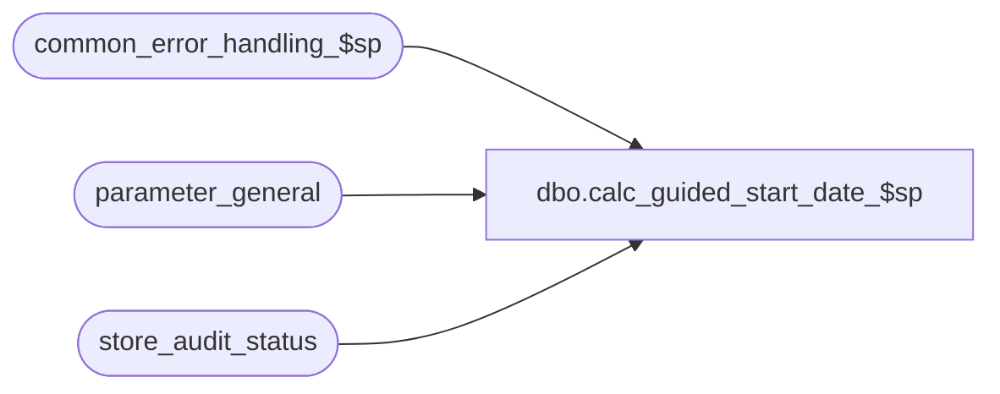

# dbo.calc_guided_start_date_$sp

**Database:** auditworks  
**Server:** bedrockdb01  

## Architecture Diagram



## Table Dependencies

| Referenced Table |
|---|
| common_error_handling_$sp |
| parameter_general |
| store_audit_status |

## Stored Procedure Code

```sql
create proc dbo.calc_guided_start_date_$sp 
@process_id             binary(16),
@user_id		int,
@transaction_date	smalldatetime = NULL,
@errmsg			varchar(255) OUTPUT,
@log_flag		tinyint = 0,
@edit_process_no	tinyint = 1

AS
/* Proc Name: calc_guided_start_date_$sp
   Desc: To recalculate guided_audit_start_date (parameter_general). This is used by
       the front-end to accelerate guided audit queries on store_audit_status/audit_status.
   Called by edit, dayend, delete and move.

   This version can be used for 5.0 and 5.1.

HISTORY :
Date     Name           Def# Desc
Mar26,12 Paul       1-48LC97 improve performance when store_audit_status contains many rows
Jun04,07 Paul        DV-1363 corrected call to common error handling 
Sep23,04 David       DV-1146 Use user_id.
Apr27,04 Maryam      DV-1071 Receive @process_id and pass it to common_error_handling_$sp
Nov26,01 Winnie      1-969YY Add logic for R3 error handling to pass @edit_process_no
Jan23,98 Paul
         Sebastiano          author
*/

DECLARE
  @errno			int,
  @guided_audit_start_date	smalldatetime,
  @object_name			varchar(255),
  @process_name			varchar(100),
  @operation_name		varchar(100),
  @message_id			int

SELECT @process_name = 'calc_guided_start_date_$sp',
       @message_id = 201068

SELECT @guided_audit_start_date = guided_audit_start_date
  FROM parameter_general

SELECT @errno = @@error
IF @errno <> 0
  BEGIN
	SELECT @errmsg = 'Failed to select from parameter_general',
   	       @object_name = 'parameter_general',
               @operation_name = 'SELECT'	
	GOTO error
  END


IF @transaction_date >= @guided_audit_start_date
  RETURN

IF @transaction_date IS NULL /* need to recalculate */
  BEGIN
	/* Use nolock to minimize multistream contention */
   SELECT @transaction_date = (SELECT MIN(sales_date)
				FROM store_audit_status WITH (NOLOCK)
			       WHERE store_audit_status <= 399)
   IF @transaction_date IS NULL  
     SELECT @transaction_date = getdate()
 END

UPDATE parameter_general
   SET guided_audit_start_date = @transaction_date

SELECT @errno = @@error
IF @errno <> 0
  BEGIN
	SELECT @errmsg = 'Failed to update parameter_general',
   	       @object_name = 'parameter_general',
               @operation_name = 'UPDATE'
	GOTO error
  END

RETURN

error:   /* Common error handler */


	EXEC common_error_handling_$sp 0, @errno, @errmsg, 0, @message_id, 
	@process_name, @object_name, @operation_name, @log_flag, @edit_process_no,
	1, 0, 0, null, null, null, null, null, null, 0, @process_id, @user_id
	
	RETURN
```

