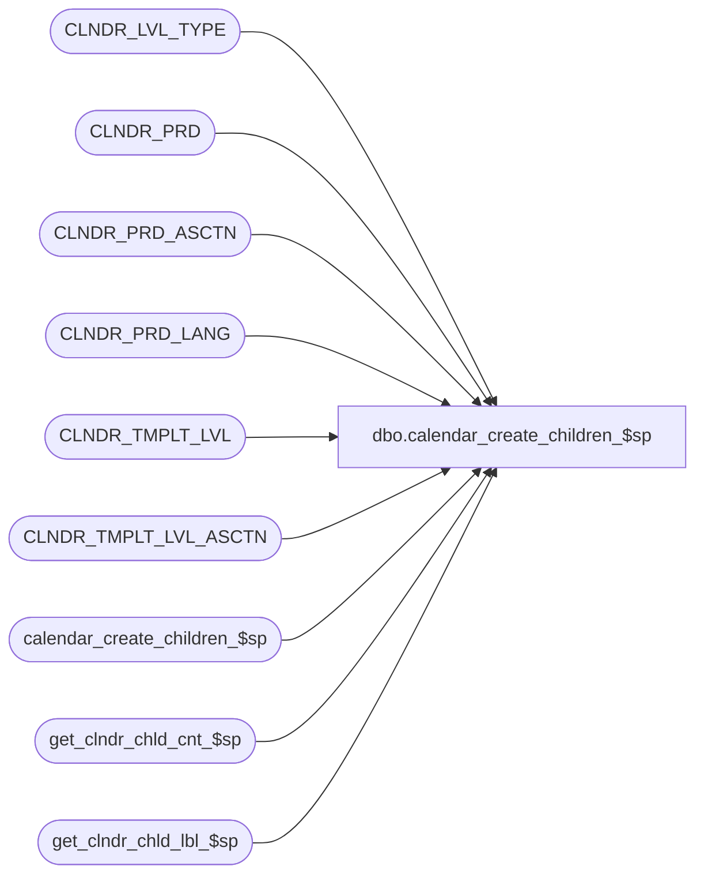

# dbo.calendar_create_children_$sp

**Database:** auditworks  
**Server:** bedrockdb01  

## Architecture Diagram



## Table Dependencies

| Referenced Table |
|---|
| CLNDR_LVL_TYPE |
| CLNDR_PRD |
| CLNDR_PRD_ASCTN |
| CLNDR_PRD_LANG |
| CLNDR_TMPLT_LVL |
| CLNDR_TMPLT_LVL_ASCTN |
| calendar_create_children_$sp |
| get_clndr_chld_cnt_$sp |
| get_clndr_chld_lbl_$sp |

## Stored Procedure Code

```sql
CREATE PROCEDURE [dbo].[calendar_create_children_$sp]
(
  @current_level varbinary(max),
  @template_id   varbinary(max),
  @period_num    int,
  @start_date    smalldatetime OUT,
  @calendar_id   varbinary(max),
  @parent_prd_id varbinary(max)
)
AS
DECLARE

  @counter        int,
  @root_level     varbinary(16),
  @period_label   nvarchar(500),
  @period_count   int,
  @child_level    varbinary(16),
  @child_cnt      int,
  @child_cnt_alg  varbinary(16),
  @finished       int,
  @label_algo     varbinary(16),
  @time_slice     int,
  @period_id      varbinary(16),
  @hold_date      smalldatetime,
  @output         varchar(2000)
  
BEGIN

  /* 
      Proc Name: calendar_create_children_$sp
      Desc: Self calling proc to run down the levels in the calendar creating the children
 
     HISTORY:
     Date     Name		Def#     Desc
     Jul28,15 Ian                author          
                                     
 */
 
 /* Get the level template definition */

 SELECT @output = CLNDR_LVL_DESC
   FROM CLNDR_LVL_TYPE
  WHERE CLNDR_LVL_TYPE_ID = @current_level;

 SELECT @label_algo = LBL_ALGRTHM_ID,
        @time_slice = TMPLT_LVL_TIME_SPAN
   FROM CLNDR_TMPLT_LVL
  WHERE CLNDR_TMPLT_ID = @template_id
    AND CLNDR_LVL_TYPE_ID = @current_level;
 
 SELECT @child_level   = CHLD_CLNDR_LVL_TYPE_ID,
        @child_cnt     = CHLD_CNT,
        @child_cnt_alg = CHLD_CNT_ALGRTHM_ID 
   FROM CLNDR_TMPLT_LVL_ASCTN
  WHERE CLNDR_TMPLT_ID = @template_id
    AND PRNT_CLNDR_LVL_TYPE_ID = @current_level;  
 
  /* Create the current level instance */
   
  EXEC get_clndr_chld_lbl_$sp 1,@period_num,@start_date,@start_date,@label_algo,@current_level,1033,@period_label output
     
  IF isnull(@child_cnt,0) = 0 and @child_level IS NOT NULL
  BEGIN
     exec get_clndr_chld_cnt_$sp 1,1,NULL,@start_date,@child_cnt_alg,@child_cnt output, 99
  END
   
  SET @hold_date = @start_date
   
  SELECT @period_id = newid()

  /* At the bottom so create the period and attach it to the parent then update the current date and pass it back up the stack */
  
  IF @time_slice > 0 and @time_slice IS NOT NULL
  BEGIN
    
    SET @start_date = dateadd(minute,@time_slice,@start_date)
    
  END
  
  INSERT INTO CLNDR_PRD VALUES (
                                 @period_id,
                                 @period_num,
                                 @period_label,
                                 @hold_date,
                                 @start_date,
                                 @calendar_id,
                                 @current_level,
                                 @template_id
                               );

  
  INSERT INTO CLNDR_PRD_LANG VALUES (
                                      1033,
                                      @period_id,
                                      @period_label
                                    ) 
  IF @parent_prd_id IS NOT NULL
  BEGIN
  
    INSERT INTO CLNDR_PRD_ASCTN VALUES (
                                         @parent_prd_id,
                                         @period_id,
                                         @current_level,
                                         @calendar_id
                                       )                                                                      
  END
  
  /* Get a new parent id - used for the association of periods */
  
  SET @parent_prd_id = @period_id;          
  
  /* Recursivley call this proc until there are no more levels to walk */    
  IF @child_cnt > 0
  BEGIN
      
    SET @counter = 1
      
    /* Go down the tree to the children */
    WHILE @counter <= @child_cnt
    BEGIN
        
      EXEC calendar_create_children_$sp @child_level,@template_id,@counter,@start_date output,@calendar_id, @parent_prd_id
     
      SET @counter = @counter + 1      
    
      /* Move end date based on Kiddies */
      
      UPDATE CLNDR_PRD
         SET END_DATE_TIME = @start_date
       WHERE CLNDR_PRD_ID = @parent_prd_id;
         
    END  
  
  END                           

END
```

