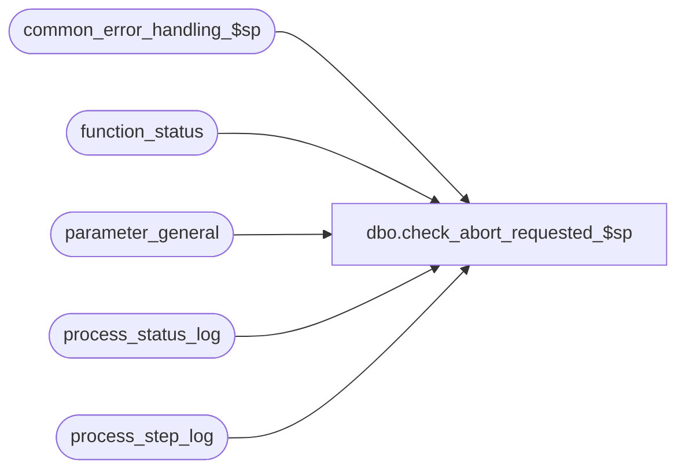

# dbo.check_abort_requested_$sp

**Database:** auditworks  
**Server:** bedrockdb01  

## Architecture Diagram



## Table Dependencies

| Referenced Table |
|---|
| common_error_handling_$sp |
| function_status |
| parameter_general |
| process_status_log |
| process_step_log |

## Stored Procedure Code

```sql
create proc dbo.check_abort_requested_$sp ( 
  @dayend_process_id 		tinyint = NULL,
  @process_id			binary(16),
  @process_no			smallint,
  @excluded_dayend_from_time    int = 0,
  @excluded_dayend_to_time      int = 0,
  @errmsg			nvarchar(255) OUTPUT )

AS

/* 
PROC NAME: check_abort_requested_$sp
     DESC: It will abort dayend if requested by user or by system based on settings in 
           Sales Audit Parameter. Called by dayend procs.

HISTORY
Date     Name        Def# Desc
Mar26,15 Vicci  TFS-78137 Use conditionaly dynamic SQL for call to dayend_housekeeping_$sp (which just returns anyhow for stream null or > 1) to avoid need to install called sub-procs when not in stream 1.
Oct07,04 David    DV-1146 Pass null to user_id in common_error_handling_$sp.
Jul09,04 ShuZ     DV-1071 Expand user_name to nvarchar(50)
May05,04 Maryam   DV-1071 Changed @process_id to binary(16). Receive @user_name and pass to 
			  the common_error_handling_$sp
Oct06,03 Maryam     15869 Reset abort_requested flag.
Sep14,03 Maryam	    13686 Author

*/

DECLARE
	@abort_flag 				tinyint,
	@compare_time				int,
	@dayend_delay_ignored                   tinyint,
	@errno					int,
	@memo1                                  nvarchar(255),
	@memo2                                  nvarchar(255),
	@message_id 				int,
	@object_name				nvarchar(255),
	@operation_name                         nvarchar(100),
	@process_name                           nvarchar(100),
	@rows					int

SELECT  @message_id = 201068,
	@process_name = 'check_abort_requested_$sp',
	@abort_flag = 0

SELECT @abort_flag = abort_requested
  FROM process_status_log
 WHERE process_no = 18

SELECT @errno = @@error,
	@rows = @@rowcount
IF @errno <> 0
  BEGIN
    SELECT @errmsg = 'Unable to select abort_requested from process_status_log',
           @object_name = 'process_status_log',
           @operation_name = 'SELECT'
    GOTO error
  END

IF @rows = 0
  SELECT @abort_flag = 0

IF @abort_flag = 0
BEGIN
  SELECT @dayend_delay_ignored = dayend_delay_ignored
    FROM parameter_general
    
  SELECT @errno = @@error
  IF @errno <> 0
    BEGIN
      SELECT @errmsg = 'Unable to select dayend_delay_ignored.',
             @object_name = 'parameter_general',
   	     @operation_name = 'SELECT'
      GOTO error
    END
    
  SELECT @compare_time = CONVERT (int, SUBSTRING((CONVERT(nvarchar, getdate(), 8)),1,2) + 
                                      SUBSTRING((CONVERT(nvarchar, getdate(), 8)),4,2))
                                     
  IF (@compare_time > @excluded_dayend_from_time AND @compare_time < @excluded_dayend_to_time) 
      AND @dayend_delay_ignored <> 1 -- not immediately requested dayend
    BEGIN
      
      UPDATE parameter_general
         SET immediate_dayend_requested = 0

      SELECT @errno = @@error
      IF @errno <> 0
        BEGIN
          SELECT @errmsg = 'Unable to update parameter_general',
                 @object_name = 'parameter_general',
                 @operation_name = 'UPDATE'
          GOTO error
        END

      IF @dayend_process_id = 1
      BEGIN
        EXEC sp_executesql N'EXEC dayend_housekeeping_$sp @dayend_process_id, @process_id', N'@dayend_process_id tinyint, @process_id binary(16)', @dayend_process_id, @process_id
        SELECT @errno = @@error
        IF @errno <> 0
        BEGIN
          IF @errmsg IS NULL --
            SELECT @errmsg = 'Unable to execute procedure dayend_housekeeping_$sp'
          SELECT @object_name = 'dayend_housekeeping_$sp',
	         @operation_name = 'EXECUTE'
          GOTO error
        END
      END
      
      SELECT @abort_flag = 2
    END  --IF (@compare_time > @excluded_dayend_from_time AND @compare_time < @excluded_dayend_to_time)
    
END --@abort_flag = 0
   
IF @abort_flag > 0
  BEGIN
        
    UPDATE process_step_log
       SET process_step_no = 69
     WHERE process_no = 18

    SELECT @errno = @@error
    IF @errno <> 0
      BEGIN
        SELECT @errmsg = 'Unable to update process_step_log to step 69',
	       @object_name = 'process_step_log',
   	       @operation_name = 'UPDATE'
	GOTO error
      END

    UPDATE parameter_general
       SET dayend_in_progress = 0,
           immediate_dayend_requested = 0

    SELECT @errno = @@error
    IF @errno <> 0
      BEGIN
       SELECT @errmsg = 'Unable to update parameter_general',
               @object_name = 'parameter_general',
               @operation_name = 'UPDATE'
        GOTO error
      END

    DELETE function_status
     WHERE function_no = 18
       AND process_id = @process_id

    SELECT @errno = @@error
    IF @errno <> 0
      BEGIN
        SELECT @errmsg = 'Unable to delete function_status',
               @object_name = 'function_status',
               @operation_name = 'DELETE'
	GOTO error
      END               

    IF @abort_flag = 1
      BEGIN
        UPDATE process_status_log
           SET abort_requested = 0  
         WHERE process_no = 18

        SELECT @errno = @@error 
        IF @errno <> 0
          BEGIN
            SELECT @errmsg = 'Unable to set abort_requested back to 0',
                   @object_name = 'process_status_log',
                   @operation_name = 'UPDATE'
            GOTO error
          END
        
        SELECT @errmsg = 'Function aborted by user request',
               @message_id = 201635,
               @errno = 201635
        GOTO error
      END
    ELSE --@abort_flag = 2
      BEGIN
        SELECT @memo1 = CONVERT(nvarchar,  @excluded_dayend_from_time),
               @memo2 = CONVERT(nvarchar,  @excluded_dayend_to_time),
               @errmsg = 'Day End has been auto-aborted based on the settings in Sales Audit Parameter.',
               @message_id = 201681,
               @errno = 201681,
               @abort_flag = 1
        GOTO error       
      END 
  END --  IF @abort_flag = 1

RETURN

error:   -- Common error handler
        
        EXEC common_error_handling_$sp @process_no, @errno, @errmsg, @abort_flag, @message_id,
                     @process_name, @object_name, @operation_name, 0, @dayend_process_id, 0, NULL, 0, @memo1, @memo2,
                      null, null, null, null, 0, @process_id, null --

	RETURN
```

