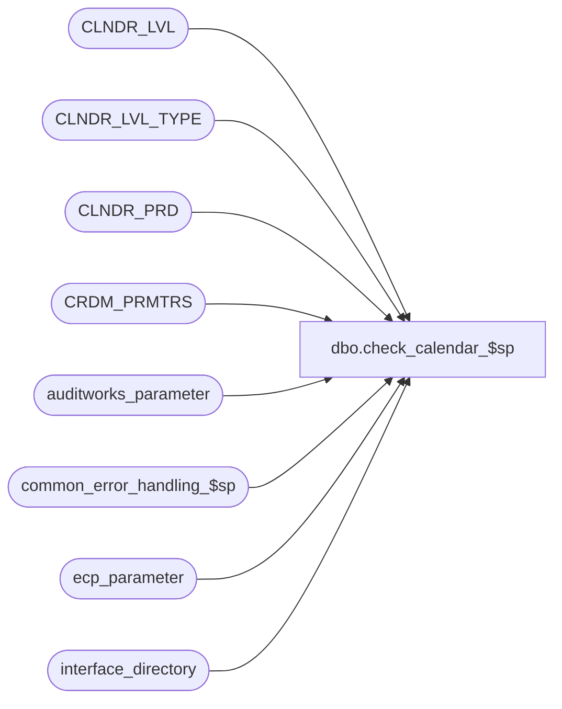

# dbo.check_calendar_$sp

**Database:** auditworks  
**Server:** bedrockdb01  

## Architecture Diagram



## Table Dependencies

| Referenced Table |
|---|
| CLNDR_LVL |
| CLNDR_LVL_TYPE |
| CLNDR_PRD |
| CRDM_PRMTRS |
| auditworks_parameter |
| common_error_handling_$sp |
| ecp_parameter |
| interface_directory |

## Stored Procedure Code

```sql
create proc dbo.check_calendar_$sp @issue_detected				tinyint OUTPUT,
@too_short_clndr_id			binary(16) OUTPUT,
@max_date_supported			datetime OUTPUT

AS

/* 
Proc Name: check_calendar_$sp
   Description: Determine whether the calendars in use by S/A and ECP extend at least 31 days into the future.

HISTORY:
Date     Name            Def# Desc
Mar11,13 Vicci         142467 Author

*/

DECLARE
  @lowest_calendar_level_id	binary(16),
  @lowest_calendar_level	int,
  @ecp_clndr_id			binary(16),
  @max_ecp_calendar_date  	datetime,
  @max_calendar_date  	datetime,  
  @clndr_id			binary(16),
  @errmsg                         nvarchar(255),
  @errno                          int,
  @exists			tinyint,
  @lvl_month			binary(16),
  @message_id                     int,
  @object_name                    nvarchar(255),
  @operation_name                 nvarchar(100),
  @process_id                     binary(16),
  @process_name                   nvarchar(100),
  @process_no                     smallint,
  @rows				  int,
  @abort_flag			  tinyint,
  @memo_date			  smalldatetime,
  @memo1			  nvarchar(50)


SELECT @process_name = 'check_calendar_$sp',
       @message_id = 201068,
       @process_no = 18,
       @errno = 0,
       @abort_flag = 0,
       @process_id = newid(), -- only used for error logging
       @issue_detected = 0

IF EXISTS (SELECT 1 FROM interface_directory WHERE interface_id = 44 AND update_timing > 0)
BEGIN
  SELECT @ecp_clndr_id = par_bin_value
    FROM ecp_parameter p
   WHERE par_name = 'ecp_dflt_clndr_id'  
  SELECT @errno = @@error
  IF @errno <> 0
  BEGIN
    SELECT @errmsg = 'Unable to determine which calendar to use',
           @object_name = 'ecp_parameter',
           @operation_name = 'SELECT'
    GOTO error
  END

  SELECT @lowest_calendar_level = CLNDR_LVL_TYPE_IDNTY, 
         @lowest_calendar_level_id = CLNDR_LVL_TYPE_ID
    FROM CLNDR_LVL_TYPE
   WHERE CLNDR_LVL_SEQ = (SELECT MAX(CLNDR_LVL_SEQ)
  			    FROM CLNDR_LVL_TYPE
			   WHERE CLNDR_LVL_TYPE_ID
			      IN (SELECT DISTINCT CLNDR_LVL_TYPE_ID
			           FROM CLNDR_LVL
                                  WHERE CLNDR_ID = @ecp_clndr_id))
     AND CLNDR_LVL_TYPE_ID
         IN (SELECT DISTINCT CLNDR_LVL_TYPE_ID
              FROM CLNDR_LVL
             WHERE CLNDR_ID = @ecp_clndr_id)
  SELECT @errno = @@error
  IF @errno <> 0
  BEGIN
    SELECT @errmsg = 'Unable to which calendar level to use for employee transaction logging',
           @object_name = 'CLNDR_LVL_TYPE',
           @operation_name = 'SELECT'
    GOTO error
  END

  IF @lowest_calendar_level IS NULL
  BEGIN
    SELECT @errno = 201612,
           @message_id = 201612,
           @errmsg = 'Unable to determine a valid calendar to use for employee transaction logging',
           @object_name = 'ecp_parameter',
           @operation_name = 'SELECT'
    GOTO error
  END

  SELECT @max_ecp_calendar_date = MAX(END_DATE_TIME)
    FROM CLNDR_PRD c
   WHERE c.CLNDR_ID = @ecp_clndr_id
     AND c.CLNDR_LVL_TYPE_ID = @lowest_calendar_level_id
  SELECT @errno = @@error
  IF @errno <> 0
  BEGIN
    SELECT @errmsg = 'Unable to determine greatest date available for employee transaction logging',
           @object_name = 'CLNDR_PRD',
           @operation_name = 'SELECT'
    GOTO error
  END
     
  IF @max_ecp_calendar_date < dateadd(dd, 32, getdate())
  BEGIN
    SELECT @too_short_clndr_id = @ecp_clndr_id,
           @max_date_supported = @max_ecp_calendar_date,
           @issue_detected = 1,
           @errno = 201055,
           @message_id = 201055,
           @errmsg = 'The ECP calendar only supports transactions up to ' + convert(nvarchar, @max_ecp_calendar_date) + '.  Please update your calendar via table maintenance.',
           @object_name = 'CLNDR_PRD',
           @operation_name = 'SELECT',
           @memo_date  = @max_ecp_calendar_date, 
           @memo1 = convert(nvarchar, @max_ecp_calendar_date, 106),
           @abort_flag = 3 --bypass raise error since 201055 is not in the supported range, but log to process error log.
    GOTO error
  END
END  --IF ECP is live

SELECT @clndr_id = PRMTR_VAL_BIN
  FROM CRDM_PRMTRS
 WHERE PRMTR_NAME = 'GL_PSTNG_CLNDR_ID'
SELECT @errno = @@error
IF @errno != 0 OR @rows = 0
BEGIN
  SELECT @errmsg = 'Failed to select calendar id',
         @object_name = 'CRDM_PRMTRS',
         @operation_name = 'SELECT'
  GOTO error
END

SELECT @lvl_month = par_bin_value
  FROM auditworks_parameter
 WHERE par_name = 'clndr_lvl_month'
SELECT @errno = @@error
IF @errno != 0 OR @rows = 0
BEGIN
  SELECT @errmsg = 'Failed to select month level id',
         @object_name = 'auditworks_parameter',
         @operation_name = 'SELECT'
  GOTO error
END

SELECT @max_calendar_date = MAX(END_DATE_TIME)
  FROM CLNDR_PRD c
 WHERE c.CLNDR_ID = @clndr_id
   AND c.CLNDR_LVL_TYPE_ID = @lvl_month
SELECT @errno = @@error
IF @errno != 0 OR @rows = 0
BEGIN
  SELECT @errmsg = 'Failed to determine greatest transaction date supported by G/L Calendar',
         @object_name = 'CLNDR_PRD',
         @operation_name = 'SELECT'
  GOTO error
END

IF @max_calendar_date < dateadd(dd, 32, getdate())
BEGIN
  SELECT @too_short_clndr_id = @clndr_id,
         @max_date_supported = @max_calendar_date,
         @issue_detected = 1,
         @errno = 201055,
         @message_id = 201055,
         @errmsg = 'The G/L calendar only supports transactions up to ' + convert(nvarchar, @max_calendar_date) + '.  Please update your calendar via table maintenance.',
         @object_name = 'CLNDR_PRD',
         @operation_name = 'SELECT',
         @memo_date  = @max_calendar_date, 
         @memo1 = convert(nvarchar,@max_calendar_date,106),
         @abort_flag = 3 --bypass raise error since 201055 is not in the supported range, but log to process error log.
  GOTO error
END

RETURN


error:

  EXEC common_error_handling_$sp @process_no, @errno, @errmsg, @abort_flag, @message_id,
       @process_name, @object_name, @operation_name, 0, 1, 0, null, 0,
   @memo1, null, null, @memo_date, null, null, 0, @process_id, null --
	     
  RETURN
```

