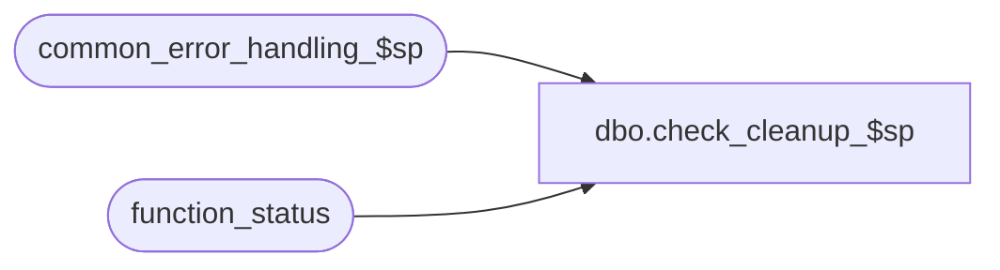

# dbo.check_cleanup_$sp

**Database:** auditworks  
**Server:** bedrockdb01  

## Architecture Diagram



## Table Dependencies

| Referenced Table |
|---|
| common_error_handling_$sp |
| function_status |

## Stored Procedure Code

```sql
create proc dbo.check_cleanup_$sp ( @process_id                   binary(16) = null,
  @user_id                      int = -1)

AS
/* Proc Name: check_cleanup_$sp
   Description: This procedure will return a value 1 if a cleanup needs to
		be run or a value 0 if all is OK. Called by UI when Guided Audit is opened.

HISTORY
  Date   Name		Def# Desc
Jan04,11 Paul         105313 Use unicode datatypes
Mar12,10 Vicci        115597 Uplift to S/A 5.0 removing user name and spid references no longer possible in an n-tier environment.
JUL17,02 Daphna      1-E8M39 use @rows instead of @@rowcount to check population of tables  
May03,02 Ian         1-CD0IX Add R3 Error Handling
Oct25,00 Paul		6841 Improve performance
Sep09,96 Seb		author

 */

DECLARE	-- error handling
	@process_name		nvarchar(100),
	@process_no		smallint,
	@operation_name		nvarchar(100),
	@object_name		nvarchar(255),
	@message_id		int,
	@log_flag		tinyint,
	@errmsg                 nvarchar(255),
	@errno			int,
	@rows                   numeric(12,0)
	
SELECT	@process_name = 'check_cleanup_$sp',
	@message_id = 201068,
	@log_flag = 0,
	@process_no = 36
	
IF EXISTS (SELECT 1
             FROM function_status
            WHERE released_to_cleanup = 1)
BEGIN
  UPDATE function_status
    SET lock_flag = 0,
        lock_by_user_id = null,
        lock_date = null
  WHERE lock_flag = 1
    AND DATEDIFF(mi,lock_date,getdate()) > 60-- > 60 min ago
    AND released_to_cleanup = 1
  SELECT @errno = @@error
  IF @errno <> 0
  BEGIN
    SELECT @errmsg = 'Unable to unlock function_status',
           @object_name = 'function_status',
           @operation_name = 'UPDATE'
    GOTO error
  END

  RETURN 1
END
ELSE
  RETURN 0

error:

	EXEC common_error_handling_$sp @process_no, @errno, @errmsg, 0, @message_id,
		@process_name, @object_name, @operation_name, @log_flag, 1,
          0, null, 0, null, null, null, null, null, null, 0, @process_id, @user_id
	RETURN
```

