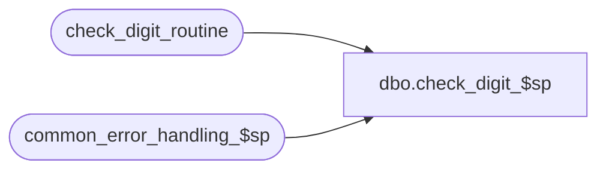

# dbo.check_digit_$sp

**Database:** auditworks  
**Server:** bedrockdb01  

## Architecture Diagram



## Table Dependencies

| Referenced Table |
|---|
| check_digit_routine |
| common_error_handling_$sp |

## Stored Procedure Code

```sql
create proc dbo.check_digit_$sp 

 (@process_id	 	         binary(16),
  @user_id			int,
  @process_no 		         smallint,
  @check_digit_routine_no	 tinyint, 
  @reference_number		 numeric(20,0) OUTPUT, 
  @errmsg			 nvarchar(255) OUTPUT)
AS

/* Proc Name: check_digit_$sp
   Descr: This procedure receives a number missing its last position, ie with no check digit
   and returns a check-digited number.
   If check_digit_routine requires sum of product digits, then sum_of_product_digits must
   be set to 9.
   If check_digit_routine requires sum of products, then sum_of_product_digits must
   be set to 0.
   Value set for last position (20) should be a 1 since it is the check-digit itself.
   Called from cust_liab_reference_gen_$sp and cust_liability_import_$sp.

HISTORY:
Date     Name        Def# Desc
Jan04,11 Paul      105313 Use unicode datatypes
Sep23,04 David    DV-1146 Use user_id
Apr23,04 Maryam   DV-1071 Modified to receive @process_id as input parameter
			  and pass it to the common_error_handling_$sp
Mar28,03 Vicci       7300 Calculate complement as 'divisor minus...' not '10 minus...'
Feb26,03 Vicci       6404 Complement of 0 should be 0 not 10.
Aug08,01 Vicci       8415 Author

*/
  
DECLARE
 @complement                    tinyint,
 @check_digit			tinyint,
 @digit1			smallint,
 @digit2			smallint,
 @digit3			smallint,
 @digit4			smallint,
 @digit5			smallint,
 @digit6			smallint,
 @digit7			smallint,
 @digit8			smallint,
 @digit9			smallint,
 @digit10			smallint,
 @digit11			smallint,
 @digit12			smallint,
 @digit13			smallint,
 @digit14			smallint,
 @digit15			smallint,
 @digit16			smallint,
 @digit17			smallint,
 @digit18			smallint,
 @digit19			smallint,
 @digit20			smallint,
 @divisor                       tinyint,
 @errno				int,
 @message_id			int,
 @reference_no 			nvarchar(20),
 @sum_of_product_digits         tinyint,
 @object_name			nvarchar(255),
 @operation_name		nvarchar(100),
 @process_name			nvarchar(100)

SELECT @process_name = 'check_digit_$sp',
	@message_id = 201068,
	@reference_no = RIGHT('00000000000000000000' + CONVERT(nvarchar, @reference_number * 10), 20)

SELECT @sum_of_product_digits = sum_of_product_digits, 
 	@complement = complement, 
 	@divisor = divisor,
	@digit1 = multiplier1 * CONVERT(tinyint, SUBSTRING(@reference_no, 1, 1 )),
	@digit2 = multiplier2 * CONVERT(tinyint, SUBSTRING(@reference_no, 2, 1 )),
	@digit3 = multiplier3 * CONVERT(tinyint, SUBSTRING(@reference_no, 3, 1 )),
	@digit4 = multiplier4 * CONVERT(tinyint, SUBSTRING(@reference_no, 4, 1 )),
	@digit5 = multiplier5 * CONVERT(tinyint, SUBSTRING(@reference_no, 5, 1 )),
	@digit6 = multiplier6 * CONVERT(tinyint, SUBSTRING(@reference_no, 6, 1 )),
	@digit7 = multiplier7 * CONVERT(tinyint, SUBSTRING(@reference_no, 7, 1 )),
	@digit8 = multiplier8 * CONVERT(tinyint, SUBSTRING(@reference_no, 8, 1 )),
	@digit9 = multiplier9 * CONVERT(tinyint, SUBSTRING(@reference_no, 9, 1 )),
	@digit10 = multiplier10 * CONVERT(tinyint, SUBSTRING(@reference_no, 10, 1 )),
	@digit11 = multiplier11 * CONVERT(tinyint, SUBSTRING(@reference_no, 11, 1 )),
	@digit12 = multiplier12 * CONVERT(tinyint, SUBSTRING(@reference_no, 12, 1 )),
	@digit13 = multiplier13 * CONVERT(tinyint, SUBSTRING(@reference_no, 13, 1 )),
	@digit14 = multiplier14 * CONVERT(tinyint, SUBSTRING(@reference_no, 14, 1 )),
	@digit15 = multiplier15 * CONVERT(tinyint, SUBSTRING(@reference_no, 15, 1 )),
	@digit16 = multiplier16 * CONVERT(tinyint, SUBSTRING(@reference_no, 16, 1 )),
	@digit17 = multiplier17 * CONVERT(tinyint, SUBSTRING(@reference_no, 17, 1 )),
	@digit18 = multiplier18 * CONVERT(tinyint, SUBSTRING(@reference_no, 18, 1 )),
	@digit19 = multiplier19 * CONVERT(tinyint, SUBSTRING(@reference_no, 19, 1 )),
	@digit20 = multiplier20 * CONVERT(tinyint, SUBSTRING(@reference_no, 20, 1 ))
  FROM check_digit_routine
 WHERE check_digit_routine_no = @check_digit_routine_no

SELECT @errno = @@error
IF @errno <> 0
BEGIN
  SELECT @errmsg = 'Failed to determine check-digit formula',
         @object_name = 'check_digit_routine',
         @operation_name = 'SELECT'
  GOTO error
END 

/* adjust for sum of digits */
IF @sum_of_product_digits = 9 
  SELECT @digit1 = CONVERT(int, @digit1 / 10) + @digit1 % 10,
	@digit2 = CONVERT(int, @digit2 / 10) + @digit2 % 10,
	@digit3 = CONVERT(int, @digit3 / 10) + @digit3 % 10,
	@digit4 = CONVERT(int, @digit4 / 10) + @digit4 % 10,
	@digit5 = CONVERT(int, @digit5 / 10) + @digit5 % 10,
	@digit6 = CONVERT(int, @digit6 / 10) + @digit6 % 10,
	@digit7 = CONVERT(int, @digit7 / 10) + @digit7 % 10,
	@digit8 = CONVERT(int, @digit8 / 10) + @digit8 % 10,
	@digit9 = CONVERT(int, @digit9 / 10) + @digit9 % 10,
	@digit10 = CONVERT(int, @digit10 / 10) + @digit10 % 10,
	@digit11 = CONVERT(int, @digit11 / 10) + @digit11 % 10,
	@digit12 = CONVERT(int, @digit12 / 10) + @digit12 % 10,
	@digit13 = CONVERT(int, @digit13 / 10) + @digit13 % 10,
	@digit14 = CONVERT(int, @digit14 / 10) + @digit14 % 10,
	@digit15 = CONVERT(int, @digit15 / 10) + @digit15 % 10,
	@digit16 = CONVERT(int, @digit16 / 10) + @digit16 % 10,
	@digit17 = CONVERT(int, @digit17 / 10) + @digit17 % 10,
	@digit18 = CONVERT(int, @digit18 / 10) + @digit18 % 10,
	@digit19 = CONVERT(int, @digit19 / 10) + @digit19 % 10,
	@digit20 = CONVERT(int, @digit20 / 10) + @digit20 % 10

/* Determine check-digit */
SELECT @check_digit = (@digit1 + @digit2 + @digit3 + @digit4 + @digit5 + @digit6 + @digit7
              + @digit8 + @digit9 + @digit10 + @digit11 + @digit12 + @digit13 + @digit14
              + @digit15 + @digit16 + @digit17 + @digit18 + @digit19 + @digit20) % @divisor

/* adjust check digit for complement */
IF @complement = 1 AND @check_digit > 0
  SELECT @check_digit = @divisor - @check_digit

SELECT @reference_number = @reference_number * 10 + @check_digit

RETURN

error:		/* error handling routine */

	EXEC common_error_handling_$sp @process_no, @errno, @errmsg, 0, @message_id, 
	@process_name, @object_name, @operation_name, 1, 1, 0, 
	null, 0, null, null, null, null, null, null, 0, @process_id, @user_id
	
	RETURN
```

