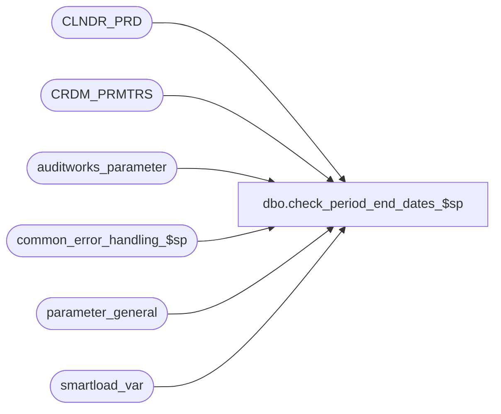

# dbo.check_period_end_dates_$sp

**Database:** auditworks  
**Server:** bedrockdb01  

## Architecture Diagram



## Table Dependencies

| Referenced Table |
|---|
| CLNDR_PRD |
| CRDM_PRMTRS |
| auditworks_parameter |
| common_error_handling_$sp |
| parameter_general |
| smartload_var |

## Stored Procedure Code

```sql
create proc dbo.check_period_end_dates_$sp 

AS

/* 
Proc Name: check_period_end_dates_$sp
   Description: Determine whether a period end has been requested.
		Verify that period_end_date exists in CLNDR_PRD.
		Called from smartload dayend.ict (stream 1 only) in ICT_DAYEND01.

HISTORY:
Date     Name            Def# Desc
Sep11,13 Paul          144450 Use try .. catch, added comments.
Jun25,13 Phu           144450 Select period_end_date and its period_number to sql.out for parsing by dayend.ict and legacy R12 SA.
				This also introduces a tie-in with the corresponding smartload change to dayend*.ict (stream 1 only).
Oct29,10 Paul          121798 Author

*/

DECLARE
  @clndr_id                       binary(16),
  @errmsg                         nvarchar(2000),
  @errno                          int,
  @last_date_closed               smalldatetime,
  @log_flag                       tinyint,
  @lvl_month                      binary(16),
  @message_id                     int,
  @object_name                    nvarchar(255),
  @operation_name                 nvarchar(100),
  @pdend_go_create                tinyint,
  @period_end_date                smalldatetime,
  @period_number                  tinyint,
  @process_id                     binary(16),
  @process_name                   nvarchar(100),
  @process_no                     smallint,
  @rows                           int


SELECT @process_name = 'check_period_end_dates_$sp',
       @message_id = 201068,
       @log_flag = 0,
       @process_no = 18,
       @pdend_go_create = 0,
       @period_number = 0,
       @errno = 0,
       @process_id = @@spid, -- only used for error logging
       @operation_name = 'SELECT';

BEGIN TRY

  SELECT @errmsg      = 'Failed to select from parameter_general',
       @object_name = 'parameter_general'; 

SELECT @period_end_date = period_end_date,
       @last_date_closed = last_date_closed
  FROM parameter_general;

SELECT @rows = @@rowcount;
IF @rows = 0
  GOTO business_error;

IF @period_end_date <= @last_date_closed
  RETURN;

  SELECT @errmsg      = 'Failed to select pdend_go_create',
       @object_name = 'smartload_var'; 

SELECT @pdend_go_create = COALESCE(CONVERT(tinyint, var_value), 0)
  FROM smartload_var
 WHERE ict_name = 'dayend.ict'
   AND var_name = 'pdend_go_create';

IF @pdend_go_create <= 0
  RETURN;

-- Now check the gl calendar.

  SELECT @errmsg      = 'Failed to select calendar id',
       @object_name = 'CRDM_PRMTRS'; 

SELECT @clndr_id = PRMTR_VAL_BIN
  FROM CRDM_PRMTRS
 WHERE PRMTR_NAME = 'GL_PSTNG_CLNDR_ID';

SELECT @rows = @@rowcount;
IF @rows = 0
  GOTO business_error;

  SELECT @errmsg      = 'Failed to select month level id',
       @object_name = 'auditworks_parameter'; 
SELECT @lvl_month = par_bin_value
  FROM auditworks_parameter
 WHERE par_name = 'clndr_lvl_month';

SELECT @rows = @@rowcount;
IF @rows = 0
  GOTO business_error;

-- Verify that a month exists in the gl calendar that includes the @period_end_date 

  SELECT @errmsg      = 'Failed to find month in calendar',
       @object_name = 'CLNDR_PRD'; 

SELECT DISTINCT @period_number = CLNDR_PRD_NUM
FROM CLNDR_PRD
 WHERE CLNDR_ID = @clndr_id
  AND CLNDR_LVL_TYPE_ID = @lvl_month
  AND @period_end_date >= STRT_DATE_TIME
  AND @period_end_date < END_DATE_TIME;


/* this specific select output is needed to handle environments where legacy SA R12 is also active.
   dayend*.ict parses the sql.out file for a slash, which would be part of the date string. */

  SELECT @errmsg = 'Failed to select to sql.out'; 

IF @period_number > 0
  BEGIN
   SELECT CONVERT(NCHAR(10), @period_end_date, 1), CONVERT(NCHAR(3), @period_number);
  END;

RETURN;

business_error:   /* Business Rule handler. */

	/* Handles invalid configuration scenarios in this proc */

  SELECT @errno = 0,
	@errmsg = @process_name + ':' + COALESCE(@errmsg, ' ');

  EXEC common_error_handling_$sp @process_no, @errno, @errmsg, 0, @message_id,
       @process_name, @object_name, @operation_name, @log_flag, 1, 0, null, 0,
   null, null, null, null, null, null, 0, @process_id, null;

  RETURN;
END TRY

BEGIN CATCH; -- trap system errors
    /* common error handling. Appending proc name here since called by smartload. */

  SELECT @errno = ERROR_NUMBER(),
	@errmsg = @process_name + ':' + COALESCE(@errmsg, ' ') + ERROR_MESSAGE();

  EXEC common_error_handling_$sp @process_no, @errno, @errmsg, 0, @message_id,
       @process_name, @object_name, @operation_name, @log_flag, 1, 0, null, 0,
   null, null, null, null, null, null, 0, @process_id, null;
	     
  RETURN;

END CATCH;
```

