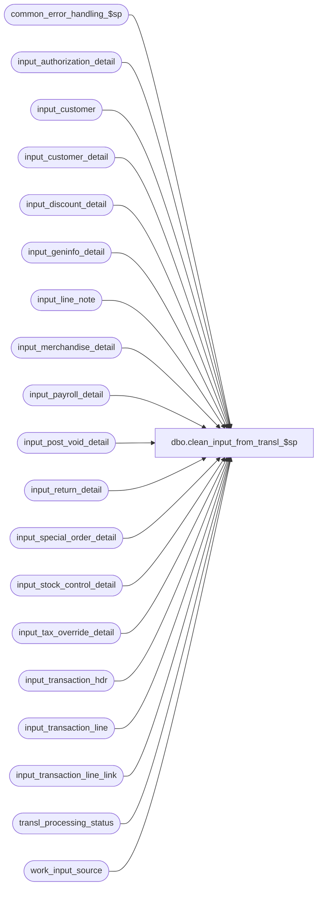

# dbo.clean_input_from_transl_$sp

**Database:** auditworks  
**Server:** bedrockdb01  

## Architecture Diagram



## Table Dependencies

| Referenced Table |
|---|
| common_error_handling_$sp |
| input_authorization_detail |
| input_customer |
| input_customer_detail |
| input_discount_detail |
| input_geninfo_detail |
| input_line_note |
| input_merchandise_detail |
| input_payroll_detail |
| input_post_void_detail |
| input_return_detail |
| input_special_order_detail |
| input_stock_control_detail |
| input_tax_override_detail |
| input_transaction_hdr |
| input_transaction_line |
| input_transaction_line_link |
| transl_processing_status |
| work_input_source |

## Stored Procedure Code

```sql
create proc dbo.clean_input_from_transl_$sp 
@errmsg nvarchar(255) OUTPUT,
@edit_process_no	tinyint = 1

AS

/* 
PROC NAME: clean_input_from_transl_$sp
     DESC: Cleanup input tables. Called by edit_post_$sp
HISTORY:
Date	   Name	     Def#  Desc
Apr16,12 Vicci     133164  Delete input_geninfo_detail too.
Mar15,05 Maryam   DV-1202  Delete input_transaction_line_link.
Nov26,01 Winnie	  1-969YY  Add logic for R3 error handling to pass @edit_process_no
Sep07,01   ShuZ      8692  clean up work_input_source table
Jul10,01   ShuZ      8274  Author
*/


DECLARE
	@errno 				int,
	@object_name			nvarchar(255),
	@process_name			nvarchar(100),
	@operation_name			nvarchar(100),
	@message_id			int	
	
SELECT @process_name = 'clean_input_from_transl_$sp',
       @message_id = 201068

DELETE FROM input_transaction_hdr 
   FROM transl_processing_status t
   WHERE input_transaction_hdr.input_id = t.input_id

SELECT @errno = @@error
IF @errno != 0 
BEGIN
  SELECT @errmsg = 'Failed to delete from input_transaction_hdr. ',
         @object_name = 'input_transaction_hdr',
         @operation_name = 'DELETE'
  GOTO error
END 
 
DELETE FROM input_transaction_line 
   FROM transl_processing_status t
   WHERE input_transaction_line.input_id = t.input_id

SELECT @errno = @@error
IF @errno != 0 
BEGIN
  SELECT @errmsg = 'Failed to delete from input_transaction_line. ',
         @object_name = 'input_transaction_line',
         @operation_name = 'DELETE'
  GOTO error
END  

DELETE FROM input_geninfo_detail 
   FROM transl_processing_status t
   WHERE input_geninfo_detail.input_id = t.input_id

SELECT @errno = @@error
IF @errno != 0 
BEGIN
  SELECT @errmsg = 'Failed to delete from input_geninfo_detail. ',
         @object_name = 'input_geninfo_detail',
         @operation_name = 'DELETE'
  GOTO error
END  

DELETE FROM input_merchandise_detail 
   FROM transl_processing_status t
   WHERE input_merchandise_detail.input_id = t.input_id

SELECT @errno = @@error
IF @errno != 0 
BEGIN
  SELECT @errmsg = 'Failed to delete from input_merchandise_detail. ',
         @object_name = 'input_merchandise_detail',
         @operation_name = 'DELETE'
  GOTO error
END  

DELETE FROM input_tax_override_detail 
   FROM transl_processing_status t
   WHERE input_tax_override_detail.input_id = t.input_id

SELECT @errno = @@error
IF @errno != 0 
BEGIN
  SELECT @errmsg = 'Failed to delete from input_tax_override_detail. ',
         @object_name = 'input_tax_override_detail',
         @operation_name = 'DELETE'
  GOTO error
END  

DELETE FROM input_discount_detail 
   FROM transl_processing_status t
   WHERE input_discount_detail.input_id = t.input_id

SELECT @errno = @@error
IF @errno != 0 
BEGIN
  SELECT @errmsg = 'Failed to delete from input_discount_detail. ',
         @object_name = 'input_discount_detail',
         @operation_name = 'DELETE'
  GOTO error
END  

DELETE FROM input_post_void_detail 
   FROM transl_processing_status t
   WHERE input_post_void_detail.input_id = t.input_id

SELECT @errno = @@error
IF @errno != 0 
BEGIN
  SELECT @errmsg = 'Failed to delete from input_post_void_detail. ',
         @object_name = 'input_post_void_detail',
         @operation_name = 'DELETE'
  GOTO error
END  

DELETE FROM input_return_detail 
   FROM transl_processing_status t
   WHERE input_return_detail.input_id = t.input_id

SELECT @errno = @@error
IF @errno != 0 
BEGIN
  SELECT @errmsg = 'Failed to delete from input_return_detail. ',
         @object_name = 'input_return_detail',
         @operation_name = 'DELETE'
  GOTO error
END  

DELETE FROM input_authorization_detail 
   FROM transl_processing_status t
   WHERE input_authorization_detail.input_id = t.input_id

SELECT @errno = @@error
IF @errno != 0 
BEGIN
  SELECT @errmsg = 'Failed to delete from input_authorization_detail. ',
         @object_name = 'input_authorization_detail',
         @operation_name = 'DELETE'
  GOTO error
END  

DELETE FROM input_customer 
   FROM transl_processing_status t
   WHERE input_customer.input_id = t.input_id

SELECT @errno = @@error
IF @errno != 0 
BEGIN
  SELECT @errmsg = 'Failed to delete from input_customer. ',
         @object_name = 'input_customer',
         @operation_name = 'DELETE'
  GOTO error
END  

DELETE FROM input_customer_detail 
   FROM transl_processing_status t
   WHERE input_customer_detail.input_id = t.input_id

SELECT @errno = @@error
IF @errno != 0 
BEGIN
  SELECT @errmsg = 'Failed to delete from input_customer_detail. ',
         @object_name = 'input_customer_detail',
         @operation_name = 'DELETE'
  GOTO error
END  

DELETE FROM input_payroll_detail 
   FROM transl_processing_status t
   WHERE input_payroll_detail.input_id = t.input_id

SELECT @errno = @@error
IF @errno != 0 
BEGIN
  SELECT @errmsg = 'Failed to delete from input_payroll_detail. ',
         @object_name = 'input_payroll_detail',
         @operation_name = 'DELETE'
  GOTO error
END  

DELETE FROM input_special_order_detail 
   FROM transl_processing_status t
   WHERE input_special_order_detail.input_id = t.input_id

SELECT @errno = @@error
IF @errno != 0 
BEGIN
  SELECT @errmsg = 'Failed to delete from input_special_order_detail. ',
         @object_name = 'input_special_order_detail',
         @operation_name = 'DELETE'
  GOTO error
END  

DELETE FROM input_stock_control_detail 
   FROM transl_processing_status t
   WHERE input_stock_control_detail.input_id = t.input_id

SELECT @errno = @@error
IF @errno != 0 
BEGIN
  SELECT @errmsg = 'Failed to delete from input_stock_control_detail. ',
         @object_name = 'input_stock_control_detail',
         @operation_name = 'DELETE'
  GOTO error
END  

DELETE FROM input_line_note 
   FROM transl_processing_status t
   WHERE input_line_note.input_id = t.input_id

SELECT @errno = @@error
IF @errno != 0 
BEGIN
  SELECT @errmsg = 'Failed to delete from input_line_note. ',
         @object_name = 'input_line_note',
         @operation_name = 'DELETE'
  GOTO error
END  

DELETE FROM input_transaction_line_link
   FROM transl_processing_status t
   WHERE input_transaction_line_link.input_id = t.input_id

SELECT @errno = @@error
IF @errno != 0 
BEGIN
  SELECT @errmsg = 'Failed to delete from input_transaction_line_link. ',
         @object_name = 'input_transaction_line_link',
         @operation_name = 'DELETE'
  GOTO error
END

DELETE FROM work_input_source 
   FROM transl_processing_status t
   WHERE work_input_source.input_id = t.input_id

SELECT @errno = @@error
IF @errno != 0 
BEGIN
  SELECT @errmsg = 'Failed to delete from work_input_source. ',
         @object_name = 'work_input_source',
         @operation_name = 'DELETE'
  GOTO error
END  

RETURN

error:
        /* Common error handler */
        
	EXEC common_error_handling_$sp 19, @errno, @errmsg, 0, @message_id, 
	@process_name, @object_name, @operation_name, 1, @edit_process_no
	RETURN
```

