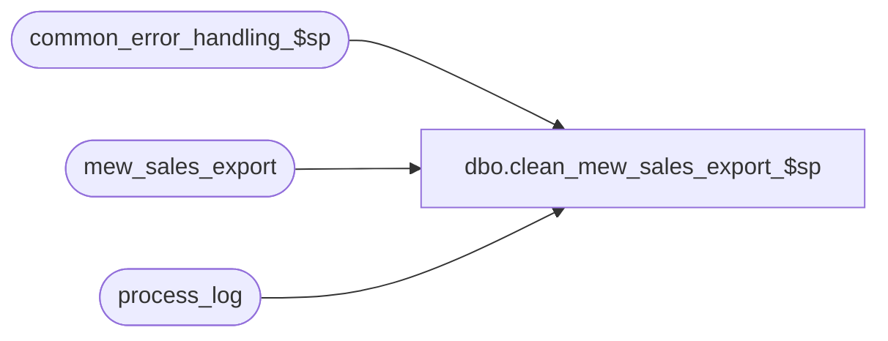

# dbo.clean_mew_sales_export_$sp

**Database:** auditworks  
**Server:** bedrockdb01  

## Architecture Diagram



## Table Dependencies

| Referenced Table |
|---|
| common_error_handling_$sp |
| mew_sales_export |
| process_log |

## Stored Procedure Code

```sql
create proc dbo.clean_mew_sales_export_$sp AS

/* 
PROC NAME: DEL_MEW_SALES_EXPORT_$sp 
     DESC: Deletes data from mew_sales_export table. Will keep 30 days of history. Will delete in batchs of 10000
	   Called by Smartview SUS Monitor. Created by Support to mantain mew_sales_export table.

23-FEB-04  Danng G   Author  	*/


DECLARE	@errmsg 			varchar(255),
	@errno 				integer,
	@message_id			int,
	@object_name			varchar(255),
	@operation_name			varchar(100),
	@process_name			varchar(100),
	@process_no			smallint,
        @rows_deleted                   integer,
        @cleanup_date                   datetime,
        @process_timestamp		float,
        @process_start_time		datetime,
        @process_end_time		datetime,
        @rows                           int,
        @transaction_count              int
        
   
 SELECT @process_start_time = getdate(),
        @cleanup_date = getdate() - 30,  --Will keep 30days of info in table
        @process_name = 'clean_mew_sales_export_$sp',
        @message_id = 201068,
        @process_no = 42,  -- Cleanup mew_sales_export
        @process_timestamp =  DATEPART ( mm, getdate() ) * 100000000000.0
			    + DATEPART ( dd, getdate() ) * 1000000000.0
			    + DATEPART ( hh, getdate() ) * 10000000.0
			    + DATEPART ( mi, getdate() ) * 100000.0
			    + DATEPART ( ss, getdate() ) * 1000.0
			    + DATEPART ( ms, getdate() )

 
 
 
 SELECT @rows = 10000, @transaction_count = 0
 WHILE @rows = 10000
   BEGIN
     SET ROWCOUNT 10000   -- delete in batchs of 10000
     DELETE mew_sales_export
     WHERE transaction_date < @cleanup_date
   
         SELECT @errno = @@error, 
                @rows  = @@rowcount,
                @transaction_count = @transaction_count + @@rowcount
        
        IF @errno <> 0
          BEGIN
            SELECT @errmsg = 'Unable to delete from mew_sales_export',
		   @object_name = 'mew_sales_export',
		   @operation_name = 'DELETE'
	      	   
            GOTO error
          END
     SET ROWCOUNT 0
    END  
 
 SELECT @process_end_time = getdate()
 
 INSERT process_log (
        process_no, 
        process_timestamp,
        process_start_time,
        process_end_time,
        transaction_count,
        process_status_flag,
        batch_process_id )
VALUES (
       42,
       @process_timestamp,
       @process_start_time,
       @process_end_time,
       @transaction_count,
       1,
       0 )
       
   SELECT @errno = @@error
    IF @errno <> 0
  BEGIN
    SELECT @errmsg = 'Failed to insert process_log.',
	   @object_name = 'process_log',
	   @operation_name = 'INSERT'
    GOTO error
  END    
  
 SET ROWCOUNT  0 
 RETURN  
 
error:
        SET ROWCOUNT 0
	EXEC common_error_handling_$sp @process_no, @errno, @errmsg, 0, @message_id, 
	@process_name, @object_name, @operation_name, 1
	
	RETURN
```

