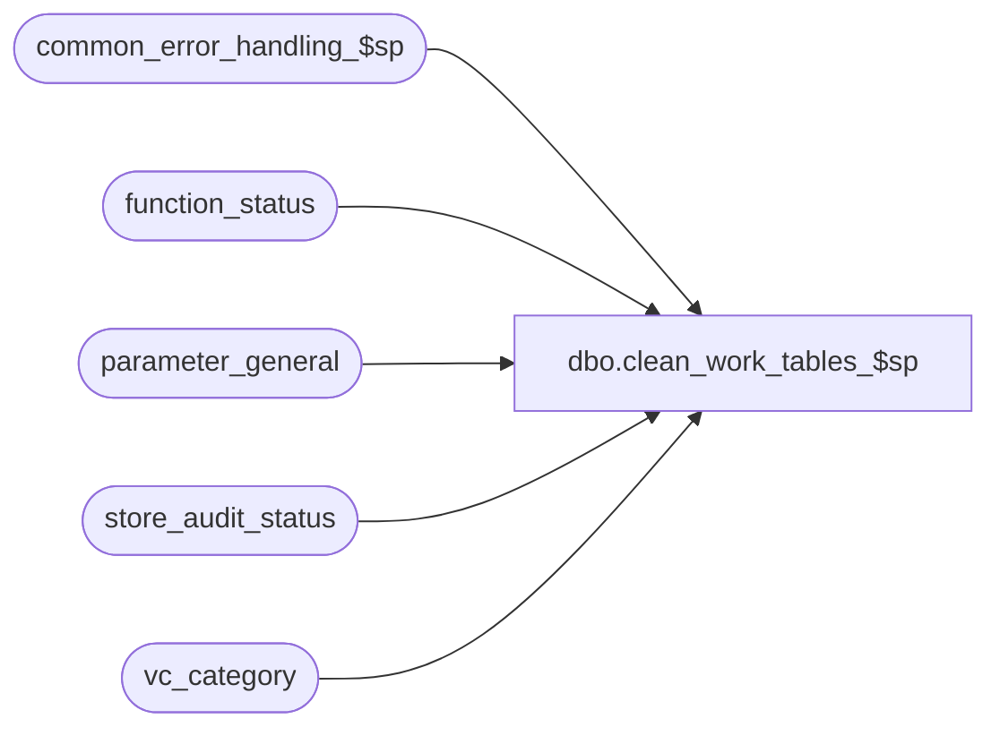

# dbo.clean_work_tables_$sp

**Database:** auditworks  
**Server:** bedrockdb01  

## Architecture Diagram



## Table Dependencies

| Referenced Table |
|---|
| common_error_handling_$sp |
| function_status |
| parameter_general |
| store_audit_status |
| vc_category |

## Stored Procedure Code

```sql
create proc dbo.clean_work_tables_$sp AS

/* 
 Desc: To clean up process_id dependent work tables with data left behind as a result of an abnormal disconnection or being victim of deadlock
       at a stage for which no function status entry yet exists.
       If called from S/A upgrade and there are no functions in progress nor locked store/dates, then truncate tables, 
       otherwise delete from them where the records are more than a day old and not in use.
       Called from upgrade process or from dayend housekeeping.

HISTORY
Date       Name     Defect Desc
Mar15,2016 Vicci  DAOM-191 Modified the daily cleanup (as opposed to the "on upgrade" cleanup) not to clean up work tables that don't have
                           a work_tb_entry_date_time column to avoid causing harm on the off chance some process is using a work table without
                           locking the store/date nor using function status and happens to be running at the same time as the cleanup.
Mar07,2016 Vicci  DAOM-191 This cleanup only becomes necessary since S/A switched to the use of GUIDs (not recycled) instead of session ID.

*/

DECLARE	@errno	 	        int,
        @errmsg		        nvarchar(2000),
        @errmsg2		nvarchar(2000),
        @process_id	        binary(16),
        @process_name		varchar(100),
	@process_no		smallint,
	@operation_name		varchar(100),
	@object_name		varchar(255),
	@message_id		int,
	@log_flag		tinyint,
	@user_id	  	int,
	@table_name		nvarchar(255),
	@datetime_column_name	nvarchar(255),
	@sql_command            nvarchar(2000),
	@upgrade_in_progress    tinyint,
	@truncate_flag		tinyint,
	@last_date_closed	smalldatetime,
	@cursor_open		tinyint

SELECT	@process_name = 'clean_work_tables_$sp',
	@message_id = 201068,
	@log_flag = 0,
	@user_id = -1,
	@process_no = 99,  --function_cleanup
	@truncate_flag = 0,
	@cursor_open = 0;

BEGIN TRY

  SELECT @errmsg         = 'Failed to determine if upgrade is in progress.',
         @object_name    = 'parameter_general',
         @operation_name = 'SELECT';
  SELECT @upgrade_in_progress = upgrade_in_progress, 
         @last_date_closed = last_date_closed
    FROM parameter_general;

  IF @upgrade_in_progress = 1
  BEGIN
    SELECT @errmsg         = 'Failed to determine if incomplete processes exist.',
           @object_name    = 'function_status',
           @operation_name = 'SELECT';
    IF EXISTS (SELECT 1 FROM function_status) OR EXISTS (SELECT 1 FROM store_audit_status WHERE sales_date > @last_date_closed AND (update_in_progress > 0 OR trickle_in_progress_flag > 0))
      SELECT @truncate_flag = 0;
    ELSE
      SELECT @truncate_flag = 1;
  END;  --IF @upgrade_in_progess = 1

  SELECT @errmsg         = 'Failed to define work_table_cleanup_crsr.',
         @object_name    = 'work_table_cleanup_crsr',
         @operation_name = 'DECLARE';
  DECLARE work_table_cleanup_crsr CURSOR FAST_FORWARD
      FOR
   SELECT t.name, d.name
     FROM vc_category v
  	  INNER JOIN sysobjects t
	     ON t.type = 'U' 
	    AND lower(t.name) = lower(v.tb_name)
	  INNER JOIN syscolumns c
	     ON t.id = c.id 
 	    AND lower(c.name) = 'process_id'
 	    AND lower(type_name(c.xtype)) = 'binary'
	  LEFT OUTER JOIN syscolumns d
	     ON t.id = c.id 
 	    AND lower(c.name) = 'work_tb_entry_date_time'
   WHERE v.tb_type = 'Work'
     AND (@upgrade_in_progress = 1 OR d.name IS NOT NULL)
   ORDER BY t.name;

  SELECT @operation_name = 'OPEN';
  OPEN work_table_cleanup_crsr;
  SELECT @cursor_open = 1;

  SELECT @operation_name = 'FETCH';
  FETCH work_table_cleanup_crsr
   INTO @table_name, @datetime_column_name

  WHILE @@fetch_status = 0 
  BEGIN

    SELECT @errmsg         = 'Failed to set @sql_command. ',
           @object_name    = '@sql_command',
           @operation_name = 'SELECT';
  IF @truncate_flag = 1
    BEGIN
      SELECT @sql_command = 'TRUNCATE TABLE ' + @table_name;
    END;
    ELSE
    BEGIN      
      SELECT @sql_command = '
        DELETE FROM ' + @table_name + ' 
         WHERE NOT EXISTS (SELECT 1 FROM function_status f WHERE f.process_id = ' + @table_name + '.process_id) 
           AND NOT EXISTS (SELECT 1 FROM store_audit_status s WHERE s.sales_date > ''' + convert(varchar, @last_date_closed) + ''' AND s.process_id = ' + @table_name + '.process_id AND (s.update_in_progress > 0 OR s.trickle_in_progress_flag > 0))
           ' + CASE WHEN @datetime_column_name IS NOT NULL 
                     THEN 'AND ' + @table_name + '.' + @datetime_column_name + ' < dateadd(dd, -1, getdate());'  
                     ELSE ';' END;
    END;  --ELSE of IF @truncate_flag = 1

    SELECT @errmsg         = 'Failed to execute dynamic sql:  ' +  @sql_command + '.  ',
           @object_name    = @table_name,
           @operation_name = CASE WHEN @truncate_flag = 1 THEN 'TRUNCATE TABLE' ELSE 'DELETE' END;
    EXEC(@sql_command);

    SELECT @errmsg         = 'Failed to define work_table_cleanup_crsr.',
           @object_name    = 'work_table_cleanup_crsr',
           @operation_name = 'FETCH';
    FETCH work_table_cleanup_crsr
     INTO @table_name, @datetime_column_name;
  END; --WHILE work_table_cleanup_crsr fetch OK

  SELECT @operation_name = 'CLOSE';
   CLOSE work_table_cleanup_crsr;
  SELECT @operation_name = 'DEALLOCATE';
   DEALLOCATE work_table_cleanup_crsr;
  SELECT @cursor_open = 0;

  RETURN;

general_error:
  SELECT @errno = ERROR_NUMBER(),
         @errmsg2 = @process_name + ':  ' + COALESCE(@errmsg, '') + ' Line: ' + CONVERT(nvarchar, ERROR_LINE()) + ', ' + ERROR_MESSAGE() ;

  IF @cursor_open = 1
  BEGIN
    CLOSE work_table_cleanup_crsr;
    DEALLOCATE work_table_cleanup_crsr;
  END;

  EXEC common_error_handling_$sp @process_no, @errno, @errmsg2, 0, @message_id, @process_name, @object_name, @operation_name, @log_flag, 1, 0, 
       null, 0, null, null, null, null, null, null, 0, @process_id, @user_id
  RETURN;

END TRY

BEGIN CATCH
  SELECT @errno = ERROR_NUMBER();
  IF @errmsg2 IS NULL
  BEGIN
    SELECT @errmsg2 = @process_name + ':  ' + COALESCE(@errmsg, '') + ' Line: ' + CONVERT(nvarchar, ERROR_LINE()) + ', ' + ERROR_MESSAGE();
  END;
  SELECT @errmsg = @errmsg2;  

  IF @cursor_open = 1
  BEGIN
    CLOSE work_table_cleanup_crsr;
    DEALLOCATE work_table_cleanup_crsr;
  END;

  EXEC common_error_handling_$sp @process_no, @errno, @errmsg2, 0, @message_id, @process_name, @object_name, @operation_name, @log_flag, 1, 0, 
       null, 0, null, null, null, null, null, null, 0, @process_id, @user_id

  
  RETURN;
END CATCH;
```

