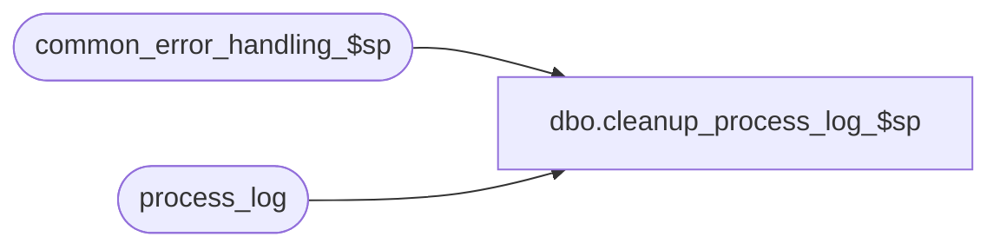

# dbo.cleanup_process_log_$sp

**Database:** auditworks  
**Server:** bedrockdb01  

## Architecture Diagram



## Table Dependencies

| Referenced Table |
|---|
| common_error_handling_$sp |
| process_log |

## Stored Procedure Code

```sql
create proc dbo.cleanup_process_log_$sp 

@process_no		smallint = 0,
@batch_process_id	tinyint = 0

AS

/* Proc Name: cleanup_process_log_$sp
   Description: To reset process_status_flag in process_log to 3 for
    aborted processes so that they do not appear to be in progress in Powerbuilder.
   If any errors occur, then continue anyway.
   Called from day_end_posting_$sp and edit_cleanup_$sp.

HISTORY:
Date     Name            Def# Desc
Jan04,11 Paul          105313 Use unicode datatypes
May03,02 Ian          1-CD0IX Add R3 Error Handling
Oct29,97 Paul                 author
*/

DECLARE @yesterdays_date smalldatetime,
        -- error handling
	@process_name		nvarchar(100),
	@operation_name		nvarchar(100),
	@object_name		nvarchar(255),
	@message_id		int,
	@log_flag		tinyint,
	@errno                  int,
	@errmsg                 nvarchar(255)

SELECT	@process_name = 'cleaup_process_log_$sp',
	@message_id = 201068,
	@log_flag = 0
	
IF @process_no >= 1
  BEGIN

   UPDATE process_log
    SET process_status_flag = 3
     WHERE process_no = @process_no
     AND process_status_flag = 1
     AND batch_process_id = @batch_process_id

   SELECT @errno = @@error
   IF @errno !=0
   BEGIN
     SELECT @errmsg         = 'Failed to update process_log (today)',
            @object_name    = 'process_log',
            @operation_name = 'UPDATE'
     GOTO error
   END
  
  END
ELSE
  BEGIN

   SELECT @yesterdays_date = DATEADD(dd, -1, getdate())

   UPDATE process_log
    SET process_status_flag = 3
     WHERE process_status_flag = 1
     AND process_start_time <= @yesterdays_date

   SELECT @errno = @@error
   IF @errno !=0
   BEGIN
     SELECT @errmsg         = 'Failed to update process_log (yesterday)',
            @object_name    = 'process_log',
            @operation_name = 'UPDATE'
     GOTO error
   END
  
  END

RETURN

error:

	EXEC common_error_handling_$sp 36, @errno, @errmsg, 0, @message_id,
		@process_name, @object_name, @operation_name, @log_flag
	RETURN
```

