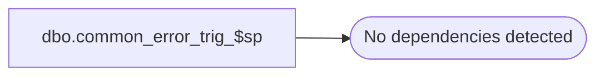

# dbo.common_error_trig_$sp

**Database:** auditworks  
**Server:** bedrockdb01  

## Architecture Diagram



## Table Dependencies

_No table dependencies detected._

## Stored Procedure Code

```sql
create proc dbo.common_error_trig_$sp @error_code		int, -- mandatory
@error_msg		nvarchar(2000), --nullable, but should be set for business rules
@trigger_name		nvarchar(40), --mandatory
@sys_error_msg		nvarchar(2000) = null, /* nullable, contains captured system error message */
@line_number		int = 0,
@memo1			nvarchar(300) = NULL,  --note: The memo fields are optional and are only used upstream for inserting the process error log to
@memo2			nvarchar(300) = NULL,  --      allow the UI to parse the Resource Mgr string associated with the business rule in message_resource_xref.
@memo3			nvarchar(300) = NULL,  --      They are expected to have already been incorporated in the @error_msg passed in as well (the latter is not displayed)
@rollback_flag		tinyint = 1

AS

/* Proc Name: common_error_trig_$sp
   Desc: To raise errors from triggers using a common format.
         For non-business rule errors, will append @error_code, @trigger_name, @error_msg and @sys_error_msg into one message for raiserror.
         For business rules, the memo fields are optional and it is desirable, for display purposes, that they not contain long strings.

   NOTES: 1) ONLY message_id (error_code) values between 201500 and 202499 can be used for SA backend raiserror (Oracle limitation).
          2) Any business rule messages that are used for raiserror must exist in sys.messages (use sp_addmessage and in a upgr on SA message table)
          3) Using sp_addmessage requires execute privileges on that proc in master db
          4) this proc is identical between SA5.0 and SA5.1 and is compatible with SQL2005 and higher.

HISTORY
Date     Name           Def# Desc
Oct23,13 Vicci/Paul   145958 always pass @error_msg, memo1, memo2, memo3 to business rule raise error. Call sp_addmessage twice. 
                              (will be ignored by SQL if no %s token exists inside the message text in sys.messages)
Oct15,13 Paul         145958 added memo1, memo2, memo3 string columns to support using token inside business rule message
Oct11,13 Paul         145958 Author

*/

DECLARE
  @business_rule		tinyint,
  @raise_error		int,
  @lang_id		smallint,
  @message		nvarchar(255),
  @sep1			nvarchar(5),
  @sep2			nvarchar(6),
  @sep3			nvarchar(4),
  @sep4			nvarchar(5),
  @sep5			nvarchar(1);

/* Not using a general try catch inside this proc in order to avoid complications and in order to minimize
   the possibility of not displaying / reporting the original error from the calling trigger.
 */

IF @@trancount > 0 AND @rollback_flag >= 1
  ROLLBACK TRANSACTION;

SELECT @business_rule = 0,
	@raise_error = 201068,
	@sep1 = '<SQL>',
	@sep2 = '</SQL>',
	@sep3 = '<LN>',
	@sep4 = '</LN>',
	@sep5 = ':'; -- for readability in I-Service

/* safety logic. Both @trigger_name and @error_code are supposed to be set by the calling trigger. */
IF @error_code IS NULL
  SELECT @error_code = 0;

IF @trigger_name IS NULL
  SELECT @trigger_name = N'Unknown Trigger';

/* 201068 is reserved as a default error code for system errors in process_error_log, i.e. it is not a business rule */

IF @error_code >= 201500 AND @error_code < 203000
  SELECT @business_rule = 1,
  	 @raise_error = @error_code;

-- uncomment the following line if tracing is needed for investigation purposes
-- PRINT '@business_rule=' + CONVERT(varchar, @business_rule) + '-' + @trigger_name;


SELECT @memo1 = CASE WHEN @memo1 IS NOT NULL THEN '<memo1>' + @memo1 + '</memo1>' ELSE '' END,
       @memo2 = CASE WHEN @memo2 IS NOT NULL THEN '<memo2>' + @memo2 + '</memo2>' ELSE '' END,
       @memo3 = CASE WHEN @memo3 IS NOT NULL THEN '<memo3>' + @memo3 + '</memo3>' ELSE '' END;

/* Now display the error code and/or the error message

	   As of SQL2012, only the raiserror syntax with brackets can be used.
	   If the message to be displayed is a business rule, then raise error with the business rule number
	   in order to allow calling objects to see the business rule number;
	   otherwise raise error as a string using the passed in error message.
	   If the message for a business rule number does not exist in sys.messages, then that business rule
	   number cannot be used to raiserror because it would get replaced by a system error number in SQL 2012.

  Avoid appending trigger_name twice when general error trap fires after business error trap */
IF CHARINDEX(@trigger_name, @error_msg) = 0 OR @business_rule <> 1
  SELECT @error_msg = CONVERT(nvarchar, @error_code) + @sep5 + @trigger_name + @sep5 + COALESCE(@error_msg,' ');

IF @line_number > 0 
  SELECT @error_msg = @error_msg + @sep3 + CONVERT(nvarchar, @line_number) + @sep4;

IF @sys_error_msg IS NOT NULL
BEGIN -- append message separators only when the sys_error_msg does not already contain separators
  IF CHARINDEX(@sep1, @sys_error_msg) = 0
    SELECT @error_msg = @error_msg + @sep1 + @sys_error_msg + @sep2;
  ELSE
    SELECT @error_msg = @error_msg + @sys_error_msg;
END;

/* Verify that the business rule message_id exists in sys.messages, and add if it does not.
   The sp_addmessage could fail because it requires the SQL user to have permission to exec that proc or to have admin permissions. */

IF @business_rule = 1
BEGIN
  IF NOT EXISTS (SELECT 1 FROM sys.messages
                  WHERE message_id = @raise_error
                    AND language_id = 1033)
  BEGIN
    BEGIN TRY
      EXEC sp_addmessage @msgnum = @raise_error, 
                       @severity = 16, 
                       @msgtext = '%s', 
                       @lang = 'us_english';
    END TRY
    BEGIN CATCH;
      SELECT @business_rule = 0;
    END CATCH;
  END;

   /* If the system or session language is not US English, then also add the message using the session language */
  IF @@langid <> 0 -- not 'us_english'
  BEGIN
    SELECT @lang_id = msglangid
      FROM sys.syslanguages
     WHERE name = @@language;

    IF NOT EXISTS (SELECT 1 FROM sys.messages
                  WHERE message_id = @raise_error
                    AND language_id = @lang_id)
    BEGIN
     BEGIN TRY
      EXEC sp_addmessage @msgnum = @raise_error, 
                       @severity = 16, 
                       @msgtext = '%s',
                       @replace = 'replace';
       /* when adding messages for other languages, could use %1! which refers to the first token in the US English message */
     END TRY
     BEGIN CATCH;
      SELECT @business_rule = 0;
     END CATCH;
    END; -- If not exists
  END; -- If @@langid <> 0
END; -- If @business_rule = 1


/* set this off (no harm) in case a calling object turned it on */
SET NOCOUNT OFF;

IF @business_rule = 1
BEGIN
  SELECT @error_msg = COALESCE(@error_msg,' ') + @memo1 + @memo2 + @memo3;
  RAISERROR (@raise_error, 16, 1, @error_msg);  /* Note, arguments that are not expected by message are simply ignored, they do no harm.*/
END;
ELSE
  RAISERROR (@error_msg, 16, 1);  /* System Errors will be reported with SQL error code = 50000 */

RETURN;
```

