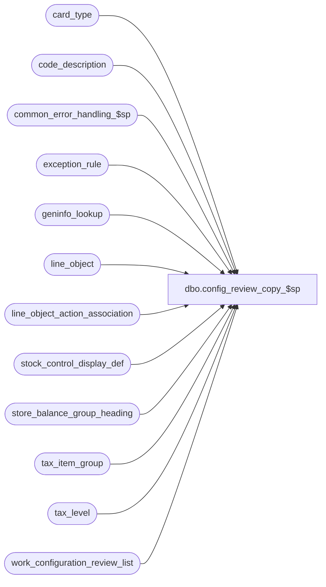

# dbo.config_review_copy_$sp

**Database:** auditworks  
**Server:** bedrockdb01  

## Architecture Diagram



## Table Dependencies

| Referenced Table |
|---|
| card_type |
| code_description |
| common_error_handling_$sp |
| exception_rule |
| geninfo_lookup |
| line_object |
| line_object_action_association |
| stock_control_display_def |
| store_balance_group_heading |
| tax_item_group |
| tax_level |
| work_configuration_review_list |

## Stored Procedure Code

```sql
create proc dbo.config_review_copy_$sp  
(  @dbname nvarchar(255), @srvname nvarchar(255) = null, @debug_mode tinyint = 0, @session_id binary(16) = @@spid)
AS  

/* 
PROC NAME: config_review_copy_$sp
     DESC: Called from PowerBuild Table Maintenance's Review Approved Auto-Configurations function.
           Copies the review entries selected to the database selected.

*************  MUST BE SCRIPTED WITH SET ANSI_NULLS ON ****************

config_type:  1=line_object, 2=code_description, 3=geninfo_lookup, 4=line_object_action_attachment
selected_flag: 1=review, 2=approve, 3=copy, 4=copied, 5=existing definition updated 					
           
HISTORY:
Date     Name         Defect#  Description
Apr12,12 Paul          134132  prevent error 2627 by setting dummy_transaction_category on insert
Jan08,09 Paul          107351  added fastforward cursor hints
Apr27,05 David        DV-1202  Add quotes around card_type, error trap.
Apr22,05 Sab          DV-1202  On INSERT to exception_rule removed column exception_description.
Mar07,05 Vicci        DV-1202  Author

*/

DECLARE @errno			int,
	@errmsg			nvarchar(255),
	@process_no		smallint,
	@object_name		nvarchar(255),	
	@operation_name		nvarchar(100),
	@sql_command 		nvarchar(4000),
	@ldd_sql_command 	nvarchar(4000),
	@destination 		nvarchar(255),
	@config_type		tinyint,
	@item_type		tinyint,
	@item_code		smallint,
	@rowcount		int,
	@resource_id		numeric(12,0),
	@display_def_id		smallint,
	@tax_item_group_id      numeric(10,0),
	@tax_item_group_code    nvarchar(10)

SELECT @process_no = 292

CREATE TABLE #ldd_list (src_resource_id numeric(12,0) null, 
			table_name nvarchar(255) null,
			code smallint null, code_type smallint null,
			dest_resource_id numeric(12,0) null, 
			src_col1_resource_id numeric(12,0) null, 
			src_col2_resource_id numeric(12,0) null, 
			src_col3_resource_id numeric(12,0) null,
			dest_col1_resource_id numeric(12,0) null, 
			dest_col2_resource_id numeric(12,0) null, 
			dest_col3_resource_id numeric(12,0) null)

  SELECT @errno = @@error
  IF @errno != 0
  BEGIN
    SELECT @errmsg = 'Failed to create table #ldd_list.',
           @object_name = '#ldd_list',
           @operation_name = 'CREATE'     
    GOTO error
  END

CREATE TABLE #code_type_list(code_type tinyint not null)

  SELECT @errno = @@error
  IF @errno != 0
  BEGIN
    SELECT @errmsg = 'Failed to create table #code_type_list.',
           @object_name = '#code_type_list',
           @operation_name = 'CREATE'     
    GOTO error
  END

CREATE TABLE #code_list(code smallint not null)

  SELECT @errno = @@error
  IF @errno != 0
  BEGIN
    SELECT @errmsg = 'Failed to create table #code_list.',
           @object_name = '#code_list',
           @operation_name = 'CREATE'     
    GOTO error
  END

IF @srvname IS NULL --
  SELECT @destination = @dbname + '.dbo.'
ELSE
BEGIN
  SELECT @destination = @srvname + '.' + @dbname + '.dbo.'
  SET ANSI_WARNINGS ON
END

IF @session_id IS NULL -- 
  SELECT @session_id = @@spid 

-- Since triggers will only update the base_language_id, run @ldd_sql_command to update the descriptions for all language_ids.
SELECT @ldd_sql_command = N'UPDATE ' + @destination + 'language_dependent_description  
      			       SET display_description = ldd.display_description,
      			           system_description = ldd.system_description
      			      FROM #ldd_list w, language_dependent_description ldd, ' + 
      			           @destination + 'language_dependent_description dest 
      			     WHERE (   (w.src_resource_id = ldd.resource_id AND w.dest_resource_id = dest.resource_id)
      			             OR (w.src_col1_resource_id = ldd.resource_id AND w.dest_col1_resource_id = dest.resource_id)
      			             OR (w.src_col2_resource_id = ldd.resource_id AND w.dest_col2_resource_id = dest.resource_id)
      			             OR (w.src_col3_resource_id = ldd.resource_id AND w.dest_col3_resource_id = dest.resource_id) )
      			           AND ldd.language_id = dest.language_id'

  SELECT @errno = @@error
  IF @errno != 0
  BEGIN
    SELECT @errmsg = 'Failed to set @ldd_sql_command.',
           @object_name = '@ldd_sql_command',
           @operation_name = 'SELECT'     
    GOTO error
  END

DECLARE config_copy_cursor CURSOR FAST_FORWARD
  FOR
  SELECT w.config_type, w.item_type, w.item_code 
    FROM work_configuration_review_list w WITH (NOLOCK)
   WHERE w.selected_flag = 3
     AND w.session_id = @session_id

  SELECT @errno = @@error
  IF @errno != 0
  BEGIN
    SELECT @errmsg = 'Failed to declare config_copy_cursor.',
           @object_name = 'config_copy_cursor',
           @operation_name = 'DECLARE'     
    GOTO error
  END

OPEN config_copy_cursor

  SELECT @errno = @@error
  IF @errno != 0
  BEGIN
    SELECT @errmsg = 'Failed to open config_copy_cursor.',
           @object_name = 'config_copy_cursor',
           @operation_name = 'OPEN'     
    GOTO error
  END

FETCH config_copy_cursor
 INTO @config_type, @item_type, @item_code
   
WHILE @@fetch_status = 0 
BEGIN
  IF @debug_mode = 1 
    SELECT 'config_type:  ' + CONVERT(nvarchar, @config_type) + ', item_type:  ' + CONVERT(nvarchar,  @item_type)+ ', item_code: ' + CONVERT(nvarchar, @item_code)

  SELECT @resource_id = NULL
  TRUNCATE TABLE #ldd_list
  TRUNCATE TABLE #code_type_list
  TRUNCATE TABLE #code_list

  IF @config_type = 1
  BEGIN
    SELECT @sql_command = N'INSERT INTO ' + @destination + 'line_object(line_object, line_object_type, line_object_description,default_tax_rate_code, 
 	 object_export_code, tax_item_group_id, proration_method, lookup_pos_code, 
	 pos_description_token_list, disregard_pos_descr_change, lookup_partial_pos_code, 
	 active_flag, auto_config_verified)
	 SELECT line_object, line_object_type, line_object_description,default_tax_rate_code, 
	 object_export_code, tax_item_group_id, proration_method, lookup_pos_code, 
	 pos_description_token_list, disregard_pos_descr_change, lookup_partial_pos_code, 
	 active_flag, 0
	  FROM line_object o
	 WHERE line_object = ' + CONVERT(nvarchar, @item_code) + ' 
	   AND NOT EXISTS (SELECT 1 
	                     FROM ' + @destination + 'line_object dest_o
	                    WHERE (dest_o.line_object = o.line_object)
	                       OR (dest_o.lookup_pos_code = o.lookup_pos_code) )
	 SELECT @rowcount = @@rowcount
	 SELECT @resource_id = resource_id
   	   FROM ' + @destination + 'line_object
      	  WHERE line_object = ' + CONVERT(nvarchar, @item_code)

    IF @debug_mode = 1 select @sql_command      
    EXEC sp_executesql @sql_command, N'@rowcount int OUT, @resource_id numeric(12,0) OUT', @rowcount OUT, @resource_id OUT 

      SELECT @errno = @@error
      IF @errno != 0
      BEGIN
        SELECT @errmsg = 'Failed to exec sp_executesql (insert line_object).',
               @object_name = 'sp_executesql',
               @operation_name = 'EXEC'     
        GOTO error
      END

    INSERT INTO #ldd_list(table_name, src_resource_id, code, code_type, dest_resource_id)
    SELECT 'line_object', resource_id, line_object, line_object_type, @resource_id
      FROM line_object
     WHERE line_object = @item_code

      SELECT @errno = @@error
      IF @errno != 0
      BEGIN
        SELECT @errmsg = 'Failed to insert into #ldd_list.',
               @object_name = '#ldd_list',
               @operation_name = 'INSERT'     
        GOTO error
      END
     
    IF @rowcount = 0
    BEGIN
      SELECT @sql_command = NULL --
      SELECT @sql_command = N'UPDATE ' + @destination + 'line_object  
      			     SET line_object_description = ''' + line_object_description + ''',
      			         pos_description_token_list = ''' + pos_description_token_list + ''',
      			         auto_config_verified = sign(IsNull(auto_config_verified, 1)) * 2
      			     WHERE line_object = ' + CONVERT(nvarchar, @item_code) + '
 			       AND (line_object_description <> ''' + line_object_description + '''
      			          OR pos_description_token_list <> ''' + pos_description_token_list + ''')
      			       AND lookup_pos_code = ''' + lookup_pos_code + '''
                             SELECT @rowcount = @@rowcount'
    	FROM line_object 
       WHERE line_object = @item_code
       
      IF @debug_mode = 1 select @sql_command      
      EXEC sp_executesql @sql_command, N'@rowcount int OUT', @rowcount OUT

        SELECT @errno = @@error
        IF @errno != 0
        BEGIN
          SELECT @errmsg = 'Failed to exec sp_executesql (update line_object).',
                 @object_name = 'sp_executesql',
                 @operation_name = 'EXEC'     
          GOTO error
        END
      
      IF @rowcount > 0 
      BEGIN
        UPDATE work_configuration_review_list 
           SET selected_flag = 5 
         WHERE config_type = @config_type AND item_code = @item_code
         
        SELECT @errno = @@error
        IF @errno != 0
        BEGIN
          SELECT @errmsg = 'Failed to set selected_flag to 5.',
                 @object_name = 'work_configuration_review_list',
                 @operation_name = 'UPDATE'     
          GOTO error
        END
      END -- IF @rowcount > 0 

      EXEC sp_executesql @ldd_sql_command

        SELECT @errno = @@error
        IF @errno != 0
        BEGIN
          SELECT @errmsg = 'Failed to exec sp_executesql @ldd_sql_command (line_object).',
                 @object_name = 'sp_executesql',
                 @operation_name = 'EXEC'     
          GOTO error
        END

      TRUNCATE TABLE #ldd_list
      
        SELECT @errno = @@error
        IF @errno != 0
        BEGIN
          SELECT @errmsg = 'Failed to truncate #ldd_list.',
                 @object_name = '#ldd_list',
                 @operation_name = 'TRUNCATE'     
          GOTO error
        END
    END -- if @rowcount = 0 i.e. not inserted
    ELSE
    BEGIN -- else @rowcount > 0
      UPDATE work_configuration_review_list 
         SET selected_flag = 4 
       WHERE config_type = @config_type 
         AND item_code = @item_code

        SELECT @errno = @@error
        IF @errno != 0
        BEGIN
          SELECT @errmsg = 'Failed to set selected_flag to 4.',
                 @object_name = 'work_configuration_review_list',
                 @operation_name = 'UPDATE'     
          GOTO error
        END

      EXEC sp_executesql @ldd_sql_command

        SELECT @errno = @@error
        IF @errno != 0
        BEGIN
          SELECT @errmsg = 'Failed to exec sp_executesql @ldd_sql_command (@resource_id).',
                 @object_name = 'sp_executesql',
                 @operation_name = 'EXEC'     
          GOTO error
        END

      SELECT @sql_command = N'INSERT INTO ' + @destination + 'line_object_action_association(
				      transaction_category,
				      line_object,
				      line_action,
				      line_object_type,
				      db_cr_none,
				      gl_account_segment1,
				      gl_account_segment2,
				      gl_account_segment3,
				      gl_account_segment4,
				      gl_account_segment5,
				      gl_account_segment6,
				      gl_account_segment7,
				      gl_account_segment8,
				      lookup_segment1,
				      lookup_segment2,
				      lookup_segment3,
				      lookup_segment4,
				      lookup_segment5,
				      lookup_segment6,
				      lookup_segment7,
				      lookup_segment8,
				      reference_type,
				      discountable_group,
				      media_category,
				      exception_reason,
				      basic_subcode,
				      update_register_activity,
				      store_balance_group,
				      reference_no_option,
				      available_as_link_attachment,
				      active_flag,
				      auto_config_verified)  
      			      SELECT transaction_category,
				      line_object,
				      line_action,
				      line_object_type,
				      db_cr_none,
				      gl_account_segment1,
				      gl_account_segment2,
				      gl_account_segment3,
				      gl_account_segment4,
				      gl_account_segment5,
				    gl_account_segment6,
				      gl_account_segment7,
				      gl_account_segment8,
				      lookup_segment1,
				   lookup_segment2,
				      lookup_segment3,
				      lookup_segment4,
				      lookup_segment5,
				      lookup_segment6,
				      lookup_segment7,
				      lookup_segment8,
				      reference_type,
				      discountable_group,
				      media_category,
				      exception_reason,
				      basic_subcode,
				      update_register_activity,
				      store_balance_group,
				      reference_no_option,
				      available_as_link_attachment,
				      active_flag,
				      0 
      			        FROM line_object_action_association
      			       WHERE line_object = ' + CONVERT(nvarchar, @item_code)

      IF @debug_mode = 1 select @sql_command
      EXEC sp_executesql @sql_command
      
        SELECT @errno = @@error
        IF @errno != 0
        BEGIN
          SELECT @errmsg = 'Failed to exec sp_executesql @sql_command (line_object_action_association).',
                 @object_name = 'sp_executesql',
                 @operation_name = 'EXEC'     
          GOTO error
        END

      INSERT INTO #ldd_list(table_name, src_resource_id, code, code_type) 
      SELECT DISTINCT 'code_description', c.resource_id, c.code, c.code_type
      FROM line_object_action_association x, code_description c
      WHERE x.line_object = @item_code
        AND x.reference_type <> 0
        AND c.code_type = 22
        AND x.reference_type = c.code

        SELECT @errno = @@error
        IF @errno != 0
        BEGIN
          SELECT @errmsg = 'Failed to insert #ldd_list (reference_type).',
                 @object_name = '#ldd_list',
                 @operation_name = 'INSERT'     
          GOTO error
        END
        
      INSERT INTO #ldd_list(table_name, src_resource_id, code, code_type) 
      SELECT DISTINCT 'code_description', c.resource_id, c.code, c.code_type
      FROM line_object_action_association x, code_description c
      WHERE x.line_object = @item_code
        AND x.media_category <> 0
        AND (   (x.line_object_type IN (6, 20) AND c.code_type = 46)
             OR (x.line_object_type NOT IN (6, 20) AND c.code_type = 48))
        AND x.media_category = c.code

        SELECT @errno = @@error
        IF @errno != 0
        BEGIN
          SELECT @errmsg = 'Failed to insert #ldd_list (media_category).',
                 @object_name = '#ldd_list',
                 @operation_name = 'INSERT'     
          GOTO error
        END

      INSERT INTO #ldd_list(table_name, src_resource_id, code, code_type) 
      SELECT DISTINCT 'exception_rule', NULL, r.exception_rule, 0
      FROM line_object_action_association x, exception_rule r
      WHERE x.line_object = @item_code
        AND IsNull(x.exception_reason, 0) <> 0
        AND x.exception_reason = r.exception_rule

        SELECT @errno = @@error
        IF @errno != 0
        BEGIN
          SELECT @errmsg = 'Failed to insert #ldd_list (exception_rule).',
                 @object_name = '#ldd_list',
                 @operation_name = 'INSERT'     
          GOTO error
        END

      INSERT INTO #ldd_list(table_name, src_resource_id, code, code_type, src_col1_resource_id, src_col2_resource_id, src_col3_resource_id) 
      SELECT DISTINCT 'store_balance_group_heading', g.resource_id, g.store_balance_group, 0, g.column1_resource_id, g.column2_resource_id, g.column3_resource_id
      FROM line_object_action_association x, store_balance_group_heading g
      WHERE x.line_object = @item_code
        AND IsNull(x.store_balance_group, 0) NOT IN (0,1)
        AND x.store_balance_group = g.store_balance_group

        SELECT @errno = @@error
      IF @errno != 0
        BEGIN
          SELECT @errmsg = 'Failed to insert #ldd_list (store_balance_group_heading).',
                 @object_name = '#ldd_list',
                 @operation_name = 'INSERT' 
          GOTO error
        END
            
      SELECT @sql_command = N'INSERT INTO ' + @destination + 'code_description(
      				     code_type,
      				     code,
      				     code_display_descr,
      				     code_meaning_control,
      				     code_system_descr,
      				     min_compatible_exe,
      				     alpha_code,
      				     active_flag,
      				     auto_config_verified)  
      			      SELECT c.code_type,
      				     c.code,
      				     c.code_display_descr,
      				     c.code_meaning_control,
      				     c.code_system_descr,
      				     c.min_compatible_exe,
      				     c.alpha_code,
      				     c.active_flag,
      				     0
      			        FROM #ldd_list l, code_description c
      			       WHERE l.table_name = ''code_description''
      			         AND l.code_type = c.code_type
      			         AND l.code = c.code
      			         AND (l.code * 100000) + l.code_type NOT IN (SELECT (d.code * 100000) + d.code_type
      			         					       FROM '+ @destination + 'code_description d
      			         					      WHERE l.code_type = d.code_type
      			         					        AND l.code = d.code)'
      			         					      
      IF @debug_mode = 1 select @sql_command
      EXEC sp_executesql @sql_command

        SELECT @errno = @@error
        IF @errno != 0
        BEGIN
          SELECT @errmsg = 'Failed to exec sp_executesql @sql_command (INSERT code_description).',
                 @object_name = 'sp_executesql',
                 @operation_name = 'EXEC'     
          GOTO error
        END

      SELECT @sql_command = N'UPDATE #ldd_list
      				 SET dest_resource_id = dest.resource_id
      				FROM ' + @destination + 'code_description dest
      				WHERE #ldd_list.table_name = ''code_description''
      				  AND #ldd_list.code_type = dest.code_type
      				  AND #ldd_list.code = dest.code'      	
      				  			  
      IF @debug_mode = 1 select @sql_command
      EXEC sp_executesql @sql_command

        SELECT @errno = @@error
        IF @errno != 0
        BEGIN
          SELECT @errmsg = 'Failed to exec sp_executesql @sql_command (UPDATE #ldd_list).',
                 @object_name = 'sp_executesql',
                 @operation_name = 'EXEC'     
          GOTO error
        END

      SELECT @sql_command = N'INSERT INTO ' + @destination + 'exception_rule(
					exception_rule,
					exception_name,
					exception_type,
					transaction_line_flag,
					ACTV)  
      			      SELECT    r.exception_rule,
					r.exception_name,
					r.exception_type,
					r.transaction_line_flag,
					r.ACTV
      			        FROM #ldd_list l, exception_rule r
      			       WHERE l.table_name = ''exception_rule''
      			         AND l.code = r.exception_rule
      			         AND l.code NOT IN (SELECT d.exception_rule
      			         		      FROM '+ @destination + 'exception_rule d
      			         		     WHERE l.code = d.exception_rule)'		

      IF @debug_mode = 1 select @sql_command
      EXEC sp_executesql @sql_command

        SELECT @errno = @@error
        IF @errno != 0
        BEGIN
          SELECT @errmsg = 'Failed to exec sp_executesql @sql_command (INSERT exception_rule).',
                 @object_name = 'sp_executesql',
                 @operation_name = 'EXEC'     
          GOTO error
        END
      
      SELECT @sql_command = N'UPDATE #ldd_list
      				 SET dest_resource_id = dest.resource_id
      				FROM ' + @destination + 'exception_rule dest
      				WHERE #ldd_list.table_name = ''exception_rule''
      				  AND #ldd_list.code = dest.exception_rule'

      IF @debug_mode = 1 select @sql_command
      EXEC sp_executesql @sql_command

        SELECT @errno = @@error
        IF @errno != 0
        BEGIN
      SELECT @errmsg = 'Failed to exec sp_executesql @sql_command (UPDATE #ldd_list exception_rule).',
                 @object_name = 'sp_executesql',
                 @operation_name = 'EXEC'     
          GOTO error
        END

      SELECT @sql_command = N'INSERT INTO ' + @destination + 'store_balance_group_heading(
					store_balance_group,
					store_balance_section,
					store_balance_group_descr,
					column1_heading,
					column2_heading,
					column3_heading)  
      			      SELECT 	store_balance_group,
					store_balance_section,
					store_balance_group_descr,
					column1_heading,
					column2_heading,
					column3_heading
      			        FROM #ldd_list l, store_balance_group_heading g
      			       WHERE l.table_name = ''store_balance_group_heading''
      			         AND l.code = g.store_balance_group
      			         AND l.code NOT IN (SELECT g.store_balance_group
      			         		      FROM '+ @destination + 'store_balance_group_heading d
      			         		     WHERE l.code = d.store_balance_group)'		

      IF @debug_mode = 1 select @sql_command
      EXEC sp_executesql @sql_command

        SELECT @errno = @@error
        IF @errno != 0
        BEGIN
          SELECT @errmsg = 'Failed to exec sp_executesql @sql_command (INSERT store_balance_group_heading).',
                 @object_name = 'sp_executesql',
                 @operation_name = 'EXEC'     
          GOTO error
        END
      
      SELECT @sql_command = N'UPDATE #ldd_list
      				 SET dest_resource_id = dest.resource_id,
      				     dest_col1_resource_id = dest.column1_resource_id,
      				     dest_col2_resource_id = dest.column2_resource_id,
      				     dest_col3_resource_id = dest.column3_resource_id
      				FROM ' + @destination + 'store_balance_group_heading dest
      				WHERE #ldd_list.table_name = ''store_balance_group_heading''
      				  AND #ldd_list.code = dest.store_balance_group'

      IF @debug_mode = 1 select @sql_command
      EXEC sp_executesql @sql_command

        SELECT @errno = @@error
        IF @errno != 0
        BEGIN
          SELECT @errmsg = 'Failed to exec sp_executesql @sql_command (UPDATE #ldd_list store_balance_group_heading).',
                 @object_name = 'sp_executesql',
                 @operation_name = 'EXEC'     
          GOTO error
        END

      SELECT @tax_item_group_code = null --
      SELECT @tax_item_group_code = g.tax_item_group_code
        FROM line_object o, tax_item_group g
       WHERE o.line_object = @item_code
         AND o.tax_item_group_id IS NOT NULL -- 
         AND o.tax_item_group_id = g.tax_item_group_id
         
      IF @tax_item_group_code IS NOT NULL --
      BEGIN
        SELECT @sql_command = N'INSERT into ' + @destination + 'tax_item_group(
                           	     tax_item_group_code,
                           	     tax_item_group_description)
      			      SELECT tax_item_group_code,
                           	     tax_item_group_description
      				FROM tax_item_group g
      			       WHERE tax_item_group_code = ''' + @tax_item_group_code + '''
      			         AND NOT EXISTS (SELECT 1
      			                           FROM ' + @destination + 'tax_item_group dest_g
      						  WHERE g.tax_item_group_code = dest_g.tax_item_group_code)
      			      SELECT @tax_item_group_id = dest_g.tax_item_group_id
      			        FROM ' + @destination + 'tax_item_group dest_g
      			       WHERE dest_g.tax_item_group_code =  ''' + @tax_item_group_code + ''''

        IF @debug_mode = 1 select @sql_command
        EXEC sp_executesql @sql_command, N'@tax_item_group_id numeric(10,0) OUT', @tax_item_group_id OUT 

        SELECT @errno = @@error
        IF @errno != 0
        BEGIN
          SELECT @errmsg = 'Failed to exec sp_executesql @sql_command (INSERT tax_item_group).',
                 @object_name = 'sp_executesql',
		  @operation_name = 'EXEC'     
          GOTO error
        END

        SELECT @sql_command = N'UPDATE ' + @destination + 'line_object
                                 SET tax_item_group_id = ' + CONVERT(nvarchar, @tax_item_group_id) + '
	 WHERE line_object = ' + CONVERT(nvarchar, @item_code)

        IF @debug_mode = 1 select @sql_command
        EXEC sp_executesql @sql_command
        
        SELECT @errno = @@error
        IF @errno != 0
        BEGIN
          SELECT @errmsg = 'Failed to exec sp_executesql @sql_command (line_object.tax_item_group_id).',
                 @object_name = 'sp_executesql',
                 @operation_name = 'EXEC'     
          GOTO error
        END
      END -- if @tax_item_group_code IS NOT NULL
      
      EXEC sp_executesql @ldd_sql_command

        SELECT @errno = @@error
        IF @errno != 0
        BEGIN
          SELECT @errmsg = 'Failed to exec sp_executesql @ldd_sql_command (2).',
                 @object_name = 'sp_executesql',
                 @operation_name = 'EXEC'     
          GOTO error
        END
      
      TRUNCATE TABLE #ldd_list

        SELECT @errno = @@error
        IF @errno != 0
        BEGIN
          SELECT @errmsg = 'Failed to truncate #ldd_list (2).',
                 @object_name = '#ldd_list',
                 @operation_name = 'TRUNCATE'     
          GOTO error
        END
      
      SELECT @sql_command = N'INSERT INTO ' + @destination + 'line_object_action_attachment(
					line_object,
					line_action,
					attachment_type,
					note_type,
					merchandise_category,
					upc_lookup_division,
					attachment_mandatory,
					transaction_category,
					auto_config_verified,
					dummy_transaction_category)
			       SELECT	line_object,
					line_action,
					attachment_type,
					note_type,
					merchandise_category,
					upc_lookup_division,
					attachment_mandatory,
					transaction_category,
					0,
					COALESCE(CONVERT(nvarchar,a.transaction_category),''null'')
			         FROM	line_object_action_attachment a
				WHERE	line_object = ' + CONVERT(nvarchar, @item_code) + '
				  AND   NOT EXISTS (SELECT 1
				  		      FROM ' + @destination + 'line_object_action_attachment dest_a
				  		     WHERE a.line_object = dest_a.line_object
				  		       AND a.line_action = dest_a.line_action
				  		       AND a.attachment_type = dest_a.attachment_type
				  		       AND a.note_type = dest_a.note_type
				  		       AND ( a.transaction_category = dest_a.transaction_category
				  		           OR dest_a.transaction_category is NULL
				  		           OR a.transaction_category is NULL))'
		/* prevent insert if a row already exists with same category or with a null category for the same key */
      IF @debug_mode = 1 select @sql_command
      EXEC sp_executesql @sql_command
      
        SELECT @errno = @@error
        IF @errno != 0
        BEGIN
          SELECT @errmsg = 'Failed to exec sp_executesql @sql_command (INSERT line_object_action_attachment).',
                 @object_name = 'sp_executesql',
                 @operation_name = 'EXEC'     
          GOTO error
        END

      SELECT @sql_command = N'INSERT INTO ' + @destination + 'interface_applicability(
					interface_id,
					transaction_category,
					line_object,
					line_action)        
			       SELECT	interface_id,
					transaction_category,
					line_object,
					line_action
				FROM	interface_applicability
				WHERE	line_object = ' + CONVERT(nvarchar, @item_code)

      IF @debug_mode = 1 select @sql_command
      EXEC sp_executesql @sql_command
      
        SELECT @errno = @@error
        IF @errno != 0
        BEGIN
          SELECT @errmsg = 'Failed to exec sp_executesql @sql_command (INSERT interface_applicability).',
                 @object_name = 'sp_executesql',
                 @operation_name = 'EXEC'     
          GOTO error
        END

      SELECT @sql_command = NULL
      SELECT @sql_command = N'UPDATE ' + @destination + 'card_type         
			         SET line_object = ' + CONVERT(nvarchar, @item_code) + '
			       WHERE card_type = ''' + card_type + '''
			         AND line_object <> ' + CONVERT(nvarchar, @item_code)
        FROM card_type
       WHERE line_object = @item_code 

      IF @sql_command IS NOT NULL --
      BEGIN
        IF @debug_mode = 1
	  SELECT @sql_command      

	EXEC sp_executesql @sql_command

        SELECT @errno = @@error
        IF @errno != 0
        BEGIN
          SELECT @errmsg = 'Failed to exec sp_executesql @sql_command (UPDATE card_type).',
                 @object_name = 'sp_executesql',
                 @operation_name = 'EXEC'     
          GOTO error
        END
      END -- IF @sql_command IS NOT NULL

      SELECT @sql_command = NULL
      SELECT @sql_command = N'UPDATE ' + @destination + 'card_type         
			         SET payment_line_object = ' + CONVERT(nvarchar, @item_code) + '
			       WHERE card_type = ''' + card_type + '''
			         AND payment_line_object <> ' + CONVERT(nvarchar, @item_code)
        FROM card_type
       WHERE payment_line_object = @item_code 
       
      IF @sql_command IS NOT NULL --
      BEGIN
        IF @debug_mode = 1 select @sql_command      
        EXEC sp_executesql @sql_command
        
        SELECT @errno = @@error
        IF @errno != 0
        BEGIN
          SELECT @errmsg = 'Failed to exec sp_executesql @sql_command (UPDATE card_type.payment_line_object).',
                 @object_name = 'sp_executesql',
                 @operation_name = 'EXEC'     
          GOTO error
        END
      END -- IF @sql_command IS NOT NULL

      SELECT @sql_command = NULL
      SELECT @sql_command = N'INSERT into ' + @destination + 'tax_level(line_object, tax_level)
			      VALUES(' + CONVERT(nvarchar, @item_code) + ', ' + CONVERT(nvarchar, tax_level) + ')'
        FROM tax_level
       WHERE line_object = @item_code 

      IF @sql_command IS NOT NULL --
      BEGIN
        IF @debug_mode = 1 select @sql_command      
        EXEC sp_executesql @sql_command
        
        SELECT @errno = @@error
        IF @errno != 0
        BEGIN
          SELECT @errmsg = 'Failed to exec sp_executesql @sql_command (INSERT tax_level).',
                 @object_name = 'sp_executesql',
                 @operation_name = 'EXEC'     
          GOTO error
        END
      END -- IF @sql_command IS NOT NULL

      SELECT @sql_command = N'INSERT into ' + @destination + 'line_object_lookup(lookup_line_object, store_no, line_object)
			      SELECT l.lookup_line_object, l.store_no, l.line_object
			        FROM line_object_lookup l, 
			      	   ' + @destination + 'line_object dest_o, 
			      	   ' + @destination + 'ORG_CHN dest_s
			       WHERE l.lookup_line_object = ' + CONVERT(nvarchar, @item_code) + '
			         AND l.lookup_line_object <> l.line_object
			         AND l.line_object = dest_o.line_object
			         AND l.store_no = dest_s.ORG_CHN_NUM 
			         AND NOT EXISTS (SELECT 1
			                           FROM ' + @destination + 'line_object_lookup dest_l
			                          WHERE l.lookup_line_object = dest_l.lookup_line_object
			                            AND l.store_no = dest_l.store_no)'

      IF @debug_mode = 1 select @sql_command      
      EXEC sp_executesql @sql_command

        SELECT @errno = @@error
        IF @errno != 0
        BEGIN
          SELECT @errmsg = 'Failed to exec sp_executesql @sql_command (INSERT line_object_lookup).',
                 @object_name = 'sp_executesql',
                 @operation_name = 'EXEC'     
          GOTO error
        END

      SELECT @sql_command = N'INSERT into ' + @destination + 'line_object_lookup(lookup_line_object, store_no, line_object)
			      SELECT l.lookup_line_object, l.store_no, l.line_object
			        FROM line_object_lookup l, 
			      	   ' + @destination + 'line_object dest_o, 
			      	   ' + @destination + 'ORG_CHN dest_s
			       WHERE l.line_object = ' + CONVERT(nvarchar, @item_code) + '
			         AND l.lookup_line_object <> l.line_object
			         AND l.lookup_line_object = dest_o.line_object
			         AND l.store_no = dest_s.ORG_CHN_NUM 
			  AND CONVERT(nvarchar, l.lookup_line_object) + '';'' +
			             CONVERT(nvarchar, l.store_no) NOT IN (
			             SELECT CONVERT(nvarchar, dest_l.lookup_line_object) + '';'' +
			             	    CONVERT(nvarchar, dest_l.store_no)
			               FROM ' + @destination + 'line_object_lookup dest_l)'

      IF @debug_mode = 1 select @sql_command      
      EXEC sp_executesql @sql_command

        SELECT @errno = @@error
        IF @errno != 0
        BEGIN
          SELECT @errmsg = 'Failed to exec sp_executesql @sql_command (INSERT line_object_lookup 2).',
                 @object_name = 'sp_executesql',
                 @operation_name = 'EXEC'     
          GOTO error
        END

      SELECT @sql_command = N'UPDATE ' + @destination + 'line_object_lookup
			         SET line_object = l.line_object
			        FROM line_object_lookup l, 
			      	   ' + @destination + 'line_object_lookup dest_l
			       WHERE l.line_object = ' + CONVERT(nvarchar, @item_code) + '
			         AND l.lookup_line_object <> l.line_object
			         AND l.lookup_line_object = dest_l.lookup_line_object
			         AND l.store_no = dest_l.store_no
			         AND l.line_object <> dest_l.line_object'

      IF @debug_mode = 1 select @sql_command      
      EXEC sp_executesql @sql_command

        SELECT @errno = @@error
        IF @errno != 0
        BEGIN
          SELECT @errmsg = 'Failed to exec sp_executesql @sql_command (UPDATE line_object_lookup).',
                 @object_name = 'sp_executesql',
                 @operation_name = 'EXEC'     
          GOTO error
        END

      SELECT @sql_command = N'INSERT into ' + @destination + 'line_object_action_lookup(
			    	      lookup_line_object,
                                      lookup_line_action,
                                      lookup_pos_code,
                                      line_object,
                                      line_action,
                                      discount_reversal_flag,
                                      lookup_code_type)
			      SELECT l.lookup_line_object,
                                     l.lookup_line_action,
                                     l.lookup_pos_code,
                                     l.line_object,
                                     l.line_action,
                                     l.discount_reversal_flag,
                                     l.lookup_code_type
			        FROM line_object_action_lookup l, 
			      	   ' + @destination + 'line_object dest_o
			       WHERE l.lookup_line_object = ' + CONVERT(nvarchar, @item_code) + '
			         AND l.line_object = dest_o.line_object 
			         AND NOT EXISTS (SELECT 1
			          		   FROM ' + @destination + 'line_object_action_lookup dest_l
			          		  WHERE l.lookup_line_object = dest_l.lookup_line_object
			          		    AND l.lookup_line_action = dest_l.lookup_line_action
			          		    AND l.lookup_pos_code = dest_l.lookup_pos_code
			          		    AND  l.lookup_code_type = dest_l.lookup_code_type)'

      IF @debug_mode = 1 select @sql_command      
      EXEC sp_executesql @sql_command

        SELECT @errno = @@error
        IF @errno != 0
        BEGIN
          SELECT @errmsg = 'Failed to exec sp_executesql @sql_command (INSERT line_object_action_lookup).',
                 @object_name = 'sp_executesql',
                 @operation_name = 'EXEC'     
          GOTO error
        END

      SELECT @sql_command = N'INSERT into ' + @destination + 'line_object_action_lookup(
			    	      lookup_line_object,
                                      lookup_line_action,
                                      lookup_pos_code,
                line_object,
                                      line_action,
                       discount_reversal_flag,
                                      lookup_code_type)
			     SELECT l.lookup_line_object,
                                     l.lookup_line_action,
                     l.lookup_pos_code,
                                     l.line_object,
                                     l.line_action,
                                     l.discount_reversal_flag,
                                     l.lookup_code_type
			        FROM line_object_action_lookup l, 
			      	   ' + @destination + 'line_object dest_o
			       WHERE l.line_object = ' + CONVERT(nvarchar, @item_code) + '
			         AND l.lookup_line_object <> l.line_object
			         AND l.lookup_line_object = dest_o.line_object 
			         AND CONVERT(nvarchar, l.lookup_line_object) + '';'' + 
			             CONVERT(nvarchar, l.lookup_line_action) + '';'' + 
			             l.lookup_pos_code + '';'' + 
			             CONVERT(nvarchar, l.lookup_code_type) NOT IN (
			             SELECT CONVERT(nvarchar, dest_l.lookup_line_object) + '';'' + 
			             	    CONVERT(nvarchar, dest_l.lookup_line_action) + '';'' + 
			             	    dest_l.lookup_pos_code + '';'' + 
			             	    CONVERT(nvarchar, dest_l.lookup_code_type)
			               FROM ' + @destination + 'line_object_action_lookup dest_l )'			             

      IF @debug_mode = 1 select @sql_command      
      EXEC sp_executesql @sql_command

        SELECT @errno = @@error
        IF @errno != 0
        BEGIN
          SELECT @errmsg = 'Failed to exec sp_executesql @sql_command (INSERT line_object_action_lookup 2).',
                 @object_name = 'sp_executesql',
                 @operation_name = 'EXEC'     
          GOTO error
        END

      SELECT @sql_command = N'UPDATE ' + @destination + 'line_object_action_lookup
			    	 SET line_object = l.line_object,
                                     line_action = l.line_action,
                                     discount_reversal_flag = l.discount_reversal_flag
			        FROM line_object_action_lookup l, 
			       	   ' + @destination + 'line_object_action_lookup dest_l
			       WHERE l.line_object = ' + CONVERT(nvarchar, @item_code) + '
			         AND l.lookup_line_object <> l.line_object
			         AND l.lookup_line_object = dest_l.lookup_line_object
			         AND l.lookup_line_action = dest_l.lookup_line_action
			         AND l.lookup_pos_code = dest_l.lookup_pos_code
			         AND l.lookup_code_type = dest_l.lookup_code_type
			         AND l.line_object <> dest_l.line_object'

      IF @debug_mode = 1 select @sql_command      
      EXEC sp_executesql @sql_command

        SELECT @errno = @@error
        IF @errno != 0
        BEGIN
          SELECT @errmsg = 'Failed to exec sp_executesql @sql_command (UPDATE line_object_action_lookup).',
                 @object_name = 'sp_executesql',
                 @operation_name = 'EXEC'     
          GOTO error
        END

      SELECT @sql_command = N'INSERT into ' + @destination + 'media_parameter_object(media_parameter_set_no, rec_type, line_object, rec_group_line_object)
			      SELECT m.media_parameter_set_no, m.rec_type, m.line_object, m.rec_group_line_object 
  	                        FROM media_parameter_object m,
				     ' + @destination + 'line_object dest_o, 
			       	     ' + @destination + 'media_parameter_rec_type dest_rt
			       WHERE m.line_object = ' + CONVERT(nvarchar, @item_code) + '
			         AND m.rec_type = dest_rt.rec_type
			         AND m.media_parameter_set_no = dest_rt.media_parameter_set_no
			         AND dest_rt.auto_populate_object = 0
			         AND m.rec_group_line_object = dest_o.line_object'

      IF @debug_mode = 1 select @sql_command      
      EXEC sp_executesql @sql_command
      
        SELECT @errno = @@error
        IF @errno != 0
        BEGIN
          SELECT @errmsg = 'Failed to exec sp_executesql @sql_command (INSERT media_parameter_object).',
                 @object_name = 'sp_executesql',
		@operation_name = 'EXEC'  
          GOTO error
        END

      SELECT @sql_command = N'INSERT into ' + @destination + 'media_parameter_object(media_parameter_set_no, rec_type, line_object, rec_group_line_object)
			      SELECT m.media_parameter_set_no, m.rec_type, m.line_object, m.rec_group_line_object 
  	                        FROM media_parameter_object m,
				     ' + @destination + 'line_object dest_o, 
			       	     ' + @destination + 'media_parameter_rec_type dest_rt
			       WHERE m.rec_group_line_object = ' + CONVERT(nvarchar, @item_code) + '
			         AND m.line_object <> m.rec_group_line_object
                                 AND m.rec_type = dest_rt.rec_type
			         AND m.media_parameter_set_no = dest_rt.media_parameter_set_no
			         AND dest_rt.auto_populate_object = 0
			         AND m.line_object = dest_o.line_object
			         AND NOT EXISTS (SELECT 1
			             	     	   FROM '+ @destination + 'media_parameter_object dest_m
			             	     	  WHERE m.media_parameter_set_no = dest_m.media_parameter_set_no
			             	            AND m.rec_type = dest_m.rec_type
			             	            AND m.line_object = dest_m.line_object)'

      IF @debug_mode = 1 select @sql_command      
      EXEC sp_executesql @sql_command
      
        SELECT @errno = @@error
        IF @errno != 0
        BEGIN
          SELECT @errmsg = 'Failed to exec sp_executesql @sql_command (INSERT media_parameter_object 2).',
                 @object_name = 'sp_executesql',
                 @operation_name = 'EXEC'     
          GOTO error
        END

      SELECT @sql_command = N'UPDATE ' + @destination + 'media_parameter_object
			         SET rec_group_line_object = m.rec_group_line_object 
  	                        FROM media_parameter_object m,
				     ' + @destination + 'media_parameter_object dest_m
			       WHERE m.rec_group_line_object = ' + CONVERT(nvarchar, @item_code) + '
			         AND m.line_object <> m.rec_group_line_object
			         AND m.rec_type = dest_m.rec_type
			         AND m.media_parameter_set_no = dest_m.media_parameter_set_no
			         AND m.line_object = dest_m.line_object
			         AND m.rec_group_line_object <> dest_m.rec_group_line_object '

      IF @debug_mode = 1 select @sql_command      
      EXEC sp_executesql @sql_command

        SELECT @errno = @@error
        IF @errno != 0
        BEGIN
          SELECT @errmsg = 'Failed to exec sp_executesql @sql_command (UPDATE media_parameter_object).',
                 @object_name = 'sp_executesql',
                 @operation_name = 'EXEC'     
          GOTO error
        END

      SELECT @sql_command = N'INSERT into ' + @destination + 'if_rejection_reassignment(
      				      if_reject_reason,
                                      line_object,
                                      line_action,
                                      reassign_line_object,
                                      reassign_line_action)
			      SELECT  r.if_reject_reason,
                                      r.line_object,
                                      r.line_action,
                                      r.reassign_line_object,
                                      r.reassign_line_action
  	                        FROM if_rejection_reassignment r,
				     ' + @destination + 'line_object dest_o
			       WHERE r.line_object = ' + CONVERT(nvarchar, @item_code) + '
			         AND r.reassign_line_object = dest_o.line_object'

      IF @debug_mode = 1 select @sql_command      
      EXEC sp_executesql @sql_command

        SELECT @errno = @@error
        IF @errno != 0
        BEGIN
          SELECT @errmsg = 'Failed to exec sp_executesql @sql_command (INSERT if_rejection_reassignment).',
                 @object_name = 'sp_executesql',
            @operation_name = 'EXEC'     
          GOTO error
        END

      SELECT @sql_command = N'INSERT into ' + @destination + 'if_rejection_reassignment(
      				  if_reject_reason,
                                      line_object,
                                      line_action,
                                      reassign_line_object,
                                      reassign_line_action)
			      SELECT  r.if_reject_reason,
                                      r.line_object,
                                      r.line_action,
                                      r.reassign_line_object,
                                      r.reassign_line_action
  	                        FROM if_rejection_reassignment r,
				     ' + @destination + 'line_object dest_o
			       WHERE r.reassign_line_object = ' + CONVERT(nvarchar, @item_code) + '
			         AND r.line_object <> r.reassign_line_object
			         AND r.line_object = dest_o.line_object
			         AND CONVERT(nvarchar, r.if_reject_reason) + '';'' + 
			             CONVERT(nvarchar, r.line_object) + '';'' + 
			             CONVERT(nvarchar, r.line_action) NOT IN (
			             SELECT CONVERT(nvarchar, dest_r.if_reject_reason) + '';'' + 
			             	    CONVERT(nvarchar, dest_r.line_object) + '';'' + 
			             	    CONVERT(nvarchar, dest_r.line_action)
			               FROM ' + @destination + 'if_rejection_reassignment dest_r )'
      
      IF @debug_mode = 1 select @sql_command      
      EXEC sp_executesql @sql_command

        SELECT @errno = @@error
        IF @errno != 0
        BEGIN
          SELECT @errmsg = 'Failed to exec sp_executesql @sql_command (INSERT if_rejection_reassignment 2).',
                 @object_name = 'sp_executesql',
                 @operation_name = 'EXEC'     
          GOTO error
        END

      SELECT @sql_command = N'UPDATE ' + @destination + 'if_rejection_reassignment
			      	 SET reassign_line_object = r.reassign_line_object,
                                     reassign_line_action = r.reassign_line_action
                                FROM if_rejection_reassignment r,
  	                             ' + @destination + 'if_rejection_reassignment dest_r
			       WHERE r.reassign_line_object = ' + CONVERT(nvarchar, @item_code) + '
			         AND r.line_object <> r.reassign_line_object
			         AND r.line_object = dest_r.line_object
			         AND r.line_action = dest_r.line_action
			         AND r.if_reject_reason = dest_r.if_reject_reason
			         AND r.reassign_line_object <> dest_r.reassign_line_object '

      IF @debug_mode = 1 select @sql_command      
      EXEC sp_executesql @sql_command
      
        SELECT @errno = @@error
        IF @errno != 0
        BEGIN
          SELECT @errmsg = 'Failed to exec sp_executesql @sql_command (UPDATE if_rejection_reassignment).',
                 @object_name = 'sp_executesql',
                 @operation_name = 'EXEC'     
          GOTO error
        END

      SELECT @sql_command = N'INSERT into ' + @destination + 'gl_account_segment_lookup(
      				      lookup_type,
                                      lookup_from_value,
                                      lookup_to_value,
                                      gl_replacement_value)
			      SELECT  l.lookup_type,
                                      l.lookup_from_value,
                                      l.lookup_to_value,
                                      l.gl_replacement_value
  	                        FROM gl_account_segment_lookup l
			       WHERE l.lookup_type = 6 
       				 AND CONVERT(smallint, l.lookup_from_value/1000) = ' + CONVERT(nvarchar, @item_code) + '
       				 AND l.lookup_from_value NOT IN (
       				 	SELECT dest_l.lookup_from_value
       				 	FROM ' + @destination + 'gl_account_segment_lookup dest_l
       				 	WHERE dest_l.lookup_type = 6)'

      IF @debug_mode = 1 select @sql_command     
      EXEC sp_executesql @sql_command

        SELECT @errno = @@error
      IF @errno != 0
	BEGIN
          SELECT @errmsg = 'Failed to exec sp_executesql @sql_command (INSERT gl_account_segment_lookup).',
                 @object_name = 'sp_executesql',
                 @operation_name = 'EXEC'     
          GOTO error
	END

      SELECT @sql_command = N'DELETE ' + @destination + 'tax_default
  	                        FROM ' + @destination + 'tax_default dest_d,
  	                             tax_default d
			       WHERE d.line_object = ' + CONVERT(nvarchar, @item_code) + '
       				 AND d.line_object = dest_d.line_object
       				 AND d.tax_level = dest_d.tax_level
       				 AND d.tax_jurisdiction = dest_d.tax_jurisdiction
       				 AND (d.tax_rate_code = 0 OR EXISTS(
       				 		SELECT 1
       				 		  FROM ' + @destination + 'tax_rate dest_r
       				 		 WHERE d.tax_level = dest_r.tax_level
       				 		   AND d.tax_jurisdiction = dest_r.tax_jurisdiction
       				 		   AND d.tax_rate_code = dest_r.tax_rate_code))'

      IF @debug_mode = 1 select @sql_command      
      EXEC sp_executesql @sql_command
      
        SELECT @errno = @@error
        IF @errno != 0
        BEGIN
          SELECT @errmsg = 'Failed to exec sp_executesql @sql_command (DELETE tax_default).',
                 @object_name = 'sp_executesql',
                 @operation_name = 'EXEC'     
          GOTO error
        END

      SELECT @sql_command = N'INSERT into ' + @destination + 'tax_default(
      				     tax_jurisdiction,
                        	     line_object,
	                             tax_level,
	                             tax_rate_code,
	                             effective_from_date,
	                             effective_until_date,
	                             inserted_by_trigger)
      			      SELECT d.tax_jurisdiction,
                          	     d.line_object,
                        	     d.tax_level,
                        	     d.tax_rate_code,
                        	     d.effective_from_date,
                        	     d.effective_until_date,
                        	     1
  	                        FROM tax_default d, 
  	                             ' + @destination + 'tax_jurisdiction_remittance dest_j
			       WHERE d.line_object = ' + CONVERT(nvarchar, @item_code) + '
       				 AND d.tax_level = dest_j.tax_level
       				 AND d.tax_jurisdiction = dest_j.tax_jurisdiction
       				 AND (d.tax_rate_code = 0 OR EXISTS(
       				 		SELECT 1
       				 		  FROM ' + @destination + 'tax_rate dest_r
       				 		 WHERE d.tax_level = dest_r.tax_level
       				 		   AND d.tax_jurisdiction = dest_r.tax_jurisdiction
       				 		   AND d.tax_rate_code = dest_r.tax_rate_code))'

      IF @debug_mode = 1 select @sql_command      
      EXEC sp_executesql @sql_command
      
        SELECT @errno = @@error
        IF @errno != 0
        BEGIN
          SELECT @errmsg = 'Failed to exec sp_executesql @sql_command (INSERT tax_default).',
                 @object_name = 'sp_executesql',
                 @operation_name = 'EXEC'     
          GOTO error
        END

      SELECT @sql_command = N'INSERT into ' + @destination + 'department_rollout_lookup(
				     source_line_object,
                                     pos_deptclass,
                                     live_date,
         			     destination_line_object)
			      SELECT l.source_line_object,
                                     l.pos_deptclass,
                                     l.live_date,
l.destination_line_object
  	                        FROM department_rollout_lookup l, 
  	                             ' + @destination + 'line_object dest_o 
			       WHERE source_line_object = ' + CONVERT(nvarchar, @item_code) + '
			         AND destination_line_object = dest_o.line_object'

    IF @debug_mode = 1 select @sql_command      
      EXEC sp_executesql @sql_command

     SELECT @errno = @@error
        IF @errno != 0
        BEGIN
         SELECT @errmsg = 'Failed to exec sp_executesql @sql_command (INSERT department_rollout_lookup).',
                 @object_name = 'sp_executesql',
                 @operation_name = 'EXEC'     
          GOTO error
        END

      SELECT @sql_command = N'INSERT into ' + @destination + 'department_rollout_lookup(
				     source_line_object,
                                     pos_deptclass,
                                     live_date,
                                     destination_line_object)
                              SELECT l.source_line_object,
                                     l.pos_deptclass,
                                     l.live_date,
                                     l.destination_line_object
  	                        FROM department_rollout_lookup l, 
  	                             ' + @destination + 'line_object dest_o 
			       WHERE l.destination_line_object = ' + CONVERT(nvarchar, @item_code) + '
			         AND l.source_line_object = dest_o.line_object
			         AND NOT EXISTS (SELECT 1
			         		   FROM ' + @destination + 'department_rollout_lookup dest_l
			         		  WHERE l.source_line_object = dest_l.source_line_object
			         		    AND l.pos_deptclass = dest_l.pos_deptclass)'

      IF @debug_mode = 1 select @sql_command      
      EXEC sp_executesql @sql_command

        SELECT @errno = @@error
        IF @errno != 0
        BEGIN
          SELECT @errmsg = 'Failed to exec sp_executesql @sql_command (INSERT department_rollout_lookup 2).',
                 @object_name = 'sp_executesql',
                 @operation_name = 'EXEC'     
          GOTO error
        END

      SELECT @sql_command = N'UPDATE ' + @destination + 'department_rollout_lookup
                                 SET live_date = l.live_date,
                                     destination_line_object = l.destination_line_object
  	     			FROM department_rollout_lookup l, 
  	     			   ' + @destination + 'department_rollout_lookup dest_l
			       WHERE l.destination_line_object = ' + CONVERT(nvarchar, @item_code) + '
			         AND l.source_line_object = dest_l.source_line_object
			         AND l.pos_deptclass = dest_l.pos_deptclass'

      IF @debug_mode = 1 select @sql_command      
      EXEC sp_executesql @sql_command
      
        SELECT @errno = @@error
        IF @errno != 0
        BEGIN
          SELECT @errmsg = 'Failed to exec sp_executesql @sql_command (UPDATE department_rollout_lookup).',
                 @object_name = 'sp_executesql',
                 @operation_name = 'EXEC'     
          GOTO error
        END

    END -- else @rowcount > 0 i.e. not inserted
    
  END --if @config_type = 1
  ELSE --else of if @config_type = 1
  BEGIN

    IF @config_type = 2 
    BEGIN
      INSERT into #ldd_list(table_name, src_resource_id, code, code_type) 
      SELECT 'code_description', c.resource_id, c.code, c.code_type
        FROM code_description c
       WHERE c.code_type = @item_type
         AND c.code = @item_code

        SELECT @errno = @@error
        IF @errno != 0
        BEGIN
          SELECT @errmsg = 'Failed to insert #ldd_list (code_description).',
                 @object_name = '#ldd_list',
                 @operation_name = 'INSERT'     
          GOTO error
        END

      SELECT @sql_command = N'INSERT INTO ' + @destination + 'code_description(
      				     code_type,
      				     code,
      				     code_display_descr,
      				     code_meaning_control,
      				     code_system_descr,
      				     min_compatible_exe,
      				     alpha_code,
      				     active_flag,
      				     auto_config_verified)  
      			      SELECT c.code_type,
      				     c.code,
      				     c.code_display_descr,
      				     c.code_meaning_control,
      				     c.code_system_descr,
     				     c.min_compatible_exe,
      				   c.alpha_code,
      				     c.active_flag,
      				     0
    			        FROM code_description c
      			       WHERE c.code_type = ' + CONVERT(nvarchar, @item_type) + '
      			         AND c.code = ' + CONVERT(nvarchar, @item_code) + '
      			         AND NOT EXISTS (SELECT 1
      			         		   FROM '+ @destination + 'code_description dest_c
      			         		  WHERE c.code_type = dest_c.code_type
      			         		    AND (c.code = dest_c.code
      			         		         OR 
      			         		         IsNull(c.alpha_code, CONVERT(nvarchar, c.code)) 
      			         		  = IsNull(dest_c.alpha_code, CONVERT(nvarchar, dest_c.code))
      			         		        ))
      			         SELECT @rowcount = @@rowcount
      			         UPDATE #ldd_list
      			         SET dest_resource_id  = dest_c.resource_id
      			           FROM '+ @destination + 'code_description dest_c
      			          WHERE #ldd_list.code_type = ' + CONVERT(nvarchar, @item_type) + '
      			            AND #ldd_list.code =  ' + CONVERT(nvarchar, @item_code) + '
      			            AND #ldd_list.code_type = dest_c.code_type
      			            AND #ldd_list.code = dest_c.code ' 

      IF @debug_mode = 1 select @sql_command      
      EXEC sp_executesql @sql_command, N'@rowcount int OUT', @rowcount OUT

        SELECT @errno = @@error
        IF @errno != 0
        BEGIN
          SELECT @errmsg = 'Failed to exec sp_executesql @sql_command (INSERT code_description 2).',
                 @object_name = 'sp_executesql',
                 @operation_name = 'EXEC'     
          GOTO error
        END

      EXEC sp_executesql @ldd_sql_command
      
        SELECT @errno = @@error
        IF @errno != 0
        BEGIN
          SELECT @errmsg = 'Failed to exec sp_executesql @ldd_sql_command (code_description).',
                 @object_name = 'sp_executesql',
                 @operation_name = 'EXEC'     
          GOTO error
        END

      IF @rowcount < 1  --(i.e. no new code inserted)
      BEGIN
        SELECT @sql_command = N'UPDATE ' + @destination + 'code_description
      				 SET code_display_descr = c.code_display_descr,
      				     code_system_descr = c.code_system_descr,
      				     auto_config_verified = 2
      				FROM code_description c,
      				     '+ @destination + 'code_description dest_c
      			       WHERE c.code_type = dest_c.code_type
      			         AND c.code = dest_c.code
      			      SELECT @rowcount = @@rowcount'

        IF @debug_mode = 1 select @sql_command      
        EXEC sp_executesql @sql_command, N'@rowcount int OUT', @rowcount OUT

        SELECT @errno = @@error
        IF @errno != 0
        BEGIN
          SELECT @errmsg = 'Failed to exec sp_executesql @sql_command (UPDATE code_description).',
                 @object_name = 'sp_executesql',
                 @operation_name = 'EXEC'     
          GOTO error
        END

        IF @rowcount > 0 
        BEGIN
          UPDATE work_configuration_review_list 
             SET selected_flag = 5 
           WHERE config_type = @config_type 
             AND item_type = @item_type 
             AND item_code = @item_code

          SELECT @errno = @@error
          IF @errno != 0
          BEGIN
            SELECT @errmsg = 'Failed to set selected_flag to 5 (@config_type 2).',
                   @object_name = 'work_configuration_review_list',
                   @operation_name = 'UPDATE'     
            GOTO error
 END
        END -- IF @rowcount > 0 
      END -- IF @rowcount < 1  --(i.e. no new code inserted)
      ELSE 
      BEGIN -- ELSE @rowcount >= 1
        UPDATE work_configuration_review_list 
           SET selected_flag = 4 
         WHERE config_type = @config_type 
           AND item_type = @item_type 
           AND item_code = @item_code

        SELECT @errno = @@error
        IF @errno != 0
	 BEGIN
         SELECT @errmsg = 'Failed to set selected_flag to 4 (@config_type 2).',
                   @object_name = 'work_configuration_review_list',
                   @operation_name = 'UPDATE'     
            GOTO error
	 END
      END -- ELSE @rowcount >= 1
    
      IF @item_type = 22
      BEGIN
        SELECT @sql_command = N'INSERT INTO ' + @destination + 'restricted_field(
      				       field_name,
                                       field_value,
                                       restriction_level,
                                       active_flag)
                                SELECT r.field_name,
                                       r.field_value,
                                       r.restriction_level,
                                       r.active_flag
                                  FROM restricted_field r
                                 WHERE r.field_value = ' + CONVERT(nvarchar, @item_code) + '
			           AND r.field_name = ''reference_type''
			           AND NOT EXISTS (SELECT 1
			           		     FROM ' + @destination + 'restricted_field dest_r
			           		    WHERE r.field_name = dest_r.field_name
			           		      AND r.field_value = dest_r.field_value)'
      
        IF @debug_mode = 1 select @sql_command      
        EXEC sp_executesql @sql_command
        
          SELECT @errno = @@error
          IF @errno != 0
          BEGIN
            SELECT @errmsg = 'Failed to exec sp_executesql @sql_command (INSERT restricted_field).',
                   @object_name = 'sp_executesql',
                   @operation_name = 'EXEC'     
            GOTO error
          END

        SELECT @sql_command = N'INSERT INTO ' + @destination + 'reference_type_validation(
        			       reference_type,
                                       validation_type,
                                       edit_active_flag,
                                       manual_active_flag)
                                SELECT r.reference_type,
                                       r.validation_type,
                                       r.edit_active_flag,
                                       r.manual_active_flag
                                  FROM reference_type_validation r
                                 WHERE r.reference_type = ' + CONVERT(nvarchar, @item_code) + '
			           AND NOT EXISTS (SELECT 1
			           		     FROM ' + @destination + 'reference_type_validation dest_r
			           		    WHERE r.reference_type = dest_r.reference_type)'

        IF @debug_mode = 1 select @sql_command      
        EXEC sp_executesql @sql_command

          SELECT @errno = @@error
          IF @errno != 0
          BEGIN
            SELECT @errmsg = 'Failed to exec sp_executesql @sql_command (INSERT reference_type_validation).',
                   @object_name = 'sp_executesql',
                   @operation_name = 'EXEC'     
            GOTO error
          END

        SELECT @sql_command = N'INSERT INTO ' + @destination + 'cust_liability_reference_type(
                                       reference_type,
                                       reference_range_lookup,
                                       default_tracking_id,
              			       reference_no_datatype,
                                       reference_no_length,
                                       check_digit_routine_number,
                                       unique_by_store_key,
                                       history_days,
                                       history_cleanup_criteria,
        			       low_stock_qty,
                                       pos_lookup,
                        	       pos_amount_1_source_column_no,
                                       pos_amount_2_source_column_no,
                                       pos_amount_3_source_column_no,
                                       stock_flag,
                                       track_detail_flag,
                                       employee_tracking_id,
                                       import_tracking_id,
                                       currency_id)
                                SELECT reference_type,
                                       reference_range_lookup,
                                       default_tracking_id,
                                       reference_no_datatype,
                                       reference_no_length,
                                       check_digit_routine_number,
                                       unique_by_store_key,
                                       history_days,
                                       history_cleanup_criteria,
                                       low_stock_qty,
                                       pos_lookup,
                                       pos_amount_1_source_column_no,
                                       pos_amount_2_source_column_no,
                                       pos_amount_3_source_column_no,
                                       stock_flag,
                                       track_detail_flag,
                                       employee_tracking_id,
                                       import_tracking_id,
                                       currency_id
                                  FROM cust_liability_reference_type r
                                 WHERE r.reference_type = ' + CONVERT(nvarchar, @item_code) + '
			           AND NOT EXISTS (SELECT 1
			           		     FROM ' + @destination + 'cust_liability_reference_type dest_r
			           		    WHERE r.reference_type = dest_r.reference_type)'

        IF @debug_mode = 1 select @sql_command      
        EXEC sp_executesql @sql_command

          SELECT @errno = @@error
          IF @errno != 0
          BEGIN
            SELECT @errmsg = 'Failed to exec sp_executesql @sql_command (INSERT cust_liability_reference_type).',
                   @object_name = 'sp_executesql',
                   @operation_name = 'EXEC'     
            GOTO error
          END

        SELECT @sql_command = N'INSERT INTO ' + @destination + 'cust_liab_active_validation(
        			       reference_type,
                                       tracking_id,
                                       validation_id,
                                       priority_no)
                                SELECT v.reference_type,
                                       v.tracking_id,
                                       v.validation_id,
                                       v.priority_no
                                  FROM cust_liab_active_validation v
                                 WHERE v.reference_type = ' + CONVERT(nvarchar, @item_code) + '
			           AND NOT EXISTS (SELECT 1
			           		     FROM ' + @destination + 'cust_liab_active_validation dest_v
			           		    WHERE v.reference_type = dest_v.reference_type)'

        IF @debug_mode = 1 select @sql_command      
        EXEC sp_executesql @sql_command

          SELECT @errno = @@error
          IF @errno != 0
          BEGIN
            SELECT @errmsg = 'Failed to exec sp_executesql @sql_command (INSERT cust_liab_active_validation).',
                   @object_name = 'sp_executesql',
                   @operation_name = 'EXEC'     
            GOTO error
          END
      END --if @item_type = 22    

    END --if @config_type = 2
    ELSE  --of if @config_type = 2
    BEGIN -- ELSE @config_type <> 2

      IF @config_type = 3
      BEGIN
        DECLARE display_def_cursor CURSOR FAST_FORWARD
            FOR
         SELECT DISTINCT display_def_id
           FROM geninfo_lookup WITH (NOLOCK)
          WHERE form_code = @item_code

   OPEN display_def_cursor

          SELECT @errno = @@error
          IF @errno != 0
          BEGIN
	    SELECT @errmsg = 'Failed to open cursor display_def_cursor.',
                   @object_name = 'display_def_cursor',
                   @operation_name = 'OPEN'     
            GOTO error
          END

        FETCH display_def_cursor
         INTO @display_def_id
   
        WHILE @@fetch_status = 0 
        BEGIN
            INSERT into #code_type_list
            SELECT upc_no_code_type
              FROM stock_control_display_def s
             WHERE display_def_id = @display_def_id
               AND upc_no_code_type NOT IN (0,5)
             UNION
            SELECT merchandise_key_code_type
              FROM stock_control_display_def s
             WHERE display_def_id = @display_def_id
               AND merchandise_key_code_type NOT IN (0,5)
             UNION
            SELECT units_code_type
              FROM stock_control_display_def s
             WHERE display_def_id = @display_def_id
               AND units_code_type NOT IN (0,5)
             UNION
            SELECT other_store_no_code_type
              FROM stock_control_display_def s
             WHERE display_def_id = @display_def_id
               AND other_store_no_code_type NOT IN (0,5)
             UNION
            SELECT location_no_code_type
              FROM stock_control_display_def s
             WHERE display_def_id = @display_def_id
               AND location_no_code_type NOT IN (0,5)
             UNION
            SELECT pos_id_type_code_type
              FROM stock_control_display_def s
             WHERE display_def_id = @display_def_id
               AND pos_id_type_code_type NOT IN (0,5)
             UNION
            SELECT pos_deptclass_code_type
              FROM stock_control_display_def s
             WHERE display_def_id = @display_def_id
               AND pos_deptclass_code_type NOT IN (0,5)
             UNION
            SELECT originating_str_code_type
              FROM stock_control_display_def s
             WHERE display_def_id = @display_def_id
               AND originating_str_code_type NOT IN (0,5)
             UNION
            SELECT initiated_by_code_type
              FROM stock_control_display_def s
             WHERE display_def_id = @display_def_id
               AND initiated_by_code_type NOT IN (0,5)
             UNION
            SELECT imrd_code_type
              FROM stock_control_display_def s
             WHERE display_def_id = @display_def_id
               AND imrd_code_type NOT IN (0,5)
             UNION
            SELECT reason_code_type
              FROM stock_control_display_def s
             WHERE display_def_id = @display_def_id
               AND reason_code_type NOT IN (0,5)
             UNION
            SELECT vendor_no_code_type
              FROM stock_control_display_def s
             WHERE display_def_id = @display_def_id
               AND vendor_no_code_type NOT IN (0,5)
             UNION      
            SELECT pos_identifier_code_type
              FROM stock_control_display_def s
             WHERE display_def_id = @display_def_id
               AND pos_identifier_code_type NOT IN (0,5)

          SELECT @errno = @@error
          IF @errno != 0
          BEGIN
            SELECT @errmsg = 'Failed to populate #code_type_list.',
                   @object_name = '#code_type_list',
                   @operation_name = 'INSERT'     
            GOTO error
          END
     
            INSERT into #code_list(code)
            SELECT upc_no_fe_resource_id
              FROM stock_control_display_def s
             WHERE display_def_id = @display_def_id
               AND upc_no_fe_resource_id <> 0
             UNION
            SELECT merchandise_key_fe_resource_id
              FROM stock_control_display_def s
             WHERE display_def_id = @display_def_id
         AND merchandise_key_fe_resource_id <> 0
             UNION
            SELECT initiated_by_fe_resource_id
              FROM stock_control_display_def s
             WHERE display_def_id = @display_def_id
               AND initiated_by_fe_resource_id <> 0
             UNION
            SELECT units_fe_resource_id
              FROM stock_control_display_def s
             WHERE display_def_id = @display_def_id
               AND units_fe_resource_id <> 0
             UNION
           SELECT other_store_no_fe_resource_id
              FROM stock_control_display_def s
             WHERE display_def_id = @display_def_id
               AND other_store_no_fe_resource_id <> 0
             UNION
           SELECT location_no_fe_resource_id
              FROM stock_control_display_def s
             WHERE display_def_id = @display_def_id
               AND location_no_fe_resource_id <> 0
             UNION
           SELECT vendor_no_fe_resource_id
              FROM stock_control_display_def s
             WHERE display_def_id = @display_def_id
               AND vendor_no_fe_resource_id <> 0
             UNION
           SELECT count_date_fe_resource_id
              FROM stock_control_display_def s
             WHERE display_def_id = @display_def_id
               AND count_date_fe_resource_id <> 0
             UNION
           SELECT pos_identifier_fe_resource_id
              FROM stock_control_display_def s
             WHERE display_def_id = @display_def_id
               AND pos_identifier_fe_resource_id <> 0
             UNION
           SELECT pos_id_type_fe_resource_id
              FROM stock_control_display_def s
             WHERE display_def_id = @display_def_id
               AND pos_id_type_fe_resource_id <> 0
             UNION
           SELECT pos_deptclass_fe_resource_id
              FROM stock_control_display_def s
             WHERE display_def_id = @display_def_id
               AND pos_deptclass_fe_resource_id <> 0
             UNION
           SELECT upc_division_fe_resource_id
              FROM stock_control_display_def s
             WHERE display_def_id = @display_def_id
               AND upc_division_fe_resource_id <> 0
             UNION
           SELECT originating_str_fe_resource_id
              FROM stock_control_display_def s
             WHERE display_def_id = @display_def_id
               AND originating_str_fe_resource_id <> 0
             UNION
          SELECT imrd_fe_resource_id
              FROM stock_control_display_def s
             WHERE display_def_id = @display_def_id
               AND imrd_fe_resource_id <> 0
             UNION
           SELECT reason_fe_resource_id
              FROM stock_control_display_def s
             WHERE display_def_id = @display_def_id
               AND reason_fe_resource_id <> 0

          SELECT @errno = @@error
          IF @errno != 0
          BEGIN
            SELECT @errmsg = 'Failed to populate #code_list.',
                   @object_name = '#code_list',
                   @operation_name = 'INSERT'     
            GOTO error
          END

          SELECT @sql_command = N'INSERT INTO #ldd_list(table_name, src_resource_id, code, code_type) 
      			    SELECT DISTINCT ''code_description'', c.resource_id, c.code, c.code_type
 			     FROM #code_type_list l, code_description c
      			    WHERE ((l.code_type = c.code AND c.code_type = 0)
      			           OR
      			            l.code_type = c.code_type )
        		      AND NOT EXISTS (SELECT 1
        		  		        FROM ' + @destination + 'code_description dest_c
			 		       WHERE c.code_type = dest_c.code_type
			   		         AND c.code = dest_c.code) '

          IF @debug_mode = 1 select @sql_command      
          EXEC sp_executesql @sql_command

          SELECT @errno = @@error
          IF @errno != 0
          BEGIN
            SELECT @errmsg = 'Failed to exec sp_executesql @sql_command (INSERT #ldd_list).',
                   @object_name = 'sp_executesql',
                   @operation_name = 'EXEC'     
      GOTO error
     END
        
    SELECT @sql_command = N'INSERT INTO #ldd_list(table_name, src_resource_id, code, code_type) 
      			    SELECT DISTINCT ''code_description'', c.resource_id, c.code, c.code_type
      			     FROM #code_list l, code_description c
      			    WHERE l.code = c.code
      			      AND c.code_type = 223
        		      AND NOT EXISTS (SELECT 1
        		  		        FROM ' + @destination + 'code_description dest_c
			 		       WHERE c.code_type = dest_c.code_type
			   		         AND c.code = dest_c.code) '

          IF @debug_mode = 1 select @sql_command      
          EXEC sp_executesql @sql_command

          SELECT @errno = @@error
          IF @errno != 0
          BEGIN
            SELECT @errmsg = 'Failed to exec sp_executesql @sql_command (INSERT #ldd_list 2).',
                   @object_name = 'sp_executesql',
                   @operation_name = 'EXEC'     
            GOTO error
          END

          SELECT @sql_command = N'INSERT INTO ' + @destination + 'code_description(
      				     code_type,
      				     code,
      				     code_display_descr,
      				     code_meaning_control,
      				     code_system_descr,
      				     min_compatible_exe,
      				     alpha_code,
      				     active_flag,
      				     auto_config_verified)  
      			      SELECT c.code_type,
    				     c.code,
     				    c.code_display_descr,
      				     c.code_meaning_control,
      				     c.code_system_descr,
      				     c.min_compatible_exe,
 				     c.alpha_code,
      				     c.active_flag,
      				     0
      			        FROM #ldd_list l, code_description c
      			       WHERE l.table_name = ''code_description''
      			         AND l.code_type = c.code_type
      			         AND l.code = c.code
      			         AND NOT EXISTS (SELECT 1
      			         		   FROM '+ @destination + 'code_description dest_c
      			         		  WHERE c.code_type = dest_c.code_type
      			         		    AND c.code = dest_c.code)'

          IF @debug_mode = 1 select @sql_command      
          EXEC sp_executesql @sql_command

          SELECT @errno = @@error
          IF @errno != 0
          BEGIN
            SELECT @errmsg = 'Failed to exec sp_executesql @sql_command (INSERT code_description @config_type = 3).',
                   @object_name = 'sp_executesql',
                   @operation_name = 'EXEC'     
            GOTO error
          END

          SELECT @sql_command = N'UPDATE #ldd_list
       				 SET dest_resource_id = dest.resource_id
      				FROM ' + @destination + 'code_description dest
      				WHERE #ldd_list.table_name = ''code_description''
      				  AND #ldd_list.code_type = dest.code_type
      				  AND #ldd_list.code = dest.code'      				  

          IF @debug_mode = 1 select @sql_command      
          EXEC sp_executesql @sql_command

          SELECT @errno = @@error
          IF @errno != 0
          BEGIN
            SELECT @errmsg = 'Failed to exec sp_executesql @sql_command (UPDATE #ldd_list @config_type = 3).',
                   @object_name = 'sp_executesql',
                   @operation_name = 'EXEC'     
            GOTO error
          END

          SELECT @sql_command = N'INSERT INTO ' + @destination + 'stock_control_display_def(
display_def_id,display_def_descr, upc_no_fe_resource_id, merchandise_key_fe_resource_id,
initiated_by_fe_resource_id, units_fe_resource_id, other_store_no_fe_resource_id,
location_no_fe_resource_id, vendor_no_fe_resource_id, count_date_fe_resource_id,
pos_identifier_fe_resource_id, pos_id_type_fe_resource_id, pos_deptclass_fe_resource_id,
upc_division_fe_resource_id, originating_str_fe_resource_id, default_initiated_by_host,
default_pos_identifier_type, other_store_validation, original_store_validation,
upc_no_mandatory, merchandise_key_mandatory, units_mandatory, other_store_no_mandatory,
location_no_mandatory, vendor_no_mandatory, count_date_mandatory, pos_identifier_mandatory,
pos_id_type_mandatory, pos_deptclass_mandatory, upc_division_mandatory, 
originating_str_mandatory, upc_no_code_type, merchandise_key_code_type, units_code_type,
other_store_no_code_type, location_no_code_type, pos_id_type_code_type,
pos_deptclass_code_type, upc_division_code_type, originating_str_code_type,
initiated_by_code_type, imrd_fe_resource_id, imrd_mandatory, imrd_code_type,
reason_fe_resource_id, reason_mandatory, reason_code_type, active_flag,
units_reversal_factor, vendor_no_code_type,pos_identifier_code_type)
                                SELECT 
display_def_id,display_def_descr, upc_no_fe_resource_id, merchandise_key_fe_resource_id,
initiated_by_fe_resource_id, units_fe_resource_id, other_store_no_fe_resource_id,
location_no_fe_resource_id, vendor_no_fe_resource_id, count_date_fe_resource_id,
pos_identifier_fe_resource_id, pos_id_type_fe_resource_id, pos_deptclass_fe_resource_id,
upc_division_fe_resource_id, originating_str_fe_resource_id, default_initiated_by_host,
default_pos_identifier_type, other_store_validation, original_store_validation,
upc_no_mandatory, merchandise_key_mandatory, units_mandatory, other_store_no_mandatory,
location_no_mandatory, vendor_no_mandatory, count_date_mandatory, pos_identifier_mandatory,
pos_id_type_mandatory, pos_deptclass_mandatory, upc_division_mandatory, 
originating_str_mandatory, upc_no_code_type, merchandise_key_code_type, units_code_type,
other_store_no_code_type, location_no_code_type, pos_id_type_code_type,
pos_deptclass_code_type, upc_division_code_type, originating_str_code_type,
initiated_by_code_type, imrd_fe_resource_id, imrd_mandatory, imrd_code_type,
reason_fe_resource_id, reason_mandatory, reason_code_type, active_flag,
units_reversal_factor, vendor_no_code_type,pos_identifier_code_type
                                  FROM stock_control_display_def s
                                 WHERE s.display_def_id = ' + CONVERT(nvarchar, @display_def_id) + '
			           AND NOT EXISTS (SELECT 1
			           		  FROM ' + @destination + 'stock_control_display_def dest_s
			           		    WHERE s.display_def_id = dest_s.display_def_id)
			        SELECT @rowcount = @@rowcount
			        SELECT @resource_id = resource_id
			          FROM '+ @destination + 'stock_control_display_def dest_s
			         WHERE display_def_id = ' + CONVERT(nvarchar, @display_def_id)

          IF @debug_mode = 1 select @sql_command      
          EXEC sp_executesql @sql_command, N'@rowcount int OUT, @resource_id numeric(12,0) OUT', @rowcount OUT, @resource_id OUT 
    
          SELECT @errno = @@error
          IF @errno != 0
          BEGIN
            SELECT @errmsg = 'Failed to exec sp_executesql @sql_command (INSERT stock_control_display_def).',
                   @object_name = 'sp_executesql',
                   @operation_name = 'EXEC'     
            GOTO error
          END

          IF @rowcount < 1
          BEGIN
            SELECT @sql_command = N'UPDATE ' + @destination + 'stock_control_display_def
                                       SET display_def_descr = s.display_def_descr,
				upc_no_fe_resource_id = s.upc_no_fe_resource_id,
				merchandise_key_fe_resource_id = s.merchandise_key_fe_resource_id,
				initiated_by_fe_resource_id = s.initiated_by_fe_resource_id,
				units_fe_resource_id = s.units_fe_resource_id,
				other_store_no_fe_resource_id = s.other_store_no_fe_resource_id,
				location_no_fe_resource_id = s.location_no_fe_resource_id,
				vendor_no_fe_resource_id = s.vendor_no_fe_resource_id,
				count_date_fe_resource_id = s.count_date_fe_resource_id,
				pos_identifier_fe_resource_id = s.pos_identifier_fe_resource_id,
				pos_id_type_fe_resource_id = s.pos_id_type_fe_resource_id,
				pos_deptclass_fe_resource_id = s.pos_deptclass_fe_resource_id,
				upc_division_fe_resource_id = s.upc_division_fe_resource_id,
				originating_str_fe_resource_id = s.originating_str_fe_resource_id,
				default_initiated_by_host = s.default_initiated_by_host,
				default_pos_identifier_type = s.default_pos_identifier_type,
				other_store_validation = s.other_store_validation,
				original_store_validation = s.original_store_validation,
				upc_no_mandatory = s.upc_no_mandatory,
				merchandise_key_mandatory = s.merchandise_key_mandatory,
				units_mandatory = s.units_mandatory,
				other_store_no_mandatory = s.other_store_no_mandatory,
				location_no_mandatory = s.location_no_mandatory,
				vendor_no_mandatory = s.vendor_no_mandatory,
				count_date_mandatory = s.count_date_mandatory,
				pos_identifier_mandatory = s.pos_identifier_mandatory,
				pos_id_type_mandatory = s.pos_id_type_mandatory,
				pos_deptclass_mandatory = s.pos_deptclass_mandatory,
				upc_division_mandatory = s.upc_division_mandatory,
				originating_str_mandatory = s.originating_str_mandatory,
				upc_no_code_type = s.upc_no_code_type,
				merchandise_key_code_type = s.merchandise_key_code_type,
				units_code_type = s.units_code_type,
				other_store_no_code_type = s.other_store_no_code_type,
				location_no_code_type = s.location_no_code_type,
				pos_id_type_code_type = s.pos_id_type_code_type,
				pos_deptclass_code_type = s.pos_deptclass_code_type,
				upc_division_code_type = s.upc_division_code_type,
				originating_str_code_type = s.originating_str_code_type,
				initiated_by_code_type = s.initiated_by_code_type,
				imrd_fe_resource_id = s.imrd_fe_resource_id,
				imrd_mandatory = s.imrd_mandatory,
				imrd_code_type = s.imrd_code_type,
				reason_fe_resource_id = s.reason_fe_resource_id,
				reason_mandatory = s.reason_mandatory,
				reason_code_type = s.reason_code_type,
				active_flag = s.active_flag,
				units_reversal_factor = s.units_reversal_factor,
				vendor_no_code_type = s.vendor_no_code_type,
				pos_identifier_code_type = s.pos_identifier_code_type
                                  FROM stock_control_display_def s,
                                       ' + @destination + 'stock_control_display_def dest_s
                                 WHERE s.display_def_id = ' + CONVERT(nvarchar, @display_def_id) + '
                                   AND dest_s.display_def_id = ' + CONVERT(nvarchar, @display_def_id)

            IF @debug_mode = 1 select @sql_command      
            EXEC sp_executesql @sql_command

            SELECT @errno = @@error
            IF @errno != 0
            BEGIN
              SELECT @errmsg = 'Failed to exec sp_executesql @sql_command (UPDATE stock_control_display_def).',
                     @object_name = 'sp_executesql',
                     @operation_name = 'EXEC'     
              GOTO error
            END
          END --IF @rowcount < 1

          INSERT into #ldd_list(table_name, src_resource_id, code, code_type, dest_resource_id)
          SELECT 'stock_control_display_def', resource_id, @display_def_id, 0, @resource_id
            FROM stock_control_display_def s
           WHERE s.display_def_id = @display_def_id

          SELECT @errno = @@error
          IF @errno != 0
          BEGIN
            SELECT @errmsg = 'Failed to exec sp_executesql @sql_command (INSERT #ldd_list stock_control_display_def).',
                   @object_name = 'sp_executesql',
                   @operation_name = 'EXEC'     
            GOTO error
          END

          EXEC sp_executesql @ldd_sql_command

          SELECT @errno = @@error
          IF @errno != 0
          BEGIN
            SELECT @errmsg = 'Failed to exec sp_executesql @ldd_sql_command (stock_control_display_def).',
                   @object_name = 'sp_executesql',
                   @operation_name = 'EXEC'     
            GOTO error
          END

          TRUNCATE TABLE #ldd_list
          TRUNCATE TABLE #code_type_list
          TRUNCATE TABLE #code_list
    
          FETCH display_def_cursor
           INTO @display_def_id

        END /* while not end of display_def_cursor */

        CLOSE display_def_cursor
        DEALLOCATE display_def_cursor 

        SELECT @sql_command = N'UPDATE ' + @destination + 'geninfo_lookup
                                   SET field_datatype = g.field_datatype, 
                           	       display_def_id = g.display_def_id, 
                           	       column_name = g.column_name, 
                           	       auto_config_verified = 0,
                           	       count_date_flag = g.count_date_flag, 
                           	       imrd_flag = g.imrd_flag, 
                           	       initiated_by_host_flag = g.initiated_by_host_flag, 
                           	       location_no_flag = g.location_no_flag, 
                           	       merchandise_key_flag = g.merchandise_key_flag, 
                           	       originating_store_no_flag = g.originating_store_no_flag, 
                           	       other_store_no_flag = g.other_store_no_flag, 
                           	       pos_deptclass_flag = g.pos_deptclass_flag, 
                           	       pos_identifier_flag = g.pos_identifier_flag, 
                           	       reason_flag = g.reason_flag, 
	                               units_flag = g.units_flag, 
	                               upc_no_flag = g.upc_no_flag, 
                           	       vendor_no_flag = g.vendor_no_flag 
                                  FROM geninfo_lookup g,
                                   ' + @destination + 'geninfo_lookup dest_g
                                 WHERE g.form_code = ' + CONVERT(nvarchar, @item_code) + '
			           AND g.form_name = dest_g.form_name
			           AND g.field_name = dest_g.field_name'

        IF @debug_mode = 1 select @sql_command      
        EXEC sp_executesql @sql_command

          SELECT @errno = @@error
          IF @errno != 0
          BEGIN
            SELECT @errmsg = 'Failed to exec sp_executesql @sql_command (UPDATE geninfo_lookup).',
                   @object_name = 'sp_executesql',
                   @operation_name = 'EXEC'     
            GOTO error
          END

        SELECT @sql_command = N'INSERT into ' + @destination + 'geninfo_lookup(
                                       form_name,
                           	       field_name,
                           	       field_datatype,
                           	       display_def_id,
                           	       column_name,
           	       		       auto_config_verified,
                           	       count_date_flag,
		        	       imrd_flag,
                           	       initiated_by_host_flag,
                           	       location_no_flag,
                           	       merchandise_key_flag,
                           	       originating_store_no_flag,
                           	       other_store_no_flag,
                           	       pos_deptclass_flag,
                           	       pos_identifier_flag,
                           	       reason_flag,
	                               units_flag,
	                               upc_no_flag,
                           	       vendor_no_flag)
                                SELECT form_name,
                           	       field_name,
                           	       field_datatype,
                           	       display_def_id,
                           	       column_name,
                     	       0,
                           	       count_date_flag,
                           	       imrd_flag,
                           	       initiated_by_host_flag,
                                       location_no_flag,
                           	       merchandise_key_flag,
                                       originating_store_no_flag,
                                       other_store_no_flag,
                                       pos_deptclass_flag,
                                       pos_identifier_flag,
                                       reason_flag,
                                       units_flag,
	                               upc_no_flag,
                           	       vendor_no_flag
                                  FROM geninfo_lookup g
                                 WHERE form_code = ' + CONVERT(nvarchar, @item_code) + '
			           AND NOT EXISTS (SELECT 1
			           		     FROM ' + @destination + 'geninfo_lookup dest_g
			           		    WHERE g.form_name = dest_g.form_name
			           		      AND g.field_name = dest_g.field_name)
			         SELECT @rowcount = @@rowcount'

        IF @debug_mode = 1 select @sql_command      
        EXEC sp_executesql @sql_command, N'@rowcount int OUT', @rowcount OUT

          SELECT @errno = @@error
          IF @errno != 0
          BEGIN
            SELECT @errmsg = 'Failed to exec sp_executesql @sql_command (INSERT geninfo_lookup).',
                   @object_name = 'sp_executesql',
                   @operation_name = 'EXEC'     
            GOTO error
          END

        IF @rowcount > 0 
        BEGIN
          UPDATE work_configuration_review_list 
             SET selected_flag = 4 
           WHERE config_type = @config_type 
             AND item_type = @item_type 
             AND item_code = @item_code

          SELECT @errno = @@error
          IF @errno != 0
          BEGIN
            SELECT @errmsg = 'Failed to SET selected_flag = 4 (@config_type 3).',
                   @object_name = 'work_configuration_review_list',
                   @operation_name = 'UPDATE'     
            GOTO error
          END
        END -- IF @rowcount > 0 
        ELSE
        BEGIN -- ELSE @rowcount = 0 
          UPDATE work_configuration_review_list 
             SET selected_flag = 5 
           WHERE config_type = @config_type 
             AND item_type = @item_type 
             AND item_code = @item_code
             
          SELECT @errno = @@error
          IF @errno != 0
          BEGIN
            SELECT @errmsg = 'Failed to SET selected_flag = 5 (@config_type 3).',
                   @object_name = 'work_configuration_review_list',
                   @operation_name = 'UPDATE'     
            GOTO error
          END
        END -- ELSE @rowcount = 0 

      END -- if @config_type = 3
      ELSE 
      BEGIN -- ELSE @config_type <> 3

        IF @config_type = 4
        BEGIN
          SELECT @sql_command = N'INSERT INTO ' + @destination + 'line_object_action_attachment(
					 line_object,
					 line_action,
					 attachment_type,
					 note_type,
					 merchandise_category,
					 upc_lookup_division,
					 attachment_mandatory,
					 transaction_category,
					 auto_config_verified,
					 dummy_transaction_category)
			          SELECT line_object,
					 line_action,
					 attachment_type,
					 note_type,
					 merchandise_category,
					 upc_lookup_division,
					 attachment_mandatory,
					 transaction_category,
					 0,
					 COALESCE(CONVERT(nvarchar,a.transaction_category),''null'')
				   FROM	line_object_action_attachment a
				  WHERE	line_object = ' + CONVERT(nvarchar, @item_code) + '
				    AND NOT EXISTS (SELECT 1
				    		      FROM ' + @destination + 'line_object_action_attachment dest_a
				    		     WHERE a.line_object = dest_a.line_object
				    		       AND a.line_action = dest_a.line_action
				    		       AND (a.transaction_category = dest_a.transaction_category 
				    		            OR dest_a.transaction_category is null
				    		            OR a.transaction_category is null)
				    		       AND a.attachment_type = dest_a.attachment_type
				    		       AND a.note_type = dest_a.note_type)
				  SELECT @rowcount = @@rowcount '
		/* prevent insert if a row already exists with same category or with a null category for the same key */
          IF @debug_mode = 1 select @sql_command      
          EXEC sp_executesql @sql_command, N'@rowcount int OUT', @rowcount OUT

          SELECT @errno = @@error
          IF @errno != 0
          BEGIN
            SELECT @errmsg = 'Failed to exec sp_executesql @sql_command (INSERT line_object_action_attachment).',
		@object_name = 'sp_executesql',
		@operation_name = 'EXEC'     
            GOTO error
          END

          IF @rowcount > 0
          BEGIN 
            UPDATE work_configuration_review_list 
               SET selected_flag = 4 
             WHERE config_type = @config_type 
               AND item_type = @item_type
               AND item_code = @item_code

            SELECT @errno = @@error
            IF @errno != 0
            BEGIN
              SELECT @errmsg = 'Failed to SET selected_flag = 4 (@config_type = 4).',
                     @object_name = 'work_configuration_review_list',
                     @operation_name = 'UPDATE'     
              GOTO error
            END
          END -- IF @rowcount > 0 
          
        END -- IF @config_type = 4
      END -- ELSE @config_type <> 3
    END  -- ELSE @config_type <> 2
  END -- ELSE @config_type <> 1
    
  FETCH config_copy_cursor
   INTO  @config_type, @item_type, @item_code

END /* while not end of cursor */

CLOSE config_copy_cursor
DEALLOCATE config_copy_cursor 

/* Mark review list rows that were neither copied nor updated as no longer being selected */
UPDATE work_configuration_review_list
   SET selected_flag = 0 
 WHERE session_id = @session_id 
   AND work_configuration_review_list.selected_flag = 3

  SELECT @errno = @@error
  IF @errno != 0
  BEGIN
    SELECT @errmsg = 'Failed to selected_flag = 0.',
           @object_name = 'work_configuration_review_list',
           @operation_name = 'UPDATE'     
    GOTO error
  END


RETURN


error:   /* Common error handler */

	EXEC common_error_handling_$sp @process_no, @errno, @errmsg, 0, NULL, 
	  NULL, @object_name, @operation_name, 0, 1, 0, null, 0, null, null, null,
	  null, null, null, 0, @session_id

	RETURN
```

