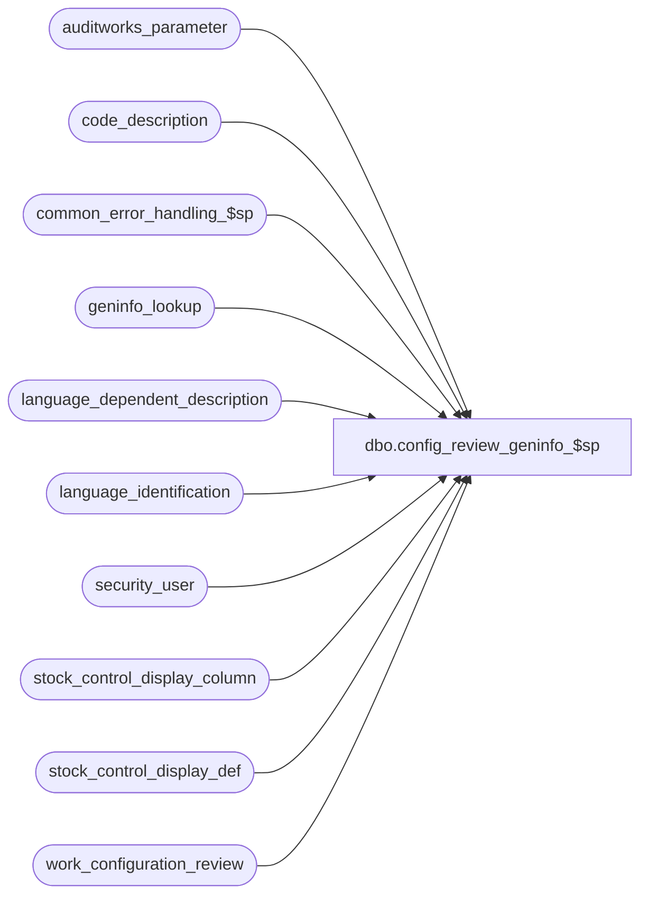

# dbo.config_review_geninfo_$sp

**Database:** auditworks  
**Server:** bedrockdb01  

## Architecture Diagram



## Table Dependencies

| Referenced Table |
|---|
| auditworks_parameter |
| code_description |
| common_error_handling_$sp |
| geninfo_lookup |
| language_dependent_description |
| language_identification |
| security_user |
| stock_control_display_column |
| stock_control_display_def |
| work_configuration_review |

## Stored Procedure Code

```sql
create proc dbo.config_review_geninfo_$sp 
( @form_code smallint, 
  @language_id smallint = null, 
  @session_id binary(16) = @@spid, 
  @entry_id numeric(12,0) = null )
  
AS
  
/* 
PROC NAME: config_review_geninfo_$sp
     DESC: Called by config_review_$sp to populate the geninfo review details
     	   
HISTORY:
Date     Name         Defect# Description
Jan04,11 Paul          105313 Use unicode datatypes
Jun23,08 Vicci         102409 Close cursor in event of error;  fix outer join.
Oct25,06 Phu            77931 Fix outer join for SQL 2005 Mode 90.
Mar09,05 David        DV-1202 Review and add error trap.
Feb24,05 Vicci        DV-1202 Author

*/

DECLARE @form_name  		nvarchar(255), 
	@display_def_id  	smallint, 
	@column_name 		nvarchar(30),
	@resource_column_name 	nvarchar(30),
	@resource_column_value 	smallint,
	@auto_config_verified 	tinyint,
	@detail_flag 		tinyint, 
	@delim 			nvarchar(3), 
	@delim2 		nvarchar(3),
	@f1 			nvarchar(255), 
	@g1 			nvarchar(255), 
	@g2 			nvarchar(255),
	@sql_command		nvarchar(2000),	
	@g2_sql_command		nvarchar(2000),
	@f1_sql_command		nvarchar(2000),
	@display_def_descr nvarchar(255),
	@upc_no_fe_resource_id int,
	@merchandise_key_fe_resource_id int,
	@initiated_by_fe_resource_id int,
	@units_fe_resource_id int,
	@other_store_no_fe_resource_id int,
	@location_no_fe_resource_id int,
	@vendor_no_fe_resource_id int,
	@count_date_fe_resource_id int,
	@pos_identifier_fe_resource_id int,
	@pos_id_type_fe_resource_id int,
	@pos_deptclass_fe_resource_id int,
	@upc_division_fe_resource_id int,
	@originating_str_fe_resource_id int,
	@default_initiated_by_host tinyint,
	@default_pos_identifier_type tinyint,
	@other_store_validation tinyint,
	@original_store_validation tinyint,
	@upc_no_mandatory tinyint,
	@merchandise_key_mandatory tinyint,
	@units_mandatory tinyint,
	@other_store_no_mandatory tinyint,
	@location_no_mandatory tinyint,
	@vendor_no_mandatory tinyint,
	@count_date_mandatory tinyint,
	@pos_identifier_mandatory tinyint,
	@pos_id_type_mandatory tinyint,
	@pos_deptclass_mandatory tinyint,
	@upc_division_mandatory tinyint,
	@originating_str_mandatory tinyint,
	@upc_no_code_type tinyint,
	@merchandise_key_code_type tinyint,
	@units_code_type tinyint,
	@other_store_no_code_type tinyint,
	@location_no_code_type tinyint,
	@pos_id_type_code_type tinyint,
	@pos_deptclass_code_type tinyint,
	@upc_division_code_type tinyint,
	@originating_str_code_type tinyint,
	@initiated_by_code_type tinyint,
	@imrd_fe_resource_id int,
	@imrd_mandatory tinyint,
	@imrd_code_type tinyint,
	@reason_fe_resource_id int,
	@reason_mandatory tinyint,
	@reason_code_type tinyint,
	@active_flag tinyint,
	@units_reversal_factor int,
	@vendor_no_code_type tinyint,
	@pos_identifier_code_type tinyint,
	@field_code nvarchar(30), 
	@field_priority_no tinyint, 
	@code_type tinyint, 
	@code smallint,
	@errmsg			nvarchar(255),
	@errno			int,
	@process_no		smallint,
	@object_name		nvarchar(255),	
	@operation_name		nvarchar(100),
	@cursor_open		tinyint
 

IF @session_id = null --
  SELECT @session_id = @@spid 

IF @language_id IS NULL --
BEGIN
  SELECT @language_id = u.language_id
    FROM security_user u
   WHERE u.user_id = suser_sname()

  SELECT @errno = @@error
  IF @errno != 0
  BEGIN
    SELECT @errmsg = 'Failed to get language_id from security_user.',
           @object_name = 'security_user',
           @operation_name = 'SELECT'     
    GOTO error
  END
END -- IF   

IF @language_id IS NULL --
BEGIN
  SELECT @language_id = i.language_id
    FROM auditworks_parameter p, language_identification i
   WHERE par_name = 'base_language_id'
     AND convert(smallint, par_value) = i.language_id
     AND i.active_flag > 0

  SELECT @errno = @@error
  IF @errno != 0
  BEGIN
    SELECT @errmsg = 'Failed to get language_id from language_identification.',
           @object_name = 'language_identification',
           @operation_name = 'SELECT'  
    GOTO error
  END
END -- IF   

IF @language_id IS NULL --
  SELECT @language_id = 1033

SELECT @delim = ' (', 
       @delim2 = ')',
       @detail_flag = 1, 
       @process_no = 292 


/* Table:  geninfo_lookup -Start */
DECLARE geninfo_lookup_cursor CURSOR FAST_FORWARD
  FOR
  SELECT g.auto_config_verified, 
	 g.field_name as g1,
	 IsNull(d_ldd.display_description, d.code_display_descr) + @delim + convert(nvarchar, g.field_datatype) + @delim2 as g2, 
	 g.display_def_id, 
	 g.column_name
    FROM geninfo_lookup g
         INNER JOIN code_description d ON (IsNull(d.alpha_code, convert(nvarchar, d.code)) = g.field_datatype)
         LEFT JOIN language_dependent_description d_ldd ON (d.resource_id = d_ldd.resource_id and d_ldd.language_id = @language_id)
   WHERE g.form_code = @form_code
     AND d.code_type = 253

  SELECT @errno = @@error
  IF @errno != 0
  BEGIN
    SELECT @errmsg = 'Failed to declare geninfo_lookup_cursor.',
           @object_name = 'geninfo_lookup_cursor',
           @operation_name = 'DECLARE'     
    GOTO error
  END

OPEN geninfo_lookup_cursor
SELECT @cursor_open = 1

FETCH geninfo_lookup_cursor
 INTO @auto_config_verified, 
      @g1, 
      @g2,
      @display_def_id,
      @column_name

WHILE @@fetch_status = 0 
BEGIN
  INSERT INTO work_configuration_review 
        (work_list_entry_id, session_id, detail_flag, auto_config_verified, 
         config_type, item_code, item_type, table_maintenance_area_id,
         group1_setting, group2_setting, field_code, 
         field_setting, field_priority_no)
  SELECT @entry_id, @session_id, @detail_flag, @auto_config_verified, 
         3, @form_code, 0, 21, 
         @g1, @g2, 'display_def_id', 
         IsNull(s_ldd.display_description, s.display_def_descr) + @delim + convert(nvarchar, @display_def_id) + @delim2, 10
    FROM stock_control_display_def s
         LEFT JOIN language_dependent_description s_ldd ON (ISNULL(s.resource_id, s_ldd.resource_id) = s_ldd.resource_id AND s_ldd.language_id = @language_id)
    WHERE s.display_def_id = @display_def_id

  SELECT @errno = @@error
  IF @errno != 0
  BEGIN
    SELECT @errmsg = 'Failed to populate work_configuration_review (display_def_id).',
           @object_name = 'work_configuration_review',
           @operation_name = 'INSERT'     
    GOTO error
  END

  SELECT @resource_column_name = max(resource_column_name) 
    FROM stock_control_display_column
   WHERE column_name = @column_name

  SELECT @errno = @@error
  IF @errno != 0
  BEGIN
    SELECT @errmsg = 'Failed to get resource_column_name.',
           @object_name = 'stock_control_display_column',
           @operation_name = 'SELECT'     
    GOTO error
  END

  SELECT @sql_command = 
         N'SELECT @f1 = IsNull(c_ldd.display_description, c.code_display_descr) + ''' + @delim + @column_name + @delim2 + '''
             FROM stock_control_display_def s
                  INNER JOIN code_description c
                     ON c.code_type = 223
                    AND c.code = ' + @resource_column_name + '
                  LEFT OUTER JOIN language_dependent_description c_ldd
                    ON c.resource_id = c_ldd.resource_id
                   AND c_ldd.language_id = @language_id
            WHERE s.display_def_id = @display_def_id '

  SELECT @errno = @@error
  IF @errno != 0
  BEGIN
    SELECT @errmsg = 'Failed to set @sql_command.',
           @object_name = 'stock_control_display_def',
           @operation_name = 'SELECT'     
    GOTO error
  END

  EXEC sp_executesql @sql_command, 
                     N'@f1 nvarchar(255) OUT, @language_id smallint, @display_def_id smallint', 
                     @f1 OUT, @language_id, @display_def_id 

  SELECT @errno = @@error
  IF @errno != 0
  BEGIN
    SELECT @errmsg = 'Failed to execute dynamic sql (display_description).',
           @object_name = 'sp_executesql',
           @operation_name = 'EXEC'     
    GOTO error
  END

  INSERT INTO work_configuration_review 
        (work_list_entry_id, session_id, detail_flag, auto_config_verified, 
         config_type, item_code, item_type, table_maintenance_area_id,
         group1_setting, group2_setting, field_code, field_setting, field_priority_no)
  VALUES (@entry_id, @session_id, @detail_flag, @auto_config_verified, 
          3, @form_code, 0, 21, 
          @g1, @g2, 'column_name', @f1, 20)

  SELECT @errno = @@error
  IF @errno != 0
  BEGIN
    SELECT @errmsg = 'Failed to populate work_configuration_review (column_name).',
           @object_name = 'work_configuration_review',
           @operation_name = 'INSERT'     
    GOTO error
  END

  FETCH geninfo_lookup_cursor
   INTO @auto_config_verified, 
        @g1, 
        @g2,
        @display_def_id,
        @column_name

END -- while fetch OK

CLOSE geninfo_lookup_cursor
DEALLOCATE geninfo_lookup_cursor
SELECT @cursor_open = 0

/* Table:  geninfo_lookup -End */


/* Table:  stock_control_display_def -Start */

SELECT @g2_sql_command = 
       N'SELECT @g2 = IsNull(c_ldd.display_description, c.code_display_descr) + ''' + @delim + ''' + @column_name + ''' + @delim2 + '''
           FROM code_description c
                LEFT JOIN language_dependent_description c_ldd ON (c.resource_id = c_ldd.resource_id AND c_ldd.language_id = ' + convert(nvarchar, @language_id) +
         N' ) WHERE c.code_type = 223
            AND c.code = @resource_column_value '

  SELECT @errno = @@error
  IF @errno != 0
  BEGIN
    SELECT @errmsg = 'Failed to set @g2_sql_command.',
           @object_name = 'code_description',
           @operation_name = 'SELECT'     
    GOTO error
  END

SELECT @f1_sql_command = 
        'INSERT INTO work_configuration_review 
           (work_list_entry_id, session_id, detail_flag, auto_config_verified, 
            config_type, item_code, item_type, table_maintenance_area_id,
            group1_setting, group2_setting, field_code, 
            field_setting, 
            field_priority_no) 
         SELECT ' + convert(nvarchar, @entry_id) + ', @session_id, 1, @auto_config_verified, 
                3, ' + convert(nvarchar,@form_code) + ', 0, 22, 
                @g1, @g2, @field_code, 
                IsNull(c_ldd.display_description, c.code_display_descr) + ''' + @delim + ''' + convert(nvarchar, c.code) + ''' + @delim2 + ''',
                @field_priority_no
           FROM code_description c
                LEFT OUTER JOIN language_dependent_description c_ldd
                  ON c.resource_id = c_ldd.resource_id
                 AND c_ldd.language_id = ' + convert(nvarchar,@language_id) + '
          WHERE c.code_type = @code_type
            AND c.code = @code'
      
  SELECT @errno = @@error
  IF @errno != 0
  BEGIN
    SELECT @errmsg = 'Failed to set @f1_sql_command.',
           @object_name = 'code_description',
           @operation_name = 'SELECT'     
    GOTO error
  END


DECLARE info_set_column_cursor CURSOR FAST_FORWARD
    FOR
 SELECT s.active_flag,
	s.count_date_fe_resource_id,
	s.count_date_mandatory,
	s.default_initiated_by_host,
	s.default_pos_identifier_type,
	IsNull(s_ldd.display_description, s.display_def_descr) + @delim + convert(nvarchar, s.display_def_id) + @delim2 as g1, 
	s.imrd_code_type,
	s.imrd_fe_resource_id,
	s.imrd_mandatory,
	s.initiated_by_code_type,
	s.initiated_by_fe_resource_id,
	s.location_no_code_type,
	s.location_no_fe_resource_id,
	s.location_no_mandatory,
	s.merchandise_key_code_type,
	s.merchandise_key_fe_resource_id,
	s.merchandise_key_mandatory,
	s.original_store_validation,
	s.originating_str_code_type,
	s.originating_str_fe_resource_id,
	s.originating_str_mandatory,
	s.other_store_no_code_type,
	s.other_store_no_fe_resource_id,
	s.other_store_no_mandatory,
	s.other_store_validation,
	s.pos_deptclass_code_type,
	s.pos_deptclass_fe_resource_id,
	s.pos_deptclass_mandatory,
	s.pos_id_type_code_type,
	s.pos_id_type_fe_resource_id,
	s.pos_id_type_mandatory,
	s.pos_identifier_code_type,
	s.pos_identifier_fe_resource_id,
	s.pos_identifier_mandatory,
	s.reason_code_type,
	s.reason_fe_resource_id,
	s.reason_mandatory,
	s.units_code_type,
	s.units_fe_resource_id,
	s.units_mandatory,
	s.units_reversal_factor,
	s.upc_division_code_type,
	s.upc_division_fe_resource_id,
	s.upc_division_mandatory,
	s.upc_no_code_type,
	s.upc_no_fe_resource_id,
	s.upc_no_mandatory,
	s.vendor_no_code_type,
	s.vendor_no_fe_resource_id,
	s.vendor_no_mandatory
   FROM stock_control_display_def s
        LEFT JOIN language_dependent_description s_ldd ON (ISNULL(s.resource_id, s_ldd.resource_id) = s_ldd.resource_id AND s_ldd.language_id = @language_id)
  WHERE s.display_def_id IN (SELECT distinct display_def_id 
                               FROM geninfo_lookup
                              WHERE form_code = @form_code)
  SELECT @errno = @@error
  IF @errno != 0
  BEGIN
    SELECT @errmsg = 'Failed to declare info_set_column_cursor.',
           @object_name = 'info_set_column_cursor',
           @operation_name = 'DECLARE'     
    GOTO error
  END

OPEN info_set_column_cursor
SELECT @cursor_open = 2

FETCH info_set_column_cursor
 INTO 	@active_flag,
	@count_date_fe_resource_id,
	@count_date_mandatory,
	@default_initiated_by_host,
	@default_pos_identifier_type,
	@g1,
	@imrd_code_type,
	@imrd_fe_resource_id,
	@imrd_mandatory,
	@initiated_by_code_type,
	@initiated_by_fe_resource_id,
	@location_no_code_type,
	@location_no_fe_resource_id,
	@location_no_mandatory,
	@merchandise_key_code_type,
	@merchandise_key_fe_resource_id,
	@merchandise_key_mandatory,
	@original_store_validation,
	@originating_str_code_type,
	@originating_str_fe_resource_id,
	@originating_str_mandatory,
	@other_store_no_code_type,
	@other_store_no_fe_resource_id,
	@other_store_no_mandatory,
	@other_store_validation,
	@pos_deptclass_code_type,
	@pos_deptclass_fe_resource_id,
	@pos_deptclass_mandatory,
	@pos_id_type_code_type,
	@pos_id_type_fe_resource_id,
	@pos_id_type_mandatory,
	@pos_identifier_code_type,
	@pos_identifier_fe_resource_id,
	@pos_identifier_mandatory,
	@reason_code_type,
	@reason_fe_resource_id,
	@reason_mandatory,
	@units_code_type,
	@units_fe_resource_id,
	@units_mandatory,
	@units_reversal_factor,
	@upc_division_code_type,
	@upc_division_fe_resource_id,
	@upc_division_mandatory,
	@upc_no_code_type,
	@upc_no_fe_resource_id,
	@upc_no_mandatory,
	@vendor_no_code_type,
	@vendor_no_fe_resource_id,
	@vendor_no_mandatory

WHILE @@fetch_status = 0 
BEGIN
  INSERT INTO work_configuration_review 
        (work_list_entry_id, session_id, detail_flag, auto_config_verified, 
         config_type, item_code, item_type, table_maintenance_area_id,
         group1_setting, group2_setting, field_code, 
         field_setting, field_priority_no)
  SELECT @entry_id, @session_id, @detail_flag, @auto_config_verified, 
         3, @form_code, 0, 22, 
         @g1, null, 'active_flag', 
         IsNull(c_ldd.display_description, c.code_display_descr) + @delim + convert(nvarchar, @active_flag) + @delim2, 10
    FROM code_description c
         LEFT JOIN language_dependent_description c_ldd ON (c.resource_id = c_ldd.resource_id AND c_ldd.language_id = @language_id)
   WHERE c.code_type = 203 
     AND c.code = @active_flag

  SELECT @errno = @@error
  IF @errno != 0
  BEGIN
    SELECT @errmsg = 'Failed to populate work_configuration_review (active_flag).',
           @object_name = 'work_configuration_review',
           @operation_name = 'INSERT'     
    GOTO error
  END

  IF @count_date_fe_resource_id <> 0 
  BEGIN
    SELECT @resource_column_value = @count_date_fe_resource_id, @column_name ='count_date'
    EXEC sp_executesql @g2_sql_command, 
                       N'@g2 nvarchar(255) OUT, @column_name nvarchar(30), @resource_column_value smallint', 
                       @g2 OUT, @column_name, @resource_column_value

    SELECT @errno = @@error
    IF @errno != 0
    BEGIN
      SELECT @errmsg = 'Failed to execute dynamic sql @g2_sql_command (count_date).',
             @object_name = 'sp_executesql',
            @operation_name = 'EXEC'     
      GOTO error
    END

    SELECT @code = @count_date_mandatory, @code_type = 203, @field_code = 'mandatory', @field_priority_no = 20     
    EXEC sp_executesql @f1_sql_command, 
                       N'@session_id binary(16), @auto_config_verified tinyint, @g1 nvarchar(255), @g2 nvarchar(255), @field_code nvarchar(30), @field_priority_no tinyint, @code_type tinyint, @code smallint', 
                       @session_id, @auto_config_verified, @g1, @g2, @field_code, @field_priority_no, @code_type, @code

    SELECT @errno = @@error
    IF @errno != 0
    BEGIN
      SELECT @errmsg = 'Failed to execute dynamic sql @f1_sql_command (@count_date_fe_resource_id).',
             @object_name = 'sp_executesql',
             @operation_name = 'EXEC'     
      GOTO error
    END
  END -- IF @count_date_fe_resource_id <> 0 

  IF @imrd_fe_resource_id <> 0 
  BEGIN
    SELECT @resource_column_value = @imrd_fe_resource_id, @column_name = 'imrd'
    EXEC sp_executesql @g2_sql_command, 
                       N'@g2 nvarchar(255) OUT, @column_name nvarchar(30), @resource_column_value smallint', 
                       @g2 OUT, @column_name, @resource_column_value

    SELECT @errno = @@error
    IF @errno != 0
    BEGIN
      SELECT @errmsg = 'Failed to execute dynamic sql @g2_sql_command (imrd).',
             @object_name = 'sp_executesql',
             @operation_name = 'EXEC'     
      GOTO error
    END

    SELECT @code = @imrd_mandatory, @code_type = 203, @field_code = 'mandatory', @field_priority_no = 20     
    EXEC sp_executesql @f1_sql_command, 
                       N'@session_id binary(16), @auto_config_verified tinyint, @g1 nvarchar(255), @g2 nvarchar(255), @field_code nvarchar(30), @field_priority_no tinyint, @code_type tinyint, @code smallint', 
                       @session_id, @auto_config_verified, @g1, @g2, @field_code, @field_priority_no, @code_type, @code

    SELECT @errno = @@error
    IF @errno != 0
    BEGIN
      SELECT @errmsg = 'Failed to execute dynamic sql @f1_sql_command (mandatory).',
             @object_name = 'sp_executesql',
             @operation_name = 'EXEC'     
      GOTO error
    END

    SELECT @code = @imrd_code_type, @code_type = 0, @field_code = 'code_type', @field_priority_no = 30     
    EXEC sp_executesql @f1_sql_command, 
                       N'@session_id binary(16), @auto_config_verified tinyint, @g1 nvarchar(255), @g2 nvarchar(255), @field_code nvarchar(30), @field_priority_no tinyint, @code_type tinyint, @code smallint', 
                       @session_id, @auto_config_verified, @g1, @g2, @field_code, @field_priority_no, @code_type, @code

    SELECT @errno = @@error
    IF @errno != 0
    BEGIN
      SELECT @errmsg = 'Failed to execute dynamic sql @f1_sql_command (code_type).',
             @object_name = 'sp_executesql',
             @operation_name = 'EXEC'     
      GOTO error
    END
  END -- IF @imrd_fe_resource_id <> 0 

  IF @initiated_by_fe_resource_id <> 0 
  BEGIN
    SELECT @resource_column_value = @initiated_by_fe_resource_id, @column_name ='initiated_by_host'
    EXEC sp_executesql @g2_sql_command, 
                       N'@g2 nvarchar(255) OUT, @column_name nvarchar(30), @resource_column_value smallint', 
                       @g2 OUT, @column_name, @resource_column_value

    SELECT @errno = @@error
    IF @errno != 0
    BEGIN
      SELECT @errmsg = 'Failed to execute dynamic sql @g2_sql_command (initiated_by_host).',
             @object_name = 'sp_executesql',
             @operation_name = 'EXEC'     
      GOTO error
    END

    SELECT @code = @initiated_by_code_type, @code_type = 0, @field_code = 'code_type', @field_priority_no = 30     
    EXEC sp_executesql @f1_sql_command, 
                       N'@session_id binary(16), @auto_config_verified tinyint, @g1 nvarchar(255), @g2 nvarchar(255), @field_code nvarchar(30), @field_priority_no tinyint, @code_type tinyint, @code smallint', 
                       @session_id, @auto_config_verified, @g1, @g2, @field_code, @field_priority_no, @code_type, @code

    SELECT @errno = @@error
    IF @errno != 0
    BEGIN
      SELECT @errmsg = 'Failed to execute dynamic sql @f1_sql_command (@initiated_by_fe_resource_id).',
             @object_name = 'sp_executesql',
             @operation_name = 'EXEC'     
      GOTO error
    END

    SELECT @code = @default_initiated_by_host, @code_type = 203, @field_code = 'default', @field_priority_no = 40     
    EXEC sp_executesql @f1_sql_command, 
         N'@session_id binary(16), @auto_config_verified tinyint, @g1 nvarchar(255), @g2 nvarchar(255), @field_code nvarchar(30), @field_priority_no tinyint, @code_type tinyint, @code smallint', 
         @session_id, @auto_config_verified, @g1, @g2, @field_code, @field_priority_no, @code_type, @code

    SELECT @errno = @@error
    IF @errno != 0
    BEGIN
      SELECT @errmsg = 'Failed to execute dynamic sql @f1_sql_command (default).',
             @object_name = 'sp_executesql',
             @operation_name = 'EXEC'     
      GOTO error
    END
  END -- IF @initiated_by_fe_resource_id <> 0 

  IF @location_no_fe_resource_id <> 0 
  BEGIN
    SELECT @resource_column_value = @location_no_fe_resource_id, @column_name ='location_no'
    EXEC sp_executesql @g2_sql_command, 
                       N'@g2 nvarchar(255) OUT, @column_name nvarchar(30), @resource_column_value smallint', 
                       @g2 OUT, @column_name, @resource_column_value

    SELECT @errno = @@error
    IF @errno != 0
    BEGIN
      SELECT @errmsg = 'Failed to execute dynamic sql @g2_sql_command (location_no).',
             @object_name = 'sp_executesql',
             @operation_name = 'EXEC'     
      GOTO error
    END

    SELECT @code = @location_no_mandatory, @code_type = 203, @field_code = 'mandatory', @field_priority_no = 20     
    EXEC sp_executesql @f1_sql_command, 
         N'@session_id binary(16), @auto_config_verified tinyint, @g1 nvarchar(255), @g2 nvarchar(255), @field_code nvarchar(30), @field_priority_no tinyint, @code_type tinyint, @code smallint', 
         @session_id, @auto_config_verified, @g1, @g2, @field_code, @field_priority_no, @code_type, @code

    SELECT @errno = @@error
    IF @errno != 0
    BEGIN
      SELECT @errmsg = 'Failed to execute dynamic sql @f1_sql_command (@location_no_fe_resource_id).',
             @object_name = 'sp_executesql',
             @operation_name = 'EXEC'     
      GOTO error
    END

    SELECT @code = @location_no_code_type, @code_type = 0, @field_code = 'code_type', @field_priority_no = 30     
    EXEC sp_executesql @f1_sql_command, 
                       N'@session_id binary(16), @auto_config_verified tinyint, @g1 nvarchar(255), @g2 nvarchar(255), @field_code nvarchar(30), @field_priority_no tinyint, @code_type tinyint, @code smallint', 
                       @session_id, @auto_config_verified, @g1, @g2, @field_code, @field_priority_no, @code_type, @code

    SELECT @errno = @@error
    IF @errno != 0
    BEGIN
      SELECT @errmsg = 'Failed to execute dynamic sql @f1_sql_command (@location_no_fe_resource_id 2).',
             @object_name = 'sp_executesql',
             @operation_name = 'EXEC'     
      GOTO error
    END
  END -- IF @location_no_fe_resource_id <> 0 

  IF @merchandise_key_fe_resource_id <> 0 
  BEGIN
    SELECT @resource_column_value = @merchandise_key_fe_resource_id, @column_name ='merchandise_key'
    EXEC sp_executesql @g2_sql_command, 
                       N'@g2 nvarchar(255) OUT, @column_name nvarchar(30), @resource_column_value smallint', 
                       @g2 OUT, @column_name, @resource_column_value

    SELECT @errno = @@error
    IF @errno != 0
    BEGIN
      SELECT @errmsg = 'Failed to execute dynamic sql @g2_sql_command (merchandise_key).',
             @object_name = 'sp_executesql',
             @operation_name = 'EXEC'     
      GOTO error
    END

    SELECT @code = @merchandise_key_mandatory, @code_type = 203, @field_code = 'mandatory', @field_priority_no = 20     
    EXEC sp_executesql @f1_sql_command, 
                       N'@session_id binary(16), @auto_config_verified tinyint, @g1 nvarchar(255), @g2 nvarchar(255), @field_code nvarchar(30), @field_priority_no tinyint, @code_type tinyint, @code smallint', 
                       @session_id, @auto_config_verified, @g1, @g2, @field_code, @field_priority_no, @code_type, @code

    SELECT @errno = @@error
    IF @errno != 0
    BEGIN
      SELECT @errmsg = 'Failed to execute dynamic sql @f1_sql_command (@merchandise_key_fe_resource_id).',
             @object_name = 'sp_executesql',
             @operation_name = 'EXEC'     
      GOTO error
    END

    SELECT @code = @merchandise_key_code_type, @code_type = 0, @field_code = 'code_type', @field_priority_no = 30     
    EXEC sp_executesql @f1_sql_command, 
                       N'@session_id binary(16), @auto_config_verified tinyint, @g1 nvarchar(255), @g2 nvarchar(255), @field_code nvarchar(30), @field_priority_no tinyint, @code_type tinyint, @code smallint', 
                       @session_id, @auto_config_verified, @g1, @g2, @field_code, @field_priority_no, @code_type, @code

    SELECT @errno = @@error
    IF @errno != 0
    BEGIN
      SELECT @errmsg = 'Failed to execute dynamic sql @f1_sql_command (@merchandise_key_fe_resource_id 2).',
             @object_name = 'sp_executesql',
             @operation_name = 'EXEC'     
      GOTO error
    END
  END -- IF @merchandise_key_fe_resource_id <> 0 

  IF @originating_str_fe_resource_id <> 0 
  BEGIN
    SELECT @resource_column_value = @originating_str_fe_resource_id, @column_name ='originating_store_no'
    EXEC sp_executesql @g2_sql_command, 
                       N'@g2 nvarchar(255) OUT, @column_name nvarchar(30), @resource_column_value smallint', 
                       @g2 OUT, @column_name, @resource_column_value

    SELECT @errno = @@error
    IF @errno != 0
    BEGIN
      SELECT @errmsg = 'Failed to execute dynamic sql @g2_sql_command (originating_store_no).',
             @object_name = 'sp_executesql',
             @operation_name = 'EXEC'     
      GOTO error
    END

    SELECT @code = @originating_str_mandatory, @code_type = 203, @field_code = 'mandatory', @field_priority_no = 20     
    EXEC sp_executesql @f1_sql_command, 
                       N'@session_id binary(16), @auto_config_verified tinyint, @g1 nvarchar(255), @g2 nvarchar(255), @field_code nvarchar(30), @field_priority_no tinyint, @code_type tinyint, @code smallint', 
                       @session_id, @auto_config_verified, @g1, @g2, @field_code, @field_priority_no, @code_type, @code

    SELECT @errno = @@error
    IF @errno != 0
    BEGIN
      SELECT @errmsg = 'Failed to execute dynamic sql @f1_sql_command (@originating_str_fe_resource_id).',
             @object_name = 'sp_executesql',
             @operation_name = 'EXEC'     
      GOTO error
    END

    SELECT @code = @originating_str_code_type, @code_type = 0, @field_code = 'code_type', @field_priority_no = 30     
    EXEC sp_executesql @f1_sql_command, 
                       N'@session_id binary(16), @auto_config_verified tinyint, @g1 nvarchar(255), @g2 nvarchar(255), @field_code nvarchar(30), @field_priority_no tinyint, @code_type tinyint, @code smallint', 
                       @session_id, @auto_config_verified, @g1, @g2, @field_code, @field_priority_no, @code_type, @code

    SELECT @errno = @@error
    IF @errno != 0
    BEGIN
      SELECT @errmsg = 'Failed to execute dynamic sql @f1_sql_command (@originating_str_fe_resource_id 2).',
             @object_name = 'sp_executesql',
             @operation_name = 'EXEC'     
      GOTO error
    END

    SELECT @code = @original_store_validation, @code_type = 203, @field_code = 'store_validation', @field_priority_no = 50     
    EXEC sp_executesql @f1_sql_command, 
N'@session_id binary(16), @auto_config_verified tinyint, @g1 nvarchar(255), @g2 nvarchar(255), @field_code nvarchar(30), @field_priority_no tinyint, @code_type tinyint, @code smallint', 
                       @session_id, @auto_config_verified, @g1, @g2, @field_code, @field_priority_no, @code_type, @code

    SELECT @errno = @@error
    IF @errno != 0
    BEGIN
      SELECT @errmsg = 'Failed to execute dynamic sql @f1_sql_command (@originating_str_fe_resource_id 3).',
             @object_name = 'sp_executesql',
             @operation_name = 'EXEC'     
      GOTO error
    END
  END -- IF @originating_str_fe_resource_id <> 0 

  IF @other_store_no_fe_resource_id <> 0 
  BEGIN
    SELECT @resource_column_value = @other_store_no_fe_resource_id, @column_name ='other_store_no'
    EXEC sp_executesql @g2_sql_command, 
                       N'@g2 nvarchar(255) OUT, @column_name nvarchar(30), @resource_column_value smallint', 
                       @g2 OUT, @column_name, @resource_column_value

    SELECT @errno = @@error
    IF @errno != 0
    BEGIN
      SELECT @errmsg = 'Failed to execute dynamic sql @g2_sql_command (other_store_no).',
             @object_name = 'sp_executesql',
             @operation_name = 'EXEC'     
      GOTO error
    END

    SELECT @code = @other_store_no_mandatory, @code_type = 203, @field_code = 'mandatory', @field_priority_no = 20     
    EXEC sp_executesql @f1_sql_command, 
                       N'@session_id binary(16), @auto_config_verified tinyint, @g1 nvarchar(255), @g2 nvarchar(255), @field_code nvarchar(30), @field_priority_no tinyint, @code_type tinyint, @code smallint', 
                       @session_id, @auto_config_verified, @g1, @g2, @field_code, @field_priority_no, @code_type, @code

    SELECT @errno = @@error
    IF @errno != 0
    BEGIN
      SELECT @errmsg = 'Failed to execute dynamic sql @f1_sql_command (@other_store_no_fe_resource_id).',
             @object_name = 'sp_executesql',
             @operation_name = 'EXEC'     
      GOTO error
    END

    SELECT @code = @other_store_no_code_type, @code_type = 0, @field_code = 'code_type', @field_priority_no = 30     
    EXEC sp_executesql @f1_sql_command, 
                       N'@session_id binary(16), @auto_config_verified tinyint, @g1 nvarchar(255), @g2 nvarchar(255), @field_code nvarchar(30), @field_priority_no tinyint, @code_type tinyint, @code smallint', 
                       @session_id, @auto_config_verified, @g1, @g2, @field_code, @field_priority_no, @code_type, @code

    SELECT @errno = @@error
    IF @errno != 0
    BEGIN
      SELECT @errmsg = 'Failed to execute dynamic sql @f1_sql_command (@other_store_no_fe_resource_id 2).',
             @object_name = 'sp_executesql',
             @operation_name = 'EXEC'     
      GOTO error
    END

    SELECT @code = @other_store_validation, @code_type = 203, @field_code = 'store_validation', @field_priority_no = 50     
    EXEC sp_executesql @f1_sql_command, 
                       N'@session_id binary(16), @auto_config_verified tinyint, @g1 nvarchar(255), @g2 nvarchar(255), @field_code nvarchar(30), @field_priority_no tinyint, @code_type tinyint, @code smallint', 
                       @session_id, @auto_config_verified, @g1, @g2, @field_code, @field_priority_no, @code_type, @code

    SELECT @errno = @@error
    IF @errno != 0
    BEGIN
      SELECT @errmsg = 'Failed to execute dynamic sql @f1_sql_command (@other_store_no_fe_resource_id 3).',
             @object_name = 'sp_executesql',
             @operation_name = 'EXEC'  
      GOTO error
    END
  END -- IF @other_store_no_fe_resource_id <> 0 

  IF @pos_deptclass_fe_resource_id <> 0 
  BEGIN
    SELECT @resource_column_value = @pos_deptclass_fe_resource_id, @column_name ='pos_deptclass'
    EXEC sp_executesql @g2_sql_command, 
                       N'@g2 nvarchar(255) OUT, @column_name nvarchar(30), @resource_column_value smallint', 
             @g2 OUT, @column_name, @resource_column_value

    SELECT @errno = @@error
    IF @errno != 0
    BEGIN
      SELECT @errmsg = 'Failed to execute dynamic sql @g2_sql_command (pos_deptclass).',
             @object_name = 'sp_executesql',
             @operation_name = 'EXEC'     
      GOTO error
    END

    SELECT @code = @pos_deptclass_mandatory, @code_type = 203, @field_code = 'mandatory', @field_priority_no = 20     
    EXEC sp_executesql @f1_sql_command, 
                       N'@session_id binary(16), @auto_config_verified tinyint, @g1 nvarchar(255), @g2 nvarchar(255), @field_code nvarchar(30), @field_priority_no tinyint, @code_type tinyint, @code smallint', 
                       @session_id, @auto_config_verified, @g1, @g2, @field_code, @field_priority_no, @code_type, @code

    SELECT @errno = @@error
    IF @errno != 0
    BEGIN
      SELECT @errmsg = 'Failed to execute dynamic sql @f1_sql_command (@pos_deptclass_fe_resource_id).',
             @object_name = 'sp_executesql',
             @operation_name = 'EXEC'     
      GOTO error
    END

    SELECT @code = @pos_deptclass_code_type, @code_type = 0, @field_code = 'code_type', @field_priority_no = 30     
    EXEC sp_executesql @f1_sql_command, 
                       N'@session_id binary(16), @auto_config_verified tinyint, @g1 nvarchar(255), @g2 nvarchar(255), @field_code nvarchar(30), @field_priority_no tinyint, @code_type tinyint, @code smallint', 
                       @session_id, @auto_config_verified, @g1, @g2, @field_code, @field_priority_no, @code_type, @code

    SELECT @errno = @@error
    IF @errno != 0
    BEGIN
      SELECT @errmsg = 'Failed to execute dynamic sql @f1_sql_command (@pos_deptclass_fe_resource_id 2).',
             @object_name = 'sp_executesql',
             @operation_name = 'EXEC'     
      GOTO error
    END
  END -- IF @pos_deptclass_fe_resource_id <> 0

  IF @pos_id_type_fe_resource_id <> 0 
  BEGIN
    SELECT @resource_column_value = @pos_id_type_fe_resource_id, @column_name ='pos_identifier_type'
    EXEC sp_executesql @g2_sql_command, 
                       N'@g2 nvarchar(255) OUT, @column_name nvarchar(30), @resource_column_value smallint', 
                       @g2 OUT, @column_name, @resource_column_value

    SELECT @errno = @@error
    IF @errno != 0
    BEGIN
      SELECT @errmsg = 'Failed to execute dynamic sql @g2_sql_command (pos_identifier_type).',
             @object_name = 'sp_executesql',
             @operation_name = 'EXEC'     
      GOTO error
    END

    SELECT @code = @pos_id_type_mandatory, @code_type = 203, @field_code = 'mandatory', @field_priority_no = 20     
    EXEC sp_executesql @f1_sql_command, 
                       N'@session_id binary(16), @auto_config_verified tinyint, @g1 nvarchar(255), @g2 nvarchar(255), @field_code nvarchar(30), @field_priority_no tinyint, @code_type tinyint, @code smallint', 
                       @session_id, @auto_config_verified, @g1, @g2, @field_code, @field_priority_no, @code_type, @code

    SELECT @errno = @@error
    IF @errno != 0
    BEGIN
      SELECT @errmsg = 'Failed to execute dynamic sql @f1_sql_command (@pos_id_type_fe_resource_id).',
             @object_name = 'sp_executesql',
             @operation_name = 'EXEC'     
      GOTO error
    END

    SELECT @code = @pos_id_type_code_type, @code_type = 0, @field_code = 'code_type', @field_priority_no = 30     
    EXEC sp_executesql @f1_sql_command, 
                       N'@session_id binary(16), @auto_config_verified tinyint, @g1 nvarchar(255), @g2 nvarchar(255), @field_code nvarchar(30), @field_priority_no tinyint, @code_type tinyint, @code smallint', 
                       @session_id, @auto_config_verified, @g1, @g2, @field_code, @field_priority_no, @code_type, @code

    SELECT @errno = @@error
    IF @errno != 0
    BEGIN
      SELECT @errmsg = 'Failed to execute dynamic sql @f1_sql_command (@pos_id_type_fe_resource_id 2).',
             @object_name = 'sp_executesql',
             @operation_name = 'EXEC'     
      GOTO error
    END

    SELECT @code = @default_pos_identifier_type, @code_type = 68, @field_code = 'default', @field_priority_no = 40     
    EXEC sp_executesql @f1_sql_command, 
                       N'@session_id binary(16), @auto_config_verified tinyint, @g1 nvarchar(255), @g2 nvarchar(255), @field_code nvarchar(30), @field_priority_no tinyint, @code_type tinyint, @code smallint', 
                       @session_id, @auto_config_verified, @g1, @g2, @field_code, @field_priority_no, @code_type, @code

    SELECT @errno = @@error
    IF @errno != 0
    BEGIN
      SELECT @errmsg = 'Failed to execute dynamic sql @f1_sql_command (@pos_id_type_fe_resource_id 3).',
             @object_name = 'sp_executesql',
             @operation_name = 'EXEC'     
      GOTO error
    END
  END -- IF @pos_id_type_fe_resource_id <> 0 

  IF @pos_identifier_fe_resource_id <> 0 
  BEGIN
    SELECT @resource_column_value = @pos_identifier_fe_resource_id, @column_name ='pos_identifier'
    EXEC sp_executesql @g2_sql_command, 
                       N'@g2 nvarchar(255) OUT, @column_name nvarchar(30), @resource_column_value smallint', 
                       @g2 OUT, @column_name, @resource_column_value

    SELECT @errno = @@error
    IF @errno != 0
    BEGIN
      SELECT @errmsg = 'Failed to execute dynamic sql @g2_sql_command (pos_identifier).',
             @object_name = 'sp_executesql',
             @operation_name = 'EXEC'     
      GOTO error
    END

    SELECT @code = @pos_identifier_mandatory, @code_type = 203, @field_code = 'mandatory', @field_priority_no = 20     
    EXEC sp_executesql @f1_sql_command, 
                       N'@session_id binary(16), @auto_config_verified tinyint, @g1 nvarchar(255), @g2 nvarchar(255), @field_code nvarchar(30), @field_priority_no tinyint, @code_type tinyint, @code smallint', 
                       @session_id, @auto_config_verified, @g1, @g2, @field_code, @field_priority_no, @code_type, @code

    SELECT @errno = @@error
    IF @errno != 0
    BEGIN
      SELECT @errmsg = 'Failed to execute dynamic sql @f1_sql_command (@pos_identifier_fe_resource_id).',
             @object_name = 'sp_executesql',
             @operation_name = 'EXEC'     
      GOTO error
    END

    SELECT @code = @pos_identifier_code_type, @code_type = 0, @field_code = 'code_type', @field_priority_no = 30     
    EXEC sp_executesql @f1_sql_command, 
                       N'@session_id binary(16), @auto_config_verified tinyint, @g1 nvarchar(255), @g2 nvarchar(255), @field_code nvarchar(30), @field_priority_no tinyint, @code_type tinyint, @code smallint', 
                       @session_id, @auto_config_verified, @g1, @g2, @field_code, @field_priority_no, @code_type, @code

    SELECT @errno = @@error
    IF @errno != 0
    BEGIN
      SELECT @errmsg = 'Failed to execute dynamic sql @f1_sql_command (@pos_identifier_fe_resource_id 2).',
             @object_name = 'sp_executesql',
             @operation_name = 'EXEC'     
      GOTO error
    END
  END -- IF @pos_identifier_fe_resource_id <> 0 

  IF @reason_fe_resource_id <> 0 
  BEGIN
    SELECT @resource_column_value = @reason_fe_resource_id, @column_name ='reason'
    EXEC sp_executesql @g2_sql_command, 
                       N'@g2 nvarchar(255) OUT, @column_name nvarchar(30), @resource_column_value smallint', 
                       @g2 OUT, @column_name, @resource_column_value

    SELECT @errno = @@error
    IF @errno != 0
    BEGIN
      SELECT @errmsg = 'Failed to execute dynamic sql @g2_sql_command (reason).',
             @object_name = 'sp_executesql',
             @operation_name = 'EXEC'     
      GOTO error
    END

    SELECT @code = @reason_mandatory, @code_type = 203, @field_code = 'mandatory', @field_priority_no = 20     
    EXEC sp_executesql @f1_sql_command,
   N'@session_id binary(16), @auto_config_verified tinyint, @g1 nvarchar(255), @g2 nvarchar(255), @field_code nvarchar(30), @field_priority_no tinyint, @code_type tinyint, @code smallint', 
                       @session_id, @auto_config_verified, @g1, @g2, @field_code, @field_priority_no, @code_type, @code

    SELECT @errno = @@error
    IF @errno != 0
    BEGIN
      SELECT @errmsg = 'Failed to execute dynamic sql @f1_sql_command (@reason_fe_resource_id).',
             @object_name = 'sp_executesql',
             @operation_name = 'EXEC'     
      GOTO error
    END

    SELECT @code = @reason_code_type, @code_type = 0, @field_code = 'code_type', @field_priority_no = 30     
    EXEC sp_executesql @f1_sql_command, 
                       N'@session_id binary(16), @auto_config_verified tinyint, @g1 nvarchar(255), @g2 nvarchar(255), @field_code nvarchar(30), @field_priority_no tinyint, @code_type tinyint, @code smallint', 
                       @session_id, @auto_config_verified, @g1, @g2, @field_code, @field_priority_no, @code_type, @code

    SELECT @errno = @@error
    IF @errno != 0
    BEGIN
      SELECT @errmsg = 'Failed to execute dynamic sql @f1_sql_command (@reason_fe_resource_id 2).',
             @object_name = 'sp_executesql',
             @operation_name = 'EXEC'     
      GOTO error
    END
  END -- IF @reason_fe_resource_id <> 0 

  IF @units_fe_resource_id <> 0 
  BEGIN
    SELECT @resource_column_value = @units_fe_resource_id, @column_name ='units'
    EXEC sp_executesql @g2_sql_command, 
                       N'@g2 nvarchar(255) OUT, @column_name nvarchar(30), @resource_column_value smallint', 
                       @g2 OUT, @column_name, @resource_column_value

    SELECT @errno = @@error
    IF @errno != 0
    BEGIN
      SELECT @errmsg = 'Failed to execute dynamic sql @g2_sql_command (units).',
             @object_name = 'sp_executesql',
             @operation_name = 'EXEC'     
      GOTO error
    END

    SELECT @code = @units_mandatory, @code_type = 203, @field_code = 'mandatory', @field_priority_no = 20     
    EXEC sp_executesql @f1_sql_command, 
                       N'@session_id binary(16), @auto_config_verified tinyint, @g1 nvarchar(255), @g2 nvarchar(255), @field_code nvarchar(30), @field_priority_no tinyint, @code_type tinyint, @code smallint', 
                       @session_id, @auto_config_verified, @g1, @g2, @field_code, @field_priority_no, @code_type, @code

    SELECT @errno = @@error
    IF @errno != 0
    BEGIN
      SELECT @errmsg = 'Failed to execute dynamic sql @f1_sql_command (@units_fe_resource_id).',
             @object_name = 'sp_executesql',
             @operation_name = 'EXEC'     
      GOTO error
    END

    SELECT @code = @units_code_type, @code_type = 0, @field_code = 'code_type', @field_priority_no = 30     
    EXEC sp_executesql @f1_sql_command, 
                       N'@session_id binary(16), @auto_config_verified tinyint, @g1 nvarchar(255), @g2 nvarchar(255), @field_code nvarchar(30), @field_priority_no tinyint, @code_type tinyint, @code smallint', 
                       @session_id, @auto_config_verified, @g1, @g2, @field_code, @field_priority_no, @code_type, @code

    SELECT @errno = @@error
    IF @errno != 0
    BEGIN
      SELECT @errmsg = 'Failed to execute dynamic sql @f1_sql_command (@units_fe_resource_id 2).',
             @object_name = 'sp_executesql',
             @operation_name = 'EXEC'     
      GOTO error
    END

    INSERT INTO work_configuration_review 
        (work_list_entry_id, session_id, detail_flag, auto_config_verified, 
         config_type, item_code, item_type, table_maintenance_area_id,
         group1_setting, group2_setting, field_code, 
         field_setting, field_priority_no)
    VALUES (@entry_id, @session_id, @detail_flag, @auto_config_verified, 
            3, @form_code, 0, 22, 
 @g1, @g2, 'reversal_factor', 
            convert(nvarchar, @units_reversal_factor), 60)

    SELECT @errno = @@error
    IF @errno != 0
    BEGIN
      SELECT @errmsg = 'Failed to populate work_configuration_review (reversal_factor).',
             @object_name = 'work_configuration_review',
             @operation_name = 'INSERT'     
      GOTO error
    END
  END -- IF @units_fe_resource_id <> 0 

  IF @upc_division_fe_resource_id <> 0 
  BEGIN
    SELECT @resource_column_value = @upc_division_fe_resource_id, @column_name ='upc_lookup_division'
    EXEC sp_executesql @g2_sql_command, 
                       N'@g2 nvarchar(255) OUT, @column_name nvarchar(30), @resource_column_value smallint', 
                       @g2 OUT, @column_name, @resource_column_value

    SELECT @errno = @@error
    IF @errno != 0
    BEGIN
      SELECT @errmsg = 'Failed to execute dynamic sql @g2_sql_command (upc_lookup_division).',
             @object_name = 'sp_executesql',
             @operation_name = 'EXEC'     
      GOTO error
    END

    SELECT @code = @upc_division_mandatory, @code_type = 203, @field_code = 'mandatory', @field_priority_no = 20     
    EXEC sp_executesql @f1_sql_command, 
                       N'@session_id binary(16), @auto_config_verified tinyint, @g1 nvarchar(255), @g2 nvarchar(255), @field_code nvarchar(30), @field_priority_no tinyint, @code_type tinyint, @code smallint', 
                       @session_id, @auto_config_verified, @g1, @g2, @field_code, @field_priority_no, @code_type, @code

    SELECT @errno = @@error
    IF @errno != 0
    BEGIN
      SELECT @errmsg = 'Failed to execute dynamic sql @f1_sql_command (@upc_division_fe_resource_id).',
             @object_name = 'sp_executesql',
             @operation_name = 'EXEC'     
      GOTO error
    END

    SELECT @code = @upc_division_code_type, @code_type = 0, @field_code = 'code_type', @field_priority_no = 30     
    EXEC sp_executesql @f1_sql_command, 
                       N'@session_id binary(16), @auto_config_verified tinyint, @g1 nvarchar(255), @g2 nvarchar(255), @field_code nvarchar(30), @field_priority_no tinyint, @code_type tinyint, @code smallint', 
                       @session_id, @auto_config_verified, @g1, @g2, @field_code, @field_priority_no, @code_type, @code

    SELECT @errno = @@error
    IF @errno != 0
    BEGIN
      SELECT @errmsg = 'Failed to execute dynamic sql @f1_sql_command (@upc_division_fe_resource_id 2).',
             @object_name = 'sp_executesql',
             @operation_name = 'EXEC'     
      GOTO error
    END
  END -- IF @upc_division_fe_resource_id <> 0 

  IF @upc_no_fe_resource_id <> 0 
  BEGIN
    SELECT @resource_column_value = @upc_no_fe_resource_id, @column_name ='upc_no'
    EXEC sp_executesql @g2_sql_command, 
                       N'@g2 nvarchar(255) OUT, @column_name nvarchar(30), @resource_column_value smallint', 
                       @g2 OUT, @column_name, @resource_column_value

    SELECT @errno = @@error
    IF @errno != 0
    BEGIN
      SELECT @errmsg = 'Failed to execute dynamic sql @g2_sql_command (upc_no).',
             @object_name = 'sp_executesql',
             @operation_name = 'EXEC'     
      GOTO error
    END

    SELECT @code = @upc_no_mandatory, @code_type = 203, @field_code = 'mandatory', @field_priority_no = 20     
    EXEC sp_executesql @f1_sql_command, 
                       N'@session_id binary(16), @auto_config_verified tinyint, @g1 nvarchar(255), @g2 nvarchar(255), @field_code nvarchar(30), @field_priority_no tinyint, @code_type tinyint, @code smallint', 
                       @session_id, @auto_config_verified, @g1, @g2, @field_code, @field_priority_no, @code_type, @code

    SELECT @errno = @@error
    IF @errno != 0
    BEGIN
      SELECT @errmsg = 'Failed to execute dynamic sql @f1_sql_command (@upc_no_fe_resource_id).',
             @object_name = 'sp_executesql',
             @operation_name = 'EXEC'     
      GOTO error
    END

    SELECT @code = @upc_no_code_type, @code_type = 0, @field_code = 'code_type', @field_priority_no = 30     
    EXEC sp_executesql @f1_sql_command, 
                       N'@session_id binary(16), @auto_config_verified tinyint, @g1 nvarchar(255), @g2 nvarchar(255), @field_code nvarchar(30), @field_priority_no tinyint, @code_type tinyint, @code smallint', 
                       @session_id, @auto_config_verified, @g1, @g2, @field_code, @field_priority_no, @code_type, @code

    SELECT @errno = @@error
    IF @errno != 0
    BEGIN
      SELECT @errmsg = 'Failed to execute dynamic sql @f1_sql_command (@upc_no_fe_resource_id 2).',
             @object_name = 'sp_executesql',
             @operation_name = 'EXEC'     
      GOTO error
    END
  END -- IF @upc_no_fe_resource_id <> 0 

  IF @vendor_no_fe_resource_id <> 0 
  BEGIN
    SELECT @resource_column_value = @vendor_no_fe_resource_id, @column_name ='vendor_no'
    EXEC sp_executesql @g2_sql_command, 
                       N'@g2 nvarchar(255) OUT, @column_name nvarchar(30), @resource_column_value smallint', 
                       @g2 OUT, @column_name, @resource_column_value

    SELECT @errno = @@error
    IF @errno != 0
    BEGIN
      SELECT @errmsg = 'Failed to execute dynamic sql @g2_sql_command (vendor_no).',
             @object_name = 'sp_executesql',
             @operation_name = 'EXEC'     
      GOTO error
    END

    SELECT @code = @vendor_no_mandatory, @code_type = 203, @field_code = 'mandatory', @field_priority_no = 20     
    EXEC sp_executesql @f1_sql_command, 
                       N'@session_id binary(16), @auto_config_verified tinyint, @g1 nvarchar(255), @g2 nvarchar(255), @field_code nvarchar(30), @field_priority_no tinyint, @code_type tinyint, @code smallint', 
                       @session_id, @auto_config_verified, @g1, @g2, @field_code, @field_priority_no, @code_type, @code

    SELECT @errno = @@error
    IF @errno != 0
    BEGIN
      SELECT @errmsg = 'Failed to execute dynamic sql @f1_sql_command (@vendor_no_fe_resource_id).',
             @object_name = 'sp_executesql',
             @operation_name = 'EXEC'     
      GOTO error
    END

    SELECT @code = @vendor_no_code_type, @code_type = 0, @field_code = 'code_type', @field_priority_no = 30     
    EXEC sp_executesql @f1_sql_command, 
                       N'@session_id binary(16), @auto_config_verified tinyint, @g1 nvarchar(255), @g2 nvarchar(255), @field_code nvarchar(30), @field_priority_no tinyint, @code_type tinyint, @code smallint', 
                       @session_id, @auto_config_verified, @g1, @g2, @field_code, @field_priority_no, @code_type, @code

    SELECT @errno = @@error
    IF @errno != 0
    BEGIN
      SELECT @errmsg = 'Failed to execute dynamic sql @f1_sql_command (@vendor_no_fe_resource_id 2).',
             @object_name = 'sp_executesql',
             @operation_name = 'EXEC'     
      GOTO error
    END
  END -- IF @vendor_no_fe_resource_id <> 0 

  FETCH info_set_column_cursor
   INTO @active_flag,
	@count_date_fe_resource_id,
	@count_date_mandatory,
	@default_initiated_by_host,
	@default_pos_identifier_type,
	@g1,
	@imrd_code_type,
	@imrd_fe_resource_id,
	@imrd_mandatory,
	@initiated_by_code_type,
	@initiated_by_fe_resource_id,
	@location_no_code_type,
	@location_no_fe_resource_id,
	@location_no_mandatory,
	@merchandise_key_code_type,
	@merchandise_key_fe_resource_id,
	@merchandise_key_mandatory,
	@original_store_validation,
	@originating_str_code_type,
	@originating_str_fe_resource_id,
	@originating_str_mandatory,
	@other_store_no_code_type,
	@other_store_no_fe_resource_id,
	@other_store_no_mandatory,
	@other_store_validation,
	@pos_deptclass_code_type,
	@pos_deptclass_fe_resource_id,
	@pos_deptclass_mandatory,
	@pos_id_type_code_type,
	@pos_id_type_fe_resource_id,
	@pos_id_type_mandatory,
	@pos_identifier_code_type,
	@pos_identifier_fe_resource_id,
	@pos_identifier_mandatory,
	@reason_code_type,
	@reason_fe_resource_id,
	@reason_mandatory,
	@units_code_type,
	@units_fe_resource_id,
	@units_mandatory,
	@units_reversal_factor,
	@upc_division_code_type,
	@upc_division_fe_resource_id,
	@upc_division_mandatory,
	@upc_no_code_type,
	@upc_no_fe_resource_id,
	@upc_no_mandatory,
	@vendor_no_code_type,
	@vendor_no_fe_resource_id,
	@vendor_no_mandatory

END -- while fetch OK

CLOSE info_set_column_cursor
DEALLOCATE info_set_column_cursor
SELECT @cursor_open = 0

/* Table:  stock_control_display_def -End */


RETURN


error:   /* Common error handler */
	IF @cursor_open = 1
	BEGIN
	  CLOSE geninfo_lookup_cursor
	  DEALLOCATE geninfo_lookup_cursor
	END

	IF @cursor_open = 2
	BEGIN
	  CLOSE info_set_column_cursor
	  DEALLOCATE info_set_column_cursor
	END

	EXEC common_error_handling_$sp @process_no, @errno, @errmsg, 0, NULL, 
	  NULL, @object_name, @operation_name, 0, 1, 0, null, 0, null, null, null,
	  null, null, null, 0, @session_id

	RETURN
```

