# dbo.config_review_object_$sp

**Database:** auditworks  
**Server:** bedrockdb01  

## Architecture Diagram

```mermaid
flowchart LR
    SP["dbo.config_review_object_$sp"]
    ORG_CHN(["ORG_CHN"]) --> SP
    audit_trail_detail(["audit_trail_detail"]) --> SP
    audit_trail_header(["audit_trail_header"]) --> SP
    auditworks_parameter(["auditworks_parameter"]) --> SP
    card_type(["card_type"]) --> SP
    check_digit_routine(["check_digit_routine"]) --> SP
    code_description(["code_description"]) --> SP
    common_error_handling__sp(["common_error_handling_$sp"]) --> SP
    department_rollout_lookup(["department_rollout_lookup"]) --> SP
    export_format(["export_format"]) --> SP
    gl_account_segment_lookup(["gl_account_segment_lookup"]) --> SP
    if_rejection_reassignment(["if_rejection_reassignment"]) --> SP
    if_rejection_rule(["if_rejection_rule"]) --> SP
    interface_applicability(["interface_applicability"]) --> SP
    interface_applicability_dflt(["interface_applicability_dflt"]) --> SP
    interface_directory(["interface_directory"]) --> SP
    language_dependent_desc_sys(["language_dependent_desc_sys"]) --> SP
    language_dependent_description(["language_dependent_description"]) --> SP
    language_identification(["language_identification"]) --> SP
    line_action(["line_action"]) --> SP
    line_object(["line_object"]) --> SP
    line_object_action_association(["line_object_action_association"]) --> SP
    line_object_action_attachment(["line_object_action_attachment"]) --> SP
    line_object_action_lookup(["line_object_action_lookup"]) --> SP
    line_object_lookup(["line_object_lookup"]) --> SP
    line_object_type(["line_object_type"]) --> SP
    media_parameter_object(["media_parameter_object"]) --> SP
    note_type(["note_type"]) --> SP
    parameter_general(["parameter_general"]) --> SP
    pos_deptclass(["pos_deptclass"]) --> SP
    security_user(["security_user"]) --> SP
    stock_control_display_def(["stock_control_display_def"]) --> SP
    store_balance_group_heading(["store_balance_group_heading"]) --> SP
    tax_default(["tax_default"]) --> SP
    tax_item_group(["tax_item_group"]) --> SP
    tax_jurisdiction(["tax_jurisdiction"]) --> SP
    tax_level(["tax_level"]) --> SP
    tax_rate(["tax_rate"]) --> SP
    transaction_category(["transaction_category"]) --> SP
    valid_line_object_type_action(["valid_line_object_type_action"]) --> SP
    work_configuration_review(["work_configuration_review"]) --> SP
```



## Table Dependencies

| Referenced Table |
|---|
| ORG_CHN |
| audit_trail_detail |
| audit_trail_header |
| auditworks_parameter |
| card_type |
| check_digit_routine |
| code_description |
| common_error_handling_$sp |
| department_rollout_lookup |
| export_format |
| gl_account_segment_lookup |
| if_rejection_reassignment |
| if_rejection_rule |
| interface_applicability |
| interface_applicability_dflt |
| interface_directory |
| language_dependent_desc_sys |
| language_dependent_description |
| language_identification |
| line_action |
| line_object |
| line_object_action_association |
| line_object_action_attachment |
| line_object_action_lookup |
| line_object_lookup |
| line_object_type |
| media_parameter_object |
| note_type |
| parameter_general |
| pos_deptclass |
| security_user |
| stock_control_display_def |
| store_balance_group_heading |
| tax_default |
| tax_item_group |
| tax_jurisdiction |
| tax_level |
| tax_rate |
| transaction_category |
| valid_line_object_type_action |
| work_configuration_review |

## Stored Procedure Code

```sql
CREATE proc  dbo.config_review_object_$sp ( 
  @line_object smallint, 
  @language_id smallint = null,  
  @session_id binary(16) = @@spid, 
  @entry_id numeric(12,0) = null, 
  @config_type tinyint = 1 )

AS  
/* 
PROC NAME: config_review_object_$sp
     DESC: Called by config_review_$sp to populate the geninfo review details
     Unicode version.
     	   
HISTORY:
Date     Name         Defect#  Description
May27,16 Vicci                 Clarify absent tax_level and G/L Account presentation.
Mar11,14 Vicci         150527  Add support for Chinese -People's Republic of China (2052).
Feb27,13 Vicci         142092  Add support for Mexican Spanish (2058).
Oct03,11 Vicci         130118  Remove reference to obsolete lg_ view.
Sep29,11 Vicci         130118  Handle nulls when concatenating strings.
Sep15,11 Vicci         129791  To avoid duplicate headers and confusion, when reviewing a line object 
			       do not attempt to give access to approving its attachments separately,
			       base approval on config type.  
			       Add active_flag to list of fields displayed for loa association.
			       Add card_type to list of fields displayed for loa attachment.
			       Add old value (from audit-trail) upon description change.
Oct25,06 Phu          77931    Fix outer join for SQL 2005 Mode 90.
Feb28,06 David        DV-1328  Set @line_object_type and @auto_config_verified properly.
Jun08,05 David        DV-1263  Use ORG_CHN table instead of store_sa.
Mar08,05 David        DV-1202  Review and add error trap.
Feb24,05 Vicci        DV-1202  Author

*/

DECLARE @line_object_type tinyint, @auto_config_verified tinyint, @active_flag tinyint, 
	@detail_flag tinyint, @delim nvarchar(3), @delim2 nvarchar(3), @delim3 nvarchar(3), 
	@rowcount int,
	@g1 nvarchar(255), 
	@g2 nvarchar(255), 
	@reference_type smallint,
	@discountable_group smallint, 
	@reference_no_option smallint, 
	@available_as_link_attachment smallint, 
	@db_cr_none smallint,
	@line_action tinyint,
	@dest_line_object smallint,
	@discount_reversal_flag smallint,
	@log_disc_rev smallint,
	@transaction_category tinyint, 
	@gl_account_segment1 nvarchar(20), @gl_account_segment2 nvarchar(20), @gl_account_segment3 nvarchar(20), @gl_account_segment4 nvarchar(20),
	@gl_account_segment5 nvarchar(20), @gl_account_segment6 nvarchar(20), @gl_account_segment7 nvarchar(20), @gl_account_segment8 nvarchar(20),
	@lookup_segment1 tinyint, @lookup_segment2 tinyint, @lookup_segment3 tinyint, @lookup_segment4 tinyint, 
	@lookup_segment5 tinyint, @lookup_segment6 tinyint, @lookup_segment7 tinyint, @lookup_segment8 tinyint, 
	@media_category smallint,
	@basic_subcode smallint, 
	@update_register_activity smallint, 
	@store_balance_group smallint,
	@attachment_type smallint, 
	@note_type int,
	@merchandise_category smallint, 
	@upc_lookup_division smallint,
	@f1_code nvarchar(255), 
	@f1 nvarchar(255), 
	@f2_code nvarchar(255), 
	@f2 nvarchar(255), 	
	@f3_code nvarchar(255), 
	@f3 nvarchar(255),
 	@f4_code nvarchar(255), 
 	@f4 nvarchar(255),
 	@header_descr nvarchar(255),
 	@area_id tinyint,
	@errmsg			nvarchar(255),
	@errno			int,
	@process_no		smallint,
	@object_name		nvarchar(255),	
	@operation_name		nvarchar(100),
	@auto_config_verified_att   tinyint,
	@card_type		nchar(1),
	@approval_status_date	smalldatetime,
	@resource_id		numeric(12,0)

IF @session_id = null --
  SELECT @session_id = @@spid 

IF @language_id IS NULL --
BEGIN
  SELECT @language_id = u.language_id
    FROM security_user u
   WHERE u.user_id = suser_sname()

  SELECT @errno = @@error
  IF @errno != 0
  BEGIN
    SELECT @errmsg = 'Failed to get language_id from security_user.',
           @object_name = 'security_user',
           @operation_name = 'SELECT'     
    GOTO error
  END
END -- IF   

IF @language_id IS NULL --
BEGIN
  SELECT @language_id = i.language_id
    FROM auditworks_parameter p, language_identification i
   WHERE par_name = 'base_language_id'
     AND convert(smallint, par_value) = i.language_id
     AND i.active_flag > 0

  SELECT @errno = @@error
  IF @errno != 0
  BEGIN
    SELECT @errmsg = 'Failed to get language_id from language_identification.',
           @object_name = 'language_identification',
           @operation_name = 'SELECT'     
    GOTO error
  END
END -- IF   

IF @language_id IS NULL --
  SELECT @language_id = 1033

SELECT 	@detail_flag = 1, 
        @delim  = ' (', 
        @delim2 = ')', 
        @delim3 = ' -'

IF @language_id = 3084
  SELECT @header_descr = 'Toutes'
ELSE
BEGIN
  IF @language_id = 2058 
    SELECT @header_descr = 'Todos'
  ELSE
  BEGIN
    IF @language_id = 2052
    BEGIN
      SELECT @header_descr = display_description
        FROM language_dependent_desc_sys
       WHERE language_id = @language_id
         AND resource_id = 3925
      SELECT @header_descr = COALESCE(@header_descr, 'All')
    END
    ELSE
      SELECT @header_descr = 'All'
  END
END
/* Table:  line_object -Start */
IF @line_object <> -1  --i.e. not header level attachment
BEGIN
  SELECT @line_object_type = line_object_type,
	@g1 = IsNull(o_ldd.display_description, o.line_object_description) + @delim + right('0000' + convert(nvarchar, @line_object), 4) + @delim2 , 
	@g2 = lookup_pos_code + '/' + pos_description_token_list + '/' + lookup_partial_pos_code,
	@f1_code = 'default_tax_rate_code', @f1 = convert(nvarchar, default_tax_rate_code),
	@f2_code = 'tax_item_group_id', @f2 = convert(nvarchar, tax_item_group_id),
	@f3_code = 'proration_method', @f3 = convert(nvarchar, proration_method),
	@f4_code = 'disregard_pos_descr_change', @f4 = convert(nvarchar, disregard_pos_descr_change),
	@auto_config_verified = o.auto_config_verified,
	@active_flag = o.active_flag,
	@approval_status_date = o.approval_status_date,
	@resource_id = o.resource_id
    FROM line_object o
         LEFT JOIN language_dependent_description o_ldd ON (o.resource_id = o_ldd.resource_id AND o_ldd.language_id = @language_id)
   WHERE o.line_object = @line_object

  SELECT @errno = @@error
  IF @errno != 0
  BEGIN
    SELECT @errmsg = 'Failed to get info for @line_object.',
           @object_name = 'line_object',
           @operation_name = 'SELECT'     
    GOTO error
  END
END  --IF @line_object_type <> -1

/* Exit if invalid line-object passed */
IF @line_object_type IS NULL 
  IF @config_type = 1 OR (@config_type = 4 AND @line_object <> -1)
    RETURN
  ELSE
    SELECT @line_object_type = 0, @auto_config_verified = 0


IF @config_type = 1
BEGIN

  INSERT INTO work_configuration_review 
    (work_list_entry_id, session_id, config_type, detail_flag, 
     auto_config_verified, item_code, item_type, table_maintenance_area_id,
     group1_setting, group2_setting, field_code, field_setting, field_priority_no)
  SELECT @entry_id, @session_id, @config_type, @detail_flag, 
         @auto_config_verified, @line_object, @line_object_type, 1, 
         @g1, @g2, 'line_object_description', line_object_description, 5
    FROM line_object
   WHERE line_object = @line_object

  SELECT @errno = @@error
  IF @errno != 0
  BEGIN
    SELECT @errmsg = 'Failed to populate work_configuration_review (line_object).',
           @object_name = 'work_configuration_review',
           @operation_name = 'INSERT'     
    GOTO error
  END

  /* Table:  language_dependent_description -Start */
  IF EXISTS (SELECT active_flag
               FROM language_identification
              WHERE language_id <> 1033 AND active_flag = 1)
  BEGIN
    INSERT INTO work_configuration_review 
      (work_list_entry_id, session_id, config_type, detail_flag, 
       auto_config_verified, item_code, item_type, table_maintenance_area_id,
       group1_setting, group2_setting, field_code, field_setting, field_priority_no)
    SELECT @entry_id, @session_id, @config_type, @detail_flag, 
           @auto_config_verified, @line_object, @line_object_type, 16, 
           i.language_description + @delim + convert(nvarchar, i.language_id) + @delim2, ldd.display_description, 'system_description', COALESCE(ldd.system_description, 'None'), 10
      FROM line_object o
           LEFT JOIN language_dependent_description ldd ON (o.resource_id = ldd.resource_id)
           RIGHT JOIN language_identification i ON (i.language_id = ldd.language_id)
     WHERE o.line_object = @line_object 

    SELECT @errno = @@error
    IF @errno != 0
    BEGIN
      SELECT @errmsg = 'Failed to populate work_configuration_review (language_dependent_description).',
             @object_name = 'work_configuration_review',
             @operation_name = 'INSERT'  
      GOTO error
    END
  END -- IF EXISTS
  /* Table:  language_dependent_description -End */

  IF @auto_config_verified = 2 
  BEGIN
    INSERT INTO work_configuration_review 
      (work_list_entry_id, session_id, config_type, detail_flag, 
       auto_config_verified, item_code, item_type, table_maintenance_area_id,
       group1_setting, group2_setting, field_code, field_setting, field_priority_no)
    SELECT @entry_id, @session_id, @config_type, @detail_flag, 
           @auto_config_verified, @line_object, @line_object_type, 1, 
           @g1, @g2, 'line_object_description prior to ' + convert(nvarchar, h.entry_date), d.before_value, 6
      FROM audit_trail_header h
 	   INNER JOIN audit_trail_detail d
              ON h.entry_id = d.entry_id
             AND d.column_name = 'line_object_description'
     WHERE h.table_name = 'line_object'
       AND h.table_key = @line_object
       AND h.entry_date >= @approval_status_date
       AND h.function_no = 0 --table maintenance
       AND h.action = 2  --modify
    SELECT @errno = @@error
    IF @errno != 0
    BEGIN
      SELECT @errmsg = 'Failed to populate work_configuration_review (line_object prior descriptions).',
             @object_name = 'work_configuration_review',
             @operation_name = 'INSERT'     
      GOTO error
    END
    INSERT INTO work_configuration_review 
      (work_list_entry_id, session_id, config_type, detail_flag, 
       auto_config_verified, item_code, item_type, table_maintenance_area_id,
       group1_setting, group2_setting, field_code, field_setting, field_priority_no)
    SELECT @entry_id, @session_id, @config_type, @detail_flag, 
           @auto_config_verified, @line_object, @line_object_type, 1, 
           @g1, @g2, 'pos_description_token_list prior to ' + convert(nvarchar, h.entry_date), d.before_value, 7
      FROM audit_trail_header h
 	   INNER JOIN audit_trail_detail d
              ON h.entry_id = d.entry_id
             AND d.column_name = 'pos_description_token_list'
     WHERE h.table_name = 'line_object'
       AND h.table_key = @line_object
       AND h.entry_date >= @approval_status_date
       AND h.function_no = 0 --table maintenance
       AND h.action = 2  --modify
    SELECT @errno = @@error
    IF @errno != 0
    BEGIN
      SELECT @errmsg = 'Failed to populate work_configuration_review (line_object prior POS descriptions).',
             @object_name = 'work_configuration_review',
             @operation_name = 'INSERT'     
      GOTO error
    END

    INSERT INTO work_configuration_review 
      (work_list_entry_id, session_id, config_type, detail_flag, 
       auto_config_verified, item_code, item_type, table_maintenance_area_id,
       group1_setting, group2_setting, field_code, field_setting, field_priority_no)
    SELECT @entry_id, @session_id, @config_type, @detail_flag, 
           @auto_config_verified, @line_object, @line_object_type, 16, 
           i.language_description + @delim + convert(nvarchar, i.language_id) + @delim2,
           ldd.display_description, 'display_description prior to ' + convert(nvarchar, h.entry_date), d.before_value, 17
      FROM language_dependent_description ldd
           INNER JOIN language_identification i
              ON ldd.language_id = i.language_id
           INNER JOIN audit_trail_header h
              ON h.table_name = 'language_dependent_description'
	     AND h.table_key = convert(nvarchar, i.language_id) + '/' + convert(nvarchar, @resource_id)
	     AND h.entry_date >= @approval_status_date
	     AND h.function_no = 0 --table maintenance
	     AND h.action = 2  --modify
 	   INNER JOIN audit_trail_detail d
              ON h.entry_id = d.entry_id
AND d.column_name = 'display_description'
     WHERE ldd.resource_id = @resource_id
    SELECT @errno = @@error
    IF @errno != 0
    BEGIN
      SELECT @errmsg = 'Failed to populate work_configuration_review (line_object prior multi-lang descriptions).',
             @object_name = 'work_configuration_review',
             @operation_name = 'INSERT'     
      GOTO error
    END
    INSERT INTO work_configuration_review 
      (work_list_entry_id, session_id, config_type, detail_flag, 
       auto_config_verified, item_code, item_type, table_maintenance_area_id,
       group1_setting, group2_setting, field_code, field_setting, field_priority_no)
    SELECT @entry_id, @session_id, @config_type, @detail_flag, 
           @auto_config_verified, @line_object, @line_object_type, 16, 
           i.language_description + @delim + convert(nvarchar, i.language_id) + @delim2,
           NULL, 'system_description prior to ' + convert(nvarchar, h.entry_date), d.before_value, 18
      FROM language_identification i
           INNER JOIN audit_trail_header h
              ON h.table_name = 'language_dependent_description'
	     AND h.table_key = convert(nvarchar, i.language_id) + '/' + convert(nvarchar, @resource_id)
	     AND h.entry_date >= @approval_status_date
	     AND h.function_no = 0 --table maintenance
	     AND h.action = 2  --modify
 	   INNER JOIN audit_trail_detail d
              ON h.entry_id = d.entry_id
             AND d.column_name = 'system_description'
     WHERE i.active_flag = 1
    SELECT @errno = @@error
    IF @errno != 0
    BEGIN
      SELECT @errmsg = 'Failed to populate work_configuration_review (line_object prior multi-lang sys descriptions).',
             @object_name = 'work_configuration_review',
             @operation_name = 'INSERT'     
      GOTO error
    END

    RETURN
  END

  SELECT @f1 = max(IsNull(t_ldd.display_description, t.tax_rate_code_description)) + @delim + @f1 + @delim2  
    FROM tax_rate t
         LEFT JOIN language_dependent_description t_ldd ON (t.resource_id = t_ldd.resource_id AND t_ldd.language_id = @language_id)
   WHERE tax_rate_code = convert(tinyint, @f1)

    SELECT @errno = @@error
    IF @errno != 0
    BEGIN
      SELECT @errmsg = 'Failed to get tax_rate_code_description.',
             @object_name = 'tax_rate',
             @operation_name = 'SELECT'     
      GOTO error
    END

  SELECT @f2 = IsNull(t_ldd.display_description, t.tax_item_group_description) + @delim + @f2 + @delim2 
    FROM tax_item_group t
         LEFT JOIN language_dependent_description t_ldd ON (t.resource_id = t_ldd.resource_id AND t_ldd.language_id = @language_id)
   WHERE tax_item_group_id = convert(numeric(10,0), @f2)

SELECT @errno = @@error
    IF @errno != 0
    BEGIN
      SELECT @errmsg = 'Failed to get tax_item_group_description.',
             @object_name = 'tax_item_group',
             @operation_name = 'SELECT'     
      GOTO error
    END

  SELECT @f3 = IsNull(c_ldd.display_description, c.code_display_descr) + @delim + @f3 + @delim2
    FROM code_description c
         LEFT JOIN language_dependent_description c_ldd ON (c.resource_id = c_ldd.resource_id AND c_ldd.language_id = @language_id)
   WHERE code_type = 39
     AND code = convert(smallint, @f3)

    SELECT @errno = @@error
    IF @errno != 0
    BEGIN
      SELECT @errmsg = 'Failed to get proration_method.',
             @object_name = 'code_description',
             @operation_name = 'SELECT'     
      GOTO error
    END

  SELECT @f4 = IsNull(c_ldd.display_description, c.code_display_descr) + @delim + @f4 + @delim2
    FROM code_description c
         LEFT JOIN language_dependent_description c_ldd ON (c.resource_id = c_ldd.resource_id AND c_ldd.language_id = @language_id)
   WHERE code_type = 203
     AND code = convert(smallint, @f4)

    SELECT @errno = @@error
    IF @errno != 0
    BEGIN
      SELECT @errmsg = 'Failed to get disregard_pos_descr_change.',
             @object_name = 'code_description',
             @operation_name = 'SELECT'     
      GOTO error
    END

  INSERT INTO work_configuration_review 
    (work_list_entry_id, session_id, config_type, detail_flag, 
     auto_config_verified, item_code, item_type, table_maintenance_area_id,
     group1_setting, group2_setting, field_code, 
     field_setting, field_priority_no)
  SELECT @entry_id, @session_id, @config_type, @detail_flag,
         @auto_config_verified, @line_object, @line_object_type, 1, 
         @g1, @g2, 'line_object_type', 
         IsNull(o_ldd.display_description, o.object_type_display_descr) + @delim + convert(nvarchar, @line_object_type) + @delim2, 10
    FROM line_object_type o
         LEFT JOIN language_dependent_description o_ldd ON (o.resource_id = o_ldd.resource_id AND o_ldd.language_id = @language_id)
   WHERE line_object_type = @line_object_type

  SELECT @errno = @@error
  IF @errno != 0
  BEGIN
    SELECT @errmsg = 'Failed to populate work_configuration_review (line_object_type).',
           @object_name = 'work_configuration_review',
           @operation_name = 'INSERT'     
    GOTO error
  END

  INSERT INTO work_configuration_review 
    (work_list_entry_id, session_id, config_type, detail_flag, 
     auto_config_verified, item_code, item_type, table_maintenance_area_id,
     group1_setting, group2_setting, field_code, field_setting, field_priority_no)
  SELECT @entry_id, @session_id, @config_type, @detail_flag,
         @auto_config_verified, @line_object, @line_object_type, 1, 
         @g1, @g2, 'active_flag', 
         IsNull(c_ldd.display_description, c.code_display_descr) + @delim + convert(nvarchar, @active_flag) + @delim2, 8
    FROM code_description c
         LEFT JOIN language_dependent_description c_ldd ON (c.resource_id = c_ldd.resource_id AND c_ldd.language_id = @language_id)
   WHERE code_type = 203
     AND code = @active_flag

  SELECT @errno = @@error
  IF @errno != 0
  BEGIN
    SELECT @errmsg = 'Failed to populate work_configuration_review (active_flag).',
           @object_name = 'work_configuration_review',
           @operation_name = 'INSERT'     
    GOTO error
  END

  IF @line_object_type in (1, 2, 7)
  BEGIN
    INSERT INTO work_configuration_review 
      (work_list_entry_id, session_id, config_type, detail_flag, 
       auto_config_verified, item_code, item_type, table_maintenance_area_id,
       group1_setting, group2_setting, field_code, field_setting, field_priority_no)
    VALUES (@entry_id, @session_id, @config_type, @detail_flag, 
            @auto_config_verified, @line_object, @line_object_type, 1, 
            @g1, @g2, @f1_code, @f1, 15)

    SELECT @errno = @@error
    IF @errno != 0
    BEGIN
      SELECT @errmsg = 'Failed to populate work_configuration_review (default_tax_rate_code).',
      @object_name = 'work_configuration_review',
             @operation_name = 'INSERT'     
      GOTO error
    END
            
    INSERT INTO work_configuration_review 
      (work_list_entry_id, session_id, config_type, detail_flag, 
       auto_config_verified, item_code, item_type, table_maintenance_area_id,
       group1_setting, group2_setting, field_code, field_setting, field_priority_no)
    VALUES (@entry_id, @session_id, @config_type, @detail_flag, 
            @auto_config_verified, @line_object, @line_object_type, 1, 
            @g1, @g2, @f2_code, @f2, 20)

    SELECT @errno = @@error
    IF @errno != 0
    BEGIN
      SELECT @errmsg = 'Failed to populate work_configuration_review (tax_item_group_id).',
             @object_name = 'work_configuration_review',
             @operation_name = 'INSERT'     
      GOTO error
    END
  END -- IF @line_object_type in (1, 2, 7)

  IF @line_object_type in (18, 19, 23)
  BEGIN
    INSERT INTO work_configuration_review 
      (work_list_entry_id, session_id, config_type, detail_flag, 
       auto_config_verified, item_code, item_type, table_maintenance_area_id,
       group1_setting, group2_setting, field_code, field_setting, field_priority_no)
    VALUES (@entry_id, @session_id, @config_type, @detail_flag, 
            @auto_config_verified, @line_object, @line_object_type, 1, 
            @g1, @g2, @f3_code, @f3, 30)

    SELECT @errno = @@error
    IF @errno != 0
    BEGIN
      SELECT @errmsg = 'Failed to populate work_configuration_review (proration_method).',
             @object_name = 'work_configuration_review',
             @operation_name = 'INSERT'     
      GOTO error
    END
  END -- IF @line_object_type in (18, 19, 23)

  IF @g2 <> '//'
  BEGIN
    INSERT INTO work_configuration_review 
      (work_list_entry_id, session_id, config_type, detail_flag, 
       auto_config_verified, item_code, item_type, table_maintenance_area_id,
       group1_setting, group2_setting, field_code, field_setting, field_priority_no)
    VALUES (@entry_id, @session_id, @config_type, @detail_flag, 
            @auto_config_verified, @line_object, @line_object_type, 1, 
            @g1, @g2, @f4_code, @f4, 40)

    SELECT @errno = @@error
    IF @errno != 0
    BEGIN
      SELECT @errmsg = 'Failed to populate work_configuration_review (lookup_pos_code).',
             @object_name = 'work_configuration_review',
             @operation_name = 'INSERT'     
      GOTO error
    END
  END -- IF @g2 <> '//'
  /* Table:  line_object -End */

  /* Table:  tax_level -Start */
  IF @line_object_type = 5
  BEGIN
    INSERT INTO work_configuration_review 
      (work_list_entry_id, session_id, config_type, detail_flag, 
       auto_config_verified, item_code, item_type, table_maintenance_area_id,
       group1_setting, group2_setting, field_code, 
       field_setting, field_priority_no)
    SELECT @entry_id, @session_id, @config_type, @detail_flag, 
           @auto_config_verified, @line_object, @line_object_type, 1, 
           @g1, @g2, 'tax_level', 
           IsNull(c_ldd.display_description, c.code_display_descr) + @delim + convert(nvarchar, tax_level) + @delim2, 50
      FROM tax_level t
           INNER JOIN code_description c ON (t.tax_level = c.code)
           LEFT JOIN language_dependent_description c_ldd ON (c.resource_id = c_ldd.resource_id AND c_ldd.language_id = @language_id)
     WHERE line_object = @line_object
       AND c.code_type = 41

    SELECT @errno = @@error, @rowcount = @@rowcount
    IF @errno != 0
    BEGIN
      SELECT @errmsg = 'Failed to populate work_configuration_review (tax_level).',
             @object_name = 'work_configuration_review',
             @operation_name = 'INSERT'     
      GOTO error
    END
  
    IF @rowcount < 1
    BEGIN
      INSERT INTO work_configuration_review 
        (work_list_entry_id, session_id, config_type, detail_flag, 
         auto_config_verified, item_code, item_type, table_maintenance_area_id,
         group1_setting, group2_setting, field_code, field_setting, field_priority_no)
      VALUES (@entry_id, @session_id, @config_type, @detail_flag, 
              @auto_config_verified, @line_object, @line_object_type, 1, 
              @g1, @g2, 'ABSENT', 'tax_level', 50)

      SELECT @errno = @@error
      IF @errno != 0
      BEGIN
        SELECT @errmsg = 'Failed to populate work_configuration_review (absent tax_level).',
               @object_name = 'work_configuration_review',
               @operation_name = 'INSERT'     
        GOTO error
      END
    END -- IF @rowcount < 1
  END -- IF @line_object_type = 5
  /* Table:  tax_level -End */

  /* Table:  tax_default -Start */
  IF @line_object_type in (1, 2, 7)
  BEGIN
    INSERT INTO work_configuration_review 
      (work_list_entry_id, session_id, config_type, detail_flag, 
       auto_config_verified, item_code, item_type, table_maintenance_area_id,
       group1_setting, 
       group2_setting, 
 field_code, field_setting, field_priority_no)
    SELECT @entry_id, @session_id, @config_type, @detail_flag, 
           @auto_config_verified, @line_object, @line_object_type, 13, 
           j.jurisdiction_name +  ' / ' + IsNull(c_ldd.display_description, c.code_display_descr) + @delim + t.tax_jurisdiction +  '.' + convert(nvarchar, t.tax_level) + @delim2, 
           convert(nvarchar, t.effective_from_date, 106) + ' - ' + COALESCE(convert(nvarchar, t.effective_until_date, 106), ' '),
          'tax_rate_code', r.tax_rate_code_description + @delim + convert(nvarchar, t.tax_rate_code) + @delim2 , 10
      FROM tax_default t
           INNER JOIN tax_jurisdiction j ON (t.tax_jurisdiction = j.tax_jurisdiction)
           INNER JOIN code_description c ON (t.tax_level = c.code AND c.code_type = 41)
           LEFT JOIN tax_rate r ON (t.tax_rate_code = r.tax_rate_code AND (t.tax_jurisdiction = r.tax_jurisdiction OR (r.tax_jurisdiction = '_____' AND t.tax_rate_code = 0)) AND (t.tax_level = r.tax_level OR t.tax_rate_code = 0) AND r.effective_from_date <= getdate() AND (r.effective_until_date >= getdate() OR r.effective_until_date is null) )
           LEFT JOIN language_dependent_description c_ldd ON (c.resource_id = c_ldd.resource_id AND c_ldd.language_id = @language_id)
     WHERE t.line_object = @line_object 

    SELECT @errno = @@error, @rowcount = @@rowcount
    IF @errno != 0
    BEGIN
      SELECT @errmsg = 'Failed to populate work_configuration_review (tax_rate_code).',
             @object_name = 'work_configuration_review',
             @operation_name = 'INSERT'     
      GOTO error
    END

    IF @rowcount < 1 
    BEGIN
      INSERT INTO work_configuration_review 
        (work_list_entry_id, session_id, config_type, detail_flag, 
         auto_config_verified, item_code, item_type, table_maintenance_area_id,
         group1_setting, group2_setting, field_code, field_setting, field_priority_no)
      VALUES (@entry_id, @session_id, @config_type, @detail_flag, 
              @auto_config_verified, @line_object, @line_object_type, 13, 
              null, null, 'ABSENT', null, 10)

      SELECT @errno = @@error
      IF @errno != 0
      BEGIN
        SELECT @errmsg = 'Failed to populate work_configuration_review (absent tax_rate_code).',
               @object_name = 'work_configuration_review',
               @operation_name = 'INSERT'     
        GOTO error
      END
    END -- IF @rowcount < 1
  END -- IF @line_object_type in (1, 2, 7)
  /* Table:  tax_default -End */

  /* Table:  media_parameter_object -Start */
  IF @line_object_type in (6, 10, 21)
  BEGIN
    INSERT INTO work_configuration_review 
      (work_list_entry_id, session_id, config_type, detail_flag, 
       auto_config_verified, item_code, item_type, table_maintenance_area_id,
       group1_setting, 
       group2_setting, 
       field_code, field_setting, field_priority_no)
    SELECT @entry_id, @session_id, @config_type, @detail_flag, 
           @auto_config_verified, @line_object, @line_object_type, 5, 
           IsNull(c_ldd.display_description, c.code_display_descr) + @delim + convert(nvarchar, m.media_parameter_set_no) + @delim2, 
           IsNull(r_ldd.display_description, r.code_display_descr) + @delim + convert(nvarchar, m.rec_type) + @delim2,
           'rec_group_line_object', o.line_object_description + @delim + convert(nvarchar, m.rec_group_line_object) + @delim2, 10
      FROM media_parameter_object m
           INNER JOIN code_description c ON (m.media_parameter_set_no = c.code)
           INNER JOIN code_description r ON (m.media_parameter_set_no = r.code)
           INNER JOIN line_object o ON (m.rec_group_line_object = o.line_object)
           LEFT JOIN language_dependent_description c_ldd ON (c.resource_id = c_ldd.resource_id AND c_ldd.language_id = @language_id)
           LEFT JOIN language_dependent_description r_ldd ON (r.resource_id = r_ldd.resource_id AND r_ldd.language_id = @language_id)
     WHERE m.line_object = @line_object
       AND c.code_type = 18
       AND r.code_type = 82

    SELECT @errno = @@error, @rowcount = @@rowcount
    IF @errno != 0
    BEGIN
      SELECT @errmsg = 'Failed to populate work_configuration_review (rec_group_line_object).',
             @object_name = 'work_configuration_review',
             @operation_name = 'INSERT'     
      GOTO error
    END
  
    IF @rowcount < 1
    BEGIN
     INSERT INTO work_configuration_review 
        (work_list_entry_id, session_id, config_type, detail_flag, 
         auto_config_verified, item_code, item_type, table_maintenance_area_id,
         group1_setting, 
         group2_setting, field_code, field_setting, field_priority_no)
      SELECT @entry_id, @session_id, @config_type, @detail_flag, 
             @auto_config_verified, @line_object, @line_object_type, 5, 
             IsNull(c_ldd.display_description, c.code_display_descr) + @delim + convert(nvarchar, c.code) + @delim2, 
             NULL, 'ABSENT', null, 10
        FROM code_description c
             LEFT JOIN language_dependent_description c_ldd ON (c.resource_id = c_ldd.resource_id AND c_ldd.language_id = @language_id)
       WHERE c.code_type = 18

      SELECT @errno = @@error
      IF @errno != 0
      BEGIN
        SELECT @errmsg = 'Failed to populate work_configuration_review (absent rec_group_line_object).',
               @object_name = 'work_configuration_review',
               @operation_name = 'INSERT'     
        GOTO error
      END
    END -- IF @rowcount < 1
  END -- IF @line_object_type in (6, 10, 21)
  /* Table:  media_parameter_object -End */

  /* Table:  card_type -Start */
  IF @line_object_type in (6, 4, 8)
  BEGIN
    INSERT INTO work_configuration_review 
      (work_list_entry_id, session_id, config_type, detail_flag, 
       auto_config_verified, item_code, item_type, table_maintenance_area_id,
       group1_setting, 
       group2_setting,    
       field_code, 
       field_setting, field_priority_no)
    SELECT @entry_id, @session_id, @config_type, @detail_flag, 
           @auto_config_verified, @line_object, @line_object_type, 8, 
           IsNull(c_ldd.display_description, c.card_type_description) + @delim + convert(nvarchar, c.card_type) + @delim2, 
           c.gl_replacement_value, 
           'check_digit_routine_number', 
           IsNull(d_ldd.display_description, d.check_digit_descr) + @delim + convert(nvarchar, c.check_digit_routine_number) + @delim2, 20

      FROM card_type c
           INNER JOIN check_digit_routine d ON (c.check_digit_routine_number = d.check_digit_routine_no)
           LEFT JOIN language_dependent_description c_ldd ON (c.resource_id = c_ldd.resource_id AND c_ldd.language_id = @language_id)
           LEFT JOIN language_dependent_description d_ldd ON (d.resource_id = d_ldd.resource_id AND d_ldd.language_id = @language_id)
     WHERE (c.line_object = @line_object or c.payment_line_object = @line_object)

    SELECT @errno = @@error, @rowcount = @@rowcount
    IF @errno != 0
    BEGIN
      SELECT @errmsg = 'Failed to populate work_configuration_review (rec_group_line_object).',
             @object_name = 'work_configuration_review',
             @operation_name = 'INSERT'     
      GOTO error
    END
  
    IF @rowcount < 1
    AND EXISTS (SELECT 1
		  FROM line_object_action_association
		 WHERE line_object = @line_object
		   AND reference_type <> 0)
    BEGIN
      INSERT INTO work_configuration_review 
          (work_list_entry_id, session_id, config_type, detail_flag, 
           auto_config_verified, item_code, item_type, table_maintenance_area_id,
           group1_setting, group2_setting, field_code, field_setting, field_priority_no)
      VALUES (@entry_id, @session_id, @config_type, @detail_flag, 
              @auto_config_verified, @line_object, @line_object_type, 8, 
              null, null, 'None', null, 10)

        SELECT @errno = @@error
        IF @errno != 0
        BEGIN
          SELECT @errmsg = 'Failed to populate work_configuration_review (absent rec_group_line_object).',
                 @object_name = 'work_configuration_review',
                 @operation_name = 'INSERT'     
          GOTO error
        END
    END -- IF @rowcount < 1 AND ...
  END -- IF @line_object_type in (6, 4, 8)
  /* Table:  card_type -End */

  /* Table: line_object_lookup -Start */
  INSERT INTO work_configuration_review 
      (work_list_entry_id, session_id, config_type, detail_flag, 
       auto_config_verified, item_code, item_type, table_maintenance_area_id,
       group1_setting, 
       group2_setting,    
       field_code, 
       field_setting, field_priority_no)
  SELECT @entry_id, @session_id, @config_type, @detail_flag, 
         @auto_config_verified, @line_object, @line_object_type, 4, 
         IsNull(lo_ldd.display_description, lo.line_object_description) + @delim + convert(nvarchar, l.lookup_line_object) + @delim2, 
	 convert(nvarchar, l.store_no) + @delim3 + s.ORG_CHN_NAME, 
         'replacement_line_object', 
         IsNull(o_ldd.display_description, o.line_object_description) + @delim + convert(nvarchar, l.line_object) + @delim2, 10
    FROM line_object_lookup l
         INNER JOIN line_object o ON (l.line_object = o.line_object)
         INNER JOIN line_object lo ON (l.lookup_line_object = lo.line_object)
         INNER JOIN ORG_CHN s ON (l.store_no = s.ORG_CHN_NUM)
         LEFT JOIN language_dependent_description o_ldd ON (o.resource_id = o_ldd.resource_id AND o_ldd.language_id = @language_id)
         LEFT JOIN language_dependent_description lo_ldd ON (lo.resource_id = lo_ldd.resource_id AND lo_ldd.language_id = @language_id)
   WHERE (l.lookup_line_object = @line_object or l.line_object = @line_object)

    SELECT @errno = @@error, @rowcount = @@rowcount
    IF @errno != 0
    BEGIN
      SELECT @errmsg = 'Failed to populate work_configuration_review (line_object_lookup).',
             @object_name = 'work_configuration_review',
             @operation_name = 'INSERT'     
      GOTO error
    END
  
  IF @rowcount < 1
  BEGIN
    INSERT INTO work_configuration_review 
          (work_list_entry_id, session_id, config_type, detail_flag, 
           auto_config_verified, item_code, item_type, table_maintenance_area_id,
           group1_setting, group2_setting, field_code, field_setting, field_priority_no)
    VALUES (@entry_id, @session_id, @config_type, @detail_flag, 
            @auto_config_verified, @line_object, @line_object_type, 4, 
            null, null, 'None', null, 10)

      SELECT @errno = @@error
      IF @errno != 0
      BEGIN
        SELECT @errmsg = 'Failed to populate work_configuration_review (absent line_object_lookup).',
               @object_name = 'work_configuration_review',
               @operation_name = 'INSERT'     
        GOTO error
      END
  END -- IF @rowcount < 1
  /* Table:  line_object_lookup -End */

  /* Table:  line_object_action_association -Start */
  DECLARE obj_act_assoc_cursor CURSOR FAST_FORWARD
  FOR
  SELECT IsNull(tc_ldd.display_description, tc.description) + @delim + convert(nvarchar, x.transaction_category) + @delim2 as g1,
	 IsNull(a_ldd.display_description, a.line_action_display_descr) + @delim + convert(nvarchar, x.line_action) + @delim2 as g2,
	 IsNull(rt_ldd.display_description, rt.code_display_descr) + @delim + convert(nvarchar, x.reference_type) + @delim2 as f1,
	 reference_type, 
	 discountable_group, reference_no_option, available_as_link_attachment, db_cr_none,
	 gl_account_segment1, gl_account_segment2, gl_account_segment3, gl_account_segment4,
	 gl_account_segment5, gl_account_segment6, gl_account_segment7, gl_account_segment8,
	 lookup_segment1, lookup_segment2, lookup_segment3, lookup_segment4, 
	 lookup_segment5, lookup_segment6, lookup_segment7, lookup_segment8, 
	 media_category, 
	 basic_subcode, 
	 x.update_register_activity, 
	 store_balance_group,
	 x.line_action, x.transaction_category, x.active_flag
    FROM line_object_action_association x
         INNER JOIN transaction_category tc ON (x.transaction_category = tc.transaction_category)
         INNER JOIN line_action a ON (x.line_action = a.line_action)
         INNER JOIN code_description rt ON (x.reference_type = rt.code)
         LEFT JOIN language_dependent_description a_ldd ON (a.resource_id = a_ldd.resource_id AND a_ldd.language_id = @language_id)
         LEFT JOIN language_dependent_description tc_ldd ON (tc.resource_id = tc_ldd.resource_id AND tc_ldd.language_id = @language_id)
         LEFT JOIN language_dependent_description rt_ldd ON (rt.resource_id = rt_ldd.resource_id AND rt_ldd.language_id = @language_id)
   WHERE x.line_object = @line_object
     AND rt.code_type = 22

  OPEN obj_act_assoc_cursor

  FETCH obj_act_assoc_cursor
   INTO @g1, @g2, @f1, @reference_type, 
	@discountable_group, @reference_no_option, @available_as_link_attachment, @db_cr_none, 
	@gl_account_segment1, @gl_account_segment2, @gl_account_segment3, @gl_account_segment4, 
	@gl_account_segment5, @gl_account_segment6, @gl_account_segment7, @gl_account_segment8, 
	@lookup_segment1, @lookup_segment2, @lookup_segment3, @lookup_segment4,
	@lookup_segment5, @lookup_segment6, @lookup_segment7, @lookup_segment8,
	@media_category,
	@basic_subcode,
	@update_register_activity,
	@store_balance_group,
	@line_action, @transaction_category, @active_flag

  IF @@fetch_status <> 0
  BEGIN
    INSERT INTO work_configuration_review 
      (work_list_entry_id, session_id, config_type, detail_flag, 
       auto_config_verified, item_code, item_type, table_maintenance_area_id,
       group1_setting, group2_setting, field_code, field_setting, field_priority_no)
    VALUES (@entry_id, @session_id, @config_type, @detail_flag, 
            @auto_config_verified, @line_object, @line_object_type, 2, 
            null, null, 'ABSENT', null, 10)

      SELECT @errno = @@error
      IF @errno != 0
      BEGIN
        SELECT @errmsg = 'Failed to populate work_configuration_review (absent line_object_action_association).',
               @object_name = 'work_configuration_review',
               @operation_name = 'INSERT'     
        GOTO error
      END
  END -- IF @@fetch_status <> 0
   
  WHILE @@fetch_status = 0 
  BEGIN
    INSERT INTO work_configuration_review 
      (work_list_entry_id, session_id, config_type, detail_flag, 
       auto_config_verified, item_code, item_type, table_maintenance_area_id,
       group1_setting, group2_setting, field_code, field_setting, field_priority_no)
    VALUES (@entry_id, @session_id, @config_type, @detail_flag, 
            @auto_config_verified, @line_object, @line_object_type, 2, 
            @g1, @g2, 'reference_type', @f1, 10)

      SELECT @errno = @@error
      IF @errno != 0
      BEGIN
        SELECT @errmsg = 'Failed to populate work_configuration_review (reference_type).',
     @object_name = 'work_configuration_review',
@operation_name = 'INSERT'     
        GOTO error
      END

    IF @reference_type <> 0
    BEGIN
      INSERT INTO work_configuration_review 
  (work_list_entry_id, session_id, config_type, detail_flag, 
         auto_config_verified, item_code, item_type, table_maintenance_area_id,
         group1_setting, group2_setting, field_code, 
         field_setting, field_priority_no)
      SELECT @entry_id, @session_id, @config_type, @detail_flag, 
     @auto_config_verified, @line_object, @line_object_type, 2, 
             @g1, @g2, 'reference_no_option', 
             IsNull(c_ldd.display_description, c.code_display_descr) + @delim + convert(nvarchar,@reference_no_option) + @delim2, 20
        FROM code_description c
             LEFT JOIN language_dependent_description c_ldd ON (c.resource_id = c_ldd.resource_id AND c_ldd.language_id = @language_id)
       WHERE c.code_type = 203
         AND c.code = @reference_no_option

      SELECT @errno = @@error
     IF @errno != 0
      BEGIN
        SELECT @errmsg = 'Failed to populate work_configuration_review (reference_no_option).',
               @object_name = 'work_configuration_review',
               @operation_name = 'INSERT'   
        GOTO error
      END
    END -- IF @reference_type <> 0

    INSERT INTO work_configuration_review 
      (work_list_entry_id, session_id, config_type, detail_flag, 
       auto_config_verified, item_code, item_type, table_maintenance_area_id,
       group1_setting, group2_setting, field_code, 
       field_setting, field_priority_no)
    SELECT @entry_id, @session_id, @config_type, @detail_flag, 
           @auto_config_verified, @line_object, @line_object_type, 2, 
           @g1, @g2, 'db_cr_none', 
           IsNull(c_ldd.display_description, c.code_display_descr) + @delim + convert(nvarchar,@db_cr_none) + @delim2, 30
      FROM code_description c
           LEFT JOIN language_dependent_description c_ldd ON (c.resource_id = c_ldd.resource_id AND c_ldd.language_id = @language_id)
     WHERE c.code_type = 47
       AND c.code = @db_cr_none

      SELECT @errno = @@error
      IF @errno != 0
      BEGIN
        SELECT @errmsg = 'Failed to populate work_configuration_review (db_cr_none).',
               @object_name = 'work_configuration_review',
               @operation_name = 'INSERT'     
        GOTO error
      END

    IF @line_object_type in (1, 2, 4)
    BEGIN
      INSERT INTO work_configuration_review 
        (work_list_entry_id, session_id, config_type, detail_flag, 
         auto_config_verified, item_code, item_type, table_maintenance_area_id,
         group1_setting, group2_setting, field_code, 
         field_setting, field_priority_no)
      SELECT @entry_id, @session_id, @config_type, @detail_flag, 
             @auto_config_verified, @line_object, @line_object_type, 2, 
             @g1, @g2, 'discountable_group', 
             IsNull(c_ldd.display_description, c.code_display_descr) + @delim + convert(nvarchar,@discountable_group) + @delim2, 40
      FROM code_description c
           LEFT JOIN language_dependent_description c_ldd ON (c.resource_id = c_ldd.resource_id AND c_ldd.language_id = @language_id)
       WHERE c.code_type = 62
         AND c.code = @discountable_group

      SELECT @errno = @@error
      IF @errno != 0
      BEGIN
        SELECT @errmsg = 'Failed to populate work_configuration_review (discountable_group).',
               @object_name = 'work_configuration_review',
               @operation_name = 'INSERT'     
        GOTO error
      END
END -- IF @line_object_type in (1, 2, 4)

  INSERT INTO work_configuration_review 
    (work_list_entry_id, session_id, config_type, detail_flag, 
     auto_config_verified, item_code, item_type, table_maintenance_area_id,
     group1_setting, group2_setting, field_code, field_setting, field_priority_no)
  SELECT @entry_id, @session_id, @config_type, @detail_flag,
         @auto_config_verified, @line_object, @line_object_type, 2, 
         @g1, @g2, 'active_flag', IsNull(c_ldd.display_description, c.code_display_descr) + @delim + convert(nvarchar, @active_flag) + @delim2, 8
    FROM code_description c
         LEFT JOIN language_dependent_description c_ldd ON (c.resource_id = c_ldd.resource_id AND c_ldd.language_id = @language_id)
   WHERE code_type = 203
     AND code = @active_flag
  SELECT @errno = @@error
  IF @errno != 0
 BEGIN
    SELECT @errmsg = 'Failed to populate work_configuration_review (obj/act/assoc active_flag).',
           @object_name = 'work_configuration_review',
           @operation_name = 'INSERT'     
    GOTO error
  END

    INSERT INTO work_configuration_review 
      (work_list_entry_id, session_id, config_type, detail_flag, 
       auto_config_verified, item_code, item_type, table_maintenance_area_id,
       group1_setting, group2_setting, field_code, 
       field_setting, field_priority_no)
    SELECT @entry_id, @session_id, @config_type, @detail_flag, 
           @auto_config_verified, @line_object, @line_object_type, 2, 
           @g1, @g2, 'available_as_link_attachment', 
   IsNull(c_ldd.display_description, c.code_display_descr) + @delim + convert(nvarchar, @available_as_link_attachment) + @delim2, 50
  FROM code_description c
           LEFT JOIN language_dependent_description c_ldd ON (c.resource_id = c_ldd.resource_id AND c_ldd.language_id = @language_id)
     WHERE c.code_type = 203
       AND c.code = @available_as_link_attachment

      SELECT @errno = @@error
      IF @errno != 0
      BEGIN
        SELECT @errmsg = 'Failed to populate work_configuration_review (available_as_link_attachment).',
               @object_name = 'work_configuration_review',
               @operation_name = 'INSERT'     
        GOTO error
      END

    IF @db_cr_none <> 0
    BEGIN
      INSERT INTO work_configuration_review 
        (work_list_entry_id, session_id, config_type, detail_flag, 
         auto_config_verified, item_code, item_type, table_maintenance_area_id,
         group1_setting, group2_setting, field_code, 
         field_setting, field_priority_no)
      SELECT @entry_id, @session_id, @config_type, @detail_flag, 
             @auto_config_verified, @line_object, @line_object_type, 11, 
             @g1, @g2, 'db_cr_none', 
             IsNull(c_ldd.display_description, c.code_display_descr) + @delim + convert(nvarchar,@db_cr_none) + @delim2, 5
      FROM code_description c
           LEFT JOIN language_dependent_description c_ldd ON (c.resource_id = c_ldd.resource_id AND c_ldd.language_id = @language_id)
       WHERE c.code_type = 47
         AND c.code = @db_cr_none

      SELECT @errno = @@error
      IF @errno != 0
      BEGIN
        SELECT @errmsg = 'Failed to populate work_configuration_review (db_cr_none 11).',
               @object_name = 'work_configuration_review',
               @operation_name = 'INSERT'     
        GOTO error
      END

      SELECT @rowcount = 0

      IF @lookup_segment1 = 0 AND @gl_account_segment1 IS NOT NULL --
      BEGIN
        INSERT INTO work_configuration_review 
          (work_list_entry_id, session_id, config_type, detail_flag, 
           auto_config_verified, item_code, item_type, table_maintenance_area_id,
           group1_setting, group2_setting, field_code, field_setting, field_priority_no)
        VALUES (@entry_id, @session_id, @config_type, @detail_flag, 
                @auto_config_verified, @line_object, @line_object_type, 11, 
                @g1, @g2, 'gl_account_segment1', convert(nvarchar,@gl_account_segment1), 10)

        SELECT @errno = @@error
        IF @errno != 0
        BEGIN
          SELECT @errmsg = 'Failed to populate work_configuration_review (gl_account_segment1).',
                 @object_name = 'work_configuration_review',
                 @operation_name = 'INSERT'     
          GOTO error
        END
    
        SELECT @rowcount = @rowcount + 1
      END
      ELSE
      BEGIN
        IF @lookup_segment1 <> 0
        BEGIN
          INSERT INTO work_configuration_review 
            (work_list_entry_id, session_id, config_type, detail_flag, 
             auto_config_verified, item_code, item_type, table_maintenance_area_id,
             group1_setting, group2_setting, field_code, 
             field_setting, field_priority_no)
          SELECT @entry_id, @session_id, @config_type, @detail_flag, 
                 @auto_config_verified, @line_object, @line_object_type, 11, 
                 @g1, @g2, 'lookup_segment1', 
             IsNull(c_ldd.display_description, c.code_display_descr) + @delim + convert(nvarchar,@lookup_segment1) + @delim2, 10
            FROM code_description c
                 LEFT JOIN language_dependent_description c_ldd ON (c.resource_id = c_ldd.resource_id AND c_ldd.language_id = @language_id)
           WHERE c.code_type = 3
        AND c.code = @lookup_segment1

      SELECT @errno = @@error
          IF @errno != 0
          BEGIN
            SELECT @errmsg = 'Failed to populate work_configuration_review (lookup_segment1).',
                   @object_name = 'work_configuration_review',
                   @operation_name = 'INSERT'     
            GOTO error
          END
    
          SELECT @rowcount = @rowcount + 1
        END -- IF @lookup_segment1 <> 0
      END -- IF @lookup_segment1 = 0 AND @gl_account_segment1 IS NOT NULL

      IF @lookup_segment2 = 0 AND @gl_account_segment2 IS NOT NULL --
      BEGIN
        INSERT INTO work_configuration_review 
          (work_list_entry_id, session_id, config_type, detail_flag, 
           auto_config_verified, item_code, item_type, table_maintenance_area_id,
           group1_setting, group2_setting, field_code, field_setting, field_priority_no)
        VALUES (@entry_id, @session_id, @config_type, @detail_flag, 
                @auto_config_verified, @line_object, @line_object_type, 11, 
                @g1, @g2, '@gl_account_segment2', convert(nvarchar,@gl_account_segment2), 20)

        SELECT @errno = @@error
        IF @errno != 0
        BEGIN
          SELECT @errmsg = 'Failed to populate work_configuration_review (@gl_account_segment2).',
                 @object_name = 'work_configuration_review',
                 @operation_name = 'INSERT'     
          GOTO error
        END
    
        SELECT @rowcount = @rowcount + 1
      END
      ELSE
      BEGIN
        IF @lookup_segment2 <> 0
        BEGIN
          INSERT INTO work_configuration_review 
            (work_list_entry_id, session_id, config_type, detail_flag, 
             auto_config_verified, item_code, item_type, table_maintenance_area_id,
             group1_setting, group2_setting, field_code, 
             field_setting, field_priority_no)
          SELECT @entry_id, @session_id, @config_type, @detail_flag, 
                 @auto_config_verified, @line_object, @line_object_type, 11, @g1, @g2, '@lookup_segment2', 
                 IsNull(c_ldd.display_description, c.code_display_descr) + @delim + convert(nvarchar,@lookup_segment2) + @delim2, 20
            FROM code_description c
                 LEFT JOIN language_dependent_description c_ldd ON (c.resource_id = c_ldd.resource_id AND c_ldd.language_id = @language_id)
           WHERE c.code_type = 3
             AND c.code = @lookup_segment2

          SELECT @errno = @@error
          IF @errno != 0
          BEGIN
            SELECT @errmsg = 'Failed to populate work_configuration_review (@lookup_segment2).',
                   @object_name = 'work_configuration_review',
                   @operation_name = 'INSERT'     
            GOTO error
          END
    
          SELECT @rowcount = @rowcount + 1
        END -- IF @lookup_segment2 <> 0
      END -- IF @lookup_segment2 = 0 AND @gl_account_segment2 IS NOT NULL

      IF @lookup_segment3 = 0 AND @gl_account_segment3 IS NOT NULL --
      BEGIN
        INSERT INTO work_configuration_review 
          (work_list_entry_id, session_id, config_type, detail_flag, 
           auto_config_verified, item_code, item_type, table_maintenance_area_id,
           group1_setting, group2_setting, field_code, field_setting, field_priority_no)
        VALUES (@entry_id, @session_id, @config_type, @detail_flag, 
                @auto_config_verified, @line_object, @line_object_type, 11, 
                @g1, @g2, '@gl_account_segment3', convert(nvarchar,@gl_account_segment3), 30)

        SELECT @errno = @@error
        IF @errno != 0
        BEGIN
          SELECT @errmsg = 'Failed to populate work_configuration_review (@gl_account_segment3).',
                 @object_name = 'work_configuration_review',
            @operation_name = 'INSERT'     
          GOTO error
        END
    
        SELECT @rowcount = @rowcount + 1
      END
      ELSE
      BEGIN
      IF @lookup_segment3 <> 0
        BEGIN
         INSERT INTO work_configuration_review 
            (work_list_entry_id, session_id, config_type, detail_flag, 
             auto_config_verified, item_code, item_type, table_maintenance_area_id,
             group1_setting, group2_setting, field_code, 
             field_setting, field_priority_no)
          SELECT @entry_id, @session_id, @config_type, @detail_flag, 
                 @auto_config_verified, @line_object, @line_object_type, 11, 
                 @g1, @g2, '@lookup_segment3', 
                 IsNull(c_ldd.display_description, c.code_display_descr) + @delim + convert(nvarchar,@lookup_segment3) + @delim2, 30
            FROM code_description c
                 LEFT JOIN language_dependent_description c_ldd ON (c.resource_id = c_ldd.resource_id AND c_ldd.language_id = @language_id)
           WHERE c.code_type = 3
             AND c.code = @lookup_segment3

          SELECT @errno = @@error
          IF @errno != 0
          BEGIN
            SELECT @errmsg = 'Failed to populate work_configuration_review (@lookup_segment3).',
                   @object_name = 'work_configuration_review',
                   @operation_name = 'INSERT'     
            GOTO error
          END
    
          SELECT @rowcount = @rowcount + 1
        END -- IF @lookup_segment3 <> 0
      END -- IF @lookup_segment3 = 0 AND @gl_account_segment3 IS NOT NULL

      IF @lookup_segment4 = 0 AND @gl_account_segment4 IS NOT NULL --
      BEGIN
        INSERT INTO work_configuration_review 
          (work_list_entry_id, session_id, config_type, detail_flag, 
           auto_config_verified, item_code, item_type, table_maintenance_area_id,
           group1_setting, group2_setting, field_code, field_setting, field_priority_no)
        VALUES (@entry_id, @session_id, @config_type, @detail_flag, 
                @auto_config_verified, @line_object, @line_object_type, 11, 
                @g1, @g2, '@gl_account_segment4', convert(nvarchar,@gl_account_segment4), 40)

        SELECT @errno = @@error
        IF @errno != 0
        BEGIN
          SELECT @errmsg = 'Failed to populate work_configuration_review (@gl_account_segment4).',
                 @object_name = 'work_configuration_review',
                 @operation_name = 'INSERT'     
          GOTO error
        END
    
        SELECT @rowcount = @rowcount + 1
      END
      ELSE
      BEGIN
        IF @lookup_segment4 <> 0
        BEGIN
          INSERT INTO work_configuration_review 
            (work_list_entry_id, session_id, config_type, detail_flag, 
             auto_config_verified, item_code, item_type, table_maintenance_area_id,
             group1_setting, group2_setting, field_code, 
             field_setting, field_priority_no)
          SELECT @entry_id, @session_id, @config_type, @detail_flag, 
                 @auto_config_verified, @line_object, @line_object_type, 11, 
                 @g1, @g2, '@lookup_segment4', 
                 IsNull(c_ldd.display_description, c.code_display_descr) + @delim + convert(nvarchar,@lookup_segment4) + @delim2, 40
            FROM code_description c
                 LEFT JOIN language_dependent_description c_ldd ON (c.resource_id = c_ldd.resource_id AND c_ldd.language_id = @language_id)
           WHERE c.code_type = 3
             AND c.code = @lookup_segment4

          SELECT @errno = @@error
   IF @errno != 0
          BEGIN
            SELECT @errmsg = 'Failed to populate work_configuration_review (@lookup_segment4).',
                   @object_name = 'work_configuration_review',
                   @operation_name = 'INSERT'     
            GOTO error
          END
    
          SELECT @rowcount = @rowcount + 1
        END -- IF @lookup_segment4 <> 0
      END -- IF @lookup_segment4 = 0 AND @gl_account_segment4 IS NOT NULL

      IF @lookup_segment5 = 0 AND @gl_account_segment5 IS NOT NULL --
     BEGIN
      INSERT INTO work_configuration_review 
          (work_list_entry_id, session_id, config_type, detail_flag, 
      auto_config_verified, item_code, item_type, table_maintenance_area_id,
           group1_setting, group2_setting, field_code, field_setting, field_priority_no)
        VALUES (@entry_id, @session_id, @config_type, @detail_flag, 
                @auto_config_verified, @line_object, @line_object_type, 11, 
                @g1, @g2, '@gl_account_segment5', convert(nvarchar,@gl_account_segment5), 50)

        SELECT @errno = @@error
        IF @errno != 0
        BEGIN
          SELECT @errmsg = 'Failed to populate work_configuration_review (@gl_account_segment5).',
                 @object_name = 'work_configuration_review',
                 @operation_name = 'INSERT'     
          GOTO error
        END
    
        SELECT @rowcount = @rowcount + 1
      END
      ELSE
      BEGIN
        IF @lookup_segment5 <> 0
        BEGIN
          INSERT INTO work_configuration_review 
            (work_list_entry_id, session_id, config_type, detail_flag, 
             auto_config_verified, item_code, item_type, table_maintenance_area_id,
             group1_setting, group2_setting, field_code, 
             field_setting, field_priority_no)
          SELECT @entry_id, @session_id, @config_type, @detail_flag, 
                 @auto_config_verified, @line_object, @line_object_type, 11, 
                 @g1, @g2, '@lookup_segment5', 
                 IsNull(c_ldd.display_description, c.code_display_descr) + @delim + convert(nvarchar,@lookup_segment5) + @delim2, 50
            FROM code_description c
                 LEFT JOIN language_dependent_description c_ldd ON (c.resource_id = c_ldd.resource_id AND c_ldd.language_id = @language_id)
           WHERE c.code_type = 3
             AND c.code = @lookup_segment5

          SELECT @errno = @@error
          IF @errno != 0
          BEGIN
            SELECT @errmsg = 'Failed to populate work_configuration_review (@lookup_segment5).',
         @object_name = 'work_configuration_review',
                   @operation_name = 'INSERT'     
            GOTO error
          END
    
          SELECT @rowcount = @rowcount + 1
        END -- IF @lookup_segment5 <> 0
      END -- IF @lookup_segment5 = 0 AND @gl_account_segment5 IS NOT NULL

      IF @lookup_segment6 = 0 AND @gl_account_segment6 IS NOT NULL --
      BEGIN
        INSERT INTO work_configuration_review 
          (work_list_entry_id, session_id, config_type, detail_flag, 
           auto_config_verified, item_code, item_type, table_maintenance_area_id,
           group1_setting, group2_setting, field_code, field_setting, field_priority_no)
        VALUES (@entry_id, @session_id, @config_type, @detail_flag, 
                @auto_config_verified, @line_object, @line_object_type, 11, 
                @g1, @g2, '@gl_account_segment6', convert(nvarchar,@gl_account_segment6), 60)

        SELECT @errno = @@error
        IF @errno != 0
        BEGIN
          SELECT @errmsg = 'Failed to populate work_configuration_review (@gl_account_segment6).',
                 @object_name = 'work_configuration_review',
                 @operation_name = 'INSERT'     
        GOTO error
        END
    
        SELECT @rowcount = @rowcount + 1
      END
      ELSE
      BEGIN
        IF @lookup_segment6 <> 0
        BEGIN
          INSERT INTO work_configuration_review 
            (work_list_entry_id, session_id, config_type, detail_flag, 
             auto_config_verified, item_code, item_type, table_maintenance_area_id,
             group1_setting, group2_setting, field_code, 
             field_setting, field_priority_no)
          SELECT @entry_id, @session_id, @config_type, @detail_flag, 
                 @auto_config_verified, @line_object, @line_object_type, 11, 
                 @g1, @g2, '@lookup_segment6', 
  IsNull(c_ldd.display_description, c.code_display_descr) + @delim + convert(nvarchar,@lookup_segment6) + @delim2, 60
            FROM code_description c
                 LEFT JOIN language_dependent_description c_ldd ON (c.resource_id = c_ldd.resource_id AND c_ldd.language_id = @language_id)
           WHERE c.code_type = 3
             AND c.code = @lookup_segment6

          SELECT @errno = @@error
          IF @errno != 0
          BEGIN
            SELECT @errmsg = 'Failed to populate work_configuration_review (@lookup_segment6).',
                   @object_name = 'work_configuration_review',
                   @operation_name = 'INSERT'     
            GOTO error
          END
    
          SELECT @rowcount = @rowcount + 1
        END -- IF @lookup_segment6 <> 0
      END -- IF @lookup_segment6 = 0 AND @gl_account_segment6 IS NOT NULL

      IF @lookup_segment7 = 0 AND @gl_account_segment7 IS NOT NULL --
      BEGIN
        INSERT INTO work_configuration_review 
          (work_list_entry_id, session_id, config_type, detail_flag, 
           auto_config_verified, item_code, item_type, table_maintenance_area_id,
           group1_setting, group2_setting, field_code, field_setting, field_priority_no)
        VALUES (@entry_id, @session_id, @config_type, @detail_flag, 
                @auto_config_verified, @line_object, @line_object_type, 11, 
                @g1, @g2, '@gl_account_segment7', convert(nvarchar,@gl_account_segment7), 70)

        SELECT @errno = @@error
        IF @errno != 0
        BEGIN
          SELECT @errmsg = 'Failed to populate work_configuration_review (@gl_account_segment7).',
                 @object_name = 'work_configuration_review',
                 @operation_name = 'INSERT'     
          GOTO error
        END
    
        SELECT @rowcount = @rowcount + 1
      END
      ELSE
      BEGIN
        IF @lookup_segment7 <> 0
        BEGIN
          INSERT INTO work_configuration_review 
            (work_list_entry_id, session_id, config_type, detail_flag, 
             auto_config_verified, item_code, item_type, table_maintenance_area_id,
             group1_setting, group2_setting, field_code, 
             field_setting, field_priority_no)
          SELECT @entry_id, @session_id, @config_type, @detail_flag, 
                 @auto_config_verified, @line_object, @line_object_type, 11, 
                 @g1, @g2, '@lookup_segment7', 
                 IsNull(c_ldd.display_description, c.code_display_descr) + @delim + convert(nvarchar,@lookup_segment7) + @delim2, 70
            FROM code_description c
                 LEFT JOIN language_dependent_description c_ldd ON (c.resource_id = c_ldd.resource_id AND c_ldd.language_id = @language_id)
           WHERE c.code_type = 3
             AND c.code = @lookup_segment7

          SELECT @errno = @@error
          IF @errno != 0
          BEGIN
            SELECT @errmsg = 'Failed to populate work_configuration_review (@lookup_segment7).',
                   @object_name = 'work_configuration_review',
                   @operation_name = 'INSERT'     
            GOTO error
          END
    
          SELECT @rowcount = @rowcount + 1
        END -- IF @lookup_segment7 <> 0
      END -- IF @lookup_segment7 = 0 AND @gl_account_segment7 IS NOT NULL

      IF @lookup_segment8 = 0 AND @gl_account_segment8 IS NOT NULL --
      BEGIN
        INSERT INTO work_configuration_review 
          (work_list_entry_id, session_id, config_type, detail_flag, 
           auto_config_verified, item_code, item_type, table_maintenance_area_id,
           group1_setting, group2_setting, field_code, field_setting, field_priority_no)
        VALUES (@entry_id, @session_id, @config_type, @detail_flag, 
                @auto_config_verified, @line_object, @line_object_type, 11, 
                @g1, @g2, '@gl_account_segment8', convert(nvarchar,@gl_account_segment8), 80)

        SELECT @errno = @@error
  IF @errno != 0
      BEGIN
       SELECT @errmsg = 'Failed to populate work_configuration_review (@gl_account_segment8).',
@object_name = 'work_configuration_review',
                 @operation_name = 'INSERT'     
    GOTO error
        END
    
        SELECT @rowcount = @rowcount + 1
      END
   ELSE
      BEGIN
        IF @lookup_segment8 <> 0
        BEGIN
          INSERT INTO work_configuration_review 
            (work_list_entry_id, session_id, config_type, detail_flag, 
             auto_config_verified, item_code, item_type, table_maintenance_area_id,
             group1_setting, group2_setting, field_code, 
             field_setting, field_priority_no)
          SELECT @entry_id, @session_id, @config_type, @detail_flag, 
                 @auto_config_verified, @line_object, @line_object_type, 11, 
                 @g1, @g2, '@lookup_segment8', 
                 IsNull(c_ldd.display_description, c.code_display_descr) + @delim + convert(nvarchar,@lookup_segment8) + @delim2, 80
            FROM code_description c
                 LEFT JOIN language_dependent_description c_ldd ON (c.resource_id = c_ldd.resource_id AND c_ldd.language_id = @language_id)
           WHERE c.code_type = 3
             AND c.code = @lookup_segment8

          SELECT @errno = @@error
          IF @errno != 0
          BEGIN
            SELECT @errmsg = 'Failed to populate work_configuration_review (@lookup_segment8).',
                   @object_name = 'work_configuration_review',
                   @operation_name = 'INSERT'     
            GOTO error
          END
    
          SELECT @rowcount = @rowcount + 1
        END -- IF @lookup_segment8 <> 0
      END -- IF @lookup_segment8 = 0 AND @gl_account_segment8 IS NOT NULL

  
      IF @rowcount = 0
      BEGIN
        INSERT INTO work_configuration_review 
            (work_list_entry_id, session_id, config_type, detail_flag, 
             auto_config_verified, item_code, item_type, table_maintenance_area_id,
             group1_setting, group2_setting, field_code, field_setting, field_priority_no)
        VALUES (@entry_id, @session_id, @config_type, @detail_flag, 
                @auto_config_verified, @line_object, @line_object_type, 11, 
                @g1, @g2, 'ABSENT', 'G/L account', 4)  

        SELECT @errno = @@error
        IF @errno != 0
        BEGIN
          SELECT @errmsg = 'Failed to populate work_configuration_review (Absent gl_account_segment).',
                 @object_name = 'work_configuration_review',
                 @operation_name = 'INSERT'     
          GOTO error
        END
      END -- IF @rowcount = 0

      INSERT INTO work_configuration_review 
            (work_list_entry_id, session_id, config_type, detail_flag, 
             auto_config_verified, item_code, item_type, table_maintenance_area_id,
             group1_setting, group2_setting, field_code, 
             field_setting, field_priority_no)
      SELECT @entry_id, @session_id, @config_type, @detail_flag, 
             @auto_config_verified, @line_object, @line_object_type, 9, 
             @g1, @g2, 'store_balance_group', 
             IsNull(g_ldd.display_description, g.store_balance_group_descr) + @delim + convert(nvarchar,@store_balance_group) + @delim2, 10
        FROM store_balance_group_heading g
             LEFT JOIN language_dependent_description g_ldd ON (g.resource_id = g_ldd.resource_id AND g_ldd.language_id = @language_id)
       WHERE g.store_balance_group = @store_balance_group

        SELECT @errno = @@error, @rowcount = @@rowcount
    IF @errno != 0
        BEGIN
          SELECT @errmsg = 'Failed to populate work_configuration_review (store_balance_group).',
                 @object_name = 'work_configuration_review',
                 @operation_name = 'INSERT'  
          GOTO error
        END

      IF @rowcount < 1
      BEGIN
        INSERT INTO work_configuration_review 
  (work_list_entry_id, session_id, config_type, detail_flag, 
             auto_config_verified, item_code, item_type, table_maintenance_area_id,
             group1_setting, group2_setting, field_code, field_setting, field_priority_no)
        VALUES (@entry_id, @session_id, @config_type, @detail_flag, 
  @auto_config_verified, @line_object, @line_object_type, 9, 
                @g1, @g2, 'ABSENT', null, 10)  

        SELECT @errno = @@error
        IF @errno != 0
        BEGIN
          SELECT @errmsg = 'Failed to populate work_configuration_review (Absent store_balance_group).',
                 @object_name = 'work_configuration_review',
                 @operation_name = 'INSERT'     
          GOTO error
        END
      END -- IF @rowcount < 1

    END --if @db_cr_none <> 0


    IF @line_object_type in (6, 20) and (@db_cr_none <> 0 or @media_category <> 0)
    BEGIN
      INSERT INTO work_configuration_review 
            (work_list_entry_id, session_id, config_type, detail_flag, 
             auto_config_verified, item_code, item_type, table_maintenance_area_id,
             group1_setting, group2_setting, field_code, 
             field_setting, field_priority_no)
      SELECT @entry_id, @session_id, @config_type, @detail_flag, 
             @auto_config_verified, @line_object, @line_object_type, 14, 
             @g1, @g2, 'media_category', 
             IsNull(c_ldd.display_description, c.code_display_descr) + @delim + convert(nvarchar,@media_category) + @delim2, 10
        FROM code_description c
             LEFT JOIN language_dependent_description c_ldd ON (c.resource_id = c_ldd.resource_id AND c_ldd.language_id = @language_id)
       WHERE c.code_type = 46
         AND c.code = @media_category

        SELECT @errno = @@error, @rowcount = @@rowcount
        IF @errno != 0
        BEGIN
          SELECT @errmsg = 'Failed to populate work_configuration_review (media_category).',
                 @object_name = 'work_configuration_review',
                 @operation_name = 'INSERT'     
          GOTO error
        END

      IF @rowcount < 1 and @db_cr_none <> 0 
      BEGIN
        IF @line_action not in (14, 23, 26, 29, 201, 202, 203, 204, 205, 208, 209, 238, 250, 251, 252)
          SELECT @f2 = 'ABSENT'
        ELSE
          SELECT @f2 = 'None'
    
        INSERT INTO work_configuration_review 
            (work_list_entry_id, session_id, config_type, detail_flag, 
             auto_config_verified, item_code, item_type, table_maintenance_area_id,
             group1_setting, group2_setting, field_code, field_setting, field_priority_no)
        VALUES (@entry_id, @session_id, @config_type, @detail_flag, 
                @auto_config_verified, @line_object, @line_object_type, 14,  
                @g1, @g2, @f2, null, 10)  

        SELECT @errno = @@error
        IF @errno != 0
        BEGIN
          SELECT @errmsg = 'Failed to populate work_configuration_review (Absent media_category).',
                 @object_name = 'work_configuration_review',
                 @operation_name = 'INSERT'     
          GOTO error
        END
      END -- IF @rowcount < 1 and @db_cr_none <> 0 
    END -- IF @line_object_type in (6, 20) and (@db_cr_none <> 0 or @media_category <> 0)
    ELSE
    BEGIN
      IF (@db_cr_none <> 0 or @media_category <> 0)
      BEGIN
        INSERT INTO work_configuration_review 
            (work_list_entry_id, session_id, config_type, detail_flag, 
             auto_config_verified, item_code, item_type, table_maintenance_area_id,
         group1_setting, group2_setting, field_code, 
             field_setting, field_priority_no)
        SELECT @entry_id, @session_id, @config_type, @detail_flag, 
               @auto_config_verified, @line_object, @line_object_type, 14, 
   @g1, @g2, 'media_category_trans_type', 
               IsNull(c_ldd.display_description, c.code_display_descr) + @delim + convert(nvarchar,@media_category) + @delim2, 10
          FROM code_description c
               LEFT JOIN language_dependent_description c_ldd ON (c.resource_id = c_ldd.resource_id AND c_ldd.language_id = @language_id)
         WHERE c.code_type = 48
           AND c.code = @media_category

        SELECT @errno = @@error, @rowcount = @@rowcount
        IF @errno != 0
        BEGIN
          SELECT @errmsg = 'Failed to populate work_configuration_review (media_category_trans_type).',
                 @object_name = 'work_configuration_review',
                 @operation_name = 'INSERT'     
          GOTO error
        END

        IF @rowcount < 1 and @db_cr_none <> 0 
        BEGIN
          IF @line_object_type in (1, 2, 4) and @line_action not in (90, 142, 201, 97, 147, 211)
            SELECT @f2 = 'ABSENT'
          ELSE
            SELECT @f2 = 'None'

          INSERT INTO work_configuration_review 
            (work_list_entry_id, session_id, config_type, detail_flag, 
             auto_config_verified, item_code, item_type, table_maintenance_area_id,
             group1_setting, group2_setting, field_code, 
             field_setting, field_priority_no)
          VALUES (@entry_id, @session_id, @config_type, @detail_flag, 
                  @auto_config_verified, @line_object, @line_object_type, 14, 
                  @g1, @g2, @f2, null, 10)  

          SELECT @errno = @@error
          IF @errno != 0
          BEGIN
            SELECT @errmsg = 'Failed to populate work_configuration_review (Absent media_category_trans_type).',
                   @object_name = 'work_configuration_review',
                   @operation_name = 'INSERT'     
            GOTO error
          END
        END -- IF @rowcount < 1 and @db_cr_none <> 0 
      END -- IF (@db_cr_none <> 0 or @media_category <> 0)
    END	-- ELSE

/* If Register Activity Stats is being updated based on SELECTed object/actions 
   instead of SELECTed transaction-categories, then report which associations are set
   to feed it and how, as well as which Customer transaction category associations are set 
   not to feed it */
    IF (SELECT register_activity_user_amounts
          FROM parameter_general) = 1
    BEGIN
      IF @update_register_activity <> 0 
         OR (SELECT system_transaction_category 
               FROM transaction_category 
              WHERE transaction_category = @transaction_category) = 201
      BEGIN
        INSERT INTO work_configuration_review 
            (work_list_entry_id, session_id, config_type, detail_flag, 
             auto_config_verified, item_code, item_type, table_maintenance_area_id,
             group1_setting, group2_setting, field_code, 
             field_setting, field_priority_no)
        VALUES (@entry_id, @session_id, @config_type, @detail_flag, 
                @auto_config_verified, @line_object, @line_object_type, 15, 
                @g1, @g2, 'update_register_activity', 
                substring(' +', @update_register_activity + 1, 1) + convert(nvarchar,@update_register_activity), 10)

          SELECT @errno = @@error
          IF @errno != 0
          BEGIN
            SELECT @errmsg = 'Failed to populate work_configuration_review (update_register_activity).',
       @object_name = 'work_configuration_review',
                   @operation_name = 'INSERT'     
            GOTO error
          END
      END -- IF @update_register_activity <> 0 ...
  END -- IF (SELECT register_activity_user_amounts ...

/* If Legacy DTLMR format interfaces are active or export codes have been used in the past,
   display the export code configuration */
    IF EXISTS (SELECT 1 
                 FROM interface_directory i, export_format e
                WHERE i.update_timing > 0
                  AND i.ascii_export = e.export_format
                  AND e.export_procedure_name = 'basic_dtlmr_interface_$sp'
AND (i.interface_id = e.interface_id 
                       OR (i.ascii_export * 10000 + i.interface_id 
                           NOT IN (SELECT x.export_format * 10000 + x.interface_id
                                     FROM export_format x)
                          AND e.interface_id = 0)
                      )
              ) 
      OR EXISTS (SELECT 1
                   FROM line_object_action_association
                  WHERE basic_subcode IS NOT NULL 
                    AND ltrim(basic_subcode) <> '')
    BEGIN
      INSERT INTO work_configuration_review 
            (work_list_entry_id, session_id, config_type, detail_flag, 
             auto_config_verified, item_code, item_type, table_maintenance_area_id,
             group1_setting, group2_setting, field_code, field_setting, field_priority_no)
      VALUES (@entry_id, @session_id, @config_type, @detail_flag, 
              @auto_config_verified, @line_object, @line_object_type, 19, 
              @g1, @g2, 'basic_subcode', @basic_subcode, 10)

        SELECT @errno = @@error
        IF @errno != 0
        BEGIN
          SELECT @errmsg = 'Failed to populate work_configuration_review (basic_subcode).',
                 @object_name = 'work_configuration_review',
                 @operation_name = 'INSERT'     
          GOTO error
        END
    END -- IF EXISTS ...

    FETCH obj_act_assoc_cursor
    INTO @g1, @g2, @f1, @reference_type, 
	@discountable_group, @reference_no_option, @available_as_link_attachment, @db_cr_none, 
	@gl_account_segment1, @gl_account_segment2, @gl_account_segment3, @gl_account_segment4, 
	@gl_account_segment5, @gl_account_segment6, @gl_account_segment7, @gl_account_segment8, 
	@lookup_segment1, @lookup_segment2, @lookup_segment3, @lookup_segment4,
	@lookup_segment5, @lookup_segment6, @lookup_segment7, @lookup_segment8,
	@media_category,
	@basic_subcode,
	@update_register_activity,
	@store_balance_group,
	@line_action, @transaction_category, @active_flag

  END /* while not end of cursor */

  CLOSE obj_act_assoc_cursor
  DEALLOCATE obj_act_assoc_cursor 

/* Table:  line_object_action_association -End */
END -- IF @config_type = 1


/* Table:  line_object_action_attachment -Start */
IF @line_object = -1
  SELECT @area_id = 27
ELSE
  SELECT @area_id = 3

IF @config_type = 4 
  SELECT @auto_config_verified_att = min(auto_config_verified)   
    FROM line_object_action_attachment
   WHERE line_object = @line_object
  
DECLARE obj_act_attach_cursor CURSOR
    FOR
  SELECT Substring(IsNull(tc_ldd.display_description, tc.description), 1, 255 * sign(x.transaction_category + 1))  + 
  	 Substring(@header_descr, 1, 255 * (1-sign(IsNull(x.transaction_category, 0))))+ substring (' / ' +
	 Substring(IsNull(a_ldd.display_description, a.line_action_display_descr), 1, 255 * sign(x.line_action)), 1, 255 * sign(x.line_action))+ @delim + convert(nvarchar, x.transaction_category) +  Substring('.' + convert(nvarchar, x.line_action), 1, sign(x.line_action)*255) + @delim2 as g1,
	 x.attachment_type,
	 x.note_type, 
	 IsNull(am_ldd.display_description, am.code_display_descr) + @delim + convert(nvarchar, x.attachment_mandatory) + @delim2 as f1,
	 x.merchandise_category,
	 x.upc_lookup_division,
  	 IsNull(att_ldd.display_description, att.code_display_descr) + @delim + convert(nvarchar, x.attachment_type) + @delim2 as g2, 
  	 x.auto_config_verified, x.card_type 
    FROM line_object_action_attachment x
         INNER JOIN transaction_category tc ON (IsNull(x.transaction_category, 0) = tc.transaction_category)
         INNER JOIN line_action a ON (x.line_action = a.line_action)
         INNER JOIN code_description am ON (x.attachment_mandatory = am.code)
         INNER JOIN code_description att ON (att.code = x.attachment_type)
         LEFT JOIN language_dependent_description tc_ldd ON (tc.resource_id = tc_ldd.resource_id AND tc_ldd.language_id = @language_id)
         LEFT JOIN language_dependent_description a_ldd ON (a.resource_id = a_ldd.resource_id AND a_ldd.language_id = @language_id)
         LEFT JOIN language_dependent_description am_ldd ON (am.resource_id = am_ldd.resource_id AND am_ldd.language_id = @language_id)
         LEFT JOIN language_dependent_description att_ldd ON (att.resource_id = att_ldd.resource_id AND att_ldd.language_id = @language_id)
   WHERE x.line_object = @line_object
     AND am.code_type = 203
     AND att.code_type = 23

OPEN obj_act_attach_cursor

FETCH obj_act_attach_cursor
 INTO  @g1, @attachment_type, @note_type,
       @f1, @merchandise_category, @upc_lookup_division, @g2, @auto_config_verified_att, @card_type

IF @@fetch_status <> 0 
BEGIN
    
  INSERT INTO work_configuration_review 
            (work_list_entry_id, session_id, config_type, detail_flag, 
             auto_config_verified, item_code, item_type, table_maintenance_area_id,
             group1_setting, group2_setting, field_code, field_setting, field_priority_no)
  VALUES (@entry_id, @session_id, @config_type, @detail_flag, 
          IsNull(@auto_config_verified_att, @auto_config_verified), @line_object, @line_object_type, @area_id, 
          null, null, 'None', null, 10)

    SELECT @errno = @@error
    IF @errno != 0
    BEGIN
      SELECT @errmsg = 'Failed to populate work_configuration_review (line_object_action_attachment none).',
             @object_name = 'work_configuration_review',
             @operation_name = 'INSERT'     
      GOTO error
    END
END -- IF @@fetch_status <> 0

WHILE @@fetch_status = 0 
BEGIN
  IF @config_type <> 4 
    SELECT @auto_config_verified_att = @auto_config_verified --to avoid multiple headers for same line-object when reviewing line-object

  IF @attachment_type = 3
  BEGIN
    SELECT @g2 = IsNull(s_ldd.display_description, s.display_def_descr) + @delim + convert(nvarchar, @attachment_type) + '.' + convert(nvarchar, @note_type) + @delim2,
           @upc_lookup_division = @upc_lookup_division * sign(s.upc_no_fe_resource_id) + (-999*(1-sign(s.upc_no_fe_resource_id)))
      FROM stock_control_display_def s
           LEFT JOIN language_dependent_description s_ldd ON (s.resource_id = s_ldd.resource_id AND s_ldd.language_id = @language_id)
     WHERE s.display_def_id = @note_type

        SELECT @errno = @@error
        IF @errno != 0
        BEGIN
          SELECT @errmsg = 'Failed to select from stock_control_display_def.',
                 @object_name = 'stock_control_display_def',
                 @operation_name = 'SELECT'     
          GOTO error
        END
  END -- IF @attachment_type = 3
  ELSE
    IF @attachment_type = 10
    BEGIN
      SELECT @g2 = IsNull(n_ldd.display_description, n.note_type_description) + @delim + convert(nvarchar, @attachment_type) + '.' + convert(nvarchar, @note_type) + @delim2
        FROM note_type n
             LEFT JOIN language_dependent_description n_ldd ON (n.resource_id = n_ldd.resource_id AND n_ldd.language_id = @language_id)
       WHERE n.note_type = @note_type

        SELECT @errno = @@error
        IF @errno != 0
        BEGIN
          SELECT @errmsg = 'Failed to select from note_type.',
                 @object_name = 'note_type',
                 @operation_name = 'SELECT'     
          GOTO error
        END
    END -- IF @attachment_type = 10
    ELSE
      IF @attachment_type = 11
      BEGIN
        SELECT @g2 = IsNull(c_ldd.display_description, c.code_display_descr) + @delim + convert(nvarchar, @attachment_type) + '.' + convert(nvarchar, @note_type) + @delim2
           FROM code_description c
                LEFT JOIN language_dependent_description c_ldd ON (c.resource_id = c_ldd.resource_id AND c_ldd.language_id = @language_id)
          WHERE c.code_type = 7
         AND c.code = @note_type

        SELECT @errno = @@error
        IF @errno != 0
        BEGIN
          SELECT @errmsg = 'Failed to get description for attachment_type = 11.',
               @object_name = 'code_description',
                 @operation_name = 'SELECT'     
          GOTO error
        END
      END -- IF @attachment_type = 11
      ELSE
  IF @attachment_type = 13
        BEGIN
          SELECT @g2 = IsNull(o_ldd.display_description, o.line_object_description) + ' '
                           + IsNull(a_ldd.display_description, a.line_action_display_descr)
                           + @delim + convert(nvarchar, @attachment_type) + '.' + 
                           convert(nvarchar, @note_type) + @delim2
          FROM line_object o
               INNER JOIN line_action a ON ((o.line_object * 0) = CONVERT(smallint, (a.line_action * 0)))
               LEFT JOIN language_dependent_description o_ldd ON (o.resource_id = o_ldd.resource_id AND @language_id = o_ldd.language_id)
               LEFT JOIN language_dependent_description a_ldd ON (a.resource_id = a_ldd.resource_id AND @language_id = a_ldd.language_id)
          WHERE convert(smallint, @note_type / 1000) = o.line_object
          AND @note_type%1000 = a.line_action

          SELECT @errno = @@error
          IF @errno != 0
          BEGIN
            SELECT @errmsg = 'Failed to get description for attachment_type = 13.',
                   @object_name = 'code_description',
                   @operation_name = 'SELECT'     
            GOTO error
          END
        END -- IF @attachment_type = 13

  INSERT INTO work_configuration_review 
            (work_list_entry_id, session_id, config_type, detail_flag, 
             auto_config_verified, item_code, item_type, table_maintenance_area_id,
             group1_setting, group2_setting, field_code, field_setting, field_priority_no)
  VALUES (@entry_id, @session_id, @config_type, @detail_flag, 
          @auto_config_verified_att, @line_object, @line_object_type, @area_id, 
          @g1, @g2, 'attachment_mandatory', @f1, 10)
     
    SELECT @errno = @@error
    IF @errno != 0
    BEGIN
      SELECT @errmsg = 'Failed to populate work_configuration_review (attachment_mandatory).',
             @object_name = 'work_configuration_review',
             @operation_name = 'INSERT'     
      GOTO error
    END

  IF @attachment_type = 1
  BEGIN
    INSERT INTO work_configuration_review 
            (work_list_entry_id, session_id, config_type, detail_flag, 
             auto_config_verified, item_code, item_type, table_maintenance_area_id,
             group1_setting, group2_setting, field_code, 
             field_setting, field_priority_no)
    SELECT @entry_id, @session_id, @config_type, @detail_flag, 
           @auto_config_verified_att, @line_object, @line_object_type, @area_id, 
           @g1, @g2, 'merchandise_category', 
           IsNull(c_ldd.display_description, c.code_display_descr) + @delim + convert(nvarchar, @merchandise_category) + @delim2, 30
    FROM code_description c
         LEFT JOIN language_dependent_description c_ldd ON (c.resource_id = c_ldd.resource_id AND c_ldd.language_id = @language_id)
     WHERE c.code_type = 24
       AND c.code = @merchandise_category

    SELECT @errno = @@error
    IF @errno != 0
    BEGIN
      SELECT @errmsg = 'Failed to populate work_configuration_review (merchandise_category).',
        @object_name = 'work_configuration_review',
             @operation_name = 'INSERT'     
      GOTO error
    END
  END -- IF @attachment_type = 1

  IF @attachment_type = 2
  BEGIN
    INSERT INTO work_configuration_review 
            (work_list_entry_id, session_id, config_type, detail_flag, 
             auto_config_verified, item_code, item_type, table_maintenance_area_id,
             group1_setting, group2_setting, field_code, 
             field_setting, field_priority_no)
    SELECT @entry_id, @session_id, @config_type, @detail_flag, 
           @auto_config_verified_att, @line_object, @line_object_type, @area_id, 
           @g1, @g2, 'card_type', 
          CASE WHEN c.card_type IS NULL THEN 'ABSENT' ELSE COALESCE(c_ldd.display_description, c.card_type_description) + @delim + COALESCE(@card_type, ' ') + @delim2 END, 30
    FROM (select 1 n1) dual
         LEFT OUTER JOIN card_type c  
           ON c.card_type = @card_type
         LEFT JOIN language_dependent_description c_ldd ON (c.resource_id = c_ldd.resource_id AND c_ldd.language_id = @language_id)
    SELECT @errno = @@error
    IF @errno != 0
    BEGIN
      SELECT @errmsg = 'Failed to populate work_configuration_review (card_type).',
             @object_name = 'work_configuration_review',
             @operation_name = 'INSERT'     
      GOTO error
    END
  END -- IF @attachment_type = 2

  IF @attachment_type = 1 or (@attachment_type = 3 and @upc_lookup_division <> -999)
  BEGIN
    INSERT INTO work_configuration_review 
            (work_list_entry_id, session_id, config_type, detail_flag, 
             auto_config_verified, item_code, item_type, table_maintenance_area_id,
             group1_setting, group2_setting, field_code, 
             field_setting, field_priority_no)
    SELECT @entry_id, @session_id, @config_type, @detail_flag, 
           @auto_config_verified_att, @line_object, @line_object_type, @area_id, 
           @g1, @g2, 'upc_lookup_division', 
           IsNull(c_ldd.display_description, c.code_display_descr) + @delim + convert(nvarchar, @upc_lookup_division) + @delim2, 20
    FROM code_description c
         LEFT JOIN language_dependent_description c_ldd ON (c.resource_id = c_ldd.resource_id AND c_ldd.language_id = @language_id)
 WHERE c.code_type = 205
       AND c.code = @upc_lookup_division

    SELECT @errno = @@error
    IF @errno != 0
    BEGIN
      SELECT @errmsg = 'Failed to populate work_configuration_review (upc_lookup_division).',
             @object_name = 'work_configuration_review',
             @operation_name = 'INSERT'     
      GOTO error
    END
  END -- IF @attachment_type = 1 or ...

  FETCH obj_act_attach_cursor
  INTO  @g1, @attachment_type, @note_type,
        @f1, @merchandise_category, @upc_lookup_division, @g2, @auto_config_verified_att, @card_type

END /* while not end of cursor */

CLOSE obj_act_attach_cursor
DEALLOCATE obj_act_attach_cursor 

/* Table:  line_object_action_attachment -End */


IF @config_type = 1
BEGIN
  /* Table:  department_rollout_lookup -Start */

  INSERT INTO work_configuration_review 
            (work_list_entry_id, session_id, config_type, detail_flag, 
             auto_config_verified, item_code, item_type, table_maintenance_area_id,
             group1_setting, 
             group2_setting, 
             field_code, 
             field_setting, field_priority_no)
  SELECT @entry_id, @session_id, @config_type, @detail_flag, 
         @auto_config_verified, @line_object, @line_object_type, 18, 
         IsNull(lo_ldd.display_description, lo.line_object_description) + @delim + convert(nvarchar, l.source_line_object) + @delim2, 
	 d.pos_deptclass_descr + @delim + convert(nvarchar, l.pos_deptclass) + @delim2, 
         'replacement_line_object', 
         IsNull(o_ldd.display_description, o.line_object_description) + @delim + convert(nvarchar, l.destination_line_object) + @delim2, 10
    FROM department_rollout_lookup l
          INNER JOIN line_object o ON (l.destination_line_object = o.line_object)
          INNER JOIN line_object lo ON (l.source_line_object = lo.line_object)
          LEFT JOIN pos_deptclass d ON (l.pos_deptclass = d.pos_deptclass)
          LEFT JOIN language_dependent_description o_ldd ON (o.resource_id = o_ldd.resource_id AND o_ldd.language_id = @language_id)
          LEFT JOIN language_dependent_description lo_ldd ON (lo.resource_id = lo_ldd.resource_id AND lo_ldd.language_id = @language_id)
   WHERE (l.source_line_object = @line_object OR l.destination_line_object = @line_object)

    SELECT @errno = @@error, @rowcount = @@rowcount
    IF @errno != 0
    BEGIN
      SELECT @errmsg = 'Failed to populate work_configuration_review (replacement_line_object).',
             @object_name = 'work_configuration_review',
             @operation_name = 'INSERT'     
      GOTO error
    END
     
  INSERT INTO work_configuration_review 
            (work_list_entry_id, session_id, config_type, detail_flag, 
             auto_config_verified, item_code, item_type, table_maintenance_area_id,
             group1_setting, 
             group2_setting, 
             field_code, field_setting, field_priority_no)
  SELECT @entry_id, @session_id, @config_type, @detail_flag, 
         @auto_config_verified, @line_object, @line_object_type, 18, 
         IsNull(lo_ldd.display_description, lo.line_object_description) + @delim + convert(nvarchar, l.source_line_object) + @delim2, 
	 d.pos_deptclass_descr + @delim + convert(nvarchar, l.pos_deptclass) + @delim2, 
         'live_date', convert(nvarchar, l.live_date, 106), 20
    FROM department_rollout_lookup l
          INNER JOIN line_object o ON (l.destination_line_object = o.line_object)
          INNER JOIN line_object lo ON (l.source_line_object = lo.line_object)
          LEFT JOIN pos_deptclass d ON (l.pos_deptclass = d.pos_deptclass)
          LEFT JOIN language_dependent_description o_ldd ON (o.resource_id = o_ldd.resource_id AND o_ldd.language_id = @language_id)
          LEFT JOIN language_dependent_description lo_ldd ON (lo.resource_id = lo_ldd.resource_id AND lo_ldd.language_id = @language_id)
   WHERE (l.source_line_object = @line_object OR l.destination_line_object = @line_object)

  SELECT @errno = @@error
   IF @errno != 0
BEGIN
     SELECT @errmsg = 'Failed to populate work_configuration_review (live_date).',
             @object_name = 'work_configuration_review',
             @operation_name = 'INSERT'     
      GOTO error
    END

  IF @rowcount < 1 AND EXISTS (SELECT 1 FROM department_rollout_lookup)
  BEGIN
    INSERT INTO work_configuration_review 
         (work_list_entry_id, session_id, config_type, detail_flag, 
             auto_config_verified, item_code, item_type, table_maintenance_area_id,
             group1_setting, 
             group2_setting, 
             field_code, field_setting, field_priority_no)
    VALUES (@entry_id, @session_id, @config_type, @detail_flag, 
            @auto_config_verified, @line_object, @line_object_type, 18, 
            null, null, 'None', null, 10)

    SELECT @errno = @@error
    IF @errno != 0
    BEGIN
      SELECT @errmsg = 'Failed to populate work_configuration_review (department_rollout_lookup).',
             @object_name = 'work_configuration_review',
             @operation_name = 'INSERT'     
      GOTO error
    END
  END -- IF @rowcount < 1 AND EXISTS ...
  /* Table:  department_rollout_lookup -End */

  /* Table:  line_object_action_lookup -Start */
  DECLARE obj_act_lookup_cursor CURSOR FAST_FORWARD
  FOR
  SELECT IsNull(c_ldd.display_description, c.code_display_descr) + convert(nvarchar, x.lookup_code_type) + @delim2  + 
  	 Substring(':  ' + x.lookup_pos_code, sign(3-lookup_code_type), 255) as g1,  --don't add lookup pos code to code 3=Employee Purch indicator
  	 IsNull(o_ldd.display_description, o.line_object_description) + ' ' +
	 + IsNull(a_ldd.display_description, a.line_action_display_descr) + @delim + convert(nvarchar, x.lookup_line_object) + '.' + convert(nvarchar, x.lookup_line_action) + @delim2 as g2,
	 x.line_action, x.line_object, 
	 Abs(sign(IsNull(v.default_db_cr_none, 0) - IsNull(lv.default_db_cr_none, 0))) as log_disc_rev, 
	 x.discount_reversal_flag
    FROM line_object_action_lookup x
         INNER JOIN line_object o ON (x.lookup_line_object = o.line_object)
         INNER JOIN line_action a ON (x.lookup_line_action = a.line_action)
         INNER JOIN code_description c ON (x.lookup_code_type = c.code)
         INNER JOIN line_object lo ON (x.line_object = lo.line_object)
         LEFT JOIN language_dependent_description o_ldd ON (o.resource_id = o_ldd.resource_id and o_ldd.language_id = @language_id)
         LEFT JOIN language_dependent_description a_ldd ON (a.resource_id = a_ldd.resource_id and a_ldd.language_id = @language_id)
         LEFT JOIN language_dependent_description c_ldd ON (c.resource_id = c_ldd.resource_id and c_ldd.language_id = @language_id)
         LEFT JOIN valid_line_object_type_action lv ON (o.line_object_type = lv.line_object_type AND x.lookup_line_action = lv.line_action)
         LEFT JOIN valid_line_object_type_action v ON (lo.line_object_type = v.line_object_type AND x.line_action = v.line_action AND x.line_action = v.line_action)
   WHERE (x.lookup_line_object = @line_object or x.line_object = @line_object)
     AND c.code_type = 219

  OPEN obj_act_lookup_cursor

  FETCH obj_act_lookup_cursor
  INTO @g1, @g2, 
       @line_action, @dest_line_object, 
       @log_disc_rev, @discount_reversal_flag

  IF @@fetch_status <> 0
  BEGIN
    INSERT INTO work_configuration_review 
            (work_list_entry_id, session_id, config_type, detail_flag, 
             auto_config_verified, item_code, item_type, table_maintenance_area_id,
             group1_setting, group2_setting, field_code, field_setting, field_priority_no)
    VALUES (@entry_id, @session_id, @config_type, @detail_flag, 
            @auto_config_verified, @line_object, @line_object_type, 6, 
            null, null, 'None', null, 10)

    SELECT @errno = @@error
    IF @errno != 0
    BEGIN
      SELECT @errmsg = 'Failed to populate work_configuration_review (line_object_action_lookup).',
             @object_name = 'work_configuration_review',
  @operation_name = 'INSERT'    
  GOTO error
    END
  END -- IF @@fetch_status <> 0

  WHILE @@fetch_status = 0 
  BEGIN
    INSERT INTO work_configuration_review 
            (work_list_entry_id, session_id, config_type, detail_flag, 
             auto_config_verified, item_code, item_type, table_maintenance_area_id,
             group1_setting, group2_setting, field_code, 
             field_setting, 
             field_priority_no)
    SELECT @entry_id, @session_id, @config_type, @detail_flag, 
           @auto_config_verified, @line_object, @line_object_type, 6, 
           @g1, @g2, 'replacement_line_object_action', 
           IsNull(o_ldd.display_description, o.line_object_description) + ' ' + 
           IsNull(a_ldd.display_description, a.line_action_display_descr) + @delim + convert(nvarchar, @dest_line_object) + '.' + convert(nvarchar, @line_action) + @delim2,
           10
      FROM line_object o
           INNER JOIN line_action a ON ((o.line_object * 0) = CONVERT(smallint, (a.line_action * 0)))
           LEFT JOIN language_dependent_description o_ldd ON (o.resource_id = o_ldd.resource_id and @language_id = o_ldd.language_id)
           LEFT JOIN language_dependent_description a_ldd ON (a.resource_id = a_ldd.resource_id and @language_id = a_ldd.language_id)
     WHERE @dest_line_object = o.line_object
       AND @line_action = a.line_action

    SELECT @errno = @@error
    IF @errno != 0
    BEGIN
      SELECT @errmsg = 'Failed to populate work_configuration_review (replacement_line_object_action).',
             @object_name = 'work_configuration_review',
             @operation_name = 'INSERT'     
      GOTO error
    END

    IF @log_disc_rev = 1 OR @discount_reversal_flag IS NOT NULL
    BEGIN
      INSERT INTO work_configuration_review 
            (work_list_entry_id, session_id, config_type, detail_flag, 
             auto_config_verified, item_code, item_type, table_maintenance_area_id,
             group1_setting, group2_setting, field_code, 
             field_setting, 
             field_priority_no)
      SELECT @entry_id, @session_id, @config_type, @detail_flag, 
             @auto_config_verified, @line_object, @line_object_type, 6, 
             @g1, @g2, 'discount_reversal_flag', 
             IsNull(c_ldd.display_description, c.code_display_descr) + @delim + convert(nvarchar, IsNull(@discount_reversal_flag, 0)) + @delim2,
             20
      FROM code_description c
           LEFT JOIN language_dependent_description c_ldd ON (c.resource_id = c_ldd.resource_id AND c_ldd.language_id = @language_id)
     WHERE IsNull(@discount_reversal_flag,0) = c.code
       AND c.code_type = 203

      SELECT @errno = @@error
      IF @errno != 0
      BEGIN
        SELECT @errmsg = 'Failed to populate work_configuration_review (discount_reversal_flag).',
               @object_name = 'work_configuration_review',
               @operation_name = 'INSERT'     
        GOTO error
      END
    END -- IF @log_disc_rev = 1 OR ..
    
    FETCH obj_act_lookup_cursor
    INTO @g1, @g2, 
         @line_action, @dest_line_object, 
         @log_disc_rev, @discount_reversal_flag

  END /* while not end of cursor */

  CLOSE obj_act_lookup_cursor
  DEALLOCATE obj_act_lookup_cursor
  /* Table:  line_object_action_lookup -End */

  /* Table:  interface_applicability -Start */
  INSERT INTO work_configuration_review 
            (work_list_entry_id, session_id, config_type, detail_flag, 
             auto_config_verified, item_code, item_type, table_maintenance_area_id,
             group1_setting, 
             group2_setting, 
             field_code, 
             field_setting, field_priority_no)
  SELECT @entry_id, @session_id, @config_type, @detail_flag, 
         @auto_config_verified, @line_object, @line_object_type, 12, 
         IsNull(i_ldd.display_description, i.interface_description) + @delim + convert(nvarchar, l.interface_id) + @delim2, 
         IsNull(tc_ldd.display_description, tc.description) + @delim + convert(nvarchar, l.transaction_category) + @delim2,
    'line_action', 
         IsNull(a_ldd.display_description, a.line_action_display_descr) + @delim + convert(nvarchar, l.line_action) + @delim2, 10
    FROM interface_directory i
   INNER JOIN interface_applicability l ON (l.interface_id = i.interface_id)
         INNER JOIN transaction_category tc ON (l.transaction_category = tc.transaction_category)
         INNER JOIN line_action a ON (l.line_action = a.line_action)
         LEFT JOIN language_dependent_description i_ldd ON (i.resource_id = i_ldd.resource_id and @language_id = i_ldd.language_id)
         LEFT JOIN language_dependent_description tc_ldd ON (tc.resource_id = tc_ldd.resource_id and @language_id = tc_ldd.language_id)
         LEFT JOIN language_dependent_description a_ldd ON (a.resource_id = a_ldd.resource_id and @language_id = a_ldd.language_id)
   WHERE l.line_object = @line_object
     AND i.update_timing <> 0
     AND i.applicability_method = 0

    SELECT @errno = @@error
    IF @errno != 0
    BEGIN
      SELECT @errmsg = 'Failed to populate work_configuration_review (interface_applicability).',
             @object_name = 'work_configuration_review',
             @operation_name = 'INSERT'     
      GOTO error
    END

  INSERT INTO work_configuration_review 
            (work_list_entry_id, session_id, config_type, detail_flag, 
             auto_config_verified, item_code, item_type, table_maintenance_area_id,
             group1_setting, 
             group2_setting, field_code, field_setting, field_priority_no)
  SELECT @entry_id, @session_id, @config_type, @detail_flag, 
         @auto_config_verified, @line_object, @line_object_type, 12, 
         IsNull(i_ldd.display_description, i.interface_description) + @delim + convert(nvarchar, i.interface_id) + @delim2, 
         null, 'None', null, 30
    FROM interface_directory i
         LEFT JOIN language_dependent_description i_ldd ON (i.resource_id = i_ldd.resource_id and @language_id = i_ldd.language_id)
   WHERE i.update_timing <> 0
     AND i.applicability_method = 0
     AND i.interface_id >= 50
     AND i.interface_id NOT IN (SELECT interface_id
     				  FROM interface_applicability
     				 WHERE line_object = @line_object)

    SELECT @errno = @@error
    IF @errno != 0
    BEGIN
      SELECT @errmsg = 'Failed to populate work_configuration_review (interface_applicability none).',
             @object_name = 'work_configuration_review',
             @operation_name = 'INSERT'     
      GOTO error
    END

  INSERT INTO work_configuration_review 
            (work_list_entry_id, session_id, config_type, detail_flag, 
             auto_config_verified, item_code, item_type, table_maintenance_area_id,
             group1_setting, 
             group2_setting, field_code, field_setting, field_priority_no)
  SELECT @entry_id, @session_id, @config_type, @detail_flag, 
         @auto_config_verified, @line_object, @line_object_type, 12, 
         IsNull(i_ldd.display_description, i.interface_description) + @delim + convert(nvarchar, i.interface_id) + @delim2, 
         null, 'ABSENT', null, 20
    FROM interface_directory i
         INNER JOIN interface_applicability_dflt d ON (d.interface_id = i.interface_id)
         INNER JOIN line_object_action_association x ON (d.line_object_type = x.line_object_type AND d.line_action = x.line_action AND (d.reference_type = x.reference_type or d.reference_type = -1 and x.reference_type <> 0))
         LEFT JOIN language_dependent_description i_ldd ON (i.resource_id = i_ldd.resource_id and @language_id = i_ldd.language_id)
   WHERE i.update_timing <> 0
     AND i.applicability_method = 0
     AND x.line_object = @line_object
     AND d.interface_id < 50
     AND i.interface_id NOT IN (SELECT ia.interface_id	  				    
     				  FROM interface_applicability ia
     				 WHERE line_object = @line_object)

    SELECT @errno = @@error
   IF @errno != 0
    BEGIN
      SELECT @errmsg = 'Failed to populate work_configuration_review (interface_applicability ABSENT).',
             @object_name = 'work_configuration_review',
             @operation_name = 'INSERT'     
   GOTO error
    END
  /* Table:  interface_applicability -End */

  /* Table:  gl_account_segment_lookup -Start */
  IF @line_object_type in (1, 2, 4)
  BEGIN
    INSERT INTO work_configuration_review 
            (work_list_entry_id, session_id, config_type, detail_flag, 
             auto_config_verified, item_code, item_type, table_maintenance_area_id,
             group1_setting, 
             group2_setting, 
             field_code, field_setting, field_priority_no)
    SELECT @entry_id, @session_id, @config_type, @detail_flag, 
           @auto_config_verified, @line_object, @line_object_type, 10, 
           IsNull(c_ldd.display_description, c.code_display_descr) + @delim + convert(nvarchar, l.lookup_type) + @delim2, 
           IsNull(a_ldd.display_description, a.line_action_display_descr) + @delim + convert(nvarchar, a.line_action) + @delim2, 
           'gl_replacement_value', l.gl_replacement_value, 10

      FROM gl_account_segment_lookup l
           INNER JOIN line_action a ON (l.lookup_from_value%1000 = a.line_action)
           INNER JOIN code_description c ON (l.lookup_type = c.code)
           LEFT JOIN language_dependent_description a_ldd ON (a.resource_id = a_ldd.resource_id and @language_id = a_ldd.language_id)
           LEFT JOIN language_dependent_description c_ldd ON (c.resource_id = c_ldd.resource_id and @language_id = c_ldd.language_id)
     WHERE l.lookup_type = 6 --discounted obj/act
     AND convert(smallint, l.lookup_from_value/1000) = @line_object
       AND c.code_type = 3

    SELECT @errno = @@error
    IF @errno != 0
    BEGIN
      SELECT @errmsg = 'Failed to populate work_configuration_review (gl_replacement_value).',
             @object_name = 'work_configuration_review',
             @operation_name = 'INSERT'     
      GOTO error
    END
      
    INSERT INTO work_configuration_review 
            (work_list_entry_id, session_id, config_type, detail_flag, 
             auto_config_verified, item_code, item_type, table_maintenance_area_id,
             group1_setting, 
             group2_setting, 
             field_code, field_setting, field_priority_no)
    SELECT @entry_id, @session_id, @config_type, @detail_flag, 
           @auto_config_verified, @line_object, @line_object_type, 10, 
           IsNull(c_ldd.display_description, c.code_display_descr) + @delim + '6' + @delim2, 
           IsNull(a_ldd.display_description, a.line_action_display_descr) + @delim + convert(nvarchar, a.line_action) + @delim2, 
           'ABSENT', null, 10
      FROM line_object_action_association x
           INNER JOIN code_description c ON ((((x.transaction_category * 0) + 3) = c.code_type) AND  (((x.line_object * 0) + 6) = c.code))
           INNER JOIN line_action a ON (x.line_action = a.line_action)
           LEFT JOIN language_dependent_description c_ldd ON (c.resource_id = c_ldd.resource_id and @language_id = c_ldd.language_id)
           LEFT JOIN language_dependent_description a_ldd ON (a.resource_id = a_ldd.resource_id and @language_id = a_ldd.language_id)
     WHERE x.line_object = @line_object
       AND x.db_cr_none <> 0
       AND x.discountable_group <> 0
       AND c.code_type = 3
       AND c.code = 6
       AND x.line_object * 1000 + x.line_action not in (SELECT lookup_from_value
     							FROM gl_account_segment_lookup
     						       WHERE lookup_type = 6)

    SELECT @errno = @@error
    IF @errno != 0
    BEGIN
      SELECT @errmsg = 'Failed to populate work_configuration_review (gl_replacement_value ABSENT).',
             @object_name = 'work_configuration_review',
             @operation_name = 'INSERT'     
      GOTO error
    END
  END -- IF @line_object_type in (1, 2, 4)
  /* Table:  gl_account_segment_lookup -End */

  /* Table:  if_rejection_reassignment -Start */
  INSERT INTO work_configuration_review 
          (work_list_entry_id, session_id, config_type, detail_flag, 
             auto_config_verified, item_code, item_type, table_maintenance_area_id,
             group1_setting, 
             group2_setting, 
             field_code, 
             field_setting, 
             field_priority_no)
  SELECT @entry_id, @session_id, @config_type, @detail_flag, 
         @auto_config_verified, @line_object, @line_object_type, 7, 
         IsNull(r_ldd.display_description, r.if_rejection_description) + @delim + convert(nvarchar, l.if_reject_reason) + @delim2,
         IsNull(lo_ldd.display_description, lo.line_object_description)  + ' ' + IsNull(la_ldd.display_description, la.line_action_display_descr) 
         + @delim + convert(nvarchar, l.line_object)  + '.' + + convert(nvarchar, l.line_action) + @delim2, 
         'replacement_line_object_action',
         IsNull(o_ldd.display_description, o.line_object_description)  + ' ' + IsNull(a_ldd.display_description, a.line_action_display_descr) 
         + @delim + convert(nvarchar, l.reassign_line_object)  + '.' + + convert(nvarchar, l.reassign_line_action) + @delim2,
         10
    FROM if_rejection_reassignment l
         INNER JOIN line_object o ON (l.reassign_line_object = o.line_object)
         INNER JOIN line_action a ON (l.reassign_line_action = a.line_action) 
         INNER JOIN line_object lo ON (l.line_object = lo.line_object)
         INNER JOIN line_action la ON (l.line_action = la.line_action) 
         INNER JOIN if_rejection_rule r ON (l.if_reject_reason = r.if_rejection_reason) 
         LEFT JOIN language_dependent_description o_ldd ON (o.resource_id = o_ldd.resource_id and @language_id = o_ldd.language_id) 
         LEFT JOIN language_dependent_description lo_ldd ON (lo.resource_id = lo_ldd.resource_id and @language_id = lo_ldd.language_id)
         LEFT JOIN language_dependent_description a_ldd ON (a.resource_id = a_ldd.resource_id and @language_id = a_ldd.language_id)
         LEFT JOIN language_dependent_description la_ldd ON (la.resource_id = la_ldd.resource_id and @language_id = la_ldd.language_id)
         LEFT JOIN language_dependent_description r_ldd ON (r.resource_id = r_ldd.resource_id and @language_id = r_ldd.language_id)
   WHERE (l.line_object = @line_object or l.reassign_line_object = @line_object)

    SELECT @errno = @@error, @rowcount = @@rowcount
    IF @errno != 0
    BEGIN
      SELECT @errmsg = 'Failed to populate work_configuration_review (if_rejection_reassignment).',
             @object_name = 'work_configuration_review',
             @operation_name = 'INSERT'     
      GOTO error
    END

  IF @line_object_type = 6 and @rowcount < 1
  BEGIN
    INSERT INTO work_configuration_review 
            (work_list_entry_id, session_id, config_type, detail_flag, 
             auto_config_verified, item_code, item_type, table_maintenance_area_id,
             group1_setting, 
             group2_setting, 
             field_code, 
             field_setting, 
             field_priority_no)
    VALUES (@entry_id, @session_id, @config_type, @detail_flag, 
            @auto_config_verified, @line_object, @line_object_type, 7, 
            null, null, 'None', null, 10)

    SELECT @errno = @@error
    IF @errno != 0
    BEGIN
      SELECT @errmsg = 'Failed to populate work_configuration_review (if_rejection_reassignment none).',
             @object_name = 'work_configuration_review',
             @operation_name = 'INSERT'     
      GOTO error
    END
  END -- IF @line_object_type = 6 and @rowcount < 1
  /* Table:  if_rejection_reassignment -End */


END --IF @config_type = 1


RETURN


error:   /* Common error handler */

	EXEC common_error_handling_$sp @process_no, @errno, @errmsg, 0, NULL, 
	  NULL, @object_name, @operation_name, 0, 1, 0, null, 0, null, null, null,
	  null, null, null, 0, @session_id

	RETURN
```

