# dbo.copy_transaction_$sp

**Database:** auditworks  
**Server:** bedrockdb01  

## Architecture Diagram

```mermaid
flowchart LR
    SP["dbo.copy_transaction_$sp"]
    authorization_detail(["authorization_detail"]) --> SP
    common_error_handling__sp(["common_error_handling_$sp"]) --> SP
    customer(["customer"]) --> SP
    customer_detail(["customer_detail"]) --> SP
    discount_detail(["discount_detail"]) --> SP
    if_authorization_detail(["if_authorization_detail"]) --> SP
    if_customer(["if_customer"]) --> SP
    if_customer_detail(["if_customer_detail"]) --> SP
    if_discount_detail(["if_discount_detail"]) --> SP
    if_line_note(["if_line_note"]) --> SP
    if_merchandise_detail(["if_merchandise_detail"]) --> SP
    if_payroll_detail(["if_payroll_detail"]) --> SP
    if_post_void_detail(["if_post_void_detail"]) --> SP
    if_rejection_reason(["if_rejection_reason"]) --> SP
    if_return_detail(["if_return_detail"]) --> SP
    if_special_order_detail(["if_special_order_detail"]) --> SP
    if_stock_control_detail(["if_stock_control_detail"]) --> SP
    if_tax_detail(["if_tax_detail"]) --> SP
    if_tax_override_detail(["if_tax_override_detail"]) --> SP
    if_transaction_header(["if_transaction_header"]) --> SP
    if_transaction_line(["if_transaction_line"]) --> SP
    if_transaction_line_link(["if_transaction_line_link"]) --> SP
    interface_control(["interface_control"]) --> SP
    line_note(["line_note"]) --> SP
    merchandise_detail(["merchandise_detail"]) --> SP
    payroll_detail(["payroll_detail"]) --> SP
    post_void_detail(["post_void_detail"]) --> SP
    return_detail(["return_detail"]) --> SP
    special_order_detail(["special_order_detail"]) --> SP
    stock_control_detail(["stock_control_detail"]) --> SP
    stock_control_display_def(["stock_control_display_def"]) --> SP
    tax_detail(["tax_detail"]) --> SP
    tax_exception_transaction(["tax_exception_transaction"]) --> SP
    tax_override_detail(["tax_override_detail"]) --> SP
    tran_id_datatype(["tran_id_datatype"]) --> SP
    transaction_header(["transaction_header"]) --> SP
    transaction_line(["transaction_line"]) --> SP
    transaction_line_link(["transaction_line_link"]) --> SP
    work_interface_control(["work_interface_control"]) --> SP
    work_rejection_reason(["work_rejection_reason"]) --> SP
    work_tax_exception_trans(["work_tax_exception_trans"]) --> SP
```



## Table Dependencies

| Referenced Table |
|---|
| authorization_detail |
| common_error_handling_$sp |
| customer |
| customer_detail |
| discount_detail |
| if_authorization_detail |
| if_customer |
| if_customer_detail |
| if_discount_detail |
| if_line_note |
| if_merchandise_detail |
| if_payroll_detail |
| if_post_void_detail |
| if_rejection_reason |
| if_return_detail |
| if_special_order_detail |
| if_stock_control_detail |
| if_tax_detail |
| if_tax_override_detail |
| if_transaction_header |
| if_transaction_line |
| if_transaction_line_link |
| interface_control |
| line_note |
| merchandise_detail |
| payroll_detail |
| post_void_detail |
| return_detail |
| special_order_detail |
| stock_control_detail |
| stock_control_display_def |
| tax_detail |
| tax_exception_transaction |
| tax_override_detail |
| tran_id_datatype |
| transaction_header |
| transaction_line |
| transaction_line_link |
| work_interface_control |
| work_rejection_reason |
| work_tax_exception_trans |

## Stored Procedure Code

```sql
CREATE proc [dbo].[copy_transaction_$sp] @process_id		binary(16),
@user_id		int,
@transaction_id		tran_id_datatype,
@errmsg			nvarchar(255) OUTPUT,
@if_entry_no		tran_id_datatype OUTPUT

AS

DECLARE
  @errno		int,
  @message_id		int,
  @object_name		nvarchar(255),
  @operation_name	nvarchar(100),
  @process_name		nvarchar(100),
  @process_no 		smallint

/* 
PROC NAME: copy_transaction_$sp
     DESC: ( MODIFY ) Create a backup copy (in interface tables) of all the detail tables
       related to the transaction being modified. Update copy_transaction_id field of
       the original transaction to the variable @if_entry_no.
     Called from frontend (transaction modify).
     NOTE: any changes made to this proc need to be reflected in restore_original_trans_$sp.
      
HISTORY:
Date     Author       Defect# Action
Nov20,17 Kiri	    DAOM-2815 Store number not being updated correctly on IF rejected trans and trans was manually corrected
Jul04,14 Vicci      TFS-74694 Log cost.
Feb27,14 Vicci          61711 Add if_tax_detail.applied_by_line_id.
Jul08,13 Vicci         139695 Add unit_of_measure logging.
Aug22,12 Vicci         137795 Remove SET NOCOUNT OFF from after the call to the common error handling to avoid @@error being reset before the calling proc can see it.
Mar03,11 Vicci         125568 Include tax_exception_transaction in backup of transaction information.
Dec14,10 Vicci         120654 Add tax_item_group_id, originating_date, fulfillment_store_no, above_threshold_flag fields.
May14,09 Vicci         109078 Add track_tax to fields copied.
Oct25,06 Phu          77931   Fix outer join for SQL 2005 Mode 90.
Apr28,05 Maryam       DV-1202 insert if_transaction_line_link. Rename from_line_id to line_id. expand transaction_id
				 to use tran_id_datatype (Paul)
Jan10,05 Paul         DV-1191 added nocount and nolock hints
Sep24,04 David        DV-1146 Use user_id instead of user_name, add missing columns to inserts.
Jun28,05 ShuZ         DV-1071 Add without_receipt_flag when populating return_detail tables.
Apr21,04 Maryam       DV-1071 Receive @process_id, @user_name and pass it to common_error_handling_$sp 
Mar12,04 Maryam       25485  When inserting into stock_control_detail use outer join to stock_control_display_def
                             to use units_reversal_factor for properly making reversals of units.
Nov17,03 Phu            15801 Populate sku_id, reason, imrd, style_reference_id
Apr23,03 Paul         1-KO2HY populate till_no
Dec19,02 Phu             5327 Retrieve gl_effect
Dec04,02 Paul         1-H3I3P reverse signs of amounts in if_tax_detail
Aug20,02 David C      1-ESMRW Log more info in work_rejection_reason.
Jun03,02 Vicci	      1-DESPL Add display_def_id to stock_control_detail
Apr25,02 Phu          1-C9P5S Create entry in if_tax_detail
Mar12,02 Paul         1-7111X insert employee_no and payroll_date to if_payroll_detail,
				added delete of work_interface_control
Dec04,01 David C      1-9ATXP Log transaction_id in work_interface_control to be used when restoring
                               and new error handling.
Sep24,01 ShuZ         8288 Add an originating_store_no to the stock_control_detail table for use
                           when head-office(or another store) enters a transacion on behalf of
                           another store
May28,01 Winnie	      8019 Log pos_deptclass and upc_lookup_division to if_stock_control_detail table
May16,01 Shapoor      7813 Add column originating_store_no to merchandise* tables to attribute 
		           the sale/return to the store where the sale originated.
May11,01 David C      7811 Add transaction_id to if_transaction_header
May07,01 Paul         7431 correct remarks, remove double quotes
Feb22,01 DavidM       7391 Add pos_identifier and pos_identifier_type fields to if_stock_control_detail.
Oct03,00 Maryam       6782 Modify to log customer.pos_tax_jurisdiction_code, fax, and email_address.
Mar14,00 Shapoor      5878 Update last_modified_date_time in if_transaction_header 
                                    with current date/time.
Feb22,00 Daphna       5977 calculate negative pos_discount_amount in if_discount_detail		
Jun20,99 Mat C        4877 Add original_salesperson, original_salesperson2 to if_return_detail
Mar08,99 Mat C        ??   Insert into if_line_note
Feb15,99 Mat C	      ??   Changed source_process_no from 101 to 102
Aug07,98 Daphna F
Jun18,96 Sebastiano V n/a  Creation
*/   

SET NOCOUNT ON

SELECT @process_no = 100,
       @process_name = 'copy_transaction_$sp',
       @message_id = 201068

INSERT if_transaction_header (
	store_no,
	register_no,
	transaction_date,
	date_reject_id,
	transaction_series,
	transaction_no,
	entry_date_time,
	cashier_no,
	transaction_category,
	tender_total,
	transaction_void_flag,
	customer_info_exists,
	exception_flag,
	deposit_declaration_flag,
	closeout_flag,
	media_count_flag,
	customer_modified_flag,
	tax_override_flag,
	pos_tax_jurisdiction,
	edit_timestamp,
	employee_no,
	transaction_remark,
	source_process_no,
	last_modified_date_time,
	in_use_timestamp,
	updated_by_user_id,
        transaction_id,
	till_no )
 SELECT store_no,
	register_no,
	transaction_date,
	date_reject_id,
	transaction_series,
	transaction_no,
	entry_date_time,
	cashier_no,
	transaction_category,
	tender_total * -1,
	transaction_void_flag,
	customer_info_exists,
	exception_flag,
	deposit_declaration_flag,
	closeout_flag,
	media_count_flag,
	customer_modified_flag,
	tax_override_flag,
	pos_tax_jurisdiction,
	edit_timestamp,
	employee_no,
	transaction_remark,
	102,
	getdate(),  --last_modified_date_time,
	in_use_timestamp,
	updated_by_user_id,
        transaction_id,
        till_no
   FROM transaction_header WITH (NOLOCK)
  WHERE transaction_id = @transaction_id

  SELECT @errno = @@error, @if_entry_no = @@identity
  IF @errno != 0
  BEGIN
    SELECT @errmsg = 'Failed to INSERT on if_transaction_header for copy transaction',
           @object_name = 'if_transaction_header',
           @operation_name = 'INSERT'
    GOTO error
  END

INSERT if_transaction_line (
	if_entry_no,
	line_id,
	line_sequence,
        line_object_type,
	line_object,
	line_action,
	gross_line_amount,
	pos_discount_amount,
	db_cr_none,
	attachment_qty,
	exception_flag,
	interface_rejection_flag,
	line_void_flag,
	voiding_reversal_flag,
        edit_timestamp,
	reference_type,
	reference_no,
	unit_of_measure )
SELECT 	@if_entry_no,
	line_id,
	line_sequence,
        line_object_type,
	line_object,
	line_action,
	(gross_line_amount * -1),
	(pos_discount_amount * -1),
	db_cr_none,
	attachment_qty,
	exception_flag,
	interface_rejection_flag,
	line_void_flag,
	voiding_reversal_flag,
        edit_timestamp,
	reference_type,
	reference_no,
	unit_of_measure
   FROM transaction_line WITH (NOLOCK)
  WHERE transaction_id = @transaction_id
SELECT @errno = @@error
IF @errno != 0
BEGIN
  SELECT @errmsg = 'Failed to INSERT on if_transaction_line',
         @object_name = 'if_transaction_line',
         @operation_name = 'INSERT'
  GOTO error
END

INSERT if_return_detail (
	if_entry_no,
	line_id,
	return_reason_message,
	return_reason_code,
	mdse_disposition_code,
	via_warehouse_flag,
	original_salesperson,
	original_salesperson2,
	return_from_store,
	return_from_reg,
	return_from_date,
	return_from_transno,
	without_receipt_flag )                                     
SELECT @if_entry_no,
	line_id,
	return_reason_message,
	return_reason_code,
	mdse_disposition_code,
	via_warehouse_flag,
	original_salesperson,
	original_salesperson2,
	return_from_store,
	return_from_reg,
	return_from_date,
	return_from_transno,
	without_receipt_flag
   FROM return_detail WITH (NOLOCK)
  WHERE transaction_id = @transaction_id

SELECT @errno = @@error
IF @errno != 0
BEGIN
  SELECT @errmsg = 'Failed to INSERT on if_return_detail',
         @object_name = 'if_return_detail',
         @operation_name = 'INSERT'
  GOTO error
END

INSERT if_post_void_detail (
	if_entry_no,
	line_id,
	post_voided_register,
	post_voided_trans_no,
	post_void_successful )
SELECT @if_entry_no,
	line_id,
	post_voided_register,
	post_voided_trans_no,
	post_void_successful
   FROM post_void_detail WITH (NOLOCK)
  WHERE transaction_id = @transaction_id

SELECT @errno = @@error
IF @errno != 0
BEGIN
  SELECT @errmsg = 'Failed to INSERT on if_post_void_detail',
         @object_name = 'if_post_void_detail',
         @operation_name = 'INSERT'
  GOTO error
END

INSERT if_discount_detail (
	if_entry_no,
	line_id,
	applied_by_line_id,
	pos_discount_level,
	pos_discount_type,
	pos_discount_amount,
        applied_flag,
	pos_discount_serial_no )
SELECT @if_entry_no,
	line_id,
	applied_by_line_id,
	pos_discount_level,
	pos_discount_type,
        (pos_discount_amount * -1),
        applied_flag,
	pos_discount_serial_no
   FROM discount_detail WITH (NOLOCK)
  WHERE transaction_id = @transaction_id

SELECT @errno = @@error
IF @errno != 0
BEGIN
  SELECT @errmsg = 'Failed to INSERT on if_discount_detail',
         @object_name = 'if_discount_detail',
         @operation_name = 'INSERT'
  GOTO error
END

INSERT if_merchandise_detail (
	if_entry_no,
	line_id,
	merchandise_category,
	upc_lookup_division,
	upc_no,
	units,
	salesperson,
	salesperson2,
	sku_id,
	style_reference_id,
	class_code,
	subclass_code,
	price_override,
	pos_iplu_missing,
	upc_on_file_flag,
	pos_deptclass,
	ticket_price,
	sold_at_price,
	scanned,
	pos_identifier,
	pos_identifier_type,
        plu_price,
        originating_store_no,
        source_store_no,
        fulfillment_store_no,
        cost )
SELECT @if_entry_no,
	line_id,
	merchandise_category,
	upc_lookup_division,
	upc_no,
	(units * -1),
	salesperson,
	salesperson2,
	sku_id,
	style_reference_id,
	class_code,
	subclass_code,
	price_override,
	pos_iplu_missing,
	upc_on_file_flag,
	pos_deptclass,
	ticket_price,
	sold_at_price,
	scanned,
	pos_identifier,
	pos_identifier_type,
        plu_price,
        originating_store_no,
        source_store_no,
        fulfillment_store_no,
        cost
   FROM merchandise_detail WITH (NOLOCK)
  WHERE transaction_id = @transaction_id

SELECT @errno = @@error
IF @errno != 0
BEGIN
  SELECT @errmsg = 'Failed to INSERT on if_merchandise_detail',
         @object_name = 'if_merchandise_detail',
         @operation_name = 'INSERT'
  GOTO error
END

INSERT if_tax_override_detail (
	if_entry_no,
	line_id,
	tax_level,
	taxable,
	exception_tax_jurisdiction,
	tax_exempt_no)
SELECT @if_entry_no,
	line_id,
	tax_level,
	taxable,
	exception_tax_jurisdiction,
	tax_exempt_no
  FROM tax_override_detail WITH (NOLOCK)
 WHERE transaction_id = @transaction_id

SELECT @errno = @@error
IF @errno != 0
BEGIN
  SELECT @errmsg = 'Failed to INSERT on if_tax_override_detail',
         @object_name = 'if_tax_override_detail',
         @operation_name = 'INSERT'
  GOTO error
END

INSERT if_customer (
	if_entry_no,
	line_id,
	customer_role,
	title,
	first_name,
	last_name,
	address_1,
	address_2,
	city,
	county,
	state,
	country,
	post_code,
	telephone_no1,
	telephone_no2,
	customer_no,
	pos_tax_jurisdiction_code, 
	fax,
	email_address)
SELECT @if_entry_no,
	line_id,
	customer_role,
	title,
	first_name,
	last_name,
	address_1,
	address_2,
	city,
	county,
	state,
	country,
	post_code,
	telephone_no1,
	telephone_no2,
	customer_no,
	pos_tax_jurisdiction_code, 
	fax,
	email_address
   FROM customer WITH (NOLOCK)
  WHERE transaction_id = @transaction_id

SELECT @errno = @@error
IF @errno != 0
BEGIN
  SELECT @errmsg = 'Failed to INSERT on if_customer',
         @object_name = 'if_customer',
         @operation_name = 'INSERT'
  GOTO error
END

INSERT if_customer_detail (
	if_entry_no,
	line_id,
	customer_role,
	customer_info_type,
	customer_info )
SELECT @if_entry_no,
	line_id,
	customer_role,
	customer_info_type,
	customer_info 
  FROM customer_detail WITH (NOLOCK)
  WHERE transaction_id = @transaction_id

SELECT @errno = @@error
IF @errno != 0
BEGIN
  SELECT @errmsg = 'Failed to INSERT on if_customer_detail',
         @object_name = 'if_customer_detail',
         @operation_name = 'INSERT'
  GOTO error
END

INSERT if_special_order_detail (
	if_entry_no,
	line_id,
	units,
	merchandise_description,
	expecting_delivery_on,
	color_description,
	size_description,
	width_description,
	vendor_name,
	vendor_style_description,
	spo_class_description )
SELECT @if_entry_no,
	line_id,
	(units * -1),
	merchandise_description,
	expecting_delivery_on,
	color_description,
	size_description,
	width_description,
	vendor_name,
	vendor_style_description,
	spo_class_description
   FROM special_order_detail WITH (NOLOCK)
  WHERE transaction_id = @transaction_id

SELECT @errno = @@error
IF @errno != 0
BEGIN
  SELECT @errmsg = 'Failed to INSERT on if_special_order_detail',
         @object_name = 'if_special_order_detail',
         @operation_name = 'INSERT'
  GOTO error
END

INSERT if_stock_control_detail (
	if_entry_no,
	line_id,
	upc_no,
	merchandise_key,
	initiated_by_host,
	units,
	other_store_no,
	location_no,
	vendor_no,
	count_date,
	pos_identifier,
	pos_identifier_type,
	pos_deptclass,
	upc_lookup_division,
	originating_store_no,
	display_def_id,
	sku_id,
	reason,
	imrd,
	style_reference_id,
	store_on_file_flag)
SELECT
	@if_entry_no,
	line_id,
	upc_no,
	merchandise_key,
	initiated_by_host,
	units * ISNULL(units_reversal_factor, -1),
	other_store_no,
	location_no,
	vendor_no,
	count_date,
	pos_identifier,
	pos_identifier_type,
	pos_deptclass,
	upc_lookup_division,
	originating_store_no,
	s.display_def_id,
	sku_id,
	reason,
	imrd,
	style_reference_id,
	store_on_file_flag
  FROM stock_control_detail s WITH (NOLOCK)
       LEFT JOIN stock_control_display_def f WITH (NOLOCK) ON (s.display_def_id = f.display_def_id )
  WHERE transaction_id = @transaction_id

SELECT @errno = @@error
IF @errno != 0
BEGIN
  SELECT @errmsg = 'Failed to INSERT on if_stock_control_detail',
         @object_name = 'if_stock_control_detail',
         @operation_name = 'INSERT'
  GOTO error
END

INSERT if_authorization_detail (
	if_entry_no,
	line_id,
	card_type,
	authorization_no,
	expiry_date,
	swipe_indicator,
	approval_message,
	license_no,
	pos_state_code,
	other_id_type,
	other_id,
	deferred_billing_date,
	deferred_billing_plan,
	signature,
	customer_signature_obtained,
	offline_flag )
SELECT @if_entry_no,
	line_id,
	card_type,
	authorization_no,
	expiry_date,
	swipe_indicator,
	approval_message,
	license_no,
	pos_state_code,
	other_id_type,
	other_id,
	deferred_billing_date,
	deferred_billing_plan,
	signature,
	customer_signature_obtained,
	offline_flag
   FROM authorization_detail WITH (NOLOCK)
  WHERE transaction_id = @transaction_id

SELECT @errno = @@error
IF @errno != 0
BEGIN
  SELECT @errmsg = 'Failed to INSERT on if_authorization_detail',
         @object_name = 'if_authorization_detail',
         @operation_name = 'INSERT'
  GOTO error
END

INSERT if_payroll_detail (
	if_entry_no,
	line_id,
	employee_no,
	payroll_date,
	employee_payroll_id,
	employee_type,
	payroll_entry_type )
SELECT @if_entry_no,
	line_id,
	employee_no,
	payroll_date,
	employee_payroll_id,
	employee_type,
	payroll_entry_type
   FROM payroll_detail WITH (NOLOCK)
  WHERE transaction_id = @transaction_id

SELECT @errno = @@error
IF @errno != 0
BEGIN
  SELECT @errmsg = 'Failed to INSERT on if_payroll_detail',
         @object_name = 'if_payroll_detail',
         @operation_name = 'INSERT'
  GOTO error
END

INSERT if_line_note (
	if_entry_no,
	line_id,
	note_type,
	line_note)
SELECT	@if_entry_no,
	line_id,
	note_type,
	line_note	
  FROM	line_note WITH (NOLOCK)
 WHERE  transaction_id = @transaction_id

SELECT @errno = @@error
IF @errno != 0
BEGIN
  SELECT @errmsg = 'Failed to INSERT on if_line_note',
         @object_name = 'if_line_note',
         @operation_name = 'INSERT'
  GOTO error
END

INSERT if_tax_detail (
	if_entry_no,
	line_id,
	tax_level,
	tax_jurisdiction,
	tax_category,
	tax_rate_code,
	taxable_amount,
	tax_amount,
	combined_rate,
	nontaxable_amount,
	tax_amount_expected,
	tax_on_tax_level,
	tax_on_combined_rate,
	line_object_type,
	tax_strip_flag,
	gl_effect,
	track_tax,
	tax_item_group_id,
        originating_date,
        fulfillment_store_no,  --store from which transfer of ownership passed to client
        above_threshold_flag,
        applied_by_line_id,
        max_applied_by_line_id )
SELECT
	@if_entry_no,
	line_id,
	tax_level,
	tax_jurisdiction,
	tax_category,
	tax_rate_code,
	taxable_amount * -1,
	tax_amount * -1,
	combined_rate,
	nontaxable_amount * -1,
	tax_amount_expected * -1,
	tax_on_tax_level,
	tax_on_combined_rate,
	line_object_type,
	tax_strip_flag,
	gl_effect,
	track_tax,
	tax_item_group_id,
        originating_date,
        fulfillment_store_no,  --store from which transfer of ownership passed to client
        above_threshold_flag,
        applied_by_line_id,
        max_applied_by_line_id
   FROM tax_detail WITH (NOLOCK)
WHERE transaction_id = @transaction_id

SELECT @errno = @@error
IF @errno <> 0
BEGIN
  SELECT @errmsg = 'Failed to INSERT on if_tax_detail',
         @object_name = 'if_tax_detail',
         @operation_name = 'INSERT'
  GOTO error
END

INSERT if_transaction_line_link (
	if_entry_no,
	line_id,
	linked_line_id)
SELECT
	@if_entry_no,
	line_id,
	linked_line_id
   FROM transaction_line_link WITH (NOLOCK)
  WHERE transaction_id = @transaction_id

SELECT @errno = @@error
IF @errno <> 0
BEGIN
  SELECT @errmsg = 'Failed to INSERT on if_transaction_line_link',
         @object_name = 'if_transaction_line_link',
         @operation_name = 'INSERT'
  GOTO error
END

DELETE work_tax_exception_trans
 WHERE process_id = @process_id
SELECT @errno = @@error
IF @errno != 0
BEGIN
  SELECT @errmsg = 'Failed to DELETE work_tax_exception_trans',
         @object_name = 'work_tax_exception_trans',
         @operation_name = 'DELETE'
  GOTO error
END

INSERT into work_tax_exception_trans(
       process_id, 
       transaction_id,
       transaction_date,
       store_no,
       tax_level,
       tax_category,
       tax_jurisdiction,
       tax_rate_code,
       combined_tax_rate,
       tax_on_tax_level,
       tax_on_combined_rate,
       tax_amount_collected,
       tax_amount_expected,
       history_flag,
       discrepancy_flag,
       track_tax)
SELECT @process_id,
       av_transaction_id,
       transaction_date,
       store_no,
       tax_level,
       tax_category,
       tax_jurisdiction,
       tax_rate_code,
       combined_tax_rate,
       tax_on_tax_level,
       tax_on_combined_rate,
       tax_amount_collected,
       tax_amount_expected,
       history_flag,
       discrepancy_flag,
       track_tax
  FROM tax_exception_transaction WITH (NOLOCK)
 WHERE av_transaction_id = @transaction_id
SELECT @errno = @@error
IF @errno != 0
BEGIN
  SELECT @errmsg = 'Failed to INSERT work_tax_exception_trans',
         @object_name = 'work_tax_exception_trans',
         @operation_name = 'INSERT'
  GOTO error
END
       
DELETE work_interface_control
 WHERE process_id = @process_id
SELECT @errno = @@error
IF @errno != 0
BEGIN
  SELECT @errmsg = 'Failed to DELETE on work_interface_control',
         @object_name = 'work_interface_control',
         @operation_name = 'DELETE'
  GOTO error
END

INSERT work_interface_control (
	process_id,
	if_entry_no,
	interface_id,
	interface_status_flag,
	original_transaction_id )
SELECT  @process_id,
	@if_entry_no,
	interface_id,
	interface_status_flag,
	transaction_id
   FROM interface_control WITH (NOLOCK)
  WHERE transaction_id = @transaction_id

SELECT @errno = @@error
IF @errno != 0
BEGIN
  SELECT @errmsg = 'Failed to INSERT on work_interface_control',
         @object_name = 'work_interface_control',
         @operation_name = 'INSERT'
  GOTO error
END

INSERT work_rejection_reason (
	if_entry_no,
	line_id,
	if_reject_reason,
	deferred,
	memo1,
	memo2,
	memo3,
	replace_upc_no,
	replace_line_object,
	replace_line_action,
	process_id,
	lookup_key1)
SELECT  @if_entry_no,
	line_id,
	if_reject_reason,
	deferred,
	memo1,
	memo2,
	memo3,
	replace_upc_no,
	replace_line_object, --1-ESMRW
	replace_line_action,
	process_id,
	lookup_key1 
   FROM if_rejection_reason WITH (NOLOCK)
  WHERE transaction_id = @transaction_id

SELECT @errno = @@error
IF @errno != 0
BEGIN
  SELECT @errmsg = 'Failed to INSERT on work_rejection_reason',
         @object_name = 'work_rejection_reason',
         @operation_name = 'INSERT'
  GOTO error
END

UPDATE transaction_header
   SET copy_transaction_id = @if_entry_no
 WHERE transaction_id = @transaction_id

SELECT @errno = @@error
IF @errno != 0
BEGIN
  SELECT @errmsg = 'Failed to UPDATE on transaction_header',
         @object_name = 'transaction_header',
         @operation_name = 'UPDATE'
  GOTO error
END

SET NOCOUNT OFF
RETURN

error:   /* Common error handler. */

	SET NOCOUNT OFF

	EXEC common_error_handling_$sp @process_no, @errno, @errmsg, 0, @message_id, 
	@process_name, @object_name, @operation_name, 0, 1, 0, null, 0, null, null,
	null, null, null, null, 0, @process_id, @user_id
	
	RETURN
```

