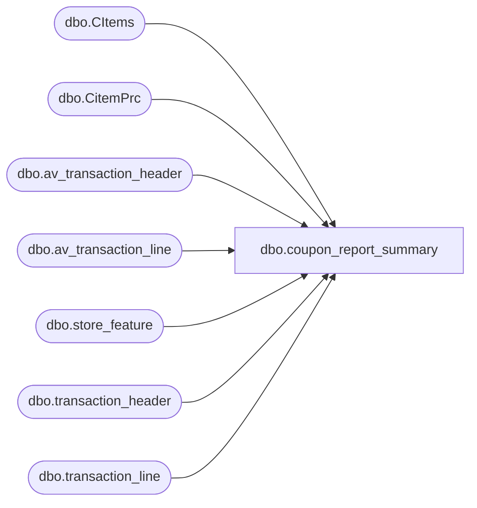

# dbo.coupon_report_summary

**Database:** auditworks  
**Server:** bedrockdb01  

## Architecture Diagram



## Table Dependencies

| Referenced Table |
|---|
| dbo.CItems |
| dbo.CitemPrc |
| dbo.av_transaction_header |
| dbo.av_transaction_line |
| dbo.store_feature |
| dbo.transaction_header |
| dbo.transaction_line |

## Stored Procedure Code

```sql
CREATE PROCEDURE [dbo].[coupon_report_summary] 
  @BeginDate datetime, @EndDate datetime, @itemlist varchar(8000), @storelist varchar(8000)
AS
-- =====================================================================================================
-- Name: 
--
-- Description:	
--
-- Input:	
--			Date range and products to include
--
-- Output: Resultset with the following columns:
--			N/A
--
-- Dependencies: None
--
-- Revision History
--		Name:			Date:			Comments:
--		?				08/24/2010		Initial version source control
-- exec coupon_report_summary '2010-08-01', '2010-08-05',  '000000003352,000000003353', '0001,0002,0003,0004'
-- =====================================================================================================


--BeginDate and EndDate filter the data by date
--itemlist is a list of the coupon numbers as selected by the user. Format: ''000000003352,000000003353'
--storelist is a list of the stores as selected by the user.  Format: '0001,0002,0003,0004'
--storelist can come in as a null string, which indicates that all stores have been chosen

Set NoCount On

declare @separator_position int
declare @list_value varchar(500)

--Create temporary tables to store the data that we need for the report
Create Table #Raw (
RefNo varchar(20),
StoreNo int,
TransDate smalldatetime,
TransNo int,
GrossLineAmt numeric(12,4),
TenderTotal money,
LineID numeric(5),
LineAction tinyint)

Create Table #Item (
ItemNo varchar(20),
Desc1 varchar(50),
Desc2 varchar(50),
DCS char(9),
VC char(6),
ItemPrc money,
AttrName char(8),
SizeName char(8))

Create Table #Store (
StoreNo int)

Create Table #RawST (
TransDate smalldatetime,
StoreNo int,
TransNo int,
GrossLineAmt numeric(12,4),
LineObjType tinyint,
LineObject smallint)

Create Table #TenderAdj (
StoreNo int,
TransNo int,
AdjLineAmt numeric(12,4))

Create Table #SalesTax (
StoreNo int,
TransNo int,
SalesTax numeric(12,4))

--First populate the #Item table with the data in the item string passed in
--Get the position of the next comma. 
select @separator_position = PatIndex('%,%',@itemlist)
While @separator_position > 0
Begin
	--Using the LEFT function, get the ID
	select @list_value = left(@itemlist,@separator_position-1)
	--Insert the ID parsed into the #Item table	
	insert into #Item (ItemNo) Values(@list_value)
	--Remove the ID just obtained from the list
	select @itemlist=substring(@itemlist,@separator_position+1,len(@itemlist)-len(@list_value)-1)
	--Get the position of the next comma. 
	select @separator_position = PatIndex('%,%',@itemlist)
end
--Get the last item
If len(@itemlist) > 0 insert into #Item (ItemNo) Values(@itemlist)

--Update the #Item table with the other values needed
Update #Item Set
  Desc1 = CItems.Desc1,
  Desc2 = CItems.Desc2,
  DCS = CItems.DCS,
  VC = CItems.VC,
  ItemPrc = CItemPrc.ItemPrc,
  AttrName = CItems.AttrName,
  SizeName = CItems.SizeName
From #Item Inner Join beehive.piggyback.dbo.CItems CItems on Convert(Int,#Item.ItemNo) = CItems.ItemNo
Inner Join beehive.piggyback.dbo.CitemPrc AS CItemPrc ON CItems.ItemId=CItemPrc.ItemId  
  and CItemPrc.PrcLvl = 1 AND CItems.DeptCode = 'T'

--Next populate the #Store table with the data in the item string passed in
--If parameter is null string, load all stores from store table
If @storelist = '' 
Begin
  Insert into #Store (StoreNo)   
    SELECT DISTINCT store_no FROM auditworks.dbo.store_feature WHERE store_no <= 500
End
Else
Begin
  --Get the position of the next comma. 
  select @separator_position = PatIndex('%,%',@storelist)
  While @separator_position > 0
 Begin
	--Using the LEFT function, get the ID
	select @list_value = left(@storelist,@separator_position-1)
	--Insert the ID parsed into the #Store table	
	insert into #Store (StoreNo) Values(@list_value)
	--Remove the ID just obtained from the list
	select @storelist=substring(@storelist,@separator_position+1,len(@storelist)-len(@list_value)-1)
	--Get the position of the next comma. 
	select @separator_position = PatIndex('%,%',@storelist)
  end
  --Get the last store
  If len(@storelist) > 0 insert into #Store (StoreNo) Values(@storelist)
End


--Get the transaction from transaction_header and transaction_line
Insert into #Raw
SELECT b.reference_no AS RefNo, a.store_no AS StoreNo, a.transaction_date AS TransDate, 
a.transaction_no AS TransNo, 
SUM(b.gross_line_amount * b.db_cr_none * b.voiding_reversal_flag) AS GrossLineAmt, 
SUM(a.tender_total) AS TenderTotal, b.line_id AS LineID, b.line_action AS LineAction 
--INTO #Combined 
FROM auditworks.dbo.transaction_header a, auditworks.dbo.transaction_line b WITH (NOLOCK) 
WHERE a.transaction_id = b.transaction_id AND  
b.reference_no IN (Select ItemNo from #Item)  AND  
a.store_no IN (Select StoreNo from #Store) AND a.transaction_void_flag = 0 AND 
b.line_void_flag=0 AND b.line_object = 290 AND a.transaction_date Between @BeginDate and @EndDate
GROUP BY b.reference_no, a.store_no, a.transaction_date, a.transaction_no, b.line_id, b.line_action 
ORDER BY b.reference_no, a.store_no, a.transaction_date, a.transaction_no 

--Get the transaction from av_transaction_header and av_transaction_line
INSERT  into #Raw 
SELECT b.reference_no AS RefNo, a.store_no AS StoreNo, a.transaction_date AS TransDate, 
a.transaction_no AS TransNo, SUM(b.gross_line_amount * b.db_cr_none * b.voiding_reversal_flag) AS GrossLineAmt, 
SUM(a.tender_total) AS TenderTotal, b.line_id AS LineID, b.line_action AS LineAction 
FROM auditworks.dbo.av_transaction_header a, auditworks.dbo.av_transaction_line b WITH (NOLOCK) 
WHERE a.av_transaction_id = b.av_transaction_id AND  
b.reference_no IN  (Select ItemNo from #Item) AND  
a.store_no IN (Select StoreNo from #Store) AND 
a.transaction_void_flag = 0 AND b.line_void_flag=0 AND b.line_object = 290 AND 
a.transaction_date Between @BeginDate and @EndDate
GROUP BY b.reference_no, a.store_no, a.transaction_date, a.transaction_no, b.line_id, b.line_action 
ORDER BY b.reference_no, a.store_no, a.transaction_date, a.transaction_no 

--Get the sales tax data and tender adjustment data from transaction_header and transaction_line
Insert Into #RawST
SELECT a.transaction_date AS TransDate, a.store_no AS StoreNo, a.transaction_no AS TransNo, 
  SUM(b.gross_line_amount * b.db_cr_none * b.voiding_reversal_flag) AS GrossLineAmt, 
  b.line_object_type AS LineObjType, b.line_object AS LineObject 
FROM   auditworks.dbo.transaction_header a, auditworks.dbo.transaction_line b WITH (NOLOCK) 
WHERE  a.transaction_id = b.transaction_id AND a.transaction_void_flag = 0 AND b.line_void_flag=0 AND 
  b.line_object_type IN (5,6) AND 
  a.transaction_date Between @BeginDate and @EndDate AND  
  a.store_no IN (Select StoreNo from #Store) AND
  a.transaction_no in ( SELECT TransNo from #Raw ) 
GROUP BY a.store_no, a.transaction_no, a.transaction_date, b.line_object_type, b.line_object 
ORDER BY a.store_no, a.transaction_no, a.transaction_date, b.line_object_type, b.line_object 

--Get the transaction and tender adjustment data from av_transaction_header and av_transaction_line
Insert Into #RawST
SELECT a.transaction_date AS TransDate, a.store_no AS StoreNo, a.transaction_no AS TransNo, 
  SUM(b.gross_line_amount * b.db_cr_none * b.voiding_reversal_flag) AS GrossLineAmt, b.line_object_type AS LineObjType, 
  b.line_object AS LineObject 
FROM   auditworks.dbo.av_transaction_header a, auditworks.dbo.av_transaction_line b WITH (NOLOCK) 
WHERE  a.av_transaction_id = b.av_transaction_id AND a.transaction_void_flag = 0 AND b.line_void_flag=0 AND 
  b.line_object_type IN (5,6) AND
  a.transaction_date Between @BeginDate and @EndDate AND  
  a.store_no IN (Select StoreNo from #Store)  AND
  a.transaction_no in ( SELECT TransNo from #Raw ) 
GROUP BY a.store_no, a.transaction_no, a.transaction_date, b.line_object_type, b.line_object 
ORDER BY a.store_no, a.transaction_no, a.transaction_date, b.line_object_type, b.line_object

--Create one sales tax record per transaction for all of the details found
Insert into #SalesTax
Select StoreNo, TransNo, Sum(GrossLineAmt) 
From #RawST
Where LineObjType = 5
Group by StoreNo, TransNo
Order by StoreNo, TransNo

--Create one adjustment record per transaction for all of the details found
Insert into #TenderAdj
Select StoreNo, TransNo, Sum(GrossLineAmt) 
From #RawST
Where LineObjType = 6 and LineObject in (621,690)
Group by StoreNo, TransNo
Order by StoreNo, TransNo

--This is the resultset to return for a summary report
Select #Raw.RefNo, #Item.Desc1, #Item.Desc2, #Item.DCS, #Item.VC, #Raw.StoreNo, 
  Convert(Char(10),#Raw.TransDate,101) TransDate, #Raw.TransNo,
  #Raw.GrossLineAmt, #Item.AttrName Attr, #Item.SizeName Size, IsNull(#SalesTax.SalesTax,0) SalesTax,
  #Raw.TenderTotal - IsNull(#TenderAdj.AdjLineAmt,0) InvoiceTotal,  #Item.ItemPrc ItemPrice,
  Case #Item.ItemPrc When 0 Then 1 Else Round(-1.0 * #Raw.GrossLineAmt / #Item.ItemPrc,0) End As Qty
From #Raw
Left Join #Item on #Raw.RefNo = #Item.ItemNo
Left Join #SalesTax on #Raw.StoreNo = #SalesTax.StoreNo and #Raw.TransNo = #SalesTax.TransNo
Left Join #TenderAdj on #Raw.StoreNo = #TenderAdj.StoreNo and #Raw.TransNo = #TenderAdj.TransNo
Order by #Raw.RefNo, #Raw.StoreNo, #Raw.TransNo

drop table #Raw  
drop table #RawST
drop table #Item
drop table #Store
drop table #TenderAdj
drop table #SalesTax
```

