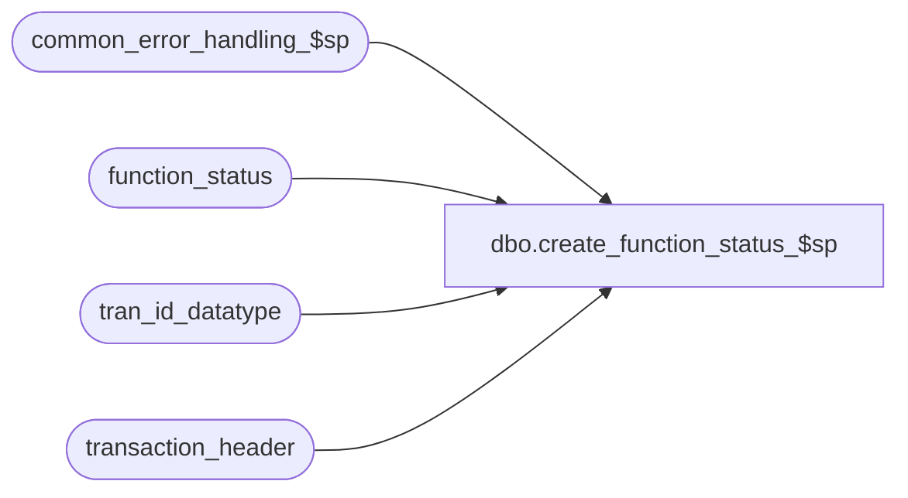

# dbo.create_function_status_$sp

**Database:** auditworks  
**Server:** bedrockdb01  

## Architecture Diagram



## Table Dependencies

| Referenced Table |
|---|
| common_error_handling_$sp |
| function_status |
| tran_id_datatype |
| transaction_header |

## Stored Procedure Code

```sql
create proc dbo.create_function_status_$sp 
@process_id		binary(16),
@user_id			int,
@function_no		tinyint,
@transaction_id		tran_id_datatype = NULL,
@errmsg			nvarchar(1024) OUTPUT,
@store_no		int = 0,
@transaction_date		smalldatetime = NULL,
@date_reject_id		tinyint = 0,
@register_no		smallint = 0,
@status			smallint = 1

AS

/* Proc Name: create_function_status_$sp
   Description: creates a new row in function_status (for error recovery purposes) when a function starts.
		Not to be called as an update to function_status.
   Called from many manual function stored procs and from revalidate.

HISTORY: 

Date     Name           Defect# Desc
Aug24,16 Geoff	      DAOM-1325 Set default transaction_id to NULL, to allow front-end to call proc when argument not available.
Aug16,13 Paul            145958 call common_error_handling_$sp, use try .. catch, added semicolons
Apr25,11 Vicci           126452 Raise error if transaction_id pass is non-null and does not exist.
Aug03,05 Paul           DV-1295 remove hardcoded logic for function 82
Apr28,05 Paul           DV-1234 expand transaction_id to use tran_id_datatype
Oct20,04 Paul           DV-1159 Disallow inserting if function_status exists for same process_id, function_no.
Oct07,04 David          DV-1146 Handle new column user_id.
Apr21,04 Maryam         DV-1071 receive @process_id and pass it to the common_error_handling_$sp
Jul08,03 David    11140/1-LPS2T Set initial status to 20 for functions 82 and 112 (fix for defect 9575)
Mar14,02 Henry          1-A8XPT To add corrected translate rejected trxns, function_no = 112.
					Added R3 common error handling.
Mar15,99 Paul              4356 allow for tran_id < 0 (media_rec)
Feb12,98 Shapoor
	 Sebastiano	n/a	Author
*/

DECLARE @errno			int,
	@object_name		nvarchar(255),
	@process_name		nvarchar(100),
	@operation_name		nvarchar(100),
	@message_id		int,
	@rows			int;

SELECT  @process_name = 'create_function_status_$sp',
        @message_id = 201068,
        @object_name = 'function_status',
        @operation_name = 'SELECT';

BEGIN TRY

IF EXISTS( SELECT 1
           FROM function_status
           WHERE process_id = @process_id -- work tables are unique by process_id only
           AND function_no = @function_no)
  BEGIN
   SELECT @errmsg = 'Previous function did not complete normally. Use cleanup button or log in again.',
   	@errno = 201575,
   	@message_id = 201575;
     GOTO business_error;
  END;

 SELECT @errmsg = 'Failed to CREATE function_status entry (1)',
	     @operation_name = 'INSERT';

IF @transaction_date IS NULL AND @transaction_id >= 1
  BEGIN
   INSERT function_status (
	user_id,
	process_id,
	function_no,
	status,
	entry_date,
	transaction_id,
	store_no,
	register_no,
	transaction_date,
	date_reject_id,
	from_transaction_no)
   SELECT @user_id,
	@process_id,
	@function_no,
	@status,
	getdate(),
	@transaction_id,
	store_no,
	register_no,
	transaction_date,
	date_reject_id,
	transaction_no
     FROM transaction_header
     WHERE transaction_id = @transaction_id;

   SELECT @rows = @@rowcount
   IF @rows < 1
   BEGIN
     SELECT @message_id = 201684, 
            @errmsg = 'Invalid Transaction ID passed (does not exist in transaction_header):  '
              + COALESCE(convert(nvarchar, @transaction_id), 'NULL');
     GOTO business_error;
   END

  END
ELSE
  BEGIN
     SELECT @errmsg = 'Failed to CREATE function_status entry (2)'
   INSERT function_status (
	user_id,
	process_id,
	function_no,
	status,
	entry_date,
	transaction_id,
	store_no,
	register_no,
	transaction_date,
	date_reject_id,
	from_transaction_no)
   VALUES (
	@user_id,
	@process_id,
	@function_no,
	@status,
	getdate(),
	@transaction_id,
	@store_no,
	@register_no,
	@transaction_date,
	@date_reject_id,
	0);

  END;

RETURN;

business_error:   /* Business error handler. */

        EXEC common_error_handling_$sp @function_no, @errno, @errmsg, 0, @message_id, 
             @process_name, @object_name, @operation_name, 0, 1, 0, null, 0, 
	     null, null, null, null, null, null, 0, @process_id, @user_id;
	RETURN;

END TRY

BEGIN CATCH;
        /* Common error handler. */

        SELECT @errno = ERROR_NUMBER(),
		@errmsg = COALESCE(@errmsg, ' ') + ERROR_MESSAGE();

        EXEC common_error_handling_$sp @function_no, @errno, @errmsg, 0, @message_id, 
             @process_name, @object_name, @operation_name, 0, 1, 0, null, 0, 
	     null, null, null, null, null, null, 0, @process_id, @user_id;
	RETURN;
END CATCH;
```

