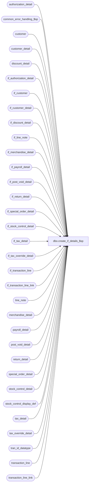

# dbo.create_if_details_$sp

**Database:** auditworks  
**Server:** bedrockdb01  

## Architecture Diagram



## Table Dependencies

| Referenced Table |
|---|
| authorization_detail |
| common_error_handling_$sp |
| customer |
| customer_detail |
| discount_detail |
| if_authorization_detail |
| if_customer |
| if_customer_detail |
| if_discount_detail |
| if_line_note |
| if_merchandise_detail |
| if_payroll_detail |
| if_post_void_detail |
| if_return_detail |
| if_special_order_detail |
| if_stock_control_detail |
| if_tax_detail |
| if_tax_override_detail |
| if_transaction_line |
| if_transaction_line_link |
| line_note |
| merchandise_detail |
| payroll_detail |
| post_void_detail |
| return_detail |
| special_order_detail |
| stock_control_detail |
| stock_control_display_def |
| tax_detail |
| tax_override_detail |
| tran_id_datatype |
| transaction_line |
| transaction_line_link |

## Stored Procedure Code

```sql
CREATE proc [dbo].[create_if_details_$sp] @process_id     binary(16),
@user_id	int,
@transaction_id	tran_id_datatype,
@if_entry_no	tran_id_datatype,
@multiplier	smallint = 1,
@errmsg		nvarchar(255) OUTPUT

AS

/* Procedure Name: create_if_details_$sp
   Description: to post transaction details to interface tables 

HISTORY
Date     Name		Def# Desc
Nov20,17 Kiri	   DAOM-2815 Store number not being updated correctly on IF rejected trans
Oct14,14 Vicci     TFS-88637 When inserting into stock_control_detail use outer join to stock_control_display_def to use units_reversal_factor 
                             for properly making reversals of units in the same way as other procs do.
Jul04,14 Vicci     TFS-74694 Log cost.
Feb27,14 Vicci         61711 Add if_tax_detail.applied_by_line_id.
Jul08,13 Vicci        139695 Add unit_of_measure logging.
Dec14,10 Vicci        120654 Add tax_item_group_id, originating_date, fulfillment_store_no, above_threshold_flag fields.
May14,09 Vicci        109078 Add track_tax field to copy.
Apr28,05 Maryam      DV-1202 insert into if_transaction_line_link. Rename from_line_id to line_id.
         Paul                expand transaction_id to use tran_id_datatype
Sep23,04 David       DV-1146 Use user_id instead of user_name, add columns to inserts.
Jul09,04 ShuZ        DV-1071 Expand user_name to nvarchar(50)
Jun28,05 ShuZ        DV-1071 Add without_receipt_flag when populating return_detail tables.
Apr27,04 Maryam      DV-1071 Receive @process_id and @user_name and pass it to common_error_handling_$sp
Nov17,03 Phu           15801 Populate sku_id, reason, imrd, style_reference_id, display_def_id
Dec19,02 Phu            5327 Retrieve gl_effect
Apr25,02 Phu         1-C9P5S Create entry in if_tax_detail, error handling
Sep24,01 ShuZ           8288 Add an originating_store_no to the stock_control_detail table for use
                             when head-office(or another store) enters a transacion on behalf of
                             another store
May28,01 Winnie		8019 Log pos_deptclass and upc_lookup_division to if_stock_control_detail table
May16,01 Shapoor    	7813 Add column originating_store_no to merchandise* tables to attribute 
		             the sale/return to the store where the sale originated.
Feb22,01 DavidM		7391 Add pos_identifier and pos_identifier_type fields to if_stock_control_detail table.
Oct03,00 Maryam         6782 Modify to log customer.pos_tax_jurisdiction_code, fax, and email_address.
Aug07,98 Daphna         ?    ?
Jun18,96 Sebastiano	     Author
*/

DECLARE
  @errno                        int,
  @message_id                   int,
  @object_name                  nvarchar(255),
  @operation_name               nvarchar(100),
  @process_name                 nvarchar(100)

SELECT @message_id = 201068,
       @process_name = 'create_if_details_$sp'

INSERT if_authorization_detail (
	if_entry_no,
	line_id,
	card_type,
	authorization_no,
	expiry_date,
	swipe_indicator,
	approval_message,
	license_no,
	pos_state_code,
	other_id_type,
	other_id,
	deferred_billing_date,
	deferred_billing_plan,
	signature,
	customer_signature_obtained,
	offline_flag )
SELECT
	@if_entry_no,
	line_id,
	card_type,
	authorization_no,
	expiry_date,
	swipe_indicator,
	approval_message,
	license_no,
	pos_state_code,
	other_id_type,
	other_id,
	deferred_billing_date,
	deferred_billing_plan,
	signature,
	customer_signature_obtained,
	offline_flag
  FROM authorization_detail
  WHERE transaction_id = @transaction_id

SELECT @errno = @@error
IF @errno <> 0
BEGIN
  SELECT @errmsg = 'Failed to INSERT on if_authorization_detail',
         @object_name = 'if_authorization_detail',
         @operation_name = 'INSERT'
  GOTO error
END

INSERT if_customer (
	if_entry_no,
	line_id,
	customer_role,
	title,
	first_name,
	last_name,
	address_1,
	address_2,
	city,
	county,
	state,
	country,
	post_code,
	telephone_no1,
	telephone_no2,
	customer_no,
	pos_tax_jurisdiction_code, 
	fax,
	email_address,
	more_info_flag )
SELECT
	@if_entry_no,
	line_id,
	customer_role,
	title,
	first_name,
	last_name,
	address_1,
	address_2,
	city,
	county,
	state,
	country,
	post_code,
	telephone_no1,
	telephone_no2,
	customer_no,
	pos_tax_jurisdiction_code, 
	fax,
	email_address,
	more_info_flag
  FROM customer
  WHERE transaction_id = @transaction_id

SELECT @errno = @@error
IF @errno <> 0
BEGIN
  SELECT @errmsg = 'Failed to INSERT on if_customer',
         @object_name = 'if_customer',
         @operation_name = 'INSERT'
GOTO error
END

INSERT if_customer_detail (
	if_entry_no,
	line_id,
	customer_role,
	customer_info_type,
	customer_info )
SELECT
	@if_entry_no,
	line_id,
	customer_role,
	customer_info_type,
	customer_info
  FROM customer_detail
  WHERE transaction_id = @transaction_id

SELECT @errno = @@error
IF @errno <> 0
BEGIN
  SELECT @errmsg = 'Failed to INSERT on if_customer_detail',
         @object_name = 'if_customer_detail',
         @operation_name = 'INSERT'
  GOTO error
END

INSERT if_discount_detail (
	if_entry_no,
	line_id,
	applied_by_line_id,
	pos_discount_level,
	pos_discount_type,
	pos_discount_amount,
	applied_flag,
	pos_discount_serial_no )
SELECT
	@if_entry_no,
	line_id,
	applied_by_line_id,
	pos_discount_level,
	pos_discount_type,
	pos_discount_amount,
	applied_flag,
	pos_discount_serial_no
  FROM discount_detail
  WHERE transaction_id = @transaction_id

SELECT @errno = @@error
IF @errno <> 0
BEGIN
  SELECT @errmsg = 'Failed to INSERT on if_discount_detail',
         @object_name = 'if_discount_detail',
         @operation_name = 'INSERT'
  GOTO error
END

INSERT if_line_note (
	if_entry_no,
	line_id,
	note_type,
	line_note )
SELECT 
	@if_entry_no,
	line_id,
	note_type,
	line_note 
  FROM line_note
  WHERE transaction_id = @transaction_id

SELECT @errno = @@error
IF @errno <> 0
BEGIN
  SELECT @errmsg = 'Failed to INSERT on if_line_note',
         @object_name = 'if_line_note',
         @operation_name = 'INSERT'
  GOTO error
END

INSERT if_merchandise_detail (
	if_entry_no,
	line_id,
	merchandise_category,
	upc_lookup_division,
	upc_no,
	units,
	salesperson,
	salesperson2,
	sku_id,
	style_reference_id,
	class_code,
	subclass_code,
	price_override,
	pos_iplu_missing,
	upc_on_file_flag,
	pos_deptclass,
	ticket_price,
	sold_at_price,
	scanned,
	pos_identifier,
	pos_identifier_type,
	plu_price,
	originating_store_no,
	source_store_no,
	fulfillment_store_no,
	cost)
SELECT
	@if_entry_no,
	line_id,
	merchandise_category,
	upc_lookup_division,
	upc_no,
	units * @multiplier,
	salesperson,
	salesperson2,
	sku_id,
	style_reference_id,
	class_code,
	subclass_code,
	price_override,
	pos_iplu_missing,
	upc_on_file_flag,
	pos_deptclass,
	ticket_price,
	sold_at_price,
	scanned,
	pos_identifier,
	pos_identifier_type,
	plu_price,
	originating_store_no,
	source_store_no,
	fulfillment_store_no,
	cost
  FROM merchandise_detail
  WHERE transaction_id = @transaction_id

SELECT @errno = @@error
IF @errno <> 0
BEGIN
  SELECT @errmsg = 'Failed to INSERT on if_merchandise_detail',
         @object_name = 'if_merchandise_detail',
         @operation_name = 'INSERT'
  GOTO error
END

INSERT if_payroll_detail (
	if_entry_no,
	line_id,
	employee_no,
	payroll_date,
	employee_payroll_id,
	employee_type,
	payroll_entry_type )
SELECT
	@if_entry_no,
	p.line_id,
	p.employee_no,
	p.payroll_date,
	p.employee_payroll_id,
	p.employee_type,
	p.payroll_entry_type
  FROM payroll_detail p
  WHERE p.transaction_id = @transaction_id

SELECT @errno = @@error
IF @errno <> 0
BEGIN
  SELECT @errmsg = 'Failed to INSERT on if_payroll_detail',
         @object_name = 'if_payroll_detail',
         @operation_name = 'INSERT'
  GOTO error
END

INSERT if_post_void_detail (
	if_entry_no,
	line_id,
	post_voided_register,
	post_voided_trans_no,
	post_void_successful,
	post_void_reason_code )
SELECT
	@if_entry_no,
	line_id,
	post_voided_register,
	post_voided_trans_no,
	post_void_successful,
	post_void_reason_code
  FROM post_void_detail
  WHERE transaction_id = @transaction_id

SELECT @errno = @@error
IF @errno <> 0
BEGIN
  SELECT @errmsg = 'Failed to INSERT on if_post_void_detail',
         @object_name = 'if_post_void_detail',
         @operation_name = 'INSERT'
  GOTO error
END

INSERT if_return_detail (
	if_entry_no,
	line_id,
	return_reason_message,
	return_reason_code,
	mdse_disposition_code,
	via_warehouse_flag,
	original_salesperson,
	original_salesperson2,
	return_from_store,
	return_from_reg,
	return_from_date,
	return_from_transno,
	without_receipt_flag )
SELECT
	@if_entry_no,
	line_id,
	return_reason_message,
	return_reason_code,
	mdse_disposition_code,
	via_warehouse_flag,
	original_salesperson,
	original_salesperson2,
	return_from_store,
	return_from_reg,
	return_from_date,
	return_from_transno,
	without_receipt_flag
  FROM return_detail
  WHERE transaction_id = @transaction_id

SELECT @errno = @@error
IF @errno <> 0
BEGIN
  SELECT @errmsg = 'Failed to INSERT on if_return_detail',
         @object_name = 'if_return_detail',
         @operation_name = 'INSERT'
  GOTO error
END

INSERT if_special_order_detail (
	if_entry_no,
	line_id,
	units,
	salesperson,
	merchandise_description,
	expecting_delivery_on,
	color_description,
	size_description,
	width_description,
	vendor_name,
	vendor_style_description,
	spo_class_description,
	vendor_no )
SELECT
	@if_entry_no,
	line_id,
	units * @multiplier,
	salesperson,
	merchandise_description,
	expecting_delivery_on,
	color_description,
	size_description,
	width_description,
	vendor_name,
	vendor_style_description,
	spo_class_description,
	vendor_no
  FROM special_order_detail
  WHERE transaction_id = @transaction_id

SELECT @errno = @@error
IF @errno <> 0
BEGIN
  SELECT @errmsg = 'Failed to INSERT on if_special_order_detail',
         @object_name = 'if_special_order_detail',
         @operation_name = 'INSERT'
  GOTO error
END

INSERT if_stock_control_detail (
	if_entry_no,
	line_id,
	upc_no,
	merchandise_key,
	initiated_by_host,
	units,
	other_store_no,
	location_no,
	vendor_no,
	count_date,
	pos_identifier,
	pos_identifier_type,
	pos_deptclass,
	upc_lookup_division,
	originating_store_no,
	display_def_id,
	sku_id,
	reason,
	imrd,
	style_reference_id,
	store_on_file_flag)
SELECT
	@if_entry_no,
	s.line_id,
	s.upc_no,
	s.merchandise_key,
	s.initiated_by_host,
	s.units * CASE WHEN @multiplier = -1 THEN ISNULL(f.units_reversal_factor, @multiplier) ELSE @multiplier END,
	s.other_store_no,
	s.location_no,
	s.vendor_no,
	s.count_date,
	s.pos_identifier,
	s.pos_identifier_type,
	s.pos_deptclass,
	s.upc_lookup_division,
	s.originating_store_no,
	s.display_def_id,
	s.sku_id,
	s.reason,
	s.imrd,
	s.style_reference_id,
	s.store_on_file_flag
  FROM stock_control_detail s
       LEFT OUTER JOIN stock_control_display_def f WITH (NOLOCK) 
         ON s.display_def_id = f.display_def_id
  WHERE s.transaction_id = @transaction_id

SELECT @errno = @@error
IF @errno <> 0
BEGIN
  SELECT @errmsg = 'Failed to INSERT on if_stock_control_detail',
         @object_name = 'if_stock_control_detail',
         @operation_name = 'INSERT'
  GOTO error
END

INSERT if_tax_override_detail (
	if_entry_no,
	line_id,
	tax_level,
	tax_category,
	taxable,
	exception_tax_jurisdiction,
	tax_exempt_no )
SELECT
	@if_entry_no,
	line_id,
	tax_level,
	tax_category,
	taxable,
	exception_tax_jurisdiction,
	tax_exempt_no
  FROM tax_override_detail
 WHERE transaction_id = @transaction_id

SELECT @errno = @@error
IF @errno <> 0
BEGIN
  SELECT @errmsg = 'Failed to INSERT on if_tax_override_detail',
         @object_name = 'if_tax_override_detail',
         @operation_name = 'INSERT'
  GOTO error
END

INSERT if_transaction_line (
	if_entry_no,
	line_id,
	line_sequence,
	line_object_type,
	line_object,
	line_action,
	gross_line_amount,
	pos_discount_amount,
	db_cr_none,
	attachment_qty,
	exception_flag,
	interface_rejection_flag,
	line_void_flag,
	voiding_reversal_flag,
	edit_timestamp,
	reference_type,
	reference_no,
	unit_of_measure )
SELECT
	@if_entry_no,
	line_id,
	line_sequence,
	line_object_type,
	line_object,
	line_action,
	gross_line_amount * @multiplier,
	pos_discount_amount * @multiplier,
	db_cr_none,
	attachment_qty,
	exception_flag,
	interface_rejection_flag,
	line_void_flag,
	voiding_reversal_flag,
	edit_timestamp,
	reference_type,
	reference_no,
	unit_of_measure
   FROM transaction_line
  WHERE transaction_id = @transaction_id

SELECT @errno = @@error
IF @errno <> 0
BEGIN
  SELECT @errmsg = 'Failed to INSERT on if_transaction_line',
         @object_name = 'if_transaction_line',
         @operation_name = 'INSERT'
  GOTO error
END

INSERT if_tax_detail (
	if_entry_no,
	line_id,
	tax_level,
	tax_jurisdiction,
	tax_category,
	tax_rate_code,
	taxable_amount,
	tax_amount,
	combined_rate,
	nontaxable_amount,
	tax_amount_expected,
	tax_on_tax_level,
	tax_on_combined_rate,
	line_object_type,
	tax_strip_flag,
	gl_effect,
	track_tax,
        tax_item_group_id,
        originating_date,
        fulfillment_store_no,  --store from which transfer of ownership passed to client
        above_threshold_flag,
        applied_by_line_id,
        max_applied_by_line_id  )
SELECT
	@if_entry_no,
	line_id,
	tax_level,
	tax_jurisdiction,
	tax_category,
	tax_rate_code,
	taxable_amount * @multiplier,
	tax_amount * @multiplier,
	combined_rate,
	nontaxable_amount * @multiplier,
	tax_amount_expected * @multiplier,
	tax_on_tax_level,
	tax_on_combined_rate,
	line_object_type,
	tax_strip_flag,
	gl_effect,
	track_tax,
        tax_item_group_id,
        originating_date,
        fulfillment_store_no,  --store from which transfer of ownership passed to client
        above_threshold_flag,
        applied_by_line_id,
        max_applied_by_line_id
   FROM tax_detail
  WHERE transaction_id = @transaction_id

SELECT @errno = @@error
IF @errno <> 0
BEGIN
  SELECT @errmsg = 'Failed to INSERT on if_tax_detail',
         @object_name = 'if_tax_detail',
         @operation_name = 'INSERT'
  GOTO error
END

INSERT if_transaction_line_link (
       if_entry_no,
       line_id,
       linked_line_id)
SELECT
       @if_entry_no,
       line_id,
       linked_line_id
  FROM transaction_line_link 
 WHERE transaction_id = @transaction_id

SELECT @errno = @@error
IF @errno <> 0
BEGIN
  SELECT @errmsg = 'Failed to INSERT on if_transaction_line_link',
         @object_name = 'if_transaction_line_link',
         @operation_name = 'INSERT'
  GOTO error
END


RETURN

error:
	EXEC common_error_handling_$sp 0, @errno, @errmsg, 0, @message_id, 
	@process_name, @object_name, @operation_name, 0, 1, 0, null, 0, null,
	null, null, null, null, null, 0, @process_id, @user_id
	
	RETURN
```

