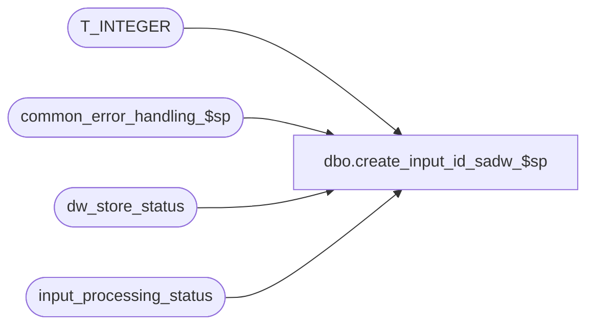

# dbo.create_input_id_sadw_$sp

**Database:** auditworks  
**Server:** bedrockdb01  

## Architecture Diagram



## Table Dependencies

| Referenced Table |
|---|
| T_INTEGER |
| common_error_handling_$sp |
| dw_store_status |
| input_processing_status |

## Stored Procedure Code

```sql
create proc dbo.create_input_id_sadw_$sp (
  @store_no		integer,
  @transaction_date	smalldatetime,
  @instance_id		T_INTEGER,
  @errmsg		nvarchar(255) OUTPUT,
  @input_id		numeric(12,0) OUTPUT)

AS

/*********************************************************************************
Proc name:	create_input_id_sadw_$sp
Description:	To insert the row for input_processing_status and return the identity
		value back to the peripheral server using the OUTPUT parameter @input_id.
		Called by edit from a peripheral server.
**********************************************************************************
HISTORY

Date     Name              Def# Desc
Jan04,11 Paul            105313 Use unicode datatypes
Jan20,05 Sab            DV-1200 Author
*/

DECLARE
  @errno			int,
  @message_id			int,
  @object_name			nvarchar(255),
  @operation_name		nvarchar(100),
  @process_name			nvarchar(100),
  @process_no 			smallint,
  @process_start_datetime	datetime

SELECT @process_no = 160,
       @process_name = 'create_input_id_sadw_$sp',
       @message_id = 201068,
       @process_start_datetime = getdate()

INSERT INTO input_processing_status (
	process_start_datetime, 
	process_no, 
	processing_message, 
	status,
	instance_id,
	to_instance_id)
 SELECT @process_start_datetime, 
	@process_no, 
	'Edit: store-date reserved by another peripheral server.',
	-2,
	@instance_id,
	instance_id
   FROM dw_store_status
  WHERE store_no = @store_no
    AND sales_date = @transaction_date

SELECT @errno = @@error, @input_id = @@identity
IF @errno != 0
 BEGIN
   SELECT @errmsg = 'Failed to INSERT into rebuild_request (sadw)',
	  @object_name = 'rebuild_request',
	  @operation_name = 'INSERT'
   GOTO error
 END

RETURN

error:   /* Common error handler. */

	EXEC common_error_handling_$sp @process_no, @errno, @errmsg, 0, @message_id, 
	@process_name, @object_name, @operation_name, 0, 1, 0, null, 0, null, null,
	null, null, null, null, 0, 0, null

	RETURN
```

