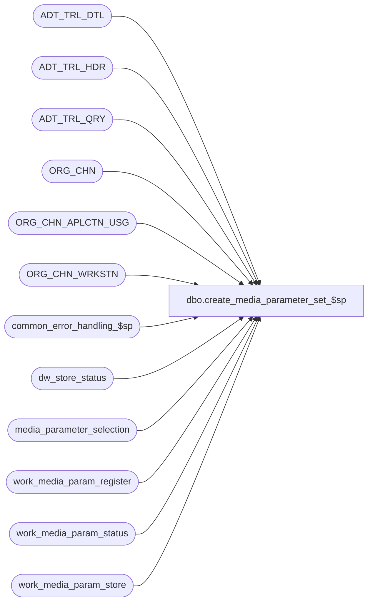

# dbo.create_media_parameter_set_$sp

**Database:** auditworks  
**Server:** bedrockdb01  

## Architecture Diagram



## Table Dependencies

| Referenced Table |
|---|
| ADT_TRL_DTL |
| ADT_TRL_HDR |
| ADT_TRL_QRY |
| ORG_CHN |
| ORG_CHN_APLCTN_USG |
| ORG_CHN_WRKSTN |
| common_error_handling_$sp |
| dw_store_status |
| media_parameter_selection |
| work_media_param_register |
| work_media_param_status |
| work_media_param_store |

## Stored Procedure Code

```sql
create proc [dbo].[create_media_parameter_set_$sp] ( @process_id                    binary(16),
  @user_id                       int,
  @media_parameter_set_no        smallint,
  @effective_from_date           datetime,
  @return_status                 int OUTPUT
)

AS

/* Proc Name: create_media_parameter_set_$sp
   Desc: To create rows in media_parameter_selection based on values in 2 tables: work_media_param_store
           and work_media_param_register which are pre-populated by front end prior calling this proc.
         Does not support adding a new parameter with an effective date falling within and existing expired interval.
         This proc will set @return_status to:
           0:successful, 1:no row created, 2:duplicate row found, 3:row overlapped, 4:transaction existed
         Called by front end only. 

HISTORY:
Date     Name               Def# Desc
Aug22,12 Vicci            137795 Remove SET NOCOUNT OFF from after the call to the common error handling to avoid @@error being reset before the calling proc can see it.
Jun03,11 Vicci          1-46T6N7 media_parameter_selection.effective_until_date is an Expiry Date not a date included in the range upon lookups 
                                 which use [effective_from_date, effective_until_date[ so the effective_until_date must be set to the next entry's
                                 effective_from_date (not to a second earlier).  Re-order operations to avoid creating-then-repairing an integrity
                                 which the media parameter selection trigger will no longer allow.
Oct05,09 Phu              111830 Change code to be the same as Oracle to avoid Oracle error: single row subquery returns more than one row.
Oct23,08 Phu            1-3YDOA1 Make sure that there is only 1 open media parameter set per store-register.
Mar27,08 Phu         69610/95303 Initial development.

*/

DECLARE
  @current_date_time                datetime,
  @errno                            int,
  @errmsg                           nvarchar(255),
  @rows                             int,
  @message_id                       int,
  @object_name                      nvarchar(255),
  @operation_name                   nvarchar(100),
  @process_name                     nvarchar(100),
  @sep                              nchar(1)

SET NOCOUNT ON
  
SELECT @process_name = 'create_media_parameter_set_$sp',
       @message_id = 201068,
       @current_date_time = getdate(),
       @return_status = 0,
       @sep = nchar(12)

DELETE FROM work_media_param_status
WHERE process_id = @process_id

SELECT @errno = @@error
IF @errno != 0
BEGIN
  SELECT @errmsg = 'Unable to delete rows',
         @object_name = 'work_media_param_status',
         @operation_name = 'DELETE'
  GOTO error
END

INSERT INTO work_media_param_status (
  process_id,
  store_no,
  register_no,
  return_status,
  action_code,
  ENTRY_ID)
SELECT
  @process_id,
  o.ORG_CHN_NUM,
  w.WRKSTN_NUM,
  0, -- assuming successful
  'A', -- assuming 'A'dd
  s.ENTRY_ID
FROM ORG_CHN o, ORG_CHN_APLCTN_USG a, ORG_CHN_WRKSTN w, work_media_param_store s, work_media_param_register r
WHERE s.process_id = @process_id
AND r.process_id = @process_id
AND (s.store_no = o.ORG_CHN_NUM OR s.store_no = -1)
AND o.ACTV > 0
AND o.ORG_CHN_NUM = a.ORG_CHN_NUM
AND a.VLDTY > 0

AND o.ORG_CHN_NUM = w.ORG_CHN_NUM
AND (w.WRKSTN_NUM = r.register_no OR r.register_no = -1)
AND w.ACTV = 1

SELECT @errno = @@error, @rows = @@rowcount
IF @errno != 0
BEGIN
  SELECT @errmsg = 'Unable to insert rows from ORG_CHN, ORG_CHN_APLCTN_USG',
         @object_name = 'work_media_param_status',
         @operation_name = 'INSERT'
  GOTO error
END

IF @rows = 0
BEGIN
  SELECT @return_status = 1 -- no row created, will never happen because front end pre-validates store-reg prior calling this proc.
  RETURN
END


UPDATE work_media_param_status
SET return_status = 2
FROM work_media_param_status w, media_parameter_selection s
WHERE w.process_id = @process_id
AND w.store_no = s.store_no
AND w.register_no = s.register_no
AND s.effective_from_date = @effective_from_date

SELECT @errno = @@error, @rows = @@rowcount
IF @errno != 0
BEGIN
  SELECT @errmsg = 'Unable to update rows (duplicate)',
         @object_name = 'work_media_param_status',
         @operation_name = 'UPDATE'
  GOTO error
END

IF @rows > 0
BEGIN
  SELECT @return_status = 2 -- duplicate, rows already existed
  RETURN
END


UPDATE work_media_param_status
SET return_status = 3
FROM work_media_param_status w, media_parameter_selection s
WHERE w.process_id = @process_id
AND w.store_no = s.store_no
AND w.register_no = s.register_no
AND s.effective_from_date < @effective_from_date
AND s.effective_until_date > @effective_from_date
SELECT @errno = @@error, @rows = @@rowcount
IF @errno != 0
BEGIN
  SELECT @errmsg = 'Unable to update rows (overlapped)',
         @object_name = 'work_media_param_status',
         @operation_name = 'UPDATE'
  GOTO error
END

IF @rows > 0
BEGIN
  SELECT @return_status = 3 -- rows overlapped
  RETURN
END

UPDATE work_media_param_status
SET return_status = 4
FROM work_media_param_status w, dw_store_status d
WHERE w.process_id = @process_id
AND w.store_no = d.store_no
AND d.sales_date >= @effective_from_date
AND d.sales_date < @current_date_time
AND d.store_status <> 0
SELECT @errno = @@error, @rows = @@rowcount
IF @errno != 0
BEGIN
  SELECT @errmsg = 'Unable to update rows (transactions existed)',
         @object_name = 'work_media_param_status',
         @operation_name = 'UPDATE'
  GOTO error
END

IF @rows > 0
BEGIN
  SELECT @return_status = 4 -- transactions existed
  RETURN
END

UPDATE work_media_param_status
SET action_code = 'B', -- both 'M'odify and 'A'dd
    old_effective_from_date = s.effective_from_date  --Note:  there can only be 1 unexpired (null until date) entry in media_parameter_selection for a given store/reg
FROM work_media_param_status w, media_parameter_selection s
WHERE w.process_id = @process_id
AND w.return_status = 0
AND w.store_no = s.store_no
AND w.register_no = s.register_no
AND s.effective_from_date < @effective_from_date
AND s.effective_until_date IS NULL

SELECT @errno = @@error, @rows = @@rowcount
IF @errno != 0
BEGIN
  SELECT @errmsg = 'Unable to set action_code to modify where effective_from_date < @effective_from_date',
         @object_name = 'work_media_param_status',
         @operation_name = 'UPDATE'
  GOTO error
END

IF @rows > 0
BEGIN
  BEGIN TRANSACTION
 
  -- set effective_until_date prior to @effective_from_date (i.e. expire old row)
  UPDATE media_parameter_selection
     SET effective_until_date = @effective_from_date
    FROM work_media_param_status w, media_parameter_selection s
   WHERE w.process_id = @process_id
     AND w.return_status = 0
     AND w.store_no = s.store_no
     AND w.register_no = s.register_no
     AND w.old_effective_from_date IS NOT NULL
     AND w.old_effective_from_date = s.effective_from_date
  SELECT @errno = @@error
  IF @errno != 0
  BEGIN
    SELECT @errmsg = 'Unable to set effective_until_date where effective_until_date is null',
           @object_name = 'media_parameter_selection',
           @operation_name = 'UPDATE'
    GOTO error
  END
  
  -- create rows for new effective_from_date
  INSERT INTO media_parameter_selection (
         store_no,
         register_no,
         effective_from_date,
         effective_until_date,
         media_parameter_set_no,
         transaction_id,
         conversion_outstanding)
  SELECT
         w.store_no,
         w.register_no,
         @effective_from_date,
         NULL,
         @media_parameter_set_no,
         NULL,
         0
    FROM work_media_param_status w
   WHERE w.process_id = @process_id
     AND w.return_status = 0
     AND w.action_code = 'B'
     AND w.old_effective_from_date IS NOT NULL
  SELECT @errno = @@error
  IF @errno != 0
  BEGIN
    SELECT @errmsg = 'Unable to insert rows for null effective_until_date',
    @object_name = 'media_parameter_selection',
           @operation_name = 'INSERT'
    GOTO error
  END

  COMMIT TRANSACTION
END -- IF @rows > 0

-- Handle the case where row is created at the beginning.
-- old_effective_from_date is used as effective_until_date
-- Use 'I'nsert to differentiate with 'A' in order to prevent it from inserting into
-- media_parameter_selection more than once and to log to audit trail correctly.
UPDATE work_media_param_status
   SET action_code = 'I',
       old_effective_from_date = (SELECT MIN(s.effective_from_date)
                                    FROM media_parameter_selection s
                                   WHERE s.store_no = w.store_no
                                     AND s.register_no = w.register_no
                                     AND s.effective_from_date > @effective_from_date)
  FROM work_media_param_status w, media_parameter_selection s
 WHERE w.process_id = @process_id
   AND w.return_status = 0
   AND w.store_no = s.store_no
   AND w.register_no = s.register_no
   AND s.effective_from_date > @effective_from_date
SELECT @errno = @@error, @rows = @@rowcount
IF @errno != 0
BEGIN
  SELECT @errmsg = 'Unable to set action_code to Insert where effective_from_date > @effective_from_date',
         @object_name = 'work_media_param_status',
         @operation_name = 'UPDATE'
  GOTO error
END

IF @rows > 0
BEGIN
  INSERT INTO media_parameter_selection (
         store_no,
         register_no,
         effective_from_date,
         effective_until_date,
         media_parameter_set_no,
         transaction_id,
         conversion_outstanding)
  SELECT DISTINCT
         w.store_no,
         w.register_no,
         @effective_from_date,
         w.old_effective_from_date,
         @media_parameter_set_no,
         NULL,
         0
    FROM work_media_param_status w
   WHERE w.process_id = @process_id
     AND w.return_status = 0
     AND w.action_code = 'I'
  SELECT @errno = @@error
  IF @errno != 0
  BEGIN
    SELECT @errmsg = 'Unable to insert rows for action_code = I',
           @object_name = 'media_parameter_selection',
           @operation_name = 'INSERT'
    GOTO error
  END
END -- IF @rows > 0


INSERT INTO media_parameter_selection (
  store_no,
  register_no,
  effective_from_date,
  effective_until_date,
  media_parameter_set_no,
  transaction_id,
  conversion_outstanding)
SELECT
  w.store_no,
  w.register_no,
  @effective_from_date,
  NULL,
  @media_parameter_set_no,
  NULL,
  0
FROM work_media_param_status w
WHERE w.process_id = @process_id
AND w.return_status = 0
AND w.action_code = 'A'

SELECT @errno = @@error
IF @errno != 0
BEGIN
  SELECT @errmsg = 'Unable to insert rows for store, register',
         @object_name = 'media_parameter_selection',
         @operation_name = 'INSERT'
  GOTO error
END

INSERT ADT_TRL_HDR (
    ENTRY_ID,
    ENTRY_DATE_TIME,
    USER_ID,
    APP_ID,
    ROOT_TBL_NAME,
    ROOT_TBL_KEY,
    ROOT_TBL_KEY_RSRC_NAME,
    ROOT_TBL_KEY_RSRC_PRMS,
    FNCTN_NUM,
    ADT_CMNT)
SELECT DISTINCT
    w.ENTRY_ID,
    @current_date_time,
    @user_id,
    300,
    'ORG_CHN',
    convert(nvarchar, w.store_no),
    'TK_STOR',
    convert(nvarchar, w.store_no),
    1002,
    NULL
FROM work_media_param_status w
WHERE w.process_id = @process_id
AND w.return_status = 0

SELECT @errno = @@error
IF @errno <> 0
BEGIN
  SELECT @errmsg = 'Unable to insert rows into ADT_TRL_HDR',
         @object_name = 'ADT_TRL_HDR',
         @operation_name = 'INSERT'
  GOTO error
END

INSERT ADT_TRL_DTL (
    ENTRY_ID,
    TBL_NAME,
    TBL_KEY,
    TBL_KEY_RSRC_NAME,
    TBL_KEY_RSRC_PRMS,
    ACTN_CODE,
    CLMN_NAME,
    NEW_VAL )  -- OLD_VAL is always null
SELECT
    w.ENTRY_ID,
    'media_parameter_selection',
    convert(nvarchar, w.store_no) + @sep + convert(nvarchar, w.register_no) + @sep + convert(nvarchar, w.old_effective_from_date), -- TBL_KEY
    'TK_STOR_WORK_EFFE_DATE', -- TBL_KEY_RSRC_NAME
    convert(nvarchar, w.store_no) + @sep + convert(nvarchar, w.register_no) + @sep + convert(nvarchar, w.old_effective_from_date), -- TBL_KEY_RSRC_PRMS
    'M', -- ACTN_CODE 'M'odify
    'effective_to_date', -- CLMN_NAME
    convert(nvarchar, DATEADD(ss, -1, @effective_from_date)) -- NEW_VAL
FROM work_media_param_status w
WHERE w.process_id = @process_id
AND w.return_status = 0
AND w.old_effective_from_date IS NOT NULL
AND w.action_code = 'B'

SELECT @errno = @@error
IF @errno <> 0
BEGIN
  SELECT @errmsg = 'Unable to insert rows into ADT_TRL_DTL (1)',
         @object_name = 'ADT_TRL_DTL',
         @operation_name = 'INSERT'
  GOTO error
END

INSERT ADT_TRL_DTL (
    ENTRY_ID,
    TBL_NAME,
    TBL_KEY,
    TBL_KEY_RSRC_NAME,
    TBL_KEY_RSRC_PRMS,
    ACTN_CODE,
    CLMN_NAME,
    NEW_VAL )  -- OLD_VAL is always null
SELECT
    w.ENTRY_ID,
    'media_parameter_selection',
    convert(nvarchar, w.store_no) + @sep + convert(nvarchar, w.register_no) + @sep + convert(nvarchar, @effective_from_date), -- TBL_KEY
    'TK_STOR_WORK_EFFE_DATE', -- TBL_KEY_RSRC_NAME
    convert(nvarchar, w.store_no) + @sep + convert(nvarchar, w.register_no) + @sep + convert(nvarchar, @effective_from_date), -- TBL_KEY_RSRC_PRMS
    'A', -- ACTN_CODE 'A'dd
    'effective_from_date', -- CLMN_NAME
    convert(nvarchar, @effective_from_date)
FROM work_media_param_status w
WHERE w.process_id = @process_id
AND w.return_status = 0

SELECT @errno = @@error
IF @errno <> 0
BEGIN
  SELECT @errmsg = 'Unable to insert rows into ADT_TRL_DTL (2)',
         @object_name = 'ADT_TRL_DTL',
         @operation_name = 'INSERT'
  GOTO error
END

INSERT ADT_TRL_DTL (
    ENTRY_ID,
    TBL_NAME,
    TBL_KEY,
    TBL_KEY_RSRC_NAME,
    TBL_KEY_RSRC_PRMS,
    ACTN_CODE,
    CLMN_NAME,
    NEW_VAL )  -- OLD_VAL is always null
SELECT
    w.ENTRY_ID,
    'media_parameter_selection',
    convert(nvarchar, w.store_no) + @sep + convert(nvarchar, w.register_no) + @sep + convert(nvarchar, @effective_from_date), -- TBL_KEY
    'TK_STOR_WORK_EFFE_DATE', -- TBL_KEY_RSRC_NAME
    convert(nvarchar, w.store_no) + @sep + convert(nvarchar, w.register_no) + @sep + convert(nvarchar, @effective_from_date), -- TBL_KEY_RSRC_PRMS
    'A', -- ACTN_CODE 'A'dd
    'effective_until_date', -- CLMN_NAME
    convert(nvarchar, DATEADD(ss, -1, w.old_effective_from_date))
FROM work_media_param_status w
WHERE w.process_id = @process_id
AND w.return_status = 0
AND w.old_effective_from_date IS NOT NULL
AND w.action_code = 'I'

SELECT @errno = @@error
IF @errno <> 0
BEGIN
  SELECT @errmsg = 'Unable to insert rows into ADT_TRL_DTL (3)',
         @object_name = 'ADT_TRL_DTL',
         @operation_name = 'INSERT'
  GOTO error
END


INSERT ADT_TRL_QRY (
    ENTRY_ID,
    QRY_KEY_NUM,
    KEY_PART_VAL_1,
    KEY_PART_VAL_2)
SELECT
    w.ENTRY_ID,
    1001,
    convert(nvarchar, w.store_no),
    convert(nvarchar, w.register_no)
FROM work_media_param_status w
WHERE w.process_id = @process_id
AND w.return_status = 0

SELECT @errno = @@error
IF @errno <> 0
BEGIN
  SELECT @errmsg = 'Unable to insert audit trail query.',
         @object_name = 'ADT_TRL_QRY',
         @operation_name = 'INSERT'
  GOTO error
END


SET NOCOUNT OFF
RETURN


error:

  SET NOCOUNT OFF

  EXEC common_error_handling_$sp 116, @errno, @errmsg, 0, @message_id, 
       @process_name, @object_name,  @operation_name, 0, 1, 0, null, 0, null, null, null,
       null, null, null, 0, @process_id, @user_id
  RETURN
```

