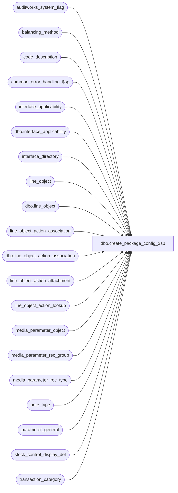

# dbo.create_package_config_$sp

**Database:** auditworks  
**Server:** bedrockdb01  

## Architecture Diagram



## Table Dependencies

| Referenced Table |
|---|
| auditworks_system_flag |
| balancing_method |
| code_description |
| common_error_handling_$sp |
| interface_applicability |
| dbo.interface_applicability |
| interface_directory |
| line_object |
| dbo.line_object |
| line_object_action_association |
| dbo.line_object_action_association |
| line_object_action_attachment |
| line_object_action_lookup |
| media_parameter_object |
| media_parameter_rec_group |
| media_parameter_rec_type |
| note_type |
| parameter_general |
| stock_control_display_def |
| transaction_category |

## Stored Procedure Code

```sql
CREATE proc  dbo.create_package_config_$sp AS

/*
  PROC NAME: create_package_config_$sp
       DESC: Will set up the media rec for coalition. Populates base line objects when installing a new empty db.
             For 5.0, called from release_no_pkg_cnfg_$upgr on new installs when user enters Y at prompt.
             For 5.1, called from EPILOGUE release_finalization_steps for new installs where it was requested and for upgrades of clients with package config previously installed.
             Need to retrofit latest version to shipping b build (along with tbdats).

  NOTE:
  When adding a new system line_object, you should manually add that line_object to CMSA50_TBDAT line_object_pkg_config in order to get
  it translated, and ask CM to run their script to get the resource id and then modify this proc to insert the line_object
  with that resource id. 
  Also, line-objects are to be added "pending review".

  Unicode version.
  
  WARNING:  Ensure any changes to this proc take the @execution_type (1=requested installation, 2=automated upgrade) into consideration.

HISTORY:   
WARNING:  set @package_config_release_no below when submitting any changes.

Date      Name          Def# Desc
Jun23,16  Vicci    DAOM-1002 Add Closing Float changed to Cashier category (since Uruguay invoice number is logged generically without specifying what was done to what float)
                             and Digital Transaction Signature Stamp attachment.
Jun07,16  Vicci     DAOM-292 Add cash deposited under Banking to default configuration and its lookup from banking STRDEP and attachments.
Oct31,14  Vicci    TFS-90697 Add line-object 9069 (Desired till float) and corresponding increase/decrease associations.
Aug28,12  Vicci    TFS-82889 Make re-runnable upon upgrade of a client who had previously installed the package config either directly or via the SA_XPRESS installation.
                             In this automatic upgrade scenario, only add new line-objects and their config, do not add media parameter sets etc.
Apr12,12  Paul        134132 prevent error 2627 by setting dummy_transaction_category on insert
Apr10,12  Vicci      FIXREPO Make media-rec rec-types activated more closely match Enterprise Express
Mar29,12  Vicci      FIXREPO Add 9063 and 9064 that were also missing.
Mar21,12  Vicci       109078 Add 9067 POS Error that was added to package config via UPGR but forgotten here as well as resource_ids for 9065, 9068.
Dec19,11  Paul        128524 corrected proc to match line_object tbdat (added if exists for line_object 9001), added error trap
Apr29,11  Vicci       126716 Ensure default_tax_rate_code set correctly.
May25,09  Vicci       109078 Add Order Mgt transaction line object.
Jul21,08  Vicci         None Set resource_id upon line-object insert
Apr23,07  Paul       DV-1356 apply 62921, 65081 to SA5
Oct03,05  Paul         60471 apply 60822 to SA5
Jun08,05  David      DV-1263 Set LOAA.db_cr_none to -1 for L_O 9019, L_A 207. Set update_timing to 5 Coalition interface.
				Set LOAAT.merchandise_category to 1 for attachment type 1. Activate display_def_id,
				 note_types, and system transaction categories that are used for POS Direct Feed. 
Jan19,06  David        65081 Add L_O_A_Attachment for note type 9019.
Nov04,05  David        62921 Activate transaction category 201 to 206.
Oct31,05  David        61728 Fix db_cr_none, store_balance_group for L_O 9019.
Sep23,05  David        60822 Fix l_o_a_a.reference_no_option. 
Sep15,05  David        60266 Retrofit to 4.1. 
Apr05,05  Maryam     DV-1202 Author

*/


DECLARE
@errmsg				nvarchar(2000),
@errno				INT,
@process_no			int,
@process_id			int,
@process_name		        nvarchar(100),
@message_id		        int,	
@object_name			nvarchar(255),
@operation_name			nvarchar(255),
@package_config_release_no      nvarchar(255),
@upgrade_in_progress 		tinyint,
@execution_type 	        tinyint 	--1=Requested installation;  2=Automatic upgrade of prior installation

SELECT @package_config_release_no = '5.1.011.000',
       @process_name = 'create_package_config_$sp',
       @process_no = 0,
       @message_id = 201068,
       @process_id = @@spid,
       @object_name = 'install',
       @operation_name = 'install'

BEGIN TRY

IF EXISTS (SELECT 1 FROM line_object WHERE line_object = 9000)
  SELECT @execution_type = 2
ELSE
  SELECT @execution_type = 1

--Turn off upgrade in progress flag so that triggers fire
SELECT @upgrade_in_progress = upgrade_in_progress FROM parameter_general
IF @upgrade_in_progress = 1
  UPDATE parameter_general
     SET upgrade_in_progress = 0

IF @execution_type = 1
BEGIN
  SELECT @object_name = 'interface_directory'
  UPDATE interface_directory
     SET update_timing = 5
   WHERE interface_id = 16
     AND update_timing <> 5 
END

SELECT @object_name = 'transaction_category'
UPDATE transaction_category
   SET active_flag = 1 
 WHERE transaction_category BETWEEN 201 AND 206
   AND active_flag = 0


SELECT @object_name = 'line_object'

--Create line_objects
IF NOT EXISTS (SELECT 1
                 FROM line_object
                WHERE line_object = 9000)
BEGIN                
insert into dbo.line_object
            (line_object, line_object_type, line_object_description, default_tax_rate_code, resource_id, object_export_code, tax_item_group_id, proration_method, lookup_pos_code, pos_description_token_list, disregard_pos_descr_change, lookup_partial_pos_code, active_flag, approval_status_date, auto_config_verified)
     VALUES (9000, 12, 'Workstation', Null, 3830, Null, Null, Null, '012.000.WORKSTATION.', 'Workstation', 1, Null, 1, getdate(), 0)
END

IF NOT EXISTS (SELECT 1
                 FROM line_object
                WHERE line_object = 9001)
BEGIN 
insert into dbo.line_object
            (line_object, line_object_type, line_object_description, default_tax_rate_code, resource_id, object_export_code, tax_item_group_id, proration_method, lookup_pos_code, pos_description_token_list, disregard_pos_descr_change, lookup_partial_pos_code, active_flag, approval_status_date, auto_config_verified)
     VALUES (9001, 12, 'Store', Null, 3831, Null, Null, Null, '012.000.SYSCTL.', 'Store', 1, Null, 1, getdate(), 0)
END

IF NOT EXISTS (SELECT 1
                 FROM line_object
                WHERE line_object = 9006)
BEGIN 
insert into dbo.line_object
            (line_object, line_object_type, line_object_description, default_tax_rate_code, resource_id, object_export_code, tax_item_group_id, proration_method, lookup_pos_code, pos_description_token_list, disregard_pos_descr_change, lookup_partial_pos_code, active_flag, approval_status_date, auto_config_verified)
     VALUES (9006, 12, 'System', Null, 3836, Null, Null, Null, '012.000.SYSTEM.', 'System', 1, Null, 1, getdate(), 0)
END

IF NOT EXISTS (SELECT 1
                 FROM line_object
                WHERE line_object = 9002)
BEGIN 
insert into dbo.line_object
            (line_object, line_object_type, line_object_description, default_tax_rate_code, resource_id, object_export_code, tax_item_group_id, proration_method, lookup_pos_code, pos_description_token_list, disregard_pos_descr_change, lookup_partial_pos_code, active_flag, approval_status_date, auto_config_verified)
     VALUES (9002, 12, 'Till', Null, 3832, Null, Null, Null, '012.000.TILL.', 'Till', 1, Null, 1, getdate(), 0)
END

IF NOT EXISTS (SELECT 1
                 FROM line_object
                WHERE line_object = 9003)
BEGIN 
insert into dbo.line_object
            (line_object, line_object_type, line_object_description, default_tax_rate_code, resource_id, object_export_code, tax_item_group_id, proration_method, lookup_pos_code, pos_description_token_list, disregard_pos_descr_change, lookup_partial_pos_code, active_flag, approval_status_date, auto_config_verified)
     VALUES (9003, 14, 'Shipping address', Null, 3833, Null, Null, Null, '014.000.ADDRESS.IsShipping.', 'Shipping address', 1, Null, 1, getdate(), 0)
END

IF NOT EXISTS (SELECT 1
                 FROM line_object
                WHERE line_object = 9004)
BEGIN 
insert into dbo.line_object
            (line_object, line_object_type, line_object_description, default_tax_rate_code, resource_id, object_export_code, tax_item_group_id, proration_method, lookup_pos_code, pos_description_token_list, disregard_pos_descr_change, lookup_partial_pos_code, active_flag, approval_status_date, auto_config_verified)
 VALUES (9004, 14, 'Billing address', Null, 3834, Null, Null, Null, '014.000.ADDRESS.IsBilling.', 'Billing address', 1, Null, 1, getdate(), 0)
END

IF NOT EXISTS (SELECT 1
                 FROM line_object
                WHERE line_object = 9005)
BEGIN 
insert into dbo.line_object
            (line_object, line_object_type, line_object_description, default_tax_rate_code, resource_id, object_export_code, tax_item_group_id, proration_method, lookup_pos_code, pos_description_token_list, disregard_pos_descr_change, lookup_partial_pos_code, active_flag, approval_status_date, auto_config_verified)
     VALUES (9005, 11, 'POS transaction', Null, 3835, Null, Null, Null, '011.000.IsPostVoid.', 'POS transaction', 1, Null, 1, getdate(), 0)
END

IF NOT EXISTS (SELECT 1
                 FROM line_object
                WHERE line_object = 9007)
BEGIN 
insert into dbo.line_object
            (line_object, line_object_type, line_object_description, default_tax_rate_code, resource_id, object_export_code, tax_item_group_id, proration_method, lookup_pos_code, pos_description_token_list, disregard_pos_descr_change, lookup_partial_pos_code, active_flag, approval_status_date, auto_config_verified)
     VALUES (9007, 6, 'Cash', Null, 3837, 'CASH', Null, Null, '006.000.Idx=1.', 'Cash', 1, Null, 1, getdate(), 0)
END

IF NOT EXISTS (SELECT 1
                 FROM line_object
                WHERE line_object = 9008)
BEGIN 
insert into dbo.line_object
            (line_object, line_object_type, line_object_description, default_tax_rate_code, resource_id, object_export_code, tax_item_group_id, proration_method, lookup_pos_code, pos_description_token_list, disregard_pos_descr_change, lookup_partial_pos_code, active_flag, approval_status_date, auto_config_verified)
     VALUES (9008, 1, 'Merchandise', 1, 3838, Null, Null, Null, '001.000.', 'Merchandise', 1, Null, 1, getdate(), 0)
END

IF NOT EXISTS (SELECT 1
                 FROM line_object
                WHERE line_object = 9009)
BEGIN 
insert into dbo.line_object
            (line_object, line_object_type, line_object_description, default_tax_rate_code, resource_id, object_export_code, tax_item_group_id, proration_method, lookup_pos_code, pos_description_token_list, disregard_pos_descr_change, lookup_partial_pos_code, active_flag, approval_status_date, auto_config_verified)
     VALUES (9009, 11, 'Transfer', Null, 3839, Null, Null, Null, '011.009.STOCK.TRANSFER.Type=XIN_,XOUT,XRTF.', 'Transfer', 1, Null, 1, getdate(), 0)
END

IF NOT EXISTS (SELECT 1
                 FROM line_object
                WHERE line_object = 9010)
BEGIN 
insert into dbo.line_object
            (line_object, line_object_type, line_object_description, default_tax_rate_code, resource_id, object_export_code, tax_item_group_id, proration_method, lookup_pos_code, pos_description_token_list, disregard_pos_descr_change, lookup_partial_pos_code, active_flag, approval_status_date, auto_config_verified)
     VALUES (9010, 11, 'P.O. receipt', Null, 3840, Null, Null, Null, '011.011.STOCK.TRANSFER.Type=XGRV.', 'P.O. receipt', 1, Null, 1, getdate(), 0)
END

IF NOT EXISTS (SELECT 1
                 FROM line_object
                WHERE line_object = 9011)
BEGIN 
insert into dbo.line_object
            (line_object, line_object_type, line_object_description, default_tax_rate_code, resource_id, object_export_code, tax_item_group_id, proration_method, lookup_pos_code, pos_description_token_list, disregard_pos_descr_change, lookup_partial_pos_code, active_flag, approval_status_date, auto_config_verified)
     VALUES (9011, 11, 'Return to vendor', Null, 3841, Null, Null, Null, '011.012.STOCK.TRANSFER.Type=XRTV.', 'Return to vendor', 1, Null, 1, getdate(), 0)
END

IF NOT EXISTS (SELECT 1
                 FROM line_object
                WHERE line_object = 9012)
BEGIN 
insert into dbo.line_object
            (line_object, line_object_type, line_object_description, default_tax_rate_code, resource_id, object_export_code, tax_item_group_id, proration_method, lookup_pos_code, pos_description_token_list, disregard_pos_descr_change, lookup_partial_pos_code, active_flag, approval_status_date, auto_config_verified)
     VALUES (9012, 11, 'Store shipment', Null, 3842, Null, Null, Null, '011.010.STOCK.TRANSFER.Type=XGRF.', 'Store shipment', 1, Null, 1, getdate(), 0)
END

IF NOT EXISTS (SELECT 1
                 FROM line_object
                WHERE line_object = 9013)
BEGIN 
insert into dbo.line_object
            (line_object, line_object_type, line_object_description, default_tax_rate_code, resource_id, object_export_code, tax_item_group_id, proration_method, lookup_pos_code, pos_description_token_list, disregard_pos_descr_change, lookup_partial_pos_code, active_flag, approval_status_date, auto_config_verified)
     VALUES (9013, 11, 'Inventory count', Null, 3843, Null, Null, Null, '011.205.STOCK.TAKE.', 'Inventory count', 1, Null, 1, getdate(), 0)
END

IF NOT EXISTS (SELECT 1
                 FROM line_object
                WHERE line_object = 9014)
BEGIN 
insert into dbo.line_object
            (line_object, line_object_type, line_object_description, default_tax_rate_code, resource_id, object_export_code, tax_item_group_id, proration_method, lookup_pos_code, pos_description_token_list, disregard_pos_descr_change, lookup_partial_pos_code, active_flag, approval_status_date, auto_config_verified)
     VALUES (9014, 14, 'Shipment information', Null, 3844, Null, Null, Null, '014.000.STOCK.TRANSFER.', 'Shipment information', 1, Null, 1, getdate(), 0)
END

IF NOT EXISTS (SELECT 1
                 FROM line_object
                WHERE line_object = 9015)
BEGIN 
insert into dbo.line_object
            (line_object, line_object_type, line_object_description, default_tax_rate_code, resource_id, object_export_code, tax_item_group_id, proration_method, lookup_pos_code, pos_description_token_list, disregard_pos_descr_change, lookup_partial_pos_code, active_flag, approval_status_date, auto_config_verified)
     VALUES (9015, 12, 'Till creation', Null, 3845, Null, Null, Null, '012.000.FLOAT.IsTill.Amt=0.', 'Till creation', 1, Null, 1, getdate(), 0)
END

IF NOT EXISTS (SELECT 1
                 FROM line_object
                WHERE line_object = 9016)
BEGIN 
insert into dbo.line_object
            (line_object, line_object_type, line_object_description, default_tax_rate_code, resource_id, object_export_code, tax_item_group_id, proration_method, lookup_pos_code, pos_description_token_list, disregard_pos_descr_change, lookup_partial_pos_code, active_flag, approval_status_date, auto_config_verified)
     VALUES (9016, 10, 'Till float cash', Null, 3846, Null, Null, Null, '010.000.FLOAT.IsTill.TENDER.Idx=1.', 'Till float cash', 1, Null, 1, getdate(), 0)
END

IF NOT EXISTS (SELECT 1
                 FROM line_object
                WHERE line_object = 9017)
BEGIN 
insert into dbo.line_object
            (line_object, line_object_type, line_object_description, default_tax_rate_code, resource_id, object_export_code, tax_item_group_id, proration_method, lookup_pos_code, pos_description_token_list, disregard_pos_descr_change, lookup_partial_pos_code, active_flag, approval_status_date, auto_config_verified)
     VALUES (9017, 21, 'Safe floor cash', Null, 3847, Null, Null, Null, '021.000.Safe.TENDER.Idx=1.', 'Safe floor cash', 1, Null, 1, getdate(), 0)
END

IF NOT EXISTS (SELECT 1
                 FROM line_object
                WHERE line_object = 9018)
BEGIN 
insert into dbo.line_object
            (line_object, line_object_type, line_object_description, default_tax_rate_code, resource_id, object_export_code, tax_item_group_id, proration_method, lookup_pos_code, pos_description_token_list, disregard_pos_descr_change, lookup_partial_pos_code, active_flag, approval_status_date, auto_config_verified)
     VALUES (9018, 21, 'Safe float cash', Null, 3848, Null, Null, Null, '021.000.FLOAT.IsSafe.TENDER.Idx=1.', 'Safe float cash', 1, Null, 1, getdate(), 0)
END

IF NOT EXISTS (SELECT 1
                 FROM line_object
                WHERE line_object = 9019)
BEGIN 
insert into dbo.line_object
            (line_object, line_object_type, line_object_description, default_tax_rate_code, resource_id, object_export_code, tax_item_group_id, proration_method, lookup_pos_code, pos_description_token_list, disregard_pos_descr_change, lookup_partial_pos_code, active_flag, approval_status_date, auto_config_verified)
     VALUES (9019, 21, 'Bank cash', Null, 3849, Null, Null, Null, '021.000.RECEIPT.TENDER.Idx=1.', 'Bank cash', 1, Null, 1, getdate(), 0)
END

IF NOT EXISTS (SELECT 1
                 FROM line_object
                WHERE line_object = 9020)
BEGIN 
insert into dbo.line_object
            (line_object, line_object_type, line_object_description, default_tax_rate_code, resource_id, object_export_code, tax_item_group_id, proration_method, lookup_pos_code, pos_description_token_list, disregard_pos_descr_change, lookup_partial_pos_code, active_flag, approval_status_date, auto_config_verified)
     VALUES (9020, 11, 'Desired safe float', Null, 3850, Null, Null, Null, '011.000.DFAJ.IsSafe.', 'Desired safe float', 1, Null, 1, getdate(), 0)
END

IF NOT EXISTS (SELECT 1
                 FROM line_object
                WHERE line_object = 9069)
BEGIN 
  insert into dbo.line_object
            (line_object, line_object_type, line_object_description, default_tax_rate_code, resource_id, object_export_code, tax_item_group_id, proration_method, lookup_pos_code, pos_description_token_list, disregard_pos_descr_change, lookup_partial_pos_code, active_flag, approval_status_date, auto_config_verified)
     VALUES (9069, 11, 'Desired till float', Null, 5296, Null, Null, Null, '011.000.DFAJ.IsTill', 'Desired till float', 1, Null, 1, getdate(), 0);
  insert into dbo.line_object_action_association(transaction_category, line_object_type, line_object, line_action, discountable_group, media_category , update_register_activity, db_cr_none, store_balance_group, reference_type, auto_config_verified)
       VALUES (202 , 11, 9069, 46, 0, 0, 0, 0, 0, 223, 0);
  insert into dbo.line_object_action_association(transaction_category, line_object_type, line_object, line_action, discountable_group, media_category , update_register_activity, db_cr_none, store_balance_group, reference_type, auto_config_verified)
       VALUES (202 , 11, 9069, 47, 0, 0, 0, 0, 0, 223, 0);
END

IF NOT EXISTS (SELECT 1
                 FROM line_object
                WHERE line_object = 9021)
BEGIN 
insert into dbo.line_object
            (line_object, line_object_type, line_object_description, default_tax_rate_code, resource_id, object_export_code, tax_item_group_id, proration_method, lookup_pos_code, pos_description_token_list, disregard_pos_descr_change, lookup_partial_pos_code, active_flag, approval_status_date, auto_config_verified)
     VALUES (9021, 11, 'Interim media pickup', Null, 3851, Null, Null, Null, '011.000.TILL.IsPickup.', 'Interim media pickup', 1, Null, 1, getdate(), 0)
END

IF NOT EXISTS (SELECT 1
                 FROM line_object
                WHERE line_object = 9022)
BEGIN 
insert into dbo.line_object
            (line_object, line_object_type, line_object_description, default_tax_rate_code, resource_id, object_export_code, tax_item_group_id, proration_method, lookup_pos_code, pos_description_token_list, disregard_pos_descr_change, lookup_partial_pos_code, active_flag, approval_status_date, auto_config_verified)
     VALUES (9022, 11, 'Final media pickup', Null, 3852, Null, Null, Null, '011.000.PICKUP.IsFinal.', 'Final media pickup', 1, Null, 1, getdate(), 0)
END

IF NOT EXISTS (SELECT 1
                 FROM line_object
                WHERE line_object = 9023)
BEGIN 
insert into dbo.line_object
            (line_object, line_object_type, line_object_description, default_tax_rate_code, resource_id, object_export_code, tax_item_group_id, proration_method, lookup_pos_code, pos_description_token_list, disregard_pos_descr_change, lookup_partial_pos_code, active_flag, approval_status_date, auto_config_verified)
     VALUES (9023, 11, 'Tender auto-bank', Null, 3853, Null, Null, Null, '011.000.DEP.SlipNo=AutoBank.', 'Tender auto-bank', 1, Null, 1, getdate(), 0)
END

IF NOT EXISTS (SELECT 1
                 FROM line_object
                WHERE line_object = 9024)
BEGIN 
insert into dbo.line_object
            (line_object, line_object_type, line_object_description, default_tax_rate_code, resource_id, object_export_code, tax_item_group_id, proration_method, lookup_pos_code, pos_description_token_list, disregard_pos_descr_change, lookup_partial_pos_code, active_flag, approval_status_date, auto_config_verified)
     VALUES (9024, 11, 'No float change', Null, 3854, Null, Null, Null, '011.000.DYNF.Amt=0.', 'No float change', 1, Null, 1, getdate(), 0)
END

IF NOT EXISTS (SELECT 1
                 FROM line_object
                WHERE line_object = 9025)
BEGIN 
insert into dbo.line_object
            (line_object, line_object_type, line_object_description, default_tax_rate_code, resource_id, object_export_code, tax_item_group_id, proration_method, lookup_pos_code, pos_description_token_list, disregard_pos_descr_change, lookup_partial_pos_code, active_flag, approval_status_date, auto_config_verified)
     VALUES (9025, 15, 'Settlement summary report', Null, 3855, Null, Null, Null, '015.000.SETTLE_SUMMARY.IsReport.', 'Settlement summary report', 1, Null, 1, getdate(), 0)
END

IF NOT EXISTS (SELECT 1
                 FROM line_object
                WHERE line_object = 9026)
BEGIN 
insert into dbo.line_object
            (line_object, line_object_type, line_object_description, default_tax_rate_code, resource_id, object_export_code, tax_item_group_id, proration_method, lookup_pos_code, pos_description_token_list, disregard_pos_descr_change, lookup_partial_pos_code, active_flag, approval_status_date, auto_config_verified)
     VALUES (9026, 14, 'Cash final pickup', Null, 3856, Null, Null, Null, '014.000.SETTLE_SUMMARY.TotalCashCounted.', 'Cash final pickup', 1, Null, 1, getdate(), 0)
END

IF NOT EXISTS (SELECT 1
                 FROM line_object
                WHERE line_object = 9027)
BEGIN 
insert into dbo.line_object
            (line_object, line_object_type, line_object_description, default_tax_rate_code, resource_id, object_export_code, tax_item_group_id, proration_method, lookup_pos_code, pos_description_token_list, disregard_pos_descr_change, lookup_partial_pos_code, active_flag, approval_status_date, auto_config_verified)
     VALUES (9027, 14, 'Closing float', Null, 3857, Null, Null, Null, '014.000.SETTLE_SUMMARY.NewFloat.', 'Closing float', 1, Null, 1, getdate(), 0)
END

IF NOT EXISTS (SELECT 1
                 FROM line_object
                WHERE line_object = 9028)
BEGIN 
insert into dbo.line_object
            (line_object, line_object_type, line_object_description, default_tax_rate_code, resource_id, object_export_code, tax_item_group_id, proration_method, lookup_pos_code, pos_description_token_list, disregard_pos_descr_change, lookup_partial_pos_code, active_flag, approval_status_date, auto_config_verified)
     VALUES (9028, 14, 'Loan owed to safe', Null, 3858, Null, Null, Null, '014.000.SETTLE_SUMMARY.LoansOwedToSafe.', 'Loan owed to safe', 1, Null, 1, getdate(), 0)
END

IF NOT EXISTS (SELECT 1
                 FROM line_object
                WHERE line_object = 9029)
BEGIN 
insert into dbo.line_object
            (line_object, line_object_type, line_object_description, default_tax_rate_code, resource_id, object_export_code, tax_item_group_id, proration_method, lookup_pos_code, pos_description_token_list, disregard_pos_descr_change, lookup_partial_pos_code, active_flag, approval_status_date, auto_config_verified)
     VALUES (9029, 14, 'Loan due from safe', Null, 3859, Null, Null, Null, '014.000.SETTLE_SUMMARY.LoansOwedToSafe=-.', 'Loan due from safe', 1, Null, 1, getdate(), 0)
END

IF NOT EXISTS (SELECT 1
                 FROM line_object
                WHERE line_object = 9030)
BEGIN 
insert into dbo.line_object
            (line_object, line_object_type, line_object_description, default_tax_rate_code, resource_id, object_export_code, tax_item_group_id, proration_method, lookup_pos_code, pos_description_token_list, disregard_pos_descr_change, lookup_partial_pos_code, active_flag, approval_status_date, auto_config_verified)
     VALUES (9030, 11, 'Till count initiation from POS', Null, 3860, Null, Null, Null, '011.000.TILL.IsCount.', 'Till count initiation from POS', 1, Null, 1, getdate(), 0)
END

IF NOT EXISTS (SELECT 1
                 FROM line_object
                WHERE line_object = 9031)
BEGIN 
insert into dbo.line_object
            (line_object, line_object_type, line_object_description, default_tax_rate_code, resource_id, object_export_code, tax_item_group_id, proration_method, lookup_pos_code, pos_description_token_list, disregard_pos_descr_change, lookup_partial_pos_code, active_flag, approval_status_date, auto_config_verified)
     VALUES (9031, 15, 'Receipt reprint', Null, 3861, Null, Null, Null, '015.000.EXTENSIONS.IsReprintReceipt.', 'Receipt reprint', 1, Null, 1, getdate(), 0)
END

IF NOT EXISTS (SELECT 1
                 FROM line_object
                WHERE line_object = 9032)
BEGIN 
insert into dbo.line_object
            (line_object, line_object_type, line_object_description, default_tax_rate_code, resource_id, object_export_code, tax_item_group_id, proration_method, lookup_pos_code, pos_description_token_list, disregard_pos_descr_change, lookup_partial_pos_code, active_flag, approval_status_date, auto_config_verified)
     VALUES (9032, 15, 'POS Report', Null, 3862, Null, Null, Null, '015.000.EXTENSIONS.IsReport.', 'POS Report', 1, Null, 1, getdate(), 0)
END

IF NOT EXISTS (SELECT 1
                 FROM line_object
                WHERE line_object = 9033)
BEGIN 
insert into dbo.line_object
            (line_object, line_object_type, line_object_description, default_tax_rate_code, resource_id, object_export_code, tax_item_group_id, proration_method, lookup_pos_code, pos_description_token_list, disregard_pos_descr_change, lookup_partial_pos_code, active_flag, approval_status_date, auto_config_verified)
     VALUES (9033, 15, 'POS Item inquiry', Null, 3863, Null, Null, Null, '015.000.EXTENSIONS.IsInquiry.', 'POS Item inquiry', 1, Null, 1, getdate(), 0)
END

IF NOT EXISTS (SELECT 1
                 FROM line_object
                WHERE line_object = 9034)
BEGIN 
insert into dbo.line_object
            (line_object, line_object_type, line_object_description, default_tax_rate_code, resource_id, object_export_code, tax_item_group_id, proration_method, lookup_pos_code, pos_description_token_list, disregard_pos_descr_change, lookup_partial_pos_code, active_flag, approval_status_date, auto_config_verified)
     VALUES (9034, 6, 'Value card', Null, 3864, Null, Null, Null, '006.203.INQUIRY.IsValueCard.', 'Value card', 1, Null, 1, getdate(), 0)
END

IF NOT EXISTS (SELECT 1
                 FROM line_object
                WHERE line_object = 9035)
BEGIN 
insert into dbo.line_object
            (line_object, line_object_type, line_object_description, default_tax_rate_code, resource_id, object_export_code, tax_item_group_id, proration_method, lookup_pos_code, pos_description_token_list, disregard_pos_descr_change, lookup_partial_pos_code, active_flag, approval_status_date, auto_config_verified)
     VALUES (9035, 12, 'Customer creation', Null, 3865, Null, Null, Null, '012.000.EXTENSIONS.IsCustAdd.', 'Customer creation', 1, Null, 1, getdate(), 0)
END

IF NOT EXISTS (SELECT 1
           FROM line_object
                WHERE line_object = 9036)
BEGIN 
insert into dbo.line_object
            (line_object, line_object_type, line_object_description, default_tax_rate_code, resource_id, object_export_code, tax_item_group_id, proration_method, lookup_pos_code, pos_description_token_list, disregard_pos_descr_change, lookup_partial_pos_code, active_flag, approval_status_date, auto_config_verified)
     VALUES (9036, 12, 'Customer maintenance', Null, 3866, Null, Null, Null, '012.000.EXTENSIONS.IsCustModify.', 'Customer maintenance', 1, Null, 1, getdate(), 0)
END

IF NOT EXISTS (SELECT 1
                 FROM line_object
                WHERE line_object = 9037)
BEGIN 
insert into dbo.line_object
            (line_object, line_object_type, line_object_description, default_tax_rate_code, resource_id, object_export_code, tax_item_group_id, proration_method, lookup_pos_code, pos_description_token_list, disregard_pos_descr_change, lookup_partial_pos_code, active_flag, approval_status_date, auto_config_verified)
     VALUES (9037, 15, 'Customer purchase history', Null, 3867, Null, Null, Null, '015.000.EXTENSIONS.IsPurchaseHistory.', 'Customer purchase history', 1, Null, 1, getdate(), 0)
END

IF NOT EXISTS (SELECT 1
                 FROM line_object
                WHERE line_object = 9038)
BEGIN 
insert into dbo.line_object
            (line_object, line_object_type, line_object_description, default_tax_rate_code, resource_id, object_export_code, tax_item_group_id, proration_method, lookup_pos_code, pos_description_token_list, disregard_pos_descr_change, lookup_partial_pos_code, active_flag, approval_status_date, auto_config_verified)
     VALUES (9038, 11, 'External event', Null, 3868, Null, Null, Null, '012.000.EXTENSIONS.IsExternalEvent.', 'External event', 1, Null, 1, getdate(), 0)
END

IF NOT EXISTS (SELECT 1
                 FROM line_object
                WHERE line_object = 9039)
BEGIN 
insert into dbo.line_object
         (line_object, line_object_type, line_object_description, default_tax_rate_code, resource_id, object_export_code, tax_item_group_id, proration_method, lookup_pos_code, pos_description_token_list, disregard_pos_descr_change, lookup_partial_pos_code, active_flag, approval_status_date, auto_config_verified)
     VALUES (9039, 12, 'Associate', Null, 3869, Null, Null, Null, '012.000.OPERATOR.', 'Associate', 1, Null, 1, getdate(), 0)
END

IF NOT EXISTS (SELECT 1
                 FROM line_object
                WHERE line_object = 9040)
BEGIN 
insert into dbo.line_object
            (line_object, line_object_type, line_object_description, default_tax_rate_code, resource_id, object_export_code, tax_item_group_id, proration_method, lookup_pos_code, pos_description_token_list, disregard_pos_descr_change, lookup_partial_pos_code, active_flag, approval_status_date, auto_config_verified)
     VALUES (9040, 11, 'Till settlement initiation from POS', Null, 3870, Null, Null, Null, '011.000.TILL.IsSettle.', 'Till settlement initiation from POS', 1, Null, 1, getdate(), 0)
END

IF NOT EXISTS (SELECT 1
                 FROM line_object
                WHERE line_object = 9041)
BEGIN 
insert into dbo.line_object
            (line_object, line_object_type, line_object_description, default_tax_rate_code, resource_id, object_export_code, tax_item_group_id, proration_method, lookup_pos_code, pos_description_token_list, disregard_pos_descr_change, lookup_partial_pos_code, active_flag, approval_status_date, auto_config_verified)
     VALUES (9041, 11, 'Till tender transfer', Null, 3871, Null, Null, Null, '011.000.TILL.IsTenderXfer.', 'Till tender transfer', 1, Null, 1, getdate(), 0)
END

IF NOT EXISTS (SELECT 1
                 FROM line_object
                WHERE line_object = 9042)
BEGIN 
insert into dbo.line_object
            (line_object, line_object_type, line_object_description, default_tax_rate_code, resource_id, object_export_code, tax_item_group_id, proration_method, lookup_pos_code, pos_description_token_list, disregard_pos_descr_change, lookup_partial_pos_code, active_flag, approval_status_date, auto_config_verified)
     VALUES (9042, 15, 'Till totals report', Null, 3872, Null, Null, Null, '015.000.TILL.IsTotals.', 'Till totals report', 1, Null, 1, getdate(), 0)
END

IF NOT EXISTS (SELECT 1
                 FROM line_object
                WHERE line_object = 9043)
BEGIN 
insert into dbo.line_object
            (line_object, line_object_type, line_object_description, default_tax_rate_code, resource_id, object_export_code, tax_item_group_id, proration_method, lookup_pos_code, pos_description_token_list, disregard_pos_descr_change, lookup_partial_pos_code, active_flag, approval_status_date, auto_config_verified)
     VALUES (9043, 2, 'Shipping fee', 0, 3873, Null, Null, Null, '002.000.SHIPPING.ShipAmt.', 'Shipping fee', 1, Null, 1, getdate(), 0)
END

IF NOT EXISTS (SELECT 1
                 FROM line_object
                WHERE line_object = 9044)
BEGIN 
insert into dbo.line_object
            (line_object, line_object_type, line_object_description, default_tax_rate_code, resource_id, object_export_code, tax_item_group_id, proration_method, lookup_pos_code, pos_description_token_list, disregard_pos_descr_change, lookup_partial_pos_code, active_flag, approval_status_date, auto_config_verified)
     VALUES (9044, 2, 'Handling fee', 0, 3874, Null, Null, Null, '002.000.SHIPPING.HandlingAmt.', 'Handling fee', 1, Null, 1, getdate(), 0)
END

IF NOT EXISTS (SELECT 1
                 FROM line_object
                WHERE line_object = 9045)
BEGIN 
insert into dbo.line_object
            (line_object, line_object_type, line_object_description, default_tax_rate_code, resource_id, object_export_code, tax_item_group_id, proration_method, lookup_pos_code, pos_description_token_list, disregard_pos_descr_change, lookup_partial_pos_code, active_flag, approval_status_date, auto_config_verified)
     VALUES (9045, 12, 'POS software', Null, 3875, Null, Null, Null, '012.000.IsStartIsEnd.', 'POS software', 1, Null, 1, getdate(), 0)
END

IF NOT EXISTS (SELECT 1
                 FROM line_object
                WHERE line_object = 9046)
BEGIN 
insert into dbo.line_object
            (line_object, line_object_type, line_object_description, default_tax_rate_code, resource_id, object_export_code, tax_item_group_id, proration_method, lookup_pos_code, pos_description_token_list, disregard_pos_descr_change, lookup_partial_pos_code, active_flag, approval_status_date, auto_config_verified)
     VALUES (9046, 12, 'Training mode', Null, 3876, Null, Null, Null, '012.000.IsStartTrainingIsEndTraining.', 'Training mode', 1, Null, 1, getdate(), 0)
END

IF NOT EXISTS (SELECT 1
                 FROM line_object
                WHERE line_object = 9047)
BEGIN 
insert into dbo.line_object
            (line_object, line_object_type, line_object_description, default_tax_rate_code, resource_id, object_export_code, tax_item_group_id, proration_method, lookup_pos_code, pos_description_token_list, disregard_pos_descr_change, lookup_partial_pos_code, active_flag, approval_status_date, auto_config_verified)
     VALUES (9047, 12, 'Lock mode', Null, 3877, Null, Null, Null, '012.000.IsLockIsUnlockIsAutolock.', 'Lock mode', 1, Null, 1, getdate(), 0)
END

IF NOT EXISTS (SELECT 1
                 FROM line_object
                WHERE line_object = 9048)
BEGIN 
insert into dbo.line_object
            (line_object, line_object_type, line_object_description, default_tax_rate_code, resource_id, object_export_code, tax_item_group_id, proration_method, lookup_pos_code, pos_description_token_list, disregard_pos_descr_change, lookup_partial_pos_code, active_flag, approval_status_date, auto_config_verified)
     VALUES (9048, 15, 'Workstation totals report', Null, 3878, Null, Null, Null, '015.000.WORKSTATION.IsTotals.', 'Workstation totals report', 1, Null, 1, getdate(), 0)
END

IF NOT EXISTS (SELECT 1
                 FROM line_object
                WHERE line_object = 9049)
BEGIN 
insert into dbo.line_object
            (line_object, line_object_type, line_object_description, default_tax_rate_code, resource_id, object_export_code, tax_item_group_id, proration_method, lookup_pos_code, pos_description_token_list, disregard_pos_descr_change, lookup_partial_pos_code, active_flag, approval_status_date, auto_config_verified)
     VALUES (9049, 11, 'Inventory count request', Null, 3879, Null, Null, Null, '011.205.STOCK.TAKEREQUEST.', 'Inventory count request', 1, Null, 1, getdate(), 0)
END

IF NOT EXISTS (SELECT 1
                 FROM line_object
                WHERE line_object = 9050)
BEGIN 
insert into dbo.line_object
            (line_object, line_object_type, line_object_description, default_tax_rate_code, resource_id, object_export_code, tax_item_group_id, proration_method, lookup_pos_code, pos_description_token_list, disregard_pos_descr_change, lookup_partial_pos_code, active_flag, approval_status_date, auto_config_verified)
     VALUES (9050, 11, 'Stock adjustment', Null, 3880, Null, Null, Null, '011.211.STOCK.ADJUST.', 'Stock adjustment', 1, Null, 1, getdate(), 0)
END

IF NOT EXISTS (SELECT 1
                 FROM line_object
                WHERE line_object = 9051)
BEGIN 
insert into dbo.line_object
            (line_object, line_object_type, line_object_description, default_tax_rate_code, resource_id, object_export_code, tax_item_group_id, proration_method, lookup_pos_code, pos_description_token_list, disregard_pos_descr_change, lookup_partial_pos_code, active_flag, approval_status_date, auto_config_verified)
     VALUES (9051, 11, 'Advanced Shipping Notice', Null, 3881, Null, Null, Null, '011.212.STOCK.NOTICE.ASN.', 'Advanced Shipping Notice', 1, Null, 1, getdate(), 0)
END

IF NOT EXISTS (SELECT 1
                 FROM line_object
                WHERE line_object = 9052)
BEGIN 
insert into dbo.line_object
            (line_object, line_object_type, line_object_description, default_tax_rate_code, resource_id, object_export_code, tax_item_group_id, proration_method, lookup_pos_code, pos_description_token_list, disregard_pos_descr_change, lookup_partial_pos_code, active_flag, approval_status_date, auto_config_verified)
     VALUES (9052, 11, 'DeliveryConfirmation Notice', Null, 3882, Null, Null, Null, '011.212.STOCK.NOTICE.DCN.', 'DeliveryConfirmation Notice', 1, Null, 1, getdate(), 0)
END

IF NOT EXISTS (SELECT 1
                 FROM line_object
                WHERE line_object = 9053)
BEGIN 
insert into dbo.line_object
            (line_object, line_object_type, line_object_description, default_tax_rate_code, resource_id, object_export_code, tax_item_group_id, proration_method, lookup_pos_code, pos_description_token_list, disregard_pos_descr_change, lookup_partial_pos_code, active_flag, approval_status_date, auto_config_verified)
     VALUES (9053, 11, 'Stock order', Null, 3883, Null, Null, Null, '011.213.STOCK.ORDER.Status=OPEN.', 'Stock order', 1, Null, 1, getdate(), 0)
END

IF NOT EXISTS (SELECT 1
                 FROM line_object
                WHERE line_object = 9054)
BEGIN 
insert into dbo.line_object
            (line_object, line_object_type, line_object_description, default_tax_rate_code, resource_id, object_export_code, tax_item_group_id, proration_method, lookup_pos_code, pos_description_token_list, disregard_pos_descr_change, lookup_partial_pos_code, active_flag, approval_status_date, auto_config_verified)
     VALUES (9054, 11, 'Stock reservation', Null, 3884, Null, Null, Null, '011.213.STOCK.RESERVE.', 'Stock reservation', 1, Null, 1, getdate(), 0)
END

IF NOT EXISTS (SELECT 1
                 FROM line_object
                WHERE line_object = 9055)
BEGIN 
insert into dbo.line_object
            (line_object, line_object_type, line_object_description, default_tax_rate_code, resource_id, object_export_code, tax_item_group_id, proration_method, lookup_pos_code, pos_description_token_list, disregard_pos_descr_change, lookup_partial_pos_code, active_flag, approval_status_date, auto_config_verified)
     VALUES (9055, 11, 'Stock order closure', Null, 3885, Null, Null, Null, '011.213.STOCK.ORDER.Status=CLSD.', 'Stock order closure', 1, Null, 1, getdate(), 0)
END

IF NOT EXISTS (SELECT 1
                 FROM line_object
                WHERE line_object = 9056)
BEGIN 
insert into dbo.line_object
            (line_object, line_object_type, line_object_description, default_tax_rate_code, resource_id, object_export_code, tax_item_group_id, proration_method, lookup_pos_code, pos_description_token_list, disregard_pos_descr_change, lookup_partial_pos_code, active_flag, approval_status_date, auto_config_verified)
     VALUES (9056, 12, 'Automated store', Null, 3886, Null, Null, Null, '012.000.SYSCTL.IsAuto.', 'Automated store', 1, Null, 1, getdate(), 0)
END

IF NOT EXISTS (SELECT 1
                 FROM line_object
                WHERE line_object = 9057)
BEGIN 
insert into dbo.line_object
            (line_object, line_object_type, line_object_description, default_tax_rate_code, resource_id, object_export_code, tax_item_group_id, proration_method, lookup_pos_code, pos_description_token_list, disregard_pos_descr_change, lookup_partial_pos_code, active_flag, approval_status_date, auto_config_verified)
     VALUES (9057, 12, 'Store end of week', Null, 3887, Null, Null, Null, '012.000.SYSCTL.IsEOW.', 'Store end of week', 1, Null, 1, getdate(), 0)
END

IF NOT EXISTS (SELECT 1
                 FROM line_object
                WHERE line_object = 9058)
BEGIN 
insert into dbo.line_object
            (line_object, line_object_type, line_object_description, default_tax_rate_code, resource_id, object_export_code, tax_item_group_id, proration_method, lookup_pos_code, pos_description_token_list, disregard_pos_descr_change, lookup_partial_pos_code, active_flag, approval_status_date, auto_config_verified)
     VALUES (9058, 14, 'Banking information', Null, 3888, Null, Null, Null, '014.000.BANKING.', 'Banking information', 1, Null, 1, getdate(), 0)
END

IF NOT EXISTS (SELECT 1
                 FROM line_object
                WHERE line_object = 9059)
BEGIN 
insert into dbo.line_object
            (line_object, line_object_type, line_object_description, default_tax_rate_code, resource_id, object_export_code, tax_item_group_id, proration_method, lookup_pos_code, pos_description_token_list, disregard_pos_descr_change, lookup_partial_pos_code, active_flag, approval_status_date, auto_config_verified)
     VALUES (9059, 13, 'Shift hours', Null, 3889, Null, Null, Null, '013.217.shiftDuration', 'Shift hours', 1, Null, 1, getdate(), 0)
END

IF NOT EXISTS (SELECT 1
                 FROM line_object
                WHERE line_object = 9060)
BEGIN 
insert into dbo.line_object
            (line_object, line_object_type, line_object_description, default_tax_rate_code, resource_id, object_export_code, tax_item_group_id, proration_method, lookup_pos_code, pos_description_token_list, disregard_pos_descr_change, lookup_partial_pos_code, active_flag, approval_status_date, auto_config_verified)
     VALUES (9060, 13, 'Total hours for day', Null, 3890, Null, Null, Null, '013.217.totalHoursPerDay', 'Total hours for day', 1, Null, 1, getdate(), 0)
END

IF NOT EXISTS (SELECT 1
                 FROM line_object
                WHERE line_object = 9061)
BEGIN 
insert into dbo.line_object
(line_object, line_object_type, line_object_description, default_tax_rate_code, resource_id, object_export_code, tax_item_group_id, proration_method, lookup_pos_code, pos_description_token_list, disregard_pos_descr_change, lookup_partial_pos_code, active_flag, approval_status_date, auto_config_verified)
     VALUES (9061, 11, 'Till receipt', Null, 3891, Null, Null, Null, '011.000.TILL.IsReceipt.', 'Till receipt', 1, Null, 1, getdate(), 0)
END

IF NOT EXISTS (SELECT line_object 
                 FROM line_object
                WHERE line_object = 9068)
BEGIN
  INSERT INTO line_object(line_object,
                          line_object_type,
                          line_object_description,
                          default_tax_rate_code,
                          resource_id, approval_status_date, auto_config_verified)
  VALUES(9068, 11, 'Order management transaction', 0, 5121, getdate(), 0)
END


/* now insert line_object_action_association */
SELECT @object_name = 'line_object_action_association'
IF NOT EXISTS (SELECT line_object
                 FROM line_object_action_association
                WHERE transaction_category = 208
                  AND line_object = 9068
                  AND line_action = 38)  
BEGIN
  INSERT INTO line_object_action_association
         (transaction_category,
         line_object,
         line_action,
         line_object_type,
         db_cr_none,
         store_balance_group,
         reference_type,
         reference_no_option)
  VALUES( 208,
         9068,
         38,
         11,
         0,
         0,
         7,
         1)
END

SELECT @object_name = 'line_object'
IF NOT EXISTS (SELECT line_object 
                 FROM line_object
                WHERE line_object = 9065)
BEGIN
INSERT INTO line_object(line_object,
                        line_object_type,
                        line_object_description,
                        default_tax_rate_code,
                        resource_id, approval_status_date, auto_config_verified)
  VALUES(9065,
         14,
         'Customer',
         0, 5120, getdate(), 0)
END
SELECT @object_name = 'line_object_action_association'
IF NOT EXISTS (SELECT line_object
                 FROM line_object_action_association
                WHERE transaction_category = 206
                  AND line_object = 9065
                  AND line_action = 244)  
BEGIN
  INSERT INTO line_object_action_association
         (transaction_category,
         line_object,
         line_action,
         line_object_type,
         db_cr_none,
         store_balance_group,
         reference_type,
         reference_no_option)
  SELECT 206,
         9065,
         244,
         14,
         0,
         0,
         0,
         1
END

SELECT @object_name = 'line_object_action_attachment'
IF NOT EXISTS (SELECT line_object
                 FROM line_object_action_attachment
                WHERE (transaction_category = 206
                       OR transaction_category IS NULL)
                  AND attachment_type = 3
                  AND line_object = 9065
                  AND line_action = 244
                  AND note_type = 64)
BEGIN 
  INSERT INTO line_object_action_attachment
         (line_object,
         line_action,
         transaction_category,
         attachment_type,
         note_type,
         dummy_transaction_category)
  VALUES (9065,
         244, 
         206,
         3, 
         64,
         '206')                
END

SELECT @object_name = 'interface_applicability'
IF NOT EXISTS (SELECT line_object
                 FROM interface_applicability
                WHERE transaction_category = 206
                  AND interface_id = 44
                  AND line_object = 9065
                  AND line_action = 244)
BEGIN 
  INSERT INTO interface_applicability
           (interface_id,
            line_object,
            line_action,
            transaction_category)
  VALUES (44,
          9065,
          244,
          206)                
END

SELECT @object_name = 'line_object'
IF NOT EXISTS (SELECT line_object 
                 FROM line_object
                WHERE line_object_type = 14 and line_object = 9063)
BEGIN
  INSERT INTO line_object(line_object,
                        line_object_type,
                        line_object_description,
                        default_tax_rate_code,
                        resource_id, approval_status_date, auto_config_verified)
  VALUES(9063,
         14,
         'History import',
         0,
         5124, getdate(), 0)
END
SELECT @object_name = 'line_object_action_association'
IF NOT EXISTS (SELECT line_object
                 FROM line_object_action_association
                WHERE transaction_category = 206
                  AND line_object = 9063
                  AND line_action = 38)  
  BEGIN
    INSERT INTO line_object_action_association
           (transaction_category,
            line_object,
            line_action,
            line_object_type,
           db_cr_none,
            store_balance_group,
            reference_type,
            reference_no_option)
    SELECT 206,
           9063,
           38,
           14,
           0,
           0,
           0,
           1
END
SELECT @object_name = 'line_object_action_attachment'
IF NOT EXISTS (SELECT line_object
                 FROM line_object_action_attachment
                WHERE (transaction_category = 206
                       OR transaction_category IS NULL)
                  AND attachment_type = 3
                  AND line_object = 9063
                  AND line_action = 38
                  AND note_type = 60)
BEGIN 
    INSERT INTO line_object_action_attachment
           (line_object,
            line_action,
            transaction_category,
            attachment_type,
            note_type,
            dummy_transaction_category)
    VALUES (9063,
            38,
            206,
            3, 
            60,
            '206')                
END 

IF NOT EXISTS (SELECT line_object
                 FROM line_object_action_attachment
                WHERE (transaction_category = 206
                       OR transaction_category IS NULL)
                  AND attachment_type = 6
                  AND line_object = 9063
                  AND line_action = 38)
  BEGIN 
    INSERT INTO line_object_action_attachment
           (line_object,
            line_action,
            transaction_category,
            attachment_type, 
            note_type,
            dummy_transaction_category)
    VALUES (9063,
            38,
            206,
            6,
            0,
            '206')                
END
SELECT @object_name = 'interface_applicability'
IF NOT EXISTS (SELECT line_object
                 FROM interface_applicability
                WHERE transaction_category = 206
                  AND interface_id = 44
                  AND line_object = 9063
                  AND line_action = 38)
BEGIN 
  INSERT INTO interface_applicability
           (interface_id,
            line_object,
            line_action,
            transaction_category)
  VALUES (44,
            9063,
            38,
            206)                
END

SELECT @object_name = 'line_object'
IF NOT EXISTS (SELECT line_object 
                 FROM line_object
                WHERE line_object_type = 14 and line_object = 9064)
BEGIN
  INSERT INTO line_object(line_object,
                        line_object_type,
                        line_object_description,
                        default_tax_rate_code,
                        resource_id, approval_status_date, auto_config_verified)
  VALUES(9064,
         14,
         'Reference-amount import',
         0,
         5123, getdate(), 0)
END
SELECT @object_name = 'line_object_action_association'
IF NOT EXISTS (SELECT line_object
                 FROM line_object_action_association
                WHERE transaction_category = 206
                  AND line_object = 9064
                  AND line_action = 38)  
BEGIN
  INSERT INTO line_object_action_association
         (transaction_category,
         line_object,
         line_action,
         line_object_type,
         db_cr_none,
         store_balance_group,
         reference_type,
         reference_no_option)
  VALUES (206,
         9064,
         38,
         14,
         0,
         0,
         222,
         1)
END
SELECT @object_name = 'line_object_action_attachment'
IF NOT EXISTS (SELECT line_object
                 FROM line_object_action_attachment
                WHERE (transaction_category = 206
                       OR transaction_category IS NULL)
                  AND attachment_type = 3
   		  AND line_object = 9064
                  AND line_action = 38
                  AND note_type = 63)
BEGIN 
  INSERT INTO line_object_action_attachment
         (line_object,
         line_action,
         transaction_category,
         attachment_type,
         note_type,
         upc_lookup_division,
         dummy_transaction_category)
  VALUES (9064,
         38,
         206,
         3, 
         63,
         0,
         '206')                
END        
IF NOT EXISTS (SELECT line_object
                 FROM line_object_action_attachment
                WHERE (transaction_category = 206
                       OR transaction_category IS NULL)
                  AND attachment_type = 6
                  AND line_object = 9064
                  AND line_action = 38)
BEGIN 
  INSERT INTO line_object_action_attachment
         (line_object,
         line_action,
         transaction_category,
         attachment_type, 
         note_type,
         attachment_mandatory,
         dummy_transaction_category)
  VALUES (9064,
         38,
         206,
         6,
         0,
         0,
         '206')                
END          
SELECT @object_name = 'interface_applicability'
IF NOT EXISTS (SELECT line_object
                 FROM interface_applicability
                WHERE transaction_category = 206
                  AND interface_id = 44
                  AND line_object = 9064
                  AND line_action = 38)
BEGIN 
  INSERT INTO interface_applicability
           (interface_id,
	    line_object,
	    line_action,
	    transaction_category)
  VALUES (44,
	  9064,
	  38,
          206)                
END              

SELECT @object_name = 'line_object'
IF NOT EXISTS (SELECT 1
                 FROM line_object
                WHERE line_object = 9067)
BEGIN 
  INSERT INTO line_object(line_object, line_object_type, line_object_description, lookup_pos_code, resource_id, approval_status_date, auto_config_verified)
 VALUES(9067, 12, 'POS error', '012.000.POS.ERROR.', 4429, getdate(), 0)
END
SELECT @object_name = 'line_object_action_association'
IF NOT EXISTS (SELECT 1
                 FROM line_object_action_association
                 WHERE line_object = 9067)
BEGIN
  INSERT into line_object_action_association(
         transaction_category,
         line_object, line_action, line_object_type, db_cr_none,
         reference_type, reference_no_option, discountable_group,
         active_flag, auto_config_verified)
  VALUES(204,
         9067, 38, 12, 0,
         0, 0, 0,
         1, 1)
END


--create line_object_action_association'

SELECT @object_name = 'line_object_action_association'

IF NOT EXISTS (SELECT 1
                 FROM line_object_action_association
                WHERE transaction_category = 202
                  AND line_object_type = 12
                  AND line_object = 9000
                  AND line_action = 31)
BEGIN
BEGIN TRAN
         
INSERT INTO line_object_action_association(transaction_category, line_object_type, line_object, line_action, discountable_group, media_category , update_register_activity, db_cr_none, store_balance_group, reference_type, auto_config_verified)
VALUES (202 , 12, 9000, 31, 0, 0, 0, 0, 0, 0, 0)

INSERT INTO line_object_action_association(transaction_category, line_object_type, line_object, line_action, discountable_group, media_category , update_register_activity, db_cr_none, store_balance_group, reference_type, auto_config_verified)
VALUES (202 , 12, 9000, 32, 0, 0, 0, 0, 0, 0, 0)

INSERT INTO line_object_action_association(transaction_category, line_object_type, line_object, line_action, discountable_group, media_category , update_register_activity, db_cr_none, store_balance_group, reference_type, auto_config_verified)
VALUES (202 , 12, 9000, 52, 0, 0, 0, 0, 0, 0, 0)
COMMIT
END -- 9000


IF NOT EXISTS (SELECT 1
                 FROM line_object_action_association
                WHERE transaction_category = 204
                  AND line_object_type = 12
                  AND line_object = 9056
                  AND line_action = 31)
BEGIN
BEGIN TRAN
INSERT INTO line_object_action_association(transaction_category, line_object_type, line_object, line_action, discountable_group, media_category , update_register_activity, db_cr_none, store_balance_group, reference_type, auto_config_verified)
VALUES (204 , 12, 9056, 31, 0, 0, 0, 0, 0, 0, 0)

INSERT INTO line_object_action_association(transaction_category, line_object_type, line_object, line_action, discountable_group, media_category , update_register_activity, db_cr_none, store_balance_group, reference_type, auto_config_verified)
VALUES (204 , 12, 9056, 32, 0, 0, 0, 0, 0, 0, 0)

INSERT INTO line_object_action_association(transaction_category, line_object_type, line_object, line_action, discountable_group, media_category , update_register_activity, db_cr_none, store_balance_group, reference_type, auto_config_verified)
VALUES (204 , 12, 9057, 38, 0, 0, 0, 0, 0, 0, 0)
COMMIT
END -- 9056


IF NOT EXISTS (SELECT 1
                 FROM line_object_action_association
                WHERE transaction_category = 204
                  AND line_object_type = 12
                  AND line_object = 9001
                  AND line_action = 31)
BEGIN
BEGIN TRAN
INSERT INTO line_object_action_association(transaction_category, line_object_type, line_object, line_action, discountable_group, media_category , update_register_activity, db_cr_none, store_balance_group, reference_type, auto_config_verified)
VALUES (204 , 12, 9001, 31, 0, 0, 0, 0, 0, 0, 0)

INSERT INTO line_object_action_association(transaction_category, line_object_type, line_object, line_action, discountable_group, media_category , update_register_activity, db_cr_none, store_balance_group, reference_type, auto_config_verified)
VALUES (204 , 12, 9001, 32, 0, 0, 0, 0, 0, 0, 0)

INSERT INTO line_object_action_association(transaction_category, line_object_type, line_object, line_action, discountable_group, media_category , update_register_activity, db_cr_none, store_balance_group, reference_type, auto_config_verified)
VALUES (202 , 12, 9002, 33, 0, 0, 0, 0, 0, 0, 0)

INSERT INTO line_object_action_association(transaction_category, line_object_type, line_object, line_action, discountable_group, media_category , update_register_activity, db_cr_none, store_balance_group, reference_type, auto_config_verified)
VALUES (202 , 12, 9002, 34, 0, 0, 0, 0, 0, 0, 0)

INSERT INTO line_object_action_association(transaction_category, line_object_type, line_object, line_action, discountable_group, media_category , update_register_activity, db_cr_none, store_balance_group, reference_type, auto_config_verified)
VALUES (201 , 14, 9003, 38, 0, 0, 0, 0, 0, 0, 0)

INSERT INTO line_object_action_association(transaction_category, line_object_type, line_object, line_action, discountable_group, media_category , update_register_activity, db_cr_none, store_balance_group, reference_type, auto_config_verified)
VALUES (201 , 14, 9004, 38, 0, 0, 0, 0, 0, 0, 0)

INSERT INTO line_object_action_association(transaction_category, line_object_type, line_object, line_action, discountable_group, media_category , update_register_activity, db_cr_none, store_balance_group, reference_type, auto_config_verified)
VALUES (202 , 11, 9005, 35, 0, 0, 0, 0, 0, 0, 0)

INSERT INTO line_object_action_association(transaction_category, line_object_type, line_object, line_action, discountable_group, media_category , update_register_activity, db_cr_none, store_balance_group, reference_type, auto_config_verified)
VALUES (204 , 12, 9006, 31, 0, 0, 0, 0, 0, 0, 0)

INSERT INTO line_object_action_association(transaction_category, line_object_type, line_object, line_action, discountable_group, media_category , update_register_activity, db_cr_none, store_balance_group, reference_type, auto_config_verified)
VALUES (204 , 12, 9006, 32, 0, 0, 0, 0, 0, 0, 0)

INSERT INTO line_object_action_association(transaction_category, line_object_type, line_object, line_action, discountable_group, media_category , update_register_activity, db_cr_none, store_balance_group, reference_type, auto_config_verified)
VALUES (201 , 6, 9007, 28, 0, 200, 1, 1, 10, 0, 0)

INSERT INTO line_object_action_association(transaction_category, line_object_type, line_object, line_action, discountable_group, media_category , update_register_activity, db_cr_none, store_balance_group, reference_type, auto_config_verified)
VALUES (201 , 6, 9007, 23, 0, 0, 1, -1, 10, 0, 0)

INSERT INTO line_object_action_association(transaction_category, line_object_type, line_object, line_action, discountable_group, media_category , update_register_activity, db_cr_none, store_balance_group, reference_type, auto_config_verified)
VALUES (201 , 6, 9007, 12, 0, 200, 1, -1, 10, 0, 0)

INSERT INTO line_object_action_association(transaction_category, line_object_type, line_object, line_action, discountable_group, media_category , update_register_activity, db_cr_none, store_balance_group, reference_type, auto_config_verified)
VALUES (201 , 6, 9007, 18, 0, 200, 1, -1, 10, 0, 0)

INSERT INTO line_object_action_association(transaction_category, line_object_type, line_object, line_action, discountable_group, media_category , update_register_activity, db_cr_none, store_balance_group, reference_type, auto_config_verified)
VALUES (202 , 6, 9007, 32, 0, 0, 0, 0, 0, 0, 0)

INSERT INTO line_object_action_association(transaction_category, line_object_type, line_object, line_action, discountable_group, media_category , update_register_activity, db_cr_none, store_balance_group, reference_type, auto_config_verified)
VALUES (202 , 6, 9007, 246, 0, 0, 0, 0, 10, 0, 0)

INSERT INTO line_object_action_association(transaction_category, line_object_type, line_object, line_action, discountable_group, media_category , update_register_activity, db_cr_none, store_balance_group, reference_type, auto_config_verified, reference_no_option)
VALUES (202 , 6, 9007, 247, 0, 0, 0, 0, 10, 216, 0, 1)

INSERT INTO line_object_action_association(transaction_category, line_object_type, line_object, line_action, discountable_group, media_category , update_register_activity, db_cr_none, store_balance_group, reference_type, auto_config_verified, reference_no_option)
VALUES (207 , 6, 9007, 249, 0, 0, 0, 0, 10, 22, 0, 0)
INSERT into line_object_action_lookup(lookup_line_object, lookup_line_action, lookup_pos_code, line_object, line_action, lookup_code_type)  
VALUES(-3, 249, 'BANK.STRDEP.---.0', 9007, 249, 0)
INSERT into line_object_action_attachment(
       line_object, 
       line_action, 
       attachment_type, 
       note_type, 
       merchandise_category, 
       upc_lookup_division, 
       attachment_mandatory, 
       transaction_category, 
       auto_config_verified, 
       approval_status_date) 
SELECT line_object, line_action, 3, 33, 0, 0, 0, transaction_category, 1, getdate()
  FROM line_object_action_association
 WHERE line_object = 9007
   AND line_action = 249
   AND transaction_category = 207;
INSERT into line_object_action_attachment(
       line_object, 
       line_action, 
       attachment_type, 
 note_type, 
       merchandise_category, 
       upc_lookup_division, 
       attachment_mandatory, 
       transaction_category, 
       auto_config_verified, 
       approval_status_date) 
SELECT line_object, line_action, 3, 57, 0, 0, 0, transaction_category, 1, getdate()
  FROM line_object_action_association
 WHERE line_object = 9007
   AND line_action = 249
   AND transaction_category = 207;

INSERT INTO line_object_action_association(transaction_category, line_object_type, line_object, line_action, discountable_group, media_category , update_register_activity, db_cr_none, store_balance_group, reference_type, auto_config_verified)
VALUES (202 , 6, 9007, 201, 0, 0, 0, 1, 10, 0, 0)

INSERT INTO line_object_action_association(transaction_category, line_object_type, line_object, line_action, discountable_group, media_category , update_register_activity, db_cr_none, store_balance_group, reference_type, auto_config_verified)
VALUES (202 , 6, 9007, 208, 0, 0, 0, -1, 10, 0, 0)

INSERT INTO line_object_action_association(transaction_category, line_object_type, line_object, line_action, discountable_group, media_category , update_register_activity, db_cr_none, store_balance_group, reference_type, auto_config_verified)
VALUES (202 , 6, 9007, 234, 0, 0, 0, 0, 10, 0, 0)

INSERT INTO line_object_action_association(transaction_category, line_object_type, line_object, line_action, discountable_group, media_category , update_register_activity, db_cr_none, store_balance_group, reference_type, auto_config_verified)
VALUES (202 , 6, 9007, 14, 0, 0, 0, 1, 10, 0, 0)

INSERT INTO line_object_action_association(transaction_category, line_object_type, line_object, line_action, discountable_group, media_category , update_register_activity, db_cr_none, store_balance_group, reference_type, auto_config_verified)
VALUES (202 , 6, 9007, 29, 0, 0, 0, -1, 10, 0, 0)

INSERT INTO line_object_action_association(transaction_category, line_object_type, line_object, line_action, discountable_group, media_category , update_register_activity, db_cr_none, store_balance_group, reference_type, auto_config_verified)
VALUES (202 , 6, 9007, 40, 0, 0, 0, 0, 0, 9, 0)

INSERT INTO line_object_action_association(transaction_category, line_object_type, line_object, line_action, discountable_group, media_category , update_register_activity, db_cr_none, store_balance_group, reference_type, auto_config_verified)
VALUES (202 , 6, 9007, 238, 0, 0, 0, 1, 10, 9, 0)

INSERT INTO line_object_action_association(transaction_category, line_object_type, line_object, line_action, discountable_group, media_category , update_register_activity, db_cr_none, store_balance_group, reference_type, auto_config_verified)
VALUES (202 , 6, 9007, 235, 0, 0, 0, 0, 0, 0, 0)

INSERT INTO line_object_action_association(transaction_category, line_object_type, line_object, line_action, discountable_group, media_category , update_register_activity, db_cr_none, store_balance_group, reference_type, auto_config_verified)
VALUES (250 , 6, 9007, 250, 0, 0, 0, 1, 65, 0, 0)

INSERT INTO line_object_action_association(transaction_category, line_object_type, line_object, line_action, discountable_group, media_category , update_register_activity, db_cr_none, store_balance_group, reference_type, auto_config_verified)
VALUES (201 , 1, 9008, 1, 1, 197, 1, -1, 20, 0, 0)

INSERT INTO line_object_action_association(transaction_category, line_object_type, line_object, line_action, discountable_group, media_category , update_register_activity, db_cr_none, store_balance_group, reference_type, auto_config_verified)
VALUES (201 , 1, 9008, 2, -1, 198, 1, 1, 20, 0, 0)

INSERT INTO line_object_action_association(transaction_category, line_object_type, line_object, line_action, discountable_group, media_category , update_register_activity, db_cr_none, store_balance_group, reference_type, auto_config_verified,reference_no_option)
VALUES (203 , 1, 9008, 39, 0, 0, 0,  0, 0, 17, 0, 1)

INSERT INTO line_object_action_association(transaction_category, line_object_type, line_object, line_action, discountable_group, media_category , update_register_activity, db_cr_none, store_balance_group, reference_type, auto_config_verified,reference_no_option)
VALUES (203 , 1, 9008, 40, 0, 0, 0,  0, 0, 17, 0, 1)

INSERT INTO line_object_action_association(transaction_category, line_object_type, line_object, line_action, discountable_group, media_category , update_register_activity, db_cr_none, store_balance_group, reference_type, auto_config_verified,reference_no_option)
VALUES (203 , 1, 9008, 41, 0, 0, 0,  0, 0, 17, 0, 1)

INSERT INTO line_object_action_association(transaction_category, line_object_type, line_object, line_action, discountable_group, media_category , update_register_activity, db_cr_none, store_balance_group, reference_type, auto_config_verified,reference_no_option)
VALUES (203 , 1, 9008, 42, 0, 0, 0,  0, 0, 17, 0, 1)

INSERT INTO line_object_action_association(transaction_category, line_object_type, line_object, line_action, discountable_group, media_category , update_register_activity, db_cr_none, store_balance_group, reference_type, auto_config_verified,reference_no_option)
VALUES (203 , 1, 9008, 43, 0, 0, 0,  0, 0, 17, 0, 1)

INSERT INTO line_object_action_association(transaction_category, line_object_type, line_object, line_action, discountable_group, media_category , update_register_activity, db_cr_none, store_balance_group, reference_type, auto_config_verified,reference_no_option)
VALUES (205 , 1, 9008, 44, 0, 0, 0, 0,0, 206, 0, 1)

INSERT INTO line_object_action_association(transaction_category, line_object_type, line_object, line_action, discountable_group, media_category , update_register_activity, db_cr_none, store_balance_group, reference_type, auto_config_verified)
VALUES (203 , 1, 9008, 67, 0, 0, 0, 0, 0 , 206, 0)

INSERT INTO line_object_action_association(transaction_category, line_object_type, line_object, line_action, discountable_group, media_category , update_register_activity, db_cr_none, store_balance_group, reference_type, auto_config_verified)
VALUES (203 , 1, 9008, 75, 0, 0, 0, 0, 0, 206, 0)

INSERT INTO line_object_action_association(transaction_category, line_object_type, line_object, line_action, discountable_group, media_category , update_register_activity, db_cr_none, store_balance_group, reference_type, auto_config_verified)
VALUES (203 , 1, 9008, 171, 0, 0, 0, 0, 0, 215, 0) 

INSERT INTO line_object_action_association(transaction_category, line_object_type, line_object, line_action, discountable_group, media_category , update_register_activity, db_cr_none, store_balance_group, reference_type, auto_config_verified)
VALUES (203 , 1, 9008, 172, 0, 0, 0, 0, 0, 215, 0)

INSERT INTO line_object_action_association(transaction_category, line_object_type, line_object, line_action, discountable_group, media_category , update_register_activity, db_cr_none, store_balance_group, reference_type, auto_config_verified)
VALUES (203 , 1, 9008, 7, 0, 0, 0, 0, 0, 0, 0)

INSERT INTO line_object_action_association(transaction_category, line_object_type, line_object, line_action, discountable_group, media_category , update_register_activity, db_cr_none, store_balance_group, reference_type, auto_config_verified)
VALUES (203 , 11, 9009, 13, 0, 0, 0, 0, 0, 9, 0)

INSERT INTO line_object_action_association(transaction_category, line_object_type, line_object, line_action, discountable_group, media_category , update_register_activity, db_cr_none, store_balance_group, reference_type, auto_config_verified)
VALUES (203 , 11, 9009, 37, 0, 0, 0, 0, 0, 9, 0)

INSERT INTO line_object_action_association(transaction_category, line_object_type, line_object, line_action, discountable_group, media_category , update_register_activity, db_cr_none, store_balance_group, reference_type, auto_config_verified)
VALUES (203 , 11, 9010, 38, 0, 0, 0, 0, 0, 11, 0)

INSERT INTO line_object_action_association(transaction_category, line_object_type, line_object, line_action, discountable_group, media_category , update_register_activity, db_cr_none, store_balance_group, reference_type, auto_config_verified)
VALUES (203 , 11, 9011, 38, 0, 0, 0, 0, 0, 12, 0)

INSERT INTO line_object_action_association(transaction_category, line_object_type, line_object, line_action, discountable_group, media_category , update_register_activity, db_cr_none, store_balance_group, reference_type, auto_config_verified)
VALUES (203 , 11, 9012, 13, 0, 0, 0, 0, 0, 10, 0)

INSERT INTO line_object_action_association(transaction_category, line_object_type, line_object, line_action, discountable_group, media_category , update_register_activity, db_cr_none, store_balance_group, reference_type, auto_config_verified)
VALUES (205 , 11, 9013, 38, 0, 0, 0, 0,	0, 205, 0)

INSERT INTO line_object_action_association(transaction_category, line_object_type, line_object, line_action, discountable_group, media_category , update_register_activity, db_cr_none, store_balance_group, reference_type, auto_config_verified)
VALUES (203 , 14, 9014, 38, 0, 0, 0, 0, 0, 0, 0)

INSERT INTO line_object_action_association(transaction_category, line_object_type, line_object, line_action, discountable_group, media_category , update_register_activity, db_cr_none, store_balance_group, reference_type, auto_config_verified)
VALUES (202 , 12, 9015, 38, 0, 0, 0, 0, 0, 0, 0)

INSERT INTO line_object_action_association(transaction_category, line_object_type, line_object, line_action, discountable_group, media_category , update_register_activity, db_cr_none, store_balance_group, reference_type, auto_config_verified)
VALUES (202 , 10, 9016, 46, 0, 0, 0, 1, 70, 0, 0)

INSERT INTO line_object_action_association(transaction_category, line_object_type, line_object, line_action, discountable_group, media_category , update_register_activity, db_cr_none, store_balance_group, reference_type, auto_config_verified)
VALUES (202 , 10, 9016, 47, 0, 0, 0, -1, 70, 0, 0)

INSERT INTO line_object_action_association(transaction_category, line_object_type, line_object, line_action, discountable_group, media_category , update_register_activity, db_cr_none, store_balance_group, reference_type, auto_config_verified)
VALUES (202 , 21, 9017, 204, 0, 0, 0, -1, 70, 216, 0)

INSERT INTO line_object_action_association(transaction_category, line_object_type, line_object, line_action, discountable_group, media_category , update_register_activity, db_cr_none, store_balance_group, reference_type, auto_config_verified)
VALUES (202 , 21, 9017, 203, 0, 0, 0, 1, 70, 216, 0)

INSERT INTO line_object_action_association(transaction_category, line_object_type, line_object, line_action, discountable_group, media_category , update_register_activity, db_cr_none, store_balance_group, reference_type, auto_config_verified)
VALUES (202 , 21, 9018, 47, 0, 0, 0, -1, 70, 216, 0)

INSERT INTO line_object_action_association(transaction_category, line_object_type, line_object, line_action, discountable_group, media_category , update_register_activity, db_cr_none, store_balance_group, reference_type, auto_config_verified)
VALUES (202 , 21, 9018, 46, 0, 0, 0, 1,	70, 216, 0)

INSERT INTO line_object_action_association(transaction_category, line_object_type, line_object, line_action, discountable_group, media_category , update_register_activity, db_cr_none, store_balance_group, reference_type, auto_config_verified)
VALUES (202 , 21, 9018, 246, 0,	0, 0, 0, 10, 216, 0)

INSERT INTO line_object_action_association(transaction_category, line_object_type, line_object, line_action, discountable_group, media_category , update_register_activity, db_cr_none, store_balance_group, reference_type, auto_config_verified)
VALUES (202 , 21, 9018, 53, 0, 0, 0, 0, 0, 216, 0)

INSERT INTO line_object_action_association(transaction_category, line_object_type, line_object, line_action, discountable_group, media_category , update_register_activity, db_cr_none, store_balance_group, reference_type, auto_config_verified)
VALUES (202 , 21, 9019, 207, 0, 0, 0, -1, 70, 0, 0)

INSERT INTO line_object_action_association(transaction_category, line_object_type, line_object, line_action, discountable_group, media_category , update_register_activity, db_cr_none, store_balance_group, reference_type, auto_config_verified)
VALUES (202 , 11, 9020, 46, 0, 0, 0, 0,	0, 216, 0)

INSERT INTO line_object_action_association(transaction_category, line_object_type, line_object, line_action, discountable_group, media_category , update_register_activity, db_cr_none, store_balance_group, reference_type, auto_config_verified)
VALUES (202 , 11, 9020, 47, 0, 0, 0, 0,	0, 216, 0)

INSERT INTO line_object_action_association(transaction_category, line_object_type, line_object, line_action, discountable_group, media_category , update_register_activity, db_cr_none, store_balance_group, reference_type, auto_config_verified)
VALUES (202 , 11, 9021, 38, 0, 0, 0, 0, 0, 0, 0)

INSERT INTO line_object_action_association(transaction_category, line_object_type, line_object, line_action, discountable_group, media_category , update_register_activity, db_cr_none, store_balance_group, reference_type, auto_config_verified)
VALUES (202 , 11, 9022, 38, 0, 0, 0, 0, 0, 0, 0)

INSERT INTO line_object_action_association(transaction_category, line_object_type, line_object, line_action, discountable_group, media_category , update_register_activity, db_cr_none, store_balance_group, reference_type, auto_config_verified)
VALUES (202 , 11, 9023, 38, 0, 0, 0, 0, 0, 0, 0)

INSERT INTO line_object_action_association(transaction_category, line_object_type, line_object, line_action, discountable_group, media_category , update_register_activity, db_cr_none, store_balance_group, reference_type, auto_config_verified)
VALUES (202 , 11, 9024, 38, 0, 0, 0, 0, 0, 0, 0)

INSERT INTO line_object_action_association(transaction_category, line_object_type, line_object, line_action, discountable_group, media_category , update_register_activity, db_cr_none, store_balance_group, reference_type, auto_config_verified)
VALUES (202 , 15, 9025, 30, 0, 0, 0, 0, 0, 0, 0)

INSERT INTO line_object_action_association(transaction_category, line_object_type, line_object, line_action, discountable_group, media_category , update_register_activity, db_cr_none, store_balance_group, reference_type, auto_config_verified)
VALUES (202 , 14, 9026, 55, 0, 0, 0, 0, 0, 0, 0)

INSERT INTO line_object_action_association(transaction_category, line_object_type, line_object, line_action, discountable_group, media_category , update_register_activity, db_cr_none, store_balance_group, reference_type, auto_config_verified)
VALUES (202 , 14, 9027, 55, 0, 0, 0, 0, 0, 0, 0)

INSERT INTO line_object_action_association(transaction_category, line_object_type, line_object, line_action, discountable_group, media_category , update_register_activity, db_cr_none, store_balance_group, reference_type, auto_config_verified)
VALUES (202 , 14, 9027, 53, 0, 0, 0, 0, 0, 0, 0)

INSERT INTO line_object_action_association(transaction_category, line_object_type, line_object, line_action, discountable_group, media_category , update_register_activity, db_cr_none, store_balance_group, reference_type, auto_config_verified)
VALUES (202 , 14, 9027, 59, 0, 0, 0, 0, 0, 0, 0)

INSERT INTO line_object_action_association(transaction_category, line_object_type, line_object, line_action, discountable_group, media_category , update_register_activity, db_cr_none, store_balance_group, reference_type, auto_config_verified)
VALUES (202 , 14, 9028, 53, 0, 0, 0, 0, 0, 0, 0)

INSERT INTO line_object_action_association(transaction_category, line_object_type, line_object, line_action, discountable_group, media_category , update_register_activity, db_cr_none, store_balance_group, reference_type, auto_config_verified)
VALUES (202 , 14, 9029, 53, 0, 0, 0, 0, 0, 0, 0)

INSERT INTO line_object_action_association(transaction_category, line_object_type, line_object, line_action, discountable_group, media_category , update_register_activity, db_cr_none, store_balance_group, reference_type, auto_config_verified)
VALUES (202 , 11, 9030, 38, 0, 0, 0, 0, 0, 0, 0)

INSERT INTO line_object_action_association(transaction_category, line_object_type, line_object, line_action, discountable_group, media_category , update_register_activity, db_cr_none, store_balance_group, reference_type, auto_config_verified)
VALUES (202 , 11, 9040,  38, 0, 0, 0, 0, 0, 0, 0)

INSERT INTO line_object_action_association(transaction_category, line_object_type, line_object, line_action, discountable_group, media_category , update_register_activity, db_cr_none, store_balance_group, reference_type, auto_config_verified)
VALUES (202 , 11, 9041, 36, 0, 0, 0, 0, 0, 0, 0)

INSERT INTO line_object_action_association(transaction_category, line_object_type, line_object, line_action, discountable_group, media_category , update_register_activity, db_cr_none, store_balance_group, reference_type, auto_config_verified)
VALUES (202 , 15, 9031, 30, 0, 0, 0, 0, 0, 0, 0)

INSERT INTO line_object_action_association(transaction_category, line_object_type, line_object, line_action, discountable_group, media_category , update_register_activity, db_cr_none, store_balance_group, reference_type, auto_config_verified)
VALUES (202 , 15, 9032, 30, 0, 0, 0, 0, 0, 0, 0)

INSERT INTO line_object_action_association(transaction_category, line_object_type, line_object, line_action, discountable_group, media_category , update_register_activity, db_cr_none, store_balance_group, reference_type, auto_config_verified)
VALUES (202 , 15, 9033, 30, 0, 0, 0, 0, 0, 0, 0)

INSERT INTO line_object_action_association(transaction_category, line_object_type, line_object, line_action, discountable_group, media_category , update_register_activity, db_cr_none, store_balance_group, reference_type, auto_config_verified)
VALUES (202 , 6, 9034, 72, 0, 0, 0, 0,	0, 203, 0)

INSERT INTO line_object_action_association(transaction_category, line_object_type, line_object, line_action, discountable_group, media_category , update_register_activity, db_cr_none, store_balance_group, reference_type, auto_config_verified)
VALUES (202 , 12, 9035, 38, 0, 0, 0, 0, 0, 0, 0)

INSERT INTO line_object_action_association(transaction_category, line_object_type, line_object, line_action, discountable_group, media_category , update_register_activity, db_cr_none, store_balance_group, reference_type, auto_config_verified)
VALUES (202 , 12, 9036, 38, 0, 0, 0, 0, 0, 0, 0)

INSERT INTO line_object_action_association(transaction_category, line_object_type, line_object, line_action, discountable_group, media_category , update_register_activity, db_cr_none, store_balance_group, reference_type, auto_config_verified)
VALUES (202 , 15, 9037, 30, 0, 0, 0, 0, 0, 0, 0)

INSERT INTO line_object_action_association(transaction_category, line_object_type, line_object, line_action, discountable_group, media_category , update_register_activity, db_cr_none, store_balance_group, reference_type, auto_config_verified)
VALUES (202 , 11, 9038, 38, 0, 0, 0, 0, 0, 0, 0)

INSERT INTO line_object_action_association(transaction_category, line_object_type, line_object, line_action, discountable_group, media_category , update_register_activity, db_cr_none, store_balance_group, reference_type, auto_config_verified)
VALUES (202 , 12, 9039, 33, 0, 0, 0, 0, 0, 0, 0)

INSERT INTO line_object_action_association(transaction_category, line_object_type, line_object, line_action, discountable_group, media_category , update_register_activity, db_cr_none, store_balance_group, reference_type, auto_config_verified)
VALUES (202 , 12, 9039, 34, 0, 0, 0, 0, 0, 0, 0)

INSERT INTO line_object_action_association(transaction_category, line_object_type, line_object, line_action, discountable_group, media_category , update_register_activity, db_cr_none, store_balance_group, reference_type, auto_config_verified)
VALUES (202 , 12, 9039, 76, 0, 0, 0, 0, 0, 0, 0)

INSERT INTO line_object_action_association(transaction_category, line_object_type, line_object, line_action, discountable_group, media_category , update_register_activity, db_cr_none, store_balance_group, reference_type, auto_config_verified)
VALUES (202 , 12, 9039, 77, 0, 0, 0, 0, 0, 0, 0)

INSERT INTO line_object_action_association(transaction_category, line_object_type, line_object, line_action, discountable_group, media_category , update_register_activity, db_cr_none, store_balance_group, reference_type, auto_config_verified)
VALUES (202 , 15, 9042, 30, 0, 0, 0, 0, 0, 0, 0)

INSERT INTO line_object_action_association(transaction_category, line_object_type, line_object, line_action, discountable_group, media_category , update_register_activity, db_cr_none, store_balance_group, reference_type, auto_config_verified)
VALUES (201 , 2, 9043, 11, 0, 199, 1, -1, 30, 0, 0)

INSERT INTO line_object_action_association(transaction_category, line_object_type, line_object, line_action, discountable_group, media_category , update_register_activity, db_cr_none, store_balance_group, reference_type, auto_config_verified)
VALUES (201 , 2, 9043, 12, 0, 199, 1, 1, 30, 0, 0)

INSERT INTO line_object_action_association(transaction_category, line_object_type, line_object, line_action, discountable_group, media_category , update_register_activity, db_cr_none, store_balance_group, reference_type, auto_config_verified)
VALUES (201 , 2, 9044, 11, 0, 199, 1, -1, 30, 0, 0)

INSERT INTO line_object_action_association(transaction_category, line_object_type, line_object, line_action, discountable_group, media_category , update_register_activity, db_cr_none, store_balance_group, reference_type, auto_config_verified)
VALUES (201 , 2, 9044, 12, 0, 199, 1, 1, 30, 0, 0)

INSERT INTO line_object_action_association(transaction_category, line_object_type, line_object, line_action, discountable_group, media_category , update_register_activity, db_cr_none, store_balance_group, reference_type, auto_config_verified)
VALUES (202 , 12, 9045, 49, 0, 0, 0, 0, 0, 0, 0)

INSERT INTO line_object_action_association(transaction_category, line_object_type, line_object, line_action, discountable_group, media_category , update_register_activity, db_cr_none, store_balance_group, reference_type, auto_config_verified)
VALUES (202 , 12, 9045, 50, 0, 0, 0, 0, 0, 0, 0)

INSERT INTO line_object_action_association(transaction_category, line_object_type, line_object, line_action, discountable_group, media_category , update_register_activity, db_cr_none, store_balance_group, reference_type, auto_config_verified)
VALUES (202 , 12, 9046, 49, 0, 0, 0, 0, 0, 0, 0)

INSERT INTO line_object_action_association(transaction_category, line_object_type, line_object, line_action, discountable_group, media_category , update_register_activity, db_cr_none, store_balance_group, reference_type, auto_config_verified)
VALUES (202 , 12, 9046, 50, 0, 0, 0, 0, 0, 0, 0)

INSERT INTO line_object_action_association(transaction_category, line_object_type, line_object, line_action, discountable_group, media_category , update_register_activity, db_cr_none, store_balance_group, reference_type, auto_config_verified)
VALUES (202 , 12, 9047, 49, 0, 0, 0, 0, 0, 0, 0)

INSERT INTO line_object_action_association(transaction_category, line_object_type, line_object, line_action, discountable_group, media_category , update_register_activity, db_cr_none, store_balance_group, reference_type, auto_config_verified)
VALUES (202 , 12, 9047, 50, 0, 0, 0, 0, 0, 0, 0)

INSERT INTO line_object_action_association(transaction_category, line_object_type, line_object, line_action, discountable_group, media_category , update_register_activity, db_cr_none, store_balance_group, reference_type, auto_config_verified)
VALUES (202 , 15, 9048, 30, 0, 0, 0, 0, 0, 0, 0)

INSERT INTO line_object_action_association(transaction_category, line_object_type, line_object, line_action, discountable_group, media_category , update_register_activity, db_cr_none, store_balance_group, reference_type, auto_config_verified)
VALUES (203 , 11, 9050, 38, 0, 0, 0, 0,	0, 211, 0)

INSERT INTO line_object_action_association(transaction_category, line_object_type, line_object, line_action, discountable_group, media_category , update_register_activity, db_cr_none, store_balance_group, reference_type, auto_config_verified)
VALUES (203 , 11, 9049, 13, 0,	0, 0, 0, 0, 205, 0)

INSERT INTO line_object_action_association(transaction_category, line_object_type, line_object, line_action, discountable_group, media_category , update_register_activity, db_cr_none, store_balance_group, reference_type, auto_config_verified)
VALUES (203 , 11, 9051, 38, 0,	0, 0, 0, 0, 212, 0)

INSERT INTO line_object_action_association(transaction_category, line_object_type, line_object, line_action, discountable_group, media_category , update_register_activity, db_cr_none, store_balance_group, reference_type, auto_config_verified)
VALUES (203 , 11, 9052, 38, 0, 0, 0, 0,	0, 214, 0)

INSERT INTO line_object_action_association(transaction_category, line_object_type, line_object, line_action, discountable_group, media_category , update_register_activity, db_cr_none, store_balance_group, reference_type, auto_config_verified)
VALUES (203 , 11, 9053, 38, 0, 0, 0, 0, 0, 213, 0)

INSERT INTO line_object_action_association(transaction_category, line_object_type, line_object, line_action, discountable_group, media_category , update_register_activity, db_cr_none, store_balance_group, reference_type, auto_config_verified)
VALUES (203 , 11, 9054, 38, 0, 0, 0, 0,	0, 208, 0)

INSERT INTO line_object_action_association(transaction_category, line_object_type, line_object, line_action, discountable_group, media_category , update_register_activity, db_cr_none, store_balance_group, reference_type, auto_config_verified)
VALUES (203 , 11, 9055, 38, 0, 0, 0, 0, 0, 213, 0)

INSERT INTO line_object_action_association(transaction_category, line_object_type, line_object, line_action, discountable_group, media_category , update_register_activity, db_cr_none, store_balance_group, reference_type, auto_config_verified, available_as_link_attachment)
VALUES (202 , 14, 9058, 38, 0, 0, 0, 0, 0, 0, 0, 1)

INSERT INTO line_object_action_association(transaction_category, line_object_type, line_object, line_action, discountable_group, media_category , update_register_activity, db_cr_none, store_balance_group, reference_type, auto_config_verified)
VALUES (206 , 13, 9059, 38, 0, 0, 0, 0, 0, 217, 0)

INSERT INTO line_object_action_association(transaction_category, line_object_type, line_object, line_action, discountable_group, media_category , update_register_activity, db_cr_none, store_balance_group, reference_type, auto_config_verified)
VALUES (206 , 13, 9060, 38, 0, 0, 0, 0, 0, 0, 0)

INSERT INTO line_object_action_association(transaction_category, line_object_type, line_object, line_action, discountable_group, media_category , update_register_activity, db_cr_none, store_balance_group, reference_type, auto_config_verified)
VALUES (202 , 11, 9061, 38, 0, 0, 0, 0, 0, 0, 0)

COMMIT
END -- If line_object_action_association line_object = 9001


--create line_object_action_attachment

SELECT @object_name = 'line_object_action_attachment'

IF NOT EXISTS (SELECT 1
                 FROM line_object_action_attachment
                WHERE transaction_category = 201
                  AND line_object = -1
                  AND line_action = 0
                  AND attachment_type = 11
                  AND note_type = 1)
BEGIN
BEGIN TRAN
INSERT INTO line_object_action_attachment
(line_object, line_action, attachment_type, note_type, upc_lookup_division, attachment_mandatory, transaction_category, auto_config_verified, dummy_transaction_category)
VALUES(  -1, 0, 11, 1, 0,0, 201, 0, '201')
COMMIT
END

IF NOT EXISTS (SELECT 1
                 FROM line_object_action_attachment
                WHERE transaction_category = 201
                  AND line_object = -1
                  AND line_action = 0
                  AND attachment_type = 11
                  AND note_type = 1)
BEGIN
BEGIN TRAN
INSERT INTO line_object_action_attachment
(line_object, line_action, attachment_type, note_type, upc_lookup_division, attachment_mandatory, transaction_category, auto_config_verified, dummy_transaction_category)
VALUES(9000, 52, 10, 9161, 0, 1, 202, 0, '202')
COMMIT
END

IF NOT EXISTS (SELECT 1
                 FROM line_object_action_attachment
                WHERE line_object = 9000
                  AND line_action = 52
                  AND attachment_type = 3
                  AND note_type = 44)
BEGIN
BEGIN TRAN
INSERT INTO line_object_action_attachment
(line_object, line_action, attachment_type, note_type, upc_lookup_division, attachment_mandatory, transaction_category, auto_config_verified, dummy_transaction_category)
VALUES(9000, 52, 3, 44, 0, 1, 202, 0, '202')
COMMIT
END

IF NOT EXISTS (SELECT 1
                 FROM line_object_action_attachment
                WHERE line_object = 9003
                  AND line_action = 38
                  AND attachment_type = 11
                  AND note_type = 2)
BEGIN
BEGIN TRAN
INSERT INTO line_object_action_attachment
(line_object, line_action, attachment_type, note_type, upc_lookup_division, attachment_mandatory, transaction_category, auto_config_verified, dummy_transaction_category)
VALUES(9003, 38, 11, 2, 0, 1, NULL, 0, 'null')
COMMIT
END

IF NOT EXISTS (SELECT 1
                 FROM line_object_action_attachment
                WHERE line_object = 9004
                  AND line_action = 38
                  AND attachment_type = 11
                  AND note_type = 204)
BEGIN
BEGIN TRAN
INSERT INTO line_object_action_attachment
(line_object, line_action, attachment_type, note_type, upc_lookup_division, attachment_mandatory, transaction_category, auto_config_verified, dummy_transaction_category)
VALUES(9004, 38, 11, 204, 0, 1, NULL, 0, 'null')
COMMIT
END

IF NOT EXISTS (SELECT 1
                 FROM line_object_action_attachment
                WHERE line_object = 9005
                  AND line_action = 35
                  AND attachment_type = 5
                  AND note_type = 0)
BEGIN
INSERT INTO line_object_action_attachment
(line_object, line_action, attachment_type, note_type, upc_lookup_division, attachment_mandatory, transaction_category, auto_config_verified, dummy_transaction_category)
VALUES(9005, 35, 5, 0, 0, 1, Null, 0, 'null')
END

IF NOT EXISTS (SELECT 1
                 FROM line_object_action_attachment
                WHERE line_object = 9008
                  AND line_action = 2
                  AND attachment_type = 9
                  AND note_type = 0)
BEGIN
INSERT INTO line_object_action_attachment
(line_object, line_action, attachment_type, note_type, upc_lookup_division, attachment_mandatory, transaction_category, auto_config_verified, dummy_transaction_category)
VALUES(9008, 2, 9, 0, 0, 0, Null, 0, 'null')
END

IF NOT EXISTS (SELECT 1
                 FROM line_object_action_attachment
                WHERE line_object = 9008
                 AND attachment_type = 1
                  AND note_type = 0)
BEGIN
BEGIN TRAN
INSERT INTO line_object_action_attachment
(line_object, line_action, attachment_type, note_type, upc_lookup_division, attachment_mandatory, transaction_category, auto_config_verified, dummy_transaction_category)
VALUES(9008, 1, 1, 0, 1, 1, Null, 0, 'null')

INSERT INTO line_object_action_attachment
(line_object, line_action, attachment_type, note_type, upc_lookup_division, attachment_mandatory, transaction_category, auto_config_verified, dummy_transaction_category)
VALUES(9008, 2, 1, 0, 1, 1, Null, 0, 'null')
COMMIT
END

IF NOT EXISTS (SELECT 1
                 FROM line_object_action_attachment
                WHERE line_object = 9008
                  AND attachment_type = 3
                  AND note_type = 36)
BEGIN
BEGIN TRAN
INSERT INTO line_object_action_attachment
(line_object, line_action, attachment_type, note_type, upc_lookup_division, attachment_mandatory, transaction_category, auto_config_verified, dummy_transaction_category)
VALUES(9008, 39, 3, 36, 1, 1, Null, 0, 'null')

INSERT INTO line_object_action_attachment
(line_object, line_action, attachment_type, note_type, upc_lookup_division, attachment_mandatory, transaction_category, auto_config_verified, dummy_transaction_category)
VALUES(9008, 40, 3, 36, 1, 1, Null, 0, 'null')

INSERT INTO line_object_action_attachment
(line_object, line_action, attachment_type, note_type, upc_lookup_division, attachment_mandatory, transaction_category, auto_config_verified, dummy_transaction_category)
VALUES(9008, 41, 3, 36, 1, 1, Null, 0, 'null')

INSERT INTO line_object_action_attachment
(line_object, line_action, attachment_type, note_type, upc_lookup_division, attachment_mandatory, transaction_category, auto_config_verified, dummy_transaction_category)
VALUES(9008, 42, 3, 36, 1, 1, Null, 0, 'null')

INSERT INTO line_object_action_attachment
(line_object, line_action, attachment_type, note_type, upc_lookup_division, attachment_mandatory, transaction_category, auto_config_verified, dummy_transaction_category)
VALUES(9008, 43, 3, 36, 1, 1, Null, 0, 'null')

INSERT INTO line_object_action_attachment
(line_object, line_action, attachment_type, note_type, upc_lookup_division, attachment_mandatory, transaction_category, auto_config_verified, dummy_transaction_category)
VALUES(9008, 44, 3, 36, 1, 1, Null, 0, 'null')

INSERT INTO line_object_action_attachment
(line_object, line_action, attachment_type, note_type, upc_lookup_division, attachment_mandatory, transaction_category, auto_config_verified, dummy_transaction_category)
VALUES(9008, 67, 3, 36, 1, 1, Null, 0, 'null')

INSERT INTO line_object_action_attachment
(line_object, line_action, attachment_type, note_type, upc_lookup_division, attachment_mandatory, transaction_category, auto_config_verified, dummy_transaction_category)
VALUES(9008, 75, 3, 36, 1, 1, Null, 0, 'null')

INSERT INTO line_object_action_attachment
(line_object, line_action, attachment_type, note_type, upc_lookup_division, attachment_mandatory, transaction_category, auto_config_verified, dummy_transaction_category)
VALUES(9008, 171, 3, 36, 1, 1, Null, 0, 'null')

INSERT INTO line_object_action_attachment
(line_object, line_action, attachment_type, note_type, upc_lookup_division, attachment_mandatory, transaction_category, auto_config_verified, dummy_transaction_category)
VALUES(9008, 172, 3, 36, 1, 1, Null, 0, 'null')

INSERT INTO line_object_action_attachment
(line_object, line_action, attachment_type, note_type, upc_lookup_division, attachment_mandatory, transaction_category, auto_config_verified, dummy_transaction_category)
VALUES(9008, 7, 3, 36, 1, 1, 203, 0, '203')

COMMIT
END

IF NOT EXISTS (SELECT 1
                 FROM line_object_action_attachment
                WHERE line_object = 9009)
BEGIN
BEGIN TRAN
INSERT INTO line_object_action_attachment
(line_object, line_action, attachment_type, note_type, upc_lookup_division, attachment_mandatory, transaction_category, auto_config_verified, dummy_transaction_category)
VALUES(9009, 13, 3, 39, 0, 1, Null, 0, 'null')

INSERT INTO line_object_action_attachment
(line_object, line_action, attachment_type, note_type, upc_lookup_division, attachment_mandatory, transaction_category, auto_config_verified, dummy_transaction_category)
VALUES(9009, 13, 10, 9008, 0, 0, Null, 0, 'null')

INSERT INTO line_object_action_attachment
(line_object, line_action, attachment_type, note_type, upc_lookup_division, attachment_mandatory, transaction_category, auto_config_verified, dummy_transaction_category)
VALUES(9009, 37, 3, 35, 0, 1, Null, 0, 'null')

INSERT INTO line_object_action_attachment
(line_object, line_action, attachment_type, note_type, upc_lookup_division, attachment_mandatory, transaction_category, auto_config_verified, dummy_transaction_category)
VALUES(9009, 37, 10, 9008, 0, 0, Null, 0, 'null')
COMMIT
END

IF NOT EXISTS (SELECT 1
                 FROM line_object_action_attachment
                WHERE line_object = 9010
                  AND attachment_type = 3
                  AND note_type = 40)
BEGIN
INSERT INTO line_object_action_attachment
(line_object, line_action, attachment_type, note_type, upc_lookup_division, attachment_mandatory, transaction_category, auto_config_verified, dummy_transaction_category)
VALUES(9010, 38, 3, 40, 0, 1, Null, 0, 'null')
END

IF NOT EXISTS (SELECT 1
                 FROM line_object_action_attachment
                WHERE line_object = 9011
                  AND attachment_type = 3
                  AND note_type = 38)
BEGIN
INSERT INTO line_object_action_attachment
(line_object, line_action, attachment_type, note_type, upc_lookup_division, attachment_mandatory, transaction_category, auto_config_verified, dummy_transaction_category)
VALUES(9011, 38, 3, 38, 0, 1, Null, 0, 'null')
END

IF NOT EXISTS (SELECT 1
                 FROM line_object_action_attachment
                WHERE line_object = 9011
                  AND attachment_type = 10
                  AND note_type = 9008)
BEGIN
INSERT INTO line_object_action_attachment
(line_object, line_action, attachment_type, note_type, upc_lookup_division, attachment_mandatory, transaction_category, auto_config_verified, dummy_transaction_category)
VALUES(9011, 38, 10, 9008, 0, 0, Null, 0, 'null')
END

IF NOT EXISTS (SELECT 1
                 FROM line_object_action_attachment
                WHERE line_object = 9012
                  AND attachment_type = 3
                  AND note_type = 34)
BEGIN
INSERT INTO line_object_action_attachment
(line_object, line_action, attachment_type, note_type, upc_lookup_division, attachment_mandatory, transaction_category, auto_config_verified, dummy_transaction_category)
VALUES(9012, 13, 3, 34, 0, 1, Null, 0, 'null')
END

IF NOT EXISTS (SELECT 1
                 FROM line_object_action_attachment
                WHERE line_object = 9013
                  AND attachment_type = 3
                  AND note_type = 41)
BEGIN
INSERT INTO line_object_action_attachment
(line_object, line_action, attachment_type, note_type, upc_lookup_division, attachment_mandatory, transaction_category, auto_config_verified, dummy_transaction_category)
VALUES(9013, 38, 3, 41, 0, 1, Null, 0, 'null')
END

IF NOT EXISTS (SELECT 1
                 FROM line_object_action_attachment
                WHERE line_object = 9014
                  AND attachment_type = 3
                  AND note_type = 37)
BEGIN
INSERT INTO line_object_action_attachment
(line_object, line_action, attachment_type, note_type, upc_lookup_division, attachment_mandatory, transaction_category, auto_config_verified, dummy_transaction_category)
VALUES(9014, 38, 3, 37, 0, 0, Null, 0, 'null')
END

IF NOT EXISTS (SELECT 1
                 FROM line_object_action_attachment
                WHERE line_object = 9053
    AND attachment_type = 3
                  AND note_type = 56)
BEGIN
INSERT INTO line_object_action_attachment
(line_object, line_action, attachment_type, note_type, upc_lookup_division, attachment_mandatory, transaction_category, auto_config_verified, dummy_transaction_category)
VALUES(9053, 38, 3, 56, 0, 1, Null, 0, 'null')
END

IF NOT EXISTS (SELECT 1
                 FROM line_object_action_attachment
                WHERE line_object = 9055
                  AND attachment_type = 3
                  AND note_type = 56)
BEGIN
INSERT INTO line_object_action_attachment
(line_object, line_action, attachment_type, note_type, upc_lookup_division, attachment_mandatory, transaction_category, auto_config_verified, dummy_transaction_category)
VALUES(9055, 38, 3, 56, 0, 1, Null, 0, 'null')
END

IF NOT EXISTS (SELECT 1
                 FROM line_object_action_attachment
                WHERE line_object = 9050
                  AND attachment_type = 3
                  AND note_type = 54)
BEGIN
INSERT INTO line_object_action_attachment
(line_object, line_action, attachment_type, note_type, upc_lookup_division, attachment_mandatory, transaction_category, auto_config_verified, dummy_transaction_category)
VALUES(9050, 38, 3, 54, 0, 1, Null, 0, 'null')
END

IF NOT EXISTS (SELECT 1
                 FROM line_object_action_attachment
                WHERE line_object = 9054
                  AND attachment_type = 3
                  AND note_type = 55)
BEGIN
INSERT INTO line_object_action_attachment
(line_object, line_action, attachment_type, note_type, upc_lookup_division, attachment_mandatory, transaction_category, auto_config_verified, dummy_transaction_category)
VALUES(9054, 38, 3, 55, 0, 1, Null, 0, 'null')
END

IF NOT EXISTS (SELECT 1
                 FROM line_object_action_attachment
                WHERE line_object = 9007
                  AND attachment_type = 3
                  AND note_type = 43)
BEGIN
BEGIN TRAN
INSERT INTO line_object_action_attachment
(line_object, line_action, attachment_type, note_type, upc_lookup_division, attachment_mandatory, transaction_category, auto_config_verified, dummy_transaction_category)
VALUES(9007, 246, 3, 43, 0, 0, Null, 0, 'null')

INSERT INTO line_object_action_attachment
(line_object, line_action, attachment_type, note_type, upc_lookup_division, attachment_mandatory, transaction_category, auto_config_verified, dummy_transaction_category)
VALUES(9007, 247, 3, 43, 0, 0, Null, 0, 'null')

INSERT INTO line_object_action_attachment
(line_object, line_action, attachment_type, note_type, upc_lookup_division, attachment_mandatory, transaction_category, auto_config_verified, dummy_transaction_category)
VALUES(9007, 201, 3, 43, 0, 0, Null, 0, 'null')

INSERT INTO line_object_action_attachment
(line_object, line_action, attachment_type, note_type, upc_lookup_division, attachment_mandatory, transaction_category, auto_config_verified, dummy_transaction_category)
VALUES(9007, 238, 3, 43, 0, 0, Null, 0, 'null')
COMMIT
END

IF NOT EXISTS (SELECT 1
                 FROM line_object_action_attachment
                WHERE line_object = 9018
                  AND attachment_type = 3
                  AND note_type = 43)
BEGIN
INSERT INTO line_object_action_attachment
(line_object, line_action, attachment_type, note_type, upc_lookup_division, attachment_mandatory, transaction_category, auto_config_verified, dummy_transaction_category)
VALUES(9018, 246, 3, 43, 0, 0, Null, 0, 'null')
END

IF NOT EXISTS (SELECT 1
                 FROM line_object_action_attachment
                WHERE line_object = 9034
                  AND attachment_type = 2
                  AND note_type = 0)
BEGIN
INSERT INTO line_object_action_attachment
(line_object, line_action, attachment_type, note_type, upc_lookup_division, attachment_mandatory, transaction_category, auto_config_verified, dummy_transaction_category)
VALUES(9034, 72, 2, 0, 0, 1, Null, 0, 'null')
END

IF NOT EXISTS (SELECT 1
                 FROM line_object_action_attachment
                WHERE line_object = 9035
                  AND attachment_type = 11
                  AND note_type = 1)
BEGIN
INSERT INTO line_object_action_attachment
(line_object, line_action, attachment_type, note_type, upc_lookup_division, attachment_mandatory, transaction_category, auto_config_verified, dummy_transaction_category)
VALUES(9035, 38, 11, 1, 0, 1, Null, 0, 'null')
END

IF NOT EXISTS (SELECT 1
                 FROM line_object_action_attachment
                WHERE line_object = 9036
                  AND attachment_type = 11
                  AND note_type = 1)
BEGIN
INSERT INTO line_object_action_attachment
(line_object, line_action, attachment_type, note_type, upc_lookup_division, attachment_mandatory, transaction_category, auto_config_verified, dummy_transaction_category)
VALUES(9036, 38, 11, 1, 0, 1, Null, 0, 'null')
END

IF NOT EXISTS (SELECT 1
                 FROM line_object_action_attachment
                WHERE line_object = 9045
                  AND attachment_type = 10
                  AND note_type = 9201)
BEGIN
INSERT INTO line_object_action_attachment
(line_object, line_action, attachment_type, note_type, upc_lookup_division, attachment_mandatory, transaction_category, auto_config_verified, dummy_transaction_category)
VALUES(9045, 49, 10, 9201, 0, 0, 202, 0, '202')
END

IF NOT EXISTS (SELECT 1
                 FROM line_object_action_attachment
                WHERE line_object = 9058
                  AND attachment_type = 3
                  AND note_type = 57)
BEGIN
INSERT INTO line_object_action_attachment
(line_object, line_action, attachment_type, note_type, upc_lookup_division, attachment_mandatory, transaction_category, auto_config_verified, dummy_transaction_category)
VALUES(9058, 38 , 3, 57, 0, 1, 202, 0, '202')
END

IF NOT EXISTS (SELECT 1
        FROM line_object_action_attachment
                WHERE line_object = 9007
                  AND attachment_type = 13
                  AND note_type = 9058038)
BEGIN
INSERT INTO line_object_action_attachment
(line_object, line_action, attachment_type, note_type, upc_lookup_division, attachment_mandatory, transaction_category, auto_config_verified, dummy_transaction_category)
VALUES(9007, 247, 13, 9058038, 0, 0, 202, 0, '202')
END

IF NOT EXISTS (SELECT 1
                 FROM line_object_action_attachment
                WHERE line_object = 9019
                  AND attachment_type = 13
                  AND note_type = 9058038)
BEGIN
INSERT INTO line_object_action_attachment
(line_object, line_action, attachment_type, note_type, upc_lookup_division, attachment_mandatory, transaction_category, auto_config_verified, dummy_transaction_category)
VALUES(9019, 207, 13, 9058038, 0, 0, 202, 0, '202')
END

IF NOT EXISTS (SELECT 1
                 FROM line_object_action_attachment
                WHERE line_object = 9039
                  AND attachment_type = 6
                  AND note_type = 0)
BEGIN
BEGIN TRAN
INSERT INTO line_object_action_attachment
(line_object, line_action, attachment_type, note_type, upc_lookup_division, attachment_mandatory, transaction_category, auto_config_verified, dummy_transaction_category)
VALUES(9039, 76, 6, 0, 0, 1, 202, 0, '202')

INSERT INTO line_object_action_attachment
(line_object, line_action, attachment_type, note_type, upc_lookup_division, attachment_mandatory, transaction_category, auto_config_verified, dummy_transaction_category)
VALUES(9039, 77, 6, 0, 0, 1, 202, 0, '202')
COMMIT
END

IF NOT EXISTS (SELECT 1
                 FROM line_object_action_attachment
                WHERE line_object = 9039
                  AND attachment_type = 3
                  AND note_type = 58)
BEGIN
BEGIN TRAN
INSERT INTO line_object_action_attachment
(line_object, line_action, attachment_type, note_type, upc_lookup_division, attachment_mandatory, transaction_category, auto_config_verified, dummy_transaction_category)
VALUES(9039, 76, 3, 58, 0, 0, 202, 0, '202')

INSERT INTO line_object_action_attachment
(line_object, line_action, attachment_type, note_type, upc_lookup_division, attachment_mandatory, transaction_category, auto_config_verified, dummy_transaction_category)
VALUES(9039, 77, 3, 58, 0, 0, 202, 0, '202')
COMMIT
END

IF NOT EXISTS (SELECT 1
                 FROM line_object_action_attachment
                WHERE line_object = 9059
                  AND attachment_type = 6
                  AND note_type = 0)
BEGIN
INSERT INTO line_object_action_attachment
(line_object, line_action, attachment_type, note_type, upc_lookup_division, attachment_mandatory, transaction_category, auto_config_verified, dummy_transaction_category)
VALUES(9059, 38, 6, 0, 0, 1, 206, 0, '206')
END

IF NOT EXISTS (SELECT 1
                 FROM line_object_action_attachment
                WHERE line_object = 9059
                  AND attachment_type = 3
                  AND note_type = 58)
BEGIN
INSERT INTO line_object_action_attachment
(line_object, line_action, attachment_type, note_type, upc_lookup_division, attachment_mandatory, transaction_category, auto_config_verified, dummy_transaction_category)
VALUES(9059, 38, 3, 58, 0, 0, 206, 0, '206')
END

IF NOT EXISTS (SELECT 1
                 FROM line_object_action_attachment
                WHERE line_object = 9060
                  AND attachment_type = 6
                  AND note_type = 0)
BEGIN
INSERT INTO line_object_action_attachment
(line_object, line_action, attachment_type, note_type, upc_lookup_division, attachment_mandatory, transaction_category, auto_config_verified, dummy_transaction_category)
VALUES(9060, 38, 6, 0, 0, 1, 206, 0, '206')
END

UPDATE line_object_action_attachment
   SET merchandise_category = 1
 WHERE merchandise_category = 0
   AND attachment_type = 1
 

SELECT @object_name = 'interface_applicability'
--create interface_applicability
IF NOT EXISTS (SELECT 1
                 FROM interface_applicability
                WHERE interface_id = 2
                  AND transaction_category = 201
                  AND line_object = 9008
                  AND line_action = 1)   
BEGIN
BEGIN TRAN 
insert into dbo.interface_applicability
            (interface_id, transaction_category, line_object, line_action)
     VALUES (2, 201, 9008, 1)
insert into dbo.interface_applicability
            (interface_id, transaction_category, line_object, line_action)
     VALUES (2, 201, 9008, 2)
COMMIT
END
IF NOT EXISTS (SELECT 1
                 FROM interface_applicability
                WHERE interface_id = 12
                  AND transaction_category = 201
                  AND line_object = 9008
                  AND line_action = 1)   
BEGIN
BEGIN TRAN 
insert into dbo.interface_applicability
            (interface_id, transaction_category, line_object, line_action)
     VALUES (12, 201, 9008, 1)
insert into dbo.interface_applicability
            (interface_id, transaction_category, line_object, line_action)
     VALUES (12, 201, 9008, 2)
COMMIT
END
IF NOT EXISTS (SELECT 1
                 FROM interface_applicability
                WHERE interface_id = 12
                  AND transaction_category = 201
                  AND line_object = 9043
                  AND line_action = 11)   
BEGIN
BEGIN TRAN 
insert into dbo.interface_applicability
            (interface_id, transaction_category, line_object, line_action)
     VALUES (12, 201, 9043, 11)
insert into dbo.interface_applicability
            (interface_id, transaction_category, line_object, line_action)
     VALUES (12, 201, 9043, 12)
COMMIT
END
IF NOT EXISTS (SELECT 1
                 FROM interface_applicability
                WHERE interface_id = 12
                  AND transaction_category = 201
                  AND line_object = 9044
                  AND line_action = 11)   
BEGIN
BEGIN TRAN 
insert into dbo.interface_applicability
            (interface_id, transaction_category, line_object, line_action)
     VALUES (12, 201, 9044, 11)
insert into dbo.interface_applicability
            (interface_id, transaction_category, line_object, line_action)
     VALUES (12, 201, 9044, 12)
COMMIT
END
IF NOT EXISTS (SELECT 1
                 FROM interface_applicability
                WHERE interface_id = 13
                  AND line_object = 9007)   
BEGIN
BEGIN TRAN 
insert into dbo.interface_applicability
            (interface_id, transaction_category, line_object, line_action)
     VALUES (13, 201, 9007, 12)
insert into dbo.interface_applicability
            (interface_id, transaction_category, line_object, line_action)
     VALUES (13, 202, 9007, 14)
insert into dbo.interface_applicability
            (interface_id, transaction_category, line_object, line_action)
     VALUES (13, 201, 9007, 18)
insert into dbo.interface_applicability
            (interface_id, transaction_category, line_object, line_action)
     VALUES (13, 201, 9007, 23)
insert into dbo.interface_applicability
            (interface_id, transaction_category, line_object, line_action)
     VALUES (13, 201, 9007, 28)
insert into dbo.interface_applicability
            (interface_id, transaction_category, line_object, line_action)
     VALUES (13, 202, 9007, 29)
insert into dbo.interface_applicability
            (interface_id, transaction_category, line_object, line_action)
     VALUES (13, 202, 9007, 201)
COMMIT
END
IF NOT EXISTS (SELECT 1
                 FROM interface_applicability
                WHERE interface_id = 24
                  AND transaction_category = 201
                  AND line_object = 9008)   
BEGIN
BEGIN TRAN 
insert into dbo.interface_applicability
            (interface_id, transaction_category, line_object, line_action)
VALUES (24, 201, 9008, 1)
insert into dbo.interface_applicability
            (interface_id, transaction_category, line_object, line_action)
     VALUES (24, 201, 9008, 2)
COMMIT
END
IF NOT EXISTS (SELECT 1
                 FROM interface_applicability
                WHERE interface_id = 24
                  AND transaction_category = 201
                  AND line_object = 9043)   
BEGIN
BEGIN TRAN 
insert into dbo.interface_applicability
            (interface_id, transaction_category, line_object, line_action)
     VALUES (24, 201, 9043, 11)
insert into dbo.interface_applicability
          (interface_id, transaction_category, line_object, line_action)
     VALUES (24, 201, 9043, 12)
COMMIT
END
IF NOT EXISTS (SELECT 1
                 FROM interface_applicability
                WHERE interface_id = 24
                  AND transaction_category = 201
                  AND line_object = 9044)   
BEGIN
BEGIN TRAN 
insert into dbo.interface_applicability
            (interface_id, transaction_category, line_object, line_action)
   VALUES (24, 201, 9044, 11)
insert into dbo.interface_applicability
            (interface_id, transaction_category, line_object, line_action)
     VALUES (24, 201, 9044, 12)
COMMIT
END

IF NOT EXISTS (SELECT 1
                 FROM interface_applicability
                WHERE interface_id = 26
                  AND transaction_category = 201
                  AND line_object = 9008)   
BEGIN
BEGIN TRAN 
insert into dbo.interface_applicability
   (interface_id, transaction_category, line_object, line_action)
     VALUES (26, 201, 9008, 1)
insert into dbo.interface_applicability
            (interface_id, transaction_category, line_object, line_action)
     VALUES (26, 201, 9008, 2)
COMMIT
END
IF NOT EXISTS (SELECT 1
                 FROM interface_applicability
                WHERE interface_id = 27
                  AND line_object = 9008)   
BEGIN
BEGIN TRAN 
insert into dbo.interface_applicability
   (interface_id, transaction_category, line_object, line_action)
     VALUES (27, 201, 9008, 1)
insert into dbo.interface_applicability
            (interface_id, transaction_category, line_object, line_action)
     VALUES (27, 201, 9008, 2)
COMMIT
END
IF NOT EXISTS (SELECT 1
                 FROM interface_applicability
                WHERE interface_id = 43
                  AND transaction_category in (203, 205)
                  AND line_object >= 9000)   
BEGIN
BEGIN TRAN 
insert into dbo.interface_applicability
            (interface_id, transaction_category, line_object, line_action)
     VALUES (43, 203, 9009, 13)
insert into dbo.interface_applicability
            (interface_id, transaction_category, line_object, line_action)
     VALUES (43, 203, 9009, 37)
insert into dbo.interface_applicability
            (interface_id, transaction_category, line_object, line_action)
     VALUES (43, 203, 9010, 38)
insert into dbo.interface_applicability
            (interface_id, transaction_category, line_object, line_action)
     VALUES (43, 203, 9011, 38)
insert into dbo.interface_applicability
            (interface_id, transaction_category, line_object, line_action)
     VALUES (43, 203, 9012, 13)
insert into dbo.interface_applicability
            (interface_id, transaction_category, line_object, line_action)
     VALUES (43, 205, 9013, 38)
insert into dbo.interface_applicability
            (interface_id, transaction_category, line_object, line_action)
     VALUES (43, 203, 9049, 13)
insert into dbo.interface_applicability
            (interface_id, transaction_category, line_object, line_action)
     VALUES (43, 203, 9050, 38)
insert into dbo.interface_applicability
            (interface_id, transaction_category, line_object, line_action)
     VALUES (43, 203, 9051, 38)
insert into dbo.interface_applicability
            (interface_id, transaction_category, line_object, line_action)
  VALUES (43, 203, 9052, 38)
insert into dbo.interface_applicability
            (interface_id, transaction_category, line_object, line_action)
     VALUES (43, 203, 9053, 38)
insert into dbo.interface_applicability
            (interface_id, transaction_category, line_object, line_action)
     VALUES (43, 203, 9054, 38)
insert into dbo.interface_applicability
            (interface_id, transaction_category, line_object, line_action)
   VALUES (43, 203, 9055, 38)
COMMIT
END -- If interface_applicability


SELECT @object_name = 'line_object_action_attachment'

IF NOT exists ( select note_type
        from line_object_action_attachment
        WHERE attachment_type = 10 and note_type = 9019)
AND exists (select 1 from line_object_action_association 
		where line_object = 9008 and line_action in (1, 2))
BEGIN
BEGIN TRAN

  INSERT into line_object_action_attachment(line_object,
                                          line_action,
                                          attachment_type,
                                          note_type,
                                          merchandise_category,
                                          upc_lookup_division,
                                          attachment_mandatory,
                                          transaction_category,
                                          auto_config_verified,
                                          approval_status_date,
                                          dummy_transaction_category)
  VALUES(9008, 1, 10, 9019, 0, 0, 0, NULL, 1, getdate(),'null')
  
  INSERT into line_object_action_attachment(line_object,
                                          line_action,
                                          attachment_type,
                                          note_type,
                                          merchandise_category,
                                          upc_lookup_division,
                                          attachment_mandatory,
                                          transaction_category,
                                          auto_config_verified,
                                          approval_status_date,
                                          dummy_transaction_category)
  VALUES(9008, 2, 10, 9019, 0, 0, 0, NULL, 1, getdate(),'null')

COMMIT
END -- If line_object_action_attachment 

IF @execution_type = 1
BEGIN
  -- Activate balancing method for Till and Store
  UPDATE balancing_method
     SET active_flag = 1
   WHERE balancing_method IN (4,5)
     AND active_flag <> 1

  SELECT @object_name = 'code_description'

  IF NOT EXISTS (SELECT 1
                 FROM code_description
                WHERE code_type = 18
                  AND code = 210)
  BEGIN                   
  BEGIN TRAN

  INSERT INTO code_description
         (code_type, code, code_display_descr, code_meaning_control, code_system_descr, active_flag, auto_config_verified)
  VALUES (18, 210, 'Coalition', 'S', 'Coalition', 1,0)

  SELECT @object_name = 'media_parameter_object'

  -- Populate media_parameter_object
  INSERT INTO media_parameter_object
            (media_parameter_set_no, line_object, rec_type, rec_group_line_object)
     VALUES (210, 9007, 1, 9007)

  INSERT INTO media_parameter_object
            (media_parameter_set_no, line_object, rec_type, rec_group_line_object)
     VALUES (210, 9007, 2, 9007)

  INSERT INTO media_parameter_object
            (media_parameter_set_no, line_object, rec_type, rec_group_line_object)
     VALUES (210, 9007, 5, 9007)

  INSERT INTO media_parameter_object
            (media_parameter_set_no, line_object, rec_type, rec_group_line_object)
     VALUES (210, 9016, 5, 9007)

  INSERT INTO media_parameter_object
            (media_parameter_set_no, line_object, rec_type, rec_group_line_object)
     VALUES (210, 9007, 7, 9018)

  INSERT INTO media_parameter_object
            (media_parameter_set_no, line_object, rec_type, rec_group_line_object)
     VALUES (210, 9017, 7, 9018)

  INSERT INTO media_parameter_object
            (media_parameter_set_no, line_object, rec_type, rec_group_line_object)
     VALUES (210, 9018, 7, 9018)

  INSERT INTO media_parameter_object
            (media_parameter_set_no, line_object, rec_type, rec_group_line_object)
     VALUES (210, 9019, 7, 9018)

  INSERT INTO media_parameter_object
            (media_parameter_set_no, line_object, rec_type, rec_group_line_object)
     VALUES (210, 9007, 20, 9007)

  INSERT INTO media_parameter_object
            (media_parameter_set_no, line_object, rec_type, rec_group_line_object)
     VALUES (210, 9019, 20, 9007)

  SELECT @object_name = 'media_parameter_rec_group'

  -- Populate media_parameter_rec_group
  INSERT INTO media_parameter_rec_group
            (media_parameter_set_no, rec_type, rec_group_line_object, short_tolerance_amount, short_tolerance_qty, short_tolerance_percent, unrec_tolerance_days, unrec_tolerance_amount, rec_option, track_qty, foreign_currency_id, convert_to_domestic)
     VALUES (210, 1, 9007, 0.00, 0, 0.00, 0, 0.00, 0, 0, Null, 0)

  INSERT INTO media_parameter_rec_group
            (media_parameter_set_no, rec_type, rec_group_line_object, short_tolerance_amount, short_tolerance_qty, short_tolerance_percent, unrec_tolerance_days, unrec_tolerance_amount, rec_option, track_qty, foreign_currency_id, convert_to_domestic)
     VALUES (210, 2, 9007, 0.00, 0, 0.00, 0, 0.00, 0, 0, Null, 0)

  INSERT INTO media_parameter_rec_group
            (media_parameter_set_no, rec_type, rec_group_line_object, short_tolerance_amount, short_tolerance_qty, short_tolerance_percent, unrec_tolerance_days, unrec_tolerance_amount, rec_option, track_qty, foreign_currency_id, convert_to_domestic)
     VALUES (210, 5, 9007, 0.00, 0, 0.00, 0, 0.00, 0, 0, Null, 0)

  INSERT INTO media_parameter_rec_group
            (media_parameter_set_no, rec_type, rec_group_line_object, short_tolerance_amount, short_tolerance_qty, short_tolerance_percent, unrec_tolerance_days, unrec_tolerance_amount, rec_option, track_qty, foreign_currency_id, convert_to_domestic)
     VALUES (210, 7, 9018, 0.00, 0, 0.00, 180, 999999999.00, 0, 0, Null, 0)

  INSERT INTO media_parameter_rec_group
            (media_parameter_set_no, rec_type, rec_group_line_object, short_tolerance_amount, short_tolerance_qty, short_tolerance_percent, unrec_tolerance_days, unrec_tolerance_amount, rec_option, track_qty, foreign_currency_id, convert_to_domestic)
     VALUES (210, 20, 9007, 0.00, 0, 0.00, 0, 0.00, -2, 0, Null, 0)

  --Populate media_parameter_rec_type
  INSERT INTO media_parameter_rec_type
    (media_parameter_set_no, rec_type, balancing_method, multiple_actual_handling_code, dflt_short_tolerance_amount, dflt_short_tolerance_qty, dflt_short_tolerance_percent, dflt_unrec_tolerance_days, dflt_unrec_tolerance_amount, auto_populate_object)
     VALUES (210, 1, 5, 0, 0.00, 0, 0.00, 0, 0.00, 1)

  INSERT INTO media_parameter_rec_type
            (media_parameter_set_no, rec_type, balancing_method, multiple_actual_handling_code, dflt_short_tolerance_amount, dflt_short_tolerance_qty, dflt_short_tolerance_percent, dflt_unrec_tolerance_days, dflt_unrec_tolerance_amount, auto_populate_object)
     VALUES (210, 2, 5, 0, 0.00, 0, 0.00, 0, 0.00, 1)

  INSERT INTO media_parameter_rec_type
            (media_parameter_set_no, rec_type, balancing_method, multiple_actual_handling_code, dflt_short_tolerance_amount, dflt_short_tolerance_qty, dflt_short_tolerance_percent, dflt_unrec_tolerance_days, dflt_unrec_tolerance_amount, auto_populate_object)
     VALUES (210, 5, 5, 0, 0.00, 0, 0.00, 0, 0.00, 1)

  INSERT INTO media_parameter_rec_type
            (media_parameter_set_no, rec_type, balancing_method, multiple_actual_handling_code, dflt_short_tolerance_amount, dflt_short_tolerance_qty, dflt_short_tolerance_percent, dflt_unrec_tolerance_days, dflt_unrec_tolerance_amount, auto_populate_object)
     VALUES (210, 7, 4, 0, 0.00, 0, 0.00, 180, 999999999.00, 1)


  INSERT INTO media_parameter_rec_type
            (media_parameter_set_no, rec_type, balancing_method, multiple_actual_handling_code, dflt_short_tolerance_amount, dflt_short_tolerance_qty, dflt_short_tolerance_percent, dflt_unrec_tolerance_days, dflt_unrec_tolerance_amount, auto_populate_object)
     VALUES (210, 20, 4, 0, 0.00, 0, 0.00, 0, 0.00, 1)

  COMMIT
  END -- IF NOT EXISTS 
END --IF @execution_type = 1

SELECT @object_name = 'stock_control_display_def'

UPDATE stock_control_display_def
   SET active_flag = 1
 WHERE (   display_def_id IN (1, 29, 30, 31, 32, 34, 35, 36, 37, 38, 39, 40, 41, 43, 44, 46, 47, 48, 49, 50, 51, 52, 53, 54, 55, 56, 57, 58, 59) -- list of display_def_id 's required for POS Direct Feed
        OR display_def_id IN (SELECT DISTINCT note_type
                                FROM line_object_action_attachment
                               WHERE attachment_type = 3) )
   AND active_flag <> 1

IF @execution_type = 1 --requested installation
BEGIN
UPDATE stock_control_display_def
   SET active_flag = 0
 WHERE display_def_id NOT IN (1, 29, 30, 31, 32, 34, 35, 36, 37, 38, 39, 40, 41, 43, 44, 46, 47, 48, 49, 50, 51, 52, 53, 54, 55, 56, 57, 58, 59)                             
   AND display_def_id NOT IN (SELECT DISTINCT note_type
                                FROM line_object_action_attachment
                               WHERE attachment_type = 3)
   AND active_flag <> 0
END --IF @execution_type = 1

SELECT @object_name = 'note_type'
    
UPDATE note_type
   SET active_flag = 1
 WHERE (   note_type IN (9001, 9002, 9003, 9004, 9005, 9006, 9008, 9011, 9012, 9013, 9015, 9016, 9017, 9018, 9201) --list of note_type 's required for POS Direct Feed
        OR note_type IN (SELECT DISTINCT note_type 
	   	           FROM line_object_action_attachment
                          WHERE attachment_type = 10 ))
   AND active_flag <> 1

IF @execution_type = 1 --requested installation
BEGIN
UPDATE note_type
   SET active_flag = 0
 WHERE note_type NOT IN (9001, 9002, 9003, 9004, 9005, 9006, 9008, 9011, 9012, 9013, 9015, 9016, 9017, 9018, 9201)
   AND note_type NOT IN (SELECT DISTINCT note_type 
                                    FROM line_object_action_attachment
                                   WHERE attachment_type = 10)
   AND active_flag <> 0
END --IF @execution_type = 1

SELECT @object_name = 'line_object_action_attachment'

  INSERT into line_object_action_attachment(
       line_object, 
       line_action, 
       attachment_type, 
       note_type, 
       merchandise_category, 
       upc_lookup_division, 
       attachment_mandatory, 
       transaction_category, 
       auto_config_verified, 
       approval_status_date, 
       card_type, 
       dummy_transaction_category, 
       reference_type, 
       qty_unit_of_measure) 
  SELECT -1, 0, 3, 72, 0, 0, 0, 202, 1, getdate(), NULL, '202', NULL, NULL
   WHERE EXISTS (SELECT 1 FROM line_object_action_association WHERE line_object = 9027 AND line_action = 59)
     AND NOT EXISTS (SELECT 1 FROM line_object_action_attachment 
            WHERE transaction_category = 202
              AND line_object = -1
              AND line_action = 0
              AND attachment_type = 3
              AND note_type = 72)


--Reset upgrade in progress flag to what it previously was
IF @upgrade_in_progress <> 0
  UPDATE parameter_general
     SET upgrade_in_progress = @upgrade_in_progress
   WHERE upgrade_in_progress <> @upgrade_in_progress

IF NOT EXISTS (SELECT 1 FROM auditworks_system_flag WHERE flag_name = 'package_config_release_no')
BEGIN
  INSERT into auditworks_system_flag(
       flag_name,
       flag_datetime_value,
       flag_alpha_value,
       flag_comment,
       flag_datetime_initialize_value,
       flag_alpha_initialize_value)
  VALUES('package_config_release_no', getdate(), @package_config_release_no, 'The existence of this flag indicates that the previously installed package configuration was upgraded to the release specified in the alpha value on the date indicated.', getdate(), @package_config_release_no)
END
ELSE
BEGIN
  UPDATE auditworks_system_flag
     SET flag_datetime_value = getdate(),
         flag_datetime_initialize_value = getdate(),
         flag_alpha_value = @package_config_release_no,
         flag_alpha_initialize_value = @package_config_release_no
   WHERE flag_name = 'package_config_release_no'
END      

END TRY

BEGIN CATCH
 SELECT @errno = ERROR_NUMBER(),
	@errmsg = ERROR_MESSAGE() + ' Line: ' + CONVERT(nvarchar, ERROR_LINE());

GOTO error
END CATCH


RETURN


error:
  

	EXEC common_error_handling_$sp 0, @errno, @errmsg, 0, @message_id, 
	@process_name, @object_name, @operation_name, 1
	RETURN
```

