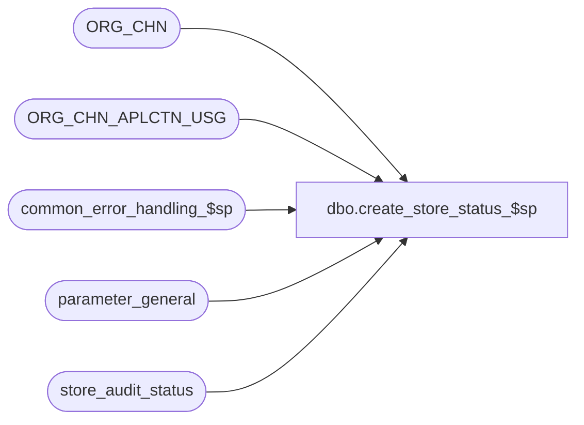

# dbo.create_store_status_$sp

**Database:** auditworks  
**Server:** bedrockdb01  

## Architecture Diagram



## Table Dependencies

| Referenced Table |
|---|
| ORG_CHN |
| ORG_CHN_APLCTN_USG |
| common_error_handling_$sp |
| parameter_general |
| store_audit_status |

## Stored Procedure Code

```sql
CREATE proc  dbo.create_store_status_$sp 
@process_id			binary(16),
@user_id                	int,
@store_no			int,
@sales_date			smalldatetime,
@date_reject_id			tinyint OUTPUT,
@status_reject_reason		tinyint OUTPUT,
@errmsg				nvarchar(2000) OUTPUT,
@edit_timestamp         	float = 0,
@update_in_progress		smallint = 1,
@store_completion_date_time	datetime = null,
@max_entry_date_time		datetime = null,
@open_date				datetime = null, -- passed as null when from past period or when not from Edit
@open_to_receive_date		datetime = null -- passed as null when from past period or when not for stock/payroll transactions or when not from Edit

AS

/* Proc Name: create_store_status_$sp
   Description: Look for a status row for a store-date and
    determine its status. If not present, then create it.
    Called by edit_header_$sp, transaction_validate_$sp, move, lock_store_date_$sp, move_store_$sp and gui.
    
    Same version can be used for SA5.0 and SA5.1 .
    Unicode version.

 HISTORY
 Date    Name		Def# Desc
Jan30,17 Kiri      DAOM-1897 Clarify 'Store-Date is already in use' error message by adding which function had it in use and which one wanted to lock it.
                             Since create_store_status is also called by transaction validate even when the store_audit_status already exists (in the case where the status is unused, closed, deleted, moved
                             because those status values could potentially be for an old date) don't raise an "already in use" message if the record is in use by the calling function itself.
Nov24,16 Serguei   DAOM-1775 Don't allow Edit to proceed if Dayend begins processing the store/date (note it only locks until its subledger posting is done) or
                             if another function acquires a lock as described for DAOM-1171 after the preliminary check.
Aug16,16 Vicci     DAOM-1171 If Edit encounters a store/date locked by another function, if in batch or trickle edit mode, 
                             or if in trickle-audit mode and the lock is held by a mass delete or move function, 
                             log the current batch to a date reject with S/A reject reason 39 rather than skipping
                             the attempt to lock it (which results in it not being locked even though the edit is in progress when the function that
                             previously held the lock releases it).
Aug05,16 Vicci     DAOM-1244 Fix DAOM-730:  in NON-trickle-audit environment, when invalid store is received and no prior entry exists for it in store audit status
                             ensure status logged as invalid store not invalid register.
May27,16 Vicci      DAOM-730 In trickle audit environment, set status to 100 if bad date even if transaction counts have not yet been updated
                             for consistency with bad store and/or bad register, since already known to be bad.  Otherwise will remain Closed until later.
                             Set process no correctly;
                             Don't unlock store/date if locked by manual function and called by edit in trickle-audit;
                             Don't change status if called by Edit in trickle audit mode unless it is a bad store or date.
May06,16 Vicci      DAOM-664 Don't set reset invalid store/reg status since not fixing existing S/A rejects -let revalidation take care of it;
                             Otherwise end up with store audit status of Edited but audit status of Invalid (integrity) until phase 2 runs and repairs it
                             which is an issue in a Trickle Audit environment.
Dec05,14 Paul      TFS-94103 use try catch
Nov16,12 Vicci        139679 When a date_reject_id > 0 record has a store_audit_status of 5=Missing, allow it to be reused instead of creating a new record.
                             Note that date-reject with a status of missing should no longer occur now that edit_cleaup_details_$sp is being fixed, but this
                             is a safety precaution.
Jun14,11 Paul         127790 Correctly evaluate future dates for Australian stores
Jul11,08 Paul          87777 apply 1-3YC7TM to SA5
Jan09,07 Paul          81764 apply 78965, 78123 to SA5
Mar16,06 Paul        DV-1331 apply 67999 to SA5
Aug10,05 Paul          57984 Handle null GMT_OFST as same as server GMT_OFST
Nov19,04 Maryam      DV-1167 Handle Null GMT_OFST.
Oct28,04 David       DV-1159 Check for ORG_CHN active flag. 
Sep16,04 Maryam      DV-1146 Use user_id. 
Aug23,04 Sab	     DV-1120 Remove join to auditworks_parameter for aplctn_id
May17,04 David       DV-1071 Use ORG_CHN table instead of store_salesaudit, handle offset for invalid store (Paul)
Jul11,08 Paul       1-3YC7TM Trap possible duplicate error due to timing of multistream edit
Dec05,06 Vicci         78965 Receive open_to_receive_date and open_date.
Oct25.06 Daphna        78123 Do not bump up date_reject_id unless existing entry for Bad store/date is deleted or moved
Jul19,06 Phu     75034/75035 Set auto_accepted = 1 when store-dates are auto-accepted by edit/manual functions.
Feb21,06 Vicci	       67999 Log completion date-time based on store closeout;  do not reject
			     as future-dates transactions which have been moved to the next
			     business date as a result of logical trading date handling.
Dec29,03 Paul        DV-1007 fix to DV-1010 to facilitate error recovery
Nov03,03 Paul        DV-1010 check for locked store date before trying to update store_audit_status (avoids abort of process)
Oct29,02 Winnie	     1-FGESD Add logic for Moved Invalid Register.
Oct10,02 David C     1-FUDQ1 Verify edit_timestamp properly. 
                             If < 1000, proc is called by manual functions, otherwise called by Edit.
May31,02 Winnie	     1-DDHQ0 Correctly set the value for @rows.
May03,02 Ian         1-CD0IX Add R3 Error Handling
Sep19,01 Paul		8753 If status row already exists, check for invalid store/reg
May02,01 Sab		7600 Try one more time when we get the duplicate key when insert store_audit_status
Jan10,01 Paul		7153 Correctly set date_reject_id when store is accepted/completed
Dec18,00 Paul		7156 Reject dates <= period_end_date
Jan17,00 Paul		5842 Don't unaccept if already accepted
Jan10,00 Paul		5800 Consider timezone of store when evaluating future dates
Oct28,99 Louise M.	5534 Allow edit to continue even if store/date is locked.
                             removed the update of process_id so that trigger is bypassed.
Oct01,99 Paul		4879 avoid bumping date_reject_id whenever possible
Mar29,99 Louise M.	4526 New code to support trickle edit.
Jan08,99 Paul S.
        Paul		Author
*/ 

DECLARE
	@current_store_audit_status		smallint,
	@dayend_in_progress			tinyint,
	@date_reject_flag			tinyint,
	@errmsg2				nvarchar(2000),
	@errline				int,
	@errno					int,
	@locked_by_process			smallint,
	@last_date_closed			smalldatetime,
	@period_end_date			smalldatetime,
	@prev_trickle_flag			tinyint,
	@process_no				smallint,
	@row_exists				tinyint,
	@rows					int,
	@store_audit_status			smallint,
	@timezone_offset_min			numeric(5,0),
	@trickle_polling_flag			tinyint,
	@trickle_in_progress_flag		tinyint,
	@trickle_already_in_progress		tinyint,
	-- error handling
	@process_name		nvarchar(100),
	@operation_name		nvarchar(100),
	@object_name		nvarchar(255),
	@message_id		int,
	@log_flag		tinyint,
	@auto_accepted		tinyint,
	@edit_trickle_audit	tinyint,  -- 1=process is Edit and environment is Trickle Audit
   @available           tinyint;  -- store/date not locked by another function and not dayend-in-progress nor completed

SELECT	@process_name = 'create_store_status_$sp',
	@message_id = 201068,
	@process_no = COALESCE(@update_in_progress, 1),
	@update_in_progress = COALESCE(@update_in_progress, 1),
	@edit_trickle_audit = 0;  

BEGIN TRY
SELECT @errmsg         = 'Failed to select from parameter_general',
       @object_name   = 'parameter_general',
       @operation_name = 'SELECT';
SELECT @last_date_closed = last_date_closed,
       @period_end_date = period_end_date,
       @trickle_polling_flag = ISNULL(trickle_polling_flag,0)
  FROM parameter_general;

IF @edit_timestamp < 1000 -- not the edit
   SELECT @date_reject_id = 0, @log_flag = 0, @trickle_in_progress_flag = 0;
ELSE  --Edit
  BEGIN
   IF @trickle_polling_flag >= 2
     SELECT @update_in_progress = 0,
	    @trickle_in_progress_flag = 1,
            @log_flag = 1,
            @edit_trickle_audit = 1;
   ELSE -- non trickle edit mode
     SELECT @update_in_progress = 1,
            @trickle_in_progress_flag = 0,
            @log_flag = 1;
  END;

SELECT @status_reject_reason = 0,
	@date_reject_flag = 0,
	@auto_accepted = 0;

-- GMT offset is negative for North America and positive for Australia due to the international dateline
     SELECT @errmsg         = 'Failed to select GMT_OFST from ORG_CHN',
            @object_name    = 'ORG_CHN',
            @operation_name = 'SELECT';
SELECT @timezone_offset_min = GMT_OFST * 60
  FROM ORG_CHN
 WHERE ORG_CHN_NUM = @store_no;

SELECT @rows = @@rowcount;

IF @timezone_offset_min IS NULL OR @rows = 0
  SELECT @timezone_offset_min = DATEDIFF(hh, getutcdate() , getdate()) * 60; -- same as GMT_OFST of SA server 

/* allow for up to 60 minutes variation in clock times between pos and server before reporting a future date.
   this also provides a tolerance for daylight savings differences between pos and server. */
--NOTE:  any change to this criteria must also be applied to fix_future_dates_$sp
IF (@max_entry_date_time IS NULL 
      OR @max_entry_date_time > DATEADD(mi,(@timezone_offset_min + 60),getutcdate())
      OR @edit_timestamp < 1000) -- always use this check for manual functions
  BEGIN
     /* compare sales date with current date-time in the store's timezone plus 60 min. */
    IF @sales_date > DATEADD(mi,(@timezone_offset_min + 60),getutcdate())               
    BEGIN
      SELECT @status_reject_reason = 3; /* future date */
      IF @edit_timestamp >= 1000
        SELECT @date_reject_flag = 1,
               @date_reject_id = 1;
    END;
  END;
  ELSE
  BEGIN
   /* If called by edit and transaction entry-date-time was not future then its OK for its business date 
      to be tomorrow, but not beyond */
    IF @sales_date > DATEADD(dd, 1, DATEADD(mi,(@timezone_offset_min + 60),getutcdate()))
    BEGIN
      SELECT @status_reject_reason = 3, /* future date */
             @date_reject_id = 1,
             @date_reject_flag = 1;
    END;
  END;

IF (@sales_date <= @last_date_closed OR @sales_date <= @period_end_date)
  BEGIN
   SELECT @status_reject_reason = 2; /* period closed */
   IF @edit_timestamp >= 1000  --if manual then create store status request is just refused
     SELECT @date_reject_id = 1,
            @date_reject_flag = 1;
  END;
ELSE
  BEGIN
    IF @sales_date < @open_to_receive_date
    BEGIN
      SELECT @status_reject_reason = 10;  /* Business date prior to store open to receive date */
      IF @edit_timestamp >= 1000
        SELECT @date_reject_id = 1,
               @date_reject_flag = 1;  
    END;
    ELSE
      IF @sales_date < @open_date AND @open_to_receive_date IS NULL   
      BEGIN
        SELECT @status_reject_reason = 12;  /* Business date prior to store opening date */
        IF @edit_timestamp >= 1000
          SELECT @date_reject_id = 1,
                 @date_reject_flag = 1;
      END;
  END;

SELECT @errmsg     = 'Failed to select status and trickle flag from store_audit_status.  ',
       @object_name    = 'store_audit_status',
       @operation_name = 'SELECT';
SELECT @store_audit_status = store_audit_status,
       @prev_trickle_flag = ISNULL(trickle_in_progress_flag,0),
       @locked_by_process = update_in_progress,
       @auto_accepted = auto_accepted
  FROM store_audit_status
 WHERE sales_date = @sales_date
   AND store_no = @store_no
   AND date_reject_id = @date_reject_id;
SELECT @rows = @@rowcount;

--keep current trickle flag for manual functions
IF @rows != 0
BEGIN
  IF @edit_timestamp < 1000
  BEGIN
    SELECT @trickle_in_progress_flag = @prev_trickle_flag;
  END;
  ELSE
  BEGIN  --current function is the Edit
    IF @locked_by_process > 0 AND @locked_by_process NOT IN (1,4) --store/date already locked by function other than the Edit
    BEGIN
      IF @edit_trickle_audit <> 1 OR @locked_by_process IN (30, 33, 40, 9, 109, 95, 97)  --if regular batch or trickle edit (which cares about locking) or trickle audit but the whole status record is in the midst of being moved/deleted 
      BEGIN
        SELECT @date_reject_flag = 1,
               @date_reject_id = 1,
               @status_reject_reason = 39;  --'Store business date in use by another process'
        SELECT @errmsg     = 'Failed to select status and trickle flag from store_audit_status for date reject. ';
        SELECT @store_audit_status = store_audit_status,
               @prev_trickle_flag = ISNULL(trickle_in_progress_flag,0),
               @locked_by_process = update_in_progress,
               @auto_accepted = auto_accepted
          FROM store_audit_status
         WHERE sales_date = @sales_date
           AND store_no = @store_no
           AND date_reject_id = @date_reject_id;
        SELECT @rows = @@rowcount;
      END;
    END;  --IF @locked_by_process > 0 AND @locked_by_process NOT IN (1,4)
  END;  --ELSE of IF @edit_timestamp < 1000, i.e. current function is the Edit
END;  

/* check whether store is valid */
IF NOT EXISTS ( SELECT 1
		  FROM ORG_CHN_APLCTN_USG u, ORG_CHN c
		 WHERE c.ORG_CHN_NUM = @store_no
		   AND c.ACTV = 1
		   AND c.ORG_CHN_NUM = u.ORG_CHN_NUM
		   AND u.VLDTY = 1
		   AND u.APLCTN_ID = 300)
    OR @store_audit_status = 7   --DAOM-664 if store is now valid but other transactions for the store/date are still S/A rejects, leave status as rejected
  BEGIN
   SELECT @store_audit_status = 7;
   IF @status_reject_reason NOT IN (2,3,10,12) --78965
     SELECT @status_reject_reason = 7;

   IF @edit_timestamp < 1000
     RETURN;
  END;

IF @edit_trickle_audit = 1  --For trickle audit Edit will only update status when quantities/amounts (valid, reject, short, etc) are updated  DAOM-730
BEGIN
  IF @rows = 0 AND @store_audit_status IS NULL  --i.e. if entry doesn't exist and status has not been set to invalid store
    SELECT @store_audit_status = CASE WHEN @date_reject_id = 0 THEN 901 ELSE 100 END;  --create as closed by default, when create register status is called next this will change to missing if applicable
END;
ELSE
BEGIN
  IF (   @rows = 0 AND @store_audit_status IS NULL  --i.e. if entry doesn't exist and status has not been set to invalid store
      OR @store_audit_status IN ( 5, 200, 900, 901, 902, 903, 904, 905, 906))
    SELECT @store_audit_status = 100;
END;

IF @rows = 0
BEGIN
  IF (@edit_timestamp > 1000 OR @status_reject_reason = 0)
  BEGIN
      SELECT @errmsg         = 'Failed to insert store_audit_status (date_reject_id = 0)',
             @object_name    = 'store_audit_status',
             @operation_name = 'INSERT',
             @errno = 0;
    BEGIN TRY

    INSERT store_audit_status (
	store_no,
	sales_date,
	date_reject_id,
	store_audit_status,
	update_in_progress,
	process_id,
	media_short,
	store_status_date,
	trickle_in_progress_flag,
	completion_date_time )
    VALUES (
	@store_no,
	@sales_date,
	@date_reject_id,
	@store_audit_status,
	@update_in_progress,
	@process_id,
	0,
	getdate(),
	@trickle_in_progress_flag,
	@store_completion_date_time );
    END TRY
    BEGIN CATCH;
        SELECT @errno = ERROR_NUMBER(),
		@errline = ERROR_LINE();

        SELECT @errmsg = CONVERT(nvarchar, @errno) + ':' + @process_name + ':' + CONVERT(nvarchar, @errline) + ':'
               + 'Failed to insert store_audit_status (date_reject_id = 0)' + ':' + ERROR_MESSAGE();

        IF @errno NOT IN (0, 2601) -- bypass possible dup error due to timing
          GOTO business_error;
    END CATCH;
  END; -- If @edit_timestamp > 1000 ...

  IF (@status_reject_reason = 0 AND @edit_timestamp < 1000)
    SELECT @status_reject_reason = 99;

  RETURN;
END; /* If @rows = 0 */

/* status row already exists */
IF @auto_accepted > 0 AND @store_audit_status = 300
BEGIN
  IF @edit_trickle_audit = 0
    -- set status to edited, auto_accepted to false
    SELECT @store_audit_status = 100, @auto_accepted = 0;
    
  SELECT @status_reject_reason = 0, @date_reject_flag = 0;
END
ELSE IF @store_audit_status >= 300 /* accepted or dayend in progress/aborted */
        AND @store_audit_status <= 899
     BEGIN
       SELECT @date_reject_flag = 1,
              @status_reject_reason = 4;
       IF @store_audit_status = 300
         SELECT @status_reject_reason = 11;
     END; /* If @store_audit_status >= 300 */

IF @date_reject_flag = 0
BEGIN
  IF @store_audit_status = 7 -- invalid store
    SELECT @status_reject_reason = 7;

  IF @locked_by_process > 0 -- already locked
  BEGIN
     SELECT @errno = 201550; -- bypass update to avoid aborting process due to trigger rollback
     IF @locked_by_process IN (1,4) AND @edit_timestamp >= 1000
       SELECT @errno = 0; -- allow trigger to bypass locking and avoid aborting the edit
     IF @locked_by_process = @update_in_progress
       SELECT @errno = 0; -- try to lock when was previously locked by the same process
  END;
  ELSE
    SELECT @errno = 0;

  IF @errno = 0 -- not already locked
  BEGIN
        SELECT @errmsg = 'Failed to update store_audit_status (2).',
               @object_name    = 'store_audit_status',
               @operation_name = 'UPDATE';
     BEGIN TRY

     UPDATE store_audit_status
       SET store_audit_status = @store_audit_status,
		trickle_in_progress_flag = @trickle_in_progress_flag,
		update_in_progress = CASE WHEN @update_in_progress = 0 THEN update_in_progress ELSE @update_in_progress END,
		process_id = @process_id,
		store_status_date = getdate(),
		completion_date_time = ISNULL(@store_completion_date_time, completion_date_time),
		auto_accepted = @auto_accepted
      WHERE sales_date = @sales_date
        AND store_no = @store_no
        AND date_reject_id = @date_reject_id
        AND (store_audit_status < 301 OR store_audit_status > 899) --i.e. skip if dayend (which only locks until subledger posting done) started after preliminary check was done.
        AND (  update_in_progress = 0  								    --not locked
		       OR (@locked_by_process = update_in_progress AND @process_id = process_id )                --or locked by the current process
               OR (@edit_timestamp >= 1000 AND update_in_progress IN (1, 4, 103))                        --or locked by edit and current process is edit
               OR (@edit_trickle_audit = 1 AND update_in_progress NOT IN (30, 33, 40, 9, 109, 95, 97))   --or trickle audit (which allows other locks) unless the lock is a delete, move, etc.
              );
              
       SELECT @available = @@rowcount,
              @errno = 0;
     END TRY                           
     BEGIN CATCH;
        SELECT @errno = ERROR_NUMBER(),
		@errline = ERROR_LINE();

        SELECT @errmsg = CONVERT(nvarchar, @errno) + ':' + @process_name + ':' + CONVERT(nvarchar, @errline) + ':'
               + 'Failed to update store_audit_status (2)' + ':' + ERROR_MESSAGE();

        IF @errno NOT IN (0, 201550)
          GOTO business_error;
     END CATCH;
     
     IF @available < 1
		SELECT @errno = -20550,
		       @errmsg = 'Store/Date is already in use by ' + @locked_by_process + ' and lock requested by ' + @update_in_progress;
  END; -- If @errno = 0

  IF @errno = 201550  AND @edit_timestamp >= 1000 /* store-date already locked; allow edit to update with other info anyway */
  BEGIN
         SELECT @errmsg         = 'Failed to update store_audit_status (1)',
                @object_name    = 'store_audit_status',
                @operation_name = 'UPDATE';
         UPDATE store_audit_status
            SET store_audit_status = @store_audit_status,
      	        trickle_in_progress_flag = @trickle_in_progress_flag,
         	store_status_date = getdate(),
         	completion_date_time = ISNULL(@store_completion_date_time, completion_date_time),
         	auto_accepted = @auto_accepted
          WHERE sales_date = @sales_date
            AND store_no = @store_no
            AND date_reject_id = @date_reject_id
            AND (store_audit_status < 301 OR store_audit_status > 899)  --i.e. skip if dayend (which only locks until subledger posting done) started after preliminary check was done.
            AND (   update_in_progress = 0  								      --not locked
                 OR (@edit_timestamp >= 1000 AND update_in_progress IN (1, 4, 103))                        --or locked by edit and current process is edit
                 OR (@edit_trickle_audit = 1 AND update_in_progress NOT IN (30, 33, 40, 9, 109, 95, 97))   --or trickle audit (which allows other locks) unless the lock is a delete, move, etc.
                );
          SET @available = @@rowcount;
            
  END; /* IF @errno = 201550 */

    IF @available < 1
      SELECT @date_reject_flag = 1,
             @date_reject_id = 1,
             @status_reject_reason = 39;  --'Store business date in use by another process'
    ELSE
      RETURN; -- proceed with edit anyway   
             
END; /* If @date_reject_flag = 0 */

IF @edit_timestamp < 1000 -- manual functions cannot create invalid date
  RETURN;

  SELECT @errmsg         = 'Failed to read store_audit_status (date_reject_id).',
         @object_name    = 'store_audit_status',
         @operation_name = 'SELECT';
SELECT @date_reject_id = ISNULL(MAX(date_reject_id ),0)
  FROM store_audit_status
 WHERE sales_date = @sales_date
   AND store_no = @store_no;

IF @date_reject_id >= 1
BEGIN
  SELECT @row_exists = 1;

  SELECT @trickle_already_in_progress = ISNULL(trickle_in_progress_flag,0),
         @current_store_audit_status = store_audit_status,
         @locked_by_process = update_in_progress
    FROM store_audit_status
   WHERE sales_date = @sales_date 
     AND store_no = @store_no
     AND date_reject_id = @date_reject_id;

   IF @current_store_audit_status IS NULL -- row not found
     SELECT @current_store_audit_status = 100,
            @trickle_already_in_progress = 0,
            @row_exists = 0;

   /* only bump date_reject_id beyond 1 if bad store/date already moved, deleted */
   IF    @date_reject_id < 255
     AND (   @current_store_audit_status NOT IN (100, 7, 8, 5, 901)  -- not edited, bad store, bad reg, missing, closed
          OR (@locked_by_process > 0 AND @locked_by_process NOT IN (1, 4))
         )
       SELECT @date_reject_id = @date_reject_id + 1,
              @row_exists = 0;
END;
ELSE
  SELECT @date_reject_id = 1,
         @row_exists = 0;

IF @store_audit_status NOT IN (7, 8) --DAOM-664
  SELECT @store_audit_status = 100;

/* Only insert new row when when status is accepted OR when not trickling and status is not 'accepted' */

IF @row_exists = 0
  BEGIN
     SELECT @errmsg         = 'Failed to insert store_audit_status (date_reject_id <> 0)',
            @object_name    = 'store_audit_status',
            @operation_name = 'INSERT';

   BEGIN TRY
   INSERT store_audit_status (
	store_no,
	sales_date,
	date_reject_id,
	store_audit_status,
	update_in_progress,
	media_short,
	store_status_date,
	process_id,
	trickle_in_progress_flag )
   VALUES (
	@store_no,
	@sales_date,
	@date_reject_id,
	@store_audit_status,
	@update_in_progress,
	0,
	getdate(),
	@process_id,
	@trickle_in_progress_flag );
   END TRY
   BEGIN CATCH;
        SELECT @errno = ERROR_NUMBER(),
		@errline = ERROR_LINE();

        SELECT @errmsg = CONVERT(nvarchar, @errno) + ':' + @process_name + ':' + CONVERT(nvarchar, @errline) + ':'
               + 'Failed to insert store_audit_status (date_reject_id <> 0)' + ':' + ERROR_MESSAGE();

        IF @errno NOT IN (0, 2601) -- bypass possible dup error due to timing
          GOTO business_error;
   END CATCH;

   RETURN;
  END; -- IF @row_exists = 0

/* Otherwise (already trickling with status <300 or status > 899), update the existing row */
     SELECT @errmsg         = 'Failed to update store_audit_status (3)',
	@object_name    = 'store_audit_status',
	@operation_name = 'UPDATE',
	@errno = 0;
BEGIN TRY

UPDATE store_audit_status
   SET store_audit_status = @store_audit_status,
       update_in_progress = CASE WHEN @update_in_progress = 0 THEN update_in_progress ELSE @update_in_progress END,
       process_id = @process_id,
       store_status_date = getdate(),
       trickle_in_progress_flag = @trickle_in_progress_flag
 WHERE sales_date = @sales_date
   AND store_no = @store_no
   AND date_reject_id = @date_reject_id;

END TRY
BEGIN CATCH;
        SELECT @errno = ERROR_NUMBER(),
	       @errline = ERROR_LINE();

        SELECT @errmsg = CONVERT(nvarchar, @errno) + ':' + @process_name + ':' + CONVERT(nvarchar, @errline) + ':'
               + 'Failed to update store_audit_status (3)' + ':' + ERROR_MESSAGE();

        IF @errno NOT IN (0, 201550)
          GOTO business_error;
END CATCH;

IF ( @errno = 201550 AND @edit_timestamp >= 1000 ) /* store-date already locked, allow edit to update other columns */
  BEGIN
     SELECT @errmsg         = 'Failed to update store_audit_status (4)';
   UPDATE store_audit_status
     SET  store_audit_status = @store_audit_status,
          trickle_in_progress_flag = @trickle_in_progress_flag,
          store_status_date = getdate()
    WHERE sales_date = @sales_date
      AND store_no = @store_no
      AND date_reject_id = @date_reject_id;
  END;


RETURN;


business_error:   /* Business Rule handler. */

	SELECT @errmsg2 = @errmsg;

	/* Could include similar cleanup code to system error trap when needed (example is from move_store_$sp).
	   However, could also exclude the cleanup code here since the outer system error catch should fire again after the exec below. */

	EXEC common_error_handling_$sp @process_no, @errno, @errmsg, 0, @message_id,
	  @process_name, @object_name, @operation_name, @log_flag,1,
	  0, null, 0, null, null, null, null, null, null, 0, @process_id, @user_id
	RETURN;
	  /* Note: when the exec above raises an error, that action also fires the system error trap (below) */
	RETURN;
END TRY

BEGIN CATCH; -- trap system errors
    /* common error handling. Appending proc name here because a rollback could occur if called within a transaction. */

        SELECT @errno = ERROR_NUMBER(),
		@errline = ERROR_LINE();

        SELECT @errmsg = CONVERT(nvarchar, @errno) + ':' + @process_name + ':' + CONVERT(nvarchar, @errline) + ':'
               + COALESCE(@errmsg, ' ') + ':' + ERROR_MESSAGE();

	 /* this condition will only be true when raise error in traps above fire this general catch */
	IF @errmsg2 IS NOT NULL
	  SELECT @errmsg = @errmsg2;
  
	EXEC common_error_handling_$sp @process_no, @errno, @errmsg, 0, @message_id,
	  @process_name, @object_name, @operation_name, @log_flag,1,
	  0, null, 0, null, null, null, null, null, null, 0, @process_id, @user_id;

	RETURN;
END CATCH;
```

