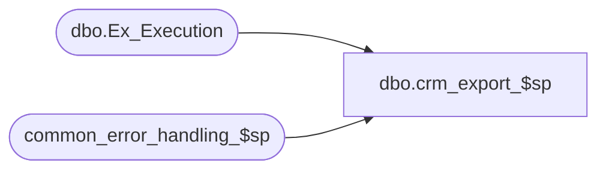

# dbo.crm_export_$sp

**Database:** auditworks  
**Server:** bedrockdb01  

## Architecture Diagram



## Table Dependencies

| Referenced Table |
|---|
| dbo.Ex_Execution |
| common_error_handling_$sp |

## Stored Procedure Code

```sql
create proc dbo.crm_export_$sp 
@interface_id tinyint = 27

AS
/* 
Proc Name: crm_export_$sp (Smartview)
Desc: Standard interface to CRM.
	This is a sample of the Smartview logic that documents usage of the SA tables by Smartview export to CRM.
	The actual logic resides in sourcesafe (SA export dir) and is installed using Site Manager.
	For SA5, the logic maps the old store_export_code in store_salesaudit to ORG_CHN.ORG_CHN_TYPE_CODE since
	the latter is now system-defined in CRDM tm.
	Called by SRProc (SmartView).

HISTORY:  
Date     Name              Def# Desc
Jan04,11 Paul            105313 Use unicode datatypes
Jan25,07 Paul           DV-1349 create sample proc to document export to CRM


*/

SET NOCOUNT ON
DECLARE	@batch_size	int,
	@complete_iters	tinyint,
	@cursor_open	tinyint,
	@didwork	tinyint,
	@errmsg		nvarchar(255), 
	@errno		int,
	@execution_id	int,
	@first_ser_no 	numeric(14),
	@findwork	int,
	@identity_seed	numeric(22),
	@if_entry_no	numeric(12),
	@iterations	tinyint,
	@last_serial_no	numeric(14),
	@max_errors	smallint, -- set to -1 to bypass cursor mode for errors
	@max_serial_no	numeric(14),
	@message_id	int,
	@min_serial_no	numeric(14), 
	@object_id	smallint,
	@process_name	nvarchar(32),
	@process_no	int,
	@queue_id	tinyint,
	@rowcount 	integer,
	@serial_no	numeric(14),
	@sql_object	nvarchar(32),
	@sql_operation	nvarchar(16),
	@last_id	numeric(22),
	@upc_lookup_division	tinyint,
	@work_todo	integer,
	@memo1		nvarchar(50)

SELECT	@process_name = 'Merch (MeW) Sales Interface',
	@process_no = 280,
	@message_id = 201068,
	@complete_iters = 0,
	@min_serial_no = 0,
	@max_serial_no = 0, 
	@last_serial_no = 0,
	@queue_id = 27,
	@didwork = 0,
	@cursor_open = 0,
	@work_todo = 0
	
SELECT @object_id = -1 * @queue_id

/*

INSERT INTO %EXTRACT_TABLE% 
SELECT w.key_1 as key_1, 
                  h.if_entry_no as if_entry_No, 
                  h.transaction_no as transaction_no, 
                  h.store_no as store_no, 
                  h.register_no as register_no, 
                  h.cashier_no as cashier_no, 
--                s.store_export_code + substring('RS',convert(int,sign(1+sign(tender_total))+1) , 1) as trans_type,
                  s.OC.ORG_CHN_TYPE_CODE + substring('RS',convert(int,sign(1+sign(tender_total))+1) , 1) as trans_type,
                  h.transaction_date as transaction_date, 
                  max(c.customer_no) as customer_no,
                  IsNull(sign(h.employee_no + 1), 0) as employee_purch_flag_A,
                  max(IsNull((1-(abs(sign(l.reference_type - 4)) * abs(sign(l.reference_type - 203)))), 0)) as gift_cert_card_flag_B,
                  sum((l.gross_line_amount - l.pos_discount_amount) * -1 * l.db_cr_none * l.voiding_reversal_flag * (1-sign(abs(l.line_object_type -1)))) as tender_total,
                  max(c.telephone_no1) as telephone_no
FROM  %EX_WORK_TABLE% w,
              if_transaction_header h, 
              ORG_CHN s,
              if_customer c, 
              if_transaction_line l
WHERE w.key_1 = h.if_entry_no
AND ( h.transaction_void_flag = 0 OR h.transaction_void_flag = 8 )  
AND h.store_no = s.store_no
AND h.if_entry_no *= c.if_entry_no
AND c.customer_role = 1
AND h.if_entry_no *= l.if_entry_no
AND l.line_object_type in (1,6)
AND l.line_void_flag = 0
GROUP BY w.key_1, 
                  h.if_entry_no, 
                  h.transaction_no, 
                  h.store_no, 
                  h.register_no, 
                  h.cashier_no, 
                  s.OC.ORG_CHN_TYPE_CODE + substring('RS',convert(int,sign(1+sign(tender_total))+1) , 1),
                  h.transaction_date, 
                  IsNull(sign(h.employee_no + 1), 0)
 
*/
	
RETURN 0

error:
	IF @@trancount > 0 ROLLBACK

	--flag the batch as unpostable
	INSERT dbo.Ex_Execution (queue_id, object_id, execution_id, from_serial_no, to_serial_no, status_code)
	SELECT @queue_id, @object_id, @execution_id, @first_ser_no, @last_serial_no, 1

	EXEC common_error_handling_$sp 
		@process_no = @process_no,
		@error_code = @errno,
		@error_msg = @errmsg,
		@abort_flag = 0,
		@message_id = @message_id,
		@process_name = @process_name,
		@object_name = @sql_object,
		@operation_name = @sql_operation

	RETURN @errno
```

