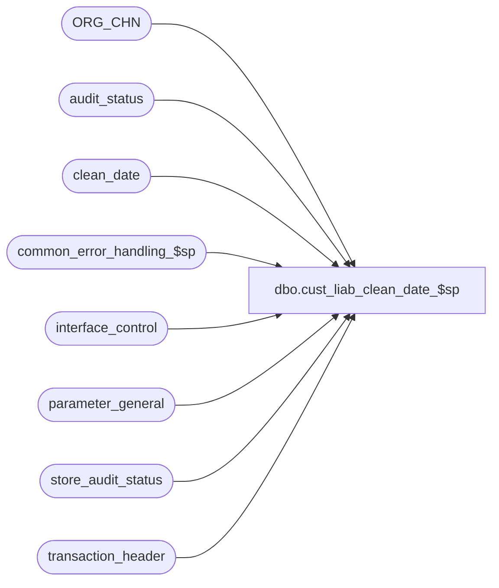

# dbo.cust_liab_clean_date_$sp

**Database:** auditworks  
**Server:** bedrockdb01  

## Architecture Diagram



## Table Dependencies

| Referenced Table |
|---|
| ORG_CHN |
| audit_status |
| clean_date |
| common_error_handling_$sp |
| interface_control |
| parameter_general |
| store_audit_status |
| transaction_header |

## Stored Procedure Code

```sql
create proc [dbo].[cust_liab_clean_date_$sp] 

@process_id             binary(16),
@user_id		int,
@process_no		smallint,
@log_error_flag	        tinyint,
@errmsg			nvarchar(255) OUTPUT 


AS
/* 
** Proc name:   cust_liab_clean_date_$sp
** Description: Get the greatest clean date from store_audit_status among online stores.
**              A clean date should have no missing transactions (or verified), no i/f
**              rejects related to glc's, no s/a rejects.
**              Called by proc cust_liab_pos_update_$sp if at least one store is online.
**              Based on edit_glc_get_clean_date_$sp.
**  From table ORG_CHN : field VCHR_CNFG_TYPE
    0 (N/A) -> Voucher Lookup not used
    1 (LCL) -> export is used.
    2 (RMT) -> online voucher tracking is used.

HISTORY
Date      Name        Defect#  Desc
Jul09,12  Vicci        136779  In environments with logical trading date handling set to push transactions occurring after an early evening closeout
                               forward to the next date, it is normal for there to be non-rejected future dates, therefore, ensure that the clean
                               date is not set to a future date.
Aug02,06  Tim           69753  Apply 75308, 75329, 71808, 1-3B22SX to SA5
Jul27,06  Daphna  75308/75329  Ensure clean date is before current date (cannot be "today")
May05,06  Daphna     1-3B22SX  Evaluate clean date for records with date-reject-id = 0
                      / 71808
Sep02,05  Paul        DV-1312  apply 46401 to SA5 
May25,05  Paul        DV-1254  use the new values of VCHR_CNFG_TYPE
Sep23,04  David       DV-1146  Use user_id instead of user_name.
May17,04  David       DV-1071  Use ORG_CHN table instead of store_salesaudit
Apr26,04  Maryam      DV-1071  Receive @process_id, @user_name and pass it to the 
                               common_error_handling_$sp. 
DEC21,04  Daphna     1-17EQL1
                       /46401  ensure correct time (23:59) on clean_date     
MAY01,02  Daphna      1-BMK21  use clean_date for Multi Db
FEB05,02  Daphna               do not return clean-date as output parameter
Jan03,02  David C     AW-8415  Author 

*/


DECLARE
	@c_audit_sales_date	smalldatetime,
	@cursor_open		tinyint,
	@errno			int,	
	@last_clean_date	smalldatetime,
	@lower_limit_date	smalldatetime,
	@max_clean_audit_date	smalldatetime,
	@max_clean_date		smalldatetime,
	@max_date		smalldatetime,
	@message_id		int,
	@object_name		nvarchar(255),
	@operation_name 	nvarchar(100),
	@process_name		nvarchar(100),
	@rows			tinyint,
	@store_no		int,
	@today			smalldatetime,
	@upper_limit_date	smalldatetime
 

-- DEF 1-BMK21
SELECT @last_clean_date = clean_date
  FROM parameter_general p, clean_date c
 WHERE p.sa_company_no = c.sa_company_no

 SELECT @errno = @@error
 IF @errno !=0 
 BEGIN
   SELECT @errmsg='Failed to get last_clean_date for sa_company_no',
          @object_name = 'clean_date',
          @operation_name = 'SELECT'
   GOTO error
 END
     
IF @last_clean_date IS NULL --
  SELECT @last_clean_date = last_date_closed
    FROM parameter_general

 SELECT @errno = @@error
 IF @errno !=0 
 BEGIN
   SELECT @errmsg='Failed to get last_date_closed from parameter_general',
          @object_name = 'parameter_general',
          @operation_name = 'SELECT'
   GOTO error
 END


SELECT @max_date = MAX(sales_date)
  FROM audit_status 
 WHERE date_reject_id = 0
   AND sales_date > @last_clean_date
   AND audit_status >= 100
   AND audit_status <= 500
   
 SELECT @errno = @@error
 IF @errno !=0 
 BEGIN
   SELECT @errmsg='Failed to get max(sales_date)',
          @object_name = 'audit_status',
          @operation_name = 'SELECT'
   GOTO error
 END
   
IF @max_date IS NULL  --no other clean date as of last_clean_date
BEGIN 
  SELECT @max_clean_date = @last_clean_date
  GOTO exit_routine
END


SELECT @lower_limit_date = MIN(sales_date)
  FROM store_audit_status a, ORG_CHN s
 WHERE s.ORG_CHN_NUM = a.store_no
   AND s.VCHR_CNFG_TYPE = 'RMT' -- stores that are online only
   AND a.store_audit_status < 200
   AND a.date_reject_id = 0   
   AND a.sales_date > @last_clean_date
   AND a.sales_date <= @max_date

 SELECT @errno = @@error
 IF @errno !=0 
 BEGIN
   SELECT @errmsg='Failed to get min(sales_date) from store_audit_status',
          @object_name = 'store_audit_status',
          @operation_name = 'SELECT'
   GOTO error
 END

IF @lower_limit_date IS NULL  -- 
BEGIN
  SELECT @max_clean_date = @max_date
  GOTO exit_routine
END
 ELSE
 BEGIN
   SELECT @lower_limit_date = dateadd(dd,-1,@lower_limit_date)
   
   SELECT @max_clean_date = @lower_limit_date
 END
 

-- Get min(date) with issues for online stores only
SELECT @upper_limit_date = MIN(sales_date)
  FROM audit_status a, ORG_CHN s
WHERE s.ORG_CHN_NUM = a.store_no
   AND date_reject_id = 0
   AND s.VCHR_CNFG_TYPE = 'RMT' -- stores that are online only
   AND (audit_status = 5
        OR (missing_qty <> 0 AND missing_verified = 0) 
        OR sa_reject_qty <> 0 
        OR ISNULL(trickle_in_progress_flag,0) <> 0 
        OR update_in_progress <> 0 
       )
   AND a.sales_date > @lower_limit_date
   AND a.sales_date <= @max_date

 SELECT @errno = @@error
 IF @errno !=0 
 BEGIN
   SELECT @errmsg='Failed to get min(sales_date) from audit_status',
          @object_name = 'audit_status',
          @operation_name = 'SELECT'
   GOTO error
 END

--IF @upper_limit_date IS NULL then don't change date range
IF @upper_limit_date IS NOT NULL --
  SELECT @max_date = dateadd(dd,-1,@upper_limit_date)


DECLARE clean_audit_date_crsr CURSOR FOR
 SELECT DISTINCT sales_date
   FROM audit_status
  WHERE sales_date > @lower_limit_date
    AND sales_date <= @max_date
    AND if_reject_qty > 0      
  ORDER BY sales_date ASC

OPEN clean_audit_date_crsr

 SELECT @errno = @@error
 IF @errno !=0 
 BEGIN
   SELECT @errmsg = 'Failed to open cursor clean_audit_date_crsr',
          @object_name = 'clean_audit_date_crsr',
          @operation_name = 'OPEN'
   GOTO error
 END

SELECT @cursor_open = 1

FETCH clean_audit_date_crsr
 INTO @c_audit_sales_date

IF @@fetch_status != 0 
  SELECT @max_clean_date = @max_date

WHILE (@@fetch_status = 0)
BEGIN

  IF EXISTS (SELECT 1
               FROM transaction_header th, interface_control ic
              WHERE th.transaction_id = ic.transaction_id
                AND th.transaction_date = @c_audit_sales_date
                AND interface_id = 28
                AND interface_status_flag = 99 
             )
  BEGIN
    SELECT @max_clean_date = dateadd(dd,-1,@c_audit_sales_date)
    
    BREAK
  END
   ELSE
   BEGIN 
     SELECT @max_clean_date = @c_audit_sales_date
    
     FETCH clean_audit_date_crsr
      INTO @c_audit_sales_date     
   END /* ELSE */          

END  /* WHILE @@fetch_status = 0 */

CLOSE clean_audit_date_crsr
DEALLOCATE clean_audit_date_crsr

SELECT @cursor_open = 0

exit_routine: --format date/time and update auditworks_system_flag table

-- strip out clean_date's time
SELECT @max_clean_date = CONVERT(smalldatetime, convert(nvarchar,@max_clean_date, 106))

-- if clean date = today (current), set back to yesterday -- defect 69753

select @today = CONVERT(smalldatetime, CONVERT(varchar,getdate(),106))

IF @max_clean_date >= @today
BEGIN
  SELECT @max_clean_date = DATEADD(DD, -1, @today)
END

/* use 23:59 for clean date/time */
SELECT @max_clean_date = DATEADD(mi,+59,DATEADD(hh,+23,@max_clean_date)) 

-- DEF 1-BMK21
UPDATE clean_date
   SET clean_date = @max_clean_date
  FROM clean_date c, parameter_general p    
 WHERE c.sa_company_no = p.sa_company_no

 SELECT @errno = @@error, @rows = @@rowcount
 IF @errno !=0 
 BEGIN
   SELECT @errmsg = 'for sa_company_no',
          @object_name = 'clean_date',
          @operation_name = 'UPDATE'
   GOTO error
 END

IF @rows = 0  -- none updated
BEGIN
  INSERT clean_date
         (sa_company_no, clean_date)
  SELECT sa_company_no, @max_clean_date
   FROM parameter_general       
END 

RETURN

error:

	IF @cursor_open = 1
	BEGIN
		CLOSE clean_audit_date_crsr
		DEALLOCATE clean_audit_date_crsr
	END
	     
	EXEC common_error_handling_$sp @process_no, @errno, @errmsg, 0, @message_id,
             @process_name, @object_name, @operation_name, @log_error_flag, 1, 0, null,
             0, null, null, null, null, null, null, 0, @process_id, @user_id

	RETURN
```

