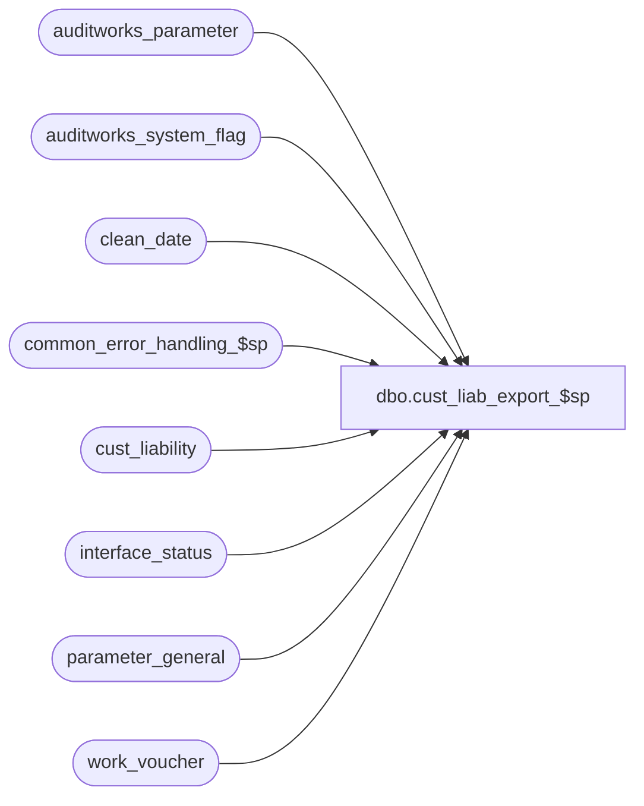

# dbo.cust_liab_export_$sp

**Database:** auditworks  
**Server:** bedrockdb01  

## Architecture Diagram



## Table Dependencies

| Referenced Table |
|---|
| auditworks_parameter |
| auditworks_system_flag |
| clean_date |
| common_error_handling_$sp |
| cust_liability |
| interface_status |
| parameter_general |
| work_voucher |

## Stored Procedure Code

```sql
create proc dbo.cust_liab_export_$sp 

@process_no	tinyint

AS


/*
PROC NAME:   cust_liab_export_$sp
PROC DESC:   Populates work_voucher table when the cust_liability vouchers have been 
             affected by transaction processing since the last export.
             Uses the amounts in pos columns in cust_liability table.
             CALLED BY:
             1. export_glc_pos_$sp for Interstore Tracking (ICT_EXPORT) 
             2. separate_server_export_$sp for Voucher on Separate Server (ICT_EXPORT, ADHOC)
             3. export_interstore_tracking_$sp (ICT_VOUCHER).

HISTORY
Date      Name         Def#  Desc
Jan04,11  Paul       105313  Use unicode datatypes
Mar04,04  Phu       1-UN8TL  voucher_export is not truncated causing duplicate in export_glc_pos_$sp and export_interstore_tracking_$sp.
Apr02,03  David     1-JVR21  Remove @errmsg from parameters passed in.
Jan30,03  Daphna       5857  when voucher = 2 (separate server) allow immediate synch request
                             to generate export file even when no changes since last export 
                             in order to trigger export of exceptions from voucher server 
                             back to SA server
Jan17,03  ShuZ      1-HZ3U2  Change double quote to single quote
NOV26,02  Daphna    1-GWDGT  ensure correct result when interface_status not populated 
MAY29,02  Daphna    1-CYE1P  export multi_currency setting for use by Service Desk on Separate Server
APR30,02  Daphna    1-BMK21  ensure correct vouchers are exported when combo: same server and 
                             some offline stores
                             use clean_date for Multi Db
JAN22,02  Daphna      8415   author
*/
 
DECLARE
     @clean_date		smalldatetime,
     @current_export_time	smalldatetime,
     @errno			int,
     @errmsg			nvarchar(255),
     @offline_stores_exist	tinyint,  
     @last_export_time 		smalldatetime,
     @last_modified_time	smalldatetime,
     @log_error_flag		tinyint,
     @message_id		int,
     @multi_currency		tinyint,
     @process_name		nvarchar(100),
     @object_name		nvarchar(255),
     @online_stores_exist	tinyint,
     @operation_name		nvarchar(100),
     @voucher			tinyint

SELECT @current_export_time = getdate()

SELECT @voucher = glc_postable_used,
       @offline_stores_exist = glc_export_used
FROM parameter_general

--  exit immediately if there is no voucher or 
--  if voucher on same server and no offine stores

IF @voucher = 0
  RETURN
ELSE
BEGIN  -- assumes @voucher = 1 OR 2 
  IF @offline_stores_exist = 0 AND @voucher = 1
    RETURN
END

SELECT @process_name = 'cust_liab_export_$sp',
       @message_id = 201068,
       @log_error_flag = 1  -- called by smartload

  
SELECT @last_modified_time = flag_datetime_value
  FROM auditworks_system_flag
 WHERE flag_name = 'voucher_last_modified'

SELECT @last_export_time = flag_datetime_value
  FROM auditworks_system_flag
 WHERE flag_name = 'voucher_last_exported' 

-- do not export if no changes since last export
-- DEF 5857: do not export when same server ONLY 
IF (@last_export_time > @last_modified_time OR @last_modified_time IS NULL) AND @voucher = 1
  RETURN
  
-- do not export if less than 1 day since last export and no immediate export requested
IF @last_export_time IS NOT NULL -- not first export
BEGIN 
  IF (DATEADD(dd, 1, @last_export_time) > @current_export_time)  -- less than 1 day elapsed
  BEGIN
    -- 1-GWDGT: ensure return when table not populated
    IF (SELECT COUNT(immediate_posting_requested)
        FROM interface_status
        WHERE interface_id = 30
        AND immediate_posting_requested = 1) = 0   -- not requested
      RETURN
  END
END

-- are there any online stores
SELECT @online_stores_exist = CONVERT(tinyint, flag_numeric_value)
  FROM auditworks_system_flag
 WHERE flag_name = 'auditworks_cleandate_used'

SELECT @errno = @@error
IF @errno !=0 
BEGIN
  SELECT @errmsg = '@online_stores_exist',
         @object_name = 'auditworks_system_flag',
         @operation_name = 'SELECT'
  GOTO error
END 

TRUNCATE TABLE work_voucher
SELECT @errno = @@error
IF @errno != 0
BEGIN
  SELECT @errmsg = 'Unable to truncate table work_voucher',
         @object_name = 'work_voucher',
         @operation_name = 'TRUNCATE'
  GOTO error
END

IF @voucher = 2  -- resides on separate server
BEGIN

/* export to Separate Server a  header row with clean date and export-to-offline flag 
  In the separate server case the separate server calling proc will have already set 
  the clean date and clean date used 
  DEF 1-BMK21: Use clean_date MIN value for earliest cleandate for Multi Db
  */

  SELECT @clean_date = MIN(clean_date)
    FROM clean_date

  SELECT @errno = @@error
  IF @errno !=0 
  BEGIN
     SELECT @errmsg = '@clean_date = MIN (clean_date)',
            @object_name = 'clean_date',
            @operation_name = 'SELECT'
     GOTO error
  END 
  
  SELECT @multi_currency = convert(tinyint, par_value)
  FROM  auditworks_parameter
  WHERE par_name = 'multi_currency'

  SELECT @errno = @@error
  IF @errno !=0 
  BEGIN
     SELECT @errmsg = '@multi_currency',
            @object_name = 'auditworks_parameter',
            @operation_name = 'SELECT'
     GOTO error
  END 
  
  -- DEF 1-CYE1P: convert @clean_date to nvarchar
    
  INSERT INTO work_voucher
         (reference_type, 
         reference_no, 
         key_store_no,       
         date_issued, 
         entry_type,
         pos_status,
         issuing_store_no,
         synch_flag) 
  VALUES (0, '0', 0, @clean_date, 
          'X', @offline_stores_exist, @online_stores_exist,
          @multi_currency)       
  
  SELECT @errno = @@error
  IF @errno <> 0
  BEGIN
    SELECT @errmsg = 'header row',
           @object_name = 'work_voucher',
           @operation_name = 'INSERT'
    GOTO error       
  END
END

IF @last_export_time IS NOT NULL --not first time      
BEGIN
  IF (@voucher = 2 OR @online_stores_exist = 0)
  BEGIN
    /* in these scenaria, the column last_updated_by_pos is never updated, 
       so it doesn't need to be considered in the export
       the pos columns are automatically updated by AW, so the columns last_synched
       and last_modified_by_aw are always the same. We use last_modified_by_aw in the 
       insert because this field has an index
     */
    
    INSERT INTO work_voucher
         (reference_type, 
         reference_no, 
         key_store_no, 
         issuing_store_no, 
         date_issued,
         title,
         first_name,
         last_name,
         address_1,
         address_2,
         city,
         county,
         state,
         post_code,
         telephone_no1,
         telephone_no2,
         customer_no,
         pos_tax_jurisdiction_code,
         fax,
         email_address,       
         synch_flag,   
         pos_status, 
         pos_amount_1, 
         pos_amount_2,
         pos_amount_3,
         as_of_date, 
         entry_type)
    SELECT reference_type, 
         reference_no, 
         key_store_no, 
         issuing_store_no, 
         date_issued,
         title,
         first_name,
         last_name,
         address_1,
         address_2,
         city,
         county,
         state,
         post_code,
         telephone_no1,
         telephone_no2,
         customer_no,
         pos_tax_jurisdiction_code,
         fax,
         email_address,              
         2 - ABS(stocked_stolen_flag + forfeited_flag + stolen_from_cust_flag), -- 1 = stolen or forfeit(partial synch), 2 = ok (full synch)
         pos_status, 
         pos_amount_1, 
         pos_amount_2, 
         pos_amount_3,
         last_modified_by_aw, 
         'I'
      FROM cust_liability  -- using index on this column
     WHERE last_modified_by_aw >= @last_export_time    
       AND last_modified_by_aw < @current_export_time

    SELECT @errno = @@error
    IF @errno <> 0
    BEGIN
      SELECT @errmsg = 'vouchers on separate server or all offline',
             @object_name = 'work_voucher',
             @operation_name = 'INSERT'
      GOTO error       
    END  
  END  -- separate server OR no online stores
  
  -- same server AND offline stores exist is a requirement for the export (see above)  
  IF (@voucher = 1 AND @online_stores_exist = 1)      
    /* in this scenario, the POS in updating the cust_liability table, so the field
        last_updated_by_pos must also be considered in determining which vouchers
        are exported
        because of the OR operator, the index is not used (less efficient) */    
  BEGIN
    INSERT INTO work_voucher
         (reference_type, 
         reference_no, 
         key_store_no, 
         issuing_store_no, 
         date_issued,
         title,
         first_name,
         last_name,
         address_1,
         address_2,
         city,
         county,
         state,
         post_code,
         telephone_no1,
         telephone_no2,
         customer_no,
         pos_tax_jurisdiction_code,
         fax,
         email_address,       
         synch_flag,   
         pos_status, 
         pos_amount_1, 
         pos_amount_2,
         pos_amount_3,
         as_of_date,
         entry_type)
    SELECT reference_type, 
         reference_no, 
         key_store_no, 
         issuing_store_no, 
         date_issued,
         title,
         first_name,
         last_name,
         address_1,
         address_2,
         city,
         county,
         state,
         post_code,
         telephone_no1,
         telephone_no2,
         customer_no,
         pos_tax_jurisdiction_code,
         fax,
         email_address,              
         2 - ABS(stocked_stolen_flag + forfeited_flag + stolen_from_cust_flag), -- 1 = stolen or forfeit(partial synch), 2 = ok (full synch)
         pos_status, 
         pos_amount_1, 
         pos_amount_2, 
         pos_amount_3,
         last_modified_by_aw, 
         'I'
      FROM cust_liability -- will do full scan
     WHERE (last_synched >= @last_export_time    
            AND last_synched < @current_export_time)
        OR (last_modified_by_pos >= @last_export_time
          AND last_modified_by_pos <@current_export_time)
            
    SELECT @errno = @@error
    IF @errno <> 0
    BEGIN
      SELECT @errmsg = 'vouchers on same server AND some offline',
             @object_name = 'work_voucher',
             @operation_name = 'INSERT'
      GOTO error       
    END    
  END  -- same server and offline stores exist  
END  -- not null
ELSE
BEGIN   -- first export
  INSERT INTO work_voucher
       (reference_type, 
       reference_no, 
       key_store_no, 
       issuing_store_no, 
       date_issued,
       title,
       first_name,
       last_name,
       address_1,
       address_2,
       city,
       county,
       state,
       post_code,
       telephone_no1,
       telephone_no2,
       customer_no,
       pos_tax_jurisdiction_code,
       fax,
       email_address,       
       synch_flag,   
       pos_status, 
       pos_amount_1, 
       pos_amount_2,
       pos_amount_3,
       as_of_date, 
       entry_type)
  SELECT reference_type, 
       reference_no, 
       key_store_no, 
       issuing_store_no, 
       date_issued,
       title,
       first_name,
       last_name,
       address_1,
       address_2,
       city,
       county,
       state,
       post_code,
       telephone_no1,
       telephone_no2,
       customer_no,
       pos_tax_jurisdiction_code,
       fax,
       email_address,              
       2 - ABS(stocked_stolen_flag + forfeited_flag + stolen_from_cust_flag), -- 1 = stolen or forfeit(partial synch), 2 = ok (full synch)
       pos_status, 
       pos_amount_1, 
       pos_amount_2, 
       pos_amount_3,
       last_modified_by_aw,
       'I'
    FROM cust_liability
   WHERE (last_modified_by_aw < @current_export_time OR last_modified_by_aw IS NULL)
   AND (last_modified_by_pos < @current_export_time OR last_modified_by_pos IS NULL)
   AND (last_synched < @current_export_time OR last_synched IS NULL)

  SELECT @errno = @@error
  IF @errno <> 0
  BEGIN
    SELECT @errmsg = 'first time',
           @object_name = 'work_voucher',
           @operation_name = 'INSERT'
    GOTO error       
  END
END   

-- move update auditworks_system_flag to calling procedure


RETURN

error:  
	
	EXEC common_error_handling_$sp @process_no, @errno, @errmsg, 0, @message_id, 
	@process_name, @object_name, @operation_name, @log_error_flag

	RETURN
```

